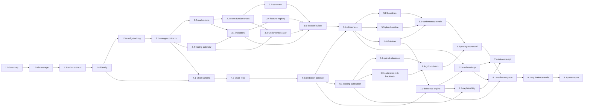

# Roadmap — Previsão Probabilística de Retornos Financeiros (TFT)

> **Documento vivo.** Cada Stage ganha `concept.md` + `technical.md` próprios depois de iniciada (Fase 3A/3B). Regra dura: ao marcar uma Stage `done`, atualizar `updated_at` + `last_reviewed_at` no mesmo merge.
>
> **Hierarquia (ver [`PIPELINE.md`](./PIPELINE.md) §4):**
> - **Step:** entrega de negócio. Sem restrição arquitetural. Agrupa Stages.
> - **Stage:** unidade atômica concept → technical → execução. 1 foco coeso, 1 DoD testável, 1 bounded context, complexidade ≤ M. Vira branch `feat/<num-issue>-<N-M>-<slug>`.
> - **Task:** 1 commit. Vive no `technical.md` da Stage.
>
> **Restrições arquiteturais herdadas** (não-negociáveis, vêm do overview §6/§7 e dos ADRs `0_0_*`):
> - Hexagonal **enforçado por ferramenta**: import-linter espelha o LAYOUT; o build quebra se o **domínio importar pandas/pyarrow/torch** ou se a dependência apontar pra fora.
> - **Estatística vive no domínio**, como serviços puros sobre value objects (`PairedLossSeries`, `QuantileForecast`, `CoverageSeries`); bibliotecas (`arch`/`statsmodels`/`sklearn`/`scoringrules`/`MAPIE`) vivem em adapters.
> - Testes de regressão **por unidade + oráculo** (fixture analítica + lib/R), nunca snapshot global byte-idêntico.
> - Medalhão **bronze/silver/gold**; silver Parquet = fonte da verdade; gold reconstruível sem re-treino.
> - Anti-leakage **não-negociável**: features causais, as-of backward, tipagem known/unknown, embargo.
> - Pré-registro imutável hasheado antes do confirmatório; métricas **nunca agregadas entre horizontes**.
> - Cobertura ≥ 90%, mypy --strict, import-linter verdes como gate de CI.
>
> **Convenções deste roadmap:** `ROADMAP-1` libera Stages com **mais Tasks** que o guideline 3–8 (até ~12–15), pois as decisões já estão tomadas (menos ambiguidade por Task); os 5 critérios de atomicidade permanecem. Pacote Python: `financial_forecasting`.

## Visão geral — dependências entre Stages



## Tabela de Steps

| ID | Step | Resultado de negócio | Status | Stages |
|---|---|---|---|---|
| 1 | Fundação e fitness arquitetural | Repo hexagonal com fronteiras enforçadas (import-linter, mypy strict, cobertura ≥90%), identidade determinística, config e tracking — a base que faltava | done | 1.1–1.5 |
| 2 | Camada bronze + calendário | Dados brutos expostos por adapters limpos; calendário de pregão; contratos de storage medalhão | done | 2.1–2.4 |
| 3 | Feature engineering e dataset | Dataset TFT reconstruído com features causais (indicadores validados, sentimento, fundamentos as-of, derivadas) + contratos anti-leakage | done | 3.1–3.5 |
| 4 | Analytics store (silver) | Silver modular (schema por tabela), repositório append-only, persister único de predições multi-horizonte | done | 4.1–4.3 |
| 5 | Modelagem, baselines e treino | TFT re-treinado + GBM quantílico + baselines naive/estatísticos sobre walk-forward purgado/embargoado; cohort confirmatório AAPL | in_progress | 5.1–5.5 |
| 6 | Núcleo estatístico confirmatório | Pipeline gold confirmatória: pinball/CRPS/DM/MCS/Holm/PICP-Christoffersen + gates + scorecard pré-registrado, no domínio e validada por oráculo | not_started | 6.1–6.5 |
| 7 | Inferência, conformal, explicabilidade e API | Motor de inferência + conformal CQR (benchmark) + explicabilidade (VSN/permutação/ablação) servidos por API fina | not_started | 7.1–7.4 |
| 8 | Reprodução, equivalência e relatório | Protocolo completo em AAPL; equivalência vs evidência anterior auditada; plots e dossiê de rastreabilidade | not_started | 8.1–8.3 |

**Legenda de status (Step):** `not_started`, `in_progress`, `blocked`, `done`, `deprecated`.

## Tabela de Stages

| Stage | BC | Camada-alvo | Tipo | Status | Depende de |
|---|---|---|---|---|---|
| `1.1-bootstrap` | shared | bootstrap | mono | done | — |
| `1.2-ci-coverage` | shared | bootstrap (ci) | mono | done | 1.1 |
| `1.3-architecture-contracts` | shared | bootstrap (import-linter) | mono | done | 1.2 |
| `1.4-identity-and-fingerprints` | shared | domain + application | vertical | done | 1.3 |
| `1.5-config-and-tracking` | shared | shared/infrastructure + bootstrap | mono | done | 1.4 |
| `2.1-medallion-storage-contracts` | shared | adapters/out + shared | vertical | done | 1.5 |
| `2.2-market-data-ingestion` | market_data | multi (application + adapters/out) | vertical | done | 2.1 |
| `2.3-news-fundamentals-ingestion` | market_data | multi (application + adapters/out) | vertical | done | 2.2 |
| `2.4-trading-calendar` | shared | domain + adapters/out | vertical | done | 2.1 |
| `3.1-technical-indicators` | feature_engineering | multi (domain + adapters/out) | vertical | done | 2.2, 2.4 |
| `3.2-sentiment-finbert` | feature_engineering | multi (application + adapters/out) | vertical | done | 2.3 |
| `3.3-fundamentals-asof-join` | feature_engineering | multi (domain + adapters/out) | vertical | done | 2.3, 2.4 |
| `3.4-feature-registry-and-derived` | feature_engineering | domain | mono | done | 3.1 |
| `3.5-dataset-builder-and-contracts` | feature_engineering | multi (application + adapters/out) | vertical | done | 3.1, 3.2, 3.3, 3.4 |
| `4.1-silver-schema-per-table` | analytics_store | infrastructure/schemas + domain | vertical | done | 1.4, 2.1 |
| `4.2-silver-repository` | analytics_store | adapters/out | vertical | done | 4.1 |
| `4.3-prediction-persister` | analytics_store | domain + application | vertical | done | 4.2 |
| `5.1-walk-forward-harness` | modeling | domain + application | vertical | done | 3.5, 4.3 |
| `5.2-baselines-naive-statistical` | modeling | multi (domain + application + adapters/out) | vertical | done | 5.1 |
| `5.3-gbm-quantile-baseline` | modeling | multi (application + adapters/out) | vertical | done | 5.1 |
| `5.4-tft-trainer` | modeling | multi (application + adapters/out) | vertical | done | 5.1 |
| `5.5-confirmatory-retrain` | modeling | application (orquestração) | vertical | draft | 5.2, 5.3, 5.4 |
| `6.1-scoring-and-calibration-metrics` | evaluation | multi (domain + adapters/out) | vertical | draft | 4.3 |
| `6.2-paired-inference-dm-mcs-holm` | evaluation | multi (domain + adapters/out) | vertical | draft | 6.1 |
| `6.3-calibration-risk-backtests` | evaluation | multi (domain + adapters/out) | vertical | draft | 6.1 |
| `6.4-gold-builders-and-quality-gates` | evaluation | multi (domain + application + adapters/out) | vertical | draft | 6.2, 6.3 |
| `6.5-preregistration-and-scorecard` | evaluation | multi (domain + application) | vertical | draft | 6.4, 5.5 |
| `7.1-inference-engine` | inference | multi (application + adapters/out) | vertical | draft | 5.4, 4.3 |
| `7.2-conformal-cqr` | inference | multi (domain + adapters/out) | vertical | draft | 7.1, 5.1 |
| `7.3-explainability` | inference | multi (domain + adapters/out) | vertical | draft | 7.1, 6.1 |
| `7.4-inference-api` | inference | adapters/in/http | vertical | draft | 7.2, 7.3 |
| `8.1-confirmatory-run` | evaluation | application (orquestração) | vertical | draft | 6.5, 7.1, 7.2 |
| `8.2-equivalence-audit` | evaluation | application + tests | vertical | draft | 8.1 |
| `8.3-plots-and-final-report` | evaluation | adapters/out + docs | vertical | draft | 8.2 |

**Legenda de status (Stage):** `draft`, `in_progress`, `review`, `done`, `archived`.

---

## Detalhamento por Step

### Step 1 — Fundação e fitness arquitetural

Entrega o esqueleto Python hexagonal com as fronteiras **verificadas por ferramenta** — exatamente o que faltava no projeto anterior e causou a degradação. Inclui a identidade determinística (`run_id`/fingerprints) e o tracking, e registra os ADRs de fundação (`0_0_0002`…`0_0_0026`). **Resultado de negócio:** "qualquer mudança que viole arquitetura/cobertura é barrada automaticamente antes do merge".

- **Depende de:** —
- **Tamanho estimado:** M
- **Status:** `not_started`

#### Stage 1.1 — `1.1-bootstrap`

**Descrição humana:** Inicializar o repositório (pyproject/uv, ruff, mypy strict, pytest), estrutura hexagonal vazia (`features/`, `shared/`), Makefile, `scripts/check_layout.py`, e autorar os ADRs de fundação derivados do overview §11.

**Descrição para IA:**
```yaml
stage_id: 1.1-bootstrap
bounded_context: shared
camada_alvo: bootstrap
arquivos_a_criar:
  - pyproject.toml
  - Makefile
  - README.md
  - .pre-commit-config.yaml
  - scripts/check_layout.py
  - src/financial_forecasting/{__init__.py, shared/domain/__init__.py, shared/application/__init__.py, shared/infrastructure/__init__.py, features/__init__.py}
  - tests/test_smoke.py
  - docs/adr/0_0_0002-probabilistic-calibration-framing.md
  - docs/adr/0_0_0019-hexagonal-enforced.md
  - docs/adr/0_0_0020-statistics-in-domain-over-value-objects.md
  - docs/adr/0_0_0021-per-unit-contract-tests-with-oracle.md
arquivos_a_modificar: []
contratos_introduzidos: []
contratos_consumidos: []
definition_of_done: "`make setup && make check && make test` verde em máquina limpa; smoke test importa os pacotes do hexagonal; ADRs de fundação commitados."
non_goals: [features de negócio, CI (1.2), import-linter contracts (1.3)]
complexidade_estimada: M
gate_mode: strict
skills_hint: [hex-arch-python, import-linter-rules]
```

#### Stage 1.2 — `1.2-ci-coverage`

**Descrição humana:** Workflow GitHub Actions rodando `make check && make test` em todo PR, com gate de cobertura ≥ 90% (`fail_under` no pyproject) e import-linter no CI. Validar com erro intencional revertido.

**Descrição para IA:**
```yaml
stage_id: 1.2-ci-coverage
bounded_context: shared
camada_alvo: bootstrap
arquivos_a_criar: [.github/workflows/ci.yml]
arquivos_a_modificar: [pyproject.toml, README.md]
contratos_introduzidos: []
contratos_consumidos: []
definition_of_done: "PR que quebra lint, types, testes, cobertura<90% ou contrato de import falha no CI antes do merge (validado com quebra intencional revertida)."
non_goals: [deploy/release, cache de deps, matrix de versões]
complexidade_estimada: S
gate_mode: strict
skills_hint: [import-linter-rules]
```

#### Stage 1.3 — `1.3-architecture-contracts`

**Descrição humana:** Contratos import-linter espelhando o LAYOUT — em especial o **domínio proibido de importar pandas/pyarrow/torch** e a direção de dependência (adapters → application → domain). É a fitness function central do refactor.

**Descrição para IA:**
```yaml
stage_id: 1.3-architecture-contracts
bounded_context: shared
camada_alvo: bootstrap
arquivos_a_criar: [.importlinter, docs/LAYOUT.md, tests/architecture/test_import_contracts.py]
arquivos_a_modificar: [pyproject.toml, .github/workflows/ci.yml]
contratos_introduzidos: []
contratos_consumidos: []
definition_of_done: "import-linter falha o build se domain importar pandas/pyarrow/torch ou se a direção de dependência for violada; contrato roda no CI."
non_goals: [implementar features, regras específicas de BC ainda inexistentes]
complexidade_estimada: M
gate_mode: strict
skills_hint: [import-linter-rules, hex-arch-python]
```

#### Stage 1.4 — `1.4-identity-and-fingerprints`

**Descrição humana:** Identidade determinística como value objects de domínio (`RunId`, `DatasetFingerprint`, `ConfigSignature`, `SplitFingerprint`) + adapter de hashing canônico (sha256 sobre JSON ordenado). Base de toda a rastreabilidade.

**Descrição para IA:**
```yaml
stage_id: 1.4-identity-and-fingerprints
bounded_context: shared
camada_alvo: multi (domain + application)
arquivos_a_criar:
  - src/financial_forecasting/shared/domain/value_objects/{run_id.py, dataset_fingerprint.py, config_signature.py, split_fingerprint.py}
  - src/financial_forecasting/shared/application/ports/out/hasher.py
  - src/financial_forecasting/shared/adapters/out/hashing/canonical_json_hasher.py
  - tests/unit/shared/domain/test_identity_value_objects.py
  - tests/contract/shared/test_hasher_contract.py
contratos_introduzidos:
  - RunId, DatasetFingerprint, ConfigSignature, SplitFingerprint (value-object)
  - Hasher (port-out)
contratos_consumidos: []
definition_of_done: "Mesmo conjunto canônico de campos sempre produz o mesmo `run_id`/fingerprint (determinístico, testado); float/NaN/datetime canonicalizados."
non_goals: [persistência (Step 4), schemas de tabela (4.1)]
complexidade_estimada: M
gate_mode: strict
skills_hint: [ddd-tactical-patterns, hex-arch-python, pytest-with-fakes]
```

#### Stage 1.5 — `1.5-config-and-tracking`

**Descrição humana:** Config tipada (`pydantic-settings`) lendo env/arquivos, composition root inicial, e adapter de tracking MLflow (backend SQLite local) atrás de um port `ExperimentTracker`.

**Descrição para IA:**
```yaml
stage_id: 1.5-config-and-tracking
bounded_context: shared
camada_alvo: shared/infrastructure + bootstrap
arquivos_a_criar:
  - src/financial_forecasting/shared/infrastructure/config/settings.py
  - src/financial_forecasting/composition_root.py
  - src/financial_forecasting/shared/application/ports/out/experiment_tracker.py
  - src/financial_forecasting/shared/adapters/out/mlflow/mlflow_tracker.py
  - tests/unit/shared/infrastructure/test_settings.py
  - tests/contract/shared/test_experiment_tracker_contract.py
contratos_introduzidos: [Settings, ExperimentTracker (port-out)]
contratos_consumidos: [Hasher (1.4)]
definition_of_done: "`Settings` carrega de env/.env validando tipos; `MlflowTracker` registra um run local (SQLite) e um fake passa o mesmo contract test."
non_goals: [DVC, hydra, servidor MLflow remoto]
complexidade_estimada: M
gate_mode: strict
skills_hint: [composition-root, hex-arch-python, pytest-with-fakes]
```

---

### Step 2 — Camada bronze + calendário

Expõe os dados brutos de AAPL por adapters limpos sobre o port de storage medalhão, e entrega o calendário de pregão (sessões/feriados) necessário para o embargo do walk-forward. **Resultado de negócio:** "os dados brutos passam a ser lidos/gravados por uma interface auditável, e o calendário correto elimina uma fonte silenciosa de leakage".

- **Depende de:** Step 1.
- **Tamanho estimado:** M

#### Stage 2.1 — `2.1-medallion-storage-contracts`

**Descrição humana:** Port `MedallionStore` (ler/gravar datasets particionados em Parquet) + adapter pyarrow/duckdb + contratos de schema bronze via `pandera`. Define a convenção de partição (asset + chaves de alta cardinalidade) e append-only em fatos.

**Descrição para IA:**
```yaml
stage_id: 2.1-medallion-storage-contracts
bounded_context: shared
camada_alvo: multi (application + adapters/out)
arquivos_a_criar:
  - src/financial_forecasting/shared/application/ports/out/medallion_store.py
  - src/financial_forecasting/shared/adapters/out/parquet/parquet_medallion_store.py
  - src/financial_forecasting/shared/adapters/out/parquet/schemas/bronze_schemas.py
  - tests/contract/shared/test_medallion_store_contract.py
  - tests/integration/shared/adapters/out/parquet/test_parquet_medallion_store.py
contratos_introduzidos: [MedallionStore (port-out), bronze pandera schemas]
contratos_consumidos: [Settings (1.5)]
definition_of_done: "Gravar/ler um dataset particionado por asset em Parquet preserva schema (validado por pandera); leitura por partição filtra por asset; fake in-memory passa o contract test."
non_goals: [DuckDB para gold (Step 6), schemas silver (4.1)]
complexidade_estimada: M
gate_mode: strict
skills_hint: [repository-pattern, hex-arch-python, dmls-ch02-data-infrastructure-decisions]
```

#### Stage 2.2 — `2.2-market-data-ingestion`

**Descrição humana:** Port `CandleFetcher` + adapter yfinance + use case que ingere candles diários de AAPL para bronze (reusa o raw existente; re-ingestão pontual possível). DQ de OHLC (high≥low, sem nulos/dups).

**Descrição para IA:**
```yaml
stage_id: 2.2-market-data-ingestion
bounded_context: market_data
camada_alvo: multi (application + adapters/out)
arquivos_a_criar:
  - src/financial_forecasting/features/market_data/domain/entities/candle.py
  - src/financial_forecasting/features/market_data/application/ports/out/candle_fetcher.py
  - src/financial_forecasting/features/market_data/application/use_cases/ingest_candles.py
  - src/financial_forecasting/features/market_data/adapters/out/yfinance/yfinance_candle_fetcher.py
  - tests/fakes/features/market_data/in_memory_candle_fetcher.py
  - tests/unit/features/market_data/application/test_ingest_candles.py
  - tests/integration/features/market_data/adapters/out/yfinance/test_yfinance_candle_fetcher.py
contratos_introduzidos: [Candle (entity), CandleFetcher (port-out), IngestCandles (use case)]
contratos_consumidos: [MedallionStore (2.1)]
definition_of_done: "`IngestCandles` grava candles de AAPL em bronze com invariantes OHLC validadas; fake passa contract test; reusa raw existente sem re-baixar por padrão."
non_goals: [intervalos != 1d, ativos != AAPL agora, append incremental sofisticado]
complexidade_estimada: M
gate_mode: strict
skills_hint: [repository-pattern, hex-arch-python, pytest-with-fakes]
```

#### Stage 2.3 — `2.3-news-fundamentals-ingestion`

**Descrição humana:** Ports + adapters Alpha Vantage para news e fundamentals (4 endpoints) → bronze, com throttle e dedup. Entidades `NewsArticle` e `FundamentalReport`.

**Descrição para IA:**
```yaml
stage_id: 2.3-news-fundamentals-ingestion
bounded_context: market_data
camada_alvo: multi (application + adapters/out)
arquivos_a_criar:
  - src/financial_forecasting/features/market_data/domain/entities/{news_article.py, fundamental_report.py}
  - src/financial_forecasting/features/market_data/application/ports/out/{news_fetcher.py, fundamental_fetcher.py}
  - src/financial_forecasting/features/market_data/application/use_cases/{ingest_news.py, ingest_fundamentals.py}
  - src/financial_forecasting/features/market_data/adapters/out/alpha_vantage/{alpha_vantage_news_fetcher.py, alpha_vantage_fundamental_fetcher.py}
  - tests/fakes/features/market_data/{in_memory_news_fetcher.py, in_memory_fundamental_fetcher.py}
  - tests/integration/features/market_data/adapters/out/alpha_vantage/test_alpha_vantage_fetchers.py
contratos_introduzidos: [NewsArticle, FundamentalReport (entities), NewsFetcher, FundamentalFetcher (ports-out)]
contratos_consumidos: [MedallionStore (2.1)]
definition_of_done: "News e fundamentals de AAPL gravados em bronze com dedup (article_id) e throttle de free-tier; fakes passam contract tests."
non_goals: [providers além de Alpha Vantage, sentimento (3.2), ratios derivados (3.3)]
complexidade_estimada: M
gate_mode: strict
skills_hint: [repository-pattern, hex-arch-python, dmls-ch02-data-infrastructure-decisions]
```

#### Stage 2.4 — `2.4-trading-calendar`

**Descrição humana:** Serviço de domínio `TradingCalendar` (sessões válidas, feriados NYSE/NASDAQ, mapeamento timestamp→dia de pregão) sobre `exchange-calendars`. Base para agregação por dia de pregão e para o embargo.

**Descrição para IA:**
```yaml
stage_id: 2.4-trading-calendar
bounded_context: shared
camada_alvo: multi (domain + adapters/out)
arquivos_a_criar:
  - src/financial_forecasting/shared/domain/services/trading_calendar.py
  - src/financial_forecasting/shared/application/ports/out/exchange_calendar_provider.py
  - src/financial_forecasting/shared/adapters/out/calendar/exchange_calendars_provider.py
  - tests/unit/shared/domain/test_trading_calendar.py
  - tests/contract/shared/test_exchange_calendar_provider_contract.py
contratos_introduzidos: [TradingCalendar (domain-service), ExchangeCalendarProvider (port-out)]
contratos_consumidos: []
definition_of_done: "`TradingCalendar` resolve sessões válidas e feriados de XNYS; mapeia timestamp→dia de pregão; offset de N dias de pregão para embargo testado contra fixtures."
non_goals: [calendários 24/7 (cripto), intraday]
complexidade_estimada: M
gate_mode: strict
skills_hint: [ddd-tactical-patterns, hex-arch-python]
```

---

### Step 3 — Feature engineering e dataset

Reconstrói o dataset TFT com as 4 famílias de features, todas **causais e validadas contra o paper**, e os contratos anti-leakage. **Resultado de negócio:** "o dataset de treino é auditável feature a feature, com causalidade garantida — pré-condição de qualquer claim".

- **Depende de:** Step 2.
- **Tamanho estimado:** M–L (5 Stages)

#### Stage 3.1 — `3.1-technical-indicators`

**Descrição humana:** Indicadores técnicos causais via `pandas-ta-classic`, **cada um validado contra a fórmula canônica do paper** (RSI de Wilder, MACD, EMAs, volatilidades) por teste de fixture, + teste de leakage (indicador em t inalterado ao anexar barras futuras).

**Descrição para IA:**
```yaml
stage_id: 3.1-technical-indicators
bounded_context: feature_engineering
camada_alvo: multi (domain + adapters/out)
arquivos_a_criar:
  - src/financial_forecasting/features/feature_engineering/domain/services/indicator_spec.py
  - src/financial_forecasting/features/feature_engineering/application/ports/out/indicator_calculator.py
  - src/financial_forecasting/features/feature_engineering/adapters/out/pandas_ta/pandas_ta_indicator_calculator.py
  - tests/unit/features/feature_engineering/test_indicator_canonical_formulas.py
  - tests/unit/features/feature_engineering/test_indicator_leakage.py
contratos_introduzidos: [IndicatorSpec (value-object), IndicatorCalculator (port-out)]
contratos_consumidos: [MedallionStore (2.1)]
definition_of_done: "RSI/EMA/MACD/volatilidades batem com a fórmula canônica em fixture analítica; teste de leakage verde; valores em float32 gravados em bronze->processed."
non_goals: [indicadores de microestrutura/cripto (futuro), seleção de features]
complexidade_estimada: M
gate_mode: strict
skills_hint: [hex-arch-python, dmls-ch04-feature-engineering-decisions, pytest-with-fakes]
```

#### Stage 3.2 — `3.2-sentiment-finbert`

**Descrição humana:** Sentimento via FinBERT **version-pinned** (revisão HF fixada): score por artigo (`P(pos)-P(neg)`), agregado por **dia de pregão** (via `TradingCalendar`), com guarda de causalidade (cutoff de publicação).

**Descrição para IA:**
```yaml
stage_id: 3.2-sentiment-finbert
bounded_context: feature_engineering
camada_alvo: multi (application + adapters/out)
arquivos_a_criar:
  - src/financial_forecasting/features/feature_engineering/application/ports/out/sentiment_model.py
  - src/financial_forecasting/features/feature_engineering/application/use_cases/score_and_aggregate_sentiment.py
  - src/financial_forecasting/features/feature_engineering/adapters/out/finbert/finbert_sentiment_model.py
  - tests/fakes/features/feature_engineering/in_memory_sentiment_model.py
  - tests/unit/features/feature_engineering/test_sentiment_aggregation.py
  - tests/integration/features/feature_engineering/adapters/out/finbert/test_finbert_sentiment_model.py
contratos_introduzidos: [SentimentModel (port-out), ScoreAndAggregateSentiment (use case)]
contratos_consumidos: [MedallionStore (2.1), TradingCalendar (2.4)]
definition_of_done: "FinBERT (revisão pinada) gera score por artigo; agregação por dia de pregão respeita cutoff de publicação (sem usar artigo futuro); fake passa contract test."
non_goals: [modelos de sentimento cripto, calibração do score]
complexidade_estimada: M
gate_mode: strict
skills_hint: [hex-arch-python, dmls-ch04-feature-engineering-decisions, repository-pattern]
```

#### Stage 3.3 — `3.3-fundamentals-asof-join`

**Descrição humana:** Junção as-of **backward** dos fundamentals na grade diária, com `effective_date = reported_date or (fiscal_date_end + fallback declarado)`; invariante que **falha se** uma data efetiva for futura ao dia. Ratios derivados (margem, alavancagem, etc.).

**Descrição para IA:**
```yaml
stage_id: 3.3-fundamentals-asof-join
bounded_context: feature_engineering
camada_alvo: multi (domain + adapters/out)
arquivos_a_criar:
  - src/financial_forecasting/features/feature_engineering/domain/services/fundamentals_asof_policy.py
  - src/financial_forecasting/features/feature_engineering/adapters/out/duckdb/asof_join_adapter.py
  - tests/unit/features/feature_engineering/test_fundamentals_asof_policy.py
  - tests/unit/features/feature_engineering/test_asof_anti_leakage_invariant.py
contratos_introduzidos: [FundamentalsAsofPolicy (domain-service), AsofJoinAdapter (port-out)]
contratos_consumidos: [MedallionStore (2.1), TradingCalendar (2.4)]
definition_of_done: "as-of backward com fallback pré-declarado; invariante 'effective_date <= date' levanta erro quando violada; ratios derivados corretos em fixture."
non_goals: [on-chain/cripto, modelagem de surpresa de earnings sofisticada]
complexidade_estimada: M
gate_mode: strict
skills_hint: [hex-arch-python, dmls-ch04-feature-engineering-decisions]
```

#### Stage 3.4 — `3.4-feature-registry-and-derived`

**Descrição humana:** Registro de features como domínio puro — `FeatureSpec` (nome, família, fonte, fórmula, **tag de causalidade obrigatória**, warmup, dtype, política de nulo, tipagem **known/unknown**) + features derivadas (log-returns, momentum, volatilidades, interações sentimento×vol). O registro é a fonte da verdade das features.

**Descrição para IA:**
```yaml
stage_id: 3.4-feature-registry-and-derived
bounded_context: feature_engineering
camada_alvo: domain
arquivos_a_criar:
  - src/financial_forecasting/features/feature_engineering/domain/value_objects/feature_spec.py
  - src/financial_forecasting/features/feature_engineering/domain/services/feature_registry.py
  - src/financial_forecasting/features/feature_engineering/domain/services/derived_features.py
  - tests/unit/features/feature_engineering/test_feature_registry.py
  - tests/unit/features/feature_engineering/test_derived_features_causal.py
contratos_introduzidos: [FeatureSpec (value-object), FeatureRegistry, DerivedFeatures (domain-services)]
contratos_consumidos: []
definition_of_done: "Toda feature tem tag de causalidade e tipagem known/unknown; feature sem contrato de causalidade é rejeitada pelo registry; derivadas causais testadas; `feature_set_hash` determinístico."
non_goals: [seleção de features por OOS (banida), persistência]
complexidade_estimada: M
gate_mode: strict
skills_hint: [ddd-tactical-patterns, hex-arch-python, dmls-ch04-feature-engineering-decisions]
```

#### Stage 3.5 — `3.5-dataset-builder-and-contracts`

**Descrição humana:** Montagem do dataset TFT (join das 4 famílias + alvo `log(close_t/close_{t-1})`), validadores anti-leakage in-process, contratos `pandera` do dataset, e gate de qualidade (warmup, monotonicidade temporal, missing). Dono único do alvo/`target_timestamp`.

**Descrição para IA:**
```yaml
stage_id: 3.5-dataset-builder-and-contracts
bounded_context: feature_engineering
camada_alvo: multi (application + adapters/out)
arquivos_a_criar:
  - src/financial_forecasting/features/feature_engineering/application/use_cases/build_dataset.py
  - src/financial_forecasting/features/feature_engineering/domain/services/target_definition.py
  - src/financial_forecasting/features/feature_engineering/adapters/out/parquet/schemas/dataset_schema.py
  - tests/unit/features/feature_engineering/test_target_definition.py
  - tests/unit/features/feature_engineering/test_dataset_anti_leakage_validators.py
  - tests/integration/features/feature_engineering/test_build_dataset.py
contratos_introduzidos: [BuildDataset (use case), TargetDefinition (domain-service), dataset pandera schema]
contratos_consumidos: [IndicatorCalculator (3.1), SentimentModel (3.2), FundamentalsAsofPolicy (3.3), FeatureRegistry (3.4)]
definition_of_done: "Dataset montado com alvo log-retorno (convenção única); validadores anti-leakage re-derivam e conferem cada feature; pandera valida schema; gate de warmup/missing aplicado."
non_goals: [treino (Step 5), seleção de features]
complexidade_estimada: M
gate_mode: strict
skills_hint: [hex-arch-python, dmls-ch04-feature-engineering-decisions, task-ordering-hex]
```

---

### Step 4 — Analytics store (silver)

Silver modular (schema por tabela, sem o mega-schema antigo), repositório append-only e o **persister único de predições** (dono do `target_timestamp`, com a grade densa de quantis). **Resultado de negócio:** "toda predição fica rastreável por run_id num formato auditável e reconstruível".

- **Depende de:** Steps 1 e 2.
- **Tamanho estimado:** M

#### Stage 4.1 — `4.1-silver-schema-per-table`

**Descrição humana:** Schemas silver **por tabela** (dim_run, fact_config, fact_oos_predictions, fact_split_metrics, fact_failures, ...) como módulos separados + value objects de domínio, validados por `pandera`. Cada tabela com `schema_version`.

**Descrição para IA:**
```yaml
stage_id: 4.1-silver-schema-per-table
bounded_context: analytics_store
camada_alvo: multi (infrastructure/schemas + domain)
arquivos_a_criar:
  - src/financial_forecasting/features/analytics_store/domain/value_objects/{run_record.py, prediction_row.py}
  - src/financial_forecasting/features/analytics_store/adapters/out/parquet/schemas/{dim_run.py, fact_config.py, fact_oos_predictions.py, fact_split_metrics.py, fact_failures.py}
  - tests/unit/features/analytics_store/test_silver_schemas.py
contratos_introduzidos: [RunRecord, PredictionRow (value-objects), silver pandera schemas (per-table)]
contratos_consumidos: [RunId, fingerprints (1.4)]
definition_of_done: "Cada tabela silver tem schema próprio + `schema_version` + PK declarada; nenhum mega-schema; pandera valida payloads válidos/ inválidos."
non_goals: [tabelas gold (Step 6), escrita (4.2)]
complexidade_estimada: M
gate_mode: strict
skills_hint: [dmls-ch02-data-infrastructure-decisions, hex-arch-python]
```

#### Stage 4.2 — `4.2-silver-repository`

**Descrição humana:** Repositório silver (port + adapter Parquet) append-only em fatos, upsert só em reprocessamento consciente, particionado; leitura por cohort/`parent_sweep_id`.

**Descrição para IA:**
```yaml
stage_id: 4.2-silver-repository
bounded_context: analytics_store
camada_alvo: adapters/out
arquivos_a_criar:
  - src/financial_forecasting/features/analytics_store/application/ports/out/analytics_repository.py
  - src/financial_forecasting/features/analytics_store/adapters/out/parquet/parquet_analytics_repository.py
  - tests/contract/features/analytics_store/test_analytics_repository_contract.py
  - tests/integration/features/analytics_store/adapters/out/parquet/test_parquet_analytics_repository.py
contratos_introduzidos: [AnalyticsRepository (port-out)]
contratos_consumidos: [silver schemas (4.1), MedallionStore (2.1)]
definition_of_done: "Append-only em fatos; upsert só com flag explícita; leitura filtra por cohort/asset; fake passa contract test; `parent_sweep_id` preservado."
non_goals: [gold (Step 6), DuckDB de consulta gold]
complexidade_estimada: M
gate_mode: strict
skills_hint: [repository-pattern, hex-arch-python, pytest-with-fakes]
```

#### Stage 4.3 — `4.3-prediction-persister`

**Descrição humana:** Serviço de domínio `MultiHorizonPredictionPersister` — **dono único** da convenção `target_timestamp` (indexado por dia de pregão, sem off-by-one), persistindo a **grade densa de quantis** (raw + post-guardrail) por (run, split, horizonte, target_timestamp). Resolve na origem a ambiguidade que gerou bug no projeto antigo.

**Descrição para IA:**
```yaml
stage_id: 4.3-prediction-persister
bounded_context: analytics_store
camada_alvo: multi (domain + application)
arquivos_a_criar:
  - src/financial_forecasting/features/analytics_store/domain/services/multi_horizon_prediction_persister.py
  - src/financial_forecasting/features/analytics_store/domain/value_objects/quantile_forecast.py
  - src/financial_forecasting/features/analytics_store/application/use_cases/persist_predictions.py
  - tests/unit/features/analytics_store/test_prediction_persister_target_timestamp.py
  - tests/unit/features/analytics_store/test_quantile_forecast_invariants.py
contratos_introduzidos: [MultiHorizonPredictionPersister (domain-service), QuantileForecast (value-object), PersistPredictions (use case)]
contratos_consumidos: [AnalyticsRepository (4.2), TradingCalendar (2.4), silver schemas (4.1)]
definition_of_done: "`target_timestamp` = dia de pregão indexado (decisão+h), sem off-by-one (testado); grade densa raw+guardrail persistida com PK única; janela incompleta levanta erro e pula linha."
non_goals: [métricas (Step 6), inferência (Step 7)]
complexidade_estimada: M
gate_mode: strict
skills_hint: [ddd-tactical-patterns, hex-arch-python, task-ordering-hex]
```

---

### Step 5 — Modelagem, baselines e treino

Entrega o harness de validação (walk-forward purgado/embargoado com calib dedicado), os baselines (naive/estatísticos + **GBM quantílico**), o trainer do TFT (grade densa) e o re-treino confirmatório. **Resultado de negócio:** "o candidato e todos os comparadores são treinados sob o mesmo protocolo temporal sem vazamento, prontos para a estatística".

- **Depende de:** Steps 3 e 4.
- **Tamanho estimado:** L (5 Stages)

#### Stage 5.1 — `5.1-walk-forward-harness`

**Descrição humana:** Harness de validação temporal como domínio: folds walk-forward com **purga + embargo** (via `TradingCalendar`), partição do val em **early-stop + calib dedicado** (invariante do conformal), `ScopeSpec`/cohort para isolar comparações. Dedup operationally-latest.

**Descrição para IA:**
```yaml
stage_id: 5.1-walk-forward-harness
bounded_context: modeling
camada_alvo: multi (domain + application)
arquivos_a_criar:
  - src/financial_forecasting/features/modeling/domain/services/walk_forward_splitter.py
  - src/financial_forecasting/features/modeling/domain/value_objects/{fold_split.py, scope_spec.py}
  - src/financial_forecasting/features/modeling/domain/services/operationally_latest_dedup.py
  - tests/unit/features/modeling/test_walk_forward_purge_embargo.py
  - tests/unit/features/modeling/test_val_calibration_partition.py
  - tests/unit/features/modeling/test_operationally_latest_dedup.py
contratos_introduzidos: [WalkForwardSplitter (domain-service), FoldSplit, ScopeSpec (value-objects)]
contratos_consumidos: [TradingCalendar (2.4), SplitFingerprint (1.4)]
definition_of_done: "Folds com purga+embargo de H dias de pregão; val particionado em early-stop + calib intocado; sem sobreposição train/val/calib/test; dedup operationally-latest testado."
non_goals: [Combinatorial Purged CV (cogitado e descartado), treino em si]
complexidade_estimada: M
gate_mode: strict
skills_hint: [ddd-tactical-patterns, hex-arch-python, dmls-ch05-model-development-and-evaluation]
```

#### Stage 5.2 — `5.2-baselines-naive-statistical`

**Descrição humana:** Baselines naive e estatísticos via `statsforecast` (fit do AR(1)) + fórmulas canônicas no domínio validadas por oráculo (ADR 5.2.0001) (zero_return/random_walk, historical_mean, AR(1), EWMA-vol, historical_quantiles) — **todos implementados** (corrige a lacuna do projeto antigo), persistindo predições no mesmo grão/cohort do candidato.

**Descrição para IA:**
```yaml
stage_id: 5.2-baselines-naive-statistical
bounded_context: modeling
camada_alvo: multi (domain + application + adapters/out)
arquivos_a_criar:
  - src/financial_forecasting/features/modeling/domain/value_objects/baseline_spec.py
  - src/financial_forecasting/features/modeling/application/ports/out/baseline_forecaster.py
  - src/financial_forecasting/features/modeling/application/use_cases/run_baselines.py
  - src/financial_forecasting/features/modeling/adapters/out/statsforecast/statsforecast_baseline_forecaster.py
  - tests/unit/features/modeling/test_baseline_specs.py
  - tests/integration/features/modeling/test_run_baselines.py
contratos_introduzidos: [BaselineSpec (value-object), BaselineForecaster (port-out), RunBaselines (use case)]
contratos_consumidos: [WalkForwardSplitter (5.1), MultiHorizonPredictionPersister (4.3)]
definition_of_done: "As 5 specs de baseline (`zero_return` ≡ RW sem drift) geram quantis (point baselines como grade degenerada) alinhados por target_timestamp ao candidato; persistidos com `model_version='baseline_*'`; nenhum baseline documentado fica sem implementação."
non_goals: [GBM (5.3), TFT (5.4)]
complexidade_estimada: M
gate_mode: strict
skills_hint: [hex-arch-python, dmls-ch05-model-development-and-evaluation, repository-pattern]
```

#### Stage 5.3 — `5.3-gbm-quantile-baseline`

**Descrição humana:** Baseline-**modelo** forte: gradient boosting quantílico (LightGBM) emitindo a mesma grade densa de quantis, treinado no harness (CPU, sem disputar a GPU). É o comparador que eleva a barra de H2.

**Descrição para IA:**
```yaml
stage_id: 5.3-gbm-quantile-baseline
bounded_context: modeling
camada_alvo: multi (application + adapters/out)
arquivos_a_criar:
  - src/financial_forecasting/features/modeling/application/ports/out/quantile_model_trainer.py
  - src/financial_forecasting/features/modeling/application/use_cases/train_gbm_quantile.py
  - src/financial_forecasting/features/modeling/adapters/out/lightgbm/lightgbm_quantile_trainer.py
  - tests/unit/features/modeling/test_gbm_quantile_grid.py
  - tests/integration/features/modeling/test_train_gbm_quantile.py
contratos_introduzidos: [QuantileModelTrainer (port-out), TrainGbmQuantile (use case)]
contratos_consumidos: [WalkForwardSplitter (5.1), FeatureRegistry (3.4), MultiHorizonPredictionPersister (4.3)]
definition_of_done: "LightGBM treina por quantil emitindo a grade densa; predições alinhadas/persistidas como `model_version='gbm_quantile'`; roda em CPU dentro do harness."
non_goals: [NGBoost (cogitado), tuning agressivo]
complexidade_estimada: M
gate_mode: strict
skills_hint: [hex-arch-python, dmls-ch05-model-development-and-evaluation]
```

#### Stage 5.4 — `5.4-tft-trainer`

**Descrição humana:** Trainer do TFT (`pytorch-forecasting`, modo quantílico com **grade densa ~7–9**), tipagem known/unknown (anti-leakage), early-stopping no sub-split dedicado, sweeps exploratórios (Optuna) **separados** do confirmatório. Persiste artefato + predições OOS.

**Descrição para IA:**
```yaml
stage_id: 5.4-tft-trainer
bounded_context: modeling
camada_alvo: multi (application + adapters/out)
arquivos_a_criar:
  # Reconciliado na Task 15 com o que foi entregue (divergências declaradas no
  # concept §1). O plano previa 4 arquivos de produção e 2 de teste; a entrega
  # desdobrou a busca de hiperparâmetros em port + adapter + use case, porque
  # ADR 5.4.0005 põe o laço de trials no use case (ask-and-tell) e não no
  # adapter — sem isso a orquestração atravessaria a fronteira dentro de uma
  # callable, fora do alcance do fake e do gate de camadas.
  - src/financial_forecasting/features/modeling/application/ports/out/tft_trainer.py
  - src/financial_forecasting/features/modeling/application/ports/out/hyperparameter_search.py
  - src/financial_forecasting/features/modeling/application/use_cases/train_tft.py
  - src/financial_forecasting/features/modeling/application/use_cases/run_tft_sweep.py
  - src/financial_forecasting/features/modeling/adapters/out/pytorch_forecasting/pf_tft_trainer.py
  # `optuna_search.py`, não `optuna_sweep.py`: o port é uma BUSCA; a varredura
  # é o use case `run_tft_sweep.py`.
  - src/financial_forecasting/features/modeling/adapters/out/optuna/optuna_search.py
  # `test_known_unknown_typing.py` (flat) materializou como teste do use case —
  # a tipagem known/unknown é função pública dele, padrão herdado da 5.3.
  - tests/unit/features/modeling/application/test_train_tft.py
  - tests/unit/features/modeling/application/test_train_tft_tracking.py
  - tests/unit/features/modeling/application/test_run_tft_sweep.py
  - tests/unit/features/modeling/application/test_tft_trainer_port.py
  - tests/unit/features/modeling/application/test_hyperparameter_search_port.py
  - tests/unit/features/modeling/application/test_in_memory_tft_trainer.py
  # `test_train_tft_smoke.py` (um smoke) materializou como três e2e de
  # integração, um por seam do adapter (dataset / treino / predição), mais o
  # e2e do use case com o adapter real.
  - tests/integration/features/modeling/test_pf_tft_dataset.py
  - tests/integration/features/modeling/test_pf_tft_training.py
  - tests/integration/features/modeling/test_pf_tft_prediction.py
  - tests/integration/features/modeling/test_optuna_search.py
  - tests/integration/features/modeling/test_train_tft.py
  - tests/contract/features/modeling/test_tft_trainer_contract.py
  - tests/contract/features/modeling/test_hyperparameter_search_contract.py
  - tests/fakes/features/modeling/in_memory_tft_trainer.py
  - tests/fakes/features/modeling/in_memory_hyperparameter_search.py
contratos_introduzidos: [TftTrainer (port-out), HyperparameterSearch (port-out), TrainTft (use case), RunTftSweep (use case)]
contratos_consumidos: [WalkForwardSplitter (5.1), FeatureRegistry (3.4), MultiHorizonPredictionPersister (4.3), ExperimentTracker (1.5)]
definition_of_done: "TFT treina em modo quantílico com grade densa; price/indicadores tipados como unknown (calendário known); early-stop usa só o sub-split dedicado; artefato+predições persistidos; runs logados no MLflow; sweeps Optuna rotulados como exploratórios."
non_goals: [re-treino confirmatório (5.5), métricas (Step 6)]
complexidade_estimada: M
gate_mode: strict
skills_hint: [hex-arch-python, dmls-ch05-model-development-and-evaluation, dmls-ch03-training-data-strategy]
```

#### Stage 5.5 — `5.5-confirmatory-retrain`

**Descrição humana:** Orquestração do cohort confirmatório AAPL: re-treinar o candidato único all-features + GBM + baselines com seeds × folds sob o harness, persistindo tudo com `parent_sweep_id` do cohort confirmatório. Nenhuma seleção por OOS.

**Descrição para IA:**
```yaml
stage_id: 5.5-confirmatory-retrain
bounded_context: modeling
camada_alvo: application (orquestração)
arquivos_a_criar:
  - src/financial_forecasting/features/modeling/application/use_cases/run_confirmatory_cohort.py
  - config/cohorts/aapl_confirmatory.yaml
  - tests/integration/features/modeling/test_run_confirmatory_cohort.py
contratos_introduzidos: [RunConfirmatoryCohort (use case)]
contratos_consumidos: [TrainTft (5.4), TrainGbmQuantile (5.3), RunBaselines (5.2)]
definition_of_done: "Candidato + GBM + 5 specs de baseline (`zero_return` ≡ RW sem drift) treinados no cohort AAPL (seeds × folds) com mesmo `parent_sweep_id`; predições alinhadas por target_timestamp; cohort congelado e hasheado; zero seleção por OOS."
non_goals: [estatística confirmatória (Step 6), outros ativos]
complexidade_estimada: M
gate_mode: strict
skills_hint: [composition-root, hex-arch-python, dmls-ch05-model-development-and-evaluation]
```

---

### Step 6 — Núcleo estatístico confirmatório

O coração científico: métricas e testes como **serviços de domínio sobre value objects**, apoiados em bibliotecas + oráculo, com os gates metodológicos e o scorecard pré-registrado. **Resultado de negócio:** "evidência confirmatória academicamente defensável e auditável, com cada número conferível contra o R/paper".

- **Depende de:** Step 4 (e consome predições do Step 5).
- **Tamanho estimado:** L (5 Stages — densas por `ROADMAP-1`)

#### Stage 6.1 — `6.1-scoring-and-calibration-metrics`

**Descrição humana:** Métricas probabilísticas como domínio puro sobre `QuantileForecast`/`CoverageSeries`: pinball (sklearn), CRPS (scoringrules), PICP/MPIW, Winkler/interval score; **gate de degeneração** de quantis separado do guardrail. Cada uma com fixture analítica + oráculo de lib.

**Descrição para IA:**
```yaml
stage_id: 6.1-scoring-and-calibration-metrics
bounded_context: evaluation
camada_alvo: multi (domain + adapters/out)
arquivos_a_criar:
  - src/financial_forecasting/features/evaluation/domain/value_objects/{coverage_series.py}
  - src/financial_forecasting/features/evaluation/domain/services/{pinball_score.py, crps_score.py, interval_score.py, coverage_metrics.py, degeneracy_gate.py}
  - src/financial_forecasting/features/evaluation/application/ports/out/scoring_backend.py
  - src/financial_forecasting/features/evaluation/adapters/out/scoring/{sklearn_scoring.py, scoringrules_backend.py}
  - tests/unit/features/evaluation/test_pinball_vs_oracle.py
  - tests/unit/features/evaluation/test_crps_interval_score.py
  - tests/unit/features/evaluation/test_degeneracy_gate.py
contratos_introduzidos: [CoverageSeries (value-object), PinballScore/CrpsScore/IntervalScore/CoverageMetrics/DegeneracyGate (domain-services), ScoringBackend (port-out)]
contratos_consumidos: [QuantileForecast (4.3)]
definition_of_done: "Pinball/CRPS/Winkler batem com sklearn/scoringrules e fixtures analíticas; PICP/MPIW com nominal dinâmico; gate de degeneração (q_low==q_high) invalida métricas da linha e reporta rate, separado do guardrail."
non_goals: [testes pareados (6.2), backtests de risco (6.3)]
complexidade_estimada: M
gate_mode: strict
skills_hint: [ddd-tactical-patterns, hex-arch-python, dmls-ch05-model-development-and-evaluation]
```

#### Stage 6.2 — `6.2-paired-inference-dm-mcs-holm`

**Descrição humana:** Inferência pareada como domínio sobre `PairedLossSeries`: DM (HAC/Newey-West + correção HLN, one-sided, lag=h−1) atrás de porta + **oráculo R `dm.test`**; MCS via `arch` (corrige o bug de eliminação); Holm via `statsmodels`. Aplica os gates A (pinball), B (sem top-50), C (família Holm), F (dedup).

**Descrição para IA:**
```yaml
stage_id: 6.2-paired-inference-dm-mcs-holm
bounded_context: evaluation
camada_alvo: multi (domain + adapters/out)
arquivos_a_criar:
  - src/financial_forecasting/features/evaluation/domain/value_objects/paired_loss_series.py
  - src/financial_forecasting/features/evaluation/domain/services/{diebold_mariano.py, holm_correction.py, model_confidence_set.py}
  - src/financial_forecasting/features/evaluation/application/ports/out/{inference_backend.py}
  - src/financial_forecasting/features/evaluation/adapters/out/inference/{statsmodels_hac.py, arch_mcs.py, dm_wrapper.py}
  - tests/unit/features/evaluation/test_dm_vs_r_oracle.py
  - tests/unit/features/evaluation/test_mcs_vs_arch.py
  - tests/unit/features/evaluation/test_holm_vs_statsmodels.py
  - tests/fixtures/r_oracle/{dm_test_cases.json, mcs_cases.json}
contratos_introduzidos: [PairedLossSeries (value-object), DieboldMariano/HolmCorrection/ModelConfidenceSet (domain-services), InferenceBackend (port-out)]
contratos_consumidos: [PinballScore (6.1), ScopeSpec/dedup (5.1)]
definition_of_done: "DM (HAC+HLN, one-sided, lag=h-1) bate com R `dm.test`/fixtures; MCS bate com `arch`; Holm bate com `statsmodels`; gates A/B/C/F aplicados (loss=pinball, sem top-50, família correta com split_signature, série deduplicada); `PairedLossSeries` valida alinhamento."
non_goals: [Christoffersen/Kupiec (6.3), scorecard (6.5)]
complexidade_estimada: M
gate_mode: strict
skills_hint: [ddd-tactical-patterns, hex-arch-python, dmls-ch05-model-development-and-evaluation]
```

#### Stage 6.3 — `6.3-calibration-risk-backtests`

**Descrição humana:** Testes de calibração condicional e risco como domínio + oráculo R: Christoffersen (cobertura condicional), Kupiec POF; VaR descritivo backtestado (Gate D); disposições do C.0 aplicadas (DELETAR prob_up/confidence/ES/expected_move/downside; DESCRIPTIVE MPIW/win-rate).

**Descrição para IA:**
```yaml
stage_id: 6.3-calibration-risk-backtests
bounded_context: evaluation
camada_alvo: multi (domain + adapters/out)
arquivos_a_criar:
  - src/financial_forecasting/features/evaluation/domain/services/{christoffersen_test.py, kupiec_pof.py, var_descriptive.py}
  - src/financial_forecasting/features/evaluation/adapters/out/inference/r_backtest_oracle_fixtures.py
  - tests/unit/features/evaluation/test_christoffersen_vs_rugarch.py
  - tests/unit/features/evaluation/test_kupiec_vs_oracle.py
  - tests/fixtures/r_oracle/{var_test_cases.json}
contratos_introduzidos: [ChristoffersenTest, KupiecPof, VarDescriptive (domain-services)]
contratos_consumidos: [CoverageSeries (6.1)]
definition_of_done: "Christoffersen (LR_uc/ind/cc) e Kupiec batem com R `rugarch::VaRTest`/fixtures; VaR descritivo backtestado por exceedances; métricas DELETAR não existem no domínio; MPIW/win-rate marcadas como descritivas não-inferenciais."
non_goals: [ES como confirmatório (futuro), métricas heurísticas removidas (não reintroduzir)]
complexidade_estimada: M
gate_mode: strict
skills_hint: [ddd-tactical-patterns, hex-arch-python]
```

#### Stage 6.4 — `6.4-gold-builders-and-quality-gates`

**Descrição humana:** Gold builders modulares (sobre silver) com **dependências explícitas** (sem dict mutável), aplicando as disposições; quality checks como registry modular. Gold reconstruível via DuckDB sem re-treino.

**Descrição para IA:**
```yaml
stage_id: 6.4-gold-builders-and-quality-gates
bounded_context: evaluation
camada_alvo: multi (domain + application + adapters/out)
arquivos_a_criar:
  - src/financial_forecasting/features/evaluation/application/ports/out/gold_builder.py
  - src/financial_forecasting/features/evaluation/application/use_cases/refresh_gold.py
  - src/financial_forecasting/features/evaluation/adapters/out/duckdb/gold_builders/{metrics_by_run.py, calibration_table.py, dm_results.py, mcs_results.py}
  - src/financial_forecasting/features/evaluation/domain/services/quality_checks/{registry.py, degeneracy_check.py, alignment_check.py}
  - tests/unit/features/evaluation/gold/test_builder_explicit_deps.py
  - tests/integration/features/evaluation/test_refresh_gold.py
contratos_introduzidos: [GoldBuilder (port-out), RefreshGold (use case), QualityCheckRegistry (domain-service)]
contratos_consumidos: [todos os serviços de 6.1/6.2/6.3, AnalyticsRepository (4.2)]
definition_of_done: "Gold builders declaram dependências explícitas (não dict compartilhado); ordem derivada da topologia, não de contrato byte-idêntico; quality checks rodam por registry; gold reconstruível de silver sem re-treino; disposições aplicadas."
non_goals: [scorecard confirmatório (6.5), plots (8.3)]
complexidade_estimada: M
gate_mode: strict
skills_hint: [hex-arch-python, repository-pattern, composition-root]
```

#### Stage 6.5 — `6.5-preregistration-and-scorecard`

**Descrição humana:** Pré-registro imutável hasheado (hipóteses, métrica primária, regra de decisão, bandas, baselines, gates) + `gold_model_comparison_confirmatory_scorecard` que aplica a regra **mecanicamente**, separando vencedor primário de perfil. `academic_decision_ready` só verdadeiro com todos os gates satisfeitos.

**Descrição para IA:**
```yaml
stage_id: 6.5-preregistration-and-scorecard
bounded_context: evaluation
camada_alvo: multi (domain + application)
arquivos_a_criar:
  - src/financial_forecasting/features/evaluation/domain/services/preregistration.py
  - src/financial_forecasting/features/evaluation/domain/services/confirmatory_scorecard.py
  - src/financial_forecasting/features/evaluation/application/use_cases/build_confirmatory_scorecard.py
  - docs/preregistration/aapl_confirmatory.md
  - tests/unit/features/evaluation/test_preregistration_immutable_hash.py
  - tests/unit/features/evaluation/test_scorecard_mechanical_rule.py
contratos_introduzidos: [Preregistration, ConfirmatoryScorecard (domain-services), BuildConfirmatoryScorecard (use case)]
contratos_consumidos: [DieboldMariano/Holm/MCS (6.2), CoverageMetrics (6.1), Hasher (1.4)]
definition_of_done: "Pré-registro hasheado e imutável (alteração quebra o hash); scorecard aplica a regra pré-registrada mecanicamente (primária=pinball + gate calibração + DM/Holm + MCS); separa vencedor de perfil; `academic_decision_ready` exige todos os gates."
non_goals: [execução do cohort (8.1), reabrir hipóteses]
complexidade_estimada: M
gate_mode: strict
skills_hint: [ddd-tactical-patterns, hex-arch-python, dmls-ch05-model-development-and-evaluation]
```

---

### Step 7 — Inferência, conformal, explicabilidade e API

Motor de inferência, o benchmark **conformal CQR** (com a deliberação da variante e os 4 invariantes), explicabilidade para H3, e a API fina de serving. **Resultado de negócio:** "previsões e explicações servíveis, com um eixo comparativo de calibração (conformal) que preempta a pergunta óbvia da banca".

- **Depende de:** Steps 5 e 6.
- **Tamanho estimado:** M–L (4 Stages)

#### Stage 7.1 — `7.1-inference-engine`

**Descrição humana:** Motor de inferência: carrega artefato, reconstrói o dataset, prediz a grade densa de quantis multi-horizonte, aplica guardrail monotônico. Determinístico (seed fixa, dropout off).

**Descrição para IA:**
```yaml
stage_id: 7.1-inference-engine
bounded_context: inference
camada_alvo: multi (application + adapters/out)
arquivos_a_criar:
  - src/financial_forecasting/features/inference/application/ports/out/inference_model_loader.py
  - src/financial_forecasting/features/inference/application/use_cases/run_inference.py
  - src/financial_forecasting/features/inference/adapters/out/pytorch_forecasting/pf_inference_engine.py
  - src/financial_forecasting/features/inference/domain/services/quantile_guardrail.py
  - tests/unit/features/inference/test_quantile_guardrail.py
  - tests/integration/features/inference/test_run_inference.py
contratos_introduzidos: [InferenceModelLoader (port-out), RunInference (use case), QuantileGuardrail (domain-service)]
contratos_consumidos: [TftTrainer artefato (5.4), MultiHorizonPredictionPersister (4.3)]
definition_of_done: "Inferência reproduz bit-a-bit com seed fixa/dropout off; grade densa multi-horizonte; guardrail garante monotonicidade sem mascarar degeneração (gate separado)."
non_goals: [conformal (7.2), API (7.4)]
complexidade_estimada: M
gate_mode: strict
skills_hint: [hex-arch-python, dmls-ch06-deployment-and-inference-decisions]
```

#### Stage 7.2 — `7.2-conformal-cqr`

**Descrição humana:** Benchmark de calibração por **conformal (CQR)** via MAPIE, respeitando os 4 invariantes (calib set dedicado, por fold/horizonte, embargo, cobertura **empírica**). A Stage **delibera e pré-registra a variante** (split-CQR vs NexCP-ponderada vs não-fazer) no seu concept/ADR. ACI/EnbPI ficam fora do confirmatório.

**Descrição para IA:**
```yaml
stage_id: 7.2-conformal-cqr
bounded_context: inference
camada_alvo: multi (domain + adapters/out)
arquivos_a_criar:
  - src/financial_forecasting/features/inference/domain/services/conformal_calibrator.py
  - src/financial_forecasting/features/inference/application/ports/out/conformal_backend.py
  - src/financial_forecasting/features/inference/adapters/out/mapie/mapie_cqr_backend.py
  - docs/adr/0_0_0008-native-quantiles-with-conformal-benchmark.md
  - docs/stages/7.2-conformal-cqr/adrs/7_2_0001-cqr-variant-selection.md
  - tests/unit/features/inference/test_conformal_calib_set_dedicated.py
  - tests/unit/features/inference/test_conformal_embargo.py
  - tests/integration/features/inference/test_cqr_empirical_coverage.py
contratos_introduzidos: [ConformalCalibrator (domain-service), ConformalBackend (port-out)]
contratos_consumidos: [WalkForwardSplitter calib partition (5.1), RunInference (7.1)]
definition_of_done: "CQR calibra no calib dedicado (não no early-stop), por fold/horizonte, com embargo; reporta cobertura EMPÍRICA (etiqueta não diz 'garantida'); variante escolhida pré-registrada em ADR antes do confirmatório; ACI/EnbPI ausentes do caminho confirmatório."
non_goals: [ACI/EnbPI confirmatórios (travados), conformal como entrega primária]
complexidade_estimada: M
gate_mode: strict
skills_hint: [ddd-tactical-patterns, hex-arch-python, dmls-ch05-model-development-and-evaluation]
```

#### Stage 7.3 — `7.3-explainability`

**Descrição humana:** Explicabilidade para H3: pesos da VSN do TFT, importância por permutação por família (com CI bootstrap), ablação explanatória (N+1). Triangulação ≥2/3 métodos; estritamente descritivo (sem causalidade).

**Descrição para IA:**
```yaml
stage_id: 7.3-explainability
bounded_context: inference
camada_alvo: multi (domain + adapters/out)
arquivos_a_criar:
  - src/financial_forecasting/features/inference/domain/services/{permutation_importance.py, ablation_analysis.py, contribution_triangulation.py}
  - src/financial_forecasting/features/inference/adapters/out/pytorch_forecasting/vsn_weight_extractor.py
  - tests/unit/features/inference/test_permutation_importance.py
  - tests/unit/features/inference/test_contribution_triangulation.py
contratos_introduzidos: [PermutationImportance, AblationAnalysis, ContributionTriangulation (domain-services), VsnWeightExtractor (port-out)]
contratos_consumidos: [RunInference (7.1), PinballScore (6.1), FeatureRegistry families (3.4)]
definition_of_done: "VSN/permutação/ablação produzem contribuição por família e horizonte; triangulação marca consistência ≥2/3; permutação com CI bootstrap; saída rotulada como descritiva (sem causalidade)."
non_goals: [SHAP local sofisticado (futuro), claim causal]
complexidade_estimada: M
gate_mode: strict
skills_hint: [hex-arch-python, dmls-ch05-model-development-and-evaluation]
```

#### Stage 7.4 — `7.4-inference-api`

**Descrição humana:** API fina FastAPI (adapter de entrada) servindo previsão (quantis nativos + intervalo conformal) e payload de explicabilidade (contrato P2), mapeando exceções de domínio para HTTP. Sem lógica de negócio no router.

**Descrição para IA:**
```yaml
stage_id: 7.4-inference-api
bounded_context: inference
camada_alvo: adapters/in/http
arquivos_a_criar:
  - src/financial_forecasting/features/inference/adapters/in/http/inference_router.py
  - src/financial_forecasting/features/inference/adapters/in/http/schemas/inference_schemas.py
  - src/financial_forecasting/shared/infrastructure/http/app.py
  - tests/integration/features/inference/adapters/in/http/test_inference_router.py
  - tests/e2e/features/inference/test_inference_api_e2e.py
contratos_introduzidos: [RunInferencePort (port-in via FastAPI Depends)]
contratos_consumidos: [RunInference (7.1), ConformalCalibrator (7.2), explainability (7.3)]
definition_of_done: "`POST /inference/run` retorna quantis nativos + intervalo conformal + explicabilidade (contrato P2 versionado); router é fino (sem regra); exceções de domínio viram HTTP; e2e verde."
non_goals: [autenticação, servir treino, streaming]
complexidade_estimada: M
gate_mode: batch
skills_hint: [fastapi-thin-adapter, hex-arch-python, dmls-ch06-deployment-and-inference-decisions]
```

---

### Step 8 — Reprodução, equivalência e relatório

Roda o protocolo confirmatório completo em AAPL, audita equivalência vs evidência anterior (tolerância declarada) e gera os plots e o dossiê de rastreabilidade. **Resultado de negócio:** "a evidência final está produzida, reproduzível e auditada — pronta para o TCC".

- **Depende de:** Steps 6 e 7.
- **Tamanho estimado:** M

#### Stage 8.1 — `8.1-confirmatory-run`

**Descrição humana:** Orquestração ponta-a-ponta do confirmatório: do cohort treinado (5.5) → métricas/inferência (Step 6) → scorecard pré-registrado, gerando os artefatos gold confirmatórios e o veredito mecânico por H1/H2/H3.

**Descrição para IA:**
```yaml
stage_id: 8.1-confirmatory-run
bounded_context: evaluation
camada_alvo: application (orquestração)
arquivos_a_criar:
  - src/financial_forecasting/features/evaluation/application/use_cases/run_confirmatory_evaluation.py
  - tests/integration/features/evaluation/test_run_confirmatory_evaluation.py
contratos_introduzidos: [RunConfirmatoryEvaluation (use case)]
contratos_consumidos: [BuildConfirmatoryScorecard (6.5), RunInference (7.1), ConformalCalibrator (7.2)]
definition_of_done: "Pipeline confirmatória roda do cohort persistido até o scorecard sem re-treino; veredito mecânico H1/H2/H3 produzido; conformal incluído como eixo comparativo; tudo rastreável por run_id + hash de pré-registro."
non_goals: [equivalência (8.2), plots (8.3)]
complexidade_estimada: M
gate_mode: strict
skills_hint: [composition-root, hex-arch-python]
```

#### Stage 8.2 — `8.2-equivalence-audit`

**Descrição humana:** Auditoria de equivalência: comparar a pipeline oficial corrigida com a evidência anterior (oráculo de regressão) dentro da **tolerância declarada**; documentar deltas e justificar aposentadoria de qualquer andaime interino.

**Descrição para IA:**
```yaml
stage_id: 8.2-equivalence-audit
bounded_context: evaluation
camada_alvo: application + tests
arquivos_a_criar:
  - tests/equivalence/test_official_vs_prior_evidence.py
  - docs/reports/equivalence_audit.md
arquivos_a_modificar: [docs/preregistration/aapl_confirmatory.md]
contratos_introduzidos: []
contratos_consumidos: [RunConfirmatoryEvaluation (8.1)]
definition_of_done: "Deltas vs evidência anterior dentro da tolerância declarada (ASSUM-4) documentados; divergências explicadas pela teoria (não 'bate com o antigo'); relatório de equivalência commitado."
non_goals: [bit-identical, reabrir metodologia]
complexidade_estimada: M
gate_mode: strict
skills_hint: [hex-arch-python]
```

#### Stage 8.3 — `8.3-plots-and-final-report`

**Descrição humana:** Plots canônicos (calibração, DM p-value matrix, MPIW-vs-PICP, série OOS, importância por família) + dossiê final de rastreabilidade (run_ids, fingerprints, hashes). Insumo do texto do TCC.

**Descrição para IA:**
```yaml
stage_id: 8.3-plots-and-final-report
bounded_context: evaluation
camada_alvo: adapters/out + docs
arquivos_a_criar:
  - src/financial_forecasting/features/evaluation/adapters/out/plots/{calibration_plot.py, dm_matrix_plot.py, picp_mpiw_plot.py, oos_series_plot.py, contribution_plot.py}
  - src/financial_forecasting/features/evaluation/application/use_cases/generate_report_artifacts.py
  - docs/reports/final_traceability_dossier.md
  - tests/integration/features/evaluation/test_generate_report_artifacts.py
contratos_introduzidos: [GenerateReportArtifacts (use case)]
contratos_consumidos: [gold tables (6.4), scorecard (6.5), explainability (7.3)]
definition_of_done: "Plots canônicos gerados a partir de gold persistido (reconstruíveis sem re-treino); dossiê final lista run_ids/fingerprints/hash de pré-registro de cada decisão; pronto para o texto."
non_goals: [redação do TCC, dashboards interativos]
complexidade_estimada: M
gate_mode: batch
skills_hint: [hex-arch-python, dmls-ch05-model-development-and-evaluation]
```

---

## Lacunas conhecidas

- **Variante do CQR (7.2):** split-CQR vs NexCP-ponderada vs não-fazer é deliberada e pré-registrada na própria Stage (overview §11/ADR `0_0_0008`); o roadmap fixa só a postura e os 4 invariantes.
- **Parâmetros do MCS (6.2):** `B` de bootstrap e grade de sensibilidade de `block_len` (≥h) a fixar no concept de 6.2.
- **Bandas e tolerâncias:** bandas de calibração pré-registradas (H1) e tolerância de equivalência (8.2) a fixar nos concepts de 6.5/8.2.
- **Fallback de fundamentals (3.3):** janela exata do fallback de disponibilidade a declarar e pré-registrar no concept de 3.3.

## Premissas adotadas no Roadmap

- **ROADMAP-1:** Stages podem chegar ao topo do guideline 3–12 Tasks (CONVENTIONS §6), e excedê-lo pontualmente (até ~15), pois as decisões já estão tomadas (overview §11) — menos ambiguidade por Task. Os 5 critérios de atomicidade permanecem; só o teto de Tasks é relaxado. Stages mais densas: `3.5`, `6.2`, `6.4`.
- **ROADMAP-2:** bronze **reusa o raw existente** (ASSUM-1); não há Step de re-ingestão completa — só adapters limpos sobre o raw, com re-ingestão pontual opcional.
- **ROADMAP-3:** o BC `evaluation` força cada métrica/teste a ser **serviço de domínio sobre value object**; é o que extrai a estatística dos builders e a torna auditável.
- **ROADMAP-4:** multi-asset é **preparado, não executado** (única execução confirmatória = AAPL).
- **ROADMAP-5:** equivalência vs evidência anterior (8.2) usa **tolerância declarada** (ASSUM-4), não bit-identical.
- **ROADMAP-6:** o bundle de skills **ml-systems** (DMLS) é incluído no bootstrap (projeto é ML-pesado); os `skills_hint` referenciam `dmls-ch0X` nas Stages de dados/modelagem/avaliação/inferência.

## Histórico de mudanças do roadmap

| Data | Mudança | Motivo |
|---|---|---|
| 2026-06-22 | Criação inicial (8 Steps, 34 Stages) | Derivado do overview ratificado (8 blocos de deliberação crítica) |

## Próxima revisão de roadmap

- **Quando:** ao fechar a Stage em `in_progress`, ou no máximo a cada 30 dias.
- **O que revisar:** a variante do CQR pré-registrada em 7.2 impacta 8.1? Stages do Step 6 ainda cabem em complexidade ≤ M com `ROADMAP-1`? Surgiu necessidade de antecipar multi-asset? Algum gate metodológico precisou reabrir?
