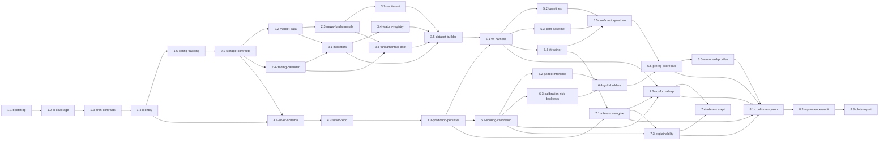

# Roadmap — Previsão Probabilística de Retornos Financeiros (TFT)

> **Documento vivo.** Cada Stage ganha `concept.md` + `technical.md` próprios depois de iniciada (Fase 3A/3B). Regra dura: ao marcar uma Stage `done`, atualizar `updated_at` + `last_reviewed_at` no mesmo merge.
>
> **Hierarquia (ver [`PIPELINE.md`](./PIPELINE.md) §4):**
> - **Step:** entrega de negócio. Sem restrição arquitetural. Agrupa Stages.
> - **Stage:** unidade atômica concept → technical → execução. 1 foco coeso, 1 DoD testável, 1 bounded context, complexidade ≤ M. Vira branch `feat/<num-issue>-<N-M>-<slug>`.
> - **Task:** 1 commit. Vive no `technical.md` da Stage.
>
> **Restrições arquiteturais herdadas** (não-negociáveis, vêm do overview §6/§7 e dos ADRs `0_0_*`):
> - Hexagonal **enforçado por ferramenta**: import-linter espelha o LAYOUT; o build quebra se o **domínio importar pandas/pyarrow/torch** ou se a dependência apontar pra fora.
> - **Estatística vive no domínio**, como serviços puros sobre value objects (`PairedLossSeries`, `QuantileForecast`, `CoverageSeries`); bibliotecas (`arch`/`statsmodels`/`sklearn`/`scoringrules`/`MAPIE`) vivem em adapters.
> - Testes de regressão **por unidade + oráculo** (fixture analítica + lib/R), nunca snapshot global byte-idêntico.
> - Medalhão **bronze/silver/gold**; silver Parquet = fonte da verdade; gold reconstruível sem re-treino.
> - Anti-leakage **não-negociável**: features causais, as-of backward, tipagem known/unknown, embargo.
> - Pré-registro imutável hasheado antes do confirmatório; métricas **nunca agregadas entre horizontes**.
> - Cobertura ≥ 90%, mypy --strict, import-linter verdes como gate de CI.
>
> **Convenções deste roadmap:** `ROADMAP-1` libera Stages com **mais Tasks** que o guideline 3–8 (até ~12–15), pois as decisões já estão tomadas (menos ambiguidade por Task); os 5 critérios de atomicidade permanecem. Pacote Python: `financial_forecasting`.

## Visão geral — dependências entre Stages


```mermaid
graph LR
  S11[1.1-bootstrap]-->S12[1.2-ci-coverage]-->S13[1.3-arch-contracts]-->S14[1.4-identity]-->S15[1.5-config-tracking]
  S15-->S21[2.1-storage-contracts]
  S21-->S22[2.2-market-data]; S22-->S23[2.3-news-fundamentals]; S21-->S24[2.4-trading-calendar]
  S22-->S31[3.1-indicators]; S24-->S31
  S23-->S32[3.2-sentiment]; S23-->S33[3.3-fundamentals-asof]; S24-->S33
  S31-->S34[3.4-feature-registry]
  S31-->S35[3.5-dataset-builder]; S32-->S35; S33-->S35; S34-->S35
  S14-->S41[4.1-silver-schema]; S21-->S41
  S41-->S42[4.2-silver-repo]-->S43[4.3-prediction-persister]
  S35-->S51[5.1-wf-harness]; S43-->S51
  S51-->S52[5.2-baselines]; S51-->S53[5.3-gbm-baseline]; S51-->S54[5.4-tft-trainer]
  S52-->S55[5.5-confirmatory-retrain]; S53-->S55; S54-->S55
  S43-->S61[6.1-scoring-calibration]
  S61-->S62[6.2-paired-inference]; S61-->S63[6.3-calibration-risk-backtests]
  S62-->S64[6.4-gold-builders]; S63-->S64
  S64-->S65[6.5-prereg-scorecard]; S55-->S65
  S65-->S66[6.6-scorecard-profiles]
  S54-->S71[7.1-inference-engine]; S43-->S71
  S71-->S72[7.2-conformal-cqr]; S51-->S72; S61-->S72
  S71-->S73[7.3-explainability]; S61-->S73
  S72-->S74[7.4-inference-api]; S73-->S74
  S65-->S81[8.1-confirmatory-run]; S66-->S81; S71-->S81; S72-->S81; S73-->S81
  S81-->S82[8.2-equivalence-audit]-->S83[8.3-plots-report]
```

## Tabela de Steps

| ID | Step | Resultado de negócio | Status | Stages |
|---|---|---|---|---|
| 1 | Fundação e fitness arquitetural | Repo hexagonal com fronteiras enforçadas (import-linter, mypy strict, cobertura ≥90%), identidade determinística, config e tracking — a base que faltava | done | 1.1–1.5 |
| 2 | Camada bronze + calendário | Dados brutos expostos por adapters limpos; calendário de pregão; contratos de storage medalhão | done | 2.1–2.4 |
| 3 | Feature engineering e dataset | Dataset TFT reconstruído com features causais (indicadores validados, sentimento, fundamentos as-of, derivadas) + contratos anti-leakage | done | 3.1–3.5 |
| 4 | Analytics store (silver) | Silver modular (schema por tabela), repositório append-only, persister único de predições multi-horizonte | done | 4.1–4.3 |
| 5 | Modelagem, baselines e treino | TFT re-treinado + GBM quantílico + baselines naive/estatísticos sobre walk-forward purgado/embargoado; cohort confirmatório AAPL | done | 5.1–5.5 |
| 6 | Núcleo estatístico confirmatório | Pipeline gold confirmatória: pinball/CRPS/DM/MCS/Holm/PICP-Christoffersen + gates + scorecard pré-registrado, no domínio e validada por oráculo | in_progress | 6.1–6.6 |
| 7 | Inferência, conformal, explicabilidade e API | Motor de inferência + conformal CQR (benchmark) + explicabilidade (VSN/permutação/ablação) servidos por API fina | not_started | 7.1–7.4 |
| 8 | Reprodução, equivalência e relatório | Protocolo completo em AAPL; equivalência vs evidência anterior auditada; plots e dossiê de rastreabilidade | not_started | 8.1–8.3 |

**Legenda de status (Step):** `not_started`, `in_progress`, `blocked`, `done`, `deprecated`.

## Tabela de Stages

| Stage | BC | Camada-alvo | Tipo | Status | Depende de |
|---|---|---|---|---|---|
| `1.1-bootstrap` | shared | bootstrap | mono | done | — |
| `1.2-ci-coverage` | shared | bootstrap (ci) | mono | done | 1.1 |
| `1.3-architecture-contracts` | shared | bootstrap (import-linter) | mono | done | 1.2 |
| `1.4-identity-and-fingerprints` | shared | domain + application | vertical | done | 1.3 |
| `1.5-config-and-tracking` | shared | shared/infrastructure + bootstrap | mono | done | 1.4 |
| `2.1-medallion-storage-contracts` | shared | adapters/out + shared | vertical | done | 1.5 |
| `2.2-market-data-ingestion` | market_data | multi (application + adapters/out) | vertical | done | 2.1 |
| `2.3-news-fundamentals-ingestion` | market_data | multi (application + adapters/out) | vertical | done | 2.2 |
| `2.4-trading-calendar` | shared | domain + adapters/out | vertical | done | 2.1 |
| `3.1-technical-indicators` | feature_engineering | multi (domain + adapters/out) | vertical | done | 2.2, 2.4 |
| `3.2-sentiment-finbert` | feature_engineering | multi (application + adapters/out) | vertical | done | 2.3 |
| `3.3-fundamentals-asof-join` | feature_engineering | multi (domain + adapters/out) | vertical | done | 2.3, 2.4 |
| `3.4-feature-registry-and-derived` | feature_engineering | domain | mono | done | 3.1 |
| `3.5-dataset-builder-and-contracts` | feature_engineering | multi (application + adapters/out) | vertical | done | 3.1, 3.2, 3.3, 3.4 |
| `4.1-silver-schema-per-table` | analytics_store | infrastructure/schemas + domain | vertical | done | 1.4, 2.1 |
| `4.2-silver-repository` | analytics_store | adapters/out | vertical | done | 4.1 |
| `4.3-prediction-persister` | analytics_store | domain + application | vertical | done | 4.2 |
| `5.1-walk-forward-harness` | modeling | domain + application | vertical | done | 3.5, 4.3 |
| `5.2-baselines-naive-statistical` | modeling | multi (domain + application + adapters/out) | vertical | done | 5.1 |
| `5.3-gbm-quantile-baseline` | modeling | multi (application + adapters/out) | vertical | done | 5.1 |
| `5.4-tft-trainer` | modeling | multi (application + adapters/out) | vertical | done | 5.1 |
| `5.5-confirmatory-retrain` | modeling | multi (domain + application + adapters/in + adapters/out) | vertical | done | 5.2, 5.3, 5.4 |
| `6.1-scoring-and-calibration-metrics` | evaluation | multi (domain + adapters/out) | vertical | done | 4.3 |
| `6.2-paired-inference-dm-mcs-holm` | evaluation | multi (domain + adapters/out) | vertical | done | 6.1 |
| `6.3-calibration-risk-backtests` | evaluation | domain | vertical | done | 6.1 |
| `6.4-gold-builders-and-quality-gates` | evaluation | multi (domain + application + adapters/out) | vertical | done | 6.2, 6.3 |
| `6.5-preregistration-and-scorecard` | evaluation | multi (domain + application + adapters/out) | vertical | done | 6.4, 5.5 |
| `6.6-scorecard-profiles` | evaluation | multi (domain + application + adapters/out) | vertical | draft | 6.5 |
| `7.1-inference-engine` | inference | multi (application + adapters/out) | vertical | draft | 5.4, 4.3 |
| `7.2-conformal-cqr` | inference | multi (domain + adapters/out) | vertical | draft | 7.1, 5.1 |
| `7.3-explainability` | inference | multi (domain + adapters/out; + modeling) | vertical | draft | 7.1, 6.1 |
| `7.4-inference-api` | inference | adapters/in/http | vertical | draft | 7.2, 7.3 |
| `8.1-confirmatory-run` | evaluation | application (orquestração) | vertical | draft | 6.5, 6.6, 7.1, 7.2, 7.3 |
| `8.2-equivalence-audit` | evaluation | application + tests | vertical | draft | 8.1 |
| `8.3-plots-and-final-report` | evaluation | adapters/out + docs | vertical | draft | 8.2 |

**Legenda de status (Stage):** `draft`, `in_progress`, `review`, `done`, `archived`.

---

## Detalhamento por Step

### Step 1 — Fundação e fitness arquitetural

Entrega o esqueleto Python hexagonal com as fronteiras **verificadas por ferramenta** — exatamente o que faltava no projeto anterior e causou a degradação. Inclui a identidade determinística (`run_id`/fingerprints) e o tracking, e registra os ADRs de fundação (`0_0_0002`…`0_0_0026`). **Resultado de negócio:** "qualquer mudança que viole arquitetura/cobertura é barrada automaticamente antes do merge".

- **Depende de:** —
- **Tamanho estimado:** M
- **Status:** `not_started`

#### Stage 1.1 — `1.1-bootstrap`

**Descrição humana:** Inicializar o repositório (pyproject/uv, ruff, mypy strict, pytest), estrutura hexagonal vazia (`features/`, `shared/`), Makefile, `scripts/check_layout.py`, e autorar os ADRs de fundação derivados do overview §11.

**Descrição para IA:**
```yaml
stage_id: 1.1-bootstrap
bounded_context: shared
camada_alvo: bootstrap
arquivos_a_criar:
  - pyproject.toml
  - Makefile
  - README.md
  - .pre-commit-config.yaml
  - scripts/check_layout.py
  - src/financial_forecasting/{__init__.py, shared/domain/__init__.py, shared/application/__init__.py, shared/infrastructure/__init__.py, features/__init__.py}
  - tests/test_smoke.py
  - docs/adr/0_0_0002-probabilistic-calibration-framing.md
  - docs/adr/0_0_0019-hexagonal-enforced.md
  - docs/adr/0_0_0020-statistics-in-domain-over-value-objects.md
  - docs/adr/0_0_0021-per-unit-contract-tests-with-oracle.md
arquivos_a_modificar: []
contratos_introduzidos: []
contratos_consumidos: []
definition_of_done: "`make setup && make check && make test` verde em máquina limpa; smoke test importa os pacotes do hexagonal; ADRs de fundação commitados."
non_goals: [features de negócio, CI (1.2), import-linter contracts (1.3)]
complexidade_estimada: M
gate_mode: strict
skills_hint: [hex-arch-python, import-linter-rules]
```

#### Stage 1.2 — `1.2-ci-coverage`

**Descrição humana:** Workflow GitHub Actions rodando `make check && make test` em todo PR, com gate de cobertura ≥ 90% (`fail_under` no pyproject) e import-linter no CI. Validar com erro intencional revertido.

**Descrição para IA:**
```yaml
stage_id: 1.2-ci-coverage
bounded_context: shared
camada_alvo: bootstrap
arquivos_a_criar: [.github/workflows/ci.yml]
arquivos_a_modificar: [pyproject.toml, README.md]
contratos_introduzidos: []
contratos_consumidos: []
definition_of_done: "PR que quebra lint, types, testes, cobertura<90% ou contrato de import falha no CI antes do merge (validado com quebra intencional revertida)."
non_goals: [deploy/release, cache de deps, matrix de versões]
complexidade_estimada: S
gate_mode: strict
skills_hint: [import-linter-rules]
```

#### Stage 1.3 — `1.3-architecture-contracts`

**Descrição humana:** Contratos import-linter espelhando o LAYOUT — em especial o **domínio proibido de importar pandas/pyarrow/torch** e a direção de dependência (adapters → application → domain). É a fitness function central do refactor.

**Descrição para IA:**
```yaml
stage_id: 1.3-architecture-contracts
bounded_context: shared
camada_alvo: bootstrap
arquivos_a_criar: [.importlinter, docs/LAYOUT.md, tests/architecture/test_import_contracts.py]
arquivos_a_modificar: [pyproject.toml, .github/workflows/ci.yml]
contratos_introduzidos: []
contratos_consumidos: []
definition_of_done: "import-linter falha o build se domain importar pandas/pyarrow/torch ou se a direção de dependência for violada; contrato roda no CI."
non_goals: [implementar features, regras específicas de BC ainda inexistentes]
complexidade_estimada: M
gate_mode: strict
skills_hint: [import-linter-rules, hex-arch-python]
```

#### Stage 1.4 — `1.4-identity-and-fingerprints`

**Descrição humana:** Identidade determinística como value objects de domínio (`RunId`, `DatasetFingerprint`, `ConfigSignature`, `SplitFingerprint`) + adapter de hashing canônico (sha256 sobre JSON ordenado). Base de toda a rastreabilidade.

**Descrição para IA:**
```yaml
stage_id: 1.4-identity-and-fingerprints
bounded_context: shared
camada_alvo: multi (domain + application)
arquivos_a_criar:
  - src/financial_forecasting/shared/domain/value_objects/{run_id.py, dataset_fingerprint.py, config_signature.py, split_fingerprint.py}
  - src/financial_forecasting/shared/application/ports/out/hasher.py
  - src/financial_forecasting/shared/adapters/out/hashing/canonical_json_hasher.py
  - tests/unit/shared/domain/test_identity_value_objects.py
  - tests/contract/shared/test_hasher_contract.py
contratos_introduzidos:
  - RunId, DatasetFingerprint, ConfigSignature, SplitFingerprint (value-object)
  - Hasher (port-out)
contratos_consumidos: []
definition_of_done: "Mesmo conjunto canônico de campos sempre produz o mesmo `run_id`/fingerprint (determinístico, testado); float/NaN/datetime canonicalizados."
non_goals: [persistência (Step 4), schemas de tabela (4.1)]
complexidade_estimada: M
gate_mode: strict
skills_hint: [ddd-tactical-patterns, hex-arch-python, pytest-with-fakes]
```

#### Stage 1.5 — `1.5-config-and-tracking`

**Descrição humana:** Config tipada (`pydantic-settings`) lendo env/arquivos, composition root inicial, e adapter de tracking MLflow (backend SQLite local) atrás de um port `ExperimentTracker`.

**Descrição para IA:**
```yaml
stage_id: 1.5-config-and-tracking
bounded_context: shared
camada_alvo: shared/infrastructure + bootstrap
arquivos_a_criar:
  - src/financial_forecasting/shared/infrastructure/config/settings.py
  - src/financial_forecasting/composition_root.py
  - src/financial_forecasting/shared/application/ports/out/experiment_tracker.py
  - src/financial_forecasting/shared/adapters/out/mlflow/mlflow_tracker.py
  - tests/unit/shared/infrastructure/test_settings.py
  - tests/contract/shared/test_experiment_tracker_contract.py
contratos_introduzidos: [Settings, ExperimentTracker (port-out)]
contratos_consumidos: [Hasher (1.4)]
definition_of_done: "`Settings` carrega de env/.env validando tipos; `MlflowTracker` registra um run local (SQLite) e um fake passa o mesmo contract test."
non_goals: [DVC, hydra, servidor MLflow remoto]
complexidade_estimada: M
gate_mode: strict
skills_hint: [composition-root, hex-arch-python, pytest-with-fakes]
```

---

### Step 2 — Camada bronze + calendário

Expõe os dados brutos de AAPL por adapters limpos sobre o port de storage medalhão, e entrega o calendário de pregão (sessões/feriados) necessário para o embargo do walk-forward. **Resultado de negócio:** "os dados brutos passam a ser lidos/gravados por uma interface auditável, e o calendário correto elimina uma fonte silenciosa de leakage".

- **Depende de:** Step 1.
- **Tamanho estimado:** M

#### Stage 2.1 — `2.1-medallion-storage-contracts`

**Descrição humana:** Port `MedallionStore` (ler/gravar datasets particionados em Parquet) + adapter pyarrow/duckdb + contratos de schema bronze via `pandera`. Define a convenção de partição (asset + chaves de alta cardinalidade) e append-only em fatos.

**Descrição para IA:**
```yaml
stage_id: 2.1-medallion-storage-contracts
bounded_context: shared
camada_alvo: multi (application + adapters/out)
arquivos_a_criar:
  - src/financial_forecasting/shared/application/ports/out/medallion_store.py
  - src/financial_forecasting/shared/adapters/out/parquet/parquet_medallion_store.py
  - src/financial_forecasting/shared/adapters/out/parquet/schemas/bronze_schemas.py
  - tests/contract/shared/test_medallion_store_contract.py
  - tests/integration/shared/adapters/out/parquet/test_parquet_medallion_store.py
contratos_introduzidos: [MedallionStore (port-out), bronze pandera schemas]
contratos_consumidos: [Settings (1.5)]
definition_of_done: "Gravar/ler um dataset particionado por asset em Parquet preserva schema (validado por pandera); leitura por partição filtra por asset; fake in-memory passa o contract test."
non_goals: [DuckDB para gold (Step 6), schemas silver (4.1)]
complexidade_estimada: M
gate_mode: strict
skills_hint: [repository-pattern, hex-arch-python, dmls-ch02-data-infrastructure-decisions]
```

#### Stage 2.2 — `2.2-market-data-ingestion`

**Descrição humana:** Port `CandleFetcher` + adapter yfinance + use case que ingere candles diários de AAPL para bronze (reusa o raw existente; re-ingestão pontual possível). DQ de OHLC (high≥low, sem nulos/dups).

**Descrição para IA:**
```yaml
stage_id: 2.2-market-data-ingestion
bounded_context: market_data
camada_alvo: multi (application + adapters/out)
arquivos_a_criar:
  - src/financial_forecasting/features/market_data/domain/entities/candle.py
  - src/financial_forecasting/features/market_data/application/ports/out/candle_fetcher.py
  - src/financial_forecasting/features/market_data/application/use_cases/ingest_candles.py
  - src/financial_forecasting/features/market_data/adapters/out/yfinance/yfinance_candle_fetcher.py
  - tests/fakes/features/market_data/in_memory_candle_fetcher.py
  - tests/unit/features/market_data/application/test_ingest_candles.py
  - tests/integration/features/market_data/adapters/out/yfinance/test_yfinance_candle_fetcher.py
contratos_introduzidos: [Candle (entity), CandleFetcher (port-out), IngestCandles (use case)]
contratos_consumidos: [MedallionStore (2.1)]
definition_of_done: "`IngestCandles` grava candles de AAPL em bronze com invariantes OHLC validadas; fake passa contract test; reusa raw existente sem re-baixar por padrão."
non_goals: [intervalos != 1d, ativos != AAPL agora, append incremental sofisticado]
complexidade_estimada: M
gate_mode: strict
skills_hint: [repository-pattern, hex-arch-python, pytest-with-fakes]
```

#### Stage 2.3 — `2.3-news-fundamentals-ingestion`

**Descrição humana:** Ports + adapters Alpha Vantage para news e fundamentals (4 endpoints) → bronze, com throttle e dedup. Entidades `NewsArticle` e `FundamentalReport`.

**Descrição para IA:**
```yaml
stage_id: 2.3-news-fundamentals-ingestion
bounded_context: market_data
camada_alvo: multi (application + adapters/out)
arquivos_a_criar:
  - src/financial_forecasting/features/market_data/domain/entities/{news_article.py, fundamental_report.py}
  - src/financial_forecasting/features/market_data/application/ports/out/{news_fetcher.py, fundamental_fetcher.py}
  - src/financial_forecasting/features/market_data/application/use_cases/{ingest_news.py, ingest_fundamentals.py}
  - src/financial_forecasting/features/market_data/adapters/out/alpha_vantage/{alpha_vantage_news_fetcher.py, alpha_vantage_fundamental_fetcher.py}
  - tests/fakes/features/market_data/{in_memory_news_fetcher.py, in_memory_fundamental_fetcher.py}
  - tests/integration/features/market_data/adapters/out/alpha_vantage/test_alpha_vantage_fetchers.py
contratos_introduzidos: [NewsArticle, FundamentalReport (entities), NewsFetcher, FundamentalFetcher (ports-out)]
contratos_consumidos: [MedallionStore (2.1)]
definition_of_done: "News e fundamentals de AAPL gravados em bronze com dedup (article_id) e throttle de free-tier; fakes passam contract tests."
non_goals: [providers além de Alpha Vantage, sentimento (3.2), ratios derivados (3.3)]
complexidade_estimada: M
gate_mode: strict
skills_hint: [repository-pattern, hex-arch-python, dmls-ch02-data-infrastructure-decisions]
```

#### Stage 2.4 — `2.4-trading-calendar`

**Descrição humana:** Serviço de domínio `TradingCalendar` (sessões válidas, feriados NYSE/NASDAQ, mapeamento timestamp→dia de pregão) sobre `exchange-calendars`. Base para agregação por dia de pregão e para o embargo.

**Descrição para IA:**
```yaml
stage_id: 2.4-trading-calendar
bounded_context: shared
camada_alvo: multi (domain + adapters/out)
arquivos_a_criar:
  - src/financial_forecasting/shared/domain/services/trading_calendar.py
  - src/financial_forecasting/shared/application/ports/out/exchange_calendar_provider.py
  - src/financial_forecasting/shared/adapters/out/calendar/exchange_calendars_provider.py
  - tests/unit/shared/domain/test_trading_calendar.py
  - tests/contract/shared/test_exchange_calendar_provider_contract.py
contratos_introduzidos: [TradingCalendar (domain-service), ExchangeCalendarProvider (port-out)]
contratos_consumidos: []
definition_of_done: "`TradingCalendar` resolve sessões válidas e feriados de XNYS; mapeia timestamp→dia de pregão; offset de N dias de pregão para embargo testado contra fixtures."
non_goals: [calendários 24/7 (cripto), intraday]
complexidade_estimada: M
gate_mode: strict
skills_hint: [ddd-tactical-patterns, hex-arch-python]
```

---

### Step 3 — Feature engineering e dataset

Reconstrói o dataset TFT com as 4 famílias de features, todas **causais e validadas contra o paper**, e os contratos anti-leakage. **Resultado de negócio:** "o dataset de treino é auditável feature a feature, com causalidade garantida — pré-condição de qualquer claim".

- **Depende de:** Step 2.
- **Tamanho estimado:** M–L (5 Stages)

#### Stage 3.1 — `3.1-technical-indicators`

**Descrição humana:** Indicadores técnicos causais via `pandas-ta-classic`, **cada um validado contra a fórmula canônica do paper** (RSI de Wilder, MACD, EMAs, volatilidades) por teste de fixture, + teste de leakage (indicador em t inalterado ao anexar barras futuras).

**Descrição para IA:**
```yaml
stage_id: 3.1-technical-indicators
bounded_context: feature_engineering
camada_alvo: multi (domain + adapters/out)
arquivos_a_criar:
  - src/financial_forecasting/features/feature_engineering/domain/services/indicator_spec.py
  - src/financial_forecasting/features/feature_engineering/application/ports/out/indicator_calculator.py
  - src/financial_forecasting/features/feature_engineering/adapters/out/pandas_ta/pandas_ta_indicator_calculator.py
  - tests/unit/features/feature_engineering/test_indicator_canonical_formulas.py
  - tests/unit/features/feature_engineering/test_indicator_leakage.py
contratos_introduzidos: [IndicatorSpec (value-object), IndicatorCalculator (port-out)]
contratos_consumidos: [MedallionStore (2.1)]
definition_of_done: "RSI/EMA/MACD/volatilidades batem com a fórmula canônica em fixture analítica; teste de leakage verde; valores em float32 gravados em bronze->processed."
non_goals: [indicadores de microestrutura/cripto (futuro), seleção de features]
complexidade_estimada: M
gate_mode: strict
skills_hint: [hex-arch-python, dmls-ch04-feature-engineering-decisions, pytest-with-fakes]
```

#### Stage 3.2 — `3.2-sentiment-finbert`

**Descrição humana:** Sentimento via FinBERT **version-pinned** (revisão HF fixada): score por artigo (`P(pos)-P(neg)`), agregado por **dia de pregão** (via `TradingCalendar`), com guarda de causalidade (cutoff de publicação).

**Descrição para IA:**
```yaml
stage_id: 3.2-sentiment-finbert
bounded_context: feature_engineering
camada_alvo: multi (application + adapters/out)
arquivos_a_criar:
  - src/financial_forecasting/features/feature_engineering/application/ports/out/sentiment_model.py
  - src/financial_forecasting/features/feature_engineering/application/use_cases/score_and_aggregate_sentiment.py
  - src/financial_forecasting/features/feature_engineering/adapters/out/finbert/finbert_sentiment_model.py
  - tests/fakes/features/feature_engineering/in_memory_sentiment_model.py
  - tests/unit/features/feature_engineering/test_sentiment_aggregation.py
  - tests/integration/features/feature_engineering/adapters/out/finbert/test_finbert_sentiment_model.py
contratos_introduzidos: [SentimentModel (port-out), ScoreAndAggregateSentiment (use case)]
contratos_consumidos: [MedallionStore (2.1), TradingCalendar (2.4)]
definition_of_done: "FinBERT (revisão pinada) gera score por artigo; agregação por dia de pregão respeita cutoff de publicação (sem usar artigo futuro); fake passa contract test."
non_goals: [modelos de sentimento cripto, calibração do score]
complexidade_estimada: M
gate_mode: strict
skills_hint: [hex-arch-python, dmls-ch04-feature-engineering-decisions, repository-pattern]
```

#### Stage 3.3 — `3.3-fundamentals-asof-join`

**Descrição humana:** Junção as-of **backward** dos fundamentals na grade diária, com `effective_date = reported_date or (fiscal_date_end + fallback declarado)`; invariante que **falha se** uma data efetiva for futura ao dia. Ratios derivados (margem, alavancagem, etc.).

**Descrição para IA:**
```yaml
stage_id: 3.3-fundamentals-asof-join
bounded_context: feature_engineering
camada_alvo: multi (domain + adapters/out)
arquivos_a_criar:
  - src/financial_forecasting/features/feature_engineering/domain/services/fundamentals_asof_policy.py
  - src/financial_forecasting/features/feature_engineering/adapters/out/duckdb/asof_join_adapter.py
  - tests/unit/features/feature_engineering/test_fundamentals_asof_policy.py
  - tests/unit/features/feature_engineering/test_asof_anti_leakage_invariant.py
contratos_introduzidos: [FundamentalsAsofPolicy (domain-service), AsofJoinAdapter (port-out)]
contratos_consumidos: [MedallionStore (2.1), TradingCalendar (2.4)]
definition_of_done: "as-of backward com fallback pré-declarado; invariante 'effective_date <= date' levanta erro quando violada; ratios derivados corretos em fixture."
non_goals: [on-chain/cripto, modelagem de surpresa de earnings sofisticada]
complexidade_estimada: M
gate_mode: strict
skills_hint: [hex-arch-python, dmls-ch04-feature-engineering-decisions]
```

#### Stage 3.4 — `3.4-feature-registry-and-derived`

**Descrição humana:** Registro de features como domínio puro — `FeatureSpec` (nome, família, fonte, fórmula, **tag de causalidade obrigatória**, warmup, dtype, política de nulo, tipagem **known/unknown**) + features derivadas (log-returns, momentum, volatilidades, interações sentimento×vol). O registro é a fonte da verdade das features.

**Descrição para IA:**
```yaml
stage_id: 3.4-feature-registry-and-derived
bounded_context: feature_engineering
camada_alvo: domain
arquivos_a_criar:
  - src/financial_forecasting/features/feature_engineering/domain/value_objects/feature_spec.py
  - src/financial_forecasting/features/feature_engineering/domain/services/feature_registry.py
  - src/financial_forecasting/features/feature_engineering/domain/services/derived_features.py
  - tests/unit/features/feature_engineering/test_feature_registry.py
  - tests/unit/features/feature_engineering/test_derived_features_causal.py
contratos_introduzidos: [FeatureSpec (value-object), FeatureRegistry, DerivedFeatures (domain-services)]
contratos_consumidos: []
definition_of_done: "Toda feature tem tag de causalidade e tipagem known/unknown; feature sem contrato de causalidade é rejeitada pelo registry; derivadas causais testadas; `feature_set_hash` determinístico."
non_goals: [seleção de features por OOS (banida), persistência]
complexidade_estimada: M
gate_mode: strict
skills_hint: [ddd-tactical-patterns, hex-arch-python, dmls-ch04-feature-engineering-decisions]
```

#### Stage 3.5 — `3.5-dataset-builder-and-contracts`

**Descrição humana:** Montagem do dataset TFT (join das 4 famílias + alvo `log(close_t/close_{t-1})`), validadores anti-leakage in-process, contratos `pandera` do dataset, e gate de qualidade (warmup, monotonicidade temporal, missing). Dono único do alvo/`target_timestamp`.

**Descrição para IA:**
```yaml
stage_id: 3.5-dataset-builder-and-contracts
bounded_context: feature_engineering
camada_alvo: multi (application + adapters/out)
arquivos_a_criar:
  - src/financial_forecasting/features/feature_engineering/application/use_cases/build_dataset.py
  - src/financial_forecasting/features/feature_engineering/domain/services/target_definition.py
  - src/financial_forecasting/features/feature_engineering/adapters/out/parquet/schemas/dataset_schema.py
  - tests/unit/features/feature_engineering/test_target_definition.py
  - tests/unit/features/feature_engineering/test_dataset_anti_leakage_validators.py
  - tests/integration/features/feature_engineering/test_build_dataset.py
contratos_introduzidos: [BuildDataset (use case), TargetDefinition (domain-service), dataset pandera schema]
contratos_consumidos: [IndicatorCalculator (3.1), SentimentModel (3.2), FundamentalsAsofPolicy (3.3), FeatureRegistry (3.4)]
definition_of_done: "Dataset montado com alvo log-retorno (convenção única); validadores anti-leakage re-derivam e conferem cada feature; pandera valida schema; gate de warmup/missing aplicado."
non_goals: [treino (Step 5), seleção de features]
complexidade_estimada: M
gate_mode: strict
skills_hint: [hex-arch-python, dmls-ch04-feature-engineering-decisions, task-ordering-hex]
```

---

### Step 4 — Analytics store (silver)

Silver modular (schema por tabela, sem o mega-schema antigo), repositório append-only e o **persister único de predições** (dono do `target_timestamp`, com a grade densa de quantis). **Resultado de negócio:** "toda predição fica rastreável por run_id num formato auditável e reconstruível".

- **Depende de:** Steps 1 e 2.
- **Tamanho estimado:** M

#### Stage 4.1 — `4.1-silver-schema-per-table`

**Descrição humana:** Schemas silver **por tabela** (dim_run, fact_config, fact_oos_predictions, fact_split_metrics, fact_failures, ...) como módulos separados + value objects de domínio, validados por `pandera`. Cada tabela com `schema_version`.

**Descrição para IA:**
```yaml
stage_id: 4.1-silver-schema-per-table
bounded_context: analytics_store
camada_alvo: multi (infrastructure/schemas + domain)
arquivos_a_criar:
  - src/financial_forecasting/features/analytics_store/domain/value_objects/{run_record.py, prediction_row.py}
  - src/financial_forecasting/features/analytics_store/adapters/out/parquet/schemas/{dim_run.py, fact_config.py, fact_oos_predictions.py, fact_split_metrics.py, fact_failures.py}
  - tests/unit/features/analytics_store/test_silver_schemas.py
contratos_introduzidos: [RunRecord, PredictionRow (value-objects), silver pandera schemas (per-table)]
contratos_consumidos: [RunId, fingerprints (1.4)]
definition_of_done: "Cada tabela silver tem schema próprio + `schema_version` + PK declarada; nenhum mega-schema; pandera valida payloads válidos/ inválidos."
non_goals: [tabelas gold (Step 6), escrita (4.2)]
complexidade_estimada: M
gate_mode: strict
skills_hint: [dmls-ch02-data-infrastructure-decisions, hex-arch-python]
```

#### Stage 4.2 — `4.2-silver-repository`

**Descrição humana:** Repositório silver (port + adapter Parquet) append-only em fatos, upsert só em reprocessamento consciente, particionado; leitura por cohort/`parent_sweep_id`.

**Descrição para IA:**
```yaml
stage_id: 4.2-silver-repository
bounded_context: analytics_store
camada_alvo: adapters/out
arquivos_a_criar:
  - src/financial_forecasting/features/analytics_store/application/ports/out/analytics_repository.py
  - src/financial_forecasting/features/analytics_store/adapters/out/parquet/parquet_analytics_repository.py
  - tests/contract/features/analytics_store/test_analytics_repository_contract.py
  - tests/integration/features/analytics_store/adapters/out/parquet/test_parquet_analytics_repository.py
contratos_introduzidos: [AnalyticsRepository (port-out)]
contratos_consumidos: [silver schemas (4.1), MedallionStore (2.1)]
definition_of_done: "Append-only em fatos; upsert só com flag explícita; leitura filtra por cohort/asset; fake passa contract test; `parent_sweep_id` preservado."
non_goals: [gold (Step 6), DuckDB de consulta gold]
complexidade_estimada: M
gate_mode: strict
skills_hint: [repository-pattern, hex-arch-python, pytest-with-fakes]
```

#### Stage 4.3 — `4.3-prediction-persister`

**Descrição humana:** Serviço de domínio `MultiHorizonPredictionPersister` — **dono único** da convenção `target_timestamp` (indexado por dia de pregão, sem off-by-one), persistindo a **grade densa de quantis** (raw + post-guardrail) por (run, split, horizonte, target_timestamp). Resolve na origem a ambiguidade que gerou bug no projeto antigo.

**Descrição para IA:**
```yaml
stage_id: 4.3-prediction-persister
bounded_context: analytics_store
camada_alvo: multi (domain + application)
arquivos_a_criar:
  - src/financial_forecasting/features/analytics_store/domain/services/multi_horizon_prediction_persister.py
  - src/financial_forecasting/features/analytics_store/domain/value_objects/quantile_forecast.py
  - src/financial_forecasting/features/analytics_store/application/use_cases/persist_predictions.py
  - tests/unit/features/analytics_store/test_prediction_persister_target_timestamp.py
  - tests/unit/features/analytics_store/test_quantile_forecast_invariants.py
contratos_introduzidos: [MultiHorizonPredictionPersister (domain-service), QuantileForecast (value-object), PersistPredictions (use case)]
contratos_consumidos: [AnalyticsRepository (4.2), TradingCalendar (2.4), silver schemas (4.1)]
definition_of_done: "`target_timestamp` = dia de pregão indexado (decisão+h), sem off-by-one (testado); grade densa raw+guardrail persistida com PK única; janela incompleta levanta erro e pula linha."
non_goals: [métricas (Step 6), inferência (Step 7)]
complexidade_estimada: M
gate_mode: strict
skills_hint: [ddd-tactical-patterns, hex-arch-python, task-ordering-hex]
```

---

### Step 5 — Modelagem, baselines e treino

Entrega o harness de validação (walk-forward purgado/embargoado com calib dedicado), os baselines (naive/estatísticos + **GBM quantílico**), o trainer do TFT (grade densa) e o re-treino confirmatório. **Resultado de negócio:** "o candidato e todos os comparadores são treinados sob o mesmo protocolo temporal sem vazamento, prontos para a estatística".

- **Depende de:** Steps 3 e 4.
- **Tamanho estimado:** L (5 Stages)

#### Stage 5.1 — `5.1-walk-forward-harness`

**Descrição humana:** Harness de validação temporal como domínio: folds walk-forward com **purga + embargo** (via `TradingCalendar`), partição do val em **early-stop + calib dedicado** (invariante do conformal), `ScopeSpec`/cohort para isolar comparações. Dedup operationally-latest.

**Descrição para IA:**
```yaml
stage_id: 5.1-walk-forward-harness
bounded_context: modeling
camada_alvo: multi (domain + application)
arquivos_a_criar:
  - src/financial_forecasting/features/modeling/domain/services/walk_forward_splitter.py
  - src/financial_forecasting/features/modeling/domain/value_objects/{fold_split.py, scope_spec.py}
  - src/financial_forecasting/features/modeling/domain/services/operationally_latest_dedup.py
  - tests/unit/features/modeling/test_walk_forward_purge_embargo.py
  - tests/unit/features/modeling/test_val_calibration_partition.py
  - tests/unit/features/modeling/test_operationally_latest_dedup.py
contratos_introduzidos: [WalkForwardSplitter (domain-service), FoldSplit, ScopeSpec (value-objects)]
contratos_consumidos: [TradingCalendar (2.4), SplitFingerprint (1.4)]
definition_of_done: "Folds com purga+embargo de H dias de pregão; val particionado em early-stop + calib intocado; sem sobreposição train/val/calib/test; dedup operationally-latest testado."
non_goals: [Combinatorial Purged CV (cogitado e descartado), treino em si]
complexidade_estimada: M
gate_mode: strict
skills_hint: [ddd-tactical-patterns, hex-arch-python, dmls-ch05-model-development-and-evaluation]
```

#### Stage 5.2 — `5.2-baselines-naive-statistical`

**Descrição humana:** Baselines naive e estatísticos via `statsforecast` (fit do AR(1)) + fórmulas canônicas no domínio validadas por oráculo (ADR 5.2.0001) (zero_return/random_walk, historical_mean, AR(1), EWMA-vol, historical_quantiles) — **todos implementados** (corrige a lacuna do projeto antigo), persistindo predições no mesmo grão/cohort do candidato.

**Descrição para IA:**
```yaml
stage_id: 5.2-baselines-naive-statistical
bounded_context: modeling
camada_alvo: multi (domain + application + adapters/out)
arquivos_a_criar:
  - src/financial_forecasting/features/modeling/domain/value_objects/baseline_spec.py
  - src/financial_forecasting/features/modeling/application/ports/out/baseline_forecaster.py
  - src/financial_forecasting/features/modeling/application/use_cases/run_baselines.py
  - src/financial_forecasting/features/modeling/adapters/out/statsforecast/statsforecast_baseline_forecaster.py
  - tests/unit/features/modeling/test_baseline_specs.py
  - tests/integration/features/modeling/test_run_baselines.py
contratos_introduzidos: [BaselineSpec (value-object), BaselineForecaster (port-out), RunBaselines (use case)]
contratos_consumidos: [WalkForwardSplitter (5.1), MultiHorizonPredictionPersister (4.3)]
definition_of_done: "As 5 specs de baseline (`zero_return` ≡ RW sem drift) geram quantis (point baselines como grade degenerada) alinhados por target_timestamp ao candidato; persistidos com `model_version='baseline_*'`; nenhum baseline documentado fica sem implementação."
non_goals: [GBM (5.3), TFT (5.4)]
complexidade_estimada: M
gate_mode: strict
skills_hint: [hex-arch-python, dmls-ch05-model-development-and-evaluation, repository-pattern]
```

#### Stage 5.3 — `5.3-gbm-quantile-baseline`

**Descrição humana:** Baseline-**modelo** forte: gradient boosting quantílico (LightGBM) emitindo a mesma grade densa de quantis, treinado no harness (CPU, sem disputar a GPU). É o comparador que eleva a barra de H2.

**Descrição para IA:**
```yaml
stage_id: 5.3-gbm-quantile-baseline
bounded_context: modeling
camada_alvo: multi (application + adapters/out)
arquivos_a_criar:
  - src/financial_forecasting/features/modeling/application/ports/out/quantile_model_trainer.py
  - src/financial_forecasting/features/modeling/application/use_cases/train_gbm_quantile.py
  - src/financial_forecasting/features/modeling/adapters/out/lightgbm/lightgbm_quantile_trainer.py
  - tests/unit/features/modeling/test_gbm_quantile_grid.py
  - tests/integration/features/modeling/test_train_gbm_quantile.py
contratos_introduzidos: [QuantileModelTrainer (port-out), TrainGbmQuantile (use case)]
contratos_consumidos: [WalkForwardSplitter (5.1), FeatureRegistry (3.4), MultiHorizonPredictionPersister (4.3)]
definition_of_done: "LightGBM treina por quantil emitindo a grade densa; predições alinhadas/persistidas como `model_version='gbm_quantile'`; roda em CPU dentro do harness."
non_goals: [NGBoost (cogitado), tuning agressivo]
complexidade_estimada: M
gate_mode: strict
skills_hint: [hex-arch-python, dmls-ch05-model-development-and-evaluation]
```

#### Stage 5.4 — `5.4-tft-trainer`

**Descrição humana:** Trainer do TFT (`pytorch-forecasting`, modo quantílico com **grade densa ~7–9**), tipagem known/unknown (anti-leakage), early-stopping no sub-split dedicado, sweeps exploratórios (Optuna) **separados** do confirmatório. Persiste artefato + predições OOS.

**Descrição para IA:**
```yaml
stage_id: 5.4-tft-trainer
bounded_context: modeling
camada_alvo: multi (application + adapters/out)
arquivos_a_criar:
  # Reconciliado na Task 15 com o que foi entregue (divergências declaradas no
  # concept §1). O plano previa 4 arquivos de produção e 2 de teste; a entrega
  # desdobrou a busca de hiperparâmetros em port + adapter + use case, porque
  # ADR 5.4.0005 põe o laço de trials no use case (ask-and-tell) e não no
  # adapter — sem isso a orquestração atravessaria a fronteira dentro de uma
  # callable, fora do alcance do fake e do gate de camadas.
  - src/financial_forecasting/features/modeling/application/ports/out/tft_trainer.py
  - src/financial_forecasting/features/modeling/application/ports/out/hyperparameter_search.py
  - src/financial_forecasting/features/modeling/application/use_cases/train_tft.py
  - src/financial_forecasting/features/modeling/application/use_cases/run_tft_sweep.py
  - src/financial_forecasting/features/modeling/adapters/out/pytorch_forecasting/pf_tft_trainer.py
  # `optuna_search.py`, não `optuna_sweep.py`: o port é uma BUSCA; a varredura
  # é o use case `run_tft_sweep.py`.
  - src/financial_forecasting/features/modeling/adapters/out/optuna/optuna_search.py
  # `test_known_unknown_typing.py` (flat) materializou como teste do use case —
  # a tipagem known/unknown é função pública dele, padrão herdado da 5.3.
  - tests/unit/features/modeling/application/test_train_tft.py
  - tests/unit/features/modeling/application/test_train_tft_tracking.py
  - tests/unit/features/modeling/application/test_run_tft_sweep.py
  - tests/unit/features/modeling/application/test_tft_trainer_port.py
  - tests/unit/features/modeling/application/test_hyperparameter_search_port.py
  - tests/unit/features/modeling/application/test_in_memory_tft_trainer.py
  # `test_train_tft_smoke.py` (um smoke) materializou como três e2e de
  # integração, um por seam do adapter (dataset / treino / predição), mais o
  # e2e do use case com o adapter real.
  - tests/integration/features/modeling/test_pf_tft_dataset.py
  - tests/integration/features/modeling/test_pf_tft_training.py
  - tests/integration/features/modeling/test_pf_tft_prediction.py
  - tests/integration/features/modeling/test_optuna_search.py
  - tests/integration/features/modeling/test_train_tft.py
  - tests/contract/features/modeling/test_tft_trainer_contract.py
  - tests/contract/features/modeling/test_hyperparameter_search_contract.py
  - tests/fakes/features/modeling/in_memory_tft_trainer.py
  - tests/fakes/features/modeling/in_memory_hyperparameter_search.py
contratos_introduzidos: [TftTrainer (port-out), HyperparameterSearch (port-out), TrainTft (use case), RunTftSweep (use case)]
contratos_consumidos: [WalkForwardSplitter (5.1), FeatureRegistry (3.4), MultiHorizonPredictionPersister (4.3), ExperimentTracker (1.5)]
definition_of_done: "TFT treina em modo quantílico com grade densa; price/indicadores tipados como unknown (calendário known); early-stop usa só o sub-split dedicado; artefato+predições persistidos; runs logados no MLflow; sweeps Optuna rotulados como exploratórios."
non_goals: [re-treino confirmatório (5.5), métricas (Step 6)]
complexidade_estimada: M
gate_mode: strict
skills_hint: [hex-arch-python, dmls-ch05-model-development-and-evaluation, dmls-ch03-training-data-strategy]
```

#### Stage 5.5 — `5.5-confirmatory-retrain`

**Descrição humana:** Orquestração do cohort confirmatório AAPL sobre dado real: pré-requisitos (leitura única do dataset de treino com corte do aquecimento — absorve a #99 — e gravação atômica no silver), sweeps exploratórios simétricos do TFT e do GBM na geometria do fold 0, cohort congelado, hasheado e ancorado antes da corrida, e re-treino retomável do candidato único all-features (seeds × folds), do GBM (uma execução por fold) e das 5 baselines. Nenhuma seleção por OOS; nenhuma métrica antes do pré-registro da 6.5 (cegamento).

**Descrição para IA:**
```yaml
stage_id: 5.5-confirmatory-retrain
bounded_context: modeling
camada_alvo: multi (domain + application + adapters/in + adapters/out)
arquivos_a_criar:
  # Lista completa no technical da Stage (38 Tasks); principais:
  - src/financial_forecasting/cli.py
  - src/financial_forecasting/shared/domain/value_objects/{cohort_hash.py, dataset_content_fingerprint.py}
  - src/financial_forecasting/features/modeling/domain/services/training_grid.py
  - src/financial_forecasting/features/modeling/domain/value_objects/cohort_geometry.py
  - src/financial_forecasting/features/modeling/application/dtos/cohort_spec.py
  - src/financial_forecasting/features/modeling/application/ports/out/{cohort_progress_ledger.py, cohort_run_index.py, runtime_environment_probe.py}
  - src/financial_forecasting/features/modeling/application/use_cases/{run_gbm_sweep.py, run_confirmatory_cohort.py}
  - src/financial_forecasting/features/modeling/adapters/in/cli/{cohort_file.py, cohort_commands.py}
  - src/financial_forecasting/features/modeling/adapters/out/{filesystem/json_cohort_progress_ledger.py, runtime/git_runtime_environment_probe.py}
  - src/financial_forecasting/features/analytics_store/adapters/out/parquet/parquet_cohort_run_index.py
  - config/cohorts/aapl_confirmatory.toml
  - tests/e2e/test_cohort_cli.py
  - docs/runbooks/confirmatory-cohort-aapl.md
contratos_introduzidos: [RunConfirmatoryCohort (use case), RunGbmSweep (use case), CohortSpec (dto), CohortGeometry (value-object), CohortHash/DatasetContentFingerprint (value-objects, shared), CohortProgressLedger/CohortRunIndex/RuntimeEnvironmentProbe (port-out)]
contratos_consumidos: [TrainTft/RunTftSweep (5.4), TrainGbmQuantile (5.3), RunBaselines (5.2), IngestCandles/IngestNews/IngestFundamentals (2.2/2.3), BuildDataset (3.5), MedallionStore, Hasher (1.4)]
definition_of_done: "Candidato TFT (seeds × folds) + GBM (uma execução por fold; teste de contrato 'duas seeds → predições idênticas' prova o determinismo — ADR 0.0.0010) + 5 specs de baseline (`zero_return` ≡ RW sem drift) treinados no cohort AAPL, horizontes h+1/h+7, todos sobre o mesmo grid de treino, com mesmo `parent_sweep_id`; predições alinhadas por target_timestamp e conferidas por contagem (`verify`); cohort declarado em `config/cohorts/aapl_confirmatory.toml`, congelado, hasheado e ancorado (tag publicada + comentário na issue) antes da corrida; número e lista de seeds do candidato decididos pelo humano no congelamento, com o custo medido (ADR 0.0.0010 devolve a decisão à 5.5); zero seleção por OOS; nenhuma métrica calculada sobre o cohort antes do pré-registro da 6.5."
non_goals: [estatística confirmatória (Step 6), outros ativos, horizonte h+30 (corrida suplementar própria), ROCm (só se o custo em CPU inviabilizar)]
complexidade_estimada: L
gate_mode: strict
skills_hint: [composition-root, hex-arch-python, orchestrator-design, pytest-with-fakes, data-shape-evidence, dmls-ch05-model-development-and-evaluation]
```

---

### Step 6 — Núcleo estatístico confirmatório

O coração científico: métricas e testes como **serviços de domínio sobre value objects**, apoiados em bibliotecas + oráculo, com os gates metodológicos e o scorecard pré-registrado. **Resultado de negócio:** "evidência confirmatória academicamente defensável e auditável, com cada número conferível contra o R/paper".

- **Depende de:** Step 4 (e consome predições do Step 5).
- **Tamanho estimado:** L (6 Stages — densas por `ROADMAP-1`; a 6.6 entrou em 2026-10-05, vinda da issue #129)

#### Stage 6.1 — `6.1-scoring-and-calibration-metrics`

**Descrição humana:** Métricas probabilísticas como domínio puro sobre `QuantileForecast`/`CoverageSeries`: pinball (sklearn), CRPS (scoringrules), PICP/MPIW, Winkler/interval score; **gate de degeneração** de quantis separado do guardrail. Cada uma com fixture analítica + oráculo de lib.

**Descrição para IA:**
```yaml
stage_id: 6.1-scoring-and-calibration-metrics
bounded_context: evaluation
camada_alvo: multi (domain + adapters/out)
arquivos_a_criar:
  - src/financial_forecasting/features/evaluation/domain/value_objects/{coverage_series.py}
  - src/financial_forecasting/features/evaluation/domain/services/{pinball_score.py, crps_score.py, interval_score.py, coverage_metrics.py, degeneracy_gate.py}
  - src/financial_forecasting/features/evaluation/application/ports/out/scoring_backend.py
  - src/financial_forecasting/features/evaluation/adapters/out/scoring/{sklearn_scoring.py, scoringrules_backend.py}
  - tests/unit/features/evaluation/test_pinball_vs_oracle.py
  - tests/unit/features/evaluation/test_crps_interval_score.py
  - tests/unit/features/evaluation/test_degeneracy_gate.py
contratos_introduzidos: [CoverageSeries (value-object), PinballScore/CrpsScore/IntervalScore/CoverageMetrics/DegeneracyGate (domain-services), ScoringBackend (port-out)]
contratos_consumidos: [QuantileForecast (4.3)]
definition_of_done: "Pinball/CRPS/Winkler batem com sklearn/scoringrules e fixtures analíticas; PICP/MPIW com nominal dinâmico; gate de degeneração (colapso total da grade) invalida as métricas de **calibração** da linha — proper scores seguem computados — e reporta rate, separado do guardrail (doc de domínio evaluation §5.3; ADR 0.0.0011)."
non_goals: [testes pareados (6.2), backtests de risco (6.3)]
complexidade_estimada: M
gate_mode: strict
skills_hint: [ddd-tactical-patterns, hex-arch-python, dmls-ch05-model-development-and-evaluation]
```

#### Stage 6.2 — `6.2-paired-inference-dm-mcs-holm`

**Descrição humana:** Inferência pareada como domínio sobre `PairedLossSeries` (VO T × k de perdas L_t de um horizonte): DM unilateral com variância de longo prazo retangular (h − 1 lags) + correção HLN e p-valor da t_{T−1} em stdlib; Holm sobre a família do candidato no horizonte; MCS de HLN (2011), estatística 'R', sobre índices de bootstrap. Postura do ADR 0.0.0056: DM/Holm/MCS são implementados **no domínio**; `statsmodels` (DM/Holm) e `arch` (índices de bootstrap e b̂_sb) são **oráculos atrás de port** (`InferenceBackend`, `McsBackend`), e o R `forecast::dm.test` entra como **fixture versionada com proveniência testada**. Convenções do doc de domínio §9.3: a perda pareada é L_t (pinball médio na grade, média entre seeds); um único candidato por família (sem seleção entre candidatos); família de Holm fechada por horizonte (o candidato contra todos os outros modelos da mesma amostra); uma observação por `target_timestamp`.

**Descrição para IA:**
```yaml
stage_id: 6.2-paired-inference-dm-mcs-holm
bounded_context: evaluation
camada_alvo: multi (domain + adapters/out)
arquivos_a_criar:
  - src/financial_forecasting/features/evaluation/domain/value_objects/{paired_loss_series.py, bootstrap_indices.py, _paired_inputs.py, _timestamps.py}
  - src/financial_forecasting/features/evaluation/domain/services/{student_t.py, paired_pinball_losses.py, diebold_mariano.py, inference_input_validation.py, holm_correction.py, model_confidence_set.py}
  - src/financial_forecasting/features/evaluation/application/ports/out/{inference_backend.py, mcs_backend.py}
  - src/financial_forecasting/features/evaluation/adapters/out/inference/{__init__.py, statsmodels_hac.py, arch_mcs.py}
  - tests/unit/features/evaluation/{test_student_t.py, test_paired_loss_series.py, test_paired_pinball_losses.py, test_dm_vs_r_oracle.py, test_inference_input_validation.py, test_holm_vs_statsmodels.py, test_bootstrap_indices.py, test_mcs_vs_arch.py}
  - tests/fakes/features/evaluation/{fake_inference_backend.py, fake_mcs_backend.py}
  - tests/contract/features/evaluation/{test_inference_backend_contract.py, test_mcs_backend_contract.py}
  - tests/integration/features/evaluation/{test_r_oracle_provenance.py, test_dm_r_oracle_fixtures.py, test_mcs_vs_arch.py}
  - tests/fixtures/r_oracle/dm_test_cases.{R, json, sessionInfo.txt}
  - tests/fixtures/r_oracle/Dockerfile
# Desvio de caminho (concept 6.2 D7): os testes "vs oráculo" de tests/unit/ mantêm o nome
# do roadmap, mas são só analíticos (unit não importa lib nem lê arquivo); statsmodels e
# arch entram nas suítes de contrato e na integração; o R, nas fixtures + integração.
contratos_introduzidos: [PairedLossSeries, BootstrapIndices (value-objects), paired_pinball_losses, student_t_cdf, DieboldMariano, HolmCorrection, ModelConfidenceSet (domain-services), InferenceBackend, McsBackend (ports-out)]
contratos_consumidos: [CoverageSeries, PinballScore (6.1)]
definition_of_done: "DM/HLN do domínio reproduz o R `forecast::dm.test` nas fixtures versionadas (proveniência testada) e o statsmodels HAC na suíte de contrato; Holm do domínio igual ao `multipletests(method='holm')`; MCS 'R' do domínio sobre índices do `arch` com a mesma ordem de eliminação e p-valores do `arch.MCS`; `PairedLossSeries` valida alinhamento (T > h, timestamps únicos e crescentes, perdas ≥ 0) e a fábrica monta L_t com média entre seeds; um único candidato por família de Holm, fechada por horizonte."
non_goals: [Christoffersen/Kupiec (6.3), scorecard (6.5)]
complexidade_estimada: M
gate_mode: strict
skills_hint: [ddd-tactical-patterns, hex-arch-python, dmls-ch05-model-development-and-evaluation]
```

#### Stage 6.3 — `6.3-calibration-risk-backtests`

**Descrição humana:** Backtests de calibração condicional e de risco no domínio do BC `evaluation`, conferidos contra o R: a sequência de violações por série e horizonte (com as linhas degeneradas como lacunas), a banda de Wilson da cobertura (critério decisivo de H1), o Kupiec POF, o trio de Christoffersen (LR_uc/LR_ind/LR_cc na convenção pura) com as sensibilidades pré-registradas (LR_uc de 3 estados; p-valor Monte Carlo com desempate de Dufour) e o VaR descritivo por cauda. O oráculo `rugarch::VaRTest` fica congelado como fixture versionada, lida por testes de integração.

**Descrição para IA:**
```yaml
stage_id: 6.3-calibration-risk-backtests
bounded_context: evaluation
camada_alvo: domain
arquivos_a_criar:
  - src/financial_forecasting/features/evaluation/domain/services/{christoffersen_test.py, kupiec_pof.py, var_descriptive.py}
  - src/financial_forecasting/features/evaluation/domain/value_objects/hit_sequence.py
  - src/financial_forecasting/features/evaluation/domain/services/{hit_sequences.py, wilson_band.py, chi_square.py, count_input_validation.py}
  - src/financial_forecasting/features/evaluation/domain/value_objects/{_horizon.py, _tolerance.py}
  - tests/integration/features/evaluation/test_christoffersen_vs_rugarch.py
  - tests/integration/features/evaluation/test_kupiec_vs_oracle.py
  - tests/fixtures/r_oracle/var_test_cases.{json,R,sessionInfo.txt} + tests/fixtures/r_oracle/Dockerfile (formato do Step, ADR 6.2.0006)
arquivos_a_modificar:
  - src/financial_forecasting/features/evaluation/domain/value_objects/coverage_series.py (predicados FA7 is_at_or_below / is_inside_closed)
  - src/financial_forecasting/features/evaluation/domain/services/coverage_metrics.py (consome os predicados; MPIW_LABEL)
  - src/financial_forecasting/features/evaluation/domain/services/degeneracy_gate.py (tolerância pela regra única de _tolerance.py)
  - src/financial_forecasting/features/evaluation/domain/value_objects/_finite_number.py (int além do float64 não é número finito)
contratos_introduzidos: [HitSequence (value-object), HitSequences, WilsonBand, chi_square_sf, kupiec_pof (kernel; o POF é também o campo kupiec_pof de ChristoffersenStatistics), ChristoffersenTest, lr_uc_three_state, MonteCarloPValues / mc_p_value, VarDescriptive (domain-services), predicados FA7 is_at_or_below / is_inside_closed, MPIW_LABEL]
contratos_consumidos: [CoverageSeries, pair_miscoverage, DegeneracyGate, CoverageReport / PairCoverage, is_finite_number (6.1)]
definition_of_done: "Christoffersen (LR_uc/LR_ind/LR_cc, convenção pura) e Kupiec POF batem **exatamente** (a menos de arredondamento) com `rugarch::VaRTest` congelado — LR_uc no *feed* a partir de t = 2, LR_ind = cc − uc no *feed* inteiro — e com fixtures analíticas; LR_cc = LR_uc + LR_ind exata; banda de Wilson bate com BCD 2001 Eq. (4) e aceita contagens médias; VaR descritivo backtestado por exceedances unilaterais por cauda; casos-limite são resultados de domínio 'não aplicável'; MPIW e VaR rotulados como descritivos não-inferenciais; as métricas heurísticas do projeto antigo (`prob_up`, a métrica `confidence`, ES, `expected_move`, `downside`, win-rate) não existem no slice `evaluation`."
non_goals: [ES como confirmatório (futuro), métricas heurísticas removidas (não reintroduzir), valores do pré-registro e aplicação do gate H1 (6.5), leitura do silver e persistência gold (6.4)]
complexidade_estimada: M
gate_mode: strict
skills_hint: [ddd-tactical-patterns, hex-arch-python]
```

#### Stage 6.4 — `6.4-gold-builders-and-quality-gates`

**Descrição humana:** Gold builders modulares (sobre silver) com **dependências explícitas** (sem dict mutável) ordenadas por `graphlib`; montagem única das séries alinhadas (`SeriesAssembly`, achados em vez de exceção) nas duas amostras (série completa e interseção comum); quality checks como registry com severidade declarada (alinhamento e pré-condições estatísticas bloqueiam; degeneração e proveniência do realizado só reportam); MCS em produção com parâmetros explícitos e `preregistration_ref`. Realizado lido pela grade de treino da 5.5 (a mesma origem do `decision_idx` gravado), conferida contra o fingerprint congelado do cohort. Gold reconstruível via DuckDB sem re-treino, publicado por geração inteira (staging, manifesto por último, troca de pasta).

**Descrição para IA:**
```yaml
stage_id: 6.4-gold-builders-and-quality-gates
bounded_context: evaluation
camada_alvo: multi (domain + application + adapters/out)
arquivos_a_criar:
  - src/financial_forecasting/shared/domain/services/path_identifier.py
  - src/financial_forecasting/features/evaluation/domain/value_objects/{forecast_record.py, cohort_run.py, realized_returns.py, assembled_cohort.py, quality_check_result.py, block_estimate.py}
  - src/financial_forecasting/features/evaluation/domain/services/{series_assembly.py, horizon_reports.py, gold_build_order.py}
  - src/financial_forecasting/features/evaluation/domain/services/quality_checks/{__init__.py, registry.py, alignment_check.py, statistical_preconditions_check.py, degeneracy_check.py, realized_provenance_check.py}
  - src/financial_forecasting/features/evaluation/application/dtos/refresh_gold.py
  - src/financial_forecasting/features/evaluation/application/ports/out/{gold_store.py, gold_builder.py, silver_table_reader.py}
  - src/financial_forecasting/features/evaluation/application/ports/out/training_grid_reader.py
  - src/financial_forecasting/features/modeling/application/use_cases/read_training_grid.py
  - src/financial_forecasting/features/evaluation/application/use_cases/refresh_gold.py
  - src/financial_forecasting/features/evaluation/adapters/out/duckdb/parquet_gold_store.py
  - src/financial_forecasting/features/evaluation/adapters/out/duckdb/gold_builders/{__init__.py, quality_checks.py, metrics_by_run.py, calibration_table.py, dm_results.py, mcs_results.py}
  - tests/fakes/features/evaluation/{in_memory_gold_store.py, fake_gold_builder.py, fake_silver_table_reader.py}
  - tests/fakes/features/evaluation/fake_training_grid_reader.py
  - tests/contract/features/evaluation/{test_gold_store_contract.py, test_gold_builder_contract.py, test_silver_table_reader_contract.py, _gold_inputs.py}
  - tests/contract/features/evaluation/test_training_grid_reader_contract.py
  - tests/unit/features/evaluation/gold/{_cohort_factory.py, conftest.py, test_gold_value_objects.py, test_series_assembly.py, test_quality_checks.py, test_horizon_reports.py, test_builder_explicit_deps.py, test_refresh_gold_dtos.py, test_refresh_gold_use_case.py}
  - tests/unit/shared/domain/test_path_identifier.py
  - tests/integration/features/evaluation/test_refresh_gold.py
arquivos_a_modificar:
  - src/financial_forecasting/features/evaluation/domain/value_objects/paired_loss_series.py
  - src/financial_forecasting/features/evaluation/domain/services/paired_pinball_losses.py
  - src/financial_forecasting/features/evaluation/domain/value_objects/bootstrap_indices.py
  - src/financial_forecasting/features/evaluation/domain/services/model_confidence_set.py
  - src/financial_forecasting/features/evaluation/domain/value_objects/_timestamps.py
  - src/financial_forecasting/shared/adapters/out/parquet/parquet_medallion_store.py
  - tests/fakes/shared/in_memory_medallion_store.py
  - src/financial_forecasting/composition_root.py
  - src/financial_forecasting/features/analytics_store/adapters/out/parquet/parquet_analytics_repository.py
  - .importlinter
  - docs/LAYOUT.md
  - tests/architecture/test_port_coverage_gate.py
  - tests/architecture/test_import_contracts.py
  - tests/architecture/test_unit_evaluation_purity.py
contratos_introduzidos: [SeriesAssembly, HorizonReports, gold_build_order, QualityCheckRegistry (domain-services), ForecastRecord, CohortRun, RealizedReturns, AssembledCohort, QualityCheckResult (value-objects), GoldBuilder, GoldStore, SilverTableReader, TrainingGridReader (ports-out), RefreshGold (use case), ReadTrainingGrid (use case da modeling, real do TrainingGridReader — ADR 6.4.0009), validate_path_identifier (shared)]
contratos_consumidos: [serviços de 6.1/6.2/6.3 (PinballScore, CrpsScore, IntervalScore, CoverageMetrics, DegeneracyGate, paired_pinball_losses, HolmCorrection, ModelConfidenceSet, HitSequences, ChristoffersenTest, WilsonBand), McsBackend (port-out 6.2: b̂_sb + índices de bootstrap do MCS em produção — ADR 6.2.0004), ParquetAnalyticsRepository como real do SilverTableReader (ADR 0.0.0053), TrainingGrid/load_training_grid/modeling_columns (5.5, via ReadTrainingGrid), DatasetContentFingerprint/Hasher, Clock, validate_mcs_reps, validate_bootstrap_parameters, MIN_MODELS]
definition_of_done: "RefreshGold regenera por inteiro a geração gold de um cohort a partir do silver e do realizado lido pela grade de treino da 5.5 (fingerprint do cohort conferido; divergente ergue antes de qualquer efeito): ordem dos builders por dependências declaradas (grafo inválido falha antes de qualquer leitura), séries montadas uma vez com achados de alinhamento publicados em gold_quality_checks (refresh BLOCKED só com essa tabela), pré-condições estatísticas no domínio antes da fábrica e do backend, cinco tabelas confirmatórias com preregistration_ref, manifesto por último e rerun com as mesmas linhas — provado por contrato [fake, real] dos quatro ports, e2e via DuckDB e refresh COMPLETED sobre o cohort real."
non_goals: [scorecard confirmatório (6.5), plots (8.3), execução do cohort real (8.1)]
complexidade_estimada: M
gate_mode: strict
skills_hint: [hex-arch-python, repository-pattern, composition-root]
```

#### Stage 6.5 — `6.5-preregistration-and-scorecard`

**Descrição humana:** Pré-registro imutável hasheado (hipóteses, métrica primária, regra de decisão, bandas, baselines, gates) — um TOML canônico por revisão, lido para um VO tipado com regras nomeadas e hasheado sem arredondar floats — e o scorecard confirmatório que aplica a regra **mecanicamente** por horizonte, separando vencedor primário de perfil. `academic_decision_ready` só verdadeiro com todos os gates de validade satisfeitos. O scorecard é emitido como resultado (`ScorecardResult`) e gravado pela 8.1.

**Leitura do gold (nota da 6.4):** pelo port `GoldGenerationReader` (real no `ParquetGoldStore.read_generation`, 6.5): `current/MANIFEST.json` primeiro e cada tabela como arquivo único **sem** inferência de partição hive (`partitioning=None` no pyarrow, `hive_partitioning = false` no DuckDB — os segmentos `asset=`/`parent_sweep_id=` do caminho colidem com as colunas de mesmo nome); tabela com zero linhas tem schema vazio (usar o `rows_by_table` do manifesto); montagem única por `GoldGeneration.from_stored`.

**Descrição para IA:**
```yaml
stage_id: 6.5-preregistration-and-scorecard
bounded_context: evaluation
camada_alvo: multi (domain + application + adapters/out)
arquivos_a_criar:
  - src/financial_forecasting/shared/domain/value_objects/preregistration_hash.py
  - src/financial_forecasting/features/evaluation/domain/value_objects/preregistration.py
  - src/financial_forecasting/features/evaluation/domain/value_objects/scorecard_evidence.py
  - src/financial_forecasting/features/evaluation/domain/services/h1_gate.py
  - src/financial_forecasting/features/evaluation/domain/services/h1_gate_power.py
  - src/financial_forecasting/features/evaluation/domain/services/confirmatory_scorecard.py
  - src/financial_forecasting/features/evaluation/application/ports/out/preregistration_source.py
  - src/financial_forecasting/features/evaluation/application/ports/out/gold_generation_reader.py
  - src/financial_forecasting/features/evaluation/application/dtos/gold_schema.py
  - src/financial_forecasting/features/evaluation/application/dtos/confirmatory_scorecard.py
  - src/financial_forecasting/features/evaluation/application/use_cases/scorecard_evidence.py
  - src/financial_forecasting/features/evaluation/application/use_cases/scorecard_profile.py
  - src/financial_forecasting/features/evaluation/application/use_cases/build_confirmatory_scorecard.py
  - src/financial_forecasting/features/evaluation/adapters/out/toml/toml_preregistration_source.py
  - config/preregistration/aapl_confirmatory-r0.toml
  - config/preregistration/aapl_confirmatory-r0.anchor.toml
  - docs/preregistration/aapl_confirmatory.md
  - tests/fakes/features/evaluation/in_memory_preregistration_source.py
  - tests/fakes/features/evaluation/in_memory_gold_generation_reader.py
  - tests/contract/features/evaluation/test_preregistration_source_contract.py
  - tests/contract/features/evaluation/test_gold_generation_reader_contract.py
  - tests/integration/features/evaluation/test_build_confirmatory_scorecard.py
  - tests/integration/features/evaluation/test_preregistration_consistency.py
  - tests/unit/features/evaluation/test_preregistration_immutable_hash.py
  - tests/unit/features/evaluation/test_scorecard_mechanical_rule.py
arquivos_a_modificar:
  - src/financial_forecasting/features/evaluation/application/dtos/refresh_gold.py
  - src/financial_forecasting/features/evaluation/adapters/out/duckdb/parquet_gold_store.py
  - src/financial_forecasting/features/evaluation/adapters/out/duckdb/gold_builders/ (os cinco builders)
  - src/financial_forecasting/features/evaluation/domain/services/model_confidence_set.py
  - src/financial_forecasting/features/evaluation/domain/services/christoffersen_test.py
  - src/financial_forecasting/features/evaluation/domain/services/student_t.py
  - src/financial_forecasting/features/evaluation/domain/services/diebold_mariano.py
  - src/financial_forecasting/composition_root.py
  - docs/LAYOUT.md
  - tests/architecture/test_port_coverage_gate.py
contratos_introduzidos: [Preregistration, PreregistrationHash, TailDeviation, VOs de evidência (value-objects), H1Gate, H1GatePower, ConfirmatoryScorecard (domain-services), PreregistrationSource, GoldGenerationReader (ports-out), BuildConfirmatoryScorecard (use case)]
contratos_consumidos: [tabelas gold + manifesto (6.4) via GoldGenerationReader, RefreshParameters/GoldManifest/check_generation (6.4), WilsonBand, lr_uc_three_state, chi_square_sf (6.3, sobre contagens médias entre seeds), Hasher (1.4), cohort r0 por referência (5.5)]
definition_of_done: "Pré-registro hasheado e imutável (qualquer campo alterado, inclusive regra nomeada, muda o hash); ancorado com carimbo do servidor depois da âncora do cohort referenciado; nenhuma métrica calculada pela 6.5 sobre o cohort; o scorecard recusa plano sem âncora, gold de outro plano/cohort e gold bloqueado, e marca como não pronto o gold gerado antes da âncora; aplica a regra pré-registrada mecanicamente por horizonte (primária = pinball + gate de calibração + DM/Holm + MCS); separa vencedor de perfil; `academic_decision_ready` exige todos os gates de validade (gold completo sem check bloqueante ou pulado, gold posterior à âncora, nenhuma emenda não-cega) e não depende do desfecho."
non_goals: [execução do cohort (8.1), reabrir hipóteses, perfis de séries novas (6.6, issue #129), plots (8.3)]
complexidade_estimada: M
gate_mode: strict
skills_hint: [ddd-tactical-patterns, hex-arch-python, dmls-ch05-model-development-and-evaluation]
```

#### Stage 6.6 — `6.6-scorecard-profiles`

**Descrição humana:** Os perfis do scorecard que o pré-registro r0 da 6.5 **declara por nome** e que exigem **séries que o gold da 6.4 não guarda**: DM por fold, DM por seed (com a fração de seeds que rejeitam a α), DM por nível quantílico τ, sensibilidades de bloco do MCS (l = h e l = ⌈√T⌉), diagnóstico de estacionariedade de d_t, degeneração parcial por par de quantis e p-valor Monte Carlo de Christoffersen em h+1. Cinco deles têm parâmetros congelados no r0 (`mcs.block_sensitivities`, `backtests.monte_carlo`, α, níveis τ); o diagnóstico de estacionariedade (lags da ACF, teste de quebra) e a degeneração por par **não** têm. DM, MCS e Christoffersen reusam os serviços da 6.2/6.3; o diagnóstico de estacionariedade é **estatística nova** (não há serviço de ACF/quebra no código) e a degeneração por par é cálculo novo sobre a degeneração da 6.1. Cada perfil vira **tabela gold nova** na mesma geração do `RefreshGold`. **Perfil nunca troca o veredito** (doc de domínio §8.6; I12 da 6.5): calcular depois não altera o claim, desde que o quê e os parâmetros sejam fixados antes da primeira execução real (8.1). Bloqueia a 8.1 (ADR 6.5.0008 §Consequences). Issue da Stage: #129 (promovida de issue avulsa por tocar schema persistido e ter decisões de concept em aberto); o comentário de 2026-09-30 da #129 (achados F6–F8 da auditoria da 6.5) faz parte do escopo.

**Em aberto para o concept/technical (ponto de partida, não definitivo; fechar E/C pela skill `evidence-resolution`):**
1. **Parâmetros dos dois perfis sem valor no r0** (estacionariedade de d_t e degeneração por par): (a) emenda cega r1 (`blind_status = "blinded"`, ADR 6.5.0002) ancorada antes da 8.1; (b) valores tirados literalmente do doc de domínio, citando a seção; ou (c) os dois perfis rotulados exploratórios no relatório. Em qualquer caminho, nota datada no ADR 6.5.0008 corrigindo o "with its parameters".
2. Se o `ScorecardProfile` da 6.5 passa a ler as tabelas novas pelo `GoldGenerationReader` (perfil completo no `ScorecardResult`) ou se a 8.1 as anexa ao lado do scorecard.
3. Se as tabelas por subconjunto (fold, seed, τ) viram uma tabela cada ou uma tabela com coluna de dimensão.
4. Tamanho: ~13–15 tasks está no teto de `ROADMAP-1`; se o technical passar disso, dividir a Stage (PIPELINE §4.2).

**Descrição para IA:**
```yaml
stage_id: 6.6-scorecard-profiles
bounded_context: evaluation
camada_alvo: multi (domain + application + adapters/out)
arquivos_a_criar:
  - src/financial_forecasting/features/evaluation/domain/services/ (diagnóstico de estacionariedade de d_t; degeneração por par — nomes no technical)
  - src/financial_forecasting/features/evaluation/adapters/out/duckdb/gold_builders/ (um builder por perfil — nomes no technical)
  - tests/unit/features/evaluation/ (montagem das séries novas: fold carregado, perda por τ, série por seed; serviços novos contra oráculo)
  - tests/integration/features/evaluation/ (builders + e2e só sobre silver sintético)
  - config/preregistration/aapl_confirmatory-r1.toml e .anchor.toml (só se o concept escolher a emenda cega r1)
arquivos_a_modificar:
  - src/financial_forecasting/features/evaluation/domain/services/series_assembly.py (carregar `fold`; perdas por τ; série por seed)
  - src/financial_forecasting/features/evaluation/application/dtos/gold_schema.py (schemas das tabelas novas, dono único)
  - src/financial_forecasting/features/evaluation/application/dtos/refresh_gold.py (`RefreshParameters` com `monte_carlo` e `block_sensitivities`, F8a)
  - src/financial_forecasting/features/evaluation/application/dtos/confirmatory_scorecard.py (`refresh_command_from`, derivação única, F8a)
  - src/financial_forecasting/features/evaluation/application/use_cases/refresh_gold.py (builders novos no DAG, mesma geração, manifesto por último)
  - src/financial_forecasting/features/evaluation/application/use_cases/scorecard_evidence.py (`check_manifest` confere os parâmetros novos; acessores tipados das células, F6)
  - src/financial_forecasting/features/evaluation/application/use_cases/scorecard_profile.py (`NOT_BUILT_HERE` deixa de listar os perfis entregues; acessores tipados, F6)
  - src/financial_forecasting/composition_root.py
  - docs/adr/6_5_0008-*.md (nota datada: o follow-up virou a Stage 6.6; "with its parameters" corrigido)
  - docs/preregistration/aapl_confirmatory.md e tests/integration/features/evaluation/test_preregistration_consistency.py (só se houver r1, F8e)
contratos_introduzidos: [tabelas gold de perfil (DM por fold/seed/τ, MCS por comprimento de bloco, estacionariedade de d_t, degeneração por par, p-valor Monte Carlo de Christoffersen), builders gold correspondentes, serviço de domínio do diagnóstico de estacionariedade de d_t (+ backend/oráculo se o concept exigir), cálculo de degeneração por par, extensão de RefreshParameters]
contratos_consumidos: [SeriesAssembly e RefreshGold (6.4), DieboldMariano/HLN e ModelConfidenceSet (6.2), ChristoffersenTest.monte_carlo_p_values (6.3), degeneração (6.1), Preregistration.profiles + GoldGenerationReader + gold_schema + refresh_command_from + check_manifest (6.5)]
definition_of_done: "DM, MCS e Christoffersen dos perfis reusam os serviços da 6.2/6.3 sobre séries montadas pelo SeriesAssembly, sem reimplementá-los; o diagnóstico de estacionariedade de d_t e a degeneração por par são serviços de domínio novos validados por oráculo; cada perfil gera uma tabela gold nova com schema no gold_schema, produzida pelo RefreshGold na mesma geração e coberta pelo manifesto e pelo check_generation; os parâmetros vêm do pré-registro ancorado (r0, ou r1 cega se o concept escolher) pela derivação única refresh_command_from, sem constante duplicada, e os perfis sem parâmetro congelado seguem o caminho fixado no concept (r1 cega antes da 8.1, valor citado do doc de domínio ou rótulo exploratório), com nota datada no ADR 6.5.0008; o ScorecardVerdict é idêntico com e sem essas tabelas (I12); integração e e2e só sobre silver sintético, sem nenhuma métrica sobre o parent_sweep_id do cohort real (cegamento; a primeira execução real é da 8.1)."
non_goals: [diagrama de sharpness, distribuição de largura e demais plots (8.3), perfis que já saem do gold da 6.4 (6.5), execução sobre o cohort AAPL real e gravação do scorecard (8.1), mudar regra do veredito ou parâmetros já congelados no r0]
complexidade_estimada: M
gate_mode: strict
skills_hint: [ddd-tactical-patterns, hex-arch-python, composition-root, orchestrator-design, evidence-resolution, dmls-ch05-model-development-and-evaluation]
```

---

### Step 7 — Inferência, conformal, explicabilidade e API

Motor de inferência, o benchmark **conformal CQR** (com a deliberação da variante e os 4 invariantes), explicabilidade para H3, e a API fina de serving. **Resultado de negócio:** "previsões e explicações servíveis, com um eixo comparativo de calibração (conformal) que preempta a pergunta óbvia da banca".

- **Depende de:** Steps 5 e 6.
- **Tamanho estimado:** M–L (4 Stages)

#### Stage 7.1 — `7.1-inference-engine`

**Descrição humana:** Motor de inferência: carrega artefato, reconstrói o dataset, prediz a grade densa de quantis multi-horizonte — no teste e na partição `calib` (insumo do CQR da 7.2) — e aplica o guardrail monotônico já existente (rearranjo do ADR 4.3.0002, reusado, sem serviço novo). Determinístico: dropout off, sem MC dropout; reprodução bit a bit no mesmo ambiente pinado e por tolerância declarada entre ambientes ([doc de domínio inference](./domain/inference/conformal-benchmark-and-feature-attribution.md) §3).

**Descrição para IA:**
```yaml
stage_id: 7.1-inference-engine
bounded_context: inference
camada_alvo: multi (application + adapters/out)
arquivos_a_criar:
  - src/financial_forecasting/features/inference/application/ports/out/inference_model_loader.py
  - src/financial_forecasting/features/inference/application/use_cases/run_inference.py
  - src/financial_forecasting/features/inference/adapters/out/pytorch_forecasting/pf_inference_engine.py
  - tests/integration/features/inference/test_run_inference.py
contratos_introduzidos: [InferenceModelLoader (port-out), RunInference (use case)]
contratos_consumidos: [TftTrainer artefato (5.4), MultiHorizonPredictionPersister (4.3), guardrail de QuantileForecast (4.3, ADR 4.3.0002), WalkForwardSplitter calib partition (5.1)]
definition_of_done: "Inferência reproduz bit a bit no mesmo ambiente pinado (build do torch, SO/CPU, lote de inferência fixo e registrado, sem workers) e por tolerância declarada entre ambientes; dropout off, sem MC dropout; grade densa multi-horizonte emitida para o teste e para a partição calib do candidato (por fold/seed/horizonte); guardrail reusado garante monotonicidade sem mascarar degeneração (gate separado)."
non_goals: [conformal (7.2), API (7.4)]
complexidade_estimada: M
gate_mode: strict
skills_hint: [hex-arch-python, dmls-ch06-deployment-and-inference-decisions]
```

#### Stage 7.2 — `7.2-conformal-cqr`

**Descrição humana:** Benchmark de calibração por **conformal (CQR assimétrico)**, com o MAPIE como referência, respeitando os 4 invariantes (calib set dedicado, por fold/horizonte, embargo, cobertura **empírica**). A variante de registro (split-CQR sem pesos) e a sensibilidade (NexCP, ρ = 0,99) estão fixadas no [doc de domínio inference](./domain/inference/conformal-benchmark-and-feature-attribution.md) §4 e no ADR `0_0_0008`; a Stage implementa e **pré-registra** os detalhes pela maquinaria da 6.5 antes da 8.1. ACI/EnbPI ficam fora do confirmatório.

**Descrição para IA:**
```yaml
stage_id: 7.2-conformal-cqr
bounded_context: inference
camada_alvo: multi (domain + adapters/out)
arquivos_a_criar:
  - src/financial_forecasting/features/inference/domain/services/conformal_calibrator.py
  - src/financial_forecasting/features/inference/application/ports/out/conformal_backend.py
  - src/financial_forecasting/features/inference/adapters/out/mapie/mapie_cqr_backend.py
  - docs/stages/7.2-conformal-cqr/adrs/7_2_0001-cqr-preregistration-details.md
  - tests/unit/features/inference/test_conformal_calib_set_dedicated.py
  - tests/unit/features/inference/test_conformal_embargo.py
  - tests/integration/features/inference/test_cqr_empirical_coverage.py
contratos_introduzidos: [ConformalCalibrator (domain-service), ConformalBackend (port-out)]
contratos_consumidos: [WalkForwardSplitter calib partition (5.1), RunInference (7.1), CoverageMetrics (6.1)]
definition_of_done: "CQR assimétrico calibra no calib dedicado (não no early-stop), por fold/horizonte/seed, com embargo, nos 3 pares simétricos; reporta cobertura EMPÍRICA (etiqueta não diz 'garantida'); variante de registro e sensibilidade NexCP (ADR 0_0_0008) pré-registradas pela maquinaria da 6.5 (TOML hasheado + âncora) antes de qualquer métrica sobre o cohort real; ACI/EnbPI ausentes do caminho confirmatório."
non_goals: [ACI/EnbPI confirmatórios (travados), conformal como entrega primária]
complexidade_estimada: M
gate_mode: strict
skills_hint: [ddd-tactical-patterns, hex-arch-python, dmls-ch05-model-development-and-evaluation]
```

#### Stage 7.3 — `7.3-explainability`

**Descrição humana:** Explicabilidade para H3: importância por permutação por família (janela inteira, em conjunto) e ablação LOCO com re-treino (N+1 = 4 famílias + modelo completo de referência, 10 seeds, num cohort de ablação congelado e hasheado próprio), ambas com IC por bootstrap em bloco pareado; H3 sustentada se as duas **concordam** (ADR `0_0_0007`). Pesos da VSN reportados como descrição horizonte-invariante. Estritamente descritivo (sem causalidade); [doc de domínio inference](./domain/inference/conformal-benchmark-and-feature-attribution.md) §5.

**Código novo de modelagem (doc de domínio §5.5):** a ablação exige treinar o TFT com um **subconjunto** de famílias (hoje o `TrainTft` usa a registry inteira), identidade de run / `feature_set_hash` por configuração, um cohort spec de ablação com 5 configurações (o executor de cohort hoje recusa `feature_set_hash` diferente da registry) e dispositivo ≠ `cpu` (o composition root hoje só aceita `cpu`). Custo medido de referência: ~300 treinos ≈ ~95 h em CPU; decisão do humano: 10 seeds em GPU (Linux, ROCm), com piloto 1 seed × 1 fold antes. O desenho fica no concept/technical da Stage.

**Descrição para IA:**
```yaml
stage_id: 7.3-explainability
bounded_context: inference
camada_alvo: multi (inference domain + adapters/out; modeling application + adapters/out + composition root para o cohort de ablação)
arquivos_a_criar:
  - src/financial_forecasting/features/inference/domain/services/{permutation_importance.py, ablation_analysis.py, contribution_agreement.py}
  - src/financial_forecasting/features/inference/adapters/out/pytorch_forecasting/vsn_weight_extractor.py
  - tests/unit/features/inference/test_permutation_importance.py
  - tests/unit/features/inference/test_contribution_agreement.py
  - config/cohorts/<cohort de ablação>.toml (nome e forma no technical da Stage)
arquivos_a_modificar:
  - src/financial_forecasting/features/modeling/application/use_cases/train_tft.py (subconjunto de famílias; identidade por configuração)
  - src/financial_forecasting/features/modeling/application/use_cases/run_confirmatory_cohort.py (cohort de ablação com 5 configurações)
  - src/financial_forecasting/composition_root.py (dispositivo ≠ cpu)
contratos_introduzidos: [PermutationImportance, AblationAnalysis, ContributionAgreement (domain-services), VsnWeightExtractor (port-out), cohort de ablação (cohort spec congelado e hasheado)]
contratos_consumidos: [RunInference (7.1), PinballScore (6.1), FeatureRegistry families (3.4), TrainTft / TftTrainer (5.4) e o executor de cohort (5.5) para o cohort de ablação]
definition_of_done: "Permutação e ablação LOCO produzem participação por família e horizonte com IC por bootstrap em bloco pareado; a regra de leitura (heterogeneidade + concordância de sinal, ADR 0_0_0007) é aplicada mecanicamente; VSN reportada como horizonte-invariante; cohort de ablação congelado e hasheado; partição da volatilidade resolvida (#151) antes do pré-registro de H3; pré-registro de H3 ancorado antes de qualquer métrica sobre o cohort real; saída rotulada como descritiva (sem causalidade)."
non_goals: [SHAP local sofisticado (futuro), claim causal]
complexidade_estimada: L  # possivelmente — inclui código novo de modelagem; reavaliar no concept da Stage
gate_mode: strict
skills_hint: [hex-arch-python, dmls-ch05-model-development-and-evaluation]
```

#### Stage 7.4 — `7.4-inference-api`

**Descrição humana:** API fina FastAPI (adapter de entrada) servindo previsão (quantis nativos + intervalo conformal rotulado "cobertura empírica") e payload de explicabilidade (rotulado descritivo), com schema versionado definido no technical da Stage, mapeando exceções de domínio para HTTP. Sem lógica de negócio no router. O `app.py` já existe (ADR 1.1.0001) e só ganha o router.

**Descrição para IA:**
```yaml
stage_id: 7.4-inference-api
bounded_context: inference
camada_alvo: adapters/in/http
arquivos_a_criar:
  - src/financial_forecasting/features/inference/adapters/in/http/inference_router.py
  - src/financial_forecasting/features/inference/adapters/in/http/schemas/inference_schemas.py
  - tests/integration/features/inference/adapters/in/http/test_inference_router.py
  - tests/e2e/features/inference/test_inference_api_e2e.py
arquivos_a_modificar:
  - src/financial_forecasting/shared/infrastructure/http/app.py
contratos_introduzidos: [RunInferencePort (port-in via FastAPI Depends)]
contratos_consumidos: [RunInference (7.1), ConformalCalibrator (7.2), explainability (7.3)]
definition_of_done: "`POST /inference/run` retorna quantis nativos + intervalo conformal + explicabilidade (payload com schema versionado; rótulos 'cobertura empírica' e 'descritiva'); router é fino (sem regra); exceções de domínio viram HTTP; e2e verde."
non_goals: [autenticação, servir treino, streaming]
complexidade_estimada: M
gate_mode: batch
skills_hint: [fastapi-thin-adapter, hex-arch-python, dmls-ch06-deployment-and-inference-decisions]
```

---

### Step 8 — Reprodução, equivalência e relatório

Roda o protocolo confirmatório completo em AAPL, audita equivalência vs evidência anterior (tolerância declarada) e gera os plots e o dossiê de rastreabilidade. **Resultado de negócio:** "a evidência final está produzida, reproduzível e auditada — pronta para o TCC".

- **Depende de:** Steps 6 e 7.
- **Tamanho estimado:** M

#### Stage 8.1 — `8.1-confirmatory-run`

**Descrição humana:** Orquestração ponta-a-ponta do confirmatório: do cohort treinado (5.5) → métricas/inferência (Step 6) → scorecard pré-registrado, gerando os artefatos gold confirmatórios e o veredito mecânico por H1/H2/H3.

**Notas da 6.5:** depende também da Stage **6.6** (issue #129; perfis de séries novas — DM por fold/seed/τ, sensibilidades de bloco do MCS, estacionariedade de d_t, degeneração parcial por par, p-valor Monte Carlo — antes da 8.1) e dos pré-registros de H3 (7.3) e do CQR (7.2), todos ancorados antes da corrida. O refresh do gold é chamado com `refresh_command_from(plano, ref)` (derivação única do comando); o `ScorecardResult.as_mapping()` é gravado **fora** de `current/`, em `gold/asset=<a>/parent_sweep_id=<p>/scorecard/<preregistration_ref>/` (como `gold_model_comparison_confirmatory_scorecard`, registrando o manifesto lido); o primeiro refresh confirmatório posta um comentário na issue da Stage (fecho da ordem, ADR 6.5.0003 item 4).

**Descrição para IA:**
```yaml
stage_id: 8.1-confirmatory-run
bounded_context: evaluation
camada_alvo: application (orquestração)
arquivos_a_criar:
  - src/financial_forecasting/features/evaluation/application/use_cases/run_confirmatory_evaluation.py
  - tests/integration/features/evaluation/test_run_confirmatory_evaluation.py
contratos_introduzidos: [RunConfirmatoryEvaluation (use case)]
contratos_consumidos: [BuildConfirmatoryScorecard e refresh_command_from (6.5), RefreshGold (6.4), RunInference (7.1), ConformalCalibrator (7.2), PermutationImportance, AblationAnalysis e ContributionAgreement (7.3), cohort de ablação (7.3), tabelas de perfil (6.6)]
definition_of_done: "Pipeline confirmatória roda do cohort persistido até o scorecard sem re-treino; veredito mecânico H1/H2/H3 produzido; conformal incluído como eixo comparativo; tudo rastreável por run_id + hash de pré-registro."
non_goals: [equivalência (8.2), plots (8.3)]
complexidade_estimada: M
gate_mode: strict
skills_hint: [composition-root, hex-arch-python]
```

#### Stage 8.2 — `8.2-equivalence-audit`

**Descrição humana:** Auditoria de equivalência: comparar a pipeline oficial corrigida com a evidência anterior (oráculo de regressão) dentro da **tolerância declarada**; documentar deltas e justificar aposentadoria de qualquer andaime interino.

**Descrição para IA:**
```yaml
stage_id: 8.2-equivalence-audit
bounded_context: evaluation
camada_alvo: application + tests
arquivos_a_criar:
  - tests/equivalence/test_official_vs_prior_evidence.py
  - docs/reports/equivalence_audit.md
# o espelho docs/preregistration/aapl_confirmatory.md só recebe seções acrescentadas por revisão (ADR 6.5.0001 item 6)
arquivos_a_modificar: []
contratos_introduzidos: []
contratos_consumidos: [RunConfirmatoryEvaluation (8.1)]
definition_of_done: "Deltas vs evidência anterior dentro da tolerância declarada (ASSUM-4) documentados; divergências explicadas pela teoria (não 'bate com o antigo'); relatório de equivalência commitado."
non_goals: [bit-identical, reabrir metodologia]
complexidade_estimada: M
gate_mode: strict
skills_hint: [hex-arch-python]
```

#### Stage 8.3 — `8.3-plots-and-final-report`

**Descrição humana:** Plots canônicos (calibração, DM p-value matrix, MPIW-vs-PICP, série OOS, importância por família) + dossiê final de rastreabilidade (run_ids, fingerprints, hashes). Insumo do texto do TCC.

**Descrição para IA:**
```yaml
stage_id: 8.3-plots-and-final-report
bounded_context: evaluation
camada_alvo: adapters/out + docs
arquivos_a_criar:
  - src/financial_forecasting/features/evaluation/adapters/out/plots/{calibration_plot.py, dm_matrix_plot.py, picp_mpiw_plot.py, oos_series_plot.py, contribution_plot.py}
  - src/financial_forecasting/features/evaluation/application/use_cases/generate_report_artifacts.py
  - docs/reports/final_traceability_dossier.md
  - tests/integration/features/evaluation/test_generate_report_artifacts.py
contratos_introduzidos: [GenerateReportArtifacts (use case)]
contratos_consumidos: [gold tables (6.4), scorecard (6.5), explainability (7.3)]
definition_of_done: "Plots canônicos gerados a partir de gold persistido (reconstruíveis sem re-treino); dossiê final lista run_ids/fingerprints/hash de pré-registro de cada decisão; pronto para o texto."
non_goals: [redação do TCC, dashboards interativos]
complexidade_estimada: M
gate_mode: batch
skills_hint: [hex-arch-python, dmls-ch05-model-development-and-evaluation]
```

---

## Lacunas conhecidas

- **Variante do CQR (7.2):** decidida — split-CQR assimétrico sem pesos como registro + NexCP ρ = 0,99 como sensibilidade (ADR `0_0_0008`; doc de domínio inference §4.5); os detalhes do pré-registro (forma, papel do MAPIE) ficam na 7.2.
- **Pré-registro de H3 (7.3):** nível do IC, multiplicidade para "≥ 1 de 4 famílias", importâncias negativas / Σ I_g ≈ 0, chave de pareamento entre horizontes e bloco do bootstrap conjunto a fixar na 7.3 (doc de domínio inference §5.7); partição da volatilidade resolvida (#151) como pré-condição do pré-registro.
- **Parâmetros do MCS (6.2):** regra do bloco fixada no doc de domínio evaluation §6.5 (max(h, maior b̂_sb de Politis–White), sensibilidades l = h, √T e moving-block — ADR 0.0.0010); `B` de bootstrap e semente a fixar no concept de 6.2.
- **Bandas e tolerâncias:** bandas de calibração pré-registradas (H1) e tolerância de equivalência (8.2) a fixar nos concepts de 6.5/8.2.
- **Fallback de fundamentals (3.3):** janela exata do fallback de disponibilidade a declarar e pré-registrar no concept de 3.3.

## Premissas adotadas no Roadmap

- **ROADMAP-1:** Stages podem chegar ao topo do guideline 3–12 Tasks (CONVENTIONS §6), e excedê-lo pontualmente (até ~15), pois as decisões já estão tomadas (overview §11) — menos ambiguidade por Task. Os 5 critérios de atomicidade permanecem; só o teto de Tasks é relaxado. Stages mais densas: `3.5`, `6.2`, `6.4`.
- **ROADMAP-2:** bronze **reusa o raw existente** (ASSUM-1); não há Step de re-ingestão completa — só adapters limpos sobre o raw, com re-ingestão pontual opcional.
- **ROADMAP-3:** o BC `evaluation` força cada métrica/teste a ser **serviço de domínio sobre value object**; é o que extrai a estatística dos builders e a torna auditável.
- **ROADMAP-4:** multi-asset é **preparado, não executado** (única execução confirmatória = AAPL).
- **ROADMAP-5:** equivalência vs evidência anterior (8.2) usa **tolerância declarada** (ASSUM-4), não bit-identical.
- **ROADMAP-6:** o bundle de skills **ml-systems** (DMLS) é incluído no bootstrap (projeto é ML-pesado); os `skills_hint` referenciam `dmls-ch0X` nas Stages de dados/modelagem/avaliação/inferência.

## Histórico de mudanças do roadmap

| Data | Mudança | Motivo |
|---|---|---|
| 2026-06-22 | Criação inicial (8 Steps, 34 Stages) | Derivado do overview ratificado (8 blocos de deliberação crítica) |
| 2026-10-05 | Stage `6.6-scorecard-profiles` criada; Step 6 volta a `in_progress`; a 8.1 depende da 6.6 | A issue #129 (perfis do scorecard com séries novas) toca schema persistido e tem decisões de concept em aberto — litmus de forma (PIPELINE §4.5) manda Stage; decisão do humano: Step 6, não 8.0 |
| 2026-10-06 | Texto das Stages 7.1–7.4 corrigido (bit a bit qualificado; guardrail reusado; emissão do calib; `0_0_0008` sai da 7.2; pré-registro pela maquinaria da 6.5; H3 por concordância de permutação e ablação LOCO, VSN descritiva; "contrato P2" abandonado; `app.py` já existe); a 8.1 depende também da 7.3 (tabela + grafo) | Gate de domínio do Step 7 (issue #150; [doc de domínio inference](./domain/inference/conformal-benchmark-and-feature-attribution.md); ADRs 0.0.0057, 0.0.0007, 0.0.0008) |
| 2026-10-06 | 7.3 declara o código novo de modelagem da ablação (subconjunto de famílias, identidade por configuração, cohort de ablação, dispositivo ≠ cpu), complexidade possivelmente L e custo medido; 8.1 consome os serviços e o cohort de ablação da 7.3; lacuna da variante do CQR fechada | Revisão do gate do Step 7 (issue #150) |

## Próxima revisão de roadmap

- **Quando:** ao fechar a Stage em `in_progress`, ou no máximo a cada 30 dias.
- **O que revisar:** os detalhes pré-registrados do CQR (7.2) e de H3 (7.3) impactam 8.1? O custo medido do piloto da ablação (7.3) pede rever o número de seeds? Stages do Step 6 ainda cabem em complexidade ≤ M com `ROADMAP-1`? Surgiu necessidade de antecipar multi-asset? Algum gate metodológico precisou reabrir?
