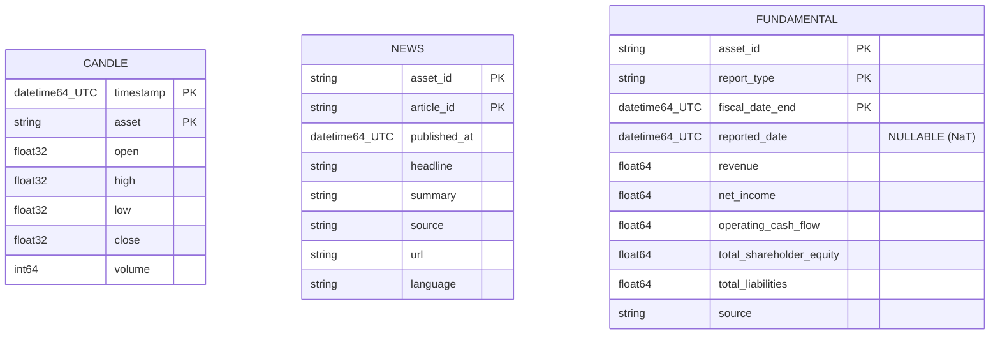

# Concept — Stage 2.1 — Contratos de storage medalhão (MedallionStore + bronze)

> **Escopo deste documento:** o que será feito nesta Stage, por quê, e
> decisões técnicas relevantes para entender o "porquê". O plano executável
> fica no [`technical.md`](./technical.md) correspondente.

## 1. Escopo

### Dentro do escopo

- **Introduzir o port-out `MedallionStore`** (`Protocol` em
  `shared/application/ports/out/medallion_store.py`): contrato estrutural
  stdlib-only (`collections.abc.Mapping`/`Sequence`) para **gravar** e **ler**
  datasets particionados em Parquet, com semântica garantida (append-only,
  dedup por PK lógica, filtro por partição) documentada na docstring. **Sem
  vazar** `pandas`/`pyarrow`/`duckdb`/`pandera`. Espelha a postura do port
  `ExperimentTracker` (1.5).
- **Adapter `ParquetMedallionStore`** (`shared/adapters/out/parquet/`):
  implementação concreta usando `pyarrow` para escrita particionada Hive
  (batch-por-partição) e `duckdb` para leitura/filtro por partição com
  *partition pruning*; valida o dado de entrada contra o schema `pandera`
  bronze no `write`.
- **Schemas `pandera` bronze** (`shared/adapters/out/parquet/schemas/bronze_schemas.py`)
  para `candle`/`news`/`fundamental`, **espelhando exatamente os dtypes reais**
  em disco (OHLC `float32`, `volume` `int64`, fundamentals `float64`, datas
  `datetime64[ns, UTC]`, `reported_date` NULLABLE). Vivem **só** no adapter.
- **`DuplicateKeyError(ApplicationError)`** adicionada a
  `shared/domain/exceptions/base.py`: exceção observável de colisão de PK
  lógica sem `overwrite`.
- **Política append-only com detecção de colisão de PK lógica** em fatos
  (recomputar tuplas de PK do incoming vs armazenado por partição).
- **`FakeMedallionStore`** in-memory (`tests/fakes/shared/`) que passa o
  **mesmo** contract test parametrizado que o `ParquetMedallionStore`
  (paridade fake↔real).
- **Contract test** parametrizado (fake↔real) + **integration test** gravando/
  lendo particionado de verdade em `tmp_path`.
- **Evoluir `Settings`** com um campo de raiz de dados
  (`data_root`/`medallion_root`), espelhado em `.env.example`.
- **Evoluir `composition_root.py`**: instanciar `ParquetMedallionStore`
  (único lugar), expondo-o em `ApplicationDependencies` **tipado pelo port**
  `MedallionStore`.
- **Adicionar deps** `pandas`/`pyarrow`/`duckdb`/`pandera` ao `pyproject.toml`
  (+ `uv.lock`).
- **ADRs** `2_1_0001` (partição + schemas bronze) e `2_1_0002` (forma do port),
  ambos `accepted`.

### Fora do escopo (explicitamente)

- **DuckDB/contratos gold** (Step 6) e **schemas silver** (Stage 4.1) —
  `non_goals` do roadmap.
- **Ingestão real** de candle/news/fundamental e suas **entidades de domínio**
  (`Candle`, `NewsArticle`, `FundamentalReport`) — Stages 2.2/2.3, que apenas
  **consomem** este port.
- **Calendário de pregão** (Stage 2.4).
- **Lógica silver** — em particular o `update_sentiment` / merge de sentimento
  em candle do repo antigo (`parquet_candle_repository.py:150-270`). **NÃO
  replicar.**
- Qualquer `delete`, migração de schema, ou transação cross-table no port
  (cresce sob novo ADR se um consumidor exigir).

### Vínculo com o roadmap

Esta Stage abre o **Step 2 — Camada bronze + calendário**
([`roadmap.md`](../../roadmap.md) §Stage 2.1) entregando o **primeiro
adapter-out real** da pipeline medalhão: o contrato e o adapter de
storage particionado que as Stages 2.2 (`IngestCandles`) e 2.3 (news/
fundamentals) **consomem** (`contratos_consumidos: [MedallionStore (2.1)]`),
e que 3.x/4.x leem de volta. Consome `Settings` (1.5), que ganha a raiz de
dados. Materializa a engine de dados de fundação (`pandas + duckdb`,
overview §11 / ADR `0.0.0022`).

## 2. Objetivo da Stage

Ao fim desta Stage, gravar um lote de linhas em um dataset bronze
`(layer, table)` particionado por `asset`/`year` em Parquet preserva o schema
(validado por `pandera`), é **append-only** (recolisão de PK lógica sem
`overwrite` levanta `DuplicateKeyError`), e a leitura filtra por partição (ao
menos por `asset`) via DuckDB sem carregar o dataset inteiro — com um
`FakeMedallionStore` in-memory passando exatamente o mesmo contract test que o
`ParquetMedallionStore`, tudo wirado pelo `composition_root` a partir de
`Settings`.

## 3. Contexto e premissas

### Contexto

O Step 2 precisa de uma fundação de storage antes de qualquer ingestão. O repo
antigo tinha um *analytics-store* Parquet manual
(`parquet_analytics_run_repository.py`) com layout Hive
(`<table>/asset=…/<chave>=…/year=…/<table>.parquet`), append-only com colisão
de PK lógica e batch-por-partição — porém atrás de um **ABC** com um método por
tabela, lendo tudo com `pd.read_parquet` (sem *pushdown*), e validando colunas
por subtração de conjuntos. Esta Stage **porta a semântica** (append-only,
dedup por PK, layout Hive) para um **`Protocol`** genérico `(layer, table)`,
substitui a validação frouxa por **`pandera`**, e adota **DuckDB** para leitura
com *partition pruning* (novo vs old). O dado bruto real (AAPL) já existe no
repo antigo e será reusado por 2.2/2.3 — daí a exigência de schemas que
**espelhem exatamente** os dtypes em disco.

### Premissas

- `pyarrow` escreve Parquet particionado e `duckdb` lê Parquet com filtro por
  coluna de partição fazendo *partition pruning* (DoD).
- Os dtypes reais em disco foram **verificados** (não assumidos): candle
  (`open/high/low/close` `float32`, `volume` `int64`, `timestamp` UTC); news
  (8 strings + `published_at` UTC); fundamental (5 `float64`, `fiscal_date_end`/
  `reported_date` UTC, **`reported_date` com 17/81 `NaT`**).
- A hierarquia `DomainError`/`ApplicationError` já existe em
  `shared/domain/exceptions/base.py` (1.x).
- `Settings` (1.5) tem `get_settings()` com `lru_cache` e
  `wire_dependencies(settings: Settings | None)`; **não tem** campo de raiz de
  dados hoje (gap verificado — só `mlflow_tracking_uri`/`database_url`/etc).
- O contrato `import-linter` `domain-purity` já proíbe `pandas`/`pyarrow` em
  `domain`; a `application` **ainda não** é proibida de importar essas libs — a
  Stage adiciona essa extensão (ver §5 I4 e §7 D2).

### Dependências

- `1.5-config-and-tracking` (`done`): o `Settings` é **consumido** e evoluído;
  o padrão de wiring (`wire_dependencies`/`ApplicationDependencies`,
  composition root como único criador de concretos) é seguido.

## 4. Contratos

### Introduzidos

- **`MedallionStore`** (`port-out`, `Protocol` em
  `shared/application/ports/out/medallion_store.py`) — INTRODUZIDO. Superfície
  mínima, tipos stdlib/`collections.abc`, **sem importar**
  `pandas`/`pyarrow`/`duckdb`/`pandera`:

  ```python
  from collections.abc import Mapping, Sequence
  from typing import Protocol

  Row = Mapping[str, object]

  class MedallionStore(Protocol):
      def write(
          self, *, layer: str, table: str, rows: Sequence[Row],
          overwrite: bool = False,
      ) -> None: ...
      def read(
          self, *, layer: str, table: str,
          filters: Mapping[str, object] | None = None,
      ) -> Sequence[Row]: ...
  ```

  - `write` é **append-only**; recolisão de PK lógica sem `overwrite` →
    `DuplicateKeyError`. As colunas de PK e partição por `(layer, table)` vêm
    do registry de schema (não do chamador).
  - `read` devolve linhas filtradas por partição (`filters`, ao menos
    `{"asset": …}`), com *partition pruning*; nunca carrega o dataset inteiro.
  - Assinatura exata fixada no
    [ADR 2.1.0002](../../adr/2_1_0002-medallion-store-port-shape.md).

- **Schemas `pandera` bronze** (no adapter) — INTRODUZIDOS. `DataFrameSchema`
  para `candle`/`news`/`fundamental` espelhando os dtypes reais (ver §9). Cada
  um pareado com sua metadata `logical_pk`/`partition_by`/`update_policy`
  (dataclass frozen, conceito do antigo `AnalyticsTableSchema`), formando o
  registry `(layer, table)`. Definição em
  [ADR 2.1.0001](../../adr/2_1_0001-medallion-partition-and-bronze-schemas.md).

- **`ParquetMedallionStore`** (`adapter` em
  `shared/adapters/out/parquet/parquet_medallion_store.py`) — INTRODUZIDO.
  Implementa `MedallionStore` sobre `pyarrow` (escrita) + `duckdb` (leitura) +
  `pandera` (validação no write). Recebe a raiz de dados injetada. **Nunca**
  entra em `omit`; conta cobertura + contract test + integration test.

- **`DuplicateKeyError`** (`ApplicationError`) — INTRODUZIDO em
  `shared/domain/exceptions/base.py`.

- **`Settings`** (config — fronteira `infrastructure/config`) — EVOLUÍDO. Ganha
  o campo de raiz de dados (`data_root`/`medallion_root`), espelhado em
  `.env.example`.

- **`ApplicationDependencies` / `wire_dependencies`** — EVOLUÍDO. Passa a expor
  `store: MedallionStore`, instanciado no `composition_root` a partir de
  `cfg.data_root`.

### Consumidos

- **`Settings`** — declarado/evoluído na Stage `1.5-config-and-tracking`;
  fornece a raiz de dados ao `composition_root`.
- **`ApplicationError`** — base de exceções já existente (1.x).

## 5. Invariantes e regras

- **I1 — Partição Hive `asset`/`<tabela>`/`year`.** Bronze escrito em
  `<medallion-root>/bronze/<table>/asset=<asset>/year=<year>/<table>.parquet`.
  `year` derivado da âncora temporal da tabela (candle→`timestamp`,
  news→`published_at`, fundamental→`fiscal_date_end`). Valores de partição
  sanitizados (None/vazio → sentinela estável), como o old `_safe_partition`.
- **I2 — Append-only com colisão de PK lógica.** No `write`, recomputar as
  tuplas de PK lógica do incoming vs as já armazenadas na(s) partição(ões)
  alvo; colisão sem `overwrite` → `DuplicateKeyError`; com `overwrite=True`, as
  linhas colididas são substituídas. Escrita em **batch-por-partição** (bucket
  por path), nunca linha-a-linha.
- **I3 — Pureza hexagonal (port stdlib-only).** O port `MedallionStore` troca
  só `collections.abc.Mapping`/`Sequence` e primitivos — **não** importa
  `pandas`/`pyarrow`/`duckdb`/`pandera`; o domínio permanece stdlib-only.
- **I4 — `application` não importa libs de storage (gate).** Estendendo o
  princípio que `domain-purity` aplica e que `tracker-no-mlflow-leak` aplica a
  `mlflow`: `pandas`/`pyarrow`/`duckdb`/`pandera` vivem **só** em adapters; a
  Stage adiciona um contrato `import-linter` (`store-no-storage-leak`) proibindo
  essas libs em `application` (e `domain`, por defesa em profundidade).
  `check_layout.py` + `import-linter` são gate.
- **I5 — Fidelidade de dtype/nulabilidade do bronze.** Os schemas `pandera`
  espelham **exatamente** os dtypes reais em disco (OHLC `float32`, `volume`
  `int64`, fundamentals `float64`, datas UTC, `reported_date` NULLABLE), senão
  2.2/2.3 não conseguem ler o raw existente.
- **I6 — Paridade fake↔real.** `FakeMedallionStore` e `ParquetMedallionStore`
  passam o **mesmo** contract test parametrizado (postura ADR `0.0.0021`),
  cobrindo append-only, colisão de PK, round-trip de schema e filtro por
  partição. + integration test gravando/lendo particionado real em `tmp_path`.
- **I7 — Leitura por partição com pruning.** `read` filtra por `asset` (e
  opcionalmente `year`) via DuckDB, varrendo só os arquivos de partição que
  casam — não carrega o dataset inteiro (DoD).
- **I8 — Recursos embarcados via `importlib.resources`.** Qualquer recurso
  embarcado (`.sql`/schema externo, se houver) é carregado via
  `importlib.resources.files()` — **nunca** `Path(__file__)`. A raiz de dados
  vem injetada de `Settings`/`composition_root` (não hardcoded).
- **I9 — Wiring centralizado, sem singleton global.** `ParquetMedallionStore` é
  criado **apenas** no `composition_root` a partir de `cfg.data_root`;
  `ApplicationDependencies.store` é tipado pelo **port** `MedallionStore`, não
  pelo concreto. Testes injetam `Settings` fake com `data_root` em `tmp_path`.
- **I10 — Gates verdes.** `mypy --strict` e `ruff` verdes; `make check` e
  `make test` verdes; `import-linter` verde; cobertura ≥90% no diff.

## 6. Casos de erro e exceções

- **C1 — Colisão de PK lógica sem `overwrite`.** `write` de uma linha cuja PK
  lógica já existe na partição alvo, com `overwrite=False` → `DuplicateKeyError`
  (`ApplicationError`), com mensagem citando `(layer, table)`, colunas de PK e
  amostra das colisões. Verificado em ambas as impls pelo contract test.
- **C2 — `(layer, table)` desconhecido.** `write`/`read` com um par fora do
  registry de schema → erro de aplicação (par não suportado). O par válido na
  Stage é `bronze` × {`candle`,`news`,`fundamental`}.
- **C3 — Dado de entrada viola o schema bronze.** `write` com colunas/dtypes
  fora do `DataFrameSchema` (ex.: `volume` `float`, `timestamp` tz-naive, NaN em
  coluna não-nullable) → erro de validação do `pandera` no adapter (não grava
  Parquet inválido). `reported_date` `NaT` é **aceito** (nullable, I5).
- **C4 — Leitura de dataset inexistente.** `read` de um `(layer, table)` ainda
  não gravado (sem arquivos) → devolve sequência **vazia** (não erro); filtro
  por `asset` ausente devolve vazio para aquele asset.

## 7. Decisões técnicas relevantes

### D1 — Convenção de partição Hive + forma dos schemas bronze

- **O quê:** Partição Hive `asset`/`<tabela>`/`year`, append-only em fatos com
  colisão de PK lógica; schemas `pandera` para candle/news/fundamental
  espelhando os dtypes reais (OHLC `float32`, `volume` `int64`, fundamentals
  `float64`, `reported_date` nullable). PKs: candle `(asset,timestamp)`, news
  `(asset_id,article_id)`, fundamental `(asset_id,report_type,fiscal_date_end)`.
  Rejeitadas: diretório plano sem partição; partição nativa pyarrow
  (`partition_cols`) que briga com a colisão de PK; validação frouxa por
  subtração de colunas (não pega drift de dtype).
- **Por quê:** Pré-fechado no ledger §B (2.1); layout Hive + append-only-com-
  colisão validados no old (`parquet_analytics_run_repository.py:69-73,103-139,
  155-168`). Dtypes **verificados** contra os parquets reais — divergência
  crítica: `reported_date` vem com `NaT` (17/81), logo DEVE ser nullable senão
  2.2/2.3 não leem o raw. `pandera` (já adotado, overview §11) dá contrato
  declarativo/testável de dtype+nulabilidade.
- **Fonte:** Ledger §B (2.1); old `parquet_analytics_run_repository.py` e
  `{candle,news,fundamental}_parquet_schema.py`, `analytics_store_schema.py:143-152`,
  `parquet_candle_repository.py:75-83`; dados reais inspecionados em
  `data/raw/.../AAPL/*.parquet` e `data/processed/fundamentals/AAPL/*.parquet`.
- **ADR:** [`../../adr/2_1_0001-medallion-partition-and-bronze-schemas.md`](../../adr/2_1_0001-medallion-partition-and-bronze-schemas.md)

### D2 — Forma do port `MedallionStore` (Protocol mínimo, sem vazar storage libs)

- **O quê:** `Protocol` em `application/ports/out` com `write(layer,table,rows,
  overwrite=)`/`read(layer,table,filters=)`, trocando só `collections.abc`/
  primitivos; semântica (append-only, dedup por PK, filtro por partição) na
  docstring; `DuplicateKeyError` em colisão. Estende o gate de pureza à
  `application` (novo contrato `import-linter` espelhando `tracker-no-mlflow-leak`).
  Rejeitadas: ABC com um método por tabela (acopla ao catálogo de tabelas, vaza
  o esquema medalhão, viola Protocol-não-ABC); passar DataFrame pelo port
  (vaza `pandas`/`pyarrow` para a `application`); chamar pyarrow/duckdb direto
  (não-testável, não-trocável).
- **Por quê:** Espelha a postura já estabelecida do port `ExperimentTracker`
  (1.5 / ADR `1.5.0002`); mantém o adapter trocável e testável por fake (ADR
  `0.0.0021`). O old usava ABC — corrigido para `Protocol` (regra hexagonal do
  projeto). Superfície mínima cobre exatamente 2.2/2.3.
- **Fonte:** `hex-arch-python`/`pytest-with-fakes`/`repository-pattern`; old
  `interfaces/analytics_run_repository.py:11` (ABC, não replicar); roadmap
  §Stage 2.2/2.3 (`contratos_consumidos: [MedallionStore (2.1)]`).
- **ADR:** [`../../adr/2_1_0002-medallion-store-port-shape.md`](../../adr/2_1_0002-medallion-store-port-shape.md)

### D3 — Engine de leitura/filtro por partição = DuckDB (escrita via pyarrow)

- **O quê:** Ler com DuckDB fazendo *partition pruning* por `asset`/`year`;
  escrever via `pyarrow`. DuckDB é **novo** vs o old (que lia tudo com
  `pd.read_parquet` sem *pushdown*).
- **Por quê:** Decisão de **fundação já tomada** (overview §11 / ADR `0.0.0022`:
  engine `pandas + duckdb`, SQL rápido e as-of joins sobre Parquet). Ganho
  concreto: filtrar por `asset`/`year` sem carregar o dataset todo. Reusa a
  justificativa de fundação — **não exige ADR de Stage próprio** (a integração
  concreta não traz nuance que mude a decisão); cita `0.0.0022`. Mesma postura
  de 1.5, que citou a fundação de tracking sem duplicar ADR.
- **Fonte:** Overview §11 (`0.0.0022`); ledger §B (2.1); DoD do roadmap
  ("leitura por partição filtra por asset").

### D4 — Raiz de dados em `Settings` (campo novo `data_root`)

- **O quê:** Adicionar um campo de raiz de dados (`data_root`, `Path`/`str`,
  default `data/`) em `Settings`, espelhado em `.env.example`; o
  `composition_root` passa `cfg.data_root` ao `ParquetMedallionStore`.
  Rejeitada: injetar `Path` direto no `composition_root` sem `Settings`.
- **Por quê:** Gap factual **verificado** — `Settings` (1.5) não tem raiz de
  dados (só `mlflow_tracking_uri`/`database_url`/etc). Padrão do projeto:
  config trocável por env sem tocar código (12-factor), instanciação só no
  composition root (como `mlflow_tracking_uri`). Injetar `Path` cru quebra esse
  padrão e dificulta override por ambiente. Trivial — segue a fundação 1.5,
  **sem ADR próprio**; registrado em technical §7 `[decision]` se necessário.
- **Fonte:** `settings.py` atual (sem campo de dados); `composition_root.py`
  (padrão `wire_dependencies(settings=None)`); old `config/data_paths.yaml`
  (paralelo de como o old organizava raízes de dados); skill `composition-root`.

### D5 — `DuplicateKeyError` como exceção de aplicação

- **O quê:** Definir `DuplicateKeyError(ApplicationError)` em
  `shared/domain/exceptions/base.py`. Rejeitada: `ValueError` cru, ou subclasse
  de `DomainError`.
- **Por quê:** O old levantava `DuplicateKeyError`, mas a colisão de PK é erro
  de **orquestração/estado** (não violação de regra de negócio pura nem erro de
  I/O) — encaixa em `ApplicationError` (hierarquia já existente). Mantém o port
  agnóstico de `pandas` e dá ao chamador um tipo observável estável para o
  contract test (fake e real levantam o mesmo). Trivial — segue a hierarquia
  existente, **sem ADR próprio**.
- **Fonte:** old `parquet_analytics_run_repository.py:103-139` (`DuplicateKeyError`);
  `shared/domain/exceptions/base.py` (hierarquia atual).

## 8. Integrações

### Internas (com outras Stages/módulos)

- `shared/infrastructure/config` (`Settings`): fornece `data_root` ao
  `composition_root`, que repassa ao `ParquetMedallionStore`.
- `bootstrap` (`composition_root`): único ponto de criação do concreto;
  expõe `store: MedallionStore`.
- `shared/domain/exceptions`: `DuplicateKeyError` reutilizável pelos
  consumidores (2.2/2.3).
- Consumidores futuros: `IngestCandles` (2.2) e ingestão news/fundamental (2.3)
  injetam o port; 3.x/4.x leem de volta.

### Externas

- **`pyarrow`** (lib): escrita Parquet particionada (batch-por-partição).
  Contrato esperado: escrever uma tabela Arrow/pandas em arquivo Parquet por
  partição preservando dtypes (incl. `datetime64[ns, UTC]`, `float32`).
- **`duckdb`** (lib): leitura de Parquet com filtro por coluna de partição e
  *partition pruning*. Contrato esperado: `SELECT ... WHERE asset = ?` sobre o
  glob de partições varrendo só os arquivos casados.
- **`pandera`** (lib): validação de `DataFrame` contra `DataFrameSchema` no
  `write`. Contrato esperado: erro de validação em dtype/coluna/nulabilidade
  fora do schema.

## 9. Modelo de dados (se aplicável)

Três tabelas bronze (espelhando o raw real verificado):



Metadata por tabela (`logical_pk`/`partition_by`/`update_policy`) — ver tabela
no [ADR 2.1.0001](../../adr/2_1_0001-medallion-partition-and-bronze-schemas.md).
Layout em disco: `<root>/bronze/<table>/asset=<asset>/year=<year>/<table>.parquet`.

## 10. Riscos e mitigações

| Risco | Probabilidade | Impacto | Mitigação |
|---|---|---|---|
| `pandera`/`pyarrow` perdem o tz UTC ou rebaixam `float32`→`float64` no round-trip | M | A | Integration test em `tmp_path` assertando dtype round-trip exato (incl. UTC e `float32`); schema `pandera` checa dtype no write |
| DuckDB não faz *partition pruning* como esperado (lê tudo) | M | M | Integration test assertando que `read({"asset": …})` retorna só o asset pedido; usar glob Hive + predicado na coluna de partição; decisão de fundação `0.0.0022` |
| Vazamento de lib de storage para a `application` | B | A | Port só com `collections.abc`/primitivos; novo contrato `import-linter` `store-no-storage-leak` barra `pandas`/`pyarrow`/`duckdb`/`pandera` fora de adapters; `check_layout.py` gate |
| `reported_date` `NaT` quebra a escrita/validação | M | A | Schema marca `reported_date` nullable (I5); contract/integration test cobrem linha com `NaT` |
| Colisão de PK lógica cara em datasets grandes (ler-tudo-da-partição) | B | B | Colisão checada por partição (não dataset todo); batch-por-partição; piloto é single-asset/baixo volume; otimizável depois sem mudar o contrato |
| Cobertura <90% no adapter/`composition_root` | M | M | Contract test (fake+real) + integration test cobrindo write/read/colisão/filtro; teste de `wire_dependencies` com `Settings` fake (`data_root` em `tmp_path`) |

## 11. Critérios de aceitação

- [ ] **A1** — `MedallionStore` existe como `Protocol` em
  `shared/application/ports/out/medallion_store.py` (stdlib/`typing`/
  `collections.abc` only, docstring PT declarando append-only + dedup por PK +
  filtro por partição, **sem** `import pandas/pyarrow/duckdb/pandera`).
- [ ] **A2** — Schemas `pandera` bronze (`candle`/`news`/`fundamental`) em
  `shared/adapters/out/parquet/schemas/bronze_schemas.py` espelham os dtypes
  reais (OHLC `float32`, `volume` `int64`, fundamentals `float64`, datas UTC,
  `reported_date` NULLABLE); validam um DataFrame de exemplo com esses dtypes
  (incl. `reported_date` `NaT` aceito); unit test por schema.
- [ ] **A3** — `DuplicateKeyError(ApplicationError)` em
  `shared/domain/exceptions/base.py`; teste cobre a subclasse (é
  `ApplicationError`, não `ValueError`).
- [ ] **A4** — `ParquetMedallionStore` implementa o port: escrita Hive
  particionada (`pyarrow`, batch-por-partição, append-only com colisão de PK +
  `DuplicateKeyError`) + leitura/filtro por partição (DuckDB *partition
  pruning*) + validação `pandera` no write; raiz de dados injetada (não
  hardcoded); **não** está em `omit`.
- [ ] **A5** — `FakeMedallionStore` in-memory passa o **mesmo** contract test
  parametrizado que `ParquetMedallionStore`, cobrindo append-only, colisão de PK
  (`DuplicateKeyError`), round-trip de schema e filtro por partição.
- [ ] **A6** — Integration test em `tmp_path` grava/lê dataset particionado
  real: valida layout Hive (`asset=…/year=…`), round-trip de dtypes (UTC +
  `float32` + `int64` + `float64` + `NaT`), append-only e que o filtro por
  `asset` retorna só o asset pedido.
- [ ] **A7** — `Settings` ganha campo de raiz de dados (`data_root`), espelhado
  em `.env.example`; unit test cobre default + override por env;
  `composition_root` expõe `store: MedallionStore` e instancia
  `ParquetMedallionStore(cfg.data_root)` (único lugar); teste exercita o wiring
  com `Settings` fake (`data_root` em `tmp_path`).
- [ ] **A8** — `pandas`/`pyarrow`/`duckdb`/`pandera` em `[project].dependencies`;
  `uv.lock` sincronizado; `python -c "import pandas, pyarrow, duckdb, pandera"`
  ok.
- [ ] **A9** — Novo contrato `import-linter` (`store-no-storage-leak`) barra
  `pandas`/`pyarrow`/`duckdb`/`pandera` em `application`/`domain`;
  `check_layout.py` + `import-linter` verdes; `mypy --strict` e `ruff` verdes;
  `make check` e `make test` verdes; cobertura ≥90% no diff.
- [ ] **A10** — ADRs `2_1_0001` (partição + schemas bronze) e `2_1_0002` (forma
  do port) com `status: accepted`.

## 12. Checklist de validação interna

- [x] Todos os contratos introduzidos têm assinatura definida? (`MedallionStore`,
  schemas bronze, `ParquetMedallionStore`, `DuplicateKeyError`, `Settings`,
  `ApplicationDependencies` — §4)
- [x] Toda decisão em §7 tem fonte rastreável? (ledger §B, overview §11,
  old paths verificados, dados reais inspecionados, skills)
- [x] Toda integração externa tem contrato definido? (`pyarrow`/`duckdb`/
  `pandera` — §8)
- [x] Decisões com alternativa real descartada têm ADR escrito? (D1→2.1.0001,
  D2→2.1.0002; D3/D4/D5 reusam fundação/hierarquia existente — sem ADR próprio,
  justificado in-loco)
- [x] Dependências de Stages anteriores estão satisfeitas? (1.5 `done`; `Settings`
  disponível)
- [x] Stage cabe em ~3–8 Tasks? (11 Tasks no technical, dentro do teto
  `ROADMAP-1` de ~12–15 — decisões já tomadas, menos ambiguidade por Task)
- [x] Riscos críticos têm mitigação plausível? (§10)
- [x] O port não vaza libs de storage e o domínio permanece puro? (I3, I4)

## 13. Questões em aberto

- Nenhuma bloqueante. O nome exato do campo de raiz de dados (`data_root` vs
  `medallion_root`) e a semântica exata do `read` vazio vs DuckDB sobre glob
  inexistente são detalhes de implementação a fixar no `technical.md`/execução —
  o contrato (append-only, filtro por partição, fidelidade de dtype) já está
  declarado.

## 14. Referências

- [`../../overview.md`](../../overview.md) — §6 (restrições), §7 (abordagem),
  §11 (ADR `0.0.0022` engine pandas+duckdb, `0.0.0021` contract tests).
- [`../../roadmap.md`](../../roadmap.md) — Stage `2.1-medallion-storage-contracts`
  e consumidoras (2.2, 2.3, 4.1).
- [`../../autonomous-run-decision-ledger.md`](../../autonomous-run-decision-ledger.md)
  — §B linha 2.1.
- ADRs desta Stage:
  [`2.1.0001`](../../adr/2_1_0001-medallion-partition-and-bronze-schemas.md),
  [`2.1.0002`](../../adr/2_1_0002-medallion-store-port-shape.md).
- Stage 1.5 (consumida): [`../1.5-config-and-tracking/concept.md`](../1.5-config-and-tracking/concept.md);
  ADR [`1.5.0002`](../../adr/1_5_0002-experiment-tracker-port-shape.md) (postura do port).
- Old (semântica, não implementação):
  `financial-time-series-forecasting/src/adapters/parquet_analytics_run_repository.py:28-33,69-73,103-139,155-168`,
  `src/infrastructure/schemas/{candle,news,fundamental}_parquet_schema.py`,
  `src/infrastructure/schemas/analytics_store_schema.py:143-152`,
  `src/interfaces/analytics_run_repository.py:11` (ABC — não replicar),
  `config/data_paths.yaml`; dados reais em `data/raw/.../AAPL/*.parquet`,
  `data/processed/fundamentals/AAPL/*.parquet`.
