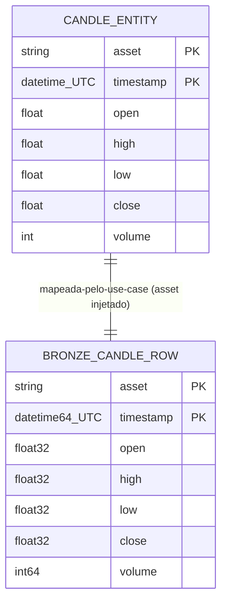

# Concept — Stage 2.2 — Ingestão de candles de mercado (`market_data`)

> **Escopo deste documento:** o que será feito nesta Stage, por quê, e
> decisões técnicas relevantes para entender o "porquê". O plano executável
> fica no [`technical.md`](./technical.md) correspondente.

## 1. Escopo

### Dentro do escopo

- **Criar o primeiro bounded context de _feature_ — `market_data` — como
  container layered** em `src/financial_forecasting/features/market_data/`,
  com as três camadas hexagonais (`domain` ← `application` ← `adapters/out`) e a
  **prova de direção inward-only** no BC novo: adicionar `market_data` aos
  containers do contrato `hexagonal-layers` no `.importlinter` (o `.importlinter`
  já previu, linha 42 verbatim, "cada feature vira container ao ganhar layers").
- **Entity `Candle`** (`domain/entities/candle.py`): `dataclass` frozen, **domain
  puro stdlib-only**, identidade lógica `(asset, timestamp)`, com `__post_init__`
  validando **invariantes OHLC fortes** (ver §5) — endurecendo o old, que só
  checava `close>0`/`volume>=0`.
- **Helpers UTC de domínio** (`domain/time/utc.py`): `require_tz_aware`/`to_utc`/
  `ensure_utc`/`parse_iso_utc` + normalização para `00:00 UTC` no diário,
  reimplementados em domínio puro (stdlib `datetime`) a partir do old.
- **Port-out `CandleFetcher`** (`application/ports/out/candle_fetcher.py`):
  **`Protocol`** estrutural (não a ABC do old) com
  `fetch_candles(symbol, start, end) -> list[Candle]`, tipos stdlib.
- **Use case `IngestCandles`** (`application/use_cases/ingest_candles.py`):
  recebe `IngestCandlesRequest` (frozen) e devolve `IngestCandlesResult`
  (frozen) — **nunca** devolve `Candle` para fora. Injeta `CandleFetcher` +
  `MedallionStore` (port 2.1); mapeia cada `Candle → Row` **injetando
  `asset`**; grava `layer="bronze"`, `table="candle"`.
- **Adapter `ParquetRawCandleFetcher`** (`adapters/out/parquet/`): **origem
  default** da ingestão — lê
  `data/raw/market/candles/AAPL/candles_AAPL_1d.parquet` (4024 linhas) e mapeia
  para `list[Candle]` preservando dtypes (`float32`/`int64`) e tz UTC.
  Implementa o **mesmo** port `CandleFetcher`.
- **Adapter `YfinanceCandleFetcher`** (`adapters/out/yfinance/`): **construído**
  (retry+backoff exponencial, normalização de `MultiIndex`, tz→`00:00 UTC`,
  validação de colunas) portando a lógica do old com julgamento — mas **não é o
  caminho default** e seu teste de integração **não bate na API ao vivo**.
- **`FakeCandleFetcher`** in-memory (`tests/fakes/`): fake comportamental
  determinístico (não `Mock`) que devolve `list[Candle]` pré-carregada e passa o
  **mesmo** contract test do port (paridade com o real-parquet).
- **`market_data` no `.importlinter`** + **`yfinance>=0.2`** no `pyproject.toml`
  (+ `uv.lock`).
- **ADRs** `2_2_0001` (feature como container layered) e `2_2_0002` (reuso do raw
  como origem default vs yfinance ao vivo), ambos `accepted`.

### Fora do escopo (explicitamente)

- **Intervalos != `1d`** e **ativos != `AAPL`** (`non_goals` do roadmap).
- **Append incremental sofisticado** (cálculo de delta/janela): a re-ingestão
  apoia-se na semântica append-only + `DuplicateKeyError` do `MedallionStore`
  (2.1), não em lógica nova nesta Stage (`non_goals`).
- **Bater na API yfinance ao vivo em teste** (robustez overnight): teste de
  integração usa fixture/`monkeypatch`; live só com `skipif(sem rede)`.
- **News e fundamentals** (`NewsArticle`/`FundamentalReport`, ports/adapters
  Alpha Vantage) — **Stage 2.3**.
- **`DataQualityReporter`, CLI/entrypoint (`main_candles.py`), repository de
  candles** do old — **descartados** (o `MedallionStore` 2.1 substitui o
  repository; ver §7 D3).
- **Wiring no `composition_root`** de um caminho de produção end-to-end:
  o `composition_root` expõe o `store` (2.1); a escolha de fetcher
  default/concreto e seu wiring podem ficar para a Stage que consome a ingestão
  — esta Stage entrega os adapters e o use case testáveis por injeção.
- **Fechamento da Stage** (commit `complete`, marcar `done` no roadmap) — é do
  orquestrador, após auditoria independente.

### Vínculo com o roadmap

Esta Stage é a segunda do **Step 2 — Camada bronze + calendário**
([`roadmap.md`](../../roadmap.md) §Stage 2.2). Entrega o **primeiro bounded
context de feature** da pipeline (`features/market_data/`), consumindo o port
`MedallionStore` (2.1, `contratos_consumidos: [MedallionStore (2.1)]`) para
gravar a bronze `candle`. Materializa a `definition_of_done` do roadmap
("`IngestCandles` grava candles de AAPL em bronze com invariantes OHLC
validadas; fake passa contract test; reusa raw existente sem re-baixar por
padrão") e desbloqueia 3.1 (`technical-indicators`, `depends_on: 2.2, 2.4`).

## 2. Objetivo da Stage

Ao fim desta Stage, executar `IngestCandles` para `AAPL`/`1d` lê os candles da
**origem default (o raw existente, sem re-baixar)**, valida cada `Candle` contra
as invariantes OHLC fortes, e os grava na bronze `(bronze, candle)` via
`MedallionStore` — injetando `asset="AAPL"` em cada linha — devolvendo um DTO
frozen com a contagem ingerida (nunca uma `Candle`), com `FakeCandleFetcher` e
`ParquetRawCandleFetcher` passando o mesmo contract test do port `CandleFetcher`
e com `market_data` provado inward-only no `import-linter`.

## 3. Contexto e premissas

### Contexto

O Step 2 já tem a fundação de storage (2.1): o port `MedallionStore`, o adapter
`ParquetMedallionStore` e os schemas `pandera` bronze — em particular
`CANDLE` (`shared/adapters/out/parquet/schemas/bronze_schemas.py`),
`logical_pk=(asset, timestamp)`, partição `asset`/`year`, `strict=True`,
`coerce=False`. O raw real de AAPL **já existe** em
`data/raw/market/candles/AAPL/candles_AAPL_1d.parquet` (4024 linhas) e foi a
base contra a qual os schemas 2.1 foram calibrados. Esta Stage é a primeira a
**consumir** esse port a partir de um BC de feature.

O repo antigo tinha `Candle`/`CandleFetcher`/`FetchCandlesUseCase`/
`YFinanceCandleFetcher`. Esta Stage **porta a semântica** (assinatura do
fetcher, retry+backoff, normalização tz) com julgamento, mas **corrige** três
pontos: (1) invariantes OHLC fracas → fortes; (2) ABC → `Protocol`; (3)
`tuple[int,int]` de retorno → DTO frozen. Descarta o que 2.1/2.3 já cobrem ou
tornaram obsoleto (repository de candles, `DataQualityReporter`, CLI,
`update_sentiment`).

### Premissas

- O raw em disco tem **6 colunas** (`open/high/low/close` `float32`, `volume`
  `int64`, `timestamp` `datetime64[ns, UTC]` a `00:00 UTC`) e **não tem coluna
  `asset`** — **verificado** (`pd.read_parquet(...).dtypes`). O schema bronze
  `CANDLE` **exige** `asset` (gap real — ver §5 I9, §7 D4).
- O `MedallionStore` (2.1, `done`) garante append-only + dedup por PK lógica
  `(asset, timestamp)`, levantando `DuplicateKeyError(ApplicationError)` em
  colisão sem `overwrite` — comportamento provado pelo `FakeMedallionStore` e
  pelo contract test 2.1. **Não** será reimplementado aqui.
- `features/` está **vazio** hoje (só `__init__.py`); `market_data` é o primeiro
  feature container — `check_layout.py`/`import-linter` ainda não modelam
  layers de feature (apenas o container `shared`). O `.importlinter` linha 42
  declara explicitamente que cada feature vira container ao ganhar layers.
- `yfinance` **não exige chave** de API; o adapter é construível, mas o teste de
  integração não depende de rede (robustez overnight).
- A hierarquia `DomainError`/`ApplicationError` e o `DuplicateKeyError` já
  existem em `shared/domain/exceptions/base.py` (1.x/2.1).

### Dependências

- **`2.1-medallion-storage-contracts`** (`done`): o port `MedallionStore` é
  **consumido** pelo `IngestCandles`; o schema bronze `CANDLE`
  (`logical_pk`, dtypes, `asset` obrigatório) é **reusado, não redefinido**; o
  `FakeMedallionStore` é reusado nos testes do use case.

## 4. Contratos

### Introduzidos

- **`Candle`** (`entity`, `features/market_data/domain/entities/candle.py`) —
  INTRODUZIDO. `dataclass` frozen, **domain puro stdlib-only**, identidade
  lógica `(asset, timestamp)`:

  ```python
  from dataclasses import dataclass
  from datetime import datetime

  @dataclass(frozen=True)
  class Candle:
      asset: str
      timestamp: datetime   # tz-aware UTC, normalizado a 00:00 no diário
      open: float
      high: float
      low: float
      close: float
      volume: int

      def __post_init__(self) -> None:
          ...  # valida invariantes OHLC fortes (§5) — levanta ValueError
  ```

- **`CandleFetcher`** (`port-out`, `Protocol` em
  `features/market_data/application/ports/out/candle_fetcher.py`) — INTRODUZIDO.
  Estrutural, tipos stdlib, **sem** importar adapters/`pandas`:

  ```python
  from datetime import datetime
  from typing import Protocol
  from financial_forecasting.features.market_data.domain.entities.candle import Candle

  class CandleFetcher(Protocol):
      def fetch_candles(self, symbol: str, start: datetime, end: datetime) -> list[Candle]: ...
  ```

  Assinatura replicada do old; semântica temporal (start/end tz-aware,
  `Candle.timestamp` sempre UTC) documentada na docstring.

- **`IngestCandlesRequest` / `IngestCandlesResult`** (`dto`, frozen, em
  `features/market_data/application/use_cases/ingest_candles.py`) —
  INTRODUZIDOS:

  ```python
  @dataclass(frozen=True)
  class IngestCandlesRequest:
      asset: str            # "AAPL" (único suportado nesta Stage)
      start: datetime       # tz-aware
      end: datetime         # tz-aware

  @dataclass(frozen=True)
  class IngestCandlesResult:
      asset: str
      ingested: int         # nº de candles gravados na bronze
      start: datetime
      end: datetime
  ```

- **`IngestCandles`** (`use case`, mesma módulo) — INTRODUZIDO. Injeta
  `CandleFetcher` + `MedallionStore`; `execute(request) -> IngestCandlesResult`.
  Mapeia `Candle → Row` (`Mapping[str, object]`) injetando `asset`; grava
  `write(layer="bronze", table="candle", rows=..., overwrite=False)`. **Nunca**
  retorna `Candle` nem `tuple[int,int]`.

- **`ParquetRawCandleFetcher`** (`adapter`,
  `features/market_data/adapters/out/parquet/parquet_raw_candle_fetcher.py`) —
  INTRODUZIDO. Implementa `CandleFetcher` lendo o parquet raw existente;
  `pandas`/`pyarrow` vivem **só** aqui.

- **`YfinanceCandleFetcher`** (`adapter`,
  `features/market_data/adapters/out/yfinance/yfinance_candle_fetcher.py`) —
  INTRODUZIDO. Implementa `CandleFetcher` sobre `yfinance` (retry+backoff,
  normalização tz/`MultiIndex`); `yfinance` vive **só** aqui.

### Consumidos

- **`MedallionStore`** (`port-out`) — declarado na Stage
  `2.1-medallion-storage-contracts`. `write(*, layer, table, rows, overwrite)`/
  `read(*, layer, table, filters)`; append-only; `DuplicateKeyError` em colisão.
- **Schema bronze `CANDLE`** — declarado na 2.1
  (`shared/adapters/out/parquet/schemas/bronze_schemas.py::CANDLE`):
  `logical_pk=(asset, timestamp)`, colunas `asset(str)`/`timestamp(UTC)`/
  `open|high|low|close(float32)`/`volume(int64)`, `strict=True`,
  `coerce=False`. **Reusado, não redefinido** — o use case produz `Row`s que
  casam com ele.
- **`DuplicateKeyError`** (`ApplicationError`) — declarado na 2.1.

## 5. Invariantes e regras

- **I1 — OHLC consistente (entity).** `Candle.__post_init__` exige
  `high >= max(open, close)`, `low <= min(open, close)` e `high >= low`. Endurece
  o old (que só checava `close>0`/`volume>=0`). Violação → `ValueError`.
- **I2 — Não-negatividade OHLCV.** Todos os valores `open/high/low/close/volume`
  são `>= 0`. Violação → `ValueError`.
- **I3 — Sem nulos.** Nenhum campo do `Candle` é `None` (frozen dataclass +
  checagem explícita de `None` no `__post_init__`). Violação → `ValueError`.
- **I4 — Timestamp tz-aware UTC normalizado.** `Candle.timestamp` é tz-aware em
  UTC e, no diário, normalizado a `00:00 UTC` (via `require_tz_aware`/`to_utc`
  na fronteira do adapter), alinhando com `datetime64[ns, UTC]` do bronze.
  Naive → `ValueError`.
- **I5 — Identidade lógica `(asset, timestamp)`.** A `Candle` carrega `asset`
  como parte da identidade; é a mesma chave da PK lógica do bronze `CANDLE`.
- **I6 — Sem timestamps duplicados (invariante de COLEÇÃO).** Não validada na
  entity individual (uma `Candle` não conhece duplicidade); delegada à PK lógica
  `(asset, timestamp)` do `MedallionStore` (`DuplicateKeyError` com
  `overwrite=False`) e/ou checada na coleção dentro do use case. Ver §7 D5.
- **I7 — Use case não vaza entity.** `IngestCandles.execute` retorna
  `IngestCandlesResult` (frozen, contagem + metadados), **nunca** `Candle` nem
  `tuple[int,int]`.
- **I8 — Pureza do domínio (gate).** `features/market_data/domain` importa **só
  stdlib** (sem `pandas`/`pyarrow`/`torch`/`pydantic`); a `application` do BC
  não importa `adapters` nem `pandas`/`pyarrow`/`pandera` (inward-only +
  `store-no-storage-leak` por extensão ao novo container). Provado pelo
  `import-linter` quando `market_data` vira container layered.
- **I9 — Injeção de `asset` no mapeamento raw→bronze.** O raw em disco **não
  tem** coluna `asset`; o use case injeta `asset` (do `request`) ao montar cada
  `Row`. Sem isso, o `pandera` `strict=True` rejeita a escrita. Ver §7 D4.
- **I10 — Preservação de dtype no mapeamento.** O mapeamento `Candle → Row`
  mantém `open/high/low/close` compatíveis com `float32` e `volume` com `int64`
  (não promover para `float64`), para casar `coerce=False` do schema bronze.
- **I11 — Forma `Protocol` do port.** `CandleFetcher` é um `Protocol`
  estrutural (satisfeito por duck-typing), não uma ABC; adapters não herdam da
  `application`. Ver §7 D2.
- **I12 — Origem default = raw existente.** O caminho de produção default lê o
  raw via `ParquetRawCandleFetcher` (não re-baixa); `YfinanceCandleFetcher`
  existe mas não é default. Ver §7 D3.
- **I13 — Teste de integração não bate na API ao vivo.** O teste do
  `YfinanceCandleFetcher` usa `monkeypatch` de `yf.download`/fixture
  (`@pytest.mark.integration`); live só com `pytest.mark.skipif(sem rede)`.
- **I14 — Paridade fake↔real.** `FakeCandleFetcher` e `ParquetRawCandleFetcher`
  passam o **mesmo** contract test parametrizado do port `CandleFetcher`
  (postura ADR `0.0.0021`).
- **I15 — Gates verdes.** `mypy --strict` e `ruff` verdes; `make check` e
  `make test` verdes; `import-linter` verde com `market_data` nos containers;
  `check_layout.py` verde para a estrutura da feature; cobertura ≥90% no diff.

## 6. Casos de erro e exceções

- **C1 — `Candle` inválido na construção.** OHLC inconsistente (viola I1), valor
  negativo (I2), campo `None` (I3) ou `timestamp` naive (I4) → `ValueError` no
  `__post_init__`, antes de qualquer escrita.
- **C2 — Re-ingestão de candle já presente na bronze.** `IngestCandles` que
  produz uma `Row` cuja PK lógica `(asset, timestamp)` já existe na partição
  alvo, com `overwrite=False` → `DuplicateKeyError(ApplicationError)` propagado
  do `MedallionStore` (a Stage não engole a colisão silenciosamente). Re-ingestão
  intencional usa `overwrite=True` (decisão do chamador), fora do default.
- **C3 — `Row` viola o schema bronze.** Linha sem `asset` (I9 não aplicada) ou
  com dtype divergente (`volume` `float`, `timestamp` tz-naive — I10) →
  erro de validação `pandera` no adapter `ParquetMedallionStore` (não grava
  Parquet inválido). É a rede de segurança do contrato 2.1.
- **C4 — Raw inexistente/ilegível na origem default.** `ParquetRawCandleFetcher`
  apontando para um arquivo ausente/corrompido → erro de I/O do adapter,
  mapeado para um erro de aplicação claro (arquivo de origem indisponível); não
  silencia em lista vazia.
- **C5 — `start > end` ou `start`/`end` naive no request.** O use case (ou o
  adapter, na fronteira) valida via `require_tz_aware`/comparação e levanta
  `ValueError`, espelhando o old (`require_tz_aware`, `start must be <= end`).
- **C6 — yfinance sem dados / colunas faltando (adapter).** `df` vazio ou sem
  `Open/High/Low/Close/Volume` → erro do `YfinanceCandleFetcher` após esgotar os
  retries; **não** afeta o caminho default (parquet).

## 7. Decisões técnicas relevantes

### D1 — `market_data` como container layered no `import-linter`

- **O quê:** Adicionar `financial_forecasting.features.market_data` aos
  `containers` do contrato `hexagonal-layers` no `.importlinter` e provar
  inward-only (`domain` ← `application` ← `adapters`) no BC novo, mantendo
  `exhaustive = False` para tolerar camadas opcionais ausentes (não há
  `adapters/in`/`ports/in` nesta Stage). Rejeitadas: deixar `market_data`
  sem modelagem (a 1ª feature ficaria sem prova de direção); criar um contrato
  `layers` separado por feature (duplica o bloco do `shared` sem ganho — o
  `type=layers` aceita múltiplos containers).
- **Por quê:** Finding carregado da Stage 1.3 / ADR `1.3.0001`: o contrato
  modela layers **por container** e previu explicitamente "cada feature vira
  container ao ganhar layers" (comentário verbatim no `.importlinter` linha 42).
  É gate `strict` pré-declarado — sem isso, a primeira feature não tem prova
  mecânica da regra de dependência. Custo baixo (acrescentar uma linha aos
  containers existentes).
- **Fonte:** `.importlinter` linha 42 (comentário verbatim); ADR
  [`1.3.0001`](../../adr/1_3_0001-import-linter-as-architecture-fitness-function.md)
  (negative consequence: "a new feature with populated layers may require
  touching `.importlinter`"); `docs/LAYOUT.md` §1/§3 (estrutura `features/<feature>/`,
  direção inward).
- **ADR:** [`../../adr/2_2_0001-market-data-feature-as-layered-container.md`](../../adr/2_2_0001-market-data-feature-as-layered-container.md)

### D2 — Forma do port `CandleFetcher`: `Protocol` vs ABC

- **O quê:** `Protocol` estrutural em `application/ports/out` (não a ABC do old).
  Rejeitada: ABC herdada pelos adapters (acopla adapter→application, padrão do
  old).
- **Por quê:** Regra hexagonal do projeto (`hex-arch-python`, LAYOUT §3): ports
  são `Protocol` estrutural satisfeito por duck-typing — adapters não herdam da
  `application`, e tipagem via `TYPE_CHECKING` não cria acoplamento de runtime
  (o `.importlinter` já liga `exclude_type_checking_imports`). Mesma postura dos
  ports `MedallionStore` (2.1) e `ExperimentTracker` (1.5). Baixo risco, decisão
  de design padrão do repo — **sem ADR próprio**.
- **Fonte:** skill `hex-arch-python`; LAYOUT §3; ADR `2.1.0002`/`1.5.0002`
  (postura de port); old `src/interfaces/candle_fetcher.py` (ABC — não replicar).

### D3 — Origem default da ingestão: reuso do raw via adapter parquet vs yfinance ao vivo

- **O quê:** Criar `ParquetRawCandleFetcher` (origem **default**, lê o parquet
  raw existente) implementando o **mesmo** port `CandleFetcher`;
  `YfinanceCandleFetcher` existe mas **não** é o default; teste de integração
  nunca bate na API ao vivo (live só com `skipif` sem rede). Rejeitadas:
  yfinance como origem default (depende de rede, viola o reuso-de-raw do ledger
  e a robustez overnight); reusar o raw **só** no teste, sem adapter de produção
  (deixa a DoD "reusa raw existente sem re-baixar por padrão" sem implementação
  real).
- **Por quê:** Decisão do autor no ledger (§A: "a grade reusa **só dados
  brutos** `raw/`") + finding overnight (robustez: não depender de rede). O port
  abstrai a **origem** dos candles; sem um adapter que leia o raw, a DoD
  "reusa raw existente sem re-baixar por padrão" não tem implementação de
  produção. O adapter parquet é simples-e-trocável e fecha o gap.
  **Nota de proveniência:** este arquivo **não** está em `arquivos_a_criar` do
  roadmap (que lista só o yfinance) — é adição justificada pelo finding;
  registrar como ADR e sinalizar `[deviation]` no `technical.md` §7.
- **Fonte:** [`autonomous-run-decision-ledger.md`](../../autonomous-run-decision-ledger.md)
  §A (linha "reusa só dados brutos `raw/`"); finding overnight (BRIEF/handoff
  2.2); roadmap §Stage 2.2 DoD ("reusa raw existente sem re-baixar por padrão");
  raw verificado em `data/raw/market/candles/AAPL/candles_AAPL_1d.parquet`.
- **ADR:** [`../../adr/2_2_0002-reuse-raw-candles-default-vs-live-yfinance.md`](../../adr/2_2_0002-reuse-raw-candles-default-vs-live-yfinance.md)

### D4 — Onde a coluna `asset` entra no mapeamento

- **O quê:** O use case `IngestCandles` injeta `asset` (derivado do
  `request.asset`) ao montar cada `Row` da bronze. O raw em disco tem só os 6
  OHLCV+timestamp; o schema bronze `CANDLE` exige `asset` (`logical_pk=(asset,
  timestamp)`, `strict=True`). A `Candle` também carrega `asset` (identidade),
  mas é a `application` (use case) que materializa a coluna na `Row`.
  Rejeitadas: injetar `asset` no adapter `ParquetMedallionStore` (o store recebe
  rows prontas, agnóstico de schema do chamador); deixar o domínio inferir
  `asset` (domínio não conhece o símbolo de origem).
- **Por quê:** Gap real **verificado** entre o raw (sem `asset`:
  `open/high/low/close` `float32`, `volume` `int64`, `timestamp` UTC) e o
  `_CANDLE_SCHEMA` da 2.1 (`strict=True` exige `asset`). É responsabilidade da
  `application` (o use case conhece o `asset` do request e monta a `Row`).
  Load-bearing mas trivial — documentado aqui; **sem ADR isolado**, registrável
  como `[decision]` no `technical.md` §7 se necessário.
- **Fonte:** `bronze_schemas.py::_CANDLE_SCHEMA`/`CANDLE` (2.1, `asset`
  obrigatório, `logical_pk=(asset, timestamp)`); raw real verificado (6 colunas,
  sem `asset`); CLAUDE.md nota 6 (use cases mapeiam DTO↔domínio na application).

### D5 — Validação de timestamps duplicados (invariante de coleção)

- **O quê:** Não validar "sem duplicados" na `Candle` individual; validar na
  coleção dentro do use case e/ou delegar à PK lógica `(asset, timestamp)` do
  `MedallionStore`, que levanta `DuplicateKeyError` com `overwrite=False`.
  Rejeitada: checar duplicidade dentro do `__post_init__` da entity (uma
  entidade individual não conhece a coleção).
- **Por quê:** Duplicidade é invariante de **agregado/coleção**, não da entidade
  individual. O `MedallionStore` (2.1) já garante dedup por PK lógica
  (comportamento provado pelo `FakeMedallionStore` e contract test 2.1).
  Reusar essa garantia evita lógica duplicada — custo zero, alinhado ao contrato
  2.1. **Sem ADR próprio.**
- **Fonte:** ADR `2.1.0001`/concept 2.1 §5 I2 (append-only com colisão de PK);
  skill `ddd-tactical-patterns` (invariante de agregado vs entidade).

### D6 — DTO de retorno do use case (vs `tuple[int,int]` do old)

- **O quê:** `IngestCandlesResult` (dataclass frozen) com a contagem ingerida +
  metadados (`asset`, `start`, `end`), substituindo o `tuple[int,int]` do old e
  **nunca** devolvendo `list[Candle]`. Rejeitada: retornar `tuple`/`list[Candle]`
  cru (vaza entity / não-nomeado).
- **Por quê:** Regra do projeto — use cases recebem/devolvem DTO frozen, nunca
  entity para fora (CLAUDE.md nota 6, LAYOUT). O old devolvia `tuple` cru;
  replicar-com-julgamento exige um DTO nomeado e tipado. Baixo risco — **sem ADR
  próprio**.
- **Fonte:** CLAUDE.md nota 6; LAYOUT §3 (DTO na fronteira da application); old
  `src/use_cases/fetch_candles_use_case.py` (`-> tuple[int, int]`, não replicar).

## 8. Integrações

### Internas (com outras Stages/módulos)

- `shared/application/ports/out/medallion_store.py` (`MedallionStore`):
  o `IngestCandles` injeta e chama `write(layer="bronze", table="candle", ...)`.
- `shared/adapters/out/parquet/schemas/bronze_schemas.py` (`CANDLE`): o schema
  cujas colunas/dtypes/PK o mapeamento `Candle → Row` deve satisfazer
  (consumido indiretamente via validação no `write`).
- `shared/domain/exceptions/base.py` (`DuplicateKeyError`): tipo observável
  propagado em colisão de PK.
- `tests/fakes/shared/` (`FakeMedallionStore`, 2.1): reusado no teste do use
  case (sem tocar disco).
- Consumidores futuros: `feature_engineering` (3.1) lê a bronze `candle` de volta.

### Externas

- **`yfinance`** (lib): origem de candles **não-default**. Contrato esperado:
  `yf.download(symbol, start, end, interval="1d", auto_adjust=False)` devolve um
  `DataFrame` com colunas `Open/High/Low/Close/Volume` e índice temporal
  (possivelmente `MultiIndex`/tz-naive — normalizado pelo adapter). Sem chave de
  API.
- **Parquet raw** (`data/raw/market/candles/AAPL/candles_AAPL_1d.parquet`):
  origem **default**. Contrato esperado: 6 colunas (`open/high/low/close`
  `float32`, `volume` `int64`, `timestamp` `datetime64[ns, UTC]` a `00:00`),
  **sem** `asset` (verificado).

## 9. Modelo de dados (se aplicável)

A entity de domínio e a `Row` bronze gravada:



A `Row` casa exatamente o schema bronze `CANDLE` (2.1). O raw em disco **não**
tem `asset`; o use case o injeta a partir do `request` (I9 / D4).

## 10. Riscos e mitigações

| Risco | Probabilidade | Impacto | Mitigação |
|---|---|---|---|
| Mapeamento promove `float32`→`float64` ou `volume`→`float`, quebrando `coerce=False` do bronze | M | A | I10; teste do use case assertando dtypes da `Row`; rede de segurança do `pandera` no `write` (C3) |
| Esquecer de injetar `asset` → `pandera strict` rejeita | M | A | I9/D4; teste do use case verificando `asset` em toda `Row`; gravação real em teste de integração |
| Teste de integração do yfinance bate na rede (anti-padrão do old) | M | M | I13; `monkeypatch` de `yf.download`; live só com `skipif(sem rede)` + `@pytest.mark.integration` |
| `import-linter` não detecta vazamento por `market_data` ainda não ser container | M | A | D1; adicionar `market_data` aos containers; quebra intencional (`import pandas` no domain) reprova e é revertida (regression test) |
| Invariantes OHLC fortes rejeitam linhas legítimas do raw (ex.: `high` ligeiramente < `close` por float) | B | M | Validar contra o raw real no teste de integração do `ParquetRawCandleFetcher` (4024 linhas passam); invariantes são as canônicas OHLC, não tolerância arbitrária |
| Origem default lê o raw a cada chamada (custo I/O) | B | B | Piloto single-asset/baixo volume; leitura é O(arquivo), trocável depois sem mudar o port |

## 11. Critérios de aceitação

- [ ] **A1** — `Candle` existe em `features/market_data/domain/entities/candle.py`
  (frozen, **stdlib-only**, identidade `(asset, timestamp)`); `__post_init__`
  valida I1 (`high>=max(open,close)`, `low<=min(open,close)`, `high>=low`), I2
  (todos `>=0`), I3 (sem `None`), I4 (`timestamp` tz-aware UTC); unit test cobre
  cada invariante (válido + cada violação → `ValueError`).
- [ ] **A2** — Helpers UTC em `features/market_data/domain/time/utc.py`
  (`require_tz_aware`/`to_utc`/`ensure_utc`/`parse_iso_utc` + normalização a
  `00:00 UTC`), stdlib-only; unit test cobre tz-aware/naive/normalização.
- [ ] **A3** — `CandleFetcher` é um `Protocol` em
  `features/market_data/application/ports/out/candle_fetcher.py` com
  `fetch_candles(symbol, start, end) -> list[Candle]`, sem import de
  adapters/`pandas`.
- [ ] **A4** — `FakeCandleFetcher` (comportamental, **não** `Mock`,
  stdlib-only) e `ParquetRawCandleFetcher` passam o **mesmo** contract test
  parametrizado do port (paridade fake↔real).
- [ ] **A5** — `IngestCandles` recebe `IngestCandlesRequest` (frozen) e devolve
  `IngestCandlesResult` (frozen, contagem + metadados), **nunca** `Candle`/
  `tuple`; mapeia `Candle → Row` injetando `asset`; grava `write(layer="bronze",
  table="candle", rows=..., overwrite=False)`; teste com `FakeCandleFetcher` +
  `FakeMedallionStore` cobre asset injetado, dtypes `float32`/`int64`, contagem,
  e `DuplicateKeyError` em colisão; cobertura ≥90% no use case.
- [ ] **A6** — `ParquetRawCandleFetcher` lê o raw real (4024 linhas) e mapeia
  para `Candle` preservando `float32`/`int64` e tz UTC; teste de integração
  (`@pytest.mark.integration`) contra o arquivo existente passa; `pandas`/
  `pyarrow` só no adapter.
- [ ] **A7** — `YfinanceCandleFetcher` implementa o port (retry+backoff,
  normalização `MultiIndex`/tz→`00:00 UTC`, validação de colunas); teste de
  integração usa `monkeypatch` de `yf.download` e **não** acessa rede; live só
  com `pytest.mark.skipif(sem rede)`.
- [ ] **A8** — `market_data` adicionado aos `containers` do contrato
  `hexagonal-layers` no `.importlinter`; `lint-imports` verde; quebra
  intencional (`import pandas` no domain de `market_data`) reprova e é revertida;
  `check_layout.py` verde para a estrutura da feature; `yfinance>=0.2` em
  `[project].dependencies` com `uv.lock` sincronizado.
- [ ] **A9** — `mypy --strict` e `ruff` verdes; `make check` e `make test`
  verdes; cobertura ≥90% no diff.
- [ ] **A10** — ADRs `2_2_0001` (feature como container layered) e `2_2_0002`
  (reuso do raw default vs yfinance live) com `status: accepted`.

## 12. Checklist de validação interna

- [x] Todos os contratos introduzidos têm assinatura definida? (`Candle`,
  `CandleFetcher`, `IngestCandlesRequest`/`Result`, `IngestCandles`,
  `ParquetRawCandleFetcher`, `YfinanceCandleFetcher` — §4)
- [x] Toda decisão em §7 tem fonte rastreável? (ledger §A, `.importlinter` linha
  42, ADR `1.3.0001`, schema 2.1 verificado, raw real inspecionado, CLAUDE.md,
  skills)
- [x] Toda integração externa tem contrato definido? (`yfinance`, parquet raw —
  §8)
- [x] Decisões com alternativa real descartada têm ADR escrito? (D1→2.2.0001,
  D3→2.2.0002; D2/D4/D5/D6 reusam regra/contrato existente — sem ADR próprio,
  justificado in-loco)
- [x] Dependências de Stages anteriores estão satisfeitas? (2.1 `done`;
  `MedallionStore`/`CANDLE`/`DuplicateKeyError`/`FakeMedallionStore`
  disponíveis)
- [x] Stage cabe em ~3–8 Tasks? (9 Tasks no technical; decisões já tomadas,
  menos ambiguidade por Task — dentro da faixa de governança da corrida)
- [x] Riscos críticos têm mitigação plausível? (§10 — dtype, `asset`, rede,
  container, invariantes)
- [x] O domínio permanece puro e o use case não vaza entity? (I7, I8)

## 13. Questões em aberto

- Nenhuma bloqueante. Detalhes de implementação a fixar no `technical.md`/
  execução: a forma exata de checagem de duplicados na coleção (delegar 100% ao
  store vs pré-checar no use case — I6/D5), e o caminho default do raw
  (constante no adapter vs injetado de `Settings`) — o contrato (origem default
  = raw, append-only via store, invariantes OHLC fortes) já está declarado.

## 14. Referências

- [`../../overview.md`](../../overview.md) — §3 (escopo: features re-derivadas de
  `raw/`), §6 (restrições), §7 (abordagem medalhão), §11 (ADRs `0.0.0015`
  medalhão, `0.0.0019` hexagonal enforçado, `0.0.0021` contract tests + oráculo,
  `0.0.0022` engine pandas+duckdb).
- [`../../roadmap.md`](../../roadmap.md) — Stage `2.2-market-data-ingestion` e
  vizinhas (2.1 consumida; 2.3/3.1 consumidoras).
- [`../../autonomous-run-decision-ledger.md`](../../autonomous-run-decision-ledger.md)
  — §A (reuso só de `raw/`); §B linha 2.1 (schemas bronze).
- ADRs desta Stage:
  [`2.2.0001`](../../adr/2_2_0001-market-data-feature-as-layered-container.md),
  [`2.2.0002`](../../adr/2_2_0002-reuse-raw-candles-default-vs-live-yfinance.md).
- Stage 2.1 (consumida):
  [`../2.1-medallion-storage-contracts/concept.md`](../2.1-medallion-storage-contracts/concept.md);
  ADRs [`2.1.0001`](../../adr/2_1_0001-medallion-partition-and-bronze-schemas.md),
  [`2.1.0002`](../../adr/2_1_0002-medallion-store-port-shape.md).
- ADR de fundação relevante:
  [`1.3.0001`](../../adr/1_3_0001-import-linter-as-architecture-fitness-function.md)
  (container layered por feature).
- `.importlinter` (linha 42: "cada feature vira container ao ganhar layers").
- Old (semântica, não implementação):
  `financial-time-series-forecasting/src/entities/candle.py` (invariantes
  fracas — endurecer), `src/interfaces/candle_fetcher.py` (ABC — virar
  `Protocol`), `src/use_cases/fetch_candles_use_case.py` (`tuple[int,int]` —
  virar DTO), `src/adapters/yfinance_candle_fetcher.py` (retry/backoff/tz —
  portar), `src/domain/time/utc.py` (helpers UTC — reimplementar); descartar
  `main_candles.py`/`DataQualityReporter`/repository de candles/`update_sentiment`.
