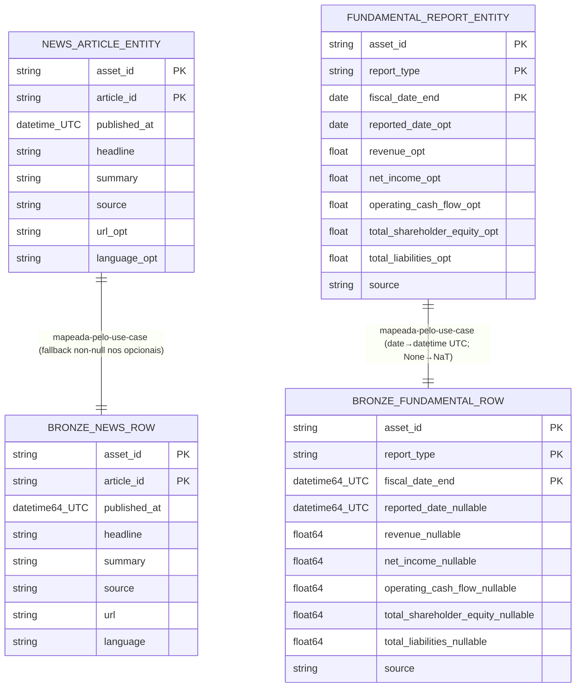

# Concept — Stage 2.3 — Ingestão de news e fundamentals (`market_data`)

> **Escopo deste documento:** o que será feito nesta Stage, por quê, e
> decisões técnicas relevantes para entender o "porquê". O plano executável
> fica no [`technical.md`](./technical.md) correspondente.

## 1. Escopo

### Dentro do escopo

- **Entity `NewsArticle`** (`domain/entities/news_article.py`): `dataclass`
  frozen + slots, **domain puro stdlib-only**, portada do old quase 1:1. Campos:
  `asset_id`, `published_at` (tz-aware), `headline`, `summary`, `source`,
  `url|None`, `article_id|None`, `language|None="en"`. `__post_init__` valida as
  invariantes (ver §5 I1).
- **Entity `FundamentalReport`** (`domain/entities/fundamental_report.py`):
  `dataclass` frozen + slots, **stdlib-only**, portada do old. Campos: `asset_id`,
  `report_type`, `fiscal_date_end` (`date`, **sem hora**), `reported_date|None`,
  cinco floats nullable (`revenue`/`net_income`/`operating_cash_flow`/
  `total_shareholder_equity`/`total_liabilities`), `source`. `__post_init__`
  valida as invariantes (ver §5 I2).
- **Port-out `NewsFetcher`** (`application/ports/out/news_fetcher.py`):
  **`Protocol`** estrutural (não a ABC do old) com
  `fetch_company_news(ticker, start_date, end_date) -> list[NewsArticle]`.
- **Port-out `FundamentalFetcher`** (`application/ports/out/fundamental_fetcher.py`):
  **`Protocol`** com `fetch_fundamentals(asset_id) -> list[FundamentalReport]`.
- **Use case `IngestNews`** (`application/use_cases/ingest_news.py`): recebe
  `IngestNewsRequest` (frozen), devolve `IngestNewsResult` (frozen, contagem +
  metadados) — **nunca** `NewsArticle`/`list[NewsArticle]`. Injeta `NewsFetcher` +
  `MedallionStore`; mapeia cada `NewsArticle → Row` (8 chaves non-null) e grava
  `write(layer="bronze", table="news", overwrite=False)`. Espelha **exatamente** o
  padrão do `IngestCandles` (2.2).
- **Use case `IngestFundamentals`** (`application/use_cases/ingest_fundamentals.py`):
  recebe `IngestFundamentalsRequest` (frozen, com `report_types` e intervalo
  opcionais), devolve `IngestFundamentalsResult` (frozen, contagem) — **nunca**
  entity. Filtra por `report_type` + intervalo de `fiscal_date_end` (lógica do old
  `fetch_fundamentals_use_case`), mapeia cada `FundamentalReport → Row` (10
  colunas) e grava `(bronze, fundamental)`.
- **Adapter `ParquetRawNewsFetcher`** (`adapters/out/parquet/`): **origem default**
  — lê `data/raw/news/AAPL/news_AAPL.parquet` (6921 linhas) e mapeia para
  `list[NewsArticle]`. Implementa o **mesmo** port `NewsFetcher`. (`[deviation]` —
  ver §7 D2 / ADR 2.3.0002.)
- **Adapter `ParquetFundamentalFetcher`** (`adapters/out/parquet/`): **origem
  default** — lê `data/processed/fundamentals/AAPL/fundamentals_AAPL.parquet` (81
  linhas, 17 `NaT`) e mapeia para `list[FundamentalReport]` (convertendo datas UTC
  → `date`/`None`; normalizando `asset_id`). Implementa `FundamentalFetcher`.
- **Adapter `AlphaVantageNewsFetcher`** (`adapters/out/alpha_vantage/`):
  **construído**, **não-default** — `NEWS_SENTIMENT`, throttle `1.1s`, parse de
  `time_published` por regex → UTC, ID estável `url > time+title`, guard
  `Note`/`Information`. `requests` confinado.
- **Adapter `AlphaVantageFundamentalFetcher`** (`adapters/out/alpha_vantage/`):
  **construído**, **não-default** — **4 endpoints** (`INCOME_STATEMENT` +
  `BALANCE_SHEET` + `CASH_FLOW` + `EARNINGS`), `_merge_reports` por
  `(report_type, fiscal_date_end)`, `_to_float`/`_to_date` defensivos, throttle
  `12.5s`. EARNINGS é a única fonte de `reported_date` (ver §7 D3 / ADR 2.3.0001).
- **Fakes in-memory** (`tests/fakes/`): `InMemoryNewsFetcher`/
  `InMemoryFundamentalFetcher` comportamentais (não `Mock`), satisfazem os
  `Protocol` por duck-typing; reuso do `FakeMedallionStore` (2.1) nos testes de use
  case.
- **Contract tests parametrizados** dos dois ports: fake **e** adapter de reuso
  parquet passam o mesmo contrato (paridade fake↔real, ADR 0.0.0021).
- **Teste de integração SEM rede** dos adapters Alpha Vantage (`monkeypatch` de
  `requests`/sessão com fixtures JSON); live só com `skipif` (sem rede/sem chave).
- **ADRs** `2.3.0001` (4 endpoints incl. EARNINGS) e `2.3.0002` (reuso do parquet
  como origem default vs Alpha Vantage ao vivo), ambos `accepted`.

### Fora do escopo (explicitamente)

- **Sentimento / FinBERT** sobre as notícias — **Stage 3.2** (`non_goals`).
- **Ratios fundamentais derivados** e **as-of join** de fundamentos — **Stage 3.3**
  (`non_goals`; o `reported_date` ingerido aqui alimenta o fallback H-3 lá).
- **Providers além de Alpha Vantage** (descartar o Finnhub do old) — `non_goals`.
- **Buscar dados novos via API ao vivo no caminho default/teste** (robustez
  overnight; free-tier ~25 req/dia): default = parquet existente; live só com
  `skipif`.
- **Cursor-walking / paginação incremental** do `FetchNewsUseCase` antigo (máquina
  de ~240 linhas que só fazia sentido batendo na API ao vivo com `limit=1000`) —
  over-engineering para reuso; registrar `[decision]` no `technical.md` §7.
- **Dedup reimplementado no use case**: a deduplicação de news por `article_id` é
  delegada à PK lógica `(asset_id, article_id)` do `MedallionStore` (ver §7 D5).
- **Estender os schemas bronze `NEWS`/`FUNDAMENTAL`** (2.1): já existem e batem 1:1
  com os dados em disco — **reusar, não redefinir**.
- **Wiring de produção end-to-end no `composition_root`** (mesmo recorte da 2.2): a
  Stage entrega adapters + use cases testáveis por injeção; o default concreto pode
  ser ligado pela Stage consumidora.
- **Fechamento da Stage** (commit `complete`, marcar `done` no roadmap, auditoria
  de testes) — é do orquestrador, após auditoria independente.

### Vínculo com o roadmap

Esta Stage é a terceira do **Step 2 — Camada bronze + calendário**
([`roadmap.md`](../../roadmap.md) §Stage 2.3). Estende o BC de feature
`market_data` (criado na 2.2) com news e fundamentals, consumindo o port
`MedallionStore` (2.1) para gravar as bronze `news` e `fundamental`. Materializa a
`definition_of_done` ("News e fundamentals de AAPL gravados em bronze com dedup
(`article_id`) e throttle de free-tier; fakes passam contract tests") e desbloqueia
3.2 (`sentiment-finbert`, `depends_on: 2.3`) e 3.3 (`fundamentals-asof-join`,
`depends_on: 2.3, 2.4`).

## 2. Objetivo da Stage

Ao fim desta Stage, executar `IngestNews` e `IngestFundamentals` para `AAPL` lê os
dados da **origem default (o parquet existente, sem re-baixar)**, valida cada
entity contra suas invariantes, mapeia para `Row`s que casam exatamente os schemas
bronze `NEWS`/`FUNDAMENTAL` (2.1) e os grava em `(bronze, news)`/
`(bronze, fundamental)` via `MedallionStore` — devolvendo DTOs frozen com a
contagem ingerida (nunca uma entity) —, com os fakes e os adapters de reuso parquet
passando os mesmos contract tests dos ports, os adapters Alpha Vantage construídos
e testados sem rede ao vivo, e os gates (`mypy --strict`, `ruff`, `import-linter`,
`check_layout`, cobertura ≥90%) verdes.

## 3. Contexto e premissas

### Contexto

O Step 2 já tem: a fundação de storage (2.1 — port `MedallionStore`, adapter
`ParquetMedallionStore`, schemas `pandera` bronze, incl. `NEWS` e `FUNDAMENTAL`);
e o BC de feature `market_data` (2.2 — primeiro container layered no
`import-linter`, entity `Candle`, port `CandleFetcher` como `Protocol`, use case
`IngestCandles` com DTO frozen, adapter de reuso parquet como origem default e
adapter de rede não-default offline em teste). Esta Stage **repete o mesmo padrão**
da 2.2 para dois novos tipos de dado, **dentro do mesmo BC** (`market_data` já é
container layered — reusar, não recriar o contrato).

O repo antigo tinha `NewsArticle`/`FundamentalReport` (entities frozen+slots),
`NewsFetcher`/`FundamentalFetcher` (ABCs), `FetchNewsUseCase`/
`FetchFundamentalsUseCase`, e os adapters Alpha Vantage. Esta Stage **porta a
semântica** com julgamento, mas **corrige/recorta**: (1) ABC → `Protocol`; (2)
`Result`-com-contadores → DTO frozen que **nunca** vaza entity; (3) descarta o
cursor-walking do `FetchNewsUseCase` (over-engineering para reuso); (4) descarta o
provider Finnhub e os repositories do old (o `MedallionStore` 2.1 os substitui).

### Premissas

- **Dados em disco verificados.** `data/raw/news/AAPL/news_AAPL.parquet` tem **8
  colunas** (`article_id`, `headline`, `published_at` `datetime64[ns, UTC]`,
  `asset_id`, `url`, `source`, `language`, `summary`), todas `string` exceto o
  timestamp — **6921 linhas**, batendo 1:1 com o schema bronze `NEWS`.
  `data/processed/fundamentals/AAPL/fundamentals_AAPL.parquet` tem **10 colunas** na
  ordem `asset_id`, `report_type`, `fiscal_date_end`, `reported_date`, `revenue`,
  `net_income`, `operating_cash_flow`, `total_shareholder_equity`,
  `total_liabilities`, `source` — **81 linhas, 17 `NaT`** em `reported_date`,
  batendo 1:1 com o schema bronze `FUNDAMENTAL`.
- **Schema bronze `NEWS` exige 8 colunas `nullable=False`** (`strict=True`,
  `coerce=False`). Os campos opcionais da entity (`url`, `article_id`, `language`,
  e `summary` quando vazio) precisam de **fallback non-null** no row-mapper do use
  case (ver §5 I6, §7 D5). Gap real verificado (entity opcional ↔ schema non-null).
- **Schema bronze `FUNDAMENTAL`**: cinco floats `float64` `nullable=True`,
  `reported_date` `datetime64[ns, UTC]` `nullable=True` (os 17 `NaT` são reais),
  `report_type`/`source`/`fiscal_date_end` non-null. O use case converte
  `date → datetime UTC` (a coerção de dtype final é do `ParquetMedallionStore`).
- **O `MedallionStore` (2.1, `done`)** garante append-only + dedup por PK lógica
  (`(asset_id, article_id)` para news; `(asset_id, report_type, fiscal_date_end)`
  para fundamental), levantando `DuplicateKeyError` em colisão sem `overwrite`.
  **Não** será reimplementado.
- **`market_data` já é container layered** no `import-linter` (2.2): adicionar
  arquivos novos nas camadas existentes **não** exige tocar o `.importlinter`.
- **`ALPHAVANTAGE_API_KEY`** já configurada/smoke-tested; mas o caminho default e
  os testes **não** batem na API (free-tier ~25 req/dia — robustez overnight).
- A hierarquia `DomainError`/`ApplicationError` e o `DuplicateKeyError` existem em
  `shared/domain/exceptions/base.py` (1.x/2.1).

### Dependências

- **`2.1-medallion-storage-contracts`** (`done`): port `MedallionStore`
  **consumido** pelos use cases; schemas bronze `NEWS`/`FUNDAMENTAL` **reusados, não
  redefinidos**; `FakeMedallionStore` reusado nos testes.
- **`2.2-market-data-ingestion`** (`done`): BC `market_data` como container layered
  (reusar o contrato `import-linter`); o padrão `IngestCandles` (DTO frozen,
  row-mapper, `write` append-only) e `CandleFetcher` (`Protocol`) são os moldes a
  espelhar; o adapter de reuso parquet e a postura "rede não-default + offline em
  teste" (ADR 2.2.0002) são o precedente direto de D2.

## 4. Contratos

### Introduzidos

- **`NewsArticle`** (`entity`, `domain/entities/news_article.py`) — INTRODUZIDO.
  `dataclass(frozen=True, slots=True)`, **stdlib-only**:

  ```python
  from dataclasses import dataclass
  from datetime import datetime

  @dataclass(frozen=True, slots=True)
  class NewsArticle:
      asset_id: str
      published_at: datetime          # tz-aware
      headline: str
      summary: str
      source: str
      url: str | None = None
      article_id: str | None = None
      language: str | None = "en"
      def __post_init__(self) -> None: ...   # valida §5 I1; normaliza language
  ```

- **`FundamentalReport`** (`entity`, `domain/entities/fundamental_report.py`) —
  INTRODUZIDO. `dataclass(frozen=True, slots=True)`, **stdlib-only**:

  ```python
  from dataclasses import dataclass
  from datetime import date

  @dataclass(frozen=True, slots=True)
  class FundamentalReport:
      asset_id: str
      report_type: str                # {"annual", "quarterly"}
      fiscal_date_end: date           # date, SEM hora (datetime → TypeError)
      reported_date: date | None
      revenue: float | None
      net_income: float | None
      operating_cash_flow: float | None
      total_shareholder_equity: float | None
      total_liabilities: float | None
      source: str
      def __post_init__(self) -> None: ...   # valida §5 I2
  ```

  > **Nota de porte:** o old declara `reported_date`/`source` com default e ordena
  > os campos diferente. Aqui a ordem dos campos e o `source` non-default são
  > alinhados ao schema bronze `FUNDAMENTAL` (ordem das colunas em §3); o
  > `__post_init__` preserva as invariantes do old.

- **`NewsFetcher`** (`port-out`, `Protocol` em
  `application/ports/out/news_fetcher.py`) — INTRODUZIDO. Importa só a entity do
  domain; **sem** `requests`/`pandas`:

  ```python
  from datetime import datetime
  from typing import Protocol
  from financial_forecasting.features.market_data.domain.entities.news_article import NewsArticle

  class NewsFetcher(Protocol):
      def fetch_company_news(
          self, ticker: str, start_date: datetime, end_date: datetime
      ) -> list[NewsArticle]: ...
  ```

  Semântica (docstring): `start_date`/`end_date` tz-aware; origem **sem dados** no
  intervalo devolve `[]`; origem **indisponível** levanta erro (não silencia em
  vazio).

- **`FundamentalFetcher`** (`port-out`, `Protocol` em
  `application/ports/out/fundamental_fetcher.py`) — INTRODUZIDO:

  ```python
  from typing import Protocol
  from financial_forecasting.features.market_data.domain.entities.fundamental_report import FundamentalReport

  class FundamentalFetcher(Protocol):
      def fetch_fundamentals(self, asset_id: str) -> list[FundamentalReport]: ...
  ```

- **`IngestNewsRequest` / `IngestNewsResult`** (`dto`, frozen, em
  `application/use_cases/ingest_news.py`) — INTRODUZIDOS:

  ```python
  @dataclass(frozen=True)
  class IngestNewsRequest:
      asset: str
      start: datetime    # tz-aware
      end: datetime      # tz-aware

  @dataclass(frozen=True)
  class IngestNewsResult:
      asset: str
      ingested: int      # nº de news gravadas (NUNCA list[NewsArticle])
      start: datetime
      end: datetime
  ```

- **`IngestNews`** (`use case`, mesmo módulo) — INTRODUZIDO. Injeta `NewsFetcher` +
  `MedallionStore`; valida `start`/`end` tz-aware e `start <= end`; mapeia
  `NewsArticle → Row` (8 chaves non-null, fallback nos opcionais); grava
  `write(layer="bronze", table="news", overwrite=False)`. **Nunca** retorna entity.

- **`IngestFundamentalsRequest` / `IngestFundamentalsResult`** (`dto`, frozen, em
  `application/use_cases/ingest_fundamentals.py`) — INTRODUZIDOS:

  ```python
  @dataclass(frozen=True)
  class IngestFundamentalsRequest:
      asset_id: str
      start: datetime | None = None          # tz-aware quando dado
      end: datetime | None = None
      report_types: tuple[str, ...] = ("annual", "quarterly")

  @dataclass(frozen=True)
  class IngestFundamentalsResult:
      asset_id: str
      ingested: int      # nº de reports gravados (NUNCA list[FundamentalReport])
  ```

- **`IngestFundamentals`** (`use case`, mesmo módulo) — INTRODUZIDO. Injeta
  `FundamentalFetcher` + `MedallionStore`; filtra por `report_type` ∈
  `request.report_types` e por intervalo de `fiscal_date_end` (quando `start`/`end`
  dados — lógica do old); mapeia `FundamentalReport → Row` (10 colunas, convertendo
  `date → datetime UTC`, `reported_date None → NaT`); grava
  `write(layer="bronze", table="fundamental", overwrite=False)`.

- **`ParquetRawNewsFetcher`** (`adapter`, `adapters/out/parquet/`) — INTRODUZIDO.
  Implementa `NewsFetcher` lendo o parquet de news existente; `pandas`/`pyarrow` só
  aqui. (`[deviation]` — D2 / ADR 2.3.0002.)

- **`ParquetFundamentalFetcher`** (`adapter`, `adapters/out/parquet/`) —
  INTRODUZIDO. Implementa `FundamentalFetcher` lendo o parquet de fundamentals;
  converte datas UTC → `date`/`None`; normaliza `asset_id`. (`[deviation]`.)

- **`AlphaVantageNewsFetcher`** (`adapter`, `adapters/out/alpha_vantage/`) —
  INTRODUZIDO. `NEWS_SENTIMENT`; ID estável `url > f"{time_published}:{headline[:80]}"`;
  parse `time_published` por regex `^\d{8}T\d{4}(\d{2})?$` → UTC; throttle `1.1s`
  (`_MIN_INTERVAL` + lock + `monotonic`); guard `Note`/`Information` → `RuntimeError`.
  `requests` só aqui.

- **`AlphaVantageFundamentalFetcher`** (`adapter`, `adapters/out/alpha_vantage/`) —
  INTRODUZIDO. **4 endpoints** (`INCOME_STATEMENT`+`BALANCE_SHEET`+`CASH_FLOW`+
  `EARNINGS`); field maps verbatim do old (`totalRevenue→revenue`,
  `netIncome→net_income`, `totalShareholderEquity→total_shareholder_equity`,
  `totalLiabilities→total_liabilities`, `operatingCashflow→operating_cash_flow`,
  `EARNINGS.reportedDate→reported_date`); `_merge_reports` por
  `(report_type, fiscal_date_end)`; `_to_float`/`_to_date` defensivos; throttle
  `12.5s`. (D3 / ADR 2.3.0001.)

### Consumidos

- **`MedallionStore`** (`port-out`) — declarado na Stage 2.1.
  `write(*, layer, table, rows, overwrite)`; append-only; `DuplicateKeyError` em
  colisão de PK lógica. **Não redefinir.**
- **Schema bronze `NEWS`** — declarado na 2.1
  (`shared/adapters/out/parquet/schemas/bronze_schemas.py::NEWS`):
  `logical_pk=(asset_id, article_id)`, `asset_col=asset_id`,
  `year_anchor=published_at`; **8 colunas todas `nullable=False`**, `strict=True`,
  `coerce=False`. **Reusado, não redefinido.**
- **Schema bronze `FUNDAMENTAL`** — declarado na 2.1
  (`...::FUNDAMENTAL`): `logical_pk=(asset_id, report_type, fiscal_date_end)`,
  `year_anchor=fiscal_date_end`; 5 floats `float64` `nullable=True`,
  `reported_date` `datetime64[ns, UTC]` `nullable=True`,
  `report_type`/`source`/`fiscal_date_end` non-null; ordem das colunas conforme §3.
  **Reusado, não redefinido.**
- **`DuplicateKeyError`** (`ApplicationError`) — declarado na 2.1.
- **`CandleFetcher` / `IngestCandles`** (2.2) — **padrão a espelhar** (não
  importados): forma do `Protocol`, DTO frozen, row-mapper, `write` append-only.
- **`FakeMedallionStore`** (2.1) — reusado nos testes de use case.
- **Contrato `import-linter` `hexagonal-layers` com `market_data` como container**
  (2.2) — reusado (não recriar).

## 5. Invariantes e regras

- **I1 — `NewsArticle` válido (entity).** `__post_init__` exige: `asset_id` str
  não-vazia; `published_at` é `datetime` tz-aware (naive → `ValueError`);
  `headline`/`summary`/`source` são `str` (não `None`); `source` não-vazia; `url`,
  quando dado, começa com `http://`/`https://`; `language`, quando dado,
  normalizado para lowercase contendo só letras e `-`. Violação → `ValueError`/
  `TypeError`. Portada do old (`news_article.py:32-77`).
- **I2 — `FundamentalReport` válido (entity).** `__post_init__` exige: `asset_id`
  str não-vazia; `fiscal_date_end` é `date` **sem hora** (`datetime` → `TypeError`);
  `report_type` ∈ `{"annual","quarterly"}`; os cinco numéricos são `float`-ou-`None`;
  `reported_date` é `date`-ou-`None` (`datetime` → `TypeError`). Portada do old
  (`fundamental_report.py:32-60`).
- **I3 — Pureza do domínio (gate).** `NewsArticle`/`FundamentalReport` importam só
  `datetime`/`date`/`dataclasses` (stdlib); **nenhum** `pandas`/`pyarrow`/`torch`/
  `pydantic`/`sqlalchemy` no `domain`. Provado pelo `import-linter`
  (`domain-purity`) no container `market_data` (já existente da 2.2).
- **I4 — Ports são `Protocol` estrutural (não ABC).** `NewsFetcher`/
  `FundamentalFetcher` são `Protocol`; adapters satisfazem por duck-typing e
  **não** herdam da `application` (corrige a ABC do old; mesma postura do
  `CandleFetcher` 2.2). Ver §7 D1.
- **I5 — Use case nunca vaza entity.** `IngestNews`/`IngestFundamentals` devolvem
  `Ingest*Result` (frozen, contagem + metadados) — **nunca** entity nem
  `list[entity]`. Espelha `IngestCandlesResult` (2.2). Ver §7 D6.
- **I6 — Mapeamento `NewsArticle → Row` casa as 8 colunas non-null.** O schema
  bronze `NEWS` exige `nullable=False` nas 8 colunas; o row-mapper aplica fallback
  para os campos opcionais da entity: `url`/`summary`/`language`/`article_id`
  `None`-ou-vazio → string non-null (ex.: `""` ou o ID estável). `article_id` é
  garantido non-null **antes** de montar a `Row` (fallback `url > time+title`,
  mesma regra do adapter de news). Ver §7 D5.
- **I7 — Mapeamento `FundamentalReport → Row` casa as 10 colunas.** O row-mapper
  produz `report_type`/`source` non-null, `fiscal_date_end` convertido a
  `datetime` UTC (non-null), `reported_date` `date → datetime` UTC **ou** `None`
  (os 17 `NaT` permanecem nulos), e os cinco floats Python (ou `None`). O use case
  é stdlib-only (não usa `pandas`); a coerção de dtype final (`float64`,
  `datetime64[ns, UTC]`) é do `ParquetMedallionStore` (2.1).
- **I8 — Dedup de news é invariante de COLEÇÃO delegada ao store.** A
  deduplicação por `article_id` é garantida pela PK lógica `(asset_id, article_id)`
  do `MedallionStore` (`DuplicateKeyError` sem `overwrite`) — o use case **não**
  reimplementa dedup. `article_id` non-null (I6) garante a chave válida. Ver §7 D5.
- **I9 — Throttle vive só no adapter Alpha Vantage.** `_MIN_INTERVAL` + lock +
  `time.monotonic` (news `1.1s`, fundamentals `12.5s`) ficam **no adapter**; não
  acoplam domínio nem use case. Ver §7 D4.
- **I10 — Filtro de `report_type` + intervalo no `IngestFundamentals`.** O use case
  descarta reports cujo `report_type` ∉ `request.report_types` ou cujo
  `fiscal_date_end` cai fora de `[start, end]` (quando dados), portando a lógica do
  old (`fetch_fundamentals_use_case.py:55-65`) **antes** de gravar.
- **I11 — EARNINGS é o 4º endpoint de fundamentals (live).** O
  `AlphaVantageFundamentalFetcher` mantém os 4 endpoints; EARNINGS é a única fonte
  de `reported_date` (nullable; 17/81 `NaT` reais) que alimenta o fallback as-of
  H-3 da 3.3. Não omitir. Ver §7 D3 / ADR 2.3.0001.
- **I12 — Origem default = parquet existente, não API ao vivo.** O caminho de
  produção default lê os parquet via `ParquetRawNewsFetcher`/
  `ParquetFundamentalFetcher`; os adapters Alpha Vantage existem mas não são
  default (espelha ledger §A e ADR 2.2.0002). Ver §7 D2 / ADR 2.3.0002.
- **I13 — Teste de integração não bate na API ao vivo.** Os testes dos adapters
  Alpha Vantage usam `monkeypatch` de `requests`/sessão com fixtures JSON; live só
  com `pytest.mark.skipif` (sem rede / sem `ALPHAVANTAGE_API_KEY`). Nenhuma chamada
  de rede em import/instanciação.
- **I14 — Paridade fake↔real.** `InMemoryNewsFetcher`/`ParquetRawNewsFetcher` e
  `InMemoryFundamentalFetcher`/`ParquetFundamentalFetcher` passam os **mesmos**
  contract tests parametrizados de seus ports (postura ADR 0.0.0021).
- **I15 — Schemas bronze não estendidos.** `NEWS`/`FUNDAMENTAL` (2.1) são reusados
  1:1; nada de novas colunas (os dados em disco já batem — 6921×8; 81×10/17 `NaT`).
- **I16 — Gates verdes.** `mypy --strict` e `ruff` verdes; `make check` e
  `make test` verdes; `import-linter` verde (container `market_data` da 2.2,
  **reusado**); `check_layout.py` verde; cobertura ≥90% no diff.

## 6. Casos de erro e exceções

- **C1 — `NewsArticle` inválido na construção.** `asset_id` vazio, `published_at`
  naive, `source` vazia, `url` sem `http(s)`, `language` com caractere inválido,
  texto `None` em campo obrigatório → `ValueError`/`TypeError` no `__post_init__`,
  antes de qualquer escrita (I1).
- **C2 — `FundamentalReport` inválido na construção.** `fiscal_date_end` com hora
  (`datetime`), `report_type` fora de `{annual,quarterly}`, numérico não-float,
  `reported_date` `datetime` → `ValueError`/`TypeError` (I2).
- **C3 — Re-ingestão de PK lógica já presente.** Uma `Row` cuja PK lógica
  (`(asset_id, article_id)` news; `(asset_id, report_type, fiscal_date_end)`
  fundamental) já existe na partição alvo, com `overwrite=False` →
  `DuplicateKeyError(ApplicationError)` propagado do `MedallionStore` (a Stage não
  engole a colisão). É o mecanismo de dedup de news (I8/C3).
- **C4 — `Row` viola o schema bronze.** News com coluna nula (fallback I6 não
  aplicado) ou fundamental com dtype divergente → erro `pandera` no
  `ParquetMedallionStore` (não grava Parquet inválido). Rede de segurança do
  contrato 2.1.
- **C5 — `start`/`end` naive ou `start > end` no request.** `IngestNews` valida
  via `require_tz_aware` e comparação → `ValueError` (espelha o old e o
  `IngestCandles`). `IngestFundamentals`: quando `start`/`end` dados, valida
  tz-aware antes de filtrar.
- **C6 — Origem default indisponível/ilegível.** `ParquetRawNewsFetcher`/
  `ParquetFundamentalFetcher` apontando para arquivo ausente/corrompido → erro de
  I/O do adapter, mapeado para erro de aplicação claro; **não** silencia em lista
  vazia (distinto de "sem dados no intervalo" → `[]`).
- **C7 — Alpha Vantage rate-limit / resposta inesperada (adapter).** Resposta com
  chave `Note`/`Information`, JSON não-dict, ou `feed` ausente/não-lista →
  `RuntimeError`/`ValueError` no adapter; itens individuais com `time_published`
  inválido são ignorados (parse defensivo), sem quebrar o lote. **Não** afeta o
  caminho default (parquet).
- **C8 — Endpoint de fundamentals parcial (adapter).** Um período presente num
  endpoint e ausente noutro → `FundamentalReport` com `None` nos campos faltantes
  (schema nullable); `fiscalDateEnding` ausente/ilegível → o item é pulado
  (`_to_date` → `None` → `continue`).

## 7. Decisões técnicas relevantes

### D1 — Forma dos ports: `Protocol` vs ABC

- **O quê:** `NewsFetcher`/`FundamentalFetcher` como `Protocol` estrutural em
  `application/ports/out` (não as ABCs do old). Rejeitada: ABC herdada pelos
  adapters (acopla adapter→application, padrão do old).
- **Por quê:** Regra hexagonal do projeto (`hex-arch-python`, LAYOUT §3): ports são
  `Protocol` satisfeito por duck-typing — adapters não herdam da `application`.
  Mesma postura já decidida na 2.2 (`CandleFetcher`, D2) e nos ports
  `MedallionStore` (2.1)/`ExperimentTracker` (1.5). Regra do repo — **sem ADR
  próprio**.
- **Fonte:** skill `hex-arch-python`; LAYOUT §3; concept 2.2 §7 D2; old
  `src/interfaces/news_fetcher.py`/`fundamental_fetcher.py` (ABCs — não replicar).

### D2 — Origem default = reuso do parquet existente vs Alpha Vantage ao vivo

- **O quê:** Criar `ParquetRawNewsFetcher` (lê `data/raw/news/AAPL`, 6921 linhas) e
  `ParquetFundamentalFetcher` (lê `data/processed/fundamentals/AAPL`, 81 linhas)
  como **origem default**, implementando os mesmos ports; os adapters Alpha
  Vantage existem mas **não** são default; teste de integração nunca bate na API
  ao vivo (live só com `skipif`). Rejeitadas: Alpha Vantage como default (depende
  de rede + free-tier ~25 req/dia; viola reuso-de-raw do ledger e robustez
  overnight); reusar o parquet **só** no teste (deixa a DoD sem implementação de
  produção e enfraquece a paridade do contract test); ler o parquet direto no use
  case (vaza `pandas` para a `application`).
- **Por quê:** DoD exige reuso dos dados existentes; ledger §A diz "reusa só dados
  brutos `raw/`"; robustez overnight proíbe rede no gate. Sem adapter de produção,
  o reuso só existiria em fixture. **Mesmo argumento já aceito na 2.2** (ADR
  2.2.0002). **Nota de proveniência:** estes arquivos **não** estão em
  `arquivos_a_criar` (que lista só os adapters Alpha Vantage) — adição justificada;
  registrar `[deviation]` no `technical.md` §7.
- **Fonte:** [`autonomous-run-decision-ledger.md`](../../autonomous-run-decision-ledger.md)
  §A; ADR [`2.2.0002`](../../adr/2_2_0002-reuse-raw-candles-default-vs-live-yfinance.md);
  roadmap §Stage 2.3 DoD; dados verificados (6921×8 news; 81×10/17 `NaT`
  fundamental).
- **ADR:** [`../../adr/2_3_0002-reuse-existing-news-fundamentals-as-default-source.md`](../../adr/2_3_0002-reuse-existing-news-fundamentals-as-default-source.md)

### D3 — Fundamentals com 4 endpoints (incl. EARNINGS para `reported_date`)

- **O quê:** `AlphaVantageFundamentalFetcher` mantém os 4 endpoints
  (`INCOME_STATEMENT`+`BALANCE_SHEET`+`CASH_FLOW`+`EARNINGS`), merge por
  `(report_type, fiscal_date_end)`. EARNINGS é a única fonte de `reported_date`.
  Rejeitadas: 3 endpoints (deixa `reported_date` sempre `None`, degradando o
  fallback as-of H-3 da 3.3); sintetizar `reported_date = fiscal_date_end + 45d` no
  bronze (polui bronze com derivação de 3.3, destrói a distinção real/NaT).
- **Por quê:** `reported_date` é nullable no schema (17/81 `NaT` reais) e alimenta
  o fallback as-of de H-3 na 3.3 ("`reported_date` OU `fiscal_date_end + 45d`").
  Sem EARNINGS, todas as 64/81 linhas com data real cairiam no proxy conservador.
  Custo: 1 chamada throttled extra (`12.5s`) só na re-ingestão ao vivo (não-default).
  Ganho concreto > custo.
- **Fonte:** old `alpha_vantage_fundamental_fetcher.py:133-201` (4 endpoints +
  merge; `:137`,`:158-173` EARNINGS→`reported_date`); schema bronze `FUNDAMENTAL`
  (`reported_date` nullable); ledger H-3; dados verificados (17 `NaT`).
- **ADR:** [`../../adr/2_3_0001-alpha-vantage-fundamental-endpoints-and-earnings.md`](../../adr/2_3_0001-alpha-vantage-fundamental-endpoints-and-earnings.md)

### D4 — `IngestNews` simples (sem cursor-walking / paginação incremental do old)

- **O quê:** `IngestNews` = `fetch_company_news` → (dedup via PK do store) →
  `write`. **Não** portar a máquina de cursor de ~240 linhas
  (`FetchNewsUseCase`), que só fazia sentido batendo na API ao vivo com
  `limit=1000`. Rejeitada: portar a paginação incremental (over-engineering para o
  caminho de reuso).
- **Por quê:** Reuso de dados existentes torna a paginação incremental
  desnecessária; viola o princípio simples-e-trocável. Dedup delegado à PK lógica
  do store (D5). Paginação fica como non-goal reabrível sem mexer no port.
  **Sem ADR próprio** — registrar `[decision]` no `technical.md` §7.
- **Fonte:** old `src/use_cases/fetch_news_use_case.py:30-269` (cursor-walking — não
  portar); skill `hex-arch-python` (simples-e-trocável); BRIEF non-goal.

### D5 — Dedup de news + fallback non-null dos campos opcionais (invariante de coleção)

- **O quê:** Não reimplementar dedup no use case; colisão de PK lógica
  `(asset_id, article_id)` sem `overwrite` propaga `DuplicateKeyError` do store.
  `article_id` non-null é garantido no row-mapper (fallback `url > time+title`)
  porque o schema `NEWS` exige `nullable=False`; idem fallback para
  `url`/`summary`/`language` (`None`/vazio → string non-null). Rejeitada: checar
  dedup dentro do `__post_init__` da entity (entidade individual não conhece a
  coleção).
- **Por quê:** Dedup é invariante de coleção do store (mesma postura D5 da 2.2),
  já provada pelo `FakeMedallionStore`/contract test 2.1. **Sem ADR próprio.**
  **`[finding]` a registrar:** campos opcionais da entity `NewsArticle`
  (`url`/`article_id`/`language`) são `nullable=False` no schema bronze `NEWS` →
  fallback **obrigatório** na fronteira do use case.
- **Fonte:** ADR `2.1.0001`/concept 2.1 (append-only + colisão de PK); concept 2.2
  §7 D5; schema bronze `NEWS` (8 colunas `nullable=False`); old
  `alpha_vantage_news_fetcher.py:169-170` (ID estável `url > time+title`).

### D6 — DTO de retorno do use case (nunca vaza entity)

- **O quê:** `IngestNewsResult`/`IngestFundamentalsResult` só com contagem +
  metadados; nenhum campo `list[entity]`. Renomear/recortar os `Result` do old (que
  carregam `fetched`/`saved`) garantindo zero vazamento de entity. Rejeitada:
  devolver `list[entity]` ou tuple cru.
- **Por quê:** Regra do projeto — use cases recebem/devolvem DTO frozen, nunca
  entity para fora (CLAUDE.md nota 6, LAYOUT). Espelha `IngestCandlesResult` (2.2
  D6). **Sem ADR próprio.**
- **Fonte:** CLAUDE.md nota 6; LAYOUT §3; concept 2.2 §7 D6; old
  `fetch_fundamentals_use_case.py:16-24` (`Result` com contadores — recortar).

## 8. Integrações

### Internas (com outras Stages/módulos)

- `shared/application/ports/out/medallion_store.py` (`MedallionStore`): os use
  cases injetam e chamam `write(layer="bronze", table="news"|"fundamental", ...)`.
- `shared/adapters/out/parquet/schemas/bronze_schemas.py` (`NEWS`/`FUNDAMENTAL`): os
  schemas cujas colunas/dtypes/PK os row-mappers devem satisfazer (validados no
  `write`).
- `shared/domain/exceptions/base.py` (`DuplicateKeyError`): propagado em colisão de
  PK (dedup de news).
- `tests/fakes/shared/` (`FakeMedallionStore`, 2.1): reusado nos testes dos use
  cases (sem tocar disco).
- `features/market_data/...` (2.2): mesmo BC/container; padrão `IngestCandles`/
  `CandleFetcher` espelhado.
- Consumidores futuros: `feature_engineering` (3.2 lê bronze `news`; 3.3 lê bronze
  `fundamental` e usa `reported_date` no as-of join H-3).

### Externas

- **Alpha Vantage** (HTTP, `https://www.alphavantage.co/query`): origem
  **não-default**. `NEWS_SENTIMENT` (`tickers`, `time_from`/`time_to`,
  `sort=EARLIEST`, `limit=1000`, `apikey`) → JSON com `feed`; `INCOME_STATEMENT`/
  `BALANCE_SHEET`/`CASH_FLOW`/`EARNINGS` (`symbol`, `apikey`) → JSON com
  `annualReports`/`quarterlyReports`/`annualEarnings`/`quarterlyEarnings`. Chave via
  `ALPHAVANTAGE_API_KEY`. Rate-limit sinalizado por `Note`/`Information`. Free-tier
  ~25 req/dia.
- **Parquet existente** (`data/raw/news/AAPL/news_AAPL.parquet`;
  `data/processed/fundamentals/AAPL/fundamentals_AAPL.parquet`): origem
  **default**. Contratos verificados em §3 (6921×8 news; 81×10/17 `NaT`
  fundamental).

## 9. Modelo de dados (se aplicável)



As `Row`s casam exatamente os schemas bronze `NEWS`/`FUNDAMENTAL` (2.1). Os campos
opcionais da entity de news ganham fallback non-null (I6); as datas de fundamentals
viram `datetime` UTC (e `None → NaT`) no row-mapper (I7).

## 10. Riscos e mitigações

| Risco | Probabilidade | Impacto | Mitigação |
|---|---|---|---|
| Campo opcional de news (`url`/`article_id`/`language`/`summary` vazio) chega `None`/vazio à `Row` → `pandera` `NEWS` (`nullable=False`) rejeita | A | A | I6/D5; row-mapper com fallback non-null; teste do use case assertando 8 chaves non-null; rede de segurança `pandera` (C4) |
| `IngestFundamentals` perde `reported_date` (todas as linhas) por omitir EARNINGS | M | A | I11/D3/ADR 2.3.0001; manter os 4 endpoints; fixture de integração com `reportedDate` ausente cobre o `NaT` |
| Teste de integração bate na API ao vivo (anti-padrão do old; free-tier estoura) | M | M | I13; `monkeypatch` de `requests`; live só com `skipif`(sem rede/sem chave); sem rede em import |
| Conversão `date→datetime` em fundamentals promove tz errada ou perde os 17 `NaT` | M | A | I7; converter para UTC explícito; `None → NaT`; teste do use case cobrindo report sem `reported_date`; `pandera` `FUNDAMENTAL` (`reported_date` nullable) |
| `article_id` colide e mascara notícia distinta (ID instável quando `url` ausente) | B | M | ID estável `url > f"{time}:{headline[:80]}"` (mesma regra do old/adapter); dedup por PK do store é determinístico |
| Reescrever schema bronze por engano ao "encaixar" os dados | B | A | I15; schemas 2.1 batem 1:1 (verificado); **proibido** estender — só reusar |

## 11. Critérios de aceitação

- [ ] **A1** — `NewsArticle` em `domain/entities/news_article.py` (frozen+slots,
  **stdlib-only**); `__post_init__` valida I1 (`asset_id`/`published_at`
  tz-aware/textos/`url` http(s)/`language` lowercase); unit test cobre cada
  invariante (válido + cada violação → `ValueError`/`TypeError`).
- [ ] **A2** — `FundamentalReport` em `domain/entities/fundamental_report.py`
  (frozen+slots, **stdlib-only**); `__post_init__` valida I2 (`asset_id`/
  `fiscal_date_end` `date`-sem-hora/`report_type`/numéricos float|None/
  `reported_date` date|None); unit test por invariante.
- [ ] **A3** — `NewsFetcher` e `FundamentalFetcher` são `Protocol` em
  `application/ports/out/`, importam só a entity do domain (sem `requests`/
  `pandas`), com a semântica (vazio vs erro) na docstring.
- [ ] **A4** — `InMemoryNewsFetcher`/`ParquetRawNewsFetcher` passam o mesmo
  contract test parametrizado de `NewsFetcher`; `InMemoryFundamentalFetcher`/
  `ParquetFundamentalFetcher` passam o de `FundamentalFetcher` (paridade fake↔real,
  ADR 0.0.0021).
- [ ] **A5** — `IngestNews` recebe `IngestNewsRequest` (frozen), valida `start`/
  `end` tz-aware, mapeia `NewsArticle → Row` com 8 chaves non-null (fallback),
  `article_id` non-null garantido, grava `(bronze, news)` `overwrite=False`,
  devolve `IngestNewsResult` (**nunca** entity); teste com `InMemoryNewsFetcher` +
  `FakeMedallionStore` cobre fallback non-null, contagem e `DuplicateKeyError` em
  colisão (dedup); sem cursor-walking; cobertura ≥90%.
- [ ] **A6** — `IngestFundamentals` filtra por `report_type` + intervalo de
  `fiscal_date_end` (lógica do old), converte `date → datetime` UTC no row-mapper
  (10 colunas, `reported_date None → NaT`), grava `(bronze, fundamental)`, devolve
  `IngestFundamentalsResult` (**nunca** entity); teste cobre report **sem**
  `reported_date` (`NaT`); cobertura ≥90%.
- [ ] **A7** — `ParquetRawNewsFetcher` lê o parquet real (6921 linhas) → `list[
  NewsArticle]`; `ParquetFundamentalFetcher` lê o real (81 linhas, 17 `NaT`) →
  `list[FundamentalReport]` (datas UTC → `date`/`None`); `pandas`/`pyarrow` só nos
  adapters (`import-linter` verde).
- [ ] **A8** — `AlphaVantageNewsFetcher` (`NEWS_SENTIMENT`, parse `time_published`
  regex → UTC, ID estável `url > time+title`, throttle `1.1s`, guard
  `Note`/`Information` → `RuntimeError`) implementa `NewsFetcher`; sem chamada de
  rede em import/instanciação.
- [ ] **A9** — `AlphaVantageFundamentalFetcher` (4 endpoints incl. EARNINGS, field
  maps verbatim, `_merge_reports` por `(report_type, fiscal_date_end)`,
  `_to_float`/`_to_date` defensivos, EARNINGS → `reported_date`, throttle `12.5s`)
  implementa `FundamentalFetcher`.
- [ ] **A10** — Teste de integração dos adapters Alpha Vantage usa `monkeypatch` de
  `requests`/sessão com fixtures JSON (NEWS_SENTIMENT + 4 endpoints, incluindo
  `"None"`/`"NaN"` e `reportedDate` ausente), assertando mapeamento → entity e
  guard de rate-limit; **roda sem rede**; live só com `pytest.mark.skipif`.
- [ ] **A11** — `mypy --strict` e `ruff` verdes; `make check` e `make test` verdes;
  `import-linter` verde (container `market_data` da 2.2, reusado); `check_layout.py`
  verde; cobertura ≥90% no diff.
- [ ] **A12** — ADRs `2.3.0001` (4 endpoints incl. EARNINGS) e `2.3.0002` (reuso do
  parquet default vs Alpha Vantage live) com `status: accepted`.

## 12. Checklist de validação interna

- [x] Todos os contratos introduzidos têm assinatura definida? (`NewsArticle`,
  `FundamentalReport`, `NewsFetcher`, `FundamentalFetcher`, `IngestNews(Request/
  Result)`, `IngestFundamentals(Request/Result)`, 4 adapters — §4)
- [x] Toda decisão em §7 tem fonte rastreável? (ledger §A/H-3, ADR 2.2.0002,
  schemas 2.1 verificados, dados reais inspecionados, old com linhas citadas,
  CLAUDE.md, skills)
- [x] Toda integração externa tem contrato definido? (Alpha Vantage 5 funções +
  rate-limit; parquet existente — §8)
- [x] Decisões com alternativa real descartada têm ADR escrito? (D3→2.3.0001,
  D2→2.3.0002; D1/D4/D5/D6 reusam regra/contrato existente — sem ADR próprio,
  justificado in-loco)
- [x] Dependências de Stages anteriores estão satisfeitas? (2.1 `done`:
  `MedallionStore`/`NEWS`/`FUNDAMENTAL`/`DuplicateKeyError`/`FakeMedallionStore`;
  2.2 `done`: container `market_data`, padrão `IngestCandles`/`CandleFetcher`)
- [x] Stage cabe em ~3–8 Tasks? (12 Tasks no technical — duas trilhas paralelas
  news+fundamentals dentro de um BC; decisões já tomadas, menos ambiguidade por
  Task — dentro da faixa de governança da corrida)
- [x] Riscos críticos têm mitigação plausível? (§10 — fallback non-null,
  `reported_date`/EARNINGS, rede, conversão de datas, ID estável, não-reescrita de
  schema)
- [x] O domínio permanece puro e o use case não vaza entity? (I3, I5)

## 13. Questões em aberto

- Nenhuma bloqueante. Detalhes de implementação a fixar no `technical.md`/execução:
  a forma exata do fallback non-null dos campos opcionais de news (`""` vs sentinel)
  e se o filtro de intervalo do `IngestFundamentals` usa `fiscal_date_end`
  inclusivo nos dois extremos (espelhar o old — inclusivo) — o contrato (origem
  default = parquet, append-only via store, dedup por PK, 4 endpoints com EARNINGS,
  schemas 2.1 reusados 1:1) já está declarado.

## 14. Referências

- [`../../overview.md`](../../overview.md) — §3 (escopo: features re-derivadas de
  `raw/`), §6 (restrições), §7 (abordagem medalhão), §11 (ADRs de fundação:
  `0.0.0019` hexagonal enforçado, `0.0.0021` contract tests + oráculo).
- [`../../roadmap.md`](../../roadmap.md) — Stage `2.3-news-fundamentals-ingestion` e
  vizinhas (2.1/2.2 consumidas; 3.2/3.3 consumidoras).
- [`../../autonomous-run-decision-ledger.md`](../../autonomous-run-decision-ledger.md)
  — §A (reuso só de `raw/`); H-2 (11 indicadores, 3.1); H-3 (fallback as-of
  `reported_date` OU `fiscal_date_end + 45d`, 3.3); §B linha 2.3 (endpoints Alpha
  Vantage + dedup `article_id` + throttle).
- ADRs desta Stage:
  [`2.3.0001`](../../adr/2_3_0001-alpha-vantage-fundamental-endpoints-and-earnings.md),
  [`2.3.0002`](../../adr/2_3_0002-reuse-existing-news-fundamentals-as-default-source.md).
- Stage 2.1 (consumida):
  [`../2.1-medallion-storage-contracts/concept.md`](../2.1-medallion-storage-contracts/concept.md);
  schemas `NEWS`/`FUNDAMENTAL` em
  `shared/adapters/out/parquet/schemas/bronze_schemas.py:76-141`.
- Stage 2.2 (padrão espelhado):
  [`../2.2-market-data-ingestion/concept.md`](../2.2-market-data-ingestion/concept.md);
  ADR [`2.2.0002`](../../adr/2_2_0002-reuse-raw-candles-default-vs-live-yfinance.md);
  `features/market_data/application/use_cases/ingest_candles.py` e
  `.../ports/out/candle_fetcher.py`.
- Dados verificados: `data/raw/news/AAPL/news_AAPL.parquet` (6921×8);
  `data/processed/fundamentals/AAPL/fundamentals_AAPL.parquet` (81×10, 17 `NaT`).
- Old (semântica, não implementação):
  `financial-time-series-forecasting/src/entities/news_article.py` (`:32-77`
  invariantes + normalização `language`),
  `src/entities/fundamental_report.py` (`:32-60` invariantes),
  `src/interfaces/{news_fetcher,fundamental_fetcher}.py` (ABCs — virar `Protocol`),
  `src/use_cases/fetch_news_use_case.py` (`:30-269` cursor-walking — **não** portar),
  `src/use_cases/fetch_fundamentals_use_case.py` (`:55-65` filtro report_type +
  intervalo; `:86` nunca-vaza-fetched),
  `src/adapters/alpha_vantage_news_fetcher.py` (`:19`,`:60-82` parse regex; `:32`
  throttle `1.1s`; `:131-135` guard; `:169-170` ID estável),
  `src/adapters/alpha_vantage_fundamental_fetcher.py` (`:30` `_MIN_INTERVAL=12.5`;
  `:89-105` `_to_date`/`_to_float`; `:108-201` merge + 4 endpoints + EARNINGS),
  `src/adapters/parquet_fundamental_repository.py` (`:54` normalização `asset_id`;
  `:93-94` `date → pd.Timestamp(tz="UTC")`); descartar Finnhub e repositories.
