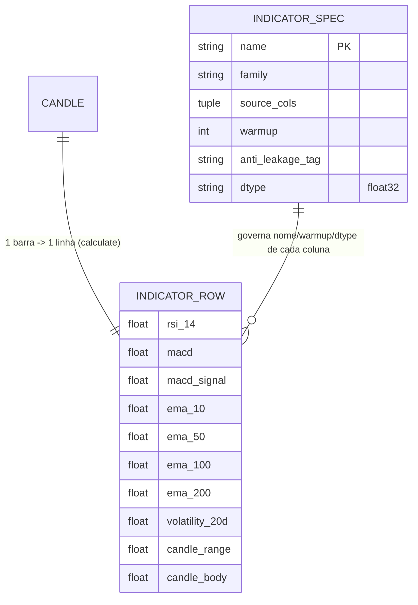

# Concept — Stage 3.1 — Indicadores técnicos causais (`feature_engineering`)

> **Escopo deste documento:** o que será feito nesta Stage, por quê, e
> decisões técnicas relevantes para entender o "porquê". O plano executável
> fica no [`technical.md`](./technical.md) correspondente.

## 1. Escopo

### Dentro do escopo

- **Criar o segundo bounded context de _feature_ — `feature_engineering` — como
  container layered** em `src/financial_forecasting/features/feature_engineering/`,
  espelhando a árvore de `market_data` (2.2): camadas hexagonais
  (`domain` ← `application` ← `adapters/out`) com `__init__.py` em todos os níveis
  intermediários, e a **prova de direção inward-only** no BC novo (adicionar o BC
  aos `containers` do contrato `hexagonal-layers` e ao `domain-purity`/
  `store-no-storage-leak` do `.importlinter`).
- **`IndicatorSpec`** (`domain/services/indicator_spec.py`): value-object de
  **domínio puro stdlib-only** (`dataclass` frozen), molde reduzido do
  `FeatureSpec` do old focado em indicador — campos `name`, `family`,
  `source_cols`, `warmup`, `dtype` (`='float32'`), `anti_leakage_tag`.
  `__post_init__` valida `name` não-vazio, `warmup >= 0`, `dtype`/`tag` em
  conjuntos permitidos. **Não** replica `null_policy`/`enabled_by_default`/`group`
  ricos do old (isso é a Stage 3.4).
- **`INDICATOR_SPECS`** (mesmo módulo): registry estático
  (`Mapping[str, IndicatorSpec]`) dos **11 indicadores** (H-2, decisão humana
  fechada) com warmups validados contra o `feature_registry.py` do old —
  `rsi_14`=14, `ema_10`=10, `ema_50`=50, `ema_100`=100, `ema_200`=200, `macd`=26,
  `macd_signal`=35, `volatility_20d`=20, `candle_range`=0, `candle_body`=0 —
  `dtype='float32'`, tags `trailing_window_causal` ou `same_timestamp_ohlc_derived`.
- **`indicator_registry_hash()`** (mesmo módulo): `sha256` determinístico sobre
  os specs ordenados por nome (replica `feature_registry_hash` do old:471-491),
  para reprodutibilidade (postura oráculo, ADR `0.0.0021`).
- **Port-out `IndicatorCalculator`** (`application/ports/out/indicator_calculator.py`):
  **`Protocol`** estrutural que **não vaza pandas/DataFrame** na fronteira —
  `calculate(asset, candles) -> Sequence[Mapping[str, float]]` (uma linha por
  barra; valores `float32`; `NaN` tolerado no warmup). Importa a entity `Candle`
  do `domain` de `market_data` (application pode importar domain). Nomes de coluna
  do pandas-ta (`MACD_12_26_9`/`MACDs_12_26_9`) ficam **internos ao adapter**.
- **Adapter `PandasTaIndicatorCalculator`** (`adapters/out/pandas_ta/`):
  satisfaz `IndicatorCalculator` por duck-typing; converte `Sequence[Candle]` →
  `DataFrame` ordenado por `timestamp` (`.sort_values`), calcula os 11 via
  `ta.rsi`/`ta.macd`/`ta.ema` do **`pandas-ta-classic`** + cálculos manuais
  (`volatility_20d`/`candle_range`/`candle_body`), **coage para `float32`**,
  valida o set completo dos 11 contra `INDICATOR_SPECS` antes de devolver, e
  mapeia de volta para `Sequence[Mapping]`. **Única casa** de `pandas`/
  `pandas_ta_classic` no BC.
- **`InMemoryIndicatorCalculator`** (`tests/fakes/`): fake comportamental
  determinístico (não `Mock`, stdlib-only) que satisfaz o `Protocol` para testar
  consumidores sem `pandas`.
- **`pandas-ta-classic`** pinado em `pyproject.toml` (+ `uv.lock`), substituindo o
  `pandas-ta==0.4.71b0` beta não-mantido do old.
- **ADRs** `3_1_0001` (BC `feature_engineering` como container layered + forma do
  `IndicatorSpec` e do port `IndicatorCalculator` + escopo `processed`) e o ADR de
  fundação `0_0_0024` (pandas-ta-classic over pandas-ta) — citado em `overview.md`
  mas **sem arquivo** em `docs/adr/` até esta Stage; ambos `accepted`.

### Fora do escopo (explicitamente)

- **Indicadores de microestrutura/cripto** (`non_goals` do roadmap) e **qualquer
  expansão além dos 11** (H-2 fechada: replicar o set exato, sem novos).
- **Seleção de features** (banida por OOS — `non_goals` do roadmap).
- **`FeatureSpec` rico, `FeatureRegistry`, features derivadas** (log-returns,
  momentum, interações sentimento×vol), tipagem `known/unknown` — **Stage 3.4**.
- **Persistência real na layer `processed`** via `MedallionStore` + use case: não
  há schema `processed` no store hoje (só `bronze` em `bronze_schemas.py`) nem
  use case na `arquivos_a_criar` do roadmap; pertence ao **dataset-builder
  (Stage 3.5)**. A DoD "bronze→processed" é lida aqui como **direção de fluxo**, e
  o contrato em escopo é a **saída `float32`** do calculator (ver §7 D5).
- **Sentimento FinBERT** (3.2), **as-of de fundamentos** (3.3), **dataset builder
  / alvo log-retorno** (3.5), **treino** (Step 5).
- **Fechamento da Stage** (commit `complete`, marcar `done` no roadmap) — é do
  orquestrador, após auditoria independente.

### Vínculo com o roadmap

Esta Stage abre o **Step 3 — Camada de features (silver)**
([`roadmap.md`](../../roadmap.md) §Stage 3.1) e cria o **segundo bounded context
de feature** (`features/feature_engineering/`). Consome a entity `Candle` e a
bronze `candle` produzidas pela 2.2 (`depends_on: 2.2, 2.4`). Materializa a
`definition_of_done` do roadmap ("RSI/EMA/MACD/volatilidades batem com a fórmula
canônica em fixture analítica; teste de leakage verde; valores em `float32`") e
introduz os contratos `IndicatorSpec`/`IndicatorCalculator` que a 3.5
(dataset-builder) consumirá.

## 2. Objetivo da Stage

Ao fim desta Stage, dado um `Sequence[Candle]` de AAPL, o
`PandasTaIndicatorCalculator` (atrás do port `IndicatorCalculator`) produz, **uma
linha por barra ordenada por timestamp**, os 11 indicadores do registry
`INDICATOR_SPECS` em `float32` (RSI de Wilder, MACD 12/26/9, EMA 10/50/100/200,
volatilidade 20d, range e body) — cada um **batendo com a fórmula canônica** em
fixture analítica dentro de tolerância declarada, com `NaN` tolerado apenas
durante o warmup declarado e **valores pós-warmup inalterados ao anexar barras
futuras** (causalidade provada), e com `feature_engineering` provado inward-only
no `import-linter`.

## 3. Contexto e premissas

### Contexto

O repo antigo calculava os indicadores num único adapter
(`technical_indicator_calculator.py:46-57`) sobre `pandas`/`pandas-ta`, devolvendo
`list[TechnicalIndicatorSet]` (entity frozen stdlib-only). Tinha três problemas
que esta Stage corrige: (1) `pandas-ta==0.4.71b0` é um fork beta **não-mantido /
fonte apagada** (risco supply-chain — overview §10/§11); (2) o teste do adapter
era **fraco** — só checava presença de chaves + `NaN` no warmup, **sem** validar
fórmula nem leakage; (3) a política de `NaN`/"validar finitos" ficou como **TODO
aberto** na entity `TechnicalIndicatorSet`. O `FeatureSpec`/`feature_registry.py`
do old já carregava warmups e tags de causalidade por indicador — molde direto do
`IndicatorSpec` desta Stage, **mas** em camada de infraestrutura; aqui o spec
nasce no **domínio**.

A 2.2 já entregou a entity `Candle` (frozen, stdlib-only, identidade
`(asset, timestamp)`, invariantes OHLC) e a bronze `candle`. Esta Stage **lê
candles** e produz indicadores; ela é a primeira a consumir `Candle` como insumo
de cálculo de feature.

### Premissas

- A entity `Candle` (2.2, `done`) é stdlib-only, frozen, com `timestamp` tz-aware
  UTC e campos `open/high/low/close/volume`; é importável de
  `features.market_data.domain.entities.candle` pela `application` do novo BC
  (application pode importar domain de outro BC — LAYOUT §3/§7; ver §7 D3).
- `pandas-ta-classic` é o sucessor mantido do `pandas-ta`; expõe `ta.rsi`,
  `ta.macd` (colunas `MACD_12_26_9`/`MACDs_12_26_9` com defaults 12/26/9) e
  `ta.ema` com a **mesma** semântica do old (a paridade de fórmula é o que a
  fixture-oráculo valida; ver §7 D4). **A confirmar na execução** (Q1 em §13).
- O `RSI` do `pandas-ta`/`pandas-ta-classic` usa **smoothing de Wilder**
  (recursivo, RMA), **não** SMA — premissa a validar pela fixture analítica (I3).
- `features/feature_engineering` está **vazio** hoje; é o segundo feature
  container — o `.importlinter` já modela `market_data` (2.2) e o comentário
  linha 42 declara "cada feature vira container ao ganhar layers".
- A política de `volatility_20d` (`close.pct_change().rolling(20).std()`) tem
  warmup **efetivo** de 21 barras (1 do `pct_change` + 20 da janela); o registry
  declara `warmup=20` (tamanho da janela) por paridade com o old — a diferença é
  documentada e validada (I7 / §7 D6).

### Dependências

- **`2.2-market-data-ingestion`** (`done`): a entity `Candle` é o **insumo** do
  port `IndicatorCalculator` e do adapter; a bronze `candle` é a fonte real dos
  candles (lida por consumidores futuros — 3.5).
- **`2.4-trading-calendar`** (`done`): dependência declarada no roadmap; **não
  consumida diretamente** nesta Stage (os indicadores operam barra-a-barra sobre a
  grade já existente). Citada para rastreabilidade; o uso do calendário aparece
  na agregação de sentimento (3.2) e no as-of de fundamentos (3.3).

## 4. Contratos

### Introduzidos

- **`IndicatorSpec`** (`value-object`,
  `features/feature_engineering/domain/services/indicator_spec.py`) —
  INTRODUZIDO. `dataclass` frozen, **domínio puro stdlib-only**
  (`dataclasses`/`hashlib`/`typing`):

  ```python
  from dataclasses import dataclass

  @dataclass(frozen=True)
  class IndicatorSpec:
      name: str                       # ex. "rsi_14"
      family: str                     # momentum | trend | volatility | ohlc_derived
      source_cols: tuple[str, ...]    # ex. ("close",)
      warmup: int                     # nº de barras de aquecimento (>= 0)
      anti_leakage_tag: str           # trailing_window_causal | same_timestamp_ohlc_derived
      dtype: str = "float32"

      def __post_init__(self) -> None:
          ...  # name não-vazio; warmup >= 0; dtype/tag em conjuntos permitidos → ValueError
  ```

- **`INDICATOR_SPECS`** (`Mapping[str, IndicatorSpec]`, mesmo módulo) —
  INTRODUZIDO. Registry estático dos 11 indicadores (H-2):

  | name | family | source_cols | warmup | anti_leakage_tag |
  |---|---|---|---|---|
  | `rsi_14` | momentum | (close,) | 14 | trailing_window_causal |
  | `macd` | trend | (close,) | 26 | trailing_window_causal |
  | `macd_signal` | trend | (close,) | 35 | trailing_window_causal |
  | `ema_10` | trend | (close,) | 10 | trailing_window_causal |
  | `ema_50` | trend | (close,) | 50 | trailing_window_causal |
  | `ema_100` | trend | (close,) | 100 | trailing_window_causal |
  | `ema_200` | trend | (close,) | 200 | trailing_window_causal |
  | `volatility_20d` | volatility | (close,) | 20 | trailing_window_causal |
  | `candle_range` | ohlc_derived | (high, low) | 0 | same_timestamp_ohlc_derived |
  | `candle_body` | ohlc_derived | (open, close) | 0 | same_timestamp_ohlc_derived |

  (10 nomes na tabela; o 11º é o par `macd`/`macd_signal` — o set de **colunas**
  produzidas é 11: `rsi_14`, `macd`, `macd_signal`, `ema_10/50/100/200`,
  `volatility_20d`, `candle_range`, `candle_body`.)

- **`indicator_registry_hash()`** (`-> str`, mesmo módulo) — INTRODUZIDO.
  `sha256` determinístico sobre os specs ordenados por `name` (replica
  `feature_registry_hash` do old): mesmo input → mesmo hash; reprodutibilidade.

- **`IndicatorCalculator`** (`port-out`, `Protocol` em
  `features/feature_engineering/application/ports/out/indicator_calculator.py`) —
  INTRODUZIDO. Estrutural, **sem** importar adapters/`pandas`:

  ```python
  from collections.abc import Mapping, Sequence
  from typing import Protocol
  from financial_forecasting.features.market_data.domain.entities.candle import Candle

  class IndicatorCalculator(Protocol):
      def calculate(
          self, asset: str, candles: Sequence[Candle]
      ) -> Sequence[Mapping[str, float]]: ...
  ```

  Uma `Mapping` por barra (alinhada à ordem temporal de `candles` após
  ordenação); chaves = nomes do `INDICATOR_SPECS`; valores `float32`; `NaN`
  tolerado durante o warmup. Nomes de coluna do pandas-ta **não** cruzam a
  fronteira.

- **`PandasTaIndicatorCalculator`** (`adapter`,
  `features/feature_engineering/adapters/out/pandas_ta/pandas_ta_indicator_calculator.py`)
  — INTRODUZIDO. Satisfaz `IndicatorCalculator` por duck-typing;
  `pandas`/`pandas_ta_classic` vivem **só** aqui; valida o set completo dos 11
  contra `INDICATOR_SPECS` antes de devolver; coage `float32`.

- **`InMemoryIndicatorCalculator`** (`fake`,
  `tests/fakes/features/feature_engineering/in_memory_indicator_calculator.py`)
  — INTRODUZIDO. Comportamental, stdlib-only, satisfaz o `Protocol`.

### Consumidos

- **`Candle`** (`entity`) — declarado na Stage `2.2-market-data-ingestion`
  (`features/market_data/domain/entities/candle.py`). Insumo do port e do adapter.
- **`MedallionStore`** (`port-out`) — declarado na 2.1. **Não** wireado nesta
  Stage (a leitura da bronze e a escrita em `processed` pertencem ao consumidor
  3.5); citado por proveniência da DoD "bronze→processed".

## 5. Invariantes e regras

- **I1 — Pureza do domínio (gate).** `IndicatorSpec` + registry + hash importam
  **só stdlib** (`dataclasses`/`hashlib`/`typing`/`collections.abc`).
  `import pandas`/`pandas_ta_classic` no `domain` **reprova** `domain-purity` —
  provado por quebra intencional revertida (DoD central). A `application`
  (`IndicatorCalculator`) não importa `pandas`/`pyarrow`/`duckdb`/`pandera`
  (`store-no-storage-leak` estendido ao BC).
- **I2 — Causalidade / anti-leakage (OBRIGATÓRIO, ADR `0.0.0021`).** O indicador
  calculado em `t` permanece **inalterado** ao anexar barras **futuras**: calcular
  sobre N barras, anexar M barras posteriores, recalcular — os valores das N
  barras originais (pós-warmup) são **idênticos**. Garantido pela ordenação por
  `timestamp` (`.sort_values`) + janelas trailing. Teste dedicado
  (`test_indicator_leakage.py`).
- **I3 — Fórmula canônica por fixture analítica (oráculo, não snapshot global).**
  Cada indicador bate com a fórmula canônica calculada em stdlib/`numpy` puro,
  dentro de tolerância declarada (`atol`/`rtol`): **RSI usa smoothing de Wilder**
  (recursivo/RMA, **não** SMA); **MACD = EMA12 − EMA26** e **signal = EMA9(MACD)**;
  **EMA recursiva com `alpha = 2/(N+1)`**; **`volatility_20d` = std rolling de
  `close.pct_change()`**; `candle_range = high − low`; `candle_body = |close − open|`.
- **I4 — Saída `float32`.** Divergência **intencional** vs o old (que mantinha
  `float64`); `dtype='float32'` declarado no `IndicatorSpec` e a coerção é
  aplicada no adapter (a fronteira do port expõe `float` Python, materializado em
  `float32` pelo adapter / pelo consumidor de escrita).
- **I5 — Port não vaza pandas/DataFrame.** A fronteira troca
  `Sequence[Candle]` → `Sequence[Mapping[str, float]]`; nenhum `DataFrame`,
  `Series` ou nome de coluna pandas-ta cruza o port. `pydantic` só em
  `adapters/in/http` (inexistente nesta Stage).
- **I6 — Política de NaN explícita (resolve o TODO do old).** `NaN` é tolerado
  **apenas** durante o warmup declarado de cada indicador; **após** o warmup os
  valores são **finitos** (não `NaN`/`inf`). Não há TODO "validar finitos" em
  aberto — a política é o invariante.
- **I7 — Warmup declarado e convenção do `volatility_20d`.** O registry declara
  `warmup` = **tamanho da janela** (paridade com o old: `volatility_20d`=20). O
  warmup **efetivo** do `volatility_20d` é **21** barras (1 do `pct_change` + 20
  da janela `std`); a diferença é documentada e **validada** na fixture-oráculo
  (a tolerância de "finitos pós-warmup" usa o warmup efetivo). Convenção escolhida:
  `warmup = tamanho da janela`.
- **I8 — Set completo dos 11 validado no adapter.** Antes de devolver, o adapter
  confere que produziu **exatamente** as colunas de `INDICATOR_SPECS`
  (`set(produzidas) == set(INDICATOR_SPECS)`); ausência/sobra → erro (replica o
  `RuntimeError("Missing technical indicators")` do old, endurecido para igualdade
  de conjunto).
- **I9 — Ordenação por timestamp.** O adapter ordena os candles por `timestamp`
  (`.sort_values`) antes de calcular — base da causalidade (I2) e do alinhamento
  linha-a-barra na saída.
- **I10 — Hash determinístico.** `indicator_registry_hash()` é função pura do
  conteúdo dos specs ordenados por nome: mesmo registry → mesmo hash; qualquer
  mudança de spec (warmup/tag/dtype) muda o hash (rastreabilidade, postura
  oráculo).
- **I11 — Forma `Protocol` do port.** `IndicatorCalculator` é `Protocol`
  estrutural (duck-typing), não ABC; adapters/fakes não herdam da `application`.
- **I12 — `pandas_ta_classic` confinado ao adapter.** O import de
  `pandas`/`pandas_ta_classic` aparece **só** em
  `adapters/out/pandas_ta/`; provado pelo `store-no-storage-leak` (pandas) e por
  inspeção (pandas-ta-classic não está em `domain`/`application`).
- **I13 — Gates verdes.** `mypy --strict` e `ruff` verdes; `make check` e
  `make test` verdes; `import-linter` verde com `feature_engineering` nos
  containers + `domain-purity` + `store-no-storage-leak`; `check_layout.py` verde
  para a estrutura da feature; cobertura ≥90% no diff.

## 6. Casos de erro e exceções

- **C1 — `IndicatorSpec` inválido na construção.** `name` vazio, `warmup < 0`,
  `dtype` fora de `{"float32"}` ou `anti_leakage_tag` fora de
  `{trailing_window_causal, same_timestamp_ohlc_derived}` → `ValueError` no
  `__post_init__`.
- **C2 — Set de indicadores incompleto/divergente no adapter.** Se o cálculo não
  produzir exatamente os 11 nomes de `INDICATOR_SPECS` (coluna faltando ou extra)
  → erro explícito antes de devolver (I8); não devolve resultado parcial.
- **C3 — Candles fora de ordem temporal.** Entrada com `timestamp` desordenado é
  **ordenada** no adapter (`.sort_values`, I9) — não é erro; é a garantia de
  causalidade. (Duplicidade de `timestamp` é responsabilidade da bronze/2.1, não
  recriada aqui.)
- **C4 — Valor `NaN` pós-warmup.** Se algum indicador produzir `NaN`/`inf`
  **após** seu warmup declarado (efetivo, I7), o teste-oráculo/finitude
  **reprova** (viola I6) — sinaliza bug de cálculo ou janela mal-declarada, não é
  tolerado silenciosamente.
- **C5 — Sequência de candles curta (< warmup).** Entrada com menos barras que o
  maior warmup (`ema_200`=200) produz `NaN` legítimo nas barras de aquecimento
  (toleradas por I6); não é erro — o consumidor (3.5) aplica o gate de warmup ao
  montar o dataset. Sequência **vazia** → saída vazia (sem erro).
- **C6 — RSI/MACD divergindo da fórmula canônica.** Se a lib produzir RSI por SMA
  (não Wilder) ou MACD com defaults diferentes de 12/26/9, a fixture-oráculo (I3)
  **reprova** — é a rede que protege contra troca silenciosa de semântica da lib
  (risco supply-chain, overview §10).

## 7. Decisões técnicas relevantes

### D1 — `feature_engineering` como container layered no `import-linter`

- **O quê:** Adicionar `financial_forecasting.features.feature_engineering` aos
  `containers` do contrato `hexagonal-layers`,
  `...feature_engineering.domain` ao `domain-purity`, e
  `...feature_engineering.{application,domain}` ao `store-no-storage-leak`. **Não**
  criar contrato `independence` entre features ainda (só 2 features; ADR `1.3.0001`
  já difere isso). Provar inward-only por quebra intencional revertida
  (`import pandas` no `domain` → vermelho → reverter). Rejeitadas: deixar o BC sem
  modelagem (2ª feature sem prova de direção/pureza — `import pandas` no domain
  passaria silenciosamente); contrato `layers` separado por feature (duplica o
  bloco sem ganho — `type=layers` aceita múltiplos containers).
- **Por quê:** Padrão já consolidado na 2.2 (concept 2.2 D1 / ADR `2.2.0001`): cada
  feature com layers vira container; cada `domain` de feature entra em
  `domain-purity`. Custo de uma linha por container; sem isso, o gate `strict`
  tem ponto cego exatamente no código novo. É o mínimo viável que espelha o que já
  existe para `market_data`.
- **Fonte:** `.importlinter` linha 42 (comentário verbatim "cada feature vira
  container ao ganhar layers") e bloco `store-no-storage-leak` linhas 157-175
  ("cada NOVA feature ... entra aqui"); ADR
  [`2.2.0001`](../../adr/2_2_0001-market-data-feature-as-layered-container.md);
  ADR [`1.3.0001`](../../adr/1_3_0001-import-linter-as-architecture-fitness-function.md);
  `docs/LAYOUT.md` §1/§3/§7.
- **ADR:** [`../../adr/3_1_0001-feature-engineering-bc-and-indicator-contracts.md`](../../adr/3_1_0001-feature-engineering-bc-and-indicator-contracts.md)

### D2 — Forma do `IndicatorSpec`: VO mínimo vs replicar `FeatureSpec` completo do old

- **O quê:** VO de domínio **mínimo** focado em indicador (`name`, `family`,
  `source_cols`, `warmup`, `dtype='float32'`, `anti_leakage_tag`) + registry
  estático dos 11 + hash determinístico. **Não** replicar
  `null_policy`/`enabled_by_default`/`group`/`formula_desc` ricos do `FeatureSpec`
  do old. Rejeitada: trazer o `FeatureSpec` completo agora.
- **Por quê:** O registry rico (tipagem `known/unknown`, derivadas) é
  **explicitamente** a Stage 3.4 (`3.4-feature-registry-and-derived`). Trazer
  agora seria escopo de 3.4 vazando para 3.1. Simples-e-trocável: o `IndicatorSpec`
  pode crescer/ser absorvido pelo `FeatureSpec` de 3.4 sem retrabalho.
- **Fonte:** `roadmap.md` §Stage 3.4 (`FeatureSpec`/`FeatureRegistry`,
  known/unknown — escopo 3.4); old
  `infrastructure/schemas/feature_registry.py:7-17` (molde `FeatureSpec`) e
  `:58-135` (warmups validados); ledger H-2 (replicar o set, sem expansão).
- **ADR:** [`../../adr/3_1_0001-feature-engineering-bc-and-indicator-contracts.md`](../../adr/3_1_0001-feature-engineering-bc-and-indicator-contracts.md)

### D3 — Forma do port `IndicatorCalculator`: o que cruza a fronteira

- **O quê:** `Protocol` em `application/ports/out` trocando stdlib/
  `Sequence[Candle]` → `Sequence[Mapping[str, float]]` (uma linha por barra),
  espelhando `MedallionStore` (2.1.0002) e `CandleFetcher` (2.2). **Nunca** expor
  `pandas`/`DataFrame`; nomes de coluna pandas-ta (`MACD_12_26_9`/`MACDs_12_26_9`)
  ficam **internos ao adapter**. Importa a entity `Candle` do `domain` de
  `market_data` (application pode importar domain — inclusive de outro BC, via
  LAYOUT §7 "features → shared/feature"). Rejeitada: devolver
  `list[TechnicalIndicatorSet]` (entity) ou `DataFrame` cru (vaza entity/pandas).
- **Por quê:** Postura hexagonal já consolidada (3 ports anteriores idênticos —
  `MedallionStore`, `ExperimentTracker`, `CandleFetcher`). Mantém a `application`
  testável com fake in-memory e o adapter trocável; sem custo extra vs vazar
  `DataFrame`, e blinda contra acoplamento. O old devolvia `list[entity]`; aqui a
  travessia é via `Mapping` primitivo (a entity-set rica fica para 3.4/3.5 se
  necessária).
- **Fonte:** skill `hex-arch-python`; LAYOUT §3/§7; ADRs `2.1.0002`/`1.5.0002`
  (postura de port-as-Protocol); concept 2.2 §4 (`CandleFetcher` Protocol); old
  `interfaces/technical_indicator_calculator.py` (ABC `calculate(asset_id,
  candles) -> list[TechnicalIndicatorSet]` — virar Protocol + Mapping).
- **ADR:** [`../../adr/3_1_0001-feature-engineering-bc-and-indicator-contracts.md`](../../adr/3_1_0001-feature-engineering-bc-and-indicator-contracts.md)

### D4 — `pandas-ta-classic` (vs `pandas-ta` beta do old) + oficializar ADR `0.0.0024`

- **O quê:** Pinar `pandas-ta-classic` em `pyproject.toml`; confinar o import
  **só** no adapter `out/pandas_ta`. **Criar** o arquivo
  `docs/adr/0_0_0024-pandas-ta-classic-over-pandas-ta.md` (`status: accepted`) — a
  decisão já consta em `overview.md` (tabela de decisões §11, `adr_id 0.0.0024`, +
  linha de risco supply-chain §10) mas o **arquivo ADR não existe**. Rejeitadas:
  manter `pandas-ta==0.4.71b0` (beta não-mantido, fonte apagada); TA-Lib (binário
  C nativo, fricção de build/CI maior para o piloto).
- **Por quê:** Decisão de fundo já fechada (overview §11 / risco supply-chain do
  `pandas-ta` sem manutenção). O **gap é o arquivo ADR ausente** — oficializá-lo
  aqui fecha a rastreabilidade citada por `overview.md` e governa o consumo no
  adapter desta Stage. Baixo custo, alto valor de rastreabilidade. A corretude da
  troca é garantida pela fixture-oráculo (I3): qualquer divergência de fórmula da
  lib reprova.
- **Fonte:** `overview.md` §11 (linha "Indicadores = pandas-ta-classic, validados
  contra o paper", `adr_id 0.0.0024`) e §10 (risco "`pandas-ta` com fonte
  apagada"); ledger H-2 (validar fórmulas); old `pyproject.toml:21`
  (`pandas-ta==0.4.71b0`).
- **ADR:** [`../../adr/0_0_0024-pandas-ta-classic-over-pandas-ta.md`](../../adr/0_0_0024-pandas-ta-classic-over-pandas-ta.md)

### D5 — Persistência em layer `processed` (a DoD diz "bronze→processed")

- **O quê:** **Não** implementar persistência real em `processed` nesta Stage. O
  contrato em escopo é a **saída `float32`** do calculator; não há schema
  `processed` no `MedallionStore` (só `bronze` em `bronze_schemas.py`) nem use case
  na `arquivos_a_criar` do roadmap. A gravação `processed` (schema + use case
  `build_dataset`) pertence ao dataset-builder (**Stage 3.5**). Ler
  "bronze→processed" como **direção de fluxo**, não wiring. Rejeitada: introduzir
  schema `processed` + use case aqui.
- **Por quê:** A `arquivos_a_criar` do roadmap não inclui use case nem schema
  `processed`; introduzi-los aqui seria escopo de 3.5 vazando para 3.1 e exigiria
  estender o registry de schemas do store (decisão de 2.1) sem mandato. Manter a
  Stage atômica e a saída trocável.
- **Fonte:** `roadmap.md` §Stage 3.1 (`arquivos_a_criar` sem use case/schema
  `processed`; DoD "valores em `float32`") e §Stage 3.5 (`build_dataset` +
  `dataset_schema` — dono da montagem/persistência); `bronze_schemas.py` (só
  `bronze` hoje). Registrar como `[decision]` no `technical.md` §7.
- **ADR:** [`../../adr/3_1_0001-feature-engineering-bc-and-indicator-contracts.md`](../../adr/3_1_0001-feature-engineering-bc-and-indicator-contracts.md)

### D6 — Política de NaN no warmup e convenção de warmup do `volatility_20d`

- **O quê:** `NaN` tolerado durante o warmup declarado de cada indicador;
  pós-warmup os valores são **finitos** (resolve o TODO "validar finitos" do old).
  Para `volatility_20d`, declarar `warmup=20` (tamanho da janela), documentando que
  o warmup **efetivo** é **21** (1 do `pct_change` + 20 da janela) — alinhar/validar
  na fixture-oráculo. Rejeitada: declarar `warmup=21` (quebra paridade com o
  `feature_registry` do old e a semântica de "janela").
- **Por quê:** O old deixou a política de `NaN` como TODO; explicitá-la evita
  ambiguidade no consumo (3.4/3.5). Manter `warmup=20` preserva paridade com o old
  e a semântica de "janela"; documentar a diferença efetiva evita surpresa de
  leakage/finitude. Decisão de invariante (I6/I7), não de arquitetura com
  alternativa estrutural → registrar como `[decision]` no `technical.md` §7,
  **sem ADR próprio**.
- **Fonte:** old `entities/technical_indicator_set.py:22-23` (TODO "validar
  finitos" não resolvido) e `feature_registry.py:58-65` (`volatility_20d`
  `warmup_count=20`); definição `close.pct_change().rolling(20).std()`
  (`technical_indicator_calculator.py:55`).

## 8. Integrações

### Internas (com outras Stages/módulos)

- `features/market_data/domain/entities/candle.py` (`Candle`, 2.2): insumo
  importado pelo port `IndicatorCalculator` (application) e pelo adapter.
- `shared/application/ports/out/medallion_store.py` (`MedallionStore`, 2.1):
  **não** wireado aqui; consumido pelo dataset-builder (3.5) que lê a bronze
  `candle` e grava `processed`.
- Consumidores futuros: `feature_engineering` 3.4 (registry rico que pode absorver
  o `IndicatorSpec`) e 3.5 (`build_dataset` consome `IndicatorCalculator`).

### Externas

- **`pandas-ta-classic`** (lib): origem dos cálculos `rsi`/`macd`/`ema`. Contrato
  esperado: `ta.rsi(close, length=14)`, `ta.macd(close)` → `DataFrame` com colunas
  `MACD_12_26_9`/`MACDs_12_26_9`, `ta.ema(close, length=N)`; RSI por smoothing de
  Wilder. Confinado ao adapter; semântica validada pela fixture-oráculo (I3).
- **`pandas`** (lib): conversão `Candle` → `DataFrame` ordenado e cálculos manuais
  (`pct_change().rolling(20).std()`, `high-low`, `abs(close-open)`); confinado ao
  adapter.

## 9. Modelo de dados (se aplicável)

VO de domínio e a forma da saída do port (uma linha por barra):



`INDICATOR_ROW` é a `Mapping[str, float]` (`float32`) que cruza a fronteira do
port — uma por `Candle` de entrada, alinhada por `timestamp` ordenado. A entity
rica e a `Row` `processed` (schema/persistência) ficam para 3.4/3.5 (D5).

## 10. Riscos e mitigações

| Risco | Probabilidade | Impacto | Mitigação |
|---|---|---|---|
| `pandas-ta-classic` muda semântica do RSI (SMA vs Wilder) ou defaults do MACD vs old | M | A | I3/C6: fixture-oráculo analítica (Wilder recursivo, MACD=EMA12−EMA26, signal=EMA9) reprova qualquer divergência; tolerância declarada |
| Leakage silencioso (janela não-causal / barras futuras alteram passado) | B | A | I2/I9: ordenação por timestamp + teste de leakage dedicado (anexar barras futuras, conferir passado idêntico) |
| Warmup mal-declarado do `volatility_20d` (20 vs 21 efetivo) deixa `NaN` pós-warmup ou esconde leakage | M | M | I7/D6: documentar warmup efetivo 21; fixture-oráculo valida finitude a partir da barra 21 |
| `import pandas`/`pandas_ta_classic` vaza para domain/application | M | A | I1/I12/D1: `domain-purity` + `store-no-storage-leak` estendidos ao BC; quebra intencional reprova e é revertida |
| Coerção `float32` perde precisão e reprova a tolerância da fixture | B | M | I4: `atol`/`rtol` declarados consideram a precisão de `float32`; fixture compara em `float32` |
| `pandas-ta-classic` não resolve no `uv.lock` (supply-chain) | B | A | D4: pin explícito + `uv lock`; smoke `uv run python -c 'import pandas_ta_classic'`; ADR `0.0.0024` de proveniência |

## 11. Critérios de aceitação

- [ ] **A1** — Árvore do BC `feature_engineering` criada espelhando `market_data`
  (`domain/services`, `application/ports/out`, `adapters/out/pandas_ta` + todos os
  `__init__.py` intermediários); `uv run python -c 'import
  financial_forecasting.features.feature_engineering'` ok; `check_layout.py` verde
  para a estrutura.
- [ ] **A2** — `IndicatorSpec` existe em
  `feature_engineering/domain/services/indicator_spec.py` (frozen, **stdlib-only**),
  `__post_init__` valida C1 (`name` vazio / `warmup<0` / `dtype` inválido / `tag`
  inválida → `ValueError`); unit test cobre válido + cada violação.
- [ ] **A3** — `INDICATOR_SPECS` tem **os 11** com warmups exatos (`rsi_14`=14,
  `ema_10/50/100/200`=N, `macd`=26, `macd_signal`=35, `volatility_20d`=20,
  `candle_range`/`candle_body`=0), `dtype='float32'` e tags corretas;
  `indicator_registry_hash()` é determinístico (mesmo input → mesmo hash) e muda
  ao mudar um spec; unit test cobre.
- [ ] **A4** — `IndicatorCalculator` é `Protocol` em
  `feature_engineering/application/ports/out/indicator_calculator.py` com
  `calculate(asset, candles) -> Sequence[Mapping[str, float]]`, tipado só com
  stdlib + entity `Candle`, **sem** import de adapters/`pandas`; `mypy --strict`
  verde.
- [ ] **A5** — `InMemoryIndicatorCalculator` (comportamental, **não** `Mock`,
  stdlib-only) satisfaz o `Protocol` por duck-typing.
- [ ] **A6** — `PandasTaIndicatorCalculator` implementa o port (ordena por
  `timestamp`; `ta.rsi` length=14; `ta.macd` lendo `MACD_12_26_9`/`MACDs_12_26_9`;
  `ta.ema` 10/50/100/200; `volatility_20d`=`close.pct_change().rolling(20).std()`;
  `candle_range`=high−low; `candle_body`=|close−open|); coage `float32`; valida o
  set completo dos 11 contra `INDICATOR_SPECS` (I8/C2); `pandas`/`pandas_ta_classic`
  só aqui.
- [ ] **A7** — `test_indicator_canonical_formulas.py`: fixture analítica em
  stdlib/`numpy` puro bate com a saída do adapter dentro de `atol`/`rtol`
  declarado para os 11; valida que RSI usa **Wilder** (não SMA), MACD=EMA12−EMA26,
  signal=EMA9, EMA `alpha=2/(N+1)`, volatility=std rolling de retornos; warmup
  efetivo do `volatility_20d` (21) documentado/validado.
- [ ] **A8** — `test_indicator_leakage.py`: calcular sobre N barras, anexar M
  futuras, recalcular; valores das N originais (pós-warmup) **idênticos** (I2).
- [ ] **A9** — `.importlinter` estendido: `feature_engineering` nos `containers`
  de `hexagonal-layers`, `...domain` em `domain-purity`,
  `...{application,domain}` em `store-no-storage-leak`; `uv run lint-imports`
  verde; quebra intencional (`import pandas` no domain) reprova `domain-purity` e é
  revertida; comentário citando concept 2.2 D1 / LAYOUT §3 nas linhas alteradas.
- [ ] **A10** — `pandas-ta-classic` em `[project].dependencies` com `uv.lock`
  sincronizado; `uv run python -c 'import pandas_ta_classic'` ok.
- [ ] **A11** — `mypy --strict` e `ruff` verdes; `make check` e `make test`
  verdes; `check_layout.py` verde; cobertura ≥90% no diff.
- [ ] **A12** — ADRs `3_1_0001` (BC + contratos `IndicatorSpec`/
  `IndicatorCalculator` + escopo `processed`) e `0_0_0024` (pandas-ta-classic over
  pandas-ta) com `status: accepted`.

## 12. Checklist de validação interna

- [x] Todos os contratos introduzidos têm assinatura definida? (`IndicatorSpec`,
  `INDICATOR_SPECS`, `indicator_registry_hash`, `IndicatorCalculator`,
  `PandasTaIndicatorCalculator`, `InMemoryIndicatorCalculator` — §4)
- [x] Toda decisão em §7 tem fonte rastreável? (`.importlinter` linhas 42/157-175,
  ADRs `2.2.0001`/`1.3.0001`, roadmap §3.4/§3.5, overview §10/§11, ledger H-2, old
  `feature_registry.py`/`technical_indicator_calculator.py`/`technical_indicator_set.py`)
- [x] Toda integração externa tem contrato definido? (`pandas-ta-classic`,
  `pandas` — §8)
- [x] Decisões com alternativa real descartada têm ADR escrito? (D1/D2/D3/D5 →
  `3.1.0001`; D4 → `0.0.0024`; D6 reusa política/invariante — sem ADR próprio,
  justificado in-loco)
- [x] Dependências de Stages anteriores estão satisfeitas? (2.2 `done`: `Candle`
  disponível; 2.4 `done`: declarada, não consumida diretamente)
- [x] Stage cabe em ~3–8 Tasks? (9 Tasks no technical; decisões já tomadas,
  dentro da faixa de governança da corrida)
- [x] Riscos críticos têm mitigação plausível? (§10 — semântica da lib, leakage,
  warmup, vazamento de pandas, float32, supply-chain)
- [x] O domínio permanece puro e o port não vaza pandas/DataFrame? (I1, I5, I11,
  I12)

## 13. Questões em aberto

- [ ] **Q1** — Confirmar na execução que `pandas-ta-classic` expõe `ta.rsi`/
  `ta.macd`/`ta.ema` com os nomes de coluna (`MACD_12_26_9`/`MACDs_12_26_9`) e a
  semântica (RSI-Wilder, defaults 12/26/9) idênticos ao `pandas-ta` do old. **Não
  bloqueante:** a fixture-oráculo (I3) é a rede — se a lib divergir, o teste
  reprova e a decisão (ajuste de chamada / cálculo manual de fallback) entra como
  `[decision]` no `technical.md` §7. O contrato (11 indicadores, fórmula canônica,
  float32, causalidade) já está fixado independentemente da lib.

## 14. Referências

- [`../../overview.md`](../../overview.md) — §3 (features re-derivadas de `raw/`),
  §6/§10 (restrições, risco supply-chain do `pandas-ta`), §7 (abordagem medalhão /
  enforcement-as-test), §11 (decisões: `0.0.0021` oráculo, `0.0.0024`
  pandas-ta-classic).
- [`../../roadmap.md`](../../roadmap.md) — Stage `3.1-technical-indicators` e
  vizinhas (3.4 registry rico, 3.5 dataset-builder/persistência `processed`).
- [`../../autonomous-run-decision-ledger.md`](../../autonomous-run-decision-ledger.md)
  — H-2 (replicar os 11 indicadores + validar fórmulas, sem expansão).
- ADRs desta Stage:
  [`3.1.0001`](../../adr/3_1_0001-feature-engineering-bc-and-indicator-contracts.md),
  [`0.0.0024`](../../adr/0_0_0024-pandas-ta-classic-over-pandas-ta.md).
- Stage 2.2 (consumida):
  [`../2.2-market-data-ingestion/concept.md`](../2.2-market-data-ingestion/concept.md)
  (entity `Candle`; D1 feature como container layered; ADR `2.2.0001`).
- ADRs de fundação relevantes:
  [`0.0.0021`](../../adr/0_0_0021-per-unit-contract-tests-with-oracle.md)
  (contract tests + oráculo, fixtures analíticas),
  [`1.3.0001`](../../adr/1_3_0001-import-linter-as-architecture-fitness-function.md)
  (container layered por feature; `independence` diferido).
- `.importlinter` (linha 42 "cada feature vira container ao ganhar layers";
  bloco `store-no-storage-leak` 157-175).
- Old (semântica/warmups, não implementação):
  `financial-time-series-forecasting/src/adapters/technical_indicator_calculator.py:43-63`
  (cálculo dos 11 + `.sort_values` + `RuntimeError` de set incompleto),
  `src/interfaces/technical_indicator_calculator.py` (ABC → virar `Protocol`),
  `src/infrastructure/schemas/feature_registry.py:7-17` (molde `FeatureSpec`),
  `:58-135` (warmups/tags), `:471-491` (`feature_registry_hash`),
  `src/infrastructure/schemas/technical_indicators_schema.py` (set de 11 — confirma
  H-2), `src/entities/technical_indicator_set.py:22-23` (TODO "validar finitos" —
  resolver), `tests/.../test_technical_indicator_calculator.py` (teste fraco — gap
  que as fixtures analíticas + leakage corrigem), `pyproject.toml:21`
  (`pandas-ta==0.4.71b0` — trocar).
