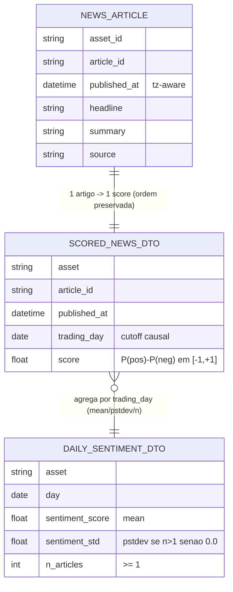

# Concept — Stage 3.2 — Sentimento via FinBERT version-pinned (`feature_engineering`)

> **Escopo deste documento:** o que será feito nesta Stage, por quê, e
> decisões técnicas relevantes para entender o "porquê". O plano executável
> fica no [`technical.md`](./technical.md) correspondente.

## 1. Escopo

### Dentro do escopo

- **Port-out `SentimentModel`** (`application/ports/out/sentiment_model.py`):
  **`Protocol`** estrutural (não ABC — o old era ABC) que recebe
  `Sequence[NewsArticle]` e devolve um score por artigo, **ordem preservada
  entrada↔saída**, score em `[-1, +1]`. Importa a entity `NewsArticle` do `domain`
  de `market_data` (application pode importar domain cross-BC). **Nunca** importa
  `torch`/`transformers` (confinados ao adapter). Expõe `model_name`/`revision`
  para rastreabilidade.
- **Use case `ScoreAndAggregateSentiment`** (`application/use_cases/score_and_aggregate_sentiment.py`):
  recebe `Request` frozen (`asset`, janela `start`/`end`, `close_hour`), lê a bronze
  `news` via `MedallionStore.read` → `NewsArticle`, scora via `SentimentModel`,
  mapeia `published_at` → dia de pregão via
  `TradingCalendar.trading_day_from_timestamp(ts, close_hour)` (sessões
  materializadas por `ExchangeCalendarProvider.sessions(start, end)`), **agrega por
  dia de pregão** (`mean`/`pstdev`/`n`) e devolve `Result` frozen com **DTOs**
  (`ScoredNewsDTO` + `DailySentimentDTO`) — **nunca** entity para fora.
- **Adapter `FinbertSentimentModel`** (`adapters/out/finbert/finbert_sentiment_model.py`):
  satisfaz o `SentimentModel` por duck-typing; **`ProsusAI/finbert` com `revision`
  (SHA do commit HF) PINADA** e exposta como parâmetro/config; `transformers`/`torch`
  com **import LAZY** (dentro de `__init__`/método, não no topo do módulo) com
  `ImportError` claro se ausente; `batch_size=16`/`max_length=512`. Contém a
  **função pura `scores_from_probs`** (stdlib-only) e o helper `_build_text`.
- **`scores_from_probs(probs) -> list[float]`** (stdlib-only, no módulo do adapter):
  função pura que faz `p[2] - p[0]` por linha (labels FinBERT `[neg, neu, pos]`),
  **testável SEM torch** com fixtures de probabilidade — separada da
  tokenização/forward. É o que garante coverage ≥90% do código vivo do BC sem
  instalar torch no CI.
- **Fake `InMemorySentimentModel`** (`tests/fakes/`): comportamental
  (não `Mock`, stdlib-only) que satisfaz o `Protocol`, devolvendo scores
  determinísticos (mapa `article_id → score` ou função) para testar o use case sem
  torch.
- **Unit test da agregação diária SEM torch**
  (`tests/unit/.../test_sentiment_aggregation.py`): cobre `scores_from_probs`
  (validada contra o oráculo `data/processed/scored_news/AAPL`), `_build_text`, o
  contract test do port (ordem preservada + score em `[-1, +1]`) e o use case
  (mean/pstdev/n por dia de pregão + guarda de causalidade) com fake do
  `SentimentModel` + fake/stub do `ExchangeCalendarProvider` + `TradingCalendar`
  real.
- **Integration test do adapter live** (`tests/integration/.../test_finbert_sentiment_model.py`):
  `skipif`/marker quando `transformers`/`torch` ou o modelo estiverem ausentes
  (mesma postura de `yfinance`/Alpha Vantage/`exchange-calendars`); **não baixa o
  modelo (~400 MB) no fluxo unattended**; quando rodado manualmente valida score em
  `[-1, +1]` contra um caso de oráculo.
- **Extra opcional `sentiment`** em `[project.optional-dependencies]` do
  `pyproject.toml` (`torch` + `transformers`, pinados por minor) **FORA do grupo
  `dev`** (que o CI instala via `uv sync --extra dev`) + **novo contrato
  import-linter `sentiment-no-ml-leak`** (forbidden `torch`/`transformers` em
  `feature_engineering.{application,domain}`, espelhando
  `calendar-no-exchange-calendars-leak`/`tracker-no-mlflow-leak`).
- **ADRs** `3_2_0001` (FinBERT pinado + fórmula de scoring + agregação),
  `3_2_0002` (deps ML como extra opcional + import lazy + contrato anti-leak) e os
  ADRs de **fundação** `0_0_0017` (FinBERT version-pinned) e `0_0_0018`
  (anti-leakage não-negociável) — citados em `overview.md` §11 mas **sem arquivo**
  em `docs/adr/` até esta Stage; todos `accepted`.

### Fora do escopo (explicitamente)

- **Modelos de sentimento cripto** e **calibração do score** (`non_goals` do
  roadmap §Stage 3.2).
- **Re-scorar os ~6892 artigos** de AAPL via FinBERT no overnight — os
  `data/processed/scored_news`/`sentiment_daily` do old são **oráculo/fixture**,
  não entrada (ledger §B; overview §3 "features re-derivadas de `raw/`"). Rodar o
  modelo (~400 MB) no fluxo unattended é proibido (finding overnight).
- **Adicionar `torch`/`transformers` ao grupo `dev`** que o CI instala
  (`uv sync --extra dev`) — finding overnight: estouraria/lentidão no runner.
- **Persistência real na layer `processed`** (schema `MedallionStore` `processed` +
  wiring end-to-end no `composition_root`): o registry do store é **bronze-only**
  (ADR `3.1.0001` Alt. D) e a `arquivos_a_criar` do roadmap não inclui schema/use
  case de persistência. Esta Stage entrega o **contrato de saída** do use case (os
  DTOs), não a persistência — dataset/persistência é dono a **Stage 3.5** (ver §7
  D5).
- **Indicadores técnicos** (3.1, fechada), **as-of de fundamentos** (3.3),
  **registry rico / derivadas sentimento×vol** (3.4), **dataset builder / alvo
  log-retorno** (3.5), **treino** (Step 5).
- **Fechamento da Stage** (commit `complete`, marcar `done` no roadmap) — é do
  orquestrador, após auditoria independente.

### Vínculo com o roadmap

Esta Stage avança o **Step 3 — Camada de features (silver)**
([`roadmap.md`](../../roadmap.md) §Stage 3.2), reusando o BC `feature_engineering`
criado na 3.1 (**não** recriar o container layered). Materializa a
`definition_of_done` do roadmap ("FinBERT (revisão pinada) gera score por artigo;
agregação por dia de pregão respeita cutoff de publicação (sem usar artigo
futuro); fake passa contract test") e introduz os contratos `SentimentModel`
(port-out) e `ScoreAndAggregateSentiment` (use case) que a 3.4 (interações
sentimento×vol) e a 3.5 (dataset-builder) consumirão. Consome a bronze `news` e a
entity `NewsArticle` da 2.3 (`depends_on: 2.3`), o `MedallionStore` da 2.1 e o
`TradingCalendar`/`ExchangeCalendarProvider` da 2.4.

## 2. Objetivo da Stage

Ao fim desta Stage, dado o asset AAPL e uma janela `[start, end]`, o use case
`ScoreAndAggregateSentiment` — usando o `FinbertSentimentModel` (`ProsusAI/finbert`
com **revisão HF pinada**) atrás do port `SentimentModel` — produz, para cada
artigo da bronze `news` na janela, um **score em `[-1, +1]` = P(pos) − P(neg)**
(ordem preservada), e os **agrega por dia de pregão** (`mean`/`pstdev`/`n`) com
**guarda de causalidade** (artigo publicado após o `close_hour` rola para a próxima
sessão; nenhum artigo futuro é usado), devolvendo apenas **DTOs frozen** — com a
lógica pura de scoring e de agregação **testável e coberta ≥90% sem instalar
torch**, e `torch`/`transformers` provados confinados ao adapter pelo novo contrato
`sentiment-no-ml-leak`.

## 3. Contexto e premissas

### Contexto

O repo antigo scorava sentimento num adapter `FinbertSentimentModel`
(`adapters/finbert_sentiment_model.py`) sobre `transformers`/`torch` **importados
no topo do módulo**, com a fórmula `probs[:, 2] − probs[:, 0]` (labels FinBERT
`[neg, neu, pos]`) **acoplada aos tensores** (L113-118), `batch_size=16`,
`max_length=512` e `_build_text = headline + summary` com fallback `' '` (L91-99). O
`model_name` era passado **sem `revision`** — fonte direta da **irreprodutibilidade**
que o overview ADR `0.0.0017` manda corrigir. A agregação diária vivia num serviço
de domínio `SentimentAggregator` (`sentiment_aggregator.py:55-85`): agrupa por dia
de pregão (`trading_day_from_timestamp`), `sentiment_score = mean`, `sentiment_std =
pstdev if n>1 else 0.0`, `n_articles = len`. O use case
`sentiment_feature_engineering_use_case.py` carregava uma **guarda de causalidade**
explícita (`_validate_daily_causality` L116-186) e preenchia dias vazios com
`score=0.0`/`n=0`. O port era um **ABC** (`interfaces/sentiment_model.py`) e os use
cases devolviam **entities** (`ScoredNewsArticle`) direto.

Esta Stage corrige quatro pontos: (1) **pinar a revisão HF** (reprodutibilidade,
`0.0.0017`); (2) **separar a fórmula de scoring numa função pura**
(`scores_from_probs`) testável sem torch e validável contra o oráculo; (3) **port
como `Protocol` + DTO na fronteira** (postura consolidada 2.1/2.2/3.1, não ABC nem
entity para fora); (4) **`torch`/`transformers` como extra opcional + import lazy +
contrato anti-leak**, para não pesar o CI nem vazar a lib para a `application`.

A 3.1 já criou o BC `feature_engineering` como container layered (domain ←
application ← adapters/out) com `domain-purity`/`store-no-storage-leak` no
`import-linter`. A 2.3 entregou a entity `NewsArticle` (frozen, stdlib-only,
identidade `(asset_id, article_id)`, `published_at` tz-aware) e a bronze `news`. A
2.4 entregou o serviço de domínio `TradingCalendar` (que mapeia timestamp → dia de
pregão) operando sobre um VO `TradingSessions` injetado, materializado pelo port
`ExchangeCalendarProvider.sessions(start, end)` (ADR `2.4.0001`).

### Premissas

- A entity `NewsArticle` (2.3, `done`) é stdlib-only, frozen, com `published_at`
  tz-aware (naive → `ValueError`) e `headline`/`summary`/`source` `str`; é
  importável de `features.market_data.domain.entities.news_article` pela
  `application` do BC `feature_engineering` (application pode importar domain de
  outro BC — LAYOUT §3/§7; mesma travessia que a 3.1 faz com `Candle`).
- `TradingCalendar.trading_day_from_timestamp(ts, close_hour)` (2.4, `done`) recebe
  o `close_hour` como `datetime.time` **por chamada** (não vive no VO de sessões);
  `ts` naive → `ValueError`; `ts.time() > close_hour` **ou** base não-sessão → rola
  para `next_session`; estouro da janela materializada → `ValueError` (sem clamp).
- O `MedallionStore.read(layer="bronze", table="news", filters=...)` (2.1, `done`)
  devolve `Sequence[Mapping[str, object]]` (linhas) que o use case mapeia para
  `NewsArticle`. O registry de schema do store é **bronze-only** (ADR `3.1.0001`
  Alt. D) — não há schema `processed` (ver §7 D5).
- `ProsusAI/finbert` expõe 3 labels na ordem `[negative, neutral, positive]`
  (índices 0/1/2). A fórmula `score = p[2] − p[0]` produz `[-1, +1]` por construção
  (probabilidades em `[0, 1]`). **A confirmar na execução** que a `revision` pinada
  preserva essa ordem de labels (Q1 em §13) — a fixture-oráculo é a rede.
- O oráculo `data/processed/scored_news/AAPL/scored_news_AAPL.parquet` (~6892
  linhas) e `sentiment_daily/AAPL/daily_sentiment_AAPL.parquet` (~5844 linhas) do
  old são **fixtures de regressão** (validam fórmula pura + agregação), **não**
  entrada do pipeline (overview §3; ledger).
- `torch` arrasta centenas de MB; **não** pode entrar no grupo `dev` que o CI
  instala (finding overnight) — daí o extra opcional + import lazy + skip no
  integration.

### Dependências

- **`2.1-medallion-storage-contracts`** (`done`): port `MedallionStore`
  (`read`/`write`) e o schema bronze `news` (PK lógica `(asset_id, article_id)`,
  `published_at` UTC). Consumido para ler a bronze `news`.
- **`2.3-news-fundamentals-ingestion`** (`done`): entity `NewsArticle` (insumo do
  scoring) e a bronze `news` populada (fonte real das notícias).
- **`2.4-trading-calendar`** (`done`): serviço de domínio `TradingCalendar`
  (`trading_day_from_timestamp`, guarda de causalidade) **e** o port
  `ExchangeCalendarProvider` (`sessions(start, end)` → `TradingSessions`) que
  materializa as sessões injetadas no calendário (ADR `2.4.0001`). **Deviation:** o
  roadmap §Stage 3.2 `contratos_consumidos` lista `MedallionStore` + `TradingCalendar`
  mas **não** o `ExchangeCalendarProvider` — registrar como `[deviation]` no
  `technical.md` §7 (ver §7 D6).
- **`3.1-technical-indicators`** (`done`): o BC `feature_engineering` já é container
  layered no `import-linter` (containers + `domain-purity` + `store-no-storage-leak`);
  esta Stage **reusa** o container e **acrescenta** o contrato `sentiment-no-ml-leak`,
  sem recriar o BC.

## 4. Contratos

### Introduzidos

- **`SentimentModel`** (`port-out`, `Protocol` em
  `features/feature_engineering/application/ports/out/sentiment_model.py`) —
  INTRODUZIDO. Estrutural, **sem** importar `torch`/`transformers`/adapters:

  ```python
  from collections.abc import Sequence
  from typing import Protocol

  from financial_forecasting.features.market_data.domain.entities.news_article import (
      NewsArticle,
  )

  class SentimentModel(Protocol):
      model_name: str
      revision: str

      def score_articles(self, articles: Sequence[NewsArticle]) -> Sequence[float]:
          """Um score em [-1, +1] por artigo; ordem preservada entrada↔saída."""
          ...
  ```

  Garantias: **1 saída por artigo**; **ordem preservada** (`article[i] → score[i]`);
  score em `[-1, +1]`; `model_name`/`revision` expostos para rastreabilidade.

- **`ScoreAndAggregateSentiment`** (`use case` em
  `features/feature_engineering/application/use_cases/score_and_aggregate_sentiment.py`)
  — INTRODUZIDO. Recebe/devolve **dataclass frozen** (DTO), nunca entity:

  ```python
  from collections.abc import Sequence
  from dataclasses import dataclass
  from datetime import date, datetime, time

  @dataclass(frozen=True)
  class ScoreAndAggregateSentimentRequest:
      asset: str
      start: datetime
      end: datetime
      close_hour: time

  @dataclass(frozen=True)
  class ScoredNewsDTO:
      asset: str
      article_id: str | None
      published_at: datetime
      trading_day: date
      score: float            # P(pos) - P(neg) em [-1, +1]

  @dataclass(frozen=True)
  class DailySentimentDTO:
      asset: str
      day: date
      sentiment_score: float  # mean(scores do dia)
      sentiment_std: float    # pstdev se n>1 senão 0.0
      n_articles: int         # >= 0

  @dataclass(frozen=True)
  class ScoreAndAggregateSentimentResult:
      scored: Sequence[ScoredNewsDTO]
      daily: Sequence[DailySentimentDTO]
      model_name: str
      revision: str
  ```

  Colabora com `SentimentModel` (scoring), `ExchangeCalendarProvider`
  (materializa `TradingSessions`), `TradingCalendar` (cutoff/dia de pregão) e
  `MedallionStore` (lê a bronze `news`). Injetados via construtor.

- **`scores_from_probs(probs)`** (`-> list[float]`, função pura stdlib-only no
  módulo do adapter) — INTRODUZIDO. `probs: Sequence[Sequence[float]]` (linhas
  `[neg, neu, pos]`) → `[p[2] - p[0] for p in probs]`. **Testável SEM torch**;
  validada contra o oráculo `scored_news_AAPL.parquet`.

- **`FinbertSentimentModel`** (`adapter`,
  `features/feature_engineering/adapters/out/finbert/finbert_sentiment_model.py`) —
  INTRODUZIDO. Satisfaz `SentimentModel` por duck-typing; `revision` pinada exposta;
  `transformers`/`torch` com **import LAZY**; `_build_text`/`scores_from_probs`/
  batching internos. **Única casa** de `torch`/`transformers` no BC.

- **`InMemorySentimentModel`** (`fake`,
  `tests/fakes/features/feature_engineering/in_memory_sentiment_model.py`) —
  INTRODUZIDO. Comportamental, stdlib-only, satisfaz o `Protocol`; scores
  determinísticos por `article_id`/função; preserva ordem.

### Consumidos

- **`NewsArticle`** (`entity`) — declarado na Stage `2.3-news-fundamentals-ingestion`
  (`features/market_data/domain/entities/news_article.py`). Insumo do `SentimentModel`
  e mapeado das linhas da bronze `news`. `published_at` tz-aware; identidade
  `(asset_id, article_id)`.
- **`MedallionStore`** (`port-out`) — declarado na 2.1
  (`shared/application/ports/out/medallion_store.py`).
  `read(layer="bronze", table="news", filters=...)` → `Sequence[Mapping]`. **Não**
  estendido para layer `processed` nesta Stage (D5).
- **`TradingCalendar`** (`domain-service`) — declarado na 2.4
  (`shared/domain/services/trading_calendar.py`).
  `trading_day_from_timestamp(ts, close_hour)` → `date` para o cutoff/dia de pregão.
- **`ExchangeCalendarProvider`** (`port-out`) — declarado na 2.4
  (`shared/application/ports/out/exchange_calendar_provider.py`).
  `sessions(start, end)` → `TradingSessions`, injetado no `TradingCalendar` (ADR
  `2.4.0001`). **Consumo não declarado no roadmap §3.2 → `[deviation]` (D6).**

## 5. Invariantes e regras

- **I1 — Score por artigo em `[-1, +1]` = P(pos) − P(neg).** Labels FinBERT
  `[neg, neu, pos]` (índices 0/1/2) → `probs[:, 2] − probs[:, 0]`. A função pura
  `scores_from_probs(probs) -> list[float]` é **stdlib-only** e testável **SEM
  torch** (fixtures de probabilidade; validação contra o oráculo
  `scored_news_AAPL.parquet`). Por construção (`p ∈ [0, 1]`), o resultado ∈ `[-1, +1]`.
- **I2 — Ordem preservada entrada↔saída.** `score_articles` devolve **1 score por
  artigo** alinhado por índice (`article[i] → score[i]`). Idempotência lógica por
  `article_id` (insumo para usar o oráculo sem re-scorar).
- **I3 — Causalidade / anti-leakage (NÃO-NEGOCIÁVEL, overview ADR `0.0.0018`).**
  Artigo publicado **após o `close_hour`** rola para a **próxima sessão** de pregão;
  **nunca** usa artigo futuro. `published_at` deve ser tz-aware (naive →
  `ValueError`, herdado de `NewsArticle` e `TradingCalendar`). Dia agregado **fora
  da janela materializada** → `ValueError` (sem clamp, herdado do `TradingCalendar`).
- **I4 — Agregação diária (replica `SentimentAggregator` do old).** Por dia de
  pregão: `sentiment_score = mean(scores do dia)`; `sentiment_std = pstdev(scores)
  se n > 1 senão 0.0`; `n_articles = len(scores) >= 0`; `sentiment_std >= 0`. As
  linhas diárias são ordenadas por `day`.
- **I5 — Pureza hexagonal / `sentiment-no-ml-leak` (gate).** `torch`/`transformers`
  vivem **só** no adapter `adapters/out/finbert/`; o import é **LAZY** (dentro de
  `__init__`/método, não no topo do módulo) com `ImportError` claro se ausente. Novo
  contrato `import-linter` `sentiment-no-ml-leak` (forbidden `torch`+`transformers`
  em `feature_engineering.{application,domain}`) espelha
  `calendar-no-exchange-calendars-leak`/`tracker-no-mlflow-leak`; `domain-purity` +
  `store-no-storage-leak` (já cobrem o BC, 3.1) seguem valendo.
- **I6 — Reprodutibilidade / FinBERT pinado (overview ADR `0.0.0017`).** O modelo
  `ProsusAI/finbert` é carregado com `revision` (SHA do commit HF) **PINADA** e
  exposta como parâmetro/config — o old **não** pinava (melhoria, não réplica). O
  par `(model_name, revision)` cruza no `Result` para rastreabilidade.
- **I7 — DTO na fronteira / port `Protocol`.** O use case recebe/devolve
  `dataclass` frozen (DTO); a entity `NewsArticle` **nunca** cruza para fora da
  `application`. `SentimentModel` é `Protocol` estrutural (duck-typing), não ABC;
  adapters/fakes não herdam da `application`. VOs/DTOs frozen.
- **I8 — Coverage ≥90% do código vivo SEM torch.** Garantido porque
  `scores_from_probs` + `_build_text` + a agregação do use case são testáveis com
  fixtures de probabilidade e fakes (sem `torch`); o adapter live faz `skipif`
  (lib/modelo ausente) e **não** conta como código vivo testado no CI `dev`.
- **I9 — Extra opcional fora do dev.** `torch`/`transformers` vivem em
  `[project.optional-dependencies].sentiment`, **fora** do grupo `dev` que o CI
  instala (`uv sync --extra dev`). O integration test é `skipped` no CI; rodado
  manualmente com o extra instalado.
- **I10 — `_build_text` e parâmetros do tokenizer confinados ao adapter.**
  `_build_text = headline + summary` (join por espaço; fallback `' '` se ambos
  vazios); `batch_size=16`, `max_length=512`, `padding=True`/`truncation=True`/
  `return_tensors="pt"` — tudo **dentro do adapter**; não cruzam o port.
- **I11 — Gates verdes.** `mypy --strict` e `ruff` verdes; `make check` e
  `make test` verdes; `import-linter` verde com `domain-purity` +
  `store-no-storage-leak` + **`sentiment-no-ml-leak`**; `check_layout.py` verde para
  a estrutura `adapters/out/finbert`; cobertura ≥90% no código vivo do BC **sem**
  instalar torch.

## 6. Casos de erro e exceções

- **C1 — `published_at` naive.** Artigo com `published_at` sem timezone → `ValueError`
  (herdado de `NewsArticle.__post_init__` e reforçado por
  `TradingCalendar.trading_day_from_timestamp`). Não há fallback silencioso (I3).
- **C2 — Artigo após o `close_hour`.** `ts.time() > close_hour` (ou base não-sessão)
  → o artigo é atribuído à **próxima sessão** (`next_session`), nunca à sessão
  corrente; é o comportamento **esperado** da guarda de causalidade (I3), não erro.
- **C3 — Dia/artigo fora da janela materializada.** Um timestamp cujo dia de pregão
  cairia além de `[start, end]` das sessões materializadas → `ValueError` (sem
  clamp, herdado do `TradingCalendar`); o caller materializa janela larga o bastante
  (a janela do `ExchangeCalendarProvider` deve cobrir o cutoff do último artigo).
- **C4 — `transformers`/`torch` ausentes ao instanciar o adapter.** O import lazy
  levanta `ImportError` com mensagem clara orientando `uv sync --extra sentiment`
  (I5/I9); o port e o use case continuam testáveis sem a lib (fake).
- **C5 — Probabilidades malformadas em `scores_from_probs`.** Linha sem exatamente 3
  componentes (`[neg, neu, pos]`) → `ValueError` explícito (não devolve score
  parcial/silencioso); fronteira validada na função pura.
- **C6 — Score fora de `[-1, +1]`.** Por construção `p[2] − p[0] ∈ [-1, +1]`; o
  contract test do port (fake e oráculo) **reprova** qualquer score fora do
  intervalo — rede contra labels trocados/ordem de softmax errada (I1).
- **C7 — Dia de pregão sem artigos (synthetic day).** Decisão de **não** materializar
  dias vazios (`score=0.0`/`n=0`) no use case desta Stage — o old preenchia, mas o
  fill de grade pertence ao dataset-builder (3.5), que monta a grade diária completa.
  O `Result.daily` contém **apenas** dias com `n_articles >= 1` (ver §7 D7).

## 7. Decisões técnicas relevantes

### D1 — FinBERT com revisão HF pinada + fórmula de scoring + agregação diária

- **O quê:** Usar `ProsusAI/finbert` com `revision = <SHA do commit HF>` **PINADA**
  e exposta como parâmetro/config; **score por artigo = P(pos) − P(neg)** (labels
  `[neg, neu, pos]` → `probs[:, 2] − probs[:, 0]`); **agregação diária = média por
  dia de pregão** (`mean`; `pstdev` se `n > 1` senão `0.0`; `n_articles`).
  Rejeitada: replicar o old **sem** pinar a revisão (irreprodutível).
- **Por quê:** Ledger §B 3.2 e overview ADR `0.0.0017` exigem reprodutibilidade; o
  old (`finbert_sentiment_model.py:113-118`) usa a fórmula mas **não** pinava
  `revision` — pinar é a melhoria que `0.0.0017` manda. A agregação confirma o
  `SentimentAggregator` do old (`sentiment_aggregator.py:55-85`).
- **Fonte:** `docs/autonomous-run-decision-ledger.md` §B linha 3.2; `overview.md`
  §11 ("FinBERT version-pinned", `adr_id 0.0.0017`); old
  `src/adapters/finbert_sentiment_model.py:113-118` (fórmula),
  `src/domain/services/sentiment_aggregator.py:55-85` (mean/pstdev/n).
- **ADR:** [`../../adr/3_2_0001-finbert-pinned-revision-and-scoring.md`](../../adr/3_2_0001-finbert-pinned-revision-and-scoring.md)
  e o de fundação [`../../adr/0_0_0017-finbert-version-pinned.md`](../../adr/0_0_0017-finbert-version-pinned.md)

### D2 — `torch`/`transformers` como extra opcional + import lazy + contrato anti-leak

- **O quê:** Criar `[project.optional-dependencies].sentiment = [torch, transformers]`
  (pinados por minor) **FORA** do grupo `dev` (que o CI instala via
  `uv sync --extra dev`); adapter faz **import LAZY** (dentro de `__init__`/método)
  com `ImportError` claro; integration test com `skipif`/marker; **novo contrato**
  `import-linter` `sentiment-no-ml-leak` (forbidden `torch`+`transformers` em
  `feature_engineering.{application,domain}`). Rejeitadas: pôr `torch` no `dev`
  (estoura/lento no CI); import no topo do módulo do adapter (importa torch só por
  importar o módulo, quebra coleta de testes sem a lib).
- **Por quê:** Finding overnight — `torch` (~centenas de MB) no `dev` faria o
  `uv sync --extra dev` do CI baixar torch (lentíssimo, pode estourar o runner).
  Mesma postura já consolidada para `exchange-calendars`
  (`calendar-no-exchange-calendars-leak`), `mlflow` (`tracker-no-mlflow-leak`) e
  `pandas`/`pyarrow` (`store-no-storage-leak`). Garante coverage ≥90% do código vivo
  **sem** instalar torch (I8).
- **Fonte:** finding overnight (deps pesadas / robustez); `.importlinter` contratos
  `tracker-no-mlflow-leak` (linhas 145-154), `store-no-storage-leak` (167-197),
  `calendar-no-exchange-calendars-leak` (207-216); postura `skipif` de
  `yfinance`/Alpha Vantage (2.2/2.3) e `exchange-calendars` (2.4) no integration.
- **ADR:** [`../../adr/3_2_0002-ml-deps-optional-extra-and-lazy-import.md`](../../adr/3_2_0002-ml-deps-optional-extra-and-lazy-import.md)

### D3 — Separar a lógica pura de scoring (`scores_from_probs`)

- **O quê:** Extrair `scores_from_probs(probs: Sequence[Sequence[float]]) -> list[float]`
  (faz `p[2] − p[0]` por linha) como **função pura stdlib-only**, testável **SEM
  torch**; `_score_texts` (tokenização/forward → probs) só produz `probs` e delega a
  fórmula à função pura. Rejeitada: manter a fórmula acoplada aos tensores como no
  old.
- **Por quê:** No old `_score_texts` acopla `probs[:, 2] − probs[:, 0]` ao tensor
  (`finbert_sentiment_model.py:113-118`); o finding overnight pede a função pura para
  (a) coverage ≥90% sem torch e (b) validar a fórmula contra o oráculo
  `data/processed/scored_news/AAPL/scored_news_AAPL.parquet` (~6892 linhas).
  Decisão de organização interna do adapter (invariante I1, sem alternativa
  estrutural com lib trocada) → registrar como `[decision]` no `technical.md` §7,
  **sem ADR próprio**.
- **Fonte:** finding overnight (separar lógica pura); old
  `src/adapters/finbert_sentiment_model.py:113-118`; oráculo
  `data/processed/scored_news/AAPL/scored_news_AAPL.parquet`; padrão `DummyFinBERT`
  do old `tests/unit/adapters/sentiment/test_finbert_adapter.py:39-45` (injetava
  scores sem torch → evolui para a função pura).

### D4 — Port = `Protocol` (não ABC) + DTO na fronteira (não entity para fora)

- **O quê:** `SentimentModel` como `typing.Protocol` (duck-typing), espelhando
  `IndicatorCalculator`/`MedallionStore`/`ExchangeCalendarProvider`; o use case
  `ScoreAndAggregateSentiment` recebe/devolve `dataclass` frozen (DTO), **nunca**
  entity de domínio. Rejeitada: ABC + devolver `ScoredNewsArticle` (entity) direto,
  como o old.
- **Por quê:** O old usa `SentimentModel(ABC)` e os use cases devolvem entities
  direto — viola a postura do projeto (LAYOUT §3, `hex-arch-python`) e o padrão já
  consolidado em 2.1/2.2/3.1 (Protocol + DTO na fronteira). `Protocol` mantém o
  adapter/fake trocáveis sem herança; DTO mantém a entity dentro da `application`.
  Decisão de aplicar padrão já consolidado (sem alternativa estrutural nova) →
  `[decision]` no `technical.md` §7, **sem ADR próprio**.
- **Fonte:** ADRs `2.1.0002`/`1.5.0002`/`3.1.0001` (port-as-Protocol + DTO/Mapping na
  fronteira); LAYOUT §3; skill `hex-arch-python`; old
  `src/interfaces/sentiment_model.py` (ABC → Protocol) e
  `src/use_cases/sentiment_feature_engineering_use_case.py` (devolve entity → DTO).

### D5 — Persistência em layer `processed` (a DoD fala em agregação salva)

- **O quê:** **Não** implementar schema `processed` no `MedallionStore` nem wiring
  end-to-end no `composition_root` nesta Stage. O contrato em escopo é o **`Result`
  do use case** (DTOs `ScoredNewsDTO`/`DailySentimentDTO`); a persistência/dataset é
  da **Stage 3.5**. Rejeitada: estender o registry do store com schema `processed` +
  use case de escrita aqui.
- **Por quê:** O registry do `MedallionStore` é **bronze-only** (ADR `3.1.0001` Alt.
  D confirmou ausência de schema `processed`; `3.1.0001` Alt. D já fixou
  "bronze→processed = direção de fluxo"). A `arquivos_a_criar` do roadmap §3.2 não
  inclui schema/use case de persistência. Introduzi-los aqui seria escopo de 3.5
  vazando para 3.2. Registrar como `[decision]` no `technical.md` §7.
- **Fonte:** `roadmap.md` §Stage 3.2 (`arquivos_a_criar` sem schema/persistência) e
  §Stage 3.5 (`build_dataset` + `dataset_schema`); ADR `3.1.0001` (Alt. D, registry
  bronze-only); `bronze_schemas.py` (só `bronze`).

### D6 — Consumo de `ExchangeCalendarProvider`/`TradingCalendar` não-declarado no roadmap

- **O quê:** Registrar `[deviation]` no `technical.md` §7: o use case consome
  `ExchangeCalendarProvider` (2.4) para materializar `TradingSessions` **e**
  `TradingCalendar` (2.4) para o cutoff/dia de pregão. O roadmap §3.2
  `contratos_consumidos` lista `MedallionStore` + `TradingCalendar` mas **não** o
  `ExchangeCalendarProvider`.
- **Por quê:** A DoD exige agregação por dia de pregão com guarda de causalidade
  (cutoff de publicação); isso requer materializar sessões via
  `ExchangeCalendarProvider.sessions(start, end)` e injetar no `TradingCalendar`
  (ADR `2.4.0001` — o calendário opera sobre o VO injetado, não materializa
  sessões). É **deviation de documentação**, não de design: o consumo é
  consequência necessária do contrato de 2.4. Sem ADR próprio.
- **Fonte:** `roadmap.md` §Stage 3.2 (`contratos_consumidos`); ADR `2.4.0001`
  (`TradingCalendar` opera sobre `TradingSessions` injetado pelo
  `ExchangeCalendarProvider`); port
  `shared/application/ports/out/exchange_calendar_provider.py`.

### D7 — Não materializar dias de pregão vazios no use case (fill deferido para 3.5)

- **O quê:** O `Result.daily` contém **apenas** dias com `n_articles >= 1`. **Não**
  preencher dias de pregão sem notícia com `score=0.0`/`n=0` nesta Stage (o old
  preenchia no `_fill_missing_days_with_zero_news`). Rejeitada: portar o fill de
  grade para o use case.
- **Por quê:** O fill de grade depende da **grade diária completa** do dataset
  (todas as sessões `[start, end]`), que é montada pelo **dataset-builder (3.5)** —
  é lá que faz sentido decidir a política de dia-vazio (0.0 vs `NaN`/known-unknown).
  Materializar aqui acoplaria o use case de sentimento à grade do dataset e
  duplicaria a lógica de 3.5. A guarda de causalidade (I3) já garante que nenhum
  artigo futuro entra; a completude da grade é responsabilidade de 3.5. Registrar
  como `[decision]` no `technical.md` §7, **sem ADR próprio**.
- **Fonte:** old
  `src/use_cases/sentiment_feature_engineering_use_case.py:_fill_missing_days_with_zero_news`
  (fill no old); `roadmap.md` §Stage 3.5 (`build_dataset` — dono da grade diária);
  ADR `3.1.0001` (D5: persistência/dataset deferidos a 3.5).

### D8 — ADRs de fundação `0_0_0017`/`0_0_0018` oficializados nesta Stage

- **O quê:** **Criar** os arquivos `docs/adr/0_0_0017-finbert-version-pinned.md` e
  `docs/adr/0_0_0018-anti-leakage-non-negotiable.md` (`status: accepted`) — ambos
  citados em `overview.md` §11 (`adr_id 0.0.0017`/`0.0.0018`) mas **sem arquivo** em
  `docs/adr/` até aqui. `0.0.0017` governa o pin de revisão desta Stage; `0.0.0018`
  governa a guarda de causalidade. Mesma postura da 3.1, que oficializou `0_0_0024`.
- **Por quê:** Decisões de fundo já fechadas (overview §11); o **gap é o arquivo
  ADR ausente** — oficializá-los aqui fecha a rastreabilidade citada por `overview.md`
  e ancora I3/I6. Esta é a primeira Stage cujo escopo **exerce** ambas (FinBERT
  pinado + cutoff causal de notícia), logo é onde os ADRs de fundação nascem.
- **Fonte:** `overview.md` §11 (linhas `0.0.0017` FinBERT version-pinned; `0.0.0018`
  anti-leakage causal + as-of + known/unknown); padrão de oficialização tardia da
  3.1 (`0_0_0024`, concept 3.1 §7 D4).

## 8. Integrações

### Internas (com outras Stages/módulos)

- `features/market_data/domain/entities/news_article.py` (`NewsArticle`, 2.3):
  insumo importado pelo port `SentimentModel` (application) e mapeado das linhas da
  bronze `news`.
- `shared/application/ports/out/medallion_store.py` (`MedallionStore`, 2.1): lido
  pelo use case (`read(layer="bronze", table="news")`); **não** wireado para
  `processed` (D5).
- `shared/domain/services/trading_calendar.py` +
  `shared/application/ports/out/exchange_calendar_provider.py` (2.4): cutoff/dia de
  pregão e materialização das sessões injetadas (D6).
- Consumidores futuros: `feature_engineering` 3.4 (interações sentimento×vol que
  consomem `DailySentimentDTO`) e 3.5 (`build_dataset` consome o use case +
  preenche a grade diária, D7).

### Externas

- **`ProsusAI/finbert`** (modelo HF, via `transformers`+`torch`): origem das
  probabilidades `[neg, neu, pos]`. Contrato esperado: tokenizer + modelo de
  sequence-classification com 3 labels nessa ordem; carregado com `revision` pinada
  (I6). Confinado ao adapter `out/finbert`; **não** baixado no fluxo unattended (I9).
- **`transformers`/`torch`** (libs): import LAZY no adapter; `ImportError` claro se
  ausentes (C4); extra opcional `sentiment` fora do `dev` (I9).

## 9. Modelo de dados (se aplicável)

Forma da saída do use case (DTOs frozen na fronteira):



`SCORED_NEWS_DTO`/`DAILY_SENTIMENT_DTO` são as `dataclass` frozen que cruzam a
fronteira do use case — a entity `NewsArticle` **não** cruza (I7). A `Row`
`processed` (schema/persistência) e o fill de dias vazios da grade ficam para a 3.5
(D5/D7).

## 10. Riscos e mitigações

| Risco | Probabilidade | Impacto | Mitigação |
|---|---|---|---|
| `revision` pinada do FinBERT troca a ordem de labels (`[neg,neu,pos]`) ou a semântica | B | A | I1/C6: fixture-oráculo (`scored_news_AAPL.parquet`) + contract test reprovam score fora de `[-1,+1]` ou divergente; `revision` SHA pinada congela o modelo |
| `torch` entra no `dev` e estoura/lentidão no runner CI | M | A | I9/D2: extra `sentiment` fora do `dev`; CI roda `uv sync --extra dev` (sem torch); integration `skipped` |
| `torch`/`transformers` vazam para `application`/`domain` | M | A | I5/D2: novo contrato `sentiment-no-ml-leak` + import LAZY; quebra intencional (`import torch` na application) reprova e é revertida |
| Modelo (~400 MB) baixado no fluxo unattended | B | A | I9: integration `skipif` (lib/modelo ausente) + marker fora do overnight; oráculo serve de fixture, não re-scora |
| Leakage de causalidade (artigo após close usado no dia corrente) | B | A | I3/C2: `trading_day_from_timestamp(ts, close_hour)` rola para `next_session`; teste dedicado de cutoff (artigo pós-close → próxima sessão) |
| Coverage <90% por código vivo acoplado a torch | M | M | I8/D3: `scores_from_probs`/`_build_text`/agregação puros e testados sem torch; só o forward fica atrás do `skipif` |
| Dia vazio tratado de forma divergente de 3.5 | B | M | D7: não materializar dia-vazio aqui (fill é de 3.5); `Result.daily` só tem dias com `n>=1` |

## 11. Critérios de aceitação

- [ ] **A1** — `SentimentModel` existe em
  `feature_engineering/application/ports/out/sentiment_model.py` como `Protocol`
  (não ABC), importa `NewsArticle` de `market_data.domain`, assinatura
  `score_articles(articles) -> Sequence[float]` (1 por artigo, ordem preservada),
  expõe `model_name`/`revision`, **sem** import de `torch`/`transformers`/adapters;
  `mypy --strict` + `lint-imports` verdes.
- [ ] **A2** — `InMemorySentimentModel` (comportamental, **não** `Mock`,
  stdlib-only) satisfaz o `Protocol` por duck-typing; contract test cobre **ordem
  preservada** (`article[i] → score[i]`) e **score em `[-1, +1]`**; roda **sem
  torch** (pytest verde).
- [ ] **A3** — `scores_from_probs(probs) -> list[float]` (stdlib-only) faz
  `p[2] − p[0]`, valida linha com 3 componentes (C5 → `ValueError`), produz `[-1,+1]`;
  unit test valida contra o **oráculo** `data/processed/scored_news/AAPL` (amostra de
  probabilidades → scores batem) **sem torch**.
- [ ] **A4** — `_build_text(article)` (stdlib-only) = `headline + summary` (join por
  espaço; fallback `' '` se ambos vazios); unit test cobre os 4 casos
  (ambos / só headline / só summary / vazios).
- [ ] **A5** — `ScoreAndAggregateSentiment` recebe/devolve `dataclass` frozen (DTO),
  **nunca** entity; usa fake do `SentimentModel` + fake/stub do
  `ExchangeCalendarProvider` + `TradingCalendar` **real**; agrega `mean`/`pstdev`/`n`
  por dia de pregão (I4); `Result` expõe `(model_name, revision)`; coverage da
  `application` ≥90% **sem torch**.
- [ ] **A6** — Guarda de causalidade testada: artigo publicado **após** `close_hour`
  é atribuído à **próxima sessão** (C2); `published_at` naive → `ValueError` (C1);
  dia fora da janela materializada → `ValueError` (C3); **nenhum artigo futuro** é
  usado (I3).
- [ ] **A7** — `FinbertSentimentModel` implementa o port; `ProsusAI/finbert` com
  `revision` **pinada** exposta como parâmetro/config (I6); `transformers`/`torch`
  com **import LAZY** dentro de `__init__`/método com `ImportError` claro se ausente
  (C4); `batch_size=16`/`max_length=512`; `scores_from_probs`/`_build_text` internos;
  **única casa** de `torch`/`transformers` no BC.
- [ ] **A8** — `pyproject.toml`: `[project.optional-dependencies].sentiment =
  [torch, transformers]` (pinados por minor) **FORA** do grupo `dev`; `uv.lock`
  sincronizado; CI roda `uv sync --extra dev` (sem torch).
- [ ] **A9** — `.importlinter`: novo contrato `sentiment-no-ml-leak` (forbidden
  `torch`+`transformers` em `feature_engineering.{application,domain}`) espelhando
  `calendar-no-exchange-calendars-leak`; `uv run lint-imports` verde; quebra
  intencional (`import torch` na application) reprova e é revertida.
- [ ] **A10** — `test_finbert_sentiment_model.py` (integration) com `skipif`/marker
  quando `transformers`/`torch`/modelo ausentes; **não** roda no fluxo overnight;
  quando rodado manualmente valida score em `[-1, +1]` contra um caso de oráculo;
  `make test` verde com o teste **SKIPPED** no CI `dev`.
- [ ] **A11** — `mypy --strict` e `ruff` verdes; `make check` e `make test` verdes;
  `import-linter` verde (`domain-purity` + `store-no-storage-leak` +
  `sentiment-no-ml-leak`); `check_layout.py` verde; cobertura ≥90% no código vivo do
  BC **sem instalar torch**.
- [ ] **A12** — ADRs `3_2_0001` (FinBERT pinado + scoring + agregação), `3_2_0002`
  (deps ML extra opcional + lazy + contrato anti-leak) e os de fundação `0_0_0017`
  (FinBERT version-pinned) e `0_0_0018` (anti-leakage não-negociável) com
  `status: accepted`.

## 12. Checklist de validação interna

- [x] Todos os contratos introduzidos têm assinatura definida? (`SentimentModel`,
  `ScoreAndAggregateSentiment` Request/Result + DTOs, `scores_from_probs`,
  `FinbertSentimentModel`, `InMemorySentimentModel` — §4)
- [x] Toda decisão em §7 tem fonte rastreável? (ledger §B 3.2, overview §11
  `0.0.0017`/`0.0.0018`, finding overnight, ADRs `2.1.0002`/`1.5.0002`/`2.4.0001`/
  `3.1.0001`, `.importlinter` linhas 145-216, roadmap §3.2/§3.5, old
  `finbert_sentiment_model.py`/`sentiment_aggregator.py`/`sentiment_feature_engineering_use_case.py`)
- [x] Toda integração externa tem contrato definido? (`ProsusAI/finbert`,
  `transformers`/`torch` — §8)
- [x] Decisões com alternativa real descartada têm ADR escrito? (D1 → `3.2.0001` +
  `0.0.0017`; D2 → `3.2.0002`; I3/D8 → `0.0.0018`; D3/D4/D5/D6/D7 reusam
  padrão/política — `[decision]`/`[deviation]` no §7, sem ADR próprio, justificado
  in-loco)
- [x] Dependências de Stages anteriores estão satisfeitas? (2.1 `done`:
  `MedallionStore`/bronze `news`; 2.3 `done`: `NewsArticle`/bronze `news` populada;
  2.4 `done`: `TradingCalendar`/`ExchangeCalendarProvider`; 3.1 `done`: BC
  `feature_engineering` container layered)
- [x] Stage cabe em ~3–8 Tasks? (10 Tasks no technical incluindo as 2 de gate de
  doc; decisões já tomadas, dentro da faixa de governança da corrida)
- [x] Riscos críticos têm mitigação plausível? (§10 — labels/revision, torch no CI,
  vazamento ML, download unattended, leakage causal, coverage, dia-vazio)
- [x] O domínio/application permanece sem `torch`/`transformers` e o port não vaza a
  lib? (I5, I7, I10; contrato `sentiment-no-ml-leak`)

## 13. Questões em aberto

- [ ] **Q1** — Confirmar na execução o **SHA da `revision`** de `ProsusAI/finbert`
  e que ela preserva a ordem de labels `[negative, neutral, positive]` (índices
  0/1/2). **Não bloqueante:** a fixture-oráculo + o contract test (I1/C6) são a rede
  — se a ordem divergir, o teste reprova e o ajuste (mapeamento de label por nome,
  não por índice) entra como `[decision]` no `technical.md` §7. O contrato (score
  P(pos)−P(neg) em `[-1,+1]`, agregação por dia de pregão, causalidade) já está
  fixado independentemente do SHA exato.

## 14. Referências

- [`../../overview.md`](../../overview.md) — §3 (features re-derivadas de `raw/`;
  `processed` antigo = oráculo), §6/§7 (restrições; abordagem medalhão /
  enforcement-as-test; FinBERT version-pinned), §11 (decisões: `0.0.0017` FinBERT
  version-pinned, `0.0.0018` anti-leakage, `0.0.0021` oráculo, `0.0.0016` 4 famílias
  de feature).
- [`../../roadmap.md`](../../roadmap.md) — Stage `3.2-sentiment-finbert`
  (`arquivos_a_criar`, DoD, `non_goals`, `contratos_consumidos`) e vizinhas (3.4
  interações sentimento×vol, 3.5 dataset-builder/persistência `processed`).
- [`../../autonomous-run-decision-ledger.md`](../../autonomous-run-decision-ledger.md)
  — §B linha 3.2 (`ProsusAI/finbert` + pinar revisão; score `P(pos)−P(neg)`; média
  diária por dia de pregão); H-3 (fallback de fundamentos — contexto da 3.3).
- ADRs desta Stage:
  [`3.2.0001`](../../adr/3_2_0001-finbert-pinned-revision-and-scoring.md),
  [`3.2.0002`](../../adr/3_2_0002-ml-deps-optional-extra-and-lazy-import.md),
  [`0.0.0017`](../../adr/0_0_0017-finbert-version-pinned.md),
  [`0.0.0018`](../../adr/0_0_0018-anti-leakage-non-negotiable.md).
- Stages consumidas:
  [`../2.3-news-fundamentals-ingestion/concept.md`](../2.3-news-fundamentals-ingestion/concept.md)
  (entity `NewsArticle`, bronze `news`),
  [`../2.4-trading-calendar/concept.md`](../2.4-trading-calendar/concept.md)
  (`TradingCalendar`/`ExchangeCalendarProvider`, ADR `2.4.0001`),
  [`../3.1-technical-indicators/concept.md`](../3.1-technical-indicators/concept.md)
  (BC `feature_engineering` container layered, ADR `3.1.0001`).
- ADRs de fundação/padrão relevantes:
  [`0.0.0021`](../../adr/0_0_0021-per-unit-contract-tests-with-oracle.md)
  (contract tests + oráculo),
  [`2.1.0002`](../../adr/2_1_0002-medallion-store-port-shape.md) /
  [`1.5.0002`](../../adr/1_5_0002-experiment-tracker-port-shape.md) /
  [`3.1.0001`](../../adr/3_1_0001-feature-engineering-bc-and-indicator-contracts.md)
  (port-as-Protocol + DTO/Mapping na fronteira; registry bronze-only),
  [`2.4.0001`](../../adr/2_4_0001-trading-calendar-domain-over-materialized-sessions-vo.md)
  (`TradingCalendar` sobre `TradingSessions` injetado).
- `.importlinter` (contratos `tracker-no-mlflow-leak` 145-154,
  `store-no-storage-leak` 167-197, `calendar-no-exchange-calendars-leak` 207-216 —
  moldes do novo `sentiment-no-ml-leak`).
- Old (semântica/lógica, não implementação):
  `financial-time-series-forecasting/src/adapters/finbert_sentiment_model.py:91-124`
  (`_build_text`/`_score_texts`/`_batch`; fórmula `probs[:,2]−probs[:,0]`; batch16/
  maxlen512; import torch/transformers no topo → mover p/ lazy; `model_name` sem
  `revision` → pinar),
  `src/interfaces/sentiment_model.py` (ABC → `Protocol`),
  `src/domain/services/sentiment_aggregator.py:55-85` (agregação `mean`/`pstdev`/`n`),
  `src/use_cases/sentiment_feature_engineering_use_case.py:116-186` (guarda de
  causalidade `_validate_daily_causality`; `_fill_missing_days_with_zero_news` —
  fill deferido a 3.5),
  `tests/unit/adapters/sentiment/test_finbert_adapter.py:39-45` (padrão
  `DummyFinBERT` sem torch → função pura `scores_from_probs`).
- Oráculos (fixture de regressão, **não** entrada):
  `data/processed/scored_news/AAPL/scored_news_AAPL.parquet` (~6892 linhas),
  `data/processed/sentiment_daily/AAPL/daily_sentiment_AAPL.parquet` (~5844 linhas).
