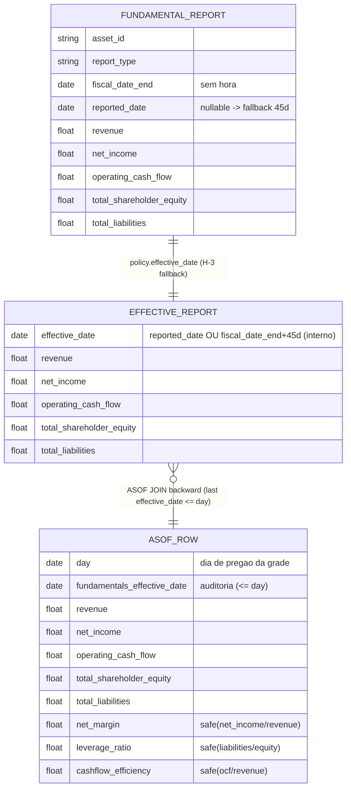

# Concept — Stage 3.3 — Junção as-of backward de fundamentals (`feature_engineering`)

> **Escopo deste documento:** o que será feito nesta Stage, por quê, e
> decisões técnicas relevantes para entender o "porquê". O plano executável
> fica no [`technical.md`](./technical.md) correspondente.

## 1. Escopo

### Dentro do escopo

- **Domain service `FundamentalsAsofPolicy`** (`domain/services/fundamentals_asof_policy.py`):
  classe **pura stdlib-only** (`datetime` apenas) que encapsula a política temporal
  do as-of:
  - **`effective_date(report) -> date`** — retorna `report.reported_date` se
    presente; senão `report.fiscal_date_end + timedelta(days=45)` (fallback
    **calendário**, ledger H-3). É o ponto-no-tempo a partir do qual o fundamento
    fica **visível**.
  - **`validate_not_future(effective_date, sample_date) -> None`** — levanta erro de
    domínio (`AntiLeakageError`, subclasse de `DomainError`) se
    `effective_date > sample_date`. É o invariante **razão-de-ser** da Stage
    (overview ADR `0.0.0018` regra 2), replicando o `ValueError` do old
    (`build_tft_dataset_use_case.py:518-535`) como erro **nomeável** de domínio.
- **Ratios fundamentais derivados PONTUAIS com divisão segura** (no domain, como
  funções/métodos puros de `FundamentalsAsofPolicy` ou serviço irmão):
  `net_margin = net_income / revenue`; `leverage_ratio = total_liabilities /
  total_shareholder_equity`; `cashflow_efficiency = operating_cash_flow / revenue`.
  **Divisão segura** (porta do `_safe_ratio` do old, `build_tft_dataset_use_case.py:256-263`):
  numerador `None` **ou** denominador `None`/`0`/`NaN` → resultado `None`. Entrada/
  saída em primitivos (`float | None`), **sem** pandas.
- **Port-out `AsofJoinAdapter`** (`application/ports/out/asof_join.py`): **`Protocol`**
  estrutural (não ABC), mesma postura de `IndicatorCalculator`/`SentimentModel`/
  `MedallionStore`. Método `asof_join_backward` que recebe a **grade diária de
  pregão** + os **reports já com `effective_date` calculado** (`Sequence[Mapping]`)
  e devolve `Sequence[Mapping]` (1 linha por dia de pregão) com os fundamentos
  as-of backward + a coluna de auditoria **`fundamentals_effective_date`**. **Não**
  vaza `duckdb`/`pandas` na fronteira (só `collections.abc`/primitivos).
- **Adapter `AsofJoinDuckdbAdapter`** (`adapters/out/duckdb/asof_join_adapter.py`):
  satisfaz `AsofJoinAdapter` por duck-typing; traduz o
  `merge_asof(direction="backward")` do old para **DuckDB ASOF JOIN backward**
  (`ASOF JOIN f ON d.date >= f.effective_date` — o último fundamento com
  `effective_date <= date`). `duckdb` confinado **AQUI**. Mantém **defense-in-depth**:
  re-checa `effective_date <= date` (mesmo o join já garantindo a condição).
- **Fake `InMemoryAsofJoinAdapter`** (`tests/fakes/`): comportamental (não `Mock`,
  stdlib-only) que satisfaz o `Protocol` com a mesma semântica backward — base do
  contract test de paridade fake↔real (ADR `0.0.0021`).
- **Testes**: unit da policy (fallback 45d + invariante + ratios), unit do invariante
  anti-leakage no adapter, e **contract test** parametrizado (fake e DuckDB real com
  o mesmo conjunto de assertivas).
- **Confirmação do gate `import-linter`**: `store-no-storage-leak` já lista `duckdb`
  como `forbidden` em `feature_engineering.{application,domain}` (cobre o novo
  port/domain); o adapter `adapters/out/duckdb/` é a única casa de `duckdb` no BC.
- **ADRs** `3_3_0001` (DuckDB ASOF backward vs pandas `merge_asof`), `3_3_0002`
  (deferir YoY para 3.4) e o de **fundação** `0_0_0022` (engine de dados =
  pandas + DuckDB; as-of joins sobre Parquet) — citado em `overview.md` §11 mas
  **sem arquivo** em `docs/adr/` até aqui; todos `accepted`.

### Fora do escopo (explicitamente)

- **YoY `revenue_yoy_growth`/`net_income_yoy_growth`** — **DIFERIDOS para 3.4/3.5**
  (D2/ADR `3_3_0002`): no old usam `pct_change(252)` sobre o frame **diário já
  forward-filled** (≈1 ano de pregão); dependem de janela temporal sobre a grade
  joinada, **não** são função pura do report. Em 3.3 ficam só os **3 ratios
  point-in-time**.
- **Conjunto completo das ~38 derivadas / `FeatureSpec` / `FeatureRegistry` / tagging
  known-unknown** = **Stage 3.4** (`non_goals` / ledger §B 3.4).
- **Montagem do dataset, alvo log-retorno, validadores `pandera`, gate
  warmup/missing, fill da grade densa** = **Stage 3.5** (`build_dataset`).
- **Ingestão/providers Alpha Vantage** e **persistência `FundamentalRepository`** =
  **Stage 2.3** (`done`); aqui só **se lê** a bronze `fundamental` via `MedallionStore`.
- **On-chain/cripto** e **modelagem sofisticada de surpresa de earnings**
  (`non_goals` do roadmap §Stage 3.3).
- **Persistência da saída em layer `processed`** e wiring end-to-end no
  `composition_root` — o registry do store é bronze-only (ADR `3.1.0001` Alt. D); a
  persistência/dataset é dona de 3.5 (mesma postura D5 da 3.2). Esta Stage entrega o
  **contrato de saída** (a `Sequence[Mapping]` por dia de pregão), não a persistência.
- **Fechamento da Stage** (commit `complete`, marcar `done` no roadmap) — é do
  orquestrador, após auditoria independente.

### Vínculo com o roadmap

Esta Stage avança o **Step 3 — Camada de features (silver)**
([`roadmap.md`](../../roadmap.md) §Stage 3.3), reusando o BC `feature_engineering`
container layered criado na 3.1 (**não** recriar). Materializa a
`definition_of_done` do roadmap ("as-of backward com fallback pré-declarado;
invariante `effective_date <= date` levanta erro quando violada; ratios derivados
corretos em fixture") e introduz os contratos `FundamentalsAsofPolicy`
(domain-service) e `AsofJoinAdapter` (port-out) que a 3.4 (família completa de
derivadas) e a 3.5 (`build_dataset`) consumirão. Consome a entity `FundamentalReport`
e a bronze `fundamental` da 2.3 (`depends_on: 2.3`), o `MedallionStore` da 2.1 e o
`TradingCalendar` da 2.4 (`depends_on: 2.4`).

## 2. Objetivo da Stage

Ao fim desta Stage, dado o asset AAPL, uma grade diária de pregão e os
`FundamentalReport` da bronze `fundamental`, o BC produz — por dia de pregão — o
**último fundamento visível** (`effective_date = reported_date` OU `fiscal_date_end +
45 dias` quando `reported_date` ausente) via **DuckDB ASOF JOIN backward**, com os
**ratios pontuais** (`net_margin`/`leverage_ratio`/`cashflow_efficiency`) por divisão
segura e a coluna de auditoria **`fundamentals_effective_date`**, **falhando com erro
de domínio** (`AntiLeakageError`) se qualquer `effective_date` for **futura ao dia da
amostra** — com `duckdb` provado confinado ao adapter pelo gate `store-no-storage-leak`
e o invariante anti-leakage coberto por teste que **reprova** a violação.

## 3. Contexto e premissas

### Contexto

O repo antigo montava o dataset TFT num único use case
(`build_tft_dataset_use_case.py`). Para fundamentos: `_fundamentals_to_df`
(L116-143) calculava `effective_date = reported_date or (fiscal_date_end +
timedelta(days=45))`, combinava com o `close_hour` (`datetime.combine(..., tzinfo=UTC)`)
e mapeava ao dia de pregão via `trading_day_from_timestamp`; depois um
`pd.merge_asof(direction="backward")` (L513-535) anexava à grade diária o último
fundamento com `effective_date <= date`, renomeando `effective_date` →
`fundamentals_effective_date` **só na fronteira do merge** (auditoria) e levantando
`ValueError` se `fundamentals_effective_date > date` (invariante anti-leakage). Os
ratios viviam em `_add_fundamental_derived_features` (L266-285) sobre `_safe_ratio`
(L256-263): `net_margin`/`leverage_ratio`/`cashflow_efficiency` (point-in-time) +
`revenue_yoy_growth`/`net_income_yoy_growth` via `pct_change(252)` (janela diária).

Esta Stage **decompõe** essa lógica monolítica nas peças hexagonais corretas: (1) a
**política temporal pura** (`FundamentalsAsofPolicy`) no domain — fallback 45d +
invariante anti-leakage como erro **nomeável**; (2) os **3 ratios point-in-time** no
domain, com divisão segura sobre primitivos (sem pandas); (3) o **join** atrás de um
**port-out** `Protocol`, traduzido de `merge_asof` para **DuckDB ASOF JOIN backward**
(ADR `0.0.0022` — DuckDB é a engine canônica de as-of joins sobre Parquet). O YoY é
**deferido** (D2) porque depende da grade diária densa, montada só em 3.5.

A 3.1 já criou o BC `feature_engineering` como container layered (domain ←
application ← adapters/out) com `domain-purity`/`store-no-storage-leak` no
`import-linter`. A 2.3 entregou a entity `FundamentalReport` (frozen+slots,
stdlib-only, `fiscal_date_end` `date` puro, `reported_date` `date | None` — 17/81
nulos reais acionam o fallback) e a bronze `fundamental`. A 2.4 entregou o
`TradingCalendar` (`trading_day_from_timestamp`, raise-sem-clamp fora da janela).

### Premissas

- A entity `FundamentalReport` (2.3, `done`) é stdlib-only, frozen+slots, com
  `fiscal_date_end: date` (sem hora; `datetime` → `TypeError`), `reported_date:
  date | None` e os cinco numéricos `float | None`; importável de
  `features.market_data.domain.entities.fundamental_report` (a `application`/`domain`
  do BC `feature_engineering` pode importar `domain` cross-BC — LAYOUT §3/§7).
- `TradingCalendar.trading_day_from_timestamp(ts, close_hour)` (2.4, `done`) recebe
  `ts` tz-aware (naive → `ValueError`) e mapeia ao dia de pregão (`ts.time() >
  close_hour` ou base não-sessão → `next_session`); estouro da janela materializada
  → `ValueError` (sem clamp). É como a `effective_date` (uma `date`) vira um
  **dia de pregão** da grade.
- `MedallionStore.read(layer="bronze", table="fundamental", filters={"asset": ...})`
  (2.1, `done`) devolve `Sequence[Row]` que se mapeia para `FundamentalReport`. O
  registry é **bronze-only** (ADR `3.1.0001` Alt. D) — sem schema `processed` (a
  saída do as-of é contrato em memória, não persistência).
- `duckdb` (ADR `0.0.0022`) já é dependência do projeto e a engine de leitura do
  `ParquetMedallionStore` (2.1) — DuckDB ASOF JOIN é a evolução natural do as-of
  para esta Stage; não há dependência nova.
- O fallback de **45 dias** é **calendário** (não dias úteis): confirmado pelo teste
  do old (`Fri 2023-12-01 + 45d = Mon 2024-01-15`, sem roll). Conservador entre os
  prazos SEC (10-Q 40d / 10-K 60–90d) — ledger H-3, pré-registrado.

### Dependências

- **`2.1-medallion-storage-contracts`** (`done`): port `MedallionStore`
  (`read`/`write`) e o schema bronze `fundamental`. Consumido para ler a bronze
  `fundamental`. Também fixa a postura "engine de dados = DuckDB" (ADR `0.0.0022`,
  oficializado aqui).
- **`2.3-news-fundamentals-ingestion`** (`done`): entity `FundamentalReport` (insumo
  do as-of) e a bronze `fundamental` populada; `reported_date` nullable é a fonte do
  fallback (ADR `2.3.0001`).
- **`2.4-trading-calendar`** (`done`): `TradingCalendar.trading_day_from_timestamp`
  (mapeia `effective_date` → dia de pregão) e a postura raise-sem-clamp fora da
  janela (ADR `2.4.0001`).
- **`3.1-technical-indicators`** (`done`): o BC `feature_engineering` já é container
  layered no `import-linter` (`domain-purity` + `store-no-storage-leak` cobrindo
  `application`/`domain`, com `duckdb` já em `forbidden_modules`); esta Stage
  **reusa** o container, **sem** novo contrato (D5).

## 4. Contratos

### Introduzidos

- **`FundamentalsAsofPolicy`** (`domain-service`, **puro stdlib-only** em
  `features/feature_engineering/domain/services/fundamentals_asof_policy.py`) —
  INTRODUZIDO:

  ```python
  from datetime import date, timedelta

  from financial_forecasting.features.market_data.domain.entities.fundamental_report import (
      FundamentalReport,
  )
  from financial_forecasting.shared.domain.exceptions.base import DomainError

  FUNDAMENTALS_FALLBACK_DAYS = 45  # H-3: calendário, entre prazos SEC 10-Q/10-K

  class AntiLeakageError(DomainError):
      """effective_date futura ao dia da amostra (overview ADR 0.0.0018 regra 2)."""

  class FundamentalsAsofPolicy:
      def effective_date(self, report: FundamentalReport) -> date:
          """reported_date se presente; senão fiscal_date_end + 45d calendário (H-3)."""
          if report.reported_date is not None:
              return report.reported_date
          return report.fiscal_date_end + timedelta(days=FUNDAMENTALS_FALLBACK_DAYS)

      def validate_not_future(self, effective_date: date, sample_date: date) -> None:
          """Levanta AntiLeakageError se effective_date > sample_date (I1)."""
          if effective_date > sample_date:
              raise AntiLeakageError(...)

      @staticmethod
      def net_margin(net_income: float | None, revenue: float | None) -> float | None: ...
      @staticmethod
      def leverage_ratio(total_liabilities: float | None,
                         total_shareholder_equity: float | None) -> float | None: ...
      @staticmethod
      def cashflow_efficiency(operating_cash_flow: float | None,
                              revenue: float | None) -> float | None: ...
  ```

  Garantias: stdlib-only (sem pandas/pyarrow/duckdb/torch/pydantic); fallback 45d
  **calendário**; invariante anti-leakage como erro de domínio nomeável; ratios por
  divisão segura (I4).

- **`AsofJoinAdapter`** (`port-out`, `Protocol` em
  `features/feature_engineering/application/ports/out/asof_join.py`) — INTRODUZIDO.
  Estrutural, **sem** `duckdb`/`pandas`:

  ```python
  from collections.abc import Mapping, Sequence
  from datetime import date
  from typing import Protocol

  Row = Mapping[str, object]

  class AsofJoinAdapter(Protocol):
      def asof_join_backward(
          self,
          *,
          grid_days: Sequence[date],
          reports: Sequence[Row],
      ) -> Sequence[Row]:
          """As-of backward: 1 linha por dia de pregão de `grid_days` com o último
          fundamento cujo `effective_date <= day` (semântica backward). Cada `report`
          de `reports` traz `effective_date` (já calculado pela policy) + os campos
          fundamentais. A saída expõe a coluna de auditoria
          `fundamentals_effective_date` (nunca o nome interno `effective_date`) e
          re-checa o invariante anti-leakage. NÃO vaza duckdb/pandas na fronteira."""
          ...
  ```

  Garantias: 1 linha por dia de pregão; visibilidade backward (`effective_date <=
  day`); coluna `fundamentals_effective_date` na saída; `Sequence[Mapping]` na
  fronteira (sem libs de dados).

- **`AsofJoinDuckdbAdapter`** (`adapter` em
  `features/feature_engineering/adapters/out/duckdb/asof_join_adapter.py`) —
  INTRODUZIDO. Satisfaz `AsofJoinAdapter` por duck-typing; traduz para `ASOF JOIN f
  ON d.date >= f.effective_date`; **única casa** de `duckdb` no BC; defense-in-depth
  (re-check anti-leakage).

- **`InMemoryAsofJoinAdapter`** (`fake` em
  `tests/fakes/features/feature_engineering/in_memory_asof_join_adapter.py`) —
  INTRODUZIDO. Comportamental, stdlib-only, satisfaz o `Protocol`; mesma semântica
  backward + `fundamentals_effective_date`. Base do contract test.

### Consumidos

- **`FundamentalReport`** (`entity`) — declarado na 2.3
  (`features/market_data/domain/entities/fundamental_report.py`). Insumo da
  `FundamentalsAsofPolicy`; `fiscal_date_end` `date` puro; `reported_date`
  `date | None` (fonte do fallback).
- **`MedallionStore`** (`port-out`) — declarado na 2.1
  (`shared/application/ports/out/medallion_store.py`).
  `read(layer="bronze", table="fundamental", filters=...)` → `Sequence[Row]`.
  **Não** estendido para `processed`.
- **`TradingCalendar`** (`domain-service`) — declarado na 2.4
  (`shared/domain/services/trading_calendar.py`).
  `trading_day_from_timestamp(ts, close_hour)` mapeia a `effective_date` ao dia de
  pregão; raise-sem-clamp fora da janela.
- **`DomainError`** (`base`) — declarado na 2.1
  (`shared/domain/exceptions/base.py`). `AntiLeakageError` herda dele (D4).

## 5. Invariantes e regras

- **I1 — ANTI-LEAKAGE (razão-de-ser da Stage; overview ADR `0.0.0018` regra 2,
  NÃO-NEGOCIÁVEL).** `effective_date <= date` (dia da amostra) é invariante. Uma
  `effective_date` **futura** ao dia da amostra levanta `AntiLeakageError` (erro de
  domínio) — **não** corrige silenciosamente, **não** relaxa. Replica o `ValueError`
  do old (`build_tft_dataset_use_case.py:518-535`) traduzido para o DuckDB ASOF JOIN
  backward; a validação é **explícita** no `FundamentalsAsofPolicy.validate_not_future`
  **e** re-checada no adapter (**defense-in-depth**), mesmo o `MATCH_CONDITION
  date >= effective_date` já garantindo a condição.
- **I2 — FALLBACK 45d (ledger H-3, FECHADA com humano, pré-registrada).**
  `reported_date` ausente → `effective_date = fiscal_date_end + timedelta(days=45)`
  **calendário** (não 45 dias úteis; confirmado por teste do old: `Fri 2023-12-01 +
  45d = Mon 2024-01-15`, sem roll). Conservador entre prazos SEC (10-Q 40d / 10-K
  60–90d). A `effective_date` é depois mapeada a um dia de pregão via
  `TradingCalendar.trading_day_from_timestamp`.
- **I3 — VISIBILIDADE as-of backward.** Um fundamento só é visível a partir do seu
  `effective_date`, **nunca antes**; cada dia de pregão recebe o **último** fundamento
  com `effective_date <= day` (semântica `direction="backward"` / `ASOF JOIN
  ON d.date >= f.effective_date`). Dia sem nenhum fundamento elegível → fundamentos
  ausentes (`None`) nessa linha (sem inventar valor).
- **I4 — DIVISÃO SEGURA nos ratios.** numerador `None` **ou** denominador
  `None`/`0`/`NaN` → resultado `None` (nunca `ZeroDivisionError`, nunca `inf`/`NaN`
  propagado como número válido). `net_margin = net_income/revenue`; `leverage_ratio
  = total_liabilities/total_shareholder_equity`; `cashflow_efficiency =
  operating_cash_flow/revenue` (porta verbatim do `_safe_ratio` do old).
- **I5 — PUREZA DE DOMÍNIO / DuckDB confinado.** `FundamentalsAsofPolicy` é
  stdlib-only (`datetime` + a entity + a base de erro); `duckdb` vive **só** em
  `adapters/out/duckdb/`. O gate `import-linter` `store-no-storage-leak` (que já
  lista `duckdb`/`pandas`/`pyarrow`/`pandera` em `forbidden_modules` para
  `feature_engineering.{application,domain}`) + `domain-purity` + `check_layout.py`
  são gate — reprovam vazamento. **Sem** novo contrato (D5).
- **I6 — MAP TradingCalendar raise-sem-clamp.** Uma `effective_date` cujo dia de
  pregão cairia **fora** da janela materializada de sessões propaga `ValueError`
  (consumido de 2.4 — não tratar como clamp; coerente com `0.0.0018` Alt. B).
- **I7 — Port `Protocol` + fronteira sem libs de dados.** `AsofJoinAdapter` é
  `Protocol` estrutural (duck-typing, não ABC); troca `Sequence[Mapping]`/`date` na
  fronteira — `duckdb`/`pandas` **nunca** cruzam. Adapter/fake satisfazem por
  duck-typing (não herdam da `application`).
- **I8 — Coluna de auditoria `fundamentals_effective_date`.** A saída do as-of carrega
  `fundamentals_effective_date` (rastreabilidade da origem do fundamento, espelhando
  o rename do old na fronteira do merge); o nome interno `effective_date` **não** é
  exposto.
- **I9 — Ratios point-in-time apenas (YoY deferido).** Só `net_margin`/`leverage_ratio`/
  `cashflow_efficiency` (função pura do report) entram em 3.3; `revenue_yoy_growth`/
  `net_income_yoy_growth` (janela `pct_change(252)` sobre a grade densa) são de 3.4/3.5
  (D2/ADR `3_3_0002`).
- **I10 — Gates verdes.** `mypy --strict` e `ruff` verdes; `make check` e `make test`
  verdes; `import-linter` verde (`domain-purity` + `store-no-storage-leak` cobrindo o
  novo domain/port; `duckdb` só no adapter); `check_layout.py` verde para
  `adapters/out/duckdb`; cobertura ≥90% no código vivo do BC (fake garante o caminho
  testável sem instalar nada novo).

## 6. Casos de erro e exceções

- **C1 — `effective_date` futura ao dia da amostra (anti-leakage).** →
  `AntiLeakageError` (subclasse de `DomainError`), com mensagem citando o dia da
  amostra, a `effective_date` e o ADR `0.0.0018`. Levantado por
  `validate_not_future` **e** re-checado no adapter (I1, defense-in-depth). Sem
  fallback silencioso.
- **C2 — `reported_date` ausente.** **Não é erro:** aciona o fallback 45d
  (`fiscal_date_end + 45d` calendário, I2) — comportamento esperado.
- **C3 — Denominador `0`/`None`/`NaN` ou numerador `None` em ratio.** → ratio `None`
  (I4); nunca `ZeroDivisionError`/`inf`/`NaN`-como-número-válido. Fronteira validada
  na função pura.
- **C4 — Dia de pregão sem fundamento elegível (`effective_date <= day`).** → linha
  do dia com fundamentos `None` (I3); não inventa valor nem levanta erro (o fill da
  grade densa é de 3.5).
- **C5 — `effective_date` fora da janela materializada de sessões.** Ao mapear a
  `effective_date` para dia de pregão via `TradingCalendar`, estouro da janela →
  `ValueError` (sem clamp, herdado de 2.4 — I6); o caller materializa janela larga o
  bastante.
- **C6 — `fiscal_date_end` sem `reported_date` produzindo `effective_date` futura.**
  Caso típico do invariante: report cujo `fiscal_date_end + 45d` cai depois do último
  dia da grade — para os dias anteriores ele simplesmente não é visível (backward); a
  violação só dispara se um join tentasse usá-lo num dia anterior a sua
  `effective_date` (C1).

## 7. Decisões técnicas relevantes

### D1 — DuckDB ASOF JOIN backward (vs pandas `merge_asof`)

- **O quê:** Implementar o as-of como **DuckDB ASOF JOIN backward**
  (`ASOF JOIN f ON d.date >= f.effective_date` — o último fundamento com
  `effective_date <= date`), confinado ao adapter `adapters/out/duckdb/`; port-out
  `Protocol` agnóstico; **re-check explícito** do invariante no domain
  (defense-in-depth). Rejeitada: portar `pandas.merge_asof(direction="backward")`
  para um adapter pandas.
- **Por quê:** Direção PRÉ-DECLARADA no ledger §B 3.3 e overview ADR `0.0.0022`
  (DuckDB = engine canônica de as-of joins sobre Parquet); mapeia 1:1 a semântica de
  `merge_asof(direction="backward")` do old (`build_tft_dataset_use_case.py:513-535`)
  com o invariante `effective_date <= date` garantido pela própria
  `MATCH_CONDITION`; mantém o domain puro (stdlib) e `duckdb` no adapter (o
  `import-linter` `store-no-storage-leak` já lista `duckdb` como forbidden em
  `feature_engineering.{application,domain}`). Ganho: alinhamento com a engine de
  leitura do `MedallionStore` (já DuckDB, 2.1), sem dependência de pandas no caminho
  de join.
- **Fonte:** `docs/autonomous-run-decision-ledger.md` §B linha 3.3 (DuckDB ASOF
  backward); `overview.md` §11 (`0.0.0022` engine pandas+duckdb / as-of joins); old
  `src/use_cases/build_tft_dataset_use_case.py:513-535` (merge_asof backward +
  invariante); `.importlinter` `store-no-storage-leak` (linhas 167-189, `duckdb`
  forbidden no BC).
- **ADR:** [`../../adr/3_3_0001-duckdb-asof-backward-join.md`](../../adr/3_3_0001-duckdb-asof-backward-join.md)
  e o de fundação [`../../adr/0_0_0022-data-engine-pandas-duckdb.md`](../../adr/0_0_0022-data-engine-pandas-duckdb.md)

### D2 — Diferir YoY (`revenue_yoy_growth`/`net_income_yoy_growth`) para 3.4/3.5

- **O quê:** Em 3.3 ficam **apenas** os 3 ratios point-in-time (`net_margin`/
  `leverage_ratio`/`cashflow_efficiency`); `revenue_yoy_growth`/`net_income_yoy_growth`
  são **diferidos**. Rejeitada: portar os YoY junto na policy de as-of.
- **Por quê:** No old os YoY usam `pct_change(252)` sobre o frame **diário já
  forward-filled** (252 pregões ≈ 1 ano) — dependem de **janela temporal sobre a
  grade joinada**, **NÃO** são função pura do report; misturá-los na policy de as-of
  acoplaria o domain a uma grade densa que a 3.5 monta. A DoD de 3.3 exige "ratios
  derivados corretos em fixture" — satisfeita pelos 3 point-in-time. O ledger §B 3.4
  já aloca a família completa de derivadas (incl. YoY) à 3.4. Mantém 3.3 coesa (as-of
  + invariante) e trocável.
- **Fonte:** old `src/use_cases/build_tft_dataset_use_case.py:266-285`
  (`_add_fundamental_derived_features`: ratios point-in-time + YoY via
  `pct_change(252)`); ledger §B 3.4 (família completa de derivadas → 3.4);
  `roadmap.md` §Stage 3.3 DoD ("ratios derivados corretos em fixture") e §Stage 3.4
  (`derived_features.py`).
- **ADR:** [`../../adr/3_3_0002-defer-yoy-fundamentals.md`](../../adr/3_3_0002-defer-yoy-fundamentals.md)

### D3 — Criar arquivo de port-out separado (`application/ports/out/asof_join.py`)

- **O quê:** Criar `application/ports/out/asof_join.py` com o `Protocol`
  `AsofJoinAdapter` (além dos 4 arquivos da `arquivos_a_criar` do roadmap §3.3).
- **Por quê:** O roadmap lista o contrato `AsofJoinAdapter (port-out)` em
  `contratos_introduzidos` mas **omite o arquivo** na `arquivos_a_criar`; a postura
  hexagonal do BC (`IndicatorCalculator`, `SentimentModel`) exige o `Protocol` em
  `application/ports/out/` — o adapter em `adapters/out/duckdb/` satisfaz por
  duck-typing. Adicionar o arquivo é a única forma de honrar o contrato declarado sem
  violar LAYOUT. **Desvio menor de lista** (não de design) → registrar como
  `[deviation]` na §7 do `technical.md`. Sem ADR próprio.
- **Fonte:** `roadmap.md` §Stage 3.3 (`contratos_introduzidos` lista o port,
  `arquivos_a_criar` o omite); LAYOUT §3 (port = `Protocol` em
  `application/ports/out/`); ports irmãos
  `application/ports/out/{indicator_calculator,sentiment_model}.py`.

### D4 — Erro de domínio dedicado `AntiLeakageError` (subclasse de `DomainError`)

- **O quê:** Levantar `AntiLeakageError(DomainError)` (do domain do BC) para a
  violação do invariante anti-leakage, em vez do `ValueError` cru do old. Rejeitada:
  manter `ValueError` genérico.
- **Por quê:** O old levanta `ValueError` genérico
  (`build_tft_dataset_use_case.py:530-535`); a nova arquitetura já tem base de erro
  (`shared/domain/exceptions/base.py` `DomainError`/`ApplicationError`, ADR 2.1.0002)
  e pede um erro **nomeável** para o invariante razão-de-ser da Stage — alinhado ao
  padrão `DuplicateKeyError`/`NotFoundError`. Decisão de aplicar padrão já
  estabelecido (sem alternativa estrutural nova) → `[decision]` no `technical.md` §7,
  **sem ADR próprio**.
- **Fonte:** `shared/domain/exceptions/base.py` (`DomainError`/`ApplicationError`);
  ADR `2.1.0002` (erro de domínio nomeável vs `ValueError` cru); overview ADR
  `0.0.0018` regra 2; old `build_tft_dataset_use_case.py:530-535` (`ValueError`).

### D5 — Reusar o gate `store-no-storage-leak` (sem novo contrato import-linter)

- **O quê:** **Não** criar um novo contrato `import-linter` para `duckdb`; confirmar
  que o `store-no-storage-leak` existente já lista `duckdb` em `forbidden_modules`
  para `feature_engineering.{application,domain}` e cobre o novo domain/port. Apenas
  verificar o gate end-to-end. Rejeitada: criar contrato `asof-no-duckdb-leak`
  redundante.
- **Por quê:** O `.importlinter` `store-no-storage-leak` (linhas 167-189) já tem
  `feature_engineering.{application,domain}` em `source_modules` e `duckdb` em
  `forbidden_modules` (Stages 2.1/3.1) — o novo port/domain herda a proteção sem
  duplicação. Criar contrato novo seria redundante e divergiria com o tempo. Desvio
  da `arquivos_a_criar` (que lista `.importlinter` como editável) → registrar como
  `[deviation]` no `technical.md` §7 caso nenhuma edição seja necessária. Sem ADR.
- **Fonte:** `.importlinter` `store-no-storage-leak` (linhas 156-194, `duckdb`
  forbidden em `feature_engineering.{application,domain}`); concept 3.1 I5/I12; ADR
  `2.1.0002`.

### D6 — Saída wide por dia de pregão + coluna de auditoria `fundamentals_effective_date`

- **O quê:** O `AsofJoinAdapter` devolve **wide** — 1 linha por dia de pregão com as
  colunas dos fundamentos as-of + a coluna de auditoria `fundamentals_effective_date`;
  **não** expõe o nome interno `effective_date`. Rejeitada: saída long (par
  `(day, field, value)`) ou expor `effective_date` cru.
- **Por quê:** Espelha o old (dataset diário com fundamentos via `merge_asof`;
  preserva `fundamentals_effective_date` para auditabilidade — o old renomeia
  `effective_date` → `fundamentals_effective_date` **só na fronteira do merge**,
  `build_tft_dataset_use_case.py:516-518`). A grade densa final é da 3.5; aqui basta
  a saída por dia de pregão consumível a jusante. `fundamentals_effective_date` como
  coluna de saída dá rastreabilidade do anti-leakage sem expor o nome interno.
  `[decision]` no `technical.md` §7, sem ADR.
- **Fonte:** old `build_tft_dataset_use_case.py:513-535` (merge_asof wide + rename na
  fronteira); `roadmap.md` §Stage 3.5 (`build_dataset` dono da grade densa).

### D7 — Oficializar o ADR de fundação `0_0_0022` nesta Stage

- **O quê:** **Criar** o arquivo `docs/adr/0_0_0022-data-engine-pandas-duckdb.md`
  (`status: accepted`) — citado em `overview.md` §11 (`adr_id 0.0.0022`) e referido
  como "to be authored" pelo ADR `1.1.0001` (linha 132), mas **sem arquivo** em
  `docs/adr/` até aqui. Governa a escolha DuckDB-as-as-of-engine desta Stage.
- **Por quê:** Decisão de fundo já fechada (overview §11); o **gap é o arquivo ADR
  ausente**. Esta é a primeira Stage cujo escopo **exerce o ASOF JOIN** — o uso
  headline citado na razão do `0.0.0022` ("SQL rápido e **as-of joins** sobre
  Parquet"); a 2.1 já usa DuckDB como engine de **leitura**, mas o **as-of join** é
  exercido aqui pela primeira vez. Mesma postura da 3.1 (oficializou `0_0_0024`) e da
  3.2 (oficializou `0_0_0017`/`0_0_0018`): o ADR de fundação nasce na primeira Stage
  que exerce seu mecanismo. `[decision]` no `technical.md` §7.
- **Fonte:** `overview.md` §11 (`0.0.0022` "Engine de dados = pandas + duckdb …
  as-of joins sobre Parquet"); ADR `1.1.0001` linha 132 ("`0_0_0022` … to be
  authored"); padrão de oficialização tardia da 3.1 (`0_0_0024`) e 3.2
  (`0_0_0017`/`0_0_0018`).

## 8. Integrações

### Internas (com outras Stages/módulos)

- `features/market_data/domain/entities/fundamental_report.py` (`FundamentalReport`,
  2.3): insumo da `FundamentalsAsofPolicy` (importado pelo domain do BC) e mapeado das
  linhas da bronze `fundamental`.
- `shared/application/ports/out/medallion_store.py` (`MedallionStore`, 2.1): lido pelo
  futuro consumidor (`read(layer="bronze", table="fundamental")`); **não** wireado
  para `processed`.
- `shared/domain/services/trading_calendar.py` (`TradingCalendar`, 2.4): mapeia a
  `effective_date` ao dia de pregão (`trading_day_from_timestamp`); raise-sem-clamp
  fora da janela.
- `shared/domain/exceptions/base.py` (`DomainError`, 2.1): superclasse de
  `AntiLeakageError`.
- Consumidores futuros: `feature_engineering` 3.4 (família completa de derivadas,
  incl. YoY que depende da grade) e 3.5 (`build_dataset` consome o as-of + monta a
  grade densa + alvo log-retorno).

### Externas

- **`duckdb`** (lib): engine do ASOF JOIN backward; confinada ao adapter
  `adapters/out/duckdb/` (ADR `0.0.0022`; gate `store-no-storage-leak`). Contrato
  esperado: `ASOF JOIN … MATCH_CONDITION/ON d.date >= f.effective_date` disponível na
  versão pinada do projeto. Não cruza a fronteira do port (I7).

## 9. Modelo de dados (se aplicável)

Forma da saída do as-of (por dia de pregão; `Mapping` na fronteira do port):



A `ASOF_ROW` é a `Mapping` que cruza a fronteira do port. A linha pode ter
fundamentos `None` (dia sem fundamento elegível, C4). A grade densa completa
(forward-fill, dias vazios, YoY) é da 3.5/3.4.

## 10. Riscos e mitigações

| Risco | Probabilidade | Impacto | Mitigação |
|---|---|---|---|
| Leakage: `effective_date` futura usada num dia anterior | B | A | I1/C1: `validate_not_future` levanta `AntiLeakageError` + re-check no adapter (defense-in-depth) + `MATCH_CONDITION date >= effective_date`; teste dedicado reprova a violação |
| Fallback aplicado errado (dias úteis em vez de calendário) | B | A | I2: `timedelta(days=45)` calendário; teste-oráculo `Fri 2023-12-01 → Mon 2024-01-15` (sem roll) |
| `duckdb` vaza para `application`/`domain` | B | A | I5/D5: `store-no-storage-leak` já lista `duckdb` forbidden no BC; quebra intencional (`import duckdb` no domain) reprova e é revertida |
| Semântica DuckDB ASOF diverge de `merge_asof` backward | M | A | D1: contract test parametrizado (fake stdlib backward ↔ DuckDB real) com as MESMAS assertivas; oráculo do old |
| Divisão por zero/None propaga `inf`/`NaN` como número | M | M | I4/C3: `_safe_ratio` portado — denom `0`/`None`/`NaN` ou num `None` → `None`; teste de fixture |
| YoY misturado aqui acopla o domain à grade densa | B | M | D2/ADR `3_3_0002`: YoY deferido a 3.4/3.5; 3.3 só point-in-time |
| `effective_date` fora da janela de sessões | B | M | I6/C5: `TradingCalendar` raise-sem-clamp (2.4); caller materializa janela larga |

## 11. Critérios de aceitação

- [ ] **A1** — `FundamentalsAsofPolicy.effective_date(report)`: `reported_date`
  presente → usado; ausente → `fiscal_date_end + timedelta(days=45)` **calendário**;
  teste-oráculo `Fri 2023-12-01 → Mon 2024-01-15` (sem roll) verde; stdlib-only
  (sem pandas/duckdb).
- [ ] **A2** — `FundamentalsAsofPolicy.validate_not_future(effective_date,
  sample_date)`: `effective_date > sample_date` → `AntiLeakageError` (subclasse de
  `DomainError`); `effective_date == sample_date` e `< sample_date` → não levanta; a
  mensagem cita o dia, a `effective_date` e o ADR `0.0.0018`.
- [ ] **A3** — Ratios point-in-time corretos em fixture (DoD): `net_margin =
  net_income/revenue`, `leverage_ratio = total_liabilities/total_shareholder_equity`,
  `cashflow_efficiency = operating_cash_flow/revenue`; `revenue=0`/`None` →
  `net_margin None`; `equity=0` → `leverage_ratio None`; numerador `None` → `None`
  (I4/C3); **sem** YoY (I9/D2).
- [ ] **A4** — `AsofJoinAdapter` existe em
  `feature_engineering/application/ports/out/asof_join.py` como `Protocol` (não ABC),
  assinatura `asof_join_backward(grid_days, reports) -> Sequence[Mapping]`, docstring
  da semântica backward + coluna `fundamentals_effective_date`; **sem** import de
  `duckdb`/`pandas`/adapters; `mypy --strict` + `lint-imports` verdes.
- [ ] **A5** — `AsofJoinDuckdbAdapter` satisfaz o port por duck-typing; usa **DuckDB
  ASOF JOIN backward** (`d.date >= f.effective_date`); a saída tem 1 linha por dia de
  pregão com o último fundamento `effective_date <= day` (I3) + coluna
  `fundamentals_effective_date` (I8); re-checa o invariante (I1, defense-in-depth);
  `effective_date` futura → `AntiLeakageError`; `duckdb` **só** neste adapter.
- [ ] **A6** — Teste do invariante anti-leakage
  (`test_asof_anti_leakage_invariant.py`): fundamento visível **só** a partir do
  `effective_date` (backward, nunca antes, I3); `effective_date` futura → erro (I1);
  saída tem `fundamentals_effective_date` (I8); fallback 45d aplicado a montante (I2).
- [ ] **A7** — `InMemoryAsofJoinAdapter` (comportamental, **não** `Mock`, stdlib-only)
  satisfaz o `Protocol` com a mesma semântica backward + `fundamentals_effective_date`;
  roda **sem** instalar nada novo (pytest verde).
- [ ] **A8** — Contract test (`test_asof_join_contract.py`) **parametrizado**: fake
  in-memory **E** adapter DuckDB real passam o **mesmo** conjunto de assertivas
  (as-of backward, `fundamentals_effective_date`, fallback aplicado a montante, I1
  reprova futura) — paridade fake↔real (ADR `0.0.0021`); cobertura ≥90% no BC.
- [ ] **A9** — `import-linter` verde: `store-no-storage-leak` cobre o novo
  domain/port (`duckdb` forbidden em `feature_engineering.{application,domain}`);
  `domain-purity` verde; quebra intencional (`import duckdb` no domain) reprova e é
  revertida; `check_layout.py` verde para `adapters/out/duckdb`.
- [ ] **A10** — `mypy --strict` e `ruff` verdes; `make check` e `make test` verdes;
  cobertura ≥90% no código vivo do BC.
- [ ] **A11** — ADRs `3_3_0001` (DuckDB ASOF backward vs `merge_asof`), `3_3_0002`
  (deferir YoY) e o de fundação `0_0_0022` (engine pandas+duckdb / as-of joins) com
  `status: accepted`.

## 12. Checklist de validação interna

- [x] Todos os contratos introduzidos têm assinatura definida?
  (`FundamentalsAsofPolicy` + `AntiLeakageError` + 3 ratios, `AsofJoinAdapter`
  Protocol, `AsofJoinDuckdbAdapter`, `InMemoryAsofJoinAdapter` — §4)
- [x] Toda decisão em §7 tem fonte rastreável? (ledger §B 3.3/3.4 + H-3, overview §11
  `0.0.0022`/`0.0.0018`, `.importlinter` 156-194, `shared/domain/exceptions/base.py`,
  ADRs `2.1.0002`/`2.4.0001`/`3.1.0001`/`1.1.0001`, roadmap §3.3/§3.4/§3.5, old
  `build_tft_dataset_use_case.py:116-143/256-285/513-535`)
- [x] Toda integração externa tem contrato definido? (`duckdb` — §8; confinado ao
  adapter, ASOF JOIN backward)
- [x] Decisões com alternativa real descartada têm ADR escrito? (D1 → `3.3.0001` +
  fundação `0.0.0022`; D2 → `3.3.0002`; D4/D6/D7 reusam padrão/política — `[decision]`
  no §7; D3/D5 → `[deviation]` de lista, sem ADR, justificado in-loco)
- [x] Dependências de Stages anteriores estão satisfeitas (`done`)? (2.1: `MedallionStore`/
  bronze `fundamental`/`DomainError`/ADR 0.0.0022 exercido; 2.3: `FundamentalReport`/
  bronze `fundamental` populada; 2.4: `TradingCalendar` raise-sem-clamp; 3.1: BC
  container layered + `store-no-storage-leak` com `duckdb` forbidden)
- [x] Stage cabe em ~3–8 Tasks? (8 Tasks no technical incluindo as de gate de doc e
  ADRs; decisões já tomadas, dentro da faixa de governança da corrida)
- [x] Riscos críticos têm mitigação plausível? (§10 — leakage, fallback calendário,
  vazamento duckdb, paridade ASOF↔merge_asof, divisão segura, YoY, janela de sessões)
- [x] O domínio permanece stdlib-only e o port não vaza `duckdb`/`pandas`? (I5, I7;
  contrato `store-no-storage-leak`)

## 13. Questões em aberto

- [ ] **Q1** — Confirmar na execução a sintaxe exata do **DuckDB ASOF JOIN** na
  versão pinada do projeto (`ASOF JOIN … ON d.date >= f.effective_date` vs
  `MATCH_CONDITION`). **Não bloqueante:** o contract test (paridade fake↔real, A8) é a
  rede — se a sintaxe divergir, o ajuste entra como `[decision]` no `technical.md` §7;
  o contrato (semântica backward, último `effective_date <= day`, coluna de
  auditoria, invariante anti-leakage) está fixado independentemente da sintaxe.

## 14. Referências

- [`../../overview.md`](../../overview.md) — §3 (features re-derivadas de `raw/`;
  `processed` antigo = oráculo), §6/§7 (restrições; anti-leakage estrutural; medalhão),
  §11 (decisões: `0.0.0018` anti-leakage causal + as-of backward, `0.0.0022` engine
  pandas+duckdb / as-of joins, `0.0.0021` oráculo, `0.0.0016` 4 famílias de feature).
- [`../../roadmap.md`](../../roadmap.md) — Stage `3.3-fundamentals-asof-join`
  (`arquivos_a_criar`, DoD, `non_goals`, `contratos_introduzidos`/`consumidos`) e
  vizinhas (3.4 derivadas completas/YoY, 3.5 dataset-builder/grade densa).
- [`../../autonomous-run-decision-ledger.md`](../../autonomous-run-decision-ledger.md)
  — A linha H-3 (fallback `reported_date` OU `fiscal_date_end + 45d`; anti-leakage
  validado no old, 17/81 fallback sem leakage); §B linha 3.3 (DuckDB ASOF backward,
  invariante `effective_date <= date`); §B linha 3.4 (família completa de derivadas,
  incl. YoY, → 3.4).
- ADRs desta Stage:
  [`3.3.0001`](../../adr/3_3_0001-duckdb-asof-backward-join.md),
  [`3.3.0002`](../../adr/3_3_0002-defer-yoy-fundamentals.md),
  [`0.0.0022`](../../adr/0_0_0022-data-engine-pandas-duckdb.md).
- Stages consumidas:
  [`../2.3-news-fundamentals-ingestion/concept.md`](../2.3-news-fundamentals-ingestion/concept.md)
  (entity `FundamentalReport`, bronze `fundamental`, `reported_date` nullable / ADR
  `2.3.0001`),
  [`../2.4-trading-calendar/concept.md`](../2.4-trading-calendar/concept.md)
  (`TradingCalendar.trading_day_from_timestamp`, raise-sem-clamp, ADR `2.4.0001`),
  [`../2.1-medallion-storage-contracts/concept.md`](../2.1-medallion-storage-contracts/concept.md)
  (`MedallionStore`/bronze `fundamental`, DuckDB read engine, ADR `2.1.0002`),
  [`../3.1-technical-indicators/concept.md`](../3.1-technical-indicators/concept.md)
  (BC `feature_engineering` container layered, `store-no-storage-leak` com `duckdb`
  forbidden, ADR `3.1.0001`).
- ADRs de fundação/padrão relevantes:
  [`0.0.0018`](../../adr/0_0_0018-anti-leakage-non-negotiable.md) (anti-leakage
  não-negociável — regra 2 as-of backward `effective_date <= date`, raise sem clamp),
  [`0.0.0021`](../../adr/0_0_0021-per-unit-contract-tests-with-oracle.md) (contract
  tests + oráculo),
  [`2.1.0002`](../../adr/2_1_0002-medallion-store-port-shape.md) (port-as-Protocol +
  Mapping na fronteira; erro de domínio nomeável vs `ValueError`),
  [`2.4.0001`](../../adr/2_4_0001-trading-calendar-domain-over-materialized-sessions-vo.md)
  (`TradingCalendar` raise-sem-clamp).
- `.importlinter` (`store-no-storage-leak` linhas 156-194 — `duckdb`/`pandas`/`pyarrow`/
  `pandera` forbidden em `feature_engineering.{application,domain}`; já cobre o novo
  domain/port).
- Old (semântica/lógica, não implementação):
  `financial-time-series-forecasting/src/use_cases/build_tft_dataset_use_case.py:116-143`
  (`_fundamentals_to_df`: fallback 45d calendário + `trading_day_from_timestamp`),
  `:256-263` (`_safe_ratio`: divisão segura denom `0`/`None`/`NaN` → `NaN`),
  `:266-285` (`_add_fundamental_derived_features`: ratios point-in-time + YoY via
  `pct_change(252)` — YoY deferido a 3.4),
  `:513-535` (`merge_asof(direction="backward")` + rename `effective_date` →
  `fundamentals_effective_date` na fronteira + invariante anti-leakage `ValueError`),
  `tests/unit/use_cases/test_build_tft_dataset_use_case.py:570-686` (testes de
  referência: invariante anti-leakage + fallback 45d `Fri 2023-12-01 → Mon
  2024-01-15`).
