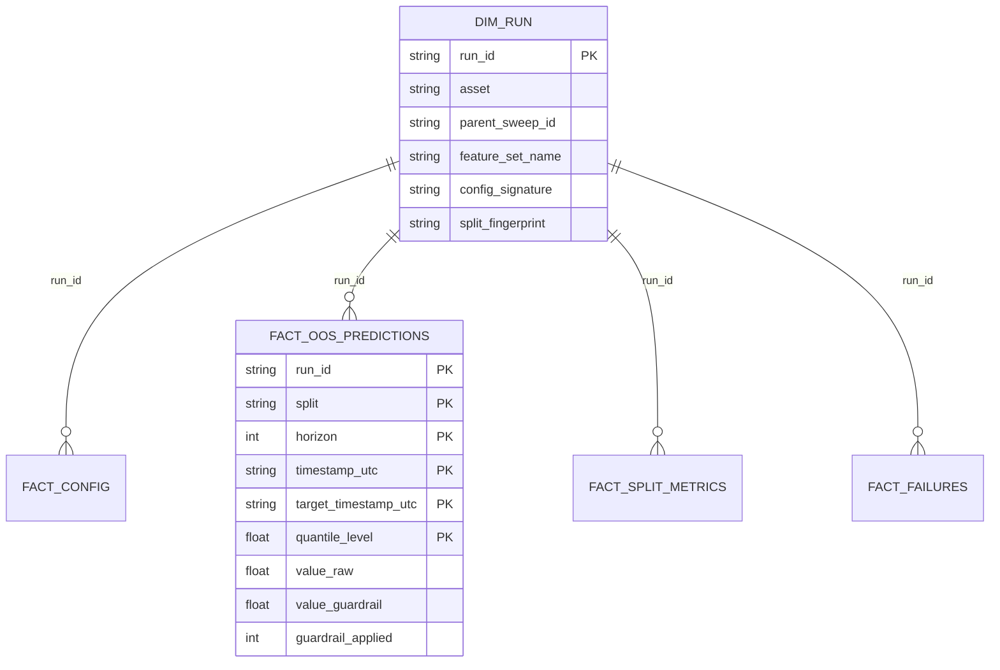

# Concept — Stage 4.1 — Silver schema por tabela

> **Escopo deste documento:** o que será feito nesta Stage, por quê, e
> decisões técnicas relevantes para entender o "porquê". O plano executável
> fica no [`technical.md`](./technical.md) correspondente.

## 1. Escopo

### Dentro do escopo

- Criar o **novo bounded context `analytics_store`** sob
  `features/analytics_store/`, com scaffold de camadas
  (`domain/value_objects`, `adapters/out/parquet/schemas`) e pacote de testes
  `tests/unit/features/analytics_store/`.
- **VOs de domínio frozen, stdlib-only** em `domain/value_objects/`:
  - `RunRecord` — metadados de uma execução (identidade pela PK lógica de
    `dim_run`: `run_id`).
  - `PredictionRow` — **uma linha LONGA** de predição out-of-sample (H-1):
    `quantile_level` é um **campo**, não colunas por quantil.
- **Contratos de schema silver POR TABELA** (um módulo `.py` por tabela) em
  `adapters/out/parquet/schemas/`, validados por `pandera`, para as **5
  tabelas consumidas pelos Steps 1–4**: `dim_run`, `fact_config`,
  `fact_oos_predictions`, `fact_split_metrics`, `fact_failures`.
- `SilverTable` — dataclass frozen espelhando `BronzeTable` da 2.1
  (`{name, schema_version, logical_pk, partition_by, update_policy, schema}`).
- `SILVER_REGISTRY: Mapping[("silver", <table>)] -> SilverTable`, espelhando
  `BRONZE_REGISTRY`.
- Estender o `.importlinter`: `analytics_store` como **container layered** em
  `hexagonal-layers`; `analytics_store.domain` em `domain-purity`;
  `analytics_store.{application,domain}` em `store-no-storage-leak`. Provar
  `inward-only` e `domain-purity` por **quebra intencional revertida**.
- Testes `pandera` de payload **VÁLIDO** (passa) e **INVÁLIDO** (levanta) para
  cada uma das 5 tabelas.

### Fora do escopo (explicitamente)

- **Tabelas gold** (métricas/estatística confirmatória) — Step 6.
- **Escrita / repositório** (port-out `AnalyticsRepository` + adapter Parquet
  append-only) — Stage 4.2.
- **`MultiHorizonPredictionPersister`**, lógica de `target_timestamp`
  (off-by-one), e a **grade densa de quantis** (raw + post-guardrail) — Stage
  4.3. Esta Stage só declara as colunas do contrato, não a lógica de
  preenchimento.
- **Reimplementar fingerprints / `run_id`** — são da Stage 1.4; aqui apenas
  **consumidos** (as colunas guardam os hashes como `string`).
- As **8 tabelas deferidas** (`inference_runs`, `inference_predictions`,
  `feature_contrib_local`, `epoch_metrics`/`fact_epoch_metrics`,
  `model_artifacts`/`fact_model_artifacts`, `bridge_run_features`,
  `split_timestamps_ref`, `fact_run_snapshot`) — registradas na lista deferida
  ([ADR 4.1.0001](../../adr/4_1_0001-analytics-store-silver-schema-per-table.md))
  e **não criadas** aqui.

### Vínculo com o roadmap

Esta Stage abre o **Step 4 — Analytics store (silver)**
([`roadmap.md`](../../roadmap.md) §Step 4 / Stage 4.1). É o contrato de dados
sobre o qual a 4.2 (repositório append-only) e a 4.3 (persister de predições)
se apoiam, e que os Steps 5–7 leem para a estatística confirmatória. Entrega o
**schema como contrato versionado**, sem ainda mover bytes para o disco —
corrige na origem o anti-padrão do repo antigo (mega-schema de 13 tabelas em um
arquivo de 772 LOC). Depende de 1.4 (identidade/fingerprints) e 2.1 (padrão
`BronzeTable`/registry a espelhar).

## 2. Objetivo da Stage

Ao final, o bounded context `analytics_store` existe com seus VOs de domínio
(puros) e cada uma das 5 tabelas silver consumidas pelos Steps 1–4 tem um
**schema `pandera` próprio em módulo separado**, com `schema_version`,
`logical_pk`, `partition_by` e `update_policy` declarados, validável contra
payloads válidos e inválidos, e protegido pelos gates de arquitetura — sem
nenhuma escrita em disco.

## 3. Contexto e premissas

### Contexto

O repo antigo concentrava 13 tabelas analíticas em um único
`analytics_store_schema.py` (772 LOC) com validação manual ad-hoc
(`validate_table_payload`, :735-772). Isso travava crescimento: alterar uma
tabela exigia reabrir o arquivo monolítico, e a representação de quantis era
**hardcoded** em colunas `quantile_p10/p50/p90 (+_post_guardrail)`
(`analytics_store_schema.py:393-399`). A Stage 2.1 já estabeleceu o padrão a
seguir: `BronzeTable` frozen + `BRONZE_REGISTRY[(layer, table)]`, com `pandera`
confinado ao adapter (`store-no-storage-leak`). Esta Stage replica esse padrão
para o silver, **decompondo por tabela** e **corrigindo a representação de
quantis** conforme a decisão humana H-1.

### Premissas

- O padrão `BronzeTable`/`BRONZE_REGISTRY` da 2.1 é estável e adequado para
  espelhar no silver (verificado em
  `shared/adapters/out/parquet/schemas/bronze_schemas.py`).
- As colunas de fingerprint (`config_signature`, `split_fingerprint`,
  `dataset_fingerprint`) são strings hex sha256 produzidas pela 1.4 — o silver
  só as armazena, nunca as recomputa.
- A grade densa de quantis (~7–9 níveis) será fixada no Step 5; nesta Stage
  nenhuma grade específica é amarrada (H-1).

### Dependências

- `1.4-identity-and-fingerprints`: `RunId`, `ConfigSignature`,
  `DatasetFingerprint`, `SplitFingerprint` (em `shared/domain/value_objects/`)
  — consumidos; nas colunas dos schemas entram como hash `string`.
- `2.1-medallion-storage-contracts`: padrão `BronzeTable` + `BRONZE_REGISTRY`
  + contrato `store-no-storage-leak` a espelhar/estender.

## 4. Contratos

### Introduzidos

- **`RunRecord`** (`value-object`, domínio, frozen, stdlib-only) — identidade
  pela PK lógica de `dim_run` (`run_id`). Carrega metadados de execução:
  `run_id`, `asset`, `parent_sweep_id`, `feature_set_name`,
  `config_signature`, `split_fingerprint`, `fold`, `seed`, `model_version`,
  `schema_version`. O mapeamento para `DataFrame` vive no adapter, **nunca** no
  domínio.

- **`PredictionRow`** (`value-object`, domínio, frozen, stdlib-only) — **uma
  linha LONGA** de predição (H-1):
  `(run_id, split, horizon, timestamp_utc, target_timestamp_utc,
  quantile_level, value_raw, value_guardrail, guardrail_applied)`. **Não fixa
  grade de quantis** — `quantile_level` é um campo (não colunas
  `p10/p50/p90`).

- **`SilverTable`** (`dataclass` frozen, adapter; espelha `BronzeTable` da
  2.1):

  ```python
  @dataclass(frozen=True)
  class SilverTable:
      name: str
      schema_version: int
      logical_pk: tuple[str, ...]
      partition_by: tuple[str, ...]
      update_policy: str            # "upsert" | "append-only"
      schema: pa.DataFrameSchema    # pandera, strict=True
  ```

- **Schemas `pandera` per-table** (`adapters/out/parquet/schemas/`,
  `strict=True`):

  | Tabela | `logical_pk` | `partition_by` | `update_policy` |
  |---|---|---|---|
  | `dim_run` | `(run_id)` | `(asset, parent_sweep_id)` | `upsert` |
  | `fact_config` | `(run_id)` | `(asset, parent_sweep_id)` | `append-only` |
  | `fact_oos_predictions` | `(run_id, split, horizon, timestamp_utc, target_timestamp_utc, quantile_level)` | `(asset, feature_set_name, year)` | `append-only` |
  | `fact_split_metrics` | `(run_id, split)` | `(asset, parent_sweep_id)` | `append-only` |
  | `fact_failures` | `(run_id, failed_at_utc, stage)` | `(asset)` | `append-only` |

- **`SILVER_REGISTRY`** — `Mapping[tuple[str, str], SilverTable]` chaveado por
  `("silver", <table>)`, com as 5 tabelas, espelhando `BRONZE_REGISTRY`.

### Consumidos

- **`RunId`**, **`ConfigSignature`**, **`DatasetFingerprint`**,
  **`SplitFingerprint`** — declarados na Stage `1.4-identity-and-fingerprints`
  (`shared/domain/value_objects/`). Aqui só tipam/originam os valores hex
  guardados nas colunas como `string`.
- Padrão **`BronzeTable`/`BRONZE_REGISTRY`** — Stage
  `2.1-medallion-storage-contracts` (a espelhar).

## 5. Invariantes e regras

- **I1 — Domínio puro:** `RunRecord`/`PredictionRow` são `frozen` e importam
  **só stdlib** (sem `pandas`/`pyarrow`/`pandera`/`pydantic`/`sqlalchemy`/
  `numpy`/`torch`). `domain-purity` reprova vazamento (provado por quebra
  intencional revertida).
- **I2 — `pandera`/`pandas` confinados ao adapter:** vivem **só** em
  `adapters/out/parquet/schemas`; `store-no-storage-leak` estendido a
  `analytics_store.{application,domain}` reprova import de
  `pandas`/`pyarrow`/`duckdb`/`pandera` fora do adapter.
- **I3 — Um módulo por tabela:** cada tabela é um arquivo `.py` separado
  (DoD: **nenhum mega-schema**; o old de 13 tabelas em 772 LOC é o anti-padrão
  a corrigir).
- **I4 — Metadados completos por tabela:** cada `SilverTable` declara
  `schema_version` (int) + `logical_pk` + `partition_by` + `update_policy`.
- **I5 — H-1 (imutável):** `fact_oos_predictions` é **LONGA/agnóstica à
  grade** — `quantile_level` entra na PK; **PROIBIDO** portar colunas
  `quantile_p10/p50/p90 (+_post_guardrail)` do old. A grade densa ~7–9 fica
  para o Step 5.
- **I6 — Política de atualização:** `dim_run` é a **única** tabela `upsert`;
  todas as facts são **`append-only`** (consistente com a política da 2.1).
- **I7 — `pandera` estrito:** `strict=True` em todos os schemas — coluna
  extra/ausente, dtype divergente ou PK violada reprovam; payload **VÁLIDO**
  passa e payload **INVÁLIDO** levanta `SchemaError` (teste obrigatório).
- **I8 — Direção inward-only:** `adapters → application → domain`;
  `analytics_store` provado como container layered no `.importlinter`.
- **I9 — Identidade via PK lógica:** a identidade dos VOs é dada pela
  `logical_pk` (igualdade por valor do dataclass frozen); a serialização para
  `DataFrame` é responsabilidade do adapter (mapper), não do domínio.
- **I10 — Fingerprints não reimplementados:** `config_signature`,
  `split_fingerprint`, `dataset_fingerprint` e `run_id` guardam os hashes da
  1.4 como `string`; nenhuma recomputação aqui.
- **I11 — `decision_idx` como contrato de schema (não de lógica):**
  `fact_oos_predictions` declara `decision_idx`, `timestamp_utc` e
  `target_timestamp_utc` como colunas (a âncora vive no schema —
  *mechanical > procedural*, ADR-0003 do old), mas a lógica de
  preenchimento/off-by-one é da Stage 4.3.

## 6. Casos de erro e exceções

- **C1 — Coluna ausente em payload obrigatório:** `pandera` (`strict=True`)
  levanta `SchemaError`. (Porta o teste "missing required" do old.)
- **C2 — `schema_version` divergente do contrato:** o valor não bate com o
  `schema_version` declarado na `SilverTable` → reprova. (Porta "schema_version
  mismatch".)
- **C3 — Dtype divergente:** ex. `timestamp_utc` não-string ou métrica
  não-float onde o schema exige → `SchemaError` (`coerce=False`).
- **C4 — Coluna extra:** com `strict=True`, coluna não declarada reprova
  (evita drift silencioso).
- **C5 — PK duplicada ou nula:** linhas com `logical_pk` repetida ou valor
  nulo em coluna de PK reprovam. (Porta "duplicate PK" e "null PK".)
- **C6 — Par `(layer, table)` fora do `SILVER_REGISTRY`:** lookup com chave
  inexistente é erro de aplicação (`KeyError` controlado), espelhando o
  comportamento do `BRONZE_REGISTRY` (concept 2.1 C2).

## 7. Decisões técnicas relevantes

> Toda decisão tem fonte rastreável. Decisões com alternativa real descartada
> viram ADR em [`../../adr/`](../../adr/).

### D1 — Decompor o mega-schema em módulo-por-tabela + registry

- **O quê:** um módulo `.py` por tabela (`dim_run`, `fact_config`, …) +
  `silver_table.py` (dataclass frozen) + `silver_registry.py` com
  `SILVER_REGISTRY[("silver", <table>)]`, espelhando
  `BronzeTable`/`BRONZE_REGISTRY` da 2.1.
- **Por quê:** o DoD do roadmap proíbe mega-schema; o old empacotava 13
  tabelas em 772 LOC. Espelhar o padrão já provado da 2.1 reduz risco e mantém
  consistência entre BCs; o registry dá despacho uniforme ao repositório da
  4.2 sem o BC conhecer cada tabela.
- **Fonte:** Roadmap §Stage 4.1 (DoD "nenhum mega-schema");
  `bronze_schemas.py`; old `analytics_store_schema.py` (:143-152, :674-691).
- **ADR:** [`4_1_0001-analytics-store-silver-schema-per-table.md`](../../adr/4_1_0001-analytics-store-silver-schema-per-table.md)

### D2 — `fact_oos_predictions` em formato LONGO/agnóstico à grade (H-1)

- **O quê:** linhas por `quantile_level` (na PK), com `value_raw`,
  `value_guardrail`, `guardrail_applied`; **proibido** colunas
  `quantile_p10/p50/p90 (+_post_guardrail)`. PK =
  `(run_id, split, horizon, timestamp_utc, target_timestamp_utc, quantile_level)`.
- **Por quê:** decisão humana **H-1 já FECHADA** no ledger (imutável). Long
  mantém a grade densa ~7–9 decidível no Step 5 **sem migração de schema**; o
  old fixava 3 colunas hardcoded (anti-padrão que trava crescimento). Long vs
  JSON-array: long é query-ável/particionável e validável célula-a-célula no
  `pandera`; JSON-array exigiria desserialização para validar.
- **Fonte:** Ledger H-1 (linha 27) e §B 4.1 (linha 42); old
  `analytics_store_schema.py:393-399`.
- **ADR:** [`4_1_0002-fact-oos-predictions-long-quantile-format.md`](../../adr/4_1_0002-fact-oos-predictions-long-quantile-format.md)

### D3 — Escopo de tabelas no Step 4: definir 5, deferir 8

- **O quê:** definir só `dim_run`, `fact_config`, `fact_oos_predictions`,
  `fact_split_metrics`, `fact_failures`; deferir as 8 restantes para Steps 5/7.
- **Por quê:** decisão pré-declarada §B 4.1 do ledger. YAGNI: as 8 deferidas
  servem inferência/contrib/epoch (Steps 5/7), fora do escopo confirmatório de
  Steps 1–4; criá-las agora seria schema sem consumidor. A lista deferida fica
  registrada no ADR 4.1.0001 para não perder contexto.
- **Fonte:** Ledger §B 4.1 (linha 42); Roadmap §Stage 4.1 (`non_goals`).
- **ADR:** registrado em [`4_1_0001`](../../adr/4_1_0001-analytics-store-silver-schema-per-table.md) (mesma decisão de decomposição/escopo).

### D4 — `analytics_store` como container layered + extensão dos contratos de pureza

- **O quê:** adicionar `financial_forecasting.features.analytics_store` aos
  containers de `hexagonal-layers`; `.domain` a `domain-purity`;
  `.application` e `.domain` a `store-no-storage-leak`. Provar por quebra
  intencional revertida.
- **Por quê:** mesma postura já aplicada a `market_data` e
  `feature_engineering` (verificado no `.importlinter`). Sem isto, `pandera` no
  domínio passaria silenciosamente — o exato apodrecimento do repo antigo
  (`multi_horizon_prediction_persister.py` importava `pandas` em arquivo de
  domínio). Custo baixo, gate forte. **Não precisa ADR próprio:** é aplicação
  direta dos ADRs 1.3.0001/2.1.0002 já vigentes — registrar como `[decision]`
  no `technical.md` §7.
- **Fonte:** `.importlinter` (contratos 1/2/6); ADR 1.3.0001; ADR 2.1.0002;
  old `multi_horizon_prediction_persister.py:6`.

### D5 — `decision_idx`/`target_timestamp_utc` como colunas do schema, sem a lógica

- **O quê:** incluir `decision_idx`, `timestamp_utc` e `target_timestamp_utc`
  como colunas de `fact_oos_predictions`, **sem** implementar a lógica de
  `target_timestamp` (off-by-one) — isso é da 4.3.
- **Por quê:** ADR-0003 do old (*mechanical > procedural*): a âncora vive no
  schema como contrato; o schema 4.1 declara a coluna, o persister 4.3 a
  preenche. Sem ADR próprio (deriva do ADR-0003 portado) — registrar como
  `[decision]` no `technical.md` §7.
- **Fonte:** old `ADR-0003-multi-horizon-prediction-persister.md`; Ledger §B
  4.3 (linha 44).

## 8. Integrações

### Internas (com outras Stages/módulos)

- `shared.domain.value_objects` (1.4): origem dos tipos
  `RunId`/`ConfigSignature`/`DatasetFingerprint`/`SplitFingerprint` consumidos.
- `shared.adapters.out.parquet.schemas` (2.1): padrão `BronzeTable`/registry
  espelhado (sem dependência de import — paralelismo de design, não
  acoplamento).
- Stage 4.2 (`AnalyticsRepository`): consumirá `SILVER_REGISTRY` para despacho.
- Stage 4.3 (`MultiHorizonPredictionPersister`): produzirá `PredictionRow` e
  preencherá `target_timestamp`/`decision_idx`.

### Externas

- Nenhuma integração externa nesta Stage (sem rede, sem disco, sem banco).

## 9. Modelo de dados



> `quantile_level` na PK é a materialização de H-1 (formato longo). Nenhuma
> coluna `quantile_p*`.

## 10. Riscos e mitigações

| Risco | Probabilidade | Impacto | Mitigação |
|---|---|---|---|
| Vazamento de `pandera`/`pandas` para o domínio (apodrecimento do old) | M | A | `domain-purity` + `store-no-storage-leak` estendidos; quebra intencional revertida prova o gate (Task de import-linter) |
| Reintroduzir colunas `quantile_p*` por inércia do old | M | A | I5 explícito + ADR 4.1.0002 + teste que prova ausência das colunas e presença de `quantile_level` na PK |
| Dtype de `quantile_level` ambíguo (float vs string) | B | M | Decidir no `technical.md` (recomendado `float64` para níveis numéricos), `coerce=False`, teste de dtype |
| Drift entre `.importlinter` e LAYOUT.md | B | M | Espelhar exatamente o padrão dos containers existentes; `lint-imports` no `make check`/CI |

## 11. Critérios de aceitação

- [ ] **A1** — BC `analytics_store` existe com scaffold de camadas
  (`domain/value_objects`, `adapters/out/parquet/schemas`) e pacote de testes;
  estrutura bate com LAYOUT.md.
- [ ] **A2** — `RunRecord` e `PredictionRow` são `frozen`, stdlib-only,
  `mypy --strict` limpo; teste prova `FrozenInstanceError` e igualdade por
  valor.
- [ ] **A3** — `PredictionRow` tem `quantile_level` como campo (não colunas por
  quantil); teste prova que a grade **não** está fixada.
- [ ] **A4** — As 5 tabelas existem como **módulos separados** (nenhum
  mega-schema), cada uma com `SilverTable` carregando `schema_version` +
  `logical_pk` + `partition_by` + `update_policy` conforme a tabela do §4.
- [ ] **A5** — `fact_oos_predictions` **não** tem colunas
  `quantile_p10/p50/p90 (+_post_guardrail)`; `quantile_level` está na
  `logical_pk`; partição `(asset, feature_set_name, year)`; `append-only`.
- [ ] **A6** — `dim_run` é `upsert`; demais facts `append-only`.
- [ ] **A7** — `SILVER_REGISTRY` chaveado por `("silver", <table>)` contém
  exatamente as 5 tabelas.
- [ ] **A8** — Para cada uma das 5 tabelas: payload **VÁLIDO** passa e payloads
  **INVÁLIDOS** (missing required, dtype errado, coluna extra, PK
  duplicada/nula, `schema_version` mismatch) levantam erro `pandera`.
- [ ] **A9** — `.importlinter` estendido: `analytics_store` em
  `hexagonal-layers`; `.domain` em `domain-purity`; `.{application,domain}` em
  `store-no-storage-leak`. `lint-imports` verde; quebra intencional (`import
  pandas` no domínio) reprova e é revertida.
- [ ] **A10** — `make check` (ruff + mypy + lint-imports) verde; cobertura do
  BC `analytics_store` ≥ 90%.

## 12. Checklist de validação interna

- [x] Todos os contratos introduzidos têm assinatura definida? (§4)
- [x] Toda decisão em §7 tem fonte rastreável? (§7 D1–D5)
- [x] Toda integração externa tem contrato definido? (§8 — não há externa)
- [x] Decisões com alternativa real descartada têm ADR escrito? (D1→4.1.0001,
  D2→4.1.0002; D4/D5 derivam de ADRs vigentes, registradas como `[decision]`)
- [x] Dependências de Stages anteriores estão satisfeitas? (1.4 e 2.1 `done`)
- [x] Stage cabe em ~3–8 Tasks? (12 Tasks no `technical.md` — recorte fino de
  scaffold + 1 módulo/tabela; cada uma trivial, build verde a cada commit)
- [x] Riscos críticos têm mitigação plausível? (§10)
- [x] H-1 (long) e lista das 8 tabelas deferidas estão registradas? (I5, D2,
  D3, ADR 4.1.0001/4.1.0002)

## 13. Questões em aberto

- Nenhuma questão crítica em aberto. Detalhes de dtype por coluna (ex.
  `quantile_level` `float64` vs `string`; `guardrail_applied` `int64` vs `bool`)
  são fixados no `technical.md` §2, dentro do contrato deste concept.

## 14. Referências

- [`../../overview.md`](../../overview.md) — §3 escopo, §7 abordagem, §11 ADRs
  de fundação.
- [`../../roadmap.md`](../../roadmap.md) — Stage 4.1 (e 4.2/4.3 vizinhas).
- [`../../autonomous-run-decision-ledger.md`](../../autonomous-run-decision-ledger.md)
  — H-1 (quantis long) e §B 4.1 (5 tabelas, 8 deferidas).
- ADRs desta Stage:
  [`4_1_0001`](../../adr/4_1_0001-analytics-store-silver-schema-per-table.md),
  [`4_1_0002`](../../adr/4_1_0002-fact-oos-predictions-long-quantile-format.md).
- Padrão espelhado: `shared/adapters/out/parquet/schemas/bronze_schemas.py`
  (Stage 2.1); ADR 2.1.0002, ADR 1.3.0001.
- Repo antigo de referência:
  `financial-time-series-forecasting/src/infrastructure/schemas/analytics_store_schema.py`.
