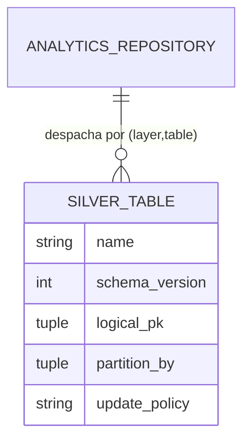

# Concept — Stage 4.2 — Repositório silver

> **Escopo deste documento:** o que será feito nesta Stage, por quê, e
> decisões técnicas relevantes para entender o "porquê". O plano executável
> fica no [`technical.md`](./technical.md) correspondente.

## 1. Escopo

### Dentro do escopo

- **Port-out `AnalyticsRepository`** (`Protocol` estrutural, stdlib-only) em
  `features/analytics_store/application/ports/out/analytics_repository.py`:
  `write(*, layer, table, rows, allow_upsert=False) -> None` e
  `read(*, layer, table, filters=None) -> Sequence[Row]`, com
  `Row = Mapping[str, object]`. Semântica (append-only / upsert consciente /
  partition pruning / round-trip do sentinel) documentada no docstring,
  espelhando a forma já provada do `MedallionStore` (2.1).
- **Adapter `ParquetAnalyticsRepository`** (`features/analytics_store/adapters/out/parquet/`)
  que: (a) **despacha por `SILVER_REGISTRY[("silver", <table>)]`** da 4.1; (b)
  **valida `pandera` no `write`** (`SilverTable.schema.validate`, `strict=True`,
  `coerce=False`) ANTES de tocar o Parquet; (c) **particiona Hive pelas colunas
  literais** de `SilverTable.partition_by` (1..3 níveis), **sem derivar âncora
  temporal** como o bronze; (d) aplica **append-only** nos 4 fatos e **upsert**
  via `update_policy=="upsert"` (dim_run) ou flag explícita `allow_upsert=True`.
- **Mapper `RunRecord -> row` de `dim_run`** que injeta `created_at_utc` no
  write-time via **`Clock` injetado** (resolve OBS-1: `created_at_utc` é
  `nullable=False` no schema 4.1 mas não existe no VO `RunRecord`).
- **Leitura com partition pruning** (DuckDB) por colunas de partição vindas de
  `filters` (ao menos `asset`; opcional `parent_sweep_id`/`feature_set_name`/`year`),
  projetando as colunas do schema (não `SELECT *`) e fazendo **round-trip do
  sentinel `__none__` → `None`** (preservação de `parent_sweep_id`).
- **FAKE in-memory `FakeAnalyticsRepository`** + **CONTRACT TEST parametrizado**
  `[fake, real]` + **integration test particionado real** (lê Parquet do disco,
  confere layout Hive e políticas reais).
- **ADRs `4_2_0001`** (forma do port genérico + repo Parquet dedicado vs reuso
  do `MedallionStore`) e **`4_2_0002`** (`created_at_utc` via `Clock` injetado).
- **Wiring no `composition_root`**: instanciar
  `ParquetAnalyticsRepository(data_root=cfg.data_root, clock=SystemClock())` e
  expor em `ApplicationDependencies`.

### Fora do escopo (explicitamente)

- **Tabelas gold** (métricas/estatística confirmatória) e **DuckDB de consulta
  gold** — Step 6.
- **`MultiHorizonPredictionPersister`**, dono do `target_timestamp`,
  `QuantileForecast` e a grade densa de quantis — Stage 4.3. Esta Stage **só
  persiste linhas genéricas por tabela** (não conhece a semântica de horizonte).
- **As 8 tabelas deferidas** (`inference_*`, `feature_contrib_local`,
  `epoch_metrics`, `model_artifacts`, `bridge_run_features`,
  `split_timestamps_ref`, `fact_run_snapshot`) — registradas em
  [ADR 4.1.0001](../../adr/4_1_0001-analytics-store-silver-schema-per-table.md);
  não tocadas aqui.
- **Helpers de hash / `derive_run_status`** do old — pertencem às Stages 1.4 / 4.3.

### Vínculo com o roadmap

Esta Stage é o **músculo de escrita/leitura** do Step 4 sobre os contratos de
schema da 4.1 ([`roadmap.md`](../../roadmap.md) §Step 4 / Stage 4.2). A 4.1
entregou o schema como contrato versionado **sem mover bytes**; a 4.2 entrega o
repositório que move os bytes para o disco em Parquet particionado, append-only,
com upsert consciente — fechando o anti-padrão do old (13 métodos por tabela num
`AnalyticsRunRepository` ABC sem leitura nem round-trip). A 4.3
(`MultiHorizonPredictionPersister`) consumirá este port para persistir predições.

## 2. Objetivo da Stage

Ao final, o bounded context `analytics_store` tem um **port `AnalyticsRepository`
genérico (write/read por `(layer, table)`)** com um **adapter Parquet dedicado**
que grava append-only nos 4 fatos (upsert só em `dim_run` por política ou via
flag explícita), particiona em Hive pelas colunas literais de cada tabela,
valida `pandera` no write e lê de volta com partition pruning preservando
`parent_sweep_id` no round-trip — provado por um contract test único que
fake e adapter real passam idênticos, mais um integration test que confere o
layout Hive em disco.

## 3. Contexto e premissas

### Contexto

A 4.1 fechou o `SILVER_REGISTRY[("silver", <table>)] -> SilverTable` com 5
tabelas, cada uma carregando `logical_pk`, `partition_by`, `update_policy`,
`schema_version` e um `DataFrameSchema` `pandera`. A 2.1 já provou em produção
o padrão `MedallionStore` (port `Protocol` + `ParquetMedallionStore` com
`_safe_partition`/`_pk_tuples`/dedup-overwrite/DuckDB-read + contract test
parametrizado `[fake, real]`). Esta Stage replica **a lógica** desse motor,
generalizando o despacho via registry e divergindo em dois pontos concretos:

1. **Partição literal vs derivada.** O `ParquetMedallionStore` deriva `year` de
   `meta.year_anchor` e particiona **só** por `asset/year`
   (`parquet_medallion_store.py:148-160`). O silver particiona por **colunas já
   presentes no payload** (`SilverTable` **não tem** `asset_col`/`year_anchor`),
   em **1..3 níveis** distintos por tabela: `(asset,)` para `fact_failures`,
   `(asset, parent_sweep_id)` para `dim_run`/`fact_config`/`fact_split_metrics`,
   `(asset, feature_set_name, year)` para `fact_oos_predictions` (onde `year` é
   **coluna literal**, não derivada de âncora temporal).
2. **`created_at_utc` write-time.** O schema `dim_run` exige `created_at_utc`
   (`string`, `nullable=False`), mas o VO `RunRecord` (4.1) **não o tem**
   (OBS-1, carry da 4.1). Sem preenchê-lo no write-time a validação `pandera`
   reprova `dim_run`.

O old tinha um repositório Parquet **dedicado** (`ParquetAnalyticsRunRepository`,
13 métodos por tabela, sem leitura/round-trip) — esta Stage replica o motor de
dedup/overwrite (`_write_with_overwrite_policy`, `_append_rows_partitioned`,
`_safe_partition`, `_pk_tuples`) **generalizando** para um `write/read` único por
registry e **adicionando** leitura com pruning e round-trip `__none__` → `None`.

### Premissas

- O `SILVER_REGISTRY` e os 5 schemas `pandera` da 4.1 são estáveis e suficientes
  para o despacho por `(layer, table)` (verificado: `silver_registry.py`,
  `dim_run_schema.py`, `fact_oos_predictions_schema.py`).
- `Clock`/`SystemClock` (1.5) existem e bastam para o `created_at_utc`
  write-time (verificado: `shared/application/ports/out/clock.py`,
  `shared/infrastructure/clock/system_clock.py`).
- `DuplicateKeyError(ApplicationError)` e `ApplicationError` (2.1) existem e são
  reusáveis (verificado: `shared/domain/exceptions/base.py`).
- `year` em `fact_oos_predictions` chega como coluna `int64` do payload (o
  persister 4.3 a preencherá); esta Stage só a usa como nível de partição literal.

### Dependências

- `4.1-silver-schema-per-table`: `SILVER_REGISTRY`, `SilverTable`
  (`logical_pk`/`partition_by`/`update_policy`/`schema`/`schema_version`), os 5
  schemas `pandera`, o VO `RunRecord`. Consumidos diretamente.
- `2.1-medallion-storage-contracts` (referência de **forma**, não acoplamento):
  `MedallionStore` (Protocol), `ParquetMedallionStore` (motor de dedup/read),
  fake + contract test parametrizado.
- `1.5-config-and-tracking`: `Clock`/`SystemClock`; `Settings.data_root` para o
  wiring.
- `shared/domain/exceptions/base.py`: `ApplicationError`, `DuplicateKeyError`.

## 4. Contratos

### Introduzidos

- **`AnalyticsRepository`** (`port-out`, `Protocol` estrutural, stdlib-only) —
  `features/analytics_store/application/ports/out/analytics_repository.py`:

  ```python
  from collections.abc import Mapping, Sequence
  from typing import Protocol

  Row = Mapping[str, object]

  class AnalyticsRepository(Protocol):
      def write(
          self,
          *,
          layer: str,
          table: str,
          rows: Sequence[Row],
          allow_upsert: bool = False,
      ) -> None: ...

      def read(
          self,
          *,
          layer: str,
          table: str,
          filters: Mapping[str, object] | None = None,
      ) -> Sequence[Row]: ...
  ```

  Semântica do contrato (docstring): partição derivada do schema (não do
  chamador); append-only nos fatos com colisão de PK lógica →
  `DuplicateKeyError` sem flag; upsert (substitui linhas colididas) quando
  `SilverTable.update_policy == "upsert"` (dim_run) **ou** `allow_upsert=True`
  (reprocessamento consciente); `pandera` validado no write; `read` com
  partition pruning; round-trip `__none__` → `None` para `parent_sweep_id`;
  `(layer, table)` fora do registry → `ApplicationError`; `read` de dataset/asset
  inexistente → sequência vazia.

- **`FakeAnalyticsRepository`** (test double in-memory, `tests/fakes/...`) —
  mesma semântica observável que o adapter real, stdlib-only (sem
  pandas/pandera), com um registry-leve espelhando `logical_pk`/`partition_by`/
  `update_policy` das 5 tabelas e aceitando `Clock` injetado.

### Consumidos

- **`SILVER_REGISTRY`** / **`SilverTable`** — Stage `4.1-silver-schema-per-table`
  (`adapters/out/parquet/schemas/silver_registry.py`, `silver_table.py`). O
  adapter despacha por `SILVER_REGISTRY[("silver", <table>)]`; par fora do
  registry → `ApplicationError` (o despacho **não** engole o `KeyError`).
  As 5 tabelas e suas chaves:

  | Tabela | `logical_pk` | `partition_by` | `update_policy` |
  |---|---|---|---|
  | `dim_run` | `(run_id,)` | `(asset, parent_sweep_id)` | `upsert` |
  | `fact_config` | `(run_id,)` | `(asset, parent_sweep_id)` | `append-only` |
  | `fact_oos_predictions` | `(run_id, split, horizon, timestamp_utc, target_timestamp_utc, quantile_level)` | `(asset, feature_set_name, year)` | `append-only` |
  | `fact_split_metrics` | `(run_id, split)` | `(asset, parent_sweep_id)` | `append-only` |
  | `fact_failures` | `(run_id, failed_at_utc, stage)` | `(asset,)` | `append-only` |

- **`RunRecord`** (VO 4.1) — mapeado para uma linha de `dim_run`; o mapper
  preenche `created_at_utc` no write-time (OBS-1). `RunRecord` **não** carrega
  `created_at_utc`.
- **`Clock`** (port-out, `shared/application/ports/out/clock.py`) +
  **`SystemClock`** (`shared/infrastructure/clock/system_clock.py`) —
  `now() -> datetime` UTC, injetado no adapter para o `created_at_utc`.
- **`DuplicateKeyError(ApplicationError)`** + **`ApplicationError`**
  (`shared/domain/exceptions/base.py`) — reusados; a mensagem diagnóstica cita
  `pk_columns`/`collisions`/`path`, como no `ParquetMedallionStore`.
- **`MedallionStore` / `ParquetMedallionStore`** (2.1) — referência de forma
  (Protocol, helpers, dedup, read DuckDB, contract test `[fake, real]`); **não
  acoplados** (sem import; paralelismo de design).

## 5. Invariantes e regras

- **I1 — Pureza de camada.** `pandas`/`pyarrow`/`duckdb`/`pandera` ficam
  **confinados ao adapter**; o port e o fake são stdlib-only; nenhum `DataFrame`
  cruza a fronteira (`Row = Mapping[str, object]`). Gates
  `store-no-storage-leak` + `domain-purity` + `hexagonal-layers` (já estendidos a
  `analytics_store` na 4.1) verdes.
- **I2 — Partição derivada do schema.** O adapter particiona pelas colunas de
  `SilverTable.partition_by` do registry, **nunca** dos argumentos do chamador —
  são **colunas literais do payload** (`asset`/`parent_sweep_id`/
  `feature_set_name`/`year`), sem derivar ano de âncora temporal (divergência
  chave vs bronze). Suporta 1..3 níveis.
- **I3 — Append-only protege os 4 fatos.** Colisão de PK lógica na partição alvo,
  sem flag, levanta `DuplicateKeyError`. Upsert (substituir as linhas colididas)
  só com `allow_upsert=True` **ou** `SilverTable.update_policy == "upsert"`.
  `dim_run` é a **única** tabela `upsert`.
- **I4 — `pandera` no write antes do disco.** `SilverTable.schema.validate`
  (`strict=True`, `coerce=False`) roda **antes** de tocar Parquet; payload fora
  de schema/dtype é rejeitado (fecha OBS-2 da 4.1: `unique` do `pandera` não
  substitui a dedup do write — são checagens distintas).
- **I5 — `created_at_utc` write-time via `Clock` (OBS-1).** O mapper
  `RunRecord -> row` de `dim_run` preenche `created_at_utc` (ISO UTC) com
  `clock.now()`; **nunca** `datetime.now()` hardcoded no adapter nem no domínio.
  Determinismo testável via `FakeClock`.
- **I6 — `parent_sweep_id` preservado no round-trip.** Valor `None` vira o
  sentinel de partição `__none__` no path do disco e é **re-traduzido para
  `None`** na leitura (o old não tinha leitura; esta Stage cobre o round-trip
  `__none__` → `None`).
- **I7 — Escrita em batch-por-partição.** As `rows` são bucketizadas por path de
  partição antes de gravar; nunca linha-a-linha (espelha
  `_append_rows_partitioned` do old).
- **I8 — `read` com partition pruning.** `filters` empurra `WHERE` para as
  colunas de partição (ao menos `asset`; opcional `parent_sweep_id`/
  `feature_set_name`/`year`), varrendo só as partições casadas; projeta as
  colunas do schema (não `SELECT *`). `(layer, table)` inexistente ou `asset` sem
  dados → sequência **vazia**, não erro.
- **I9 — Port `Protocol`, teste com fake.** O port é `Protocol` estrutural (sem
  herança); a aplicação/contrato testam com **fake** (não mock); o adapter real é
  validado por **contract test parametrizado `[fake, real]`** (mesma postura
  ADR 0.0.0021 / skills `repository-pattern` + `pytest-with-fakes`).
- **I10 — Injeção e instanciação única.** `data_root` e `Clock` são **injetados**
  no adapter; recursos embarcados (se houver) via `importlib.resources` (não
  `Path(__file__)`); instanciação concreta só no `composition_root` (I9 do CR).
- **I11 — Gates verdes.** Cobertura ≥ 90%, `mypy --strict`, `ruff`,
  `import-linter`, `check_layout.py` verdes (gate de CI).

## 6. Casos de erro e exceções

- **C1 — Colisão de PK lógica em fato `append-only` sem flag:**
  `DuplicateKeyError` (`ApplicationError`), mensagem com
  `pk_columns`/`collisions`/`path`. (Porta o teste "colisão-sem-flag" do old,
  `:142-150`.)
- **C2 — Par `(layer, table)` fora do `SILVER_REGISTRY`:** `ApplicationError`
  (o despacho não engole o `KeyError` cru; espelha `MedallionStore._table`).
- **C3 — Payload fora de schema/dtype (`pandera`):** coluna ausente/extra, dtype
  divergente ou PK violada → erro `pandera` (`SchemaError`) **antes** do disco
  (I4).
- **C4 — `read` de `(layer, table)` não gravado ou `asset` sem dados:** sequência
  **vazia**, não erro (I8).
- **C5 — Upsert em fato com `allow_upsert=True`:** substitui **só** as linhas
  colididas na partição alvo (não apaga as demais); o `dim_run` faz isso por
  política mesmo sem a flag.
- **C6 — `parent_sweep_id` ausente (`None`):** mapeado para `__none__` no write e
  reconstituído como `None` no read (I6) — não é erro.

## 7. Decisões técnicas relevantes

> Toda decisão tem fonte rastreável. Decisões com alternativa real descartada
> viram ADR em [`../../adr/`](../../adr/).

### D1 — Port genérico `write/read` por `(layer, table)` vs métodos por tabela do old

- **O quê:** port `AnalyticsRepository` com `write(*, layer, table, rows,
  allow_upsert=False)` + `read(*, layer, table, filters)`, despachando via
  `SILVER_REGISTRY`; `update_policy` decide append vs upsert, com
  `allow_upsert=True` para forçar upsert consciente. Descartar os 13 métodos por
  tabela do old (`upsert_dim_run`/`append_fact_*`).
- **Por quê:** espelha o `MedallionStore` (2.1), já provado em produção + contract
  test; evita explosão de métodos (cada tabela nova mudaria o port); alinha ao
  non_goal "persiste linhas genéricas por tabela"; o `SILVER_REGISTRY` da 4.1 já
  é a seam de despacho. Simples-e-trocável.
- **Fonte:** ADR 2.1.0002 (mesma escolha Protocol genérico vs ABC por tabela);
  `silver_registry.py` (4.1); old `interfaces/analytics_run_repository.py:11`
  (ABC, 13 métodos — descartado); Roadmap §Stage 4.2 (`non_goals`).
- **ADR:** [`4_2_0001-analytics-repository-port-shape-and-dedicated-parquet.md`](../../adr/4_2_0001-analytics-repository-port-shape-and-dedicated-parquet.md)

### D2 — Repo Parquet **dedicado** vs reuso do `ParquetMedallionStore` por baixo

- **O quê:** adapter `ParquetAnalyticsRepository` **dedicado**, espelhando os
  helpers do `ParquetMedallionStore` (`_safe_partition`/`_pk_tuples`/
  dedup-overwrite/DuckDB-read) mas com partição por **colunas literais** de
  `SilverTable.partition_by` (1..3 níveis).
- **Por quê:** divergência concreta verificada — o `ParquetMedallionStore` deriva
  `year` de `meta.year_anchor` e particiona **só** por `asset/year`
  (`parquet_medallion_store.py:148-160`); o `SilverTable` **não tem**
  `asset_col`/`year_anchor` e particiona por colunas literais em 1..3 níveis
  (`(asset,)`, `(asset, parent_sweep_id)`, `(asset, feature_set_name, year)`).
  Reusar exigiria refatorar o store do bronze e **acoplar silver↔bronze**. O
  motor de dedup tem ~40 linhas, já testado, copiável; desacopla a evolução do
  silver. O old também era dedicado.
- **Fonte:** `parquet_medallion_store.py:148-160` (year derivado de âncora);
  `silver_table.py:9-12` ("não há `asset_col`/`year_anchor`"); old
  `parquet_analytics_run_repository.py:103-168`.
- **ADR:** [`4_2_0001-analytics-repository-port-shape-and-dedicated-parquet.md`](../../adr/4_2_0001-analytics-repository-port-shape-and-dedicated-parquet.md)
  (mesma decisão de forma do port + adapter dedicado).

### D3 — `created_at_utc` de `dim_run` (OBS-1) via `Clock` injetado

- **O quê:** preencher `created_at_utc` no mapper `RunRecord -> row` do adapter
  usando o `Clock` JÁ EXISTENTE (port `clock.py` + `SystemClock`), **injetado
  via construtor**; em teste, `FakeClock` determinístico. Nunca `datetime.now()`
  hardcoded.
- **Por quê:** `RunRecord` (VO 4.1) não tem `created_at_utc` mas o schema
  `dim_run` exige (`nullable=False`); sem injeção a validação `pandera` reprova.
  `Clock`/`SystemClock` já existem (1.5) — zero infra nova; determinismo
  testável; mantém o domínio puro (timestamp é write-time concern do adapter,
  não do VO).
- **Fonte:** `dim_run_schema.py` (coluna `created_at_utc` `nullable=False`);
  `run_record.py` (VO sem `created_at_utc`); `clock.py`; `system_clock.py`;
  findings carregados da 4.1 (OBS-1).
- **ADR:** [`4_2_0002-created-at-utc-via-injected-clock.md`](../../adr/4_2_0002-created-at-utc-via-injected-clock.md)

### D4 — Flag `allow_upsert` + reuso de `DuplicateKeyError` (sem ADR isolado)

- **O quê:** flag `allow_upsert: bool = False` no `write` (semântica =
  reprocessamento consciente). Reusar `DuplicateKeyError(ApplicationError)` de
  `shared/domain/exceptions/base.py` com mensagem diagnóstica
  (`pk_columns`/`collisions`/`path`), igual ao `ParquetMedallionStore`. `dim_run`
  faz upsert por `update_policy`, independente da flag.
- **Por quê:** o DoD pede "upsert só com flag explícita"; `allow_upsert` é mais
  intencional que `overwrite` (sinaliza reprocessamento, não sobrescrita cega).
  Reusar a exceção/mensagem do store mantém consistência e não introduz tipo
  novo. Decisão de baixo risco — registrar como `[decision]` no `technical.md`
  §7, sem ADR isolado.
- **Fonte:** Roadmap §Stage 4.2 (DoD "upsert só com flag explícita");
  Ledger §B 2.1 (append-only como princípio do medalhão, herdado); `base.py`
  (`DuplicateKeyError`); `parquet_medallion_store.py:183-188`.

### D5 — `read` adiciona pruning + round-trip `__none__` → `None` (o old não tinha)

- **O quê:** a leitura (ausente no old) filtra por partição com pruning (DuckDB,
  `WHERE` nas colunas de `partition_by` vindas de `filters`), projeta as colunas
  do schema (não `SELECT *`) e reconverte o sentinel `__none__` de
  `parent_sweep_id` para `None`. Sessão DuckDB `TimeZone='UTC'`.
- **Por quê:** o DoD exige "leitura filtra por cohort/asset" e "`parent_sweep_id`
  preservado"; o old não lia. Espelhar o `read` do `ParquetMedallionStore`
  (pruning + projeção do schema + `None if pd.isna`) garante paridade fake↔real
  e fidelidade de schema. Sem ADR — aplicação direta do padrão 2.1; registrar
  como `[decision]` no `technical.md` §7.
- **Fonte:** Roadmap §Stage 4.2 (DoD); `parquet_medallion_store.py:200-262`
  (read com pruning/projeção); old sem `read`.

## 8. Integrações

### Internas (com outras Stages/módulos)

- `analytics_store.adapters.out.parquet.schemas` (4.1): `SILVER_REGISTRY` +
  `SilverTable` consumidos pelo adapter para despacho/partição/validação.
- `analytics_store.domain.value_objects` (4.1): `RunRecord` mapeado para
  `dim_run` (o mapper é write-time concern do adapter).
- `shared.application.ports.out.clock` + `shared.infrastructure.clock` (1.5):
  `Clock`/`SystemClock` injetados.
- `shared.domain.exceptions.base` (2.1): `ApplicationError`/`DuplicateKeyError`
  reusados.
- `composition_root` (1.5): instancia o adapter real e o expõe em
  `ApplicationDependencies`.
- Stage 4.3 (`MultiHorizonPredictionPersister`/`PersistPredictions`): consumirá
  este port para persistir `fact_oos_predictions`.

### Externas

- Nenhuma integração externa (sem rede/banco). O único efeito colateral é I/O em
  disco local (Parquet sob `data_root`), confinado ao adapter.

## 9. Modelo de dados

Layout Hive em disco (derivado de `SilverTable.partition_by`, colunas literais):

```text
<data_root>/silver/dim_run/asset=<asset>/parent_sweep_id=<sweep|__none__>/dim_run.parquet
<data_root>/silver/fact_config/asset=<asset>/parent_sweep_id=<sweep|__none__>/fact_config.parquet
<data_root>/silver/fact_oos_predictions/asset=<asset>/feature_set_name=<fs>/year=<yyyy>/fact_oos_predictions.parquet
<data_root>/silver/fact_split_metrics/asset=<asset>/parent_sweep_id=<sweep|__none__>/fact_split_metrics.parquet
<data_root>/silver/fact_failures/asset=<asset>/fact_failures.parquet
```



> A partição é **lida** de `SilverTable.partition_by` (registry), nunca dos
> argumentos do chamador (I2). `year` em `fact_oos_predictions` é coluna literal
> do payload, não derivada de âncora.

## 10. Riscos e mitigações

| Risco | Probabilidade | Impacto | Mitigação |
|---|---|---|---|
| Reusar o motor do bronze e acoplar silver↔bronze (year derivado) | M | A | D2/ADR 4.2.0001: repo dedicado, partição por colunas literais; sem import de `ParquetMedallionStore` |
| Validação `pandera` de `dim_run` reprovar por `created_at_utc` ausente | A | A | I5/D3/ADR 4.2.0002: mapper injeta `created_at_utc` via `Clock` no write-time; teste com `FakeClock` |
| `parent_sweep_id` `None` perdido no round-trip (vira `"__none__"`) | M | A | I6/D5: sentinel `__none__` → `None` no read; contract + integration test cobrem |
| `pandera` (`unique`) e dedup do write divergirem (falso verde) | M | M | I4/OBS-2: dedup por PK lógica no write é a regra de colisão; `pandera` valida schema/dtype, não substitui a dedup; testes separados |
| Drift fake↔real (semântica observável divergente) | M | A | I9: contract test único parametrizado `[fake, real]`; fake usa registry-leve espelhando o real |
| Vazamento de `pandas`/`pandera` para port/fake | B | A | I1: `import-linter` `store-no-storage-leak`; port e fake stdlib-only |

## 11. Critérios de aceitação

- [ ] **A1** — Port `AnalyticsRepository` é `Protocol` estrutural, stdlib-only
  (`collections.abc`/primitivos), com `write(*, layer, table, rows,
  allow_upsert=False)` e `read(*, layer, table, filters=None)`; `Row =
  Mapping[str, object]`; sem `DataFrame`/`pandas`/`pandera` na assinatura;
  `mypy --strict` limpo.
- [ ] **A2** — Despacho por `SILVER_REGISTRY[("silver", <table>)]`; par fora do
  registry → `ApplicationError` (não `KeyError` cru) (C2).
- [ ] **A3** — `write` valida `pandera` (`strict=True`, `coerce=False`) **antes**
  de tocar Parquet; payload inválido (coluna/ dtype/PK) → erro `pandera` (C3, I4).
- [ ] **A4** — Partição Hive pelas colunas literais de `SilverTable.partition_by`
  (1..3 níveis), incluindo `fact_oos_predictions` com `(asset, feature_set_name,
  year)` (`year` literal do payload, não derivado) (I2); escrita em
  batch-por-partição (I7).
- [ ] **A5** — Append-only nos 4 fatos: colisão de PK lógica sem flag →
  `DuplicateKeyError` com `pk_columns`/`collisions`/`path` (C1); `allow_upsert=True`
  substitui só as colididas (C5); `dim_run` faz upsert por `update_policy` (I3).
- [ ] **A6** — Mapper `RunRecord -> row` de `dim_run` preenche `created_at_utc`
  via `Clock` injetado; `FakeClock` torna o valor determinístico no teste;
  validação `pandera` de `dim_run` passa (I5, OBS-1).
- [ ] **A7** — `read` filtra por partição com pruning (ao menos `asset`; opcional
  `parent_sweep_id`/`feature_set_name`/`year`), projeta colunas do schema;
  `(layer, table)`/asset inexistente → vazio (C4, I8).
- [ ] **A8** — `parent_sweep_id` `None` round-trip: `__none__` no disco,
  reconstituído como `None` no read (I6, C6).
- [ ] **A9** — `FakeAnalyticsRepository` in-memory (stdlib-only) tem a mesma
  semântica observável e levanta o **mesmo** `DuplicateKeyError`; **contract test
  parametrizado** roda idêntico para `[fake, real]` (I9).
- [ ] **A10** — Integration test particionado real lê Parquet do disco e confere
  o layout Hive (`asset=`/`parent_sweep_id=`/ e `asset=`/`feature_set_name=`/
  `year=`), append-only e upsert reais, e o round-trip `parent_sweep_id` `None`.
- [ ] **A11** — Wiring no `composition_root`:
  `ParquetAnalyticsRepository(data_root=cfg.data_root, clock=SystemClock())`
  exposto em `ApplicationDependencies`, tipado pelo port.
- [ ] **A12** — `make check` (ruff + mypy + lint-imports + check_layout) verde;
  cobertura do BC `analytics_store` ≥ 90%; nenhum `pandas`/`pyarrow`/`duckdb`/
  `pandera` fora do adapter (I1).

## 12. Checklist de validação interna

- [x] Todos os contratos introduzidos têm assinatura definida? (§4 —
  `AnalyticsRepository`, `FakeAnalyticsRepository`)
- [x] Toda decisão em §7 tem fonte rastreável? (D1–D5, com arquivo:linha)
- [x] Toda integração externa tem contrato definido? (§8 — não há externa; só I/O
  local confinado ao adapter)
- [x] Decisões com alternativa real descartada têm ADR escrito? (D1+D2 →
  4.2.0001; D3 → 4.2.0002; D4/D5 derivam de padrões vigentes, registradas como
  `[decision]` no technical §7)
- [x] Dependências de Stages anteriores estão satisfeitas? (4.1 `done`; 2.1/1.5
  `done`)
- [x] Stage cabe em ~3–8 Tasks? (9 Tasks no `technical.md`: port + fake +
  contract + adapter write + adapter read + ligação real/integration + wiring +
  os 2 docs/ADRs — recorte fino, build verde a cada commit; ROADMAP-1 permite >8)
- [x] Riscos críticos têm mitigação plausível? (§10)
- [x] OBS-1 (`created_at_utc` via Clock) e OBS-2 (`pandera` no write ≠ dedup) da
  4.1 estão tratados? (I4, I5, D3, ADR 4.2.0002)

## 13. Questões em aberto

- Nenhuma questão crítica em aberto. Detalhes de implementação (formato exato do
  `created_at_utc` — ISO 8601 UTC `string`; ordem de bucketização; quoting de
  identificadores no DuckDB) são fixados no `technical.md` §2, dentro do contrato
  deste concept.

## 14. Referências

- [`../../overview.md`](../../overview.md) — §3 escopo, §6 restrições, §7
  abordagem, §11 ADRs de fundação.
- [`../../roadmap.md`](../../roadmap.md) — Stage 4.2 (e 4.1/4.3 vizinhas).
- [`../../autonomous-run-decision-ledger.md`](../../autonomous-run-decision-ledger.md)
  — §B 2.1 (append-only do medalhão, princípio herdado), §B 4.1/4.3 (vizinhas).
- [`concept.md` da 4.1](../4.1-silver-schema-per-table/concept.md) — contratos
  consumidos (registry/schemas/`RunRecord`), OBS-1/OBS-2.
- ADRs desta Stage:
  [`4_2_0001`](../../adr/4_2_0001-analytics-repository-port-shape-and-dedicated-parquet.md),
  [`4_2_0002`](../../adr/4_2_0002-created-at-utc-via-injected-clock.md).
- Forma espelhada (2.1): `shared/application/ports/out/medallion_store.py`,
  `shared/adapters/out/parquet/parquet_medallion_store.py`,
  `tests/contract/shared/test_medallion_store_contract.py`; ADR 2.1.0002.
- Repo antigo de referência:
  `financial-time-series-forecasting/src/adapters/parquet_analytics_run_repository.py`
  (motor de dedup/overwrite/batch-por-partição) e
  `.../src/interfaces/analytics_run_repository.py` (ABC 13 métodos — descartado).
