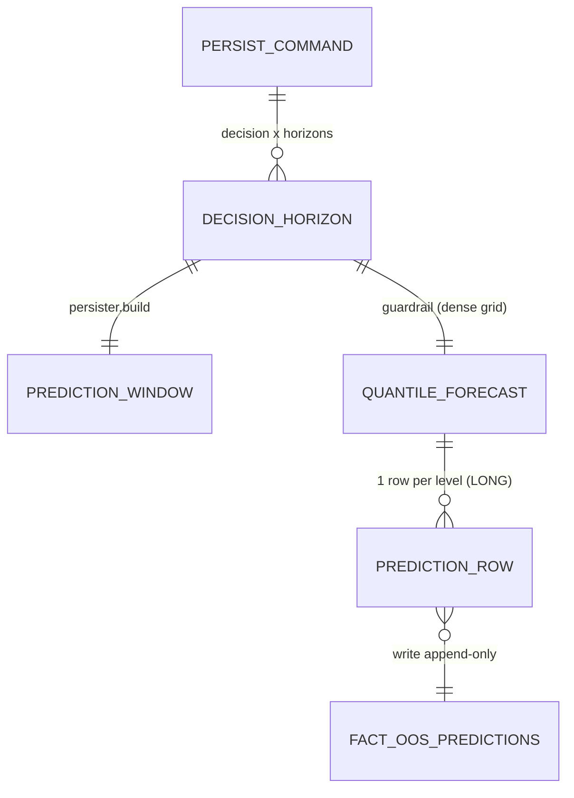

# Concept — Stage 4.3 — Persister de predições multi-horizonte

> **Escopo deste documento:** o que será feito nesta Stage, por quê, e
> decisões técnicas relevantes para entender o "porquê". O plano executável
> fica no [`technical.md`](./technical.md) correspondente.
>
> **Stage é a unidade de ciclo concept→technical→execução.** Sobre
> hierarquia (Step → Stage → Task), ver [`PIPELINE.md`](../../PIPELINE.md) §4.

## 1. Escopo

### Dentro do escopo

- **Domain service `MultiHorizonPredictionPersister`** (puro, stdlib-only) em
  `features/analytics_store/domain/services/multi_horizon_prediction_persister.py`:
  **dono único** da convenção temporal. Dado `decision_idx`, `horizon` e a
  sequência `dataset_timestamps` (ISO UTC, **já resolvida em grade de pregão**
  pela camada acima / 2.4), materializa `timestamp_utc =
  dataset_timestamps[decision_idx]` e `target_timestamp_utc =
  dataset_timestamps[decision_idx + horizon]` **indexado por dia de pregão**
  (índice do array de sessões — **nunca** `timedelta` de calendário). Valida
  `horizon >= 1` e `decision_idx >= 0`; na borda
  (`decision_idx + horizon >= len` ou `decision_idx >= len`) levanta
  `IncompletePredictionWindowError`. Devolve um VO frozen
  (`PredictionWindow`) com `decision_idx`, `timestamp_utc:str`,
  `target_timestamp_utc:str`. **Sem pandas** (corrige a violação do old, que
  importava `pd.Timestamp` só para `.isoformat()`).
- **VO `QuantileForecast`** (frozen, stdlib-only) em
  `features/analytics_store/domain/value_objects/quantile_forecast.py`: a
  **grade densa** de níveis (`levels` crescentes e únicos) com `raw_values`
  alinhados; carrega o **guardrail de monotonicidade generalizado** (o
  `enforce_monotonic_triplet` do old, estendido de p10/p50/p90 para a grade
  densa): garante quantis **não-decrescentes ao longo dos níveis**, reordena
  (`sorted`) se preciso e marca `guardrail_applied`. Expõe `levels`,
  `raw_values`, `guardrail_values`, `guardrail_applied`. Postura defensiva
  do old: se algum valor for não-finito/`None`, **preserva** os valores e
  marca `guardrail_applied = False`.
- **Use case `PersistPredictions`** (DTO frozen in/out) em
  `features/analytics_store/application/use_cases/persist_predictions.py`:
  recebe `PersistPredictionsCommand` (`run_id`, `split`, `model_version`,
  `asset`, `feature_set_name`, `decision_idx`, `horizons`,
  `dataset_timestamps`, e por `(decision, h)` uma `QuantileForecast`),
  combina persister + guardrail, mapeia para `PredictionRow` (4.1) no
  **formato LONG** (uma linha por `(decision, h, nível)` com `value_raw` **e**
  `value_guardrail` na **mesma** linha), preenche as colunas que o schema
  `fact_oos_predictions` exige mas o VO não carrega (`schema_version`,
  `model_version`, `asset`, `feature_set_name`, `year`) e grava via
  `AnalyticsRepository.write(layer="silver", table="fact_oos_predictions",
  rows, allow_upsert=False)`. Devolve `PersistPredictionsResult` com
  `rows_written` / `rows_skipped`. Janela incompleta → captura o erro do
  persister e **pula a linha** (não fabrica `y_true`).

### Fora do escopo (explicitamente)

- **Métricas** (pinball/CRPS/DM/MCS/Holm/calibração) — Step 6.
- **Gate de DEGENERAÇÃO** `q_low == q_high` — **Step 6**, explicitamente
  **separado** do guardrail de monotonicidade. NÃO implementar aqui.
- **Inferência** (carregar artefato, predizer) — Step 7.
- **Cálculo de `y_true` / `target_return`** — fornecido pelo caller, que
  indexa `target_return[decision_idx + h]` (backward). O persister apenas
  garante o alinhamento; não computa supervisão.
- **Adapter Parquet / `pandera`** — já existe (4.2).
- **`composition_root` / wiring real** — o use case recebe o port por injeção;
  esta Stage não toca o composition root.

### Vínculo com o roadmap

Fecha o **Step 4** (Analytics store / silver): com o schema (4.1) e o
repositório (4.2) prontos, esta Stage entrega o **persister único** dono do
`target_timestamp` — "toda predição fica rastreável por `run_id` num formato
auditável e reconstruível" ([`roadmap.md`](../../roadmap.md) Step 4 e Stage
`4.3-prediction-persister`). Habilita o harness 5.1, os baselines/treino
(5.2–5.4) e a estatística confirmatória do Step 6, todos consumidores deste
contrato.

## 2. Objetivo da Stage

Ao final desta Stage existe um **dono único, testado e puro** da convenção
`target_timestamp` que materializa, sem off-by-one, `timestamp_utc =
dataset_timestamps[decision_idx]` e `target_timestamp_utc =
dataset_timestamps[decision_idx + h]` **indexado por dia de pregão**, e um use
case que persiste a **grade densa de quantis** (raw + post-guardrail) no
formato LONG via `AnalyticsRepository`, pulando janelas incompletas — fechando
na origem o Gap 6 / bug E4 do projeto antigo.

## 3. Contexto e premissas

### Contexto

No projeto antigo, a convenção de `target_timestamp` / `y_true` vivia
**distribuída e divergente** em dois call-sites: o trainer TFT usava o
**decoder_end_day** como `timestamp_utc` enquanto o baseline usava o
**decision_day**, e **ambos** computavam `target_ts = decision_ts +
pd.Timedelta(days=h)` — `timedelta` de **calendário** num dataset que é grade
de **pregão** (bug secundário E4). Resultado documentado: para o mesmo
`target_timestamp_utc` em h=1, **0 de 685** linhas tinham `y_true`
coincidente entre TFT e baseline (Gap 6). O old ADR-0003 (Stage R-20, opção d)
fechou o gap fixando a convenção canônica num **domain service único**; esta
Stage **replica essa correção na origem** do novo projeto, com a melhoria de
manter o domínio **puro** (sem pandas) e generalizar o guardrail de triplet
para a **grade densa** (H-1 / ADR `0_0_0012`).

### Premissas

- `dataset_timestamps` chega **já resolvido em grade de pregão** (sem
  feriados/fins de semana), em ISO UTC. A garantia de que é grade de pregão é
  da camada acima / `TradingCalendar` (2.4); o persister assume essa
  pós-condição (premissa literal do old).
- `PredictionRow` (4.1) e o schema `fact_oos_predictions` (4.1) usam
  `timestamp_utc` / `target_timestamp_utc` como **string ISO** — zero conversão
  perdida ao manter os timestamps como `str` no domínio.
- O caller fornece `y_true`/`target_return` quando precisar (Steps 5–6); esta
  Stage não calcula supervisão.

### Dependências

- `4.1-silver-schema-per-table`: `PredictionRow` (VO LONG) e o schema
  `fact_oos_predictions` (PK lógica, partição, dtypes).
- `4.2-silver-repository`: `AnalyticsRepository` (port-out `write/read`),
  semântica append-only / `DuplicateKeyError`, partição derivada do payload.
- `2.4-trading-calendar`: fonte **conceitual/garantia** de que
  `dataset_timestamps` é grade de pregão (não é dependência direta do
  persister — ver D2).

## 4. Contratos

### Introduzidos

- **`MultiHorizonPredictionPersister`** (`domain-service`, stdlib-only)

  ```python
  class IncompletePredictionWindowError(ValueError):
      """decision_idx (+ h) fora dos limites de dataset_timestamps -> pular linha."""

  @dataclass(frozen=True)
  class PredictionWindow:
      decision_idx: int
      timestamp_utc: str          # dataset_timestamps[decision_idx]
      target_timestamp_utc: str   # dataset_timestamps[decision_idx + horizon]

  class MultiHorizonPredictionPersister:
      @staticmethod
      def build(
          *,
          decision_idx: int,
          horizon: int,
          dataset_timestamps: Sequence[str],  # ISO UTC, grade de pregão
      ) -> PredictionWindow: ...
  ```
  Valida `horizon >= 1`, `decision_idx >= 0`; borda
  (`decision_idx + horizon >= len` ou `decision_idx >= len`) levanta
  `IncompletePredictionWindowError`. **Sem import de pandas.**

- **`QuantileForecast`** (`value-object`, frozen, stdlib-only)

  ```python
  @dataclass(frozen=True)
  class QuantileForecast:
      levels: tuple[float, ...]            # crescentes, únicos
      raw_values: tuple[float, ...]        # alinhados a levels
      guardrail_values: tuple[float, ...]  # não-decrescentes (sorted)
      guardrail_applied: bool

      @classmethod
      def from_raw(
          cls,
          *,
          levels: tuple[float, ...],
          raw_values: tuple[float, ...],
      ) -> "QuantileForecast": ...
  ```
  `from_raw` valida `len(levels) == len(raw_values)`, `levels` estritamente
  crescentes e únicos; aplica `enforce_monotonic` (sorted ao longo dos níveis;
  `applied = True` se a ordem mudou); preserva valores e `applied = False` se
  algum não-finito/`None`.

- **`PersistPredictions`** (`use case`) com DTOs frozen
  `PersistPredictionsCommand` (in) e `PersistPredictionsResult` (out:
  `rows_written:int`, `rows_skipped:int`). Depende do port
  `AnalyticsRepository` por injeção.

### Consumidos

- **`AnalyticsRepository`** (`port-out`) — declarado em `4.2-silver-repository`.
  `write(*, layer, table, rows, allow_upsert=False) -> None`; append-only;
  valida `pandera`; particiona por `(asset, feature_set_name, year)` derivado
  do payload. Testar a application com **`FakeAnalyticsRepository` in-memory**
  (nunca mock; ADR `0_0_0021`).
- **`PredictionRow`** (`value-object`) — declarado em
  `4.1-silver-schema-per-table`. Campos LONG `run_id, split, horizon,
  decision_idx, timestamp_utc, target_timestamp_utc, quantile_level,
  value_raw, value_guardrail, guardrail_applied`. **Não** carrega
  `schema_version/model_version/asset/feature_set_name/year` (preenchidos no
  mapeamento DTO→Row do use case — I7).
- **`fact_oos_predictions`** (schema `pandera`) — declarado em
  `4.1`. PK lógica `(run_id, split, horizon, timestamp_utc,
  target_timestamp_utc, quantile_level)`; partição `(asset, feature_set_name,
  year)`; append-only; `quantile_level` é `float64` **na PK**.
- **`TradingCalendar`** (2.4) — fonte **conceitual** da grade de pregão; **não**
  é dependência de import do persister (D2).

## 5. Invariantes e regras

- **I1 — Âncora de `timestamp_utc`.** `timestamp_utc = decision_day =
  dataset_timestamps[decision_idx]` (NUNCA `decoder_end`; origem do
  Gap 6 / bug E4 no old TFT).
- **I2 — Indexação por dia de pregão.** `target_timestamp_utc =
  dataset_timestamps[decision_idx + h]`, indexado pelo **índice do array de
  sessões**. PROIBIDO `pd.Timedelta(days=h)` de calendário. Prova: para uma
  sexta com h=1, o diff de **calendário** entre `timestamp_utc` e
  `target_timestamp_utc` é 3 dias (pula o fim de semana), provando que a
  indexação é por **sessão**, não por calendário.
- **I3 — Alinhamento ZERO off-by-one com `y_true` backward.** `target_return`
  é backward (`target_return[t] = log(close[t]/close[t-1])`), então
  `y_true(h) = target_return[decision_idx + h]` (fornecido pelo caller). A
  convenção materializada garante que `decision_day` e `target` ficam separados
  por **exatamente h sessões** — provado para h=1 e h=7.
- **I4 — Borda.** `decision_idx + h >= len(dataset_timestamps)` (ou
  `decision_idx >= len`, ou `decision_idx < 0`, ou `h < 1`) →
  `IncompletePredictionWindowError`/`ValueError`; o use case captura o caso de
  janela incompleta e **pula a linha** (skip), contabilizando `rows_skipped`,
  **sem fabricar `y_true`**.
- **I5 — Guardrail de monotonicidade (grade densa).** Quantis
  **não-decrescentes ao longo dos níveis**; reordena (`sorted`) se desordenado;
  `guardrail_applied = True` (vira `1` no Row) quando a ordem mudou; valores
  não-finitos/`None` preservados com `applied = False` (postura defensiva).
  **SEPARADO** do gate de degeneração `q_low == q_high` (Step 6).
- **I6 — Persistência LONG raw + guardrail na MESMA linha.** Uma linha por
  nível com `value_raw` + `value_guardrail` + `guardrail_applied`; PK única por
  `(run_id, split, horizon, timestamp_utc, target_timestamp_utc,
  quantile_level)` — `quantile_level` **na PK**, sem colisão dentro de um
  `(decision, h)`.
- **I7 — Colunas de schema preenchidas na fronteira.** `schema_version`,
  `model_version`, `asset`, `feature_set_name` e `year` (ausentes no
  `PredictionRow` VO) são injetadas no mapeamento DTO→Row do use case;
  `year = ano do decision_day` (`timestamp_utc`), consistente cruzando
  fronteira de ano.
- **I8 — Domínio PURO.** `MultiHorizonPredictionPersister` e `QuantileForecast`
  importam **só stdlib** (`dataclasses`, `math`, `collections.abc`); SEM
  pandas/pyarrow/torch/pydantic/sqlalchemy. Gates: domain-purity (import-linter)
  + `scripts/check_layout.py` + mypy `--strict` + cobertura ≥ 90%.
- **I9 — Application por DTO + port.** Use case recebe/devolve **DTO frozen**,
  nunca entidade/VO de domínio para fora; depende do **Protocol** (port), não
  do adapter; testado com **fake** do port.

## 6. Casos de erro e exceções

- **C1 — Janela incompleta no persister.** `decision_idx + h >= len` ou
  `decision_idx >= len` → `IncompletePredictionWindowError`. **Use case:**
  `continue` + `rows_skipped += 1`; não grava linha, não fabrica `y_true`.
- **C2 — Argumentos inválidos no persister.** `horizon < 1` ou
  `decision_idx < 0` → `ValueError` (programação; não é "skip" — é bug do
  caller).
- **C3 — Grade mal-formada no `QuantileForecast`.** `len(levels) !=
  len(raw_values)`, `levels` não estritamente crescentes ou com duplicatas →
  `ValueError` na construção.
- **C4 — Valor não-finito/`None` na grade.** O guardrail **não falha**:
  preserva os valores e marca `guardrail_applied = False` (postura defensiva
  do old). A decisão sobre degeneração/qualidade fica para o Step 6.
- **C5 — Colisão de PK no `write`.** Se o caller reprocessar a mesma
  `(run_id, split, horizon, timestamp, quantile_level)` sem `allow_upsert`, o
  port levanta `DuplicateKeyError` (contrato 4.2) — o use case **propaga**
  (reprocessamento consciente é responsabilidade do caller, não silenciado).

## 7. Decisões técnicas relevantes

### D1 — Convenção `target_timestamp` / grade (PRINCIPAL)

- **O quê:** replicar a correção do old ADR-0003 (R-20, opção d):
  `timestamp_utc = decision_day = dataset_timestamps[decision_idx]`;
  `target_timestamp_utc = dataset_timestamps[decision_idx + h]` indexado por
  dia de pregão; `target_return` backward (`y_true(h) =
  target_return[decision_idx + h]`, fornecido pelo caller); guardrail
  monotônico; grade persistida no formato LONG/H-1. Zero off-by-one.
- **Por quê:** pré-declarado no ledger §B 4.3 e finding de alto risco — resolve
  na **origem** o Gap 6 / bug E4 (TFT usava `decoder_end_day`, baseline usava
  `decision_day` → offset; e `timedelta` de calendário em vez de sessão). Base
  concreta: old `multi_horizon_prediction_persister.py` + ADR-0003, com bateria
  h=1/h=7 e sex→seg já validada (R-23 smoke v4).
- **Fonte:** [`autonomous-run-decision-ledger.md`](../../autonomous-run-decision-ledger.md)
  §B 4.3; old `src/domain/services/multi_horizon_prediction_persister.py`;
  old `ADR-0003`; ledger H-1.
- **ADR:** [`../../adr/4_3_0001-target-timestamp-trading-day-indexing-and-domain-purity.md`](../../adr/4_3_0001-target-timestamp-trading-day-indexing-and-domain-purity.md)

### D2 — Fonte do alinhamento (dataset_timestamps vs TradingCalendar.shift)

- **O quê:** indexar os próprios `dataset_timestamps[decision_idx + h]`
  (postura literal do old); `TradingCalendar` (2.4) fica como fonte
  **conceitual/garantia** da grade, **não** dependência direta do domain
  service.
- **Por quê:** simples-e-trocável — o dataset **já é** grade de pregão (sem
  feriados/fins de semana), então indexar o array é correto, O(1) e mantém o
  service sem injetar `TradingSessions`. Indexar pelo array também é o que prova
  o teste sex→seg (diff de calendário ≠ h). A robustez extra do
  `TradingCalendar` não paga o custo de acoplamento aqui; fácil migrar depois
  se o índice deixar de ser confiável.
- **Fonte:** old persister (linha 100–111, indexa `dataset_timestamps`
  diretamente); old teste `test_trading_day_arithmetic_skips_weekend_gaps`
  (diff_days==3 para h=1 sex→seg).
- **ADR:** [`../../adr/4_3_0001-target-timestamp-trading-day-indexing-and-domain-purity.md`](../../adr/4_3_0001-target-timestamp-trading-day-indexing-and-domain-purity.md)

### D3 — Pureza do domínio: timestamps como `str` ISO (remover pandas)

- **O quê:** timestamps trafegam como `str` ISO (UTC) já resolvidos pela camada
  acima; o domain service não toca pandas nem parsing de `datetime`.
  `QuantileForecast` e persister importam só stdlib.
- **Por quê:** LAYOUT exige domínio stdlib-only; o old **violava** importando
  `pd.Timestamp` só para `.isoformat()`. `str` ISO já é o tipo de
  `timestamp_utc`/`target_timestamp_utc` no `PredictionRow` (4.1) e no schema —
  zero conversão perdida.
- **Fonte:** [`LAYOUT.md`](../../LAYOUT.md) §3 (domínio puro); old persister
  linha 6 (`import pandas as pd`); `prediction_row.py` (campos `str`).
- **ADR:** coberto no `4_3_0001`.

### D4 — Generalização do guardrail triplet → grade densa

- **O quê:** `QuantileForecast` guarda `levels` (crescente) + `raw_values`
  alinhados; `enforce_monotonic` faz `sorted` dos valores ao longo dos níveis e
  marca `guardrail_applied` se a ordem mudou; não-finito/`None` preservado com
  `applied = False`. Caso base triplet (p10/p50/p90) reproduz
  `enforce_monotonic_triplet` do old.
- **Por quê:** H-1 e ADR `0_0_0012` pedem **grade densa ~7–9**; o old só tinha
  p10/p50/p90. A lógica `applied = ordem-mudou` se preserva 1:1; `sorted` é
  simples, total e correto para monotonicidade não-decrescente.
- **Fonte:** ledger H-1; overview ADR `0_0_0012` (grade densificada); old
  `quantile_guardrail_service.py:18-60` (`enforce_monotonic_triplet`).
- **ADR:** [`../../adr/4_3_0002-quantile-forecast-dense-grid-guardrail.md`](../../adr/4_3_0002-quantile-forecast-dense-grid-guardrail.md)

### D5 — Preenchimento das colunas de schema ausentes no `PredictionRow` VO

- **O quê:** `model_version`, `asset`, `feature_set_name`, `schema_version` e
  `year` são injetadas no mapeamento DTO→Row dentro do use case (via DTO de
  entrada / contexto de run), análogo ao `created_at_utc` write-time da 4.2.
  `year = ano do decision_day` (`timestamp_utc`).
- **Por quê:** `PredictionRow` (4.1) deliberadamente **não** carrega essas
  colunas (VO de domínio puro), mas o schema `pandera` as exige
  `nullable=False`. Resolver na fronteira application é a postura já
  estabelecida na 4.2 (ADR `4_2_0002`). `year` do decision_day mantém
  consistência de partição cruzando fronteira de ano (coberto por teste).
- **Fonte:** `prediction_row.py` (não carrega as colunas);
  `fact_oos_predictions_schema.py` (exige `nullable=False`);
  ADR `4_2_0002`. Sem alternativa real descartada → registrada na §7 do
  technical, não vira ADR.

### D6 — Persistir raw e post-guardrail na MESMA linha

- **O quê:** mesma linha LONG: `value_raw` + `value_guardrail` +
  `guardrail_applied` por
  `(run_id, split, horizon, timestamp_utc, target_timestamp_utc,
  quantile_level)`.
- **Por quê:** é exatamente a forma do `PredictionRow` (4.1) e da PK do schema
  `fact_oos_predictions` já existentes; duas linhas duplicariam a PK e
  quebrariam o `unique` composto. Decisão **herdada** do contrato 4.1.
- **Fonte:** `prediction_row.py`; `fact_oos_predictions_schema.py` (`unique=`).
  Decisão herdada → §7 do technical, não vira ADR.

### D7 — Janela incompleta: raise no service / skip no caller

- **O quê:** `MultiHorizonPredictionPersister` levanta
  `IncompletePredictionWindowError`; o use case captura e **pula a linha**
  (`continue`), contabilizando `rows_skipped`, sem fabricar `y_true`.
- **Por quê:** DoD 4.3 ("janela incompleta levanta erro e pula linha") bate com
  o padrão raise-no-service/skip-no-caller do old (`continue` nos call-sites).
  Mantém o service como guardião da invariante e a política de skip explícita e
  testável na application.
- **Fonte:** [`roadmap.md`](../../roadmap.md) Stage 4.3 `definition_of_done`;
  old `run_baselines_use_case.py:261-270` (skip de borda). §7 do technical.

## 8. Integrações

### Internas (com outras Stages/módulos)

- **`analytics_store` 4.1:** consome `PredictionRow` e o schema
  `fact_oos_predictions` (forma LONG, PK, dtypes).
- **`analytics_store` 4.2:** grava via `AnalyticsRepository.write`
  (append-only, partição por payload, validação `pandera` no adapter).
- **`shared`/`2.4`:** `TradingCalendar` como garantia conceitual de que
  `dataset_timestamps` é grade de pregão.
- **Consumidores futuros:** harness 5.1, baselines/treino 5.2–5.4 (produzem
  `QuantileForecast` + chamam `PersistPredictions`), estatística Step 6 e
  inferência Step 7 (leem `fact_oos_predictions`).

## 9. Modelo de dados (se aplicável)

Uma `QuantileForecast` (grade densa) por `(decision_idx, h)` vira **N linhas
LONG** em `fact_oos_predictions` — uma por `quantile_level` — com `value_raw` e
`value_guardrail` na mesma linha.



## 10. Riscos e mitigações

| Risco | Probabilidade | Impacto | Mitigação |
|---|---|---|---|
| Off-by-one volta (coração do rewrite) | M | A | Testes verbatim h=1/h=7 separados por exatamente h sessões + sex→seg (diff calendário ≠ h); convenção num único arquivo; I1–I3. |
| `dataset_timestamps` não ser grade de pregão (premissa quebra) | B | A | Documentar como pós-condição da camada 2.4; indexação por sessão é correta sob a premissa; migrar para `TradingCalendar.shift` é trocável (D2). |
| Pandas vazar para o domínio (como no old) | M | M | Gate domain-purity + import-linter + `check_layout.py`; timestamps como `str` (D3); grep limpo de `pandas` na Task 04. |
| Confundir guardrail de monotonicidade com gate de degeneração | M | M | I5 + non_goals explícitos; guardrail só reordena, não mascara `q_low==q_high` (Step 6). |
| Colisão de PK silenciada | B | A | `value_raw`+`value_guardrail` na mesma linha (D6); `quantile_level` na PK; `write(allow_upsert=False)` propaga `DuplicateKeyError`. |

## 11. Critérios de aceitação

- [ ] **A1** — `MultiHorizonPredictionPersister.build` devolve
  `timestamp_utc = dataset_timestamps[decision_idx]` e `target_timestamp_utc =
  dataset_timestamps[decision_idx + h]`, provado para **h=1 e h=7** (separados
  por exatamente h posições no array de sessões). (I1, I2, I3)
- [ ] **A2** — Teste sex→seg prova que o diff de **calendário** entre
  `timestamp_utc` e `target_timestamp_utc` ≠ h (ex.: h=1 numa sexta → 3 dias de
  calendário), confirmando indexação por **sessão**. (I2)
- [ ] **A3** — Borda (`decision_idx + h >= len`, `decision_idx >= len`)
  levanta `IncompletePredictionWindowError`; `horizon < 1` / `decision_idx < 0`
  levanta `ValueError`. (I4, C1, C2)
- [ ] **A4** — `QuantileForecast.from_raw` valida grade (alinhamento, níveis
  estritamente crescentes/únicos) e o guardrail **reordena** uma grade
  desordenada marcando `guardrail_applied = True`; grade já-monotônica →
  `applied = False`; não-finito/`None` → valores preservados, `applied =
  False`; caso base triplet p10/p50/p90 reproduz o old. (I5, C3, C4)
- [ ] **A5** — `PersistPredictions` grava **uma linha LONG por nível** com
  `value_raw` + `value_guardrail` na mesma linha, PK única por `(run_id, split,
  horizon, timestamp, target_timestamp, quantile_level)`. (I6)
- [ ] **A6** — Use case preenche `schema_version/model_version/asset/
  feature_set_name/year` no Row, com `year = ano do decision_day`, incluindo
  caso cruzando fronteira de ano. (I7)
- [ ] **A7** — Janela incompleta → use case **pula a linha** e incrementa
  `rows_skipped` (não fabrica `y_true`); testado com `FakeAnalyticsRepository`
  in-memory (não mock). (I4, I9, C1)
- [ ] **A8** — `MultiHorizonPredictionPersister` e `QuantileForecast` importam
  só stdlib (grep limpo de `pandas`); gates domain-purity + import-linter +
  `check_layout.py` + mypy `--strict` verdes; cobertura do BC ≥ 90%. (I8)
- [ ] **A9** — Dois ADRs `accepted` (`4_3_0001`, `4_3_0002`); este `concept.md`
  cita ledger H-1, old ADR-0003 (opção d) e overview ADR `0_0_0012`.

## 12. Checklist de validação interna

- [x] Todos os contratos introduzidos têm assinatura definida? (§4)
- [x] Toda decisão em §7 tem fonte rastreável? (D1–D7)
- [x] Toda integração externa tem contrato definido? (sem externas; internas em §8)
- [x] Decisões com alternativa real descartada têm ADR escrito? (D1/D2 →
  `4_3_0001`; D4 → `4_3_0002`; D3/D5/D6/D7 sem alternativa real → §7 technical)
- [x] Dependências de Stages anteriores estão `done`? (4.1, 4.2, 2.4)
- [x] Stage cabe em ~3–8 Tasks? (5 Tasks no technical: 2 domain + 1 use case + pacotes + gate)
- [x] Riscos críticos têm mitigação plausível? (§10)
- [x] O alinhamento temporal (coração do rewrite) tem teste verbatim que prova
  zero off-by-one? (A1, A2)

## 13. Questões em aberto

- Nenhuma. As decisões pré-declaradas (ledger §B 4.3) e herdadas (4.1/4.2)
  cobrem o escopo; degeneração e métricas são explicitamente Step 6.

## 14. Referências

- [`../../overview.md`](../../overview.md) — §11 ADRs de fundação (`0_0_0011`
  pré-registro/gate de degeneração; `0_0_0012` grade densa).
- [`../../roadmap.md`](../../roadmap.md) — Stage `4.3-prediction-persister` e
  Step 4.
- [`../../autonomous-run-decision-ledger.md`](../../autonomous-run-decision-ledger.md)
  — H-1 (long/agnóstico à grade) e §B 4.3 (target_timestamp / grade).
- ADRs desta Stage: [`../../adr/`](../../adr/) (prefixo `4_3_`).
- Old repo: `src/domain/services/multi_horizon_prediction_persister.py`,
  `src/domain/services/quantile_guardrail_service.py`,
  `docs/01_architecture/decisions/ADR-0003-multi-horizon-prediction-persister.md`,
  `tests/unit/domain/services/test_multi_horizon_prediction_persister.py:144-164`.
