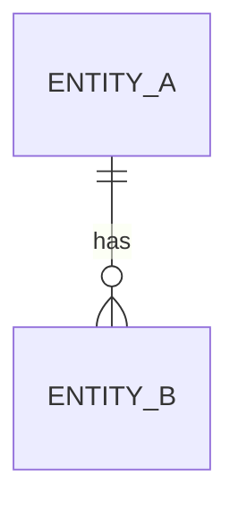

# Concept — Stage N.M — <Título da Stage>

> **Escopo deste documento:** o que será feito nesta Stage, por quê, e
> decisões técnicas relevantes para entender o "porquê". O plano executável
> fica no [`technical.md`](./technical.md) correspondente.
>
> **Stage é a unidade de ciclo concept→technical→execução.** Sobre
> hierarquia (Step → Stage → Task) e critérios de atomicidade, ver
> [`PIPELINE.md`](../../PIPELINE.md) §4.
>
> **Status (apenas dois estados).** `draft` desde a criação; `done` após
> o gate humano. Regressão `done → draft` é **permitida** quando a
> Fase 3B (Technical) revela gap material aqui — neste caso, commit
> `chore(concept): revert to draft — revision-from-technical: <motivo>`.
> O Passo 8 do runbook (início da Fase 4) exige `concept.status == done`
> **e** `technical.status == done` simultaneamente.

## 1. Escopo

### Dentro do escopo
- <item>
- <item>

### Fora do escopo (explicitamente)
- <item — fronteiras claras evitam scope creep>

### Vínculo com o roadmap
<Como esta Stage contribui para o Step `N — <título>` e para os objetivos
do projeto. Referência ao `overview.md` e à seção correspondente do
`roadmap.md`.>

## 2. Objetivo da Stage

<1 parágrafo. Outcome único e verificável: o que estará verdadeiro no
mundo após esta Stage fechar. Se a frase precisa de "e" no meio, são
duas Stages.>

## 3. Contexto e premissas

### Contexto
<O que precisa ser entendido para que esta Stage faça sentido. Pode
referenciar Stages anteriores.>

### Premissas
- <premissa que estamos assumindo verdadeira sem ter validado>

### Dependências
- `<stage_id>`: <o que dessa Stage anterior é usado aqui>

## 4. Contratos

<Interfaces, protocols, schemas, assinaturas introduzidas ou consumidas
por esta Stage. Use blocos de código Python quando aplicável.>

### Introduzidos
- **`<NomeDoContrato>`** (`port-in` | `port-out` | `dto` | `entity` | `value-object`)
  - <descrição curta>

### Consumidos
- **`<NomeDoContrato>`** — declarado em Stage `<stage_id anterior>`.

## 5. Invariantes e regras

<Regras de negócio e estruturais sempre verdadeiras ao final da Stage.>

## 6. Casos de erro e exceções

<Cenários de falha previstos e comportamento esperado em cada um.>

## 7. Decisões técnicas relevantes

> Decisões que afetam o "o quê" desta Stage. **Decisões com alternativa
> real descartada devem virar ADR** em [`../../adr/`](../../adr/)
> (pasta única; nomear como `N_M_NNNN-<slug>.md` com `N_M` desta Stage)
> — referenciar aqui pelo `adr_id`.
>
> Toda decisão deve ter **fonte rastreável** (Overview seção / Roadmap /
> arquivo / pergunta respondida na sessão). Sem fonte = pergunta esquecida.
>
> Se a Stage usa `gate_mode: batch` (declarado em `roadmap.md`), justifique
> aqui ou em ADR (PIPELINE §9.4).

### <Decisão 1>
- **O quê:** <a decisão tomada>
- **Por quê:** <razão>
- **Fonte:** <Overview §X / Roadmap §Stage N.M / arquivo path:linha / pergunta>
- **ADR:** [`../../adr/N_M_NNNN-<slug>.md`](../../adr/N_M_NNNN-<slug>.md) (se aplicável)

### <Decisão 2>
- ...

## 8. Integrações

### Internas (com outras Stages/módulos)
- <módulo X>: <natureza da integração>

### Externas
- <sistema/serviço>: <natureza, contrato esperado>

## 9. Modelo de dados (se aplicável)

<Descrição de entidades, relações, schema. Pode usar mermaid `erDiagram`.>

## 10. Riscos e mitigações

| Risco | Probabilidade | Impacto | Mitigação |
|---|---|---|---|
| <risco> | A/M/B | A/M/B | <abordagem> |

## 11. Critérios de aceitação

<Lista verificável que define "esta Stage está concluída quando…". Os
mesmos itens reaparecem no gate de saída da Stage em `technical.md` §3.>

- [ ] <critério objetivo e testável>
- [ ] <…>

## 12. Checklist de validação interna

> Todas devem estar respondidas com "sim" para esta Stage sair do
> Concept e entrar em Technical.

- [ ] Todos os contratos introduzidos têm assinatura definida?
- [ ] Toda decisão em §7 tem fonte rastreável?
- [ ] Toda integração externa tem contrato definido (interface, formato, auth)?
- [ ] Decisões com alternativa real descartada têm ADR escrito?
- [ ] Dependências de Stages anteriores estão satisfeitas (`done`)?
- [ ] Stage cabe em ~3–8 Tasks (ver [`CONVENTIONS.md`](../../CONVENTIONS.md) §6)?
- [ ] Riscos críticos têm mitigação plausível?
- [ ] <pergunta específica desta Stage>

## 13. Questões em aberto

> Marcar como `TODO` aqui é melhor que inventar resposta. Mas a Stage
> não pode entrar em Technical com `TODO` crítico aberto.

- [ ] <pergunta sem resposta — quem responde, até quando>

## 14. Referências

- [`../../overview.md`](../../overview.md) — vínculo geral
- [`../../roadmap.md`](../../roadmap.md) — Stage `N.M-<slug>` e vizinhas
- ADRs desta Stage: [`../../adr/`](../../adr/) (filtrar por prefixo `N_M_`)
- <docs externos, papers, RFCs>