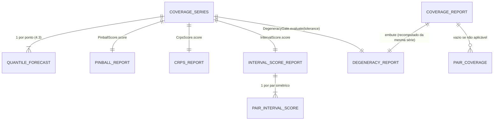

# Concept — Stage 6.1 — Métricas de scoring e calibração

> **Escopo deste documento:** o que será feito nesta Stage, por quê, e
> decisões técnicas relevantes para entender o "porquê". O plano executável
> fica no [`technical.md`](./technical.md) correspondente.
>
> **Camada teórica.** Toda fórmula e convenção usada aqui vem do doc de domínio
> [`probabilistic-forecast-evaluation.md`](../../domain/evaluation/probabilistic-forecast-evaluation.md)
> (`accepted`), seções §2, §3, §4.1–§4.3, §4.5–§4.6 e §5 (mapa de consumo §1).
> Este concept **não re-deriva** teoria: cita a seção e fixa só o que é
> contrato de implementação (VO, serviços, port, casos de erro).

## 1. Escopo

### Dentro do escopo

- **Slice novo `evaluation`** (primeira Stage do BC) com `domain/`,
  `application/` e `adapters/` — entra nos contratos import-linter
  `hexagonal-layers`, `domain-purity`, `inward-only` e `bc-independence`, mais
  um contrato novo `evaluation-no-scoring-lib-leak` (proíbe `sklearn`,
  `scoringrules`, `numpy`, `scipy` em `evaluation.{application,domain}`).
- **VO `CoverageSeries`** — série alinhada de **um** (modelo, horizonte):
  grade comum simétrica, `target_timestamp`s estritamente crescentes, um
  `QuantileForecast` (4.3) e um realizado finito por ponto
  ([ADR 6.1.0002](../../adr/6_1_0002-coverage-series-aligned-input-vo.md)).
- **Serviços de domínio stdlib-only** (implementação de registro — ADR 6.1.0001):
  - `PinballScore` — ρ_τ por nível, P̄_τ por nível, L_t por ponto e P̄_G na
    grade (doc §3.1);
  - `CrpsScore` — CRPS_Q = 2·P̄_G, rotulado como tal (doc §3.2; ADR 0.0.0009);
  - `IntervalScore` — IS_α por par simétrico, não escalado, com decomposição
    largura + penalidade inferior + superior (doc §3.3);
  - `DegeneracyGate` — colapso total por linha, colapso parcial por par como
    diagnóstico, taxa sempre reportada (doc §5; ADR 0.0.0011;
    [ADR 6.1.0003](../../adr/6_1_0003-degeneracy-absolute-spread-tolerance.md));
  - `CoverageMetrics` — cobertura marginal ĉ(τ) por nível, PICP e MPIW por par
    simétrico com **nominal dinâmico** (1 − 2τ_l), larguras por linha para o
    sharpness diagram — só nas linhas não-degeneradas (doc §4.1–§4.3, §5.3).
- **Port-out `ScoringBackend`** + adapters `SklearnScoring` e
  `ScoringrulesBackend` + fake + suíte de contrato `[fake, sklearn,
  scoringrules]` — é a verificação "bate com sklearn/scoringrules" do DoD
  ([ADR 6.1.0001](../../adr/6_1_0001-scoring-libraries-as-oracle-backend-behind-port.md)).
- **Dependências:** `scikit-learn>=1.9,<2.0` (explícita; hoje só transitiva no
  `uv.lock`, 1.9.0) e `scoringrules>=0.11,<0.12` (nova), em `dependencies`.
- **LAYOUT §7 "Perímetro do gate hoje"** atualizado: `bc-independence` passa a
  cobrir **cinco** slices e **21** arestas de runtime declaradas (a nova é
  `evaluation.domain → QuantileForecast`).

### Fora do escopo (explicitamente)

- **Ler o silver / montar a série** a partir de `fact_oos_predictions` +
  `target_return`, join por `target_timestamp`, dedup e interseção entre
  modelos → **6.4** (builders gold). Esta Stage recebe `CoverageSeries` pronta.
- **Persistir** métricas em tabelas gold → **6.4**.
- **Bandas de Wilson**, LR_uc/Kupiec/Christoffersen, hits unilaterais, VaR
  descritivo → **6.3** (doc §4.4, §7).
- **Inferência pareada** (DM/HLN, Holm, MCS) → **6.2**; esta Stage só expõe a
  série L_t que a 6.2 consome.
- **Limiar** da taxa de degeneração, **valor** da tolerância de degeneração,
  níveis da grade, par primário e gate H1 → **6.5** (pré-registro).
- **Média entre seeds** e pooling entre runs → consumidor (6.4/6.5, doc §6.9);
  aqui tudo é **por série**.
- **Qual amostra** alimenta os relatórios do scorecard (série inteira do
  modelo ou a interseção exata de `target_timestamp` usada por DM/MCS — doc
  §6.7) → 6.4/6.5; os serviços reportam sobre a série que recebem.
- **Garantir que todos os pontos são do `horizon` rotulado** → builder (6.4):
  `QuantileForecast` não carrega horizonte, o VO só carrega o rótulo.
- **Redação do DoD 6.1 no `roadmap.md`** (PR #98 item 3) → já aplicada pela
  branch da 5.5 (`feat/102-5-5-confirmatory-retrain`, `roadmap.md:763`); esta
  Stage não edita o DoD.
- **Gráficos** (quantile score plot, reliability diagram, sharpness diagram) →
  8.3; esta Stage entrega os números que os alimentam.
- **WIS agregado, CWC, NMPIW, pesos de quadratura em τ, CRPS por
  ensemble/spline** — descartados pelo doc (§3.2, §3.3, §4.3, §4.6); não
  existem no domínio.
- Pontuar o vetor **bruto** (`raw_values`) — descartado pelo doc §2.2.

### Vínculo com o roadmap

Abre o Step 6 ("evidência confirmatória academicamente defensável e
auditável, com cada número conferível contra o R/paper" —
[`roadmap.md`](../../roadmap.md) Step 6): pinball é a métrica primária de H2 e
a calibração é o objeto e o gate de H1 ([`overview.md`](../../overview.md) §4).
Sem estas métricas, 6.2 (L_t), 6.3 (`CoverageSeries`), 6.4 (builders) e 6.5
(scorecard) não têm insumo. Mitiga R-METRIC-1 (overview §8): "contratos por
unidade + oráculo + gate de degeneração separado do guardrail".

## 2. Objetivo da Stage

Ao final desta Stage, dada uma `CoverageSeries` de um (modelo, horizonte),
o domínio `evaluation` devolve — sem biblioteca externa — pinball por nível e
na grade, CRPS_Q, interval score por par simétrico com decomposição, cobertura
marginal por nível, PICP/MPIW por par com nominal derivado da grade e o
relatório de degeneração, cada número conferido contra fixture analítica e
contra sklearn/scoringrules pela suíte de contrato do `ScoringBackend`.

## 3. Contexto e premissas

### Contexto

O Step 5 persiste a grade densa de quantis (raw + pós-guardrail) de
baselines, GBM e TFT em `fact_oos_predictions` (4.3). Nada ainda **mede**
essas previsões. O doc de domínio do Step 6 (ratificado em 2026-09-26, issue
#78) fixou todas as convenções de 6.1: escala ρ_τ sem fator 2, pesos iguais na
grade, CRPS_Q = 2·P̄_G como número de escala (não evidência independente),
IS_α por par simétrico, cobertura com 1{y ≤ q̂} e PICP com intervalo fechado,
MPIW em unidade de y, e a semântica do gate de degeneração (ADR 0.0.0011).

### Premissas

- A grade do projeto é **simétrica** (τ_{K+1−k} = 1 − τ_k) e comum a todos os
  modelos (doc §2.1; modeling §7 item 1). Níveis exatos são do cohort (5.5) e
  do pré-registro (6.5).
- O realizado de cada ponto é o `target_return` persistido, juntado por
  `target_timestamp` (ADR 4.3.0001); a avaliação nunca o recomputa (doc §2.1).
- A série chega **deduplicada** (1 obs por `target_timestamp` — dedup
  operationally-latest da 5.1) e **pooled sobre folds** por horizonte (doc
  §4.4, §6.8). A montagem é da 6.4.
- Os adapters de modelagem já erguem em emissão não-finita (5.2/5.3 C5): um
  valor não-finito na avaliação é violação de invariante a montante.
- A escala (T ≈ 10³ pontos × K ≈ 7 níveis por série) torna laços stdlib
  suficientes (mesma avaliação do ADR 5.2.0001, Alternativa B).

### Dependências

- `4.3-prediction-persister`: VO `QuantileForecast` (`levels`, `raw_values`,
  `guardrail_values`, `guardrail_applied`) e a garantia de que
  `guardrail_values` é não-decrescente quando finito (ADR 4.3.0002). O
  guardrail é **separado** do gate de degeneração: `q_low == q_high` passa
  intacto no 4.3 e é julgado aqui.
- `5.1`–`5.4` (não formais): a forma das previsões persistidas. A grade comum
  **dentro** de uma série é garantida pela própria `CoverageSeries`
  (`forecast.levels == levels` em todo ponto — I2). A grade comum **entre**
  execuções é um **pedido à 5.5** (`[finding]` da 5.2 §7: incluir
  `quantile_levels` no hash do cohort), não uma garantia já entregue.

## 4. Contratos

### Introduzidos

- **`CoverageSeries`** (`value-object`, frozen, stdlib-only) —
  `evaluation/domain/value_objects/coverage_series.py`

  ```python
  @dataclass(frozen=True)
  class CoverageSeries:
      horizon: int                                   # >= 1
      levels: tuple[float, ...]                      # (0,1), estritamente crescente, simétrica, ≥ 1 par
      target_timestamps: tuple[str, ...]             # ISO UTC, estritamente crescentes
      forecasts: tuple[QuantileForecast, ...]        # VO do 4.3; guardrail_values não-decrescente
      realized: tuple[float, ...]                    # target_return persistido, finito

      @property
      def n_points(self) -> int: ...
      @property
      def symmetric_pairs(self) -> tuple[tuple[float, float], ...]:  # (τ_l, τ_u), τ_l < 0.5
          ...
      @property
      def guardrail_applied_rate(self) -> float: ...   # diagnóstico de cruzamento (doc §2.2)
      def scored_values(self, index: int) -> tuple[float, ...]:  # guardrail_values do ponto
          ...
  ```

- **`PinballScore`** (`domain-service`) — `domain/services/pinball_score.py`

  ```python
  def pinball_loss(*, realized: float, quantile: float, level: float) -> float  # ρ_τ(y − q)
  def mean_pinball(*, realized: Sequence[float], quantiles: Sequence[float], level: float) -> float

  @dataclass(frozen=True)
  class PinballReport:           # __post_init__: len(per_level) == K ≥ 2, n_points ≥ 1
      horizon: int
      n_points: int
      per_level: tuple[tuple[float, float], ...]     # (τ_k, P̄_τk)
      grid_mean: float                               # P̄_G, pesos iguais

  class PinballScore:
      @staticmethod
      def per_point_losses(series: CoverageSeries) -> tuple[float, ...]  # L_t (insumo da 6.2)
      @staticmethod
      def score(series: CoverageSeries) -> PinballReport
  ```

- **`CrpsScore`** (`domain-service`) — `domain/services/crps_score.py`

  ```python
  CRPS_Q_LABEL: Final = "CRPS_Q = 2 × pinball média na grade (pesos iguais)"

  def crps_quantile(*, realized: float, quantiles: Sequence[float], levels: Sequence[float]) -> float
  def mean_crps_quantile(*, realized: Sequence[float], quantile_grid: Sequence[Sequence[float]],
                         levels: Sequence[float]) -> float

  @dataclass(frozen=True)
  class CrpsReport:
      horizon: int
      n_points: int
      crps_q: float
      label: str = CRPS_Q_LABEL

  class CrpsScore:
      @staticmethod
      def per_point(series: CoverageSeries) -> tuple[float, ...]
      @staticmethod
      def score(series: CoverageSeries) -> CrpsReport
  ```

- **`IntervalScore`** (`domain-service`) — `domain/services/interval_score.py`

  ```python
  def interval_score(*, realized: float, lower: float, upper: float, miscoverage: float) -> float
      # GR 2007 Eq. (43)

  def mean_interval_score(*, realized: Sequence[float], lower: Sequence[float],
                          upper: Sequence[float], miscoverage: float) -> float

  @dataclass(frozen=True)
  class PairIntervalScore:
      lower_level: float
      upper_level: float
      miscoverage: float           # α = 2·τ_l (fórmula única, doc §2.4)
      nominal: float               # 1 − 2·τ_l
      mean_width: float            # médias sobre TODAS as linhas
      mean_lower_penalty: float
      mean_upper_penalty: float
      @property
      def mean_score(self) -> float  # := mean_width + mean_lower_penalty + mean_upper_penalty

  @dataclass(frozen=True)
  class IntervalScoreReport:     # __post_init__: len(per_pair) ≥ 1 (== nº de pares simétricos), n_points ≥ 1
      horizon: int
      n_points: int
      per_pair: tuple[PairIntervalScore, ...]

  class IntervalScore:
      @staticmethod
      def score(series: CoverageSeries) -> IntervalScoreReport
  ```

- **`DegeneracyGate`** (`domain-service`) — `domain/services/degeneracy_gate.py`

  ```python
  @dataclass(frozen=True)
  class DegeneracyReport:        # __post_init__: len(degenerate) == len(target_timestamps) == n_points,
      horizon: int               # n_degenerate == sum(degenerate), rate == n_degenerate / n_points
      n_points: int
      target_timestamps: tuple[str, ...]             # da série de origem (auditoria)
      tolerance: float
      degenerate: tuple[bool, ...]                   # máscara por linha, alinhada à série
      n_degenerate: int
      rate: float                                    # n_degenerate / n_points — sempre reportada
      pair_collapse_rates: tuple[tuple[float, float, float | None], ...]
          # (τ_l, τ_u, taxa de colapso parcial entre as NÃO-degeneradas | None se não houver)

  class DegeneracyGate:
      @staticmethod
      def evaluate(series: CoverageSeries, *, tolerance: float) -> DegeneracyReport
  ```

- **`CoverageMetrics`** (`domain-service`) — `domain/services/coverage_metrics.py`

  ```python
  @dataclass(frozen=True)
  class PairCoverage:
      lower_level: float
      upper_level: float
      nominal: float               # 1 − 2·τ_l (dinâmico, da grade)
      picp: float                  # [l ≤ y ≤ u]
      mpiw: float                  # unidade de y

  @dataclass(frozen=True)
  class CoverageReport:
      # __post_init__ (ValueError): degeneracy.n_points == n_points;
      # degeneracy.horizon == horizon; n_evaluated == n_points − degeneracy.n_degenerate;
      # applicable ⇔ n_evaluated > 0; per_level == () e per_pair == () ⇔ not applicable;
      # se aplicável: len(per_level) == K e len(per_pair) == nº de pares simétricos
      horizon: int
      n_points: int
      n_evaluated: int             # linhas não-degeneradas
      applicable: bool             # False ⇔ n_evaluated == 0 ("não aplicável")
      degeneracy: DegeneracyReport # o relatório que escolheu as linhas (mesma série e tolerância)
      per_level: tuple[tuple[float, float], ...]     # (τ_k, ĉ(τ_k)); vazio se não aplicável
      per_pair: tuple[PairCoverage, ...]             # vazio se não aplicável

  class CoverageMetrics:
      @staticmethod
      def evaluate(series: CoverageSeries, *, tolerance: float) -> CoverageReport
          # roda DegeneracyGate.evaluate(series, tolerance=tolerance) internamente (ADR 6.1.0004)
      @staticmethod
      def interval_widths(
          series: CoverageSeries, *, tolerance: float, pair: tuple[float, float]
      ) -> tuple[float, ...]       # larguras por linha não-degenerada (sharpness diagram)
          # `pair` casa com um elemento de series.symmetric_pairs por igualdade exata de float
  ```

- **`ScoringBackend`** (`port-out`, `Protocol`) —
  `application/ports/out/scoring_backend.py`; primitivos na entrada e na saída
  (ADR 6.1.0001):

  ```python
  class ScoringBackend(Protocol):
      def mean_pinball(
          self, *, realized: Sequence[float], quantiles: Sequence[float], level: float
      ) -> float: ...
      def mean_crps_quantile(
          self, *, realized: Sequence[float],
          quantile_grid: Sequence[Sequence[float]], levels: Sequence[float],
      ) -> float: ...
      def mean_interval_score(
          self, *, realized: Sequence[float], lower: Sequence[float],
          upper: Sequence[float], miscoverage: float,
      ) -> float: ...
  ```

- **Adapters** `SklearnScoring` (`adapters/out/scoring/sklearn_scoring.py`:
  `mean_pinball_loss` nativo; CRPS_Q e IS via as identidades do doc §3.2/§3.3) e
  `ScoringrulesBackend` (`adapters/out/scoring/scoringrules_backend.py`:
  `quantile_score`, `crps_quantile`, `interval_score` nativos, backend fixado
  explicitamente); fake `FakeScoringBackend` que delega às **mesmas** funções de
  série do domínio (`mean_pinball`, `mean_crps_quantile`, `mean_interval_score`)
  que os serviços usam na agregação — o oráculo cobre o código de registro.
  A validação de entrada (C7) mora num único validador de domínio chamado pelas
  funções de série, pelo fake e pelos dois adapters (nenhuma cópia para o
  `check_fake_parity` acusar).

### Consumidos

- **`QuantileForecast`** (`value-object`) — declarado em `4.3-prediction-persister`.
  Aresta de dados `evaluation.domain → analytics_store.domain.value_objects.quantile_forecast`,
  declarada no `bc-independence` (ADR 0.0.0053 item 3).

## 5. Invariantes e regras

- **I1 — Série por horizonte.** Toda computação recebe **uma** `CoverageSeries`
  com um único rótulo `horizon`; não existe contêiner multi-horizonte, logo
  nenhum serviço agrega entre horizontes (doc §2.7; overview §7). Que os pontos
  sejam de fato desse horizonte é garantia do builder (6.4).
- **I2 — Invariantes do VO na construção.** T ≥ 1; comprimentos iguais;
  `target_timestamps` estritamente crescentes (únicos e ordenados — dedup e
  ordem temporal, doc §2.1/§7.2); `levels` em (0, 1) e estritamente
  crescentes; `forecast.levels == levels` em todo ponto; grade simétrica com
  `|τ_k + τ_{K+1−k} − 1| ≤ 1e-12` e ao menos um par (τ_1 < 0.5); todo
  `guardrail_values` não-decrescente e finito, todo `realized` finito.
  `QuantileForecast` é dataclass pública sem `__post_init__` (só `from_raw`
  ordena), logo o VO revalida (ADR 6.1.0002; overview §7 "monotonicidade").
- **I3 — Pontua-se o vetor rearranjado.** Toda métrica (pinball, CRPS_Q, IS,
  ĉ, PICP, MPIW, gate) lê `guardrail_values`; `raw_values` nunca é pontuado; `guardrail_applied_rate` é diagnóstico (doc
  §2.2, convenção #3).
- **I4 — Escala e pesos.** Pinball na escala ρ_τ (sem fator 2); P̄_G com pesos
  iguais sobre os K níveis; CRPS_Q = 2·P̄_G, sempre acompanhado de
  `CRPS_Q_LABEL` (doc §2.3, §3.1–§3.2; ADR 0.0.0009).
- **I5 — Interval score por par simétrico.** Pares (τ_k, 1 − τ_k), τ_k < 0.5;
  α = 2·τ_l (miscobertura; fórmula única — `1 − (τ_u − τ_l)` daria
  0.10000000000000009 em (0.05, 0.95)); não escalado; `mean_score` é
  **definido** como `mean_width + mean_lower_penalty + mean_upper_penalty` e
  confere com `mean_interval_score` sob tolerância declarada; sem WIS agregado
  (doc §3.3).
- **I6 — Empates.** Irrelevantes nos proper scores; cobertura marginal usa
  1{y ≤ q̂_τ}; PICP usa [l ≤ y ≤ u] (doc §4.5, FA7).
- **I7 — Nominal dinâmico.** `nominal = 1 − 2·τ_l` derivado da grade da série,
  nunca constante do código (doc §2.4, §3.3, §4.2).
- **I8 — Gate de degeneração (ADR 0.0.0011; doc §5.3).**
  - Linha degenerada ⇔ `max − min` do vetor rearranjado ≤ `tolerance`
    (colapso total; equivale a `q_{τ_1} == q_{τ_K}` sob tolerância — o
    "q_low == q_high" do roadmap no par extremo); `tolerance` finita, ≥ 0,
    obrigatória, sem default (ADR 6.1.0003).
  - **Proper scores** (pinball, P̄_G, CRPS_Q, IS_α) computados em **todas** as
    linhas, degeneradas inclusive.
  - **Calibração e sharpness** (ĉ(τ), PICP, MPIW, larguras) computadas **só**
    nas linhas não-degeneradas; `applicable = False` quando a taxa é 100 %.
  - Taxa **sempre** reportada; colapso parcial por par é **diagnóstico**, não
    invalida a linha; o **limiar** que reprova H1 é da 6.5.
  - **Nenhuma exclusão de linha** em nenhum serviço: a máscara só escolhe o
    denominador das métricas de calibração.
  - A máscara usada pela cobertura é sempre a da **própria** série: o
    `CoverageMetrics` roda o gate internamente e embute o `DegeneracyReport`
    no resultado (ADR 6.1.0004).
- **I9 — Guardrail ≠ gate.** O gate lê `guardrail_values`; empates são
  invariantes ao rearranjo, então o veredito é o mesmo no bruto e no
  rearranjado (doc §5.1); o gate nunca reordena nem altera valores.
- **I10 — Largura do IS × MPIW.** `mean_width` do IS (todas as linhas) e
  `mpiw` (não-degeneradas) são iguais (sob tolerância declarada) quando a taxa
  é 0 e diferentes quando há linha degenerada com largura ≠ média (D8).
- **I11 — Domínio puro; libs só nos adapters.** `evaluation.domain` e
  `evaluation.application` importam só stdlib (+ o VO do 4.3); `sklearn`,
  `scoringrules`, `numpy`, `scipy` só em `adapters/out/scoring/` — gates
  `domain-purity` + `evaluation-no-scoring-lib-leak` + `check_layout.py` +
  mypy `--strict`.
- **I12 — Oráculo por unidade.** Toda métrica tem fixture analítica (unit). O
  oráculo de **biblioteca** (sklearn e scoringrules, sob tolerância declarada)
  cobre só pinball, CRPS_Q e IS; ĉ, PICP, MPIW e o gate são verificados só por
  fixture analítica — ADR 0.0.0021, ADR 6.1.0001.

## 6. Casos de erro e exceções

- **C1 — Série mal-formada.** Comprimentos diferentes, T = 0, timestamps não
  estritamente crescentes (duplicata ou fora de ordem), `levels` fora de (0, 1)
  ou não estritamente crescentes, `forecast.levels` ≠ `levels`, grade
  assimétrica (> 1e-12), grade sem par simétrico (ex.: K = 1, {0.5}),
  `guardrail_values` decrescente em algum ponto (ex.: `QuantileForecast`
  construído direto com valores cruzados), `horizon < 1` → `ValueError` na
  construção da `CoverageSeries`.
- **C2 — Valor não-finito.** `guardrail_values` com `nan`/`inf`/`None` (o
  4.3 os preserva com `guardrail_applied = False`) ou `realized` não-finito →
  `ValueError` na construção; **nunca** descartar a linha (ADR 6.1.0002 item 5).
- **C3 — Tolerância inválida.** `tolerance < 0` ou não-finita →
  `ValueError` no `DegeneracyGate.evaluate`.
- **C4 — Máscara de outra série.** Impossível por construção: o
  `CoverageMetrics` não recebe máscara, recomputa o gate sobre a série que
  recebe (ADR 6.1.0004). Relatório de degeneração mal-formado (máscara ou
  timestamps com tamanho ≠ `n_points`, `n_degenerate`/`rate` inconsistentes) →
  `ValueError` no `__post_init__` do VO de relatório; idem `CoverageReport`
  inconsistente (`degeneracy.n_points`/`horizon` ≠ os seus, `n_evaluated` ≠
  `n_points − degeneracy.n_degenerate`, `applicable` incoerente com
  `n_evaluated`, `per_level`/`per_pair` preenchidos quando não aplicável ou com
  tamanho ≠ K / nº de pares), `PinballReport`/`IntervalScoreReport` com
  `per_level`/`per_pair` de tamanho errado.
- **C5 — 100 % degenerada.** Não é erro: `CoverageReport.applicable = False`,
  `per_level`/`per_pair` vazios, `n_evaluated = 0`; proper scores normais
  (caso declarado dos baselines pontuais — ADR 0.0.0052).
- **C6 — Par sem linhas não-degeneradas.** `pair_collapse_rates` traz `None`
  para a taxa (não 0 nem `nan`).
- **C7 — Kernel com argumento inválido.** `level ∉ (0, 1)`,
  `miscoverage ∉ (0, 1)`, `lower > upper` (fora do domínio do IS — Brehmer &
  Gneiting 2021 §3.2), sequências de tamanhos diferentes no port →
  `ValueError` (domínio e adapters com o mesmo contrato, provado na suíte).
- **C8 — Par inexistente.** `interval_widths(pair=…)` com par que não está em
  `series.symmetric_pairs` (igualdade exata de float) → `ValueError`.

## 7. Decisões técnicas relevantes

### D1 — Fórmulas no domínio; bibliotecas atrás do `ScoringBackend` como oráculo

- **O quê:** pinball, CRPS_Q e IS_α implementados uma vez, stdlib, no domínio
  (implementação de registro); sklearn e scoringrules em dois adapters de um
  único port de primitivos; a suíte `[fake, sklearn, scoringrules]` é a
  verificação "bate com sklearn/scoringrules". O adapter sklearn obtém CRPS_Q e
  IS pelas identidades do doc (rota independente da fórmula direta do
  scoringrules). Nenhum use case consome o port em 6.1.
- **Por quê:** overview §7 e roadmap 6.1 fixam libs em adapters atrás de
  porta; ADR 0.0.0020 fixa as fórmulas stdlib no domínio; ADR 0.0.0021 fixa o
  oráculo por unidade; precedente ADR 5.2.0001 ("a lib é meio, nunca
  autoridade"). Docs respondem 100 % → decidido, sem pergunta.
- **Fonte:** overview §7; roadmap Stage 6.1; ADRs 0.0.0020, 0.0.0021, 5.2.0001;
  doc §11.3 (convenções de `alpha` das libs).
- **ADR:** [`6.1.0001`](../../adr/6_1_0001-scoring-libraries-as-oracle-backend-behind-port.md)

### D2 — `CoverageSeries` como entrada única, alinhada, por horizonte

- **O quê:** um VO frozen com horizonte, grade comum simétrica, timestamps
  estritamente crescentes, `QuantileForecast` do 4.3 e realizado finito por
  ponto; invariantes na construção; não-finito ergue.
- **Por quê:** roadmap (contrato `CoverageSeries`, consome `QuantileForecast`);
  ADR 0.0.0020 (invariantes uma vez, no VO); ADR 0.0.0053 item 3 (VO do
  fornecedor cruza como dado, sem tradutor); ADR 0.0.0011 e doc §6.7 (sem
  exclusão de linha). Docs respondem 100 %.
- **Fonte:** roadmap 6.1/6.3; doc §2.1, §2.2, §2.7, §5.3, §6.7.
- **ADR:** [`6.1.0002`](../../adr/6_1_0002-coverage-series-aligned-input-vo.md)

### D3 — Forma da tolerância do gate de degeneração

- **O quê:** tolerância **absoluta** sobre a amplitude da grade (`max − min`),
  em unidade de y, parâmetro obrigatório sem default; mesma regra para o
  colapso parcial por par (`q_u − q_l`).
- **Por quê:** o doc fixa a semântica do gate e deixa o **valor** ao
  pré-registro (§5.1), mas não a **forma**; tolerância relativa degenera em
  igualdade exata perto de 0, onde vivem os retornos. Fork classe **C**
  (`evidence-resolution`), degraus 1 e 5.
- **Fonte:** doc §4.3, §5.1; CPython 3.13 `math.isclose.__doc__`.
- **ADR:** [`6.1.0003`](../../adr/6_1_0003-degeneracy-absolute-spread-tolerance.md)

### D4 — O que o gate invalida (leitura do DoD)

- **O quê:** "invalida métricas da linha" lê-se "invalida as métricas de
  **calibração** da linha"; proper scores seguem em todas as linhas; taxa
  sempre reportada; sem exclusão de linhas.
- **Por quê:** decisão ratificada (B-GATE), não desta Stage; sem ela os naive
  não teriam pinball e H2 ficaria vazia.
- **Fonte:** ADR 0.0.0011 item 2; doc §5.3 ("Consequência de redação"); PR #98
  "Mudanças de roadmap pedidas" item 3. Sem ADR novo.

### D5 — Relatórios como VOs de domínio; a cobertura recomputa o gate

- **O quê:** cada serviço devolve um VO frozen de relatório (`PinballReport`,
  `CrpsReport`, `IntervalScoreReport`, `DegeneracyReport`, `CoverageReport`)
  declarado no próprio módulo do serviço (padrão `PredictionWindow` da 4.3),
  validando as próprias invariantes no `__post_init__`. `CoverageMetrics`
  recebe a `tolerance`, roda o `DegeneracyGate` sobre a própria série e embute
  o `DegeneracyReport` no `CoverageReport`.
- **Por quê:** torna impossível aplicar a máscara do modelo A à série do
  modelo B com o mesmo T e horizonte (a 6.4 monta séries sobre a mesma
  interseção de timestamps). Alternativa descartada: receber o
  `DegeneracyReport` e conferir timestamps + fingerprint dos valores.
- **Fonte:** LAYOUT §2, §7; concept 4.3 §4 (`PredictionWindow`); skill
  `ddd-tactical-patterns`.
- **ADR:** [`6.1.0004`](../../adr/6_1_0004-coverage-metrics-recomputes-degeneracy-mask.md)

### D6 — Canal de emissão (último quilômetro)

- **O quê:** esta Stage não persiste nem expõe métrica (sem endpoint, sem
  tabela, sem arquivo); o canal é o VO de relatório, consumido pelos builders
  gold da **6.4**, que os persiste. A verificação executável é a suíte de
  contrato com as bibliotecas reais; a verificação end-to-end com previsões
  reais do silver pertence à 6.4.
- **Por quê:** a issue #77 declara "consumir predições reais do silver" fora
  do escopo; RUNBOOK Passo 10 exige e2e só para dado/artefato consumível por
  fora.
- **Fonte:** issue #77 §Fora do escopo; roadmap 6.4; RUNBOOK Passo 10.

### D7 — Arquivos de teste do roadmap mantidos; suíte de contrato é adicional

- **O quê:** `tests/unit/features/evaluation/test_pinball_vs_oracle.py`,
  `test_crps_interval_score.py` e `test_degeneracy_gate.py` existem como o
  roadmap lista e carregam as fixtures analíticas e as checagens de oráculo;
  a suíte `tests/contract/features/evaluation/test_scoring_backend_contract.py`
  é **adicional** (exigida pelo `port-coverage` para o port).
- **Por quê:** não desviar de `arquivos_a_criar` do roadmap (fonte superior).
- **Fonte:** roadmap 6.1 `arquivos_a_criar`; ADR 6.1.0001; LAYOUT §7.

### D8 — `mean_width` do IS ≠ MPIW quando há degeneração

- **O quê:** a largura da decomposição do IS é média sobre **todas** as linhas
  (IS é proper score); o MPIW é média só sobre as **não-degeneradas**. Iguais
  quando a taxa é 0.
- **Por quê:** o doc §3.3 escreve "largura média (= MPIW do §4.2)" e o §5.3
  item 2 tira o MPIW das linhas degeneradas; as duas afirmações só são
  compatíveis se a igualdade valer para taxa 0. Esta Stage fixa essa leitura.
- **Fonte:** doc §3.3, §5.3 item 2; ADR 0.0.0011.

## 8. Integrações

### Internas (com outras Stages/módulos)

- **`analytics_store` (4.3):** `QuantileForecast` como aresta de dados
  declarada.
- **6.2:** consome `PinballScore.per_point_losses` (L_t) para o
  `PairedLossSeries`.
- **6.3:** consome `CoverageSeries` (hits por cauda) e a máscara de
  `DegeneracyGate.evaluate` sobre a mesma série (hits só nas não-degeneradas —
  doc §5.3 item 2).
- **6.4:** monta `CoverageSeries` a partir do silver e persiste os relatórios.
- **6.5:** consome `DegeneracyReport.rate`, `CoverageReport` e `PinballReport`
  (P̄_G) no scorecard; fixa tolerância, limiar e níveis.
- **7.2:** reusa as definições de PICP/MPIW sobre intervalos conformais (doc §9.2).

### Externas

- **scikit-learn 1.9** — `sklearn.metrics.mean_pinball_loss(y_true, y_pred,
  alpha=τ)` (`alpha` = nível, escala ρ_τ). Só no adapter.
- **scoringrules 0.11** — `quantile_score(obs, fct, alpha)` (ρ_τ),
  `crps_quantile(obs, fct, alpha)` (= 2 × pinball média, pesos iguais),
  `interval_score(obs, lower, upper, alpha)` (`alpha` = **miscobertura**,
  desigualdades estritas). Só no adapter; backend fixado explicitamente
  (doc §11.3).

## 9. Modelo de dados



## 10. Riscos e mitigações

| Risco | Probabilidade | Impacto | Mitigação |
|---|---|---|---|
| Convenção de `alpha` trocada (nível × miscobertura) ou fator 2 esquecido no oráculo | M | A | Port com nomes `level`/`miscoverage`; suíte de contrato com três pernas e fixtures analíticas (Dirac: CRPS_Q = \|y − x\|, IS = (2/α)\|y − x\|; fixtures oficiais do sklearn). |
| Gate de degeneração invalidar proper scores (leitura literal do DoD) | M | A | I8 + teste dedicado: série 100 % Dirac tem pinball/CRPS_Q/IS definidos e `CoverageReport.applicable = False`. |
| `crps_quantile` do scoringrules confirmar a pinball por construção (oráculo não-independente) | A | M | Fixture analítica Dirac + perna sklearn via identidade (rota independente); declarado no ADR 6.1.0001. |
| `scoringrules` trazer dependência transitiva pesada ou backend numba não-determinístico | M | M | Medir a árvore no `uv lock` (technical); backend fixado explicitamente no adapter; pin por minor. |
| Comparação de timestamps ISO como string em formatos mistos | B | M | Formato único vindo do silver (4.3); teste de ordem estrita no VO. |
| Simetria da grade reprovada por ruído float (1 − 0.98 ≠ 0.02 exato) | M | B | Tolerância absoluta de representação na checagem de simetria (ADR 6.1.0002). |
| Port sem consumidor de produção ser removido "por limpeza" | B | M | Racional e consumidor (suíte de contrato) registrados no ADR 6.1.0001; `port-coverage` exige a suíte. |

## 11. Critérios de aceitação

- [ ] **A1** — `CoverageSeries` ergue `ValueError` em cada caso de C1 e C2
  (um teste por caso, incluindo `guardrail_values` cruzados num
  `QuantileForecast` construído direto, `levels` fora de ordem e K = 1 {0.5})
  e expõe `symmetric_pairs` e `guardrail_applied_rate` corretos numa grade de
  7 níveis; a grade (0.02, …, 0.98) é aceita apesar do ruído float de
  1 − 0.98. (I1, I2, I3)
- [ ] **A1b** — Fixture com grade bruta cruzada (`raw_values` ≠
  `guardrail_values`): pinball, IS, ĉ e o gate dão os valores esperados para
  `guardrail_values` e **diferentes** dos que dariam os `raw_values`. (I3)
- [ ] **A2** — `pinball_loss`/`PinballScore` reproduzem as fixtures oficiais do
  sklearn (y = [1, 2, 3], q = [0, 2, 3], τ = 0.1 → 0.0333…; q = [1, 2, 4] →
  0.3), dão P̄_G = |y − x|/2 numa grade simétrica Dirac, pesos iguais por
  nível, perda 0 em y = q (empate), e `per_point_losses` tem média = P̄_G. (I4, I6)
- [ ] **A3** — `CrpsScore` dá CRPS_Q = 2·P̄_G em toda série e exatamente
  |y − x| no Dirac com grade simétrica; o relatório carrega `CRPS_Q_LABEL`. (I4)
- [ ] **A4** — `IntervalScore`: IS_α = (2/α)[ρ_{α/2}(y − l) + ρ_{1−α/2}(y − u)]
  nos três casos (y < l, l ≤ y ≤ u, y > u); IS_α = (2/α)|y − x| no Dirac
  (50·|y − x| em α = 0.04); `mean_score` (definido como a soma dos três
  termos) confere com `mean_interval_score` sob tolerância declarada; um
  `PairIntervalScore` por par simétrico com `miscoverage = 2·τ_l` e
  `nominal = 1 − 2·τ_l`. (I5, I7)
- [ ] **A5** — `CoverageMetrics`: ĉ(τ) com 1{y ≤ q̂} (empate conta como
  coberto), PICP com [l ≤ y ≤ u] (extremos contam como dentro), MPIW em
  unidade de y, nominal dinâmico com igualdade exata de float ((0.02, 0.98) →
  0.96; (0.05, 0.95) → 0.9; (0.1, 0.9) → 0.8; (0.25, 0.75) → 0.5) e
  PICP = ĉ(τ_u) − ĉ(τ_l) em fixture sem empates; `interval_widths` com par
  inexistente ergue (C8). (I6, I7)
- [ ] **A6** — `DegeneracyGate`: linha Dirac marcada degenerada com
  `tolerance = 0.0`; fronteira com valores diádicos (grade de 0.25 a 0.5,
  amplitude 0.25): `tolerance = 0.25` marca, `tolerance = 0.125` não; colapso
  só de um par interno **não** marca a linha e aparece em
  `pair_collapse_rates`; `rate` correta; mesmo veredito para duas previsões
  com os mesmos valores brutos em ordens diferentes; C3 ergue; o
  `DegeneracyReport` ergue no `__post_init__` com máscara de tamanho errado,
  `n_degenerate` ≠ soma ou `rate` inconsistente. (I8, I9)
- [ ] **A7** — Série mista (linhas degeneradas + não-degeneradas): proper
  scores usam as T linhas e `CoverageReport` usa só as não-degeneradas
  (`n_evaluated = T − n_degenerate`); série 100 % degenerada →
  `applicable = False` e proper scores definidos; `CoverageReport.degeneracy`
  é igual a `DegeneracyGate.evaluate(series, tolerance=…)` da **mesma** série,
  e duas séries com mesmo T e horizonte mas máscaras diferentes dão
  relatórios diferentes (C4); `CoverageReport` construído à mão com
  `n_evaluated` ≠ `n_points − degeneracy.n_degenerate`, com `degeneracy` de
  outro `horizon`, ou com `per_pair` preenchido e `applicable = False` ergue
  `ValueError` no `__post_init__`; idem `PinballReport` com `per_level` de
  tamanho errado; I10: `mean_width` = `mpiw` (tolerância
  declarada) com taxa 0, e ≠ numa série com uma linha degenerada de largura 0.
  (I8, I10)
- [ ] **A8** — Suíte de contrato `[fake, sklearn, scoringrules]` do
  `ScoringBackend`: as três pernas concordam, sob tolerância declarada, em
  `mean_pinball`, `mean_crps_quantile` e `mean_interval_score` sobre fixtures
  analíticas, grades aleatórias sem empate (seed fixa, declarada no teste) e
  grades Dirac; C7 ergue nas três pernas. `check_port_coverage.py` verde. (I12)
- [ ] **A9** — `pyproject.toml`/`uv.lock` declaram `scikit-learn>=1.9,<2.0` e
  `scoringrules>=0.11,<0.12`; `lint-imports` verde com `evaluation` em
  `hexagonal-layers`, `domain-purity`, `inward-only`, `bc-independence` (aresta
  do `QuantileForecast` declarada e comentada) e no contrato novo
  `evaluation-no-scoring-lib-leak`, que entra em `_EXPECTED_CONTRACTS` e ganha
  **um caso de violação real por módulo proibido** (`sklearn`, `scoringrules`,
  `numpy`, `scipy`) em `tests/architecture/test_import_contracts.py` (exigência
  de `test_every_forbidden_module_has_a_real_violation_case`); LAYOUT §7
  atualizado (cinco slices, 21 arestas). (I11)
- [ ] **A10** — Nenhum serviço aceita mais de um horizonte nem exclui linhas:
  cada relatório traz `horizon` e `n_points = T` da série. (I1, I8)
- [ ] **A11** — `make check` verde; cobertura ≥ 90 % global e por arquivo
  tocado da Stage; mypy `--strict` e `check_layout.py` verdes. (I11)
- [ ] **A12** — Quatro ADRs `accepted` (6.1.0001–0004). O DoD da 6.1 vale na
  redação já aplicada pela 5.5 (`roadmap.md:763` da branch
  `feat/102-5-5-confirmatory-retrain`: "invalida as métricas de **calibração**
  da linha — proper scores seguem computados").

## 12. Checklist de validação interna

- [x] Todos os contratos introduzidos têm assinatura definida? (§4)
- [x] Toda decisão em §7 tem fonte rastreável? (D1–D8)
- [x] Toda integração externa tem contrato definido (interface, formato, auth)? (§8 Externas: funções, parâmetros e convenção de `alpha`; sem auth)
- [x] Decisões com alternativa real descartada têm ADR escrito? (D1 → 6.1.0001; D2 → 6.1.0002; D3 → 6.1.0003; D5 → 6.1.0004; D4 é decisão ratificada do ADR 0.0.0011; D6/D7/D8 sem alternativa real — D7 segue o roadmap, D8 é leitura conjunta de duas seções do doc)
- [x] Dependências de Stages anteriores estão satisfeitas (`done`)? (4.3 `done` no roadmap)
- [x] Stage cabe em ~3–12 Tasks (ver [`CONVENTIONS.md`](../../CONVENTIONS.md) §6)? (estimativa ~9: VO; pinball+CRPS; IS; gate; cobertura; port+fake+suíte; adapter sklearn; adapter scoringrules+deps; contratos import-linter + LAYOUT §7)
- [x] Riscos críticos têm mitigação plausível? (§10)
- [x] Cada mecanismo novo passou pelo **teste da solução mais direta**: não é caso especial/tipo/métrica novo remendando, local, um sintoma que recorre em outros consumidores e teria tratamento mais simples/geral em outra camada (concern compartilhado). — Os mecanismos novos são as próprias métricas do roadmap, sem caso especial: o alinhamento temporal não é refeito aqui (continua dono único no 4.3 / ADR 4.3.0001, a série chega pronta da 6.4), o guardrail não é duplicado (lê-se `guardrail_values`), e o gate de degeneração é o concern que o 4.3 delegou explicitamente ao Step 6. A alternativa mais direta de verdade — bibliotecas só como oráculo de teste, sem port — foi avaliada e descartada só porque overview §7 e roadmap fixam o port (ADR 6.1.0001, Alternativa A, registrada como simplificação futura).
- [x] Os números do gate de degeneração e do CRPS_Q não reabrem convenção ratificada? — sim: semântica do gate (ADR 0.0.0011), escala/pesos/estimador (ADR 0.0.0009) e empates (doc FA7) são consumidos, não decididos; só a **forma** da tolerância é nova (ADR 6.1.0003).

## 13. Questões em aberto

- Nenhuma que bloqueie a Fase 3B. Pendências **fora** desta Stage, registradas
  para os donos: valor da tolerância de degeneração, limiar da taxa, níveis da
  grade e par primário (6.5); uso do `ScoringBackend` em runtime como checagem
  de qualidade (opção da 6.4, ADR 6.1.0001 item 5).

## 14. Referências

- [`../../overview.md`](../../overview.md) — §4 (H1/H2), §7 (estatística no
  domínio, libs em adapters atrás de portas), §8 (R-METRIC-1), §11.
- [`../../roadmap.md`](../../roadmap.md) — Stage `6.1-scoring-and-calibration-metrics`,
  vizinhas 6.2–6.5.
- Doc de domínio: [`probabilistic-forecast-evaluation.md`](../../domain/evaluation/probabilistic-forecast-evaluation.md)
  §2, §3, §4.1–§4.3, §4.5–§4.6, §5, §10, §11.3.
- ADRs consumidos: [0.0.0009](../../adr/0_0_0009-pinball-primary-crps-complementary.md),
  [0.0.0011](../../adr/0_0_0011-preregistration-invariants-and-h1-gate.md),
  [0.0.0020](../../adr/0_0_0020-statistics-in-domain-over-value-objects.md),
  [0.0.0021](../../adr/0_0_0021-per-unit-contract-tests-with-oracle.md),
  [0.0.0052](../../adr/0_0_0052-baseline-quantile-emission-conventions.md),
  [0.0.0053](../../adr/0_0_0053-slices-as-modules-of-one-context-consumer-owned-ports.md),
  [4.3.0001](../../adr/4_3_0001-target-timestamp-trading-day-indexing-and-domain-purity.md),
  [4.3.0002](../../adr/4_3_0002-quantile-forecast-dense-grid-guardrail.md),
  [5.2.0001](../../adr/5_2_0001-baseline-math-in-domain-statsforecast-ar1-fit.md).
- ADRs desta Stage: [6.1.0001](../../adr/6_1_0001-scoring-libraries-as-oracle-backend-behind-port.md),
  [6.1.0002](../../adr/6_1_0002-coverage-series-aligned-input-vo.md),
  [6.1.0003](../../adr/6_1_0003-degeneracy-absolute-spread-tolerance.md),
  [6.1.0004](../../adr/6_1_0004-coverage-metrics-recomputes-degeneracy-mask.md).
- Concept da dependência: [`../4.3-prediction-persister/concept.md`](../4.3-prediction-persister/concept.md).
- Issue [#77](https://github.com/MarceloSanC/financial-forecasting/issues/77);
  PR #98 ("Mudanças de roadmap pedidas", item 3 — aplicado pela 5.5).
