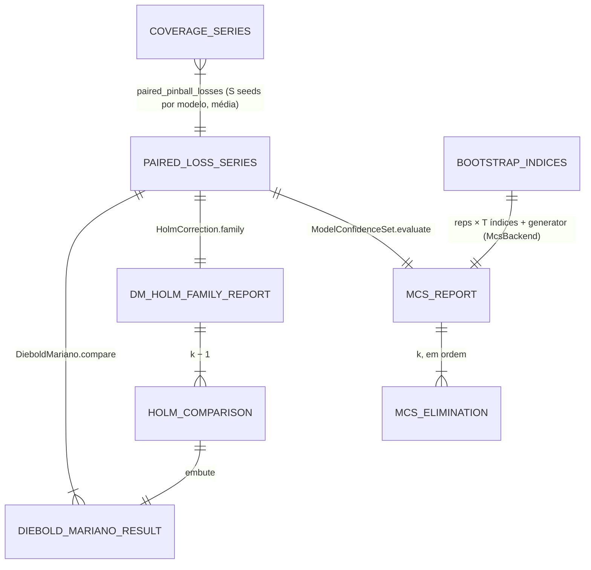

# Concept — Stage 6.2 — Inferência pareada (DM/HLN, Holm, MCS)

> **Escopo deste documento:** o que será feito nesta Stage, por quê, e
> decisões técnicas relevantes para entender o "porquê". O plano executável
> fica no [`technical.md`](./technical.md) correspondente.
>
> **Camada teórica.** Fórmulas e convenções vêm do doc de domínio
> [`probabilistic-forecast-evaluation.md`](../../domain/evaluation/probabilistic-forecast-evaluation.md)
> (`accepted`): §6 inteiro, §2.4 (notação), §2.7 (por horizonte), §9.3
> (vocabulário órfão), §10 #13–#19 e #30, §10.1 (B-FAMILIA, B-DM, B-MCS,
> B-FOLDS, B-SEEDS) e §11.3 (mecânica de `dm.test`, `statsmodels`, `arch`), mais o
> [ADR 0.0.0010](../../adr/0_0_0010-paired-inference-dm-holm-mcs.md). Este concept
> **não re-deriva** teoria: cita a seção e fixa só o contrato de implementação.
> A regra de onde mora estatística sem biblioteca Python é a decisão humana do
> [ADR 0.0.0056](../../adr/0_0_0056-own-statistics-in-domain-r-oracle-as-fixtures.md).

## 1. Escopo

### Dentro do escopo

- **VO `PairedLossSeries`** — matriz T × k de perdas de k ≥ 2 modelos nomeados, um
  horizonte, `target_timestamp`s comuns e estritamente crescentes, T > h; **valida**
  o alinhamento, nunca o monta
  ([ADR 6.2.0001](../../adr/6_2_0001-paired-loss-series-single-aligned-matrix-vo.md)).
- **Fábrica `paired_pinball_losses`** (`domain/services/paired_pinball_losses.py`) —
  L_t de cada modelo via `PinballScore.per_point_losses`, com **média ponto a ponto
  entre as S seeds** do modelo (doc §6.9 B-SEEDS; regra de domínio, não montagem).
- **`student_t.py`** — CDF da t de Student em stdlib (beta incompleta regularizada),
  arquivo próprio ([ADR 6.2.0002](../../adr/6_2_0002-student-t-p-value-stdlib-in-domain.md)).
- **`DieboldMariano`** — d_t = L_cand − L_comp; janela retangular com lag h − 1
  (Bartlett como sensibilidade); fator HLN Eq. (9); p-valor unilateral pela
  t_{T−1}, H1: E[d] < 0; fallback do oráculo para h = 1 quando a variância é ≤ 0
  com h > 1, registrado no resultado (doc §6.1, §6.3; conv. #14/#14b).
- **`HolmCorrection`** — step-down com "≤", p-valores ajustados por máximo
  acumulado truncado em 1; a **família** de um horizonte = candidato contra
  **todos** os demais modelos da mesma `PairedLossSeries` (doc §6.4, B-FAMILIA).
- **`ModelConfidenceSet`** — procedimento 'R' de HLN 2011 no domínio (variância
  única, eliminação e_R, p-valor MCS = máximo acumulado, pertença p̂ ≥ α) sobre um VO
  **`BootstrapIndices`** que carrega a proveniência do gerador; pré-condição
  var(L_i − L_j) > 0 validada **aqui**; regra de bloco l = max(h, ⌈max b̂_sb⌉)
  ([ADR 6.2.0004](../../adr/6_2_0004-mcs-procedure-in-domain-over-backend-bootstrap-indices.md),
  [ADR 6.2.0005](../../adr/6_2_0005-mcs-block-length-ceiling-integer.md)).
- **Port-out `InferenceBackend`** (DM + Holm) com adapter `StatsmodelsHac`
  (`adapters/out/inference/statsmodels_hac.py`), fake e suíte de contrato
  `[fake, statsmodels]` ([ADR 6.2.0003](../../adr/6_2_0003-dm-holm-of-record-statsmodels-oracle-no-dm-wrapper.md)).
- **Port-out `McsBackend`** com **dois** métodos (b̂_sb de Politis–White; índices de
  bootstrap estacionário/moving-block) e validador único de domínio; adapter
  `ArchMcs` (`adapters/out/inference/arch_mcs.py`, gerador de registro dos índices
  confirmatórios), fake e suíte `[fake, arch]` (ADR 6.2.0004). Consumido em produção
  pela 6.4.
- **Oráculo R `dm.test`** como fixtures versionadas em `tests/fixtures/r_oracle/`, no
  **formato do Step** fixado aqui (`<unit>.json` com proveniência e entradas exatas,
  `<unit>.R`, `<unit>.sessionInfo.txt`, `Dockerfile` de duas linhas), lidas por teste
  de **integração**; teste de proveniência sobre **todo** `r_oracle/*.json`; o CI não
  roda R ([ADR 6.2.0006](../../adr/6_2_0006-r-oracle-fixtures-provenance-and-scope.md)).
- **Testes por camada:** unit só com fixtures analíticas (sem I/O, sem adapter/lib);
  contrato para os ports; integração para fixtures R, proveniência e `arch.MCS`
  (D7).
- **Dependências:** `arch>=8,<9` (nova) e `statsmodels>=0.15,<0.16` (hoje 0.14.6
  transitiva via statsforecast, que exige `>=0.14.5`), em `dependencies`.
- **Contrato import-linter novo** `evaluation-no-inference-lib-leak`: proíbe `arch`
  e `statsmodels` em `evaluation.{application,domain}` (`scipy`/`numpy` já estão no
  `evaluation-no-scoring-lib-leak`; `pandas` no `store-no-storage-leak`).
- **Edições de documentação no PR desta Stage** (autoridade em D9):
  - `roadmap.md` §Stage 6.2: vocabulário órfão ("gates A/B/C/F", "top-50") trocado
    pelas convenções do doc §9.3 (ADR 0.0.0054); `arquivos_a_criar`,
    `contratos_introduzidos` e `contratos_consumidos` alinhados a D1–D7;
  - `roadmap.md` §Stage 6.4 `contratos_consumidos` com `McsBackend` (já aplicado no
    working tree desta Fase, a pedido da sessão mestra);
  - doc de domínio §11.3 e §10.1 (B-MCS): colunas `"stationary"`/`"circular"` de
    `optimal_block_length` (não `b_sb`/`b_cb`); fallback do `dm.test` também com
    dv = 0, apesar da mensagem "Variance is negative"; empate exato na eliminação do
    `arch` remove o modelo-linha **e** o modelo-coluna do primeiro par empatado
    (possivelmente o melhor dos dois); §6.5/§10 #16b: ⌈·⌉ no bloco; localizadores de
    Politis & White (SB em §3.1 p. 55; b_opt na §3.2 Eq. (6));
  - `overview.md` §7 e §8 R-LIBS-1 alinhados ao ADR 0.0.0056 e ADR 0.0.0020 com a
    nota "Amended by 0.0.0056" (já aplicados no working tree, decisão humana); §10:
    Bernardi & Catania (2018) como fonte consultada e descartada como oráculo de
    pertença; NIST DLMF §8.17 (fonte do algoritmo da t);
  - `LAYOUT.md` §2: `tests/fixtures/` e `tests/architecture/` na árvore.

### Fora do escopo (explicitamente)

- **Montar as séries a partir do silver:** join, dedup operationally-latest,
  interseção de `target_timestamp`, checagem de contiguidade → **6.4**. A 6.2 recebe
  `CoverageSeries` alinhadas (por seed) ou perdas prontas. Nada do BC `modeling` é
  importado.
- **Orquestrar o MCS** (b̂_sb por par via `McsBackend`, regra de bloco, índices,
  chamada ao domínio) e **persistir** DM/Holm/MCS em gold → **6.4**. Nenhum use case.
- **Christoffersen, Kupiec, VaR descritivo e o χ²** → **6.3** (que segue o formato
  de fixture R do ADR 6.2.0006 e a regra do ADR 0.0.0056).
- **Pré-registro e scorecard:** valores de α (Holm e MCS), reps, seed, lista e valores
  das sensibilidades (inclusive como arredondar √T), forma lógica do veredito,
  diagnóstico de estacionariedade de d_t, reporte do tamanho esperado de HLN
  (Table 1) → **6.5**.
- **Perfis descritivos** (DM por τ, por fold, por seed; fração de seeds que rejeita):
  computáveis pelos primitivos; orquestração e persistência são da 6.4/6.5.
- **TOST/equivalência** (doc §6.10), **StepM, SPA, Reality Check** (doc §6.4),
  estatística MCS **'max'** (doc §6.5), bandwidth automático Newey–West (doc §6.1):
  não adotados.
- **`dm_wrapper.py`** e **`mcs_cases.json`** do roadmap: não criados (D3, D6).

### Vínculo com o roadmap

Segunda Stage do Step 6 ("evidência confirmatória academicamente defensável e
auditável, com cada número conferível contra o R/paper" — [`roadmap.md`](../../roadmap.md)
Step 6). Entrega o eixo **H2** ("supera os naive? supera/empata os fortes?") do
[`overview.md`](../../overview.md) §4, lido pelo veredito por horizonte do doc §8.6;
sem ela a 6.4 não tem o que persistir em `dm_results`/`mcs_results` e a 6.5 não tem
o eixo inferencial do scorecard. Mitiga o "bug de eliminação" do MCS do projeto
antigo (overview §2) com a regra correta de HLN 2011 verificada contra `arch`.

## 2. Objetivo da Stage

Ao final desta Stage, dada uma `PairedLossSeries` de um horizonte, o domínio
`evaluation` devolve — sem biblioteca externa — o DM/HLN unilateral de cada par
(candidato, comparador), a correção de Holm sobre os comparadores do horizonte e o
Model Confidence Set 'R' com pertença pela Definition 4/Theorem 3 de HLN 2011,
cada número conferido contra fixtures versionadas do R `dm.test`, contra
`statsmodels` e contra `arch` com a mesma seed e o mesmo bloco.

## 3. Contexto e premissas

### Contexto

A 6.1 entregou `CoverageSeries` e `PinballScore.per_point_losses` (L_t por ponto).
O doc de domínio (ratificado em 2026-09-26, issue #78) e o ADR 0.0.0010 fixaram toda
a teoria desta Stage. A issue #114 pesquisou as versões correntes dos oráculos
(`forecast` 9.0.2 no CRAN, 8.23.0 na imagem; `arch` 8.0.0; `statsmodels` 0.15.0) e
abriu quatro forks de convenção (R1–R4), resolvidos aqui por `evidence-resolution`
(§7), mais dois que a leitura do código do `arch` fez surgir (R5, R6). O Checkpoint A
(rodada 1) trouxe uma decisão humana — ADR 0.0.0056 — que fecha a divergência entre
overview §7/§8, ADR 0.0.0020 e o padrão da 6.1 sobre onde mora estatística sem
biblioteca Python.

### Premissas

- As séries chegam **alinhadas** da 6.4: interseção exata de `target_timestamp`
  entre todos os modelos do horizonte, contígua, 1 obs/ponto, folds concatenados
  (doc §6.7–§6.8).
- As perdas são L_t na escala ρ_τ (doc §2.3), logo finitas e ≥ 0.
- A escala do piloto (T ≈ 10³, k = 7, reps ≥ 1000) deve caber em laços stdlib
  (ordem de reps × T × k ≈ 7·10⁶ somas por MCS) — a medir no technical, vezes as
  sensibilidades.
- Com dados contínuos, empates exatos nas estatísticas do MCS têm probabilidade
  desprezível; a regra de empate existe para determinismo.

### Dependências

- `6.1-scoring-and-calibration-metrics` (`done`): `CoverageSeries` (ADR 6.1.0002),
  `PinballScore.per_point_losses` (L_t), o predicado único `is_finite_number`
  (`value_objects/_finite_number.py`, fix F1 da auditoria), o padrão "domínio de
  registro + biblioteca como oráculo atrás de port" (ADR 6.1.0001), o validador único
  chamado por domínio, fake e adapter (`scoring_input_validation`) e o baseline
  transitório de `port-coverage` entre port e primeiro adapter (ADR 6.1.0005). Nenhum
  `[finding]` da §7 do technical da 6.1 foi escalado para a 6.2.

## 4. Contratos

### Introduzidos

- **`PairedLossSeries`** (`value-object`, frozen, stdlib) —
  `evaluation/domain/value_objects/paired_loss_series.py`

  ```python
  @dataclass(frozen=True)
  class PairedLossSeries:
      horizon: int                                   # >= 1
      models: tuple[str, ...]                        # k >= 2, nomes únicos não-vazios, ordem fixa
      target_timestamps: tuple[str, ...]             # T >= 2 e T > horizon, estritamente crescentes
      losses: tuple[tuple[float, ...], ...]          # uma coluna por modelo, len T; finitas, >= 0
      @property
      def n_points(self) -> int: ...
      def losses_of(self, model: str) -> tuple[float, ...]: ...
      def differential(self, first: str, second: str) -> tuple[float, ...]:  # L_first − L_second
          ...
      def model_pairs(self) -> tuple[tuple[str, str], ...]:  # pares não-ordenados, na ordem de `models`
          ...
  ```

- **`paired_pinball_losses`** (`domain-service`) — `domain/services/paired_pinball_losses.py`

  ```python
  def paired_pinball_losses(
      series_by_model: Mapping[str, Sequence[CoverageSeries]],   # modelo -> S >= 1 séries (seeds)
  ) -> PairedLossSeries
      # coluna = média ponto a ponto de PinballScore.per_point_losses sobre as S séries
      # (S = 1: identidade); todas as séries (de todos os modelos e seeds) com o mesmo
      # horizon, target_timestamps e levels; ordem dos modelos = do mapping
  ```

- **`student_t_cdf`** (`domain-service`, função pura) — `domain/services/student_t.py`

  ```python
  def student_t_cdf(x: float, df: float) -> float
      # P(T_df <= x); df >= 1 e x finito (ValueError); não convergir no teto de
      # iterações do Lentz -> ArithmeticError
  ```

- **`DieboldMariano`** (`domain-service`) — `domain/services/diebold_mariano.py`

  ```python
  class DmVarianceEstimator(StrEnum):
      RECTANGULAR = "rectangular"      # "acf" do R; convenção #14
      BARTLETT = "bartlett"            # sensibilidade

  @dataclass(frozen=True)
  class DieboldMarianoResult:          # __post_init__ valida coerência (I5)
      horizon: int                     # h pedido
      horizon_used: int                # h efetivo (1 se houve fallback)
      fallback_applied: bool           # ⇔ horizon_used != horizon
      variance_estimator: DmVarianceEstimator
      n_points: int                    # T
      mean_differential: float         # d̄; < 0 favorece o candidato
      long_run_variance: float         # var̂(d̄) = (γ̂0 + 2 Σ_{k=1}^{h_used−1} w_k γ̂k) / T  (> 0)
      statistic: float                 # S1* = HLN(T, h_used) · d̄ / sqrt(var̂)
      degrees_of_freedom: int          # T − 1
      p_value: float                   # P(t_{T−1} <= S1*)  — H1: E[d] < 0

  def diebold_mariano(*, candidate_losses: Sequence[float], comparator_losses: Sequence[float],
                      horizon: int,
                      variance_estimator: DmVarianceEstimator = DmVarianceEstimator.RECTANGULAR,
                      ) -> DieboldMarianoResult          # primitivo (serviço e fake)

  class DieboldMariano:
      @staticmethod
      def compare(series: PairedLossSeries, *, candidate: str, comparator: str,
                  variance_estimator: DmVarianceEstimator = DmVarianceEstimator.RECTANGULAR,
                  ) -> DieboldMarianoResult
  ```

- **`HolmCorrection`** (`domain-service`) — `domain/services/holm_correction.py`

  ```python
  def holm_adjust(p_values: Sequence[float]) -> tuple[float, ...]      # ordem de entrada preservada
  def holm_reject(p_values: Sequence[float], *, alpha: float) -> tuple[bool, ...]  # p̃ <= alpha

  @dataclass(frozen=True)
  class HolmComparison:
      comparator: str
      dm: DieboldMarianoResult
      adjusted_p_value: float
      rejected: bool

  @dataclass(frozen=True)
  class DmHolmFamilyReport:
      # __post_init__ (ValueError): m = len(comparisons) >= 1; comparadores únicos e
      # != candidate; todo dm com o mesmo horizon/n_points do relatório e
      # dm.variance_estimator == variance_estimator; adjusted_p_value de cada um ==
      # holm_adjust(p-valores dos dm, na ordem de comparisons); rejected ⇔ adjusted <= alpha
      horizon: int
      n_points: int
      candidate: str
      alpha: float
      variance_estimator: DmVarianceEstimator
      comparisons: tuple[HolmComparison, ...]   # na ordem de series.models

  class HolmCorrection:
      @staticmethod
      def family(series: PairedLossSeries, *, candidate: str, alpha: float,
                 variance_estimator: DmVarianceEstimator = DmVarianceEstimator.RECTANGULAR,
                 ) -> DmHolmFamilyReport          # 1 DM por comparador + Holm sobre os m = k − 1
  ```

- **`BootstrapIndices`** (`value-object`) — `domain/value_objects/bootstrap_indices.py`

  ```python
  class BootstrapScheme(StrEnum):
      STATIONARY = "stationary"          # primário (B-MCS)
      MOVING_BLOCK = "moving_block"      # sensibilidade (esquema de HLN 2011)

  def validate_bootstrap_request(*, n_obs: int, block_size: int, reps: int, seed: int,
                                 scheme: BootstrapScheme) -> None
      # validador único (VO, fake, adapter): n_obs >= 2; block_size >= 1; reps >= 1;
      # seed int não-bool; scheme conhecido; moving_block exige block_size < n_obs

  def validate_block_length_request(series: Sequence[float]) -> None
      # validador único de optimal_block_length (fake, adapter): tamanho mínimo
      # (medido no technical), valores finitos, série não constante

  @dataclass(frozen=True)
  class BootstrapIndices:               # __post_init__: validate_bootstrap_request + cada linha
      scheme: BootstrapScheme           # len n_obs, 0 <= i < n_obs; generator não-vazio
      block_size: int
      seed: int
      n_obs: int
      generator: str                    # proveniência, ex. "arch 8.0.0 StationaryBootstrap / numpy default_rng"
      indices: tuple[tuple[int, ...], ...]   # reps × n_obs
      @property
      def reps(self) -> int: ...
  ```

- **`ModelConfidenceSet`** (`domain-service`) — `domain/services/model_confidence_set.py`

  ```python
  MIN_MCS_REPS: Final = 1000

  @dataclass(frozen=True)
  class McsElimination:
      model: str
      step_p_value: float               # P_{H0,M_i} do passo (1.0 para o sobrevivente final)
      mcs_p_value: float                # máximo acumulado na ordem de eliminação (Def. 4)

  @dataclass(frozen=True)
  class McsReport:                      # __post_init__: I9
      horizon: int
      n_points: int
      alpha: float
      statistic: str                    # sempre "R"
      scheme: BootstrapScheme
      block_size: int
      reps: int
      seed: int
      generator: str                    # copiado do BootstrapIndices
      eliminations: tuple[McsElimination, ...]   # k entradas, ordem de eliminação, último = sobrevivente
      included: tuple[str, ...]                  # {m : mcs_p_value >= alpha}, na ordem de series.models

  class ModelConfidenceSet:
      @staticmethod
      def block_length(series: PairedLossSeries, *,
                       block_estimates: Mapping[tuple[str, str], float]) -> int
          # max(h, ceil(max b̂_sb)); uma estimativa finita >= 0 por par de series.model_pairs()
      @staticmethod
      def evaluate(series: PairedLossSeries, *, bootstrap: BootstrapIndices,
                   alpha: float) -> McsReport
  ```

- **`InferenceBackend`** (`port-out`, `Protocol`) — `application/ports/out/inference_backend.py`

  ```python
  class InferenceBackend(Protocol):
      def diebold_mariano(self, *, candidate_losses: Sequence[float],
                          comparator_losses: Sequence[float], horizon: int,
                          variance_estimator: DmVarianceEstimator) -> DieboldMarianoResult: ...
      def holm_adjusted(self, *, p_values: Sequence[float]) -> tuple[float, ...]: ...
      def holm_rejected(self, *, p_values: Sequence[float], alpha: float) -> tuple[bool, ...]: ...
  ```

- **`McsBackend`** (`port-out`, `Protocol`) — `application/ports/out/mcs_backend.py`

  ```python
  class McsBackend(Protocol):
      def optimal_block_length(self, *, series: Sequence[float]) -> float: ...   # b̂_sb, finito, >= 0
      def bootstrap_indices(self, *, n_obs: int, block_size: int, reps: int, seed: int,
                            scheme: BootstrapScheme) -> BootstrapIndices: ...
  ```

- **Adapters:**
  - `StatsmodelsHac` (`adapters/out/inference/statsmodels_hac.py`): OLS de d sobre
    constante, `get_robustcov_results(cov_type='HAC', kernel='uniform'|'bartlett',
    maxlags=h−1, use_correction=False)`; lê `cov_params()` e **checa o sinal ele
    mesmo** (o statsmodels devolve variância negativa sem erguer) para o mesmo
    fallback; fator HLN e `scipy.stats.t` aplicados por fora;
    `multipletests(method='holm')` explícito (`holm_rejected` = `reject` do
    statsmodels).
  - `ArchMcs` (`adapters/out/inference/arch_mcs.py`):
    `StationaryBootstrap`/`MovingBlockBootstrap` sobre `np.arange(n_obs)` com seed
    `int`, exatamente como o `arch.MCS` monta o seu, `generator` =
    `"arch <versão> <classe> / numpy default_rng"`; `optimal_block_length(...)["stationary"]`.
  - Fakes em `tests/fakes/features/evaluation/`: o de inferência delega aos
    primitivos do domínio; o de MCS gera índices com `random.Random(seed)`
    (`generator = "stdlib random.Random"`) e devolve de `optimal_block_length` uma
    constante fixada na construção (default 1.0), após a mesma validação de entrada.
  - Validação de entrada única por port (domínio): a do DM/Holm (tamanhos,
    finitude, perdas ≥ 0, T > h, p-valores em [0, 1], α em (0, 1)),
    `validate_bootstrap_request` e `validate_block_length_request(series)` (tamanho
    mínimo — medido no technical —, valores finitos, série **não constante**: o
    `arch` 8.0.0 devolve `nan` ou um número espúrio numa série constante, enquanto o
    fake devolveria a sua constante) — chamadas pelos primitivos, pelo fake e pelo
    adapter, no módulo `domain/value_objects/bootstrap_indices.py`.

### Consumidos

- **`CoverageSeries`** e **`PinballScore.per_point_losses`** — declarados na
  `6.1-scoring-and-calibration-metrics` (concept 6.1 §4, §8). Mesmo slice: nenhuma
  aresta nova no `bc-independence`.
- **`is_finite_number`** — predicado privado do slice (6.1, auditoria F1).
- O `roadmap.md` lista também `ScopeSpec/dedup (5.1)`; **não** é consumido (o dedup é
  premissa de montagem da 6.4 — issue #114 §Fora do escopo) e sai da lista no PR.

## 5. Invariantes e regras

- **I1 — Por horizonte, sempre.** Todo serviço recebe **uma** `PairedLossSeries` com
  um `horizon`; nenhuma família de Holm nem MCS mistura horizontes (doc §2.7, §6.4;
  overview §7).
- **I2 — Invariantes do VO na construção** (ADR 6.2.0001): `horizon ≥ 1`; k ≥ 2 com
  nomes únicos e não-vazios; T ≥ 2 e **T > h** (divergência deliberada do R, que aceita
  h = T: com h = T a variância retangular e o fator HLN são identicamente 0 e o
  fallback fica decidido por ruído de arredondamento); `target_timestamps`
  estritamente crescentes (1 obs por ponto — antigo "gate F"); toda coluna com T
  valores finitos e ≥ 0. O VO **não** checa var(L_i − L_j) > 0 (é pré-condição do
  MCS — I8): um par degenerado de comparadores não bloqueia DM/Holm do horizonte. Isso
  diverge da redação do DoD da issue #114 ("`PairedLossSeries` rejeita … diferencial
  com variância nula"), que o doc (§6.5, #16) põe no MCS.
- **I3 — Loss pareada = L_t** (antigo "gate A"): a fábrica usa só
  `PinballScore.per_point_losses`, média ponto a ponto entre as seeds de cada modelo,
  e exige mesmo horizonte, timestamps e grade em todas as séries (doc §2.4, §6.4,
  §6.7, §6.9). A garantia vale **pela fábrica**; o construtor aceita quaisquer perdas
  ≥ 0 (testes, perfis).
- **I4 — DM segue o oráculo** (doc §6.1, §6.3, §11.3; conv. #14/#14b): d = L_cand −
  L_comp; γ̂_k com divisor T; retangular (γ̂0 + 2Σγ̂_k)/T ou Bartlett (pesos
  1 − k/h); fator HLN ((T + 1 − 2h + h(h − 1)/T)/T)^{1/2}; p = `student_t_cdf(S1*, T − 1)`;
  variância ≤ 0 com h > 1 (inclusive = 0) → recalcula **tudo** com h = 1 e marca
  `fallback_applied`; com h = 1 é erro (C3). Somas com `math.fsum`. Divergências
  deliberadas do R: T > h e perdas negativas rejeitadas (o R pontuaria |L|).
- **I5 — `DieboldMarianoResult` coerente:** `fallback_applied ⇔ horizon_used ≠
  horizon`; `horizon_used ∈ {horizon, 1}`; `degrees_of_freedom = n_points − 1`;
  `long_run_variance > 0`; `p_value ∈ [0, 1]`.
- **I6 — Holm** (doc §6.4; Holm 1979 Scheme 1): p̃_(k) = max_{j≤k} min(1,
  (m − j + 1)·p_(j)), na ordem de entrada; a rejeição **de registro** é p̃ ≤ α
  (equivale ao step-down com "≤" em aritmética exata); empates dão o mesmo resultado em
  qualquer ordem. O `reject` do statsmodels compara por divisão: a paridade exata na
  fronteira só é exigida para α ∈ {0,01; 0,025; 0,05; 0,10; 0,20} e m ≤ 7.
- **I7 — Família fechada por construção** (B-FAMILIA; antigo "gate C"):
  `HolmCorrection.family` roda um DM do candidato contra **cada** outro modelo da
  mesma `PairedLossSeries` (m = k − 1) — mesma amostra pareada para todos; nenhum
  filtro por H1 dos comparadores (doc §6.4). **Sem seleção entre candidatos** (antigo
  "gate B"): a API recebe um único `candidate: str`; nenhum serviço recebe uma lista
  de candidatos.
- **I8 — MCS 'R'** (HLN 2011 Defs. 2/4, Thm 3; ADR 6.2.0004): pré-condições —
  `alpha ∈ (0, 1)` sem default, `bootstrap.reps ≥ MIN_MCS_REPS`, `bootstrap.n_obs ==
  T`, **nenhum par com diferencial constante** e **nenhum var̂(d̄_ij) ≤ 0**; variância
  estimada **uma vez** pelo bootstrap recentrado; por passo, T_R = max t_ij sobre os
  incluídos e p-valor do passo = fração de réplicas com T_R < T*_R; elimina o
  modelo-linha do máximo (empate exato → **um** modelo, o primeiro modelo-linha na
  ordem de `series.models`); p-valor MCS = máximo acumulado, sobrevivente com 1;
  **pertença ⇔ p̂ ≥ α**.
- **I9 — `McsReport` coerente:** k eliminações com nomes = `series.models`;
  `mcs_p_value` = máximo acumulado de `step_p_value`; último = 1.0; `included` = {m :
  `mcs_p_value` ≥ `alpha`}; `statistic == "R"`; scheme/block/reps/seed/generator iguais
  aos do `BootstrapIndices`.
- **I10 — Regra de bloco** (B-MCS; ADR 6.2.0005): l = max(h, ⌈max b̂_sb⌉) inteiro, uma
  estimativa finita ≥ 0 por par de `series.model_pairs()` (b̂ = 0 é legítimo → l = h);
  mesmo l para estacionário e moving-block.
- **I11 — Domínio puro; libs só nos adapters.** `evaluation.{domain,application}`
  importam só stdlib (+ o VO do 4.3 já declarado); `arch`/`statsmodels`/`scipy`/
  `numpy`/`pandas` só em `adapters/out/inference/` — gates `domain-purity`,
  `evaluation-no-scoring-lib-leak`, `evaluation-no-inference-lib-leak` (novo),
  `store-no-storage-leak`, `check_layout.py`, mypy `--strict`.
- **I12 — Oráculo por unidade** (ADR 0.0.0021): `student_t_cdf` (analítico + R `pt`
  via fixtures + scipy via adapter), DM (R fixtures + statsmodels), Holm (analítico +
  statsmodels), MCS (analítico + `arch.MCS` com mesma seed/bloco/reps/esquema), com
  tolerâncias absoluta + relativa declaradas no technical. Fixture R sem proveniência
  ou com entrada que não faz round-trip exato reprova (ADR 6.2.0006).
- **I13 — Testes por camada** (LAYOUT §7; marcador "unit = sem I/O"): unit não lê
  arquivo nem importa adapter/biblioteca; bibliotecas só via adapters nos testes de
  contrato, ou importadas diretamente em `tests/integration/`.

## 6. Casos de erro e exceções

- **C1 — VO mal-formado** → `ValueError` na construção: `horizon < 1`; k < 2; nome
  vazio ou repetido; T < 2 ou **T ≤ h**; timestamps não estritamente crescentes;
  coluna com tamanho ≠ T; perda não-finita, não-número, `bool` ou negativa. Na
  fábrica: mapping com < 2 modelos, modelo sem séries, séries com horizonte,
  timestamps ou grade diferentes (entre seeds ou entre modelos).
- **C2 — Nome desconhecido.** `candidate`/`comparator` fora de `series.models`, ou
  candidato = comparador → `ValueError`.
- **C3 — DM primitivo inválido:** sequências de tamanhos diferentes, T < 2, valor
  não-finito ou **negativo**, `horizon < 1`, **`horizon ≥ T`**, ou variância ≤ 0 com
  h = 1 ("Variance of DM statistic is zero"; alcançável com diferencial constante,
  após o fallback se h > 1) → `ValueError`.
- **C4 — Holm inválido:** lista vazia, p-valor fora de [0, 1] ou não-finito,
  `alpha ∉ (0, 1)` → `ValueError`.
- **C5 — t inválida:** `df < 1` ou `x`/`df` não-finitos → `ValueError`; não
  convergência no teto de iterações → `ArithmeticError`.
- **C6 — MCS inválido** → `ValueError`: `alpha ∉ (0, 1)`; `bootstrap.reps <
  MIN_MCS_REPS`; `bootstrap.n_obs ≠ T`; **algum par com diferencial constante**;
  **algum var̂(d̄_ij) ≤ 0** (ex.: índices que reproduzem a amostra em toda réplica).
  `BootstrapIndices` com linha de tamanho ≠ `n_obs`, índice fora de [0, `n_obs`),
  `generator` vazio ou pedido inválido (`validate_bootstrap_request`: `n_obs < 2`,
  `block_size < 1`, `reps < 1`, seed não-`int`/`bool`, moving-block com `block_size ≥
  n_obs`) → `ValueError` na construção.
- **C7 — Regra de bloco inválida:** estimativa ausente para algum par, par
  desconhecido, estimativa **negativa** ou não-finita → `ValueError` (b̂ = 0 é válido).
- **C8 — Relatório incoerente** (`DieboldMarianoResult`, `DmHolmFamilyReport`,
  `McsReport` montados à mão violando I5/I7/I9, inclusive p-valor ajustado ≠
  `holm_adjust` dos dm, `rejected` incoerente com α, estimador misturado) →
  `ValueError` no `__post_init__`.
- **C9 — Paridade de erro no port:** C3/C4 e as entradas inválidas de `McsBackend`
  (`validate_bootstrap_request`; `validate_block_length_request`: série de
  `optimal_block_length` curta demais — mínimo medido no technical —, com valor
  não-finito ou **constante**) erguem `ValueError` no fake e no adapter real (provado
  nas suítes de contrato).
- **Não é erro:** fallback do DM (h > 1, variância ≤ 0) — `fallback_applied = True`,
  `horizon_used = 1`; MCS com todos os modelos incluídos (dados pouco informativos,
  doc §6.5); `PairedLossSeries` com um par de comparadores de diferencial constante
  (DM/Holm dos demais pares seguem; o MCS ergue).

## 7. Decisões técnicas relevantes

Forks triados por `evidence-resolution`: R1–R6 são **C** (convenção de método/lib,
anteriores a qualquer dado confirmatório). A regra transversal que R2 pressupunha foi
decidida pelo **humano** (ADR 0.0.0056, Checkpoint A rodada 1). Nenhum fork P aberto.

### D1 — Um VO T × k que valida, nunca monta; L_t com média entre seeds na fábrica
- **O quê:** `PairedLossSeries` serve DM (duas colunas), Holm (k − 1 DMs da mesma
  instância) e MCS (matriz); T > h; perdas ≥ 0; sem checagem de variância nula (é do
  MCS); fábrica `paired_pinball_losses(Mapping[str, Sequence[CoverageSeries]])` com
  média ponto a ponto das perdas entre seeds.
- **Por quê:** issue #114 reflexão 1(a)/(c); ADR 0.0.0020 (invariantes uma vez); doc
  §6.5/#16 (var > 0 é pré-condição do MCS), §6.7 (pareamento é da montagem), §6.9
  (B-SEEDS: média das perdas é regra de domínio), §11.3 (`dm.test` pontua |e|);
  medição do Checkpoint A (h = T indeterminado: sinal divergiu em 844/2000).
- **Fonte:** roadmap 6.2 (`PairedLossSeries`); doc §2.4, §6.4, §6.5, §6.7, §6.9, §11.3.
- **ADR:** [`6.2.0001`](../../adr/6_2_0001-paired-loss-series-single-aligned-matrix-vo.md)

### D2 — p-valor da t_{T−1} no domínio, em stdlib (fork R1)
- **O quê:** `student_t.py` com os dois ramos do `pt` do R (argumento complementar
  x²/(n + x²) calculado direto), fração contínua DLMF 8.17.22 + simetria 8.17.4, Lentz
  com teto de iterações; arquivo próprio (a 6.3 cria `chi_square.py` à parte).
- **Por quê:** a aproximação normal é anticonservadora; o p-valor via port partiria o
  DM entre camadas. Degraus 1 (ADR 0.0.0020/0.0.0056; doc §6.3) e 2 (mesma identidade
  do oráculo). A separação de módulos **reverte** a issue #114 §1(b) por decisão de
  orquestração (merge paralelo); unificar quando surgir a terceira distribuição.
- **Fonte:** issue #114 (R1); DLMF §8.17; R `src/nmath/pt.c` (verificados); medição do
  Checkpoint A (≤ 2,1e−12 em df 59–2499).
- **ADR:** [`6.2.0002`](../../adr/6_2_0002-student-t-p-value-stdlib-in-domain.md)

### D3 — DM/Holm de registro no domínio; statsmodels como oráculo; R como fixtures; sem `dm_wrapper.py` (fork R2)
- **O quê:** fórmulas em stdlib no domínio; `InferenceBackend` de primitivos com
  `StatsmodelsHac` como única perna real; o R `dm.test` entra como fixtures lidas por
  teste de integração; `dm_wrapper.py` não existe.
- **Por quê:** decisão humana do ADR 0.0.0056 (opção A) — fórmula de registro no
  domínio, port só onde há biblioteca Python, R como fixtures; o adapter checa o sinal
  da variância porque o statsmodels não ergue.
- **Fonte:** ADR 0.0.0056, 0.0.0020 (emendado), 6.1.0001; forecast 8.23.0 `R/DM2.R`
  (verificado); doc §11.3.
- **ADR:** [`6.2.0003`](../../adr/6_2_0003-dm-holm-of-record-statsmodels-oracle-no-dm-wrapper.md)

### D4 — MCS no domínio sobre índices de bootstrap; `McsBackend` de dois métodos (fork R5)
- **O quê:** o domínio computa o MCS 'R' a partir de um `BootstrapIndices` com
  proveniência do gerador; o `arch` (gerador de registro) fornece os índices — o
  **mesmo** fluxo que o `arch.MCS` usa — e b̂_sb; o `arch.MCS` inteiro é oráculo só no
  teste de integração. Pertença p̂ ≥ α (Thm 3); empate exato elimina **um** modelo;
  var̂ ≤ 0 e diferencial constante erguem. A 6.4 consome o `McsBackend` em produção.
- **Por quê:** issue #114 escopo 4; o DoD "bate com arch com a mesma seed e o mesmo
  bloco" só verifica algo se o domínio computa de forma independente; statsmodels e arch
  não cabem num mesmo Protocol; um método só-oráculo no port não teria consumidor nem
  paridade de erro. Degraus 1 e 2.
- **Fonte:** issue #114; ADR 0.0.0020/0.0.0056; `arch` 8.0.0
  `multiple_comparison.py`/`base.py` (verificados).
- **ADR:** [`6.2.0004`](../../adr/6_2_0004-mcs-procedure-in-domain-over-backend-bootstrap-indices.md)

### D5 — Bloco inteiro, arredondado para cima (fork R3)
- **O quê:** l = max(h, ⌈max b̂_sb⌉); mesmo l nos dois esquemas; os valores das demais
  sensibilidades (l = h, l = √T) são do pré-registro (6.5).
- **Por quê:** interface `int` do backend e moving-block exige inteiro (degrau 2);
  arredondar para cima preserva a direção conservadora do ADR 0.0.0010 (degrau 4).
- **Fonte:** `arch` 8.0.0 `base.py`; Politis & White 2004 §3.1 p. 55 (verificados).
- **ADR:** [`6.2.0005`](../../adr/6_2_0005-mcs-block-length-ceiling-integer.md)

### D6 — Formato das fixtures R do Step; R só para o DM (forks R4 e R6)
- **O quê:** `<unit>.json` (proveniência com chaves fixas + entradas de ponto flutuante
  como objetos `{"dec": %.17g, "hex": %a}` + saídas `%.17g`/erros),
  `<unit>.R`, `<unit>.sessionInfo.txt`, `Dockerfile` de duas linhas; teste de integração
  de proveniência e round-trip sobre todo `r_oracle/*.json` (a 6.3 se conforma).
  `mcs_cases.json` não é criado.
- **Por quê:** ADR 0.0.0021 ("version-pinned and documented per unit"); ADR 0.0.0056;
  tag não-latest do rocker fixa o snapshot CRAN; o hex elimina a dependência de dois
  parsers decimais; o pacote R `MCS` não é oráculo de pertença.
- **Fonte:** ADR 0.0.0021, 0.0.0056; rocker r-ver (verificado); issue #114.
- **ADR:** [`6.2.0006`](../../adr/6_2_0006-r-oracle-fixtures-provenance-and-scope.md)

### D7 — Testes por camada; nomes do roadmap mantidos (desvio de caminho declarado)
- **O quê:**
  - `tests/unit/features/evaluation/{test_dm_vs_r_oracle.py, test_mcs_vs_arch.py,
    test_holm_vs_statsmodels.py}` mantêm os nomes do roadmap, mas contêm **só fixtures
    analíticas** (DM à mão, MCS com perdas inteiras/diádicas, Holm 1979);
  - as comparações com biblioteca/R vão para `tests/contract/features/evaluation/
    test_{inference,mcs}_backend_contract.py` (via adapters) e
    `tests/integration/features/evaluation/{test_dm_r_oracle_fixtures.py,
    test_r_oracle_provenance.py, test_mcs_vs_arch.py}` (lê JSON; importa `arch`).
- **Por quê:** LAYOUT §7 e o marcador "unit = sem I/O" do `pyproject.toml`; 6.1
  `test_pinball_vs_oracle.py` (unit não importa lib). É **desvio de caminho** em relação
  ao espírito "vs oráculo" dos nomes do roadmap, registrado aqui e no roadmap do PR.
- **Fonte:** roadmap 6.2; LAYOUT §7; `pyproject.toml` (markers); concept 6.1 D7.

### D8 — Canal de emissão (último quilômetro)
- **O quê:** a Stage não persiste nem expõe métrica; o canal são os VOs de resultado
  (`DieboldMarianoResult`, `DmHolmFamilyReport`, `McsReport`), consumidos pelos
  builders gold da **6.4** (`dm_results.py`, `mcs_results.py`) e pelo scorecard da
  **6.5**. A verificação executável são as suítes de oráculo com as bibliotecas reais e
  as fixtures R; o e2e com dado real do silver é da 6.4.
- **Fonte:** roadmap 6.4/6.5; RUNBOOK Passo 10; concept 6.1 D6.

### D9 — Edições de documentação no PR (roadmap, doc de domínio, overview, LAYOUT)
- **O quê:** as listadas em §1 "Dentro do escopo".
- **Por quê / autoridade:** vocabulário órfão do roadmap §6.2 → ADR 0.0.0054;
  `arquivos_a_criar`/`contratos_*` do roadmap §6.2 e `contratos_consumidos` do §6.4 →
  os forks desta Stage (D1–D7, ADRs 6.2.0001–0006) e o ADR 0.0.0056 (decisão humana);
  overview §7/§8 e nota no ADR 0.0.0020 → ADR 0.0.0056; overview §10 → ADR 0.0.0003
  (fonte nova do doc de domínio vai ao overview no mesmo PR); doc de domínio §11.3 →
  divergências de biblioteca verificadas nesta Fase; LAYOUT §2 → a árvore passa a
  refletir `tests/fixtures/` e `tests/architecture/`.
- **Fonte:** issue #114 §Síntese e §Escopo item 7; Checkpoint A rodada 1.

## 8. Integrações

### Internas (com outras Stages/módulos)

- **6.1:** `CoverageSeries`, `PinballScore.per_point_losses`, `is_finite_number`.
- **6.3 (em paralelo):** sem dependência de código. Coordenação: t em `student_t.py`
  (aqui) e χ² em `chi_square.py` (lá, formas fechadas df 1/2), sem módulo comum; a 6.3
  segue o formato de fixture R do ADR 6.2.0006 (inclusive o `Dockerfile` de duas linhas,
  byte-idêntico) e o ADR 0.0.0056 (lê fixtures em teste, sem adapter); dependências
  novas (`arch`, `statsmodels`) só aqui.
- **6.4:** monta as `CoverageSeries` alinhadas (por seed) ou as perdas, consome o
  `McsBackend` em produção (b̂_sb por par → `block_length` → `bootstrap_indices` →
  `ModelConfidenceSet.evaluate`) e persiste os três relatórios.
- **6.5:** fixa α, reps, seed, sensibilidades e a forma do veredito; consome os
  relatórios.

### Externas

- **statsmodels 0.15** — `OLS(d, ones).fit().get_robustcov_results(cov_type='HAC',
  maxlags=h−1, kernel='uniform'|'bartlett', use_correction=False)` (não ergue com
  variância negativa: checar `cov_params()`); `stats.multitest.multipletests(pvals,
  alpha, method='holm')` (default é `'hs'`). Só no adapter.
- **scipy** (dependência do statsmodels) — `scipy.stats.t.cdf` no adapter.
- **arch 8.x** — `bootstrap.StationaryBootstrap`/`MovingBlockBootstrap(block_size,
  np.arange(n), seed=int)` (moving-block ergue com l > n), `optimal_block_length(x)
  ["stationary"]`; `MCS(losses, size, reps, block_size, method='R', bootstrap=...,
  seed=int)` só no teste de integração.
- **R 4.4.1 / forecast 8.23.0** (imagem `rocker/r-ver:4.4.1`) — `dm.test(e1, e2,
  alternative="less", h, power=1, varestimator)`; só offline, para gerar fixtures.

## 9. Modelo de dados



## 10. Riscos e mitigações

| Risco | Probabilidade | Impacto | Mitigação |
|---|---|---|---|
| Sinal/direção do DM trocados (H1 "candidato pior") | M | A | d = L_cand − L_comp fixado; fixtures R com `alternative="less"`, candidato melhor e pior; teste de sinal analítico. |
| p-valor da t impreciso em df pequenos ou caudas | M | A | Medição no technical em df 1–2500 e caudas antes de fixar a tolerância; três referências (analítica df = 1/2, R `pt`, scipy). |
| Fixture R regenerada sem proveniência, ou número que muda no caminho R → JSON → Python | M | M | Teste de integração sobre todo `r_oracle/*.json`: campos de proveniência, concordância com `sessionInfo`, `float(dec) == float.fromhex(hex)` (ADR 6.2.0006). |
| Fluxo de índices do adapter ≠ fluxo interno do `arch.MCS` | M | A | Adapter monta o bootstrap como o `arch.MCS` (`np.arange`, seed `int`); integração exige ordem de eliminação e p-valores idênticos. |
| Divergência domínio × `arch` por empate exato ou `>` vs `≥` | B | M | Comparação em dados sem empate; empate e fronteira p̂ = α testados analiticamente (perdas inteiras/diádicas) e declarados (ADR 6.2.0004). |
| Diferencial quase constante (amplitude no nível do ruído de float) passa pela checagem exata | B | M | Checagens exatas no MCS (diferencial constante, var̂ ≤ 0); risco declarado (ADR 6.2.0001); na prática L_t de modelos distintos não coincide. |
| MCS stdlib lento (reps × T × k, vezes as sensibilidades) | M | M | Medir no technical a T = 1000, k = 7, reps = 1000; fixtures de teste com T pequeno. |
| `arch` sem wheel para a plataforma do container | B | M | Medir no `uv lock`/`uv sync` do technical; `arch` 8.0.0 exige Python ≥ 3.10 e numpy < 3. |
| Reprodutibilidade confirmatória presa às versões de `arch`/`numpy` | M | M | `generator` no `BootstrapIndices`/`McsReport`; pins no `pyproject.toml`/`uv.lock`. |
| Conflito de merge com a 6.3 (`.importlinter`, `pyproject.toml`, `tests/fixtures/r_oracle/`, `roadmap.md`, `overview.md`) | M | M | Contrato novo em bloco próprio; deps só aqui; `Dockerfile` idêntico; rebase antes do PR (GIT-WORKFLOW Etapa 4). |
| `InferenceBackend` sem consumidor de produção removido "por limpeza" | B | M | Racional no ADR 6.2.0003; `port-coverage` exige a suíte. O `McsBackend` tem consumidor de produção declarado (6.4). |

## 11. Critérios de aceitação

- [ ] **A1** — `PairedLossSeries` ergue `ValueError` em cada caso de C1 (um teste por
  caso, incluindo T = h, T < h, perda negativa, nome repetido) e **aceita** uma série
  com um par de comparadores de diferencial constante (e o DM do candidato contra os
  demais roda); expõe `losses_of`, `differential` (sinal L_first − L_second) e
  `model_pairs` corretos para k = 3. (I1, I2)
- [ ] **A2** — `paired_pinball_losses`: com S = 1 as colunas são iguais a
  `PinballScore.per_point_losses`; com S = 3 a coluna é a média ponto a ponto das três;
  ergue com horizonte, timestamps ou grade divergentes entre seeds ou entre modelos, com
  modelo sem séries e com < 2 modelos. (I3)
- [ ] **A3** — `student_t_cdf`: x = 0 → 0,5; df = 1 igual a ½ + arctan(x)/π; df = 2
  igual a ½ + x/(2√(2 + x²)); simetria F(−x) = 1 − F(x); argumento complementar sem
  cancelamento para |x| pequeno; C5 ergue. O p-valor do DM do domínio concorda com o do
  `StatsmodelsHac` (`scipy.stats.t`) em todos os casos da suíte de contrato, sob
  tolerância absoluta + relativa declarada a partir da medição do technical. (I4, I12)
- [ ] **A4** — Unit (analítico): DM à mão (h = 1; h = 2 retangular e Bartlett; fator
  HLN; fallback; C3 com T = h, perda negativa, h > T). Integração: `diebold_mariano`
  reproduz **todas** as fixtures de `dm_test_cases.json` (estatística, p-valor,
  `horizon_used`, erros esperados) sob tolerância declarada, cobrindo h = 1 e h = 7,
  retangular e Bartlett, candidato melhor e pior, T pequeno, o fallback h > 1 → 1, o
  diferencial constante com h = 2 (fallback e depois erro) e os erros h > T e variância
  nula com h = 1; nenhum caso com h = T. (I4, I5, I12)
- [ ] **A5** — `tests/fixtures/r_oracle/` contém `dm_test_cases.{json,R,sessionInfo.txt}`
  e o `Dockerfile` com exatamente as duas linhas do ADR 6.2.0006; o teste de integração
  de proveniência percorre **todo** `r_oracle/*.json` e reprova chave obrigatória de
  `provenance` ausente (`generator`, `image`, `r_version`, `packages`,
  `cran_snapshot`, `generated_at`, `session_info`, `command`), versão ≠ `sessionInfo`,
  arquivo gerador/`sessionInfo` inexistente, ou objeto `{"dec", "hex"}` com formas de
  tamanho diferente ou cujo `dec` (`%.17g`) e `hex` (`%a`) não dão o mesmo double. No
  JSON, toda entrada de ponto flutuante (escalar ou vetor) é um objeto `{"dec", "hex"}`;
  inteiros (h, contagens, sequências 0/1) e strings ficam em JSON simples; saídas
  esperadas são números simples em `%.17g`; o teste genérico reconhece exatamente os
  objetos com as chaves `{"dec", "hex"}` (ADR 6.2.0006). (I12)
- [ ] **A6** — `holm_adjust`/`holm_reject` (unit, analítico): m = 1 = p bruto; máximo
  acumulado; truncamento em 1; ordem de entrada preservada; empates; fronteira p̃ = α
  rejeita. Contrato: concordância com `multipletests(method='holm')` via
  `StatsmodelsHac` em listas aleatórias de seed fixa, com paridade de `reject` para
  α ∈ {0,01; 0,025; 0,05; 0,10; 0,20} e m ≤ 7; C4 ergue nas duas pernas. (I6, I12)
- [ ] **A7** — `HolmCorrection.family` numa série k = 7 devolve 6 comparações (todos
  os demais modelos, na ordem do VO), cada `dm` igual a `DieboldMariano.compare` sobre a
  mesma série; C2 ergue; `DmHolmFamilyReport` montado à mão com comparador repetido,
  candidato entre os comparadores, `n_points` misturados, estimador misturado,
  `adjusted_p_value` ≠ `holm_adjust` dos dm ou `rejected` incoerente com α ergue; a API
  pública não tem parâmetro que receba mais de um candidato (antigo "gate B"). (I7, C8)
- [ ] **A8** — Integração (`tests/integration/features/evaluation/test_mcs_vs_arch.py`,
  importa `arch`): com T = 250, k = 4, reps = 1000, seeds {1, 7}, blocos {3, 10} e os
  dois esquemas, sobre perdas sem empate, `ModelConfidenceSet.evaluate` sobre
  `ArchMcs.bootstrap_indices` dá a **mesma ordem de eliminação** e p-valores MCS
  **idênticos** (múltiplos de 1/reps) aos de `arch.MCS(..., method='R')` com os mesmos
  parâmetros. Não compara `included` (≥ vs `>` do arch — coberto em A9). (I8, I12)
- [ ] **A9** — Unit (analítico, índices montados à mão, perdas inteiras/diádicas):
  modelo claramente dominado eliminado primeiro; `mcs_p_value` = máximo acumulado dos
  `step_p_value`, último = 1; fronteira p̂ = α **incluída** (Thm 3); empate exato
  construído com perdas inteiras elimina **um** modelo, o primeiro modelo-linha na
  ordem do VO; C6 ergue (inclusive reps = 999, diferencial constante, índices que
  reproduzem a amostra → var̂ = 0, moving-block com `block_size = n_obs`); `McsReport`
  incoerente (I9) ergue. (I8, I9)
- [ ] **A10** — `ModelConfidenceSet.block_length`: max(h, ⌈max⌉) com estimativas
  fracionárias (h = 7 e máximo 9,2 → 10; h = 7 e máximo 3,4 → 7; h = 1 e máximo 0,0 →
  1); C7 ergue (par faltando, par desconhecido, estimativa negativa ou não-finita). (I10)
- [ ] **A11** — Suíte `[fake, statsmodels]` do `InferenceBackend` e suíte
  `[fake, arch]` do `McsBackend` verdes (índices: forma, faixa, determinismo por seed,
  seeds diferentes diferem, contiguidade do moving-block, wrap-around do estacionário,
  `generator` preenchido; b̂_sb finito e ≥ 0; o fake devolve a constante de construção);
  C9 ergue igual nas pernas, inclusive moving-block com `block_size ≥ n_obs` e
  `optimal_block_length` sobre série constante, não-finita ou curta demais
  (`validate_block_length_request`);
  `check_port_coverage.py` e `check_fake_parity.py` verdes sem entrada de baseline
  residual. (I12)
- [ ] **A12** — `pyproject.toml`/`uv.lock` declaram `arch>=8,<9` e
  `statsmodels>=0.15,<0.16`; `lint-imports` verde com o contrato novo
  `evaluation-no-inference-lib-leak` em `_EXPECTED_CONTRACTS` e **um caso de violação
  real por módulo proibido** (`arch`, `statsmodels`) em
  `tests/architecture/test_import_contracts.py`; nenhum teste unit importa `arch`,
  `statsmodels`, `scipy` ou um adapter, nem lê arquivo. (I11, I13)
- [ ] **A13** — Documentação: `roadmap.md` §Stage 6.2 sem "gate A/B/C/F" nem "top-50"
  (grep vazio na seção), com `arquivos_a_criar`/`contratos_*` alinhados a D1–D7;
  §Stage 6.4 com `McsBackend` em `contratos_consumidos`; doc de domínio §6.5, §10 #16b,
  §10.1 (B-MCS) e §11.3 corrigidos conforme §1; `overview.md` §7, §8 (R-LIBS-1) e §10
  e a nota do ADR 0.0.0020 conforme ADR 0.0.0056; `LAYOUT.md` §2 com `tests/fixtures/`
  e `tests/architecture/`. (D9)
- [ ] **A14** — Medições registradas na §7 do technical: precisão de `student_t_cdf`
  contra scipy em df 1–2500 e caudas (base da tolerância de A3); tempo do MCS stdlib a
  T = 1000, k = 7, reps = 1000; tamanho mínimo de série aceito por
  `optimal_block_length` (base de C9). (I12)
- [ ] **A15** — `make check` verde; cobertura ≥ 90 % global e por arquivo tocado da
  Stage; ADRs 6.2.0001–0006 e 0.0.0056 `accepted`. (I11)

## 12. Checklist de validação interna

- [x] Todos os contratos introduzidos têm assinatura definida? (§4)
- [x] Toda decisão em §7 tem fonte rastreável? (D1–D9)
- [x] Toda integração externa tem contrato definido (interface, formato, auth)? (§8 Externas: funções, parâmetros e armadilhas; sem auth)
- [x] Decisões com alternativa real descartada têm ADR escrito? (D1 → 6.2.0001; D2 → 6.2.0002; D3 → 6.2.0003 + 0.0.0056; D4 → 6.2.0004; D5 → 6.2.0005; D6 → 6.2.0006; D7 é desvio de caminho declarado, D8/D9 sem alternativa real)
- [x] Dependências de Stages anteriores estão satisfeitas (`done`)? (6.1 `done` no roadmap)
- [x] Stage cabe em ~3–12 Tasks (ver [`CONVENTIONS.md`](../../CONVENTIONS.md) §6)? (estimativa ~12: deps + contrato import-linter; t de Student; VO + fábrica; DM + testes analíticos; fixtures R + testes de integração; Holm + família; `BootstrapIndices` + MCS + regra de bloco; port `InferenceBackend` + fake; adapter statsmodels; port `McsBackend` + fake; adapter arch + integração com `arch.MCS`; documentação)
- [x] Riscos críticos têm mitigação plausível? (§10)
- [x] Cada mecanismo novo passou pelo **teste da solução mais direta**: não é caso especial/tipo/métrica novo remendando, local, um sintoma que recorre em outros consumidores e teria tratamento mais simples/geral em outra camada (concern compartilhado). — Os mecanismos são os do roadmap, sem caso especial: o pareamento/alinhamento temporal **não** é refeito aqui (interseção, contiguidade e dedup continuam donos da 6.4; o VO só verifica, sem "pareador" local que duplicaria a 6.4 e cruzaria para `modeling`); a média entre seeds entra na fábrica porque é regra de domínio (B-SEEDS), não montagem; um só VO serve DM, Holm e MCS; a família de Holm fica fechada por construção em vez de um checador de "mesma amostra"; a pré-condição de variância fica no único consumidor que a exige (MCS), sem bloquear DM/Holm; a t de Student é o piso da 6.2 num arquivo próprio e o χ² da 6.3 entra ao lado (sinal de captura registrado, unificação na terceira distribuição); o segundo port nasce de um fato mecânico (nenhuma biblioteca cobre as duas metades) e fica só com o que tem consumidor de produção; a regra "onde mora estatística sem lib Python" subiu para um ADR transversal (0.0.0056) em vez de ser decidida localmente.
- [x] A Stage reabre alguma convenção ratificada (doc §10, ADR 0.0.0010)? — Não: loss, família, fallback, estatística 'R', α_MCS, reps, variante do bootstrap e regra de bloco são consumidos; as decisões novas (R1–R6) fixam **onde** e **como** implementar e o arredondamento do bloco. A emenda de overview §7/§8 e do ADR 0.0.0020 é decisão humana (ADR 0.0.0056).

## 13. Questões em aberto

- Nenhuma que bloqueie a Fase 3B.
- Resolvido na rodada 1 do Checkpoint A: a 6.3 também lê as fixtures R em teste, sem
  adapter (ADR 0.0.0056); o `Dockerfile` é byte-idêntico (ADR 6.2.0006).
- `[finding]` candidato: unificar `student_t.py` e `chi_square.py` num módulo de
  distribuições quando o BC precisar de uma **terceira** distribuição (Stage que a
  introduzir).

## 14. Referências

- [`../../overview.md`](../../overview.md) — §2 (bug de eliminação), §4 (H2), §7
  (estatística no domínio, libs em adapters atrás de portas), §8 (R-LIBS-1), §10, §11.
- [`../../roadmap.md`](../../roadmap.md) — Stage `6.2-paired-inference-dm-mcs-holm`,
  vizinhas 6.1, 6.3–6.5.
- Doc de domínio: [`probabilistic-forecast-evaluation.md`](../../domain/evaluation/probabilistic-forecast-evaluation.md)
  §2.3, §2.4, §2.7, §6.1–§6.10, §8.6, §9.3, §10 (#13–#19, #30), §10.1, §11.3.
- ADRs consumidos: [0.0.0010](../../adr/0_0_0010-paired-inference-dm-holm-mcs.md),
  [0.0.0011](../../adr/0_0_0011-preregistration-invariants-and-h1-gate.md),
  [0.0.0020](../../adr/0_0_0020-statistics-in-domain-over-value-objects.md),
  [0.0.0021](../../adr/0_0_0021-per-unit-contract-tests-with-oracle.md),
  [0.0.0053](../../adr/0_0_0053-slices-as-modules-of-one-context-consumer-owned-ports.md),
  [0.0.0054](../../adr/0_0_0054-evaluation-domain-doc-scope-and-boundary.md),
  [6.1.0001](../../adr/6_1_0001-scoring-libraries-as-oracle-backend-behind-port.md),
  [6.1.0002](../../adr/6_1_0002-coverage-series-aligned-input-vo.md),
  [6.1.0005](../../adr/6_1_0005-transient-port-coverage-baseline-between-port-and-first-adapter.md).
- ADRs desta Stage: [0.0.0056](../../adr/0_0_0056-own-statistics-in-domain-r-oracle-as-fixtures.md)
  (transversal, decisão humana),
  [6.2.0001](../../adr/6_2_0001-paired-loss-series-single-aligned-matrix-vo.md),
  [6.2.0002](../../adr/6_2_0002-student-t-p-value-stdlib-in-domain.md),
  [6.2.0003](../../adr/6_2_0003-dm-holm-of-record-statsmodels-oracle-no-dm-wrapper.md),
  [6.2.0004](../../adr/6_2_0004-mcs-procedure-in-domain-over-backend-bootstrap-indices.md),
  [6.2.0005](../../adr/6_2_0005-mcs-block-length-ceiling-integer.md),
  [6.2.0006](../../adr/6_2_0006-r-oracle-fixtures-provenance-and-scope.md).
- Concept da dependência: [`../6.1-scoring-and-calibration-metrics/concept.md`](../6.1-scoring-and-calibration-metrics/concept.md).
- Externas: NIST DLMF §8.17; R `src/nmath/pt.c`; forecast 8.23.0 `R/DM2.R`;
  arch 8.0.0 `arch/bootstrap/{multiple_comparison,base}.py`; statsmodels 0.15
  `multipletests`/`get_robustcov_results`; rocker r-ver (versioned images);
  Bernardi & Catania (2018), DOI 10.1504/IJCEE.2018.091037.
- Issue [#114](https://github.com/MarceloSanC/financial-forecasting/issues/114).
