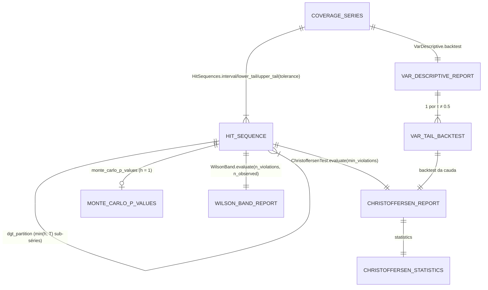

# Concept — Stage 6.3 — Backtests de calibração condicional e risco

> **Escopo deste documento:** o que será feito nesta Stage, por quê, e
> decisões técnicas relevantes para entender o "porquê". O plano executável
> fica no [`technical.md`](./technical.md) correspondente.
>
> **Camada teórica.** Toda fórmula e convenção vem do doc de domínio
> [`probabilistic-forecast-evaluation.md`](../../domain/evaluation/probabilistic-forecast-evaluation.md)
> (`accepted`): §4.4 (bandas), §4.5 (empates), §5.3 (máscara), §6.9 (seeds),
> §7.1–§7.7 (backtests), §8.5 (gate H1) e as convenções 9, 10, 19–24 e 30 da
> §10. Este concept **não re-deriva** teoria: cita a seção e fixa só o
> contrato de implementação.

## 1. Escopo

### Dentro do escopo

Contratos em §4; decisões em §7.

- Primitivo de violações `HitSequence` (com partição DGT) e o construtor
  `HitSequences` sobre a `CoverageSeries` da 6.1 — D1, D5.
- Predicados FA7 com dono único, extraídos do `CoverageMetrics` da 6.1 — D1.
- Kernels e serviços stdlib-only: `chi_square_sf`, `WilsonBand`,
  `kupiec_pof`, `ChristoffersenTest` (trio puro, leitura Kupiec, 3 estados,
  MC em h+1), `VarDescriptive` — D1, D6, D7.
- Rótulo descritivo do MPIW no `PairCoverage` da 6.1 — D10.
- Oráculo `rugarch::VaRTest` congelado como fixture R da unidade
  `var_test_cases`, lido por testes de integração, sem port — D3, D4.
- **Redação do roadmap** (linha da 6.3: vocabulário órfão sai, DoD reescrito,
  pedido de mudança da D2 aplicado; linha da 6.5: `contratos_consumidos`
  com os kernels da 6.3) e **precisão de mecânica no doc de domínio** (§7.6
  desempate de Dufour + referência condicionada; §7.7/§11.3/conv. 21 receita
  dos dois *feeds* e delimitação do escopo da conv. 21; registro
  `[decision:E]` em §10.1 e linha 22 da tabela), sem mudança de teoria;
  fontes novas (Dufour 2006; Berkowitz, Christoffersen & Pelletier 2011) em
  `overview.md` §10 e doc §11.2.

### Fora do escopo (explicitamente)

- **Valores** do pré-registro: par primário, níveis das bandas de Wilson
  (95 % isolado, 97,5 % por cauda), `min_violations`, `draws` e `seed` do
  Monte Carlo (com α(N+1) inteiro — D7), tolerância e limiar de degeneração,
  T mínimo → **6.5**.
- **Aplicação** do gate H1, das sensibilidades (3 estados, DGT + Bonferroni)
  e da escolha entre as variantes com/sem lacunas no perfil → **6.5**.
- **Média entre seeds**, fração de seeds que rejeita, pooling entre runs →
  **6.5** (B-SEEDS). Aqui tudo é **por série**; os kernels de contagem só
  **aceitam** contagens reais ([ADR 6.3.0005](../../adr/6_3_0005-count-kernels-accept-mean-counts.md)).
- Ler o silver, montar a `CoverageSeries`, persistir no gold → **6.4**.
- Inferência pareada (DM/MCS/Holm) → **6.2**. Zonas Basel no perfil e
  gráficos → 6.5/8.3.
- **ES** (exige backtest próprio — *non-goal* do roadmap, doc §7.5); teste DQ
  (Engle–Manganelli), LR_uc-HAC e o 3 estados como backtest completo
  (χ²(4)/χ²(6)) — descartados pelo doc (§7.2, §7.4).
- Calibração condicional no valor previsto (T-calibration/CORP, doc §9.2).
- Valores de VaR por linha (−q por ponto): nenhum consumidor os pede; o
  relatório carrega o nível de VaR de cada cauda.
- R como dependência de runtime ou CI; port/adapter para o oráculo
  (ADR 6.3.0002; ADR 0.0.0056, decisão humana de 2026-09-28, criada no PR
  da 6.2).
- Métricas heurísticas do projeto antigo (`prob_up`, a métrica heurística
  `confidence`, `expected_move`, `downside`, win-rate): **não existem** no
  slice `evaluation` e não serão criadas — não há nada a deletar.

### Vínculo com o roadmap

Step 6 — "evidência confirmatória academicamente defensável e auditável, com
cada número conferível contra o R/paper" ([`roadmap.md`](../../roadmap.md)).
Esta Stage entrega o **critério decisivo de H1** (banda de Wilson por cauda do
par primário — doc §8.5, [ADR 0.0.0011](../../adr/0_0_0011-preregistration-invariants-and-h1-gate.md)),
suas sensibilidades pré-registradas (LR_uc de 3 estados; partição DGT em h+7)
e o **perfil** de H1 (LR_ind/LR_cc, PICP com banda, VaR descritivo) —
[`overview.md`](../../overview.md) §4. Mitiga R-LIBS-1 (implementação própria
+ oráculo R + pin de versão + ADR de proveniência, na forma decidida pelo
humano — ADR 0.0.0056) e R-METRIC-1. A 6.4 (builders gold) e a 6.5
(scorecard) consomem os relatórios.

## 2. Objetivo da Stage

Ao final desta Stage, dada uma `CoverageSeries` de um (modelo, horizonte) e a
tolerância de degeneração, o domínio `evaluation` devolve — sem biblioteca
externa — as sequências de violações (intervalo, cauda inferior, cauda
superior, com ou sem lacunas, e a partição DGT), a banda de Wilson com
veredito "contém o nominal", o Kupiec POF, o trio LR_uc/LR_ind/LR_cc de
Christoffersen na convenção pura (com "não aplicável" como resultado), o
LR_uc de 3 estados, o p-valor Monte Carlo em h+1 e o backtest descritivo de
VaR por cauda, com cada estatística conferida contra fixture analítica e,
no caso de Christoffersen e Kupiec, contra `rugarch::VaRTest` congelado com
proveniência registrada.

## 3. Contexto e premissas

### Contexto

A 6.1 entregou a `CoverageSeries`, a cobertura marginal ĉ(τ), o PICP/MPIW por
par e o `DegeneracyGate`. Esses números dizem **quanto** o modelo cobre, não
se a cobertura é estatisticamente compatível com o nominal nem se as violações
vêm **agrupadas no tempo**. O doc de domínio (ratificado, #78) fixou a teoria:
hit sequences 2-estados por intervalo e unilaterais por τ (FC4), convenção
pura de condicionamento (FC5), χ² assintótico + MC em h+1 (FC6), h+7 com
LR_ind/LR_cc descritivos (B-H7), VaR descritivo (conv. 24), banda de Wilson
decisiva (B-BANDAS) e o gate H1 por cauda (B-GATE-H1).

A leitura do doc (§7.3 "é exatamente o LR_uc"; §7.5 "não há cálculo novo")
mostra que os três serviços do roadmap são **uma** matemática: o teste da
solução mais direta leva a um primitivo + um serviço de LR (D1).

### Premissas

- A `CoverageSeries` chega **deduplicada**, **pooled sobre folds** e com
  timestamps estritamente crescentes (6.1 I2; montagem da 6.4). A partição
  DGT e as transições usam a **posição** na série como tempo — a série é
  contígua por horizonte (doc §6.8, B-FOLDS).
- Retornos são contínuos: empates y = q̂ têm medida zero (doc §4.5); as
  convenções FA7 só importam em grade degenerada e nas fixtures analíticas
  (o oráculo R recebe violações prontas, sem empate).
- Escala do piloto: T ≈ 10³ pontos por série, ≤ 7 níveis; laços stdlib
  devem bastar. O custo do MC (N ≈ 10⁴ sorteios, com redraws do D7) **é
  medido** na Fase 3B/execução, não presumido.
- A imagem `ff-r-oracle:4.4.1` (R 4.4.1, `rugarch` 1.5.3, `jsonlite`) existe
  localmente e roda offline; o CI não roda R.

### Dependências

- `6.1-scoring-and-calibration-metrics` (`done`, mergeada — PR #112):
  `CoverageSeries` (`symmetric_pairs`, `symmetric_pair_indices`,
  `scored_values`, `target_timestamps`), `pair_miscoverage`/`pair_nominal`,
  `DegeneracyGate`/`DegeneracyReport` (tolerância absoluta obrigatória — ADR
  6.1.0003), `CoverageMetrics`/`CoverageReport`/`PairCoverage` (recebe o
  campo aditivo `mpiw_label` e passa a consumir os predicados FA7) e
  `is_finite_number` (predicado único do slice). A §7 do technical da 6.1
  não escalou nenhum `[finding]` para a 6.3; as `[decision]` de predicado
  único e de `symmetric_pair_indices` são reusadas aqui.

## 4. Contratos

### Introduzidos

- **Predicados FA7** (funções de módulo, `value_objects/coverage_series.py`,
  ao lado de `pair_miscoverage`):

  ```python
  def is_at_or_below(realized: float, quantile: float) -> bool      # 1{y ≤ q̂} (ĉ(τ); cauda inferior)
  def is_inside_closed(realized: float, lower: float, upper: float) -> bool  # [l ≤ y ≤ u] (PICP)
  ```

- **`HitSequence`** (`value-object`, frozen, stdlib-only) —
  `evaluation/domain/value_objects/hit_sequence.py`

  ```python
  class HitKind(StrEnum):
      INTERVAL = "interval"        # violação = not is_inside_closed(y, l, u); taxa = pair_miscoverage(τ_l)
      LOWER_TAIL = "lower_tail"    # violação = is_at_or_below(y, q̂_τ);      taxa = τ
      UPPER_TAIL = "upper_tail"    # violação = not is_at_or_below(y, q̂_τ);  taxa = 1 − τ

  @dataclass(frozen=True)
  class HitSequence:
      horizon: int                              # >= 1 (rótulo da série de origem)
      kind: HitKind
      levels: tuple[float, ...]                 # (τ_l, τ_u) em INTERVAL; (τ,) nas caudas
      violation_rate: float                     # p_viol em (0, 1), igual à regra do `kind` (exato)
      target_timestamps: tuple[str, ...]        # os das posições desta sequência
      violations: tuple[bool | None, ...]       # 1:1 com as posições; None = linha mascarada
      tolerance: float                          # a do gate que produziu a máscara
      degeneracy_rate: float                    # taxa do gate na série de origem (0..1)
      includes_degenerate: bool                 # True ⇒ nenhum None, salvo série 100 % degenerada
      dgt_offset: int | None                    # j da sub-série DGT; None fora da partição
      dgt_step: int | None                      # h da partição; None fora da partição

      @property
      def n_observed(self) -> int: ...          # posições não-None (n da banda e do Kupiec)
      @property
      def n_violations(self) -> int: ...        # True entre as observadas (x do Kupiec)
      @property
      def transition_counts(self) -> tuple[int, int, int, int]:
          ...                                   # (n00, n01, n10, n11) sobre pares consecutivos observados
      def dgt_partition(self) -> tuple[HitSequence, ...]:
          ...                                   # sub-séries {j, j+h, j+2h, …}, j = 0..min(h, T)−1 (DGT 1998 §6)
  ```

- **`HitSequences`** (`domain-service`) — `domain/services/hit_sequences.py`

  ```python
  class HitSequences:
      @staticmethod
      def interval(series: CoverageSeries, *, pair: tuple[float, float], tolerance: float,
                   include_degenerate: bool = False) -> HitSequence
      @staticmethod
      def lower_tail(series: CoverageSeries, *, level: float, tolerance: float,
                     include_degenerate: bool = False) -> HitSequence
      @staticmethod
      def upper_tail(series: CoverageSeries, *, level: float, tolerance: float,
                     include_degenerate: bool = False) -> HitSequence
      # `pair` casa com series.symmetric_pairs e `level` com series.levels por igualdade exata;
      # a máscara é DegeneracyGate.evaluate(series, tolerance=tolerance) da MESMA série;
      # com include_degenerate=True e taxa de degeneração 1.0 a sequência sai toda None
  ```

- **`chi_square_sf`** (`domain-service`, função) — `domain/services/chi_square.py`

  ```python
  def chi_square_sf(statistic: float, *, df: int) -> float
      # df = 1: erfc(√(x/2)); df = 2: exp(−x/2); x ≥ 0 finito; df ∉ {1, 2} ergue
  ```

- **`WilsonBand`** (`domain-service`) — `domain/services/wilson_band.py`

  ```python
  def wilson_interval(*, count: float, n: float, band_level: float) -> tuple[float, float]
      # BCD 2001 Eq. (4); κ = NormalDist().inv_cdf(1 − (1 − band_level)/2); 0 ≤ count ≤ n, n > 0

  @dataclass(frozen=True)
  class WilsonBandReport:
      horizon: int
      count: float                 # violações (real: pode ser média entre seeds — ADR 6.3.0005)
      n: float                     # pontos não-degenerados (nunca S·T); 0 ⇒ não aplicável
      nominal: float               # taxa nominal de violação, em (0, 1)
      band_level: float            # nível da banda, em (0, 1)
      applicable: bool             # False ⇔ n == 0 (série 100 % degenerada)
      estimate: float | None       # count / n
      lower: float | None
      upper: float | None
      contains_nominal: bool | None  # lower ≤ nominal ≤ upper — o veredito (doc §4.4)
      serial_dependence_warning: bool  # horizon > 1: banda anti-conservadora (doc §4.4, §7.4)

  class WilsonBand:
      @staticmethod
      def evaluate(*, horizon: int, count: float, n: float, nominal: float,
                   band_level: float) -> WilsonBandReport
  ```

- **`kupiec_pof`** (`domain-service`, kernel; substitui o `KupiecPof` do
  roadmap — D2) — `domain/services/kupiec_pof.py`

  ```python
  def kupiec_pof(*, violations: float, observations: float, violation_rate: float) -> float
      # Kupiec 1995 expr. (6) ≡ LR_uc: −2 log[(1−p)^{n−x} p^x] + 2 log[(1−x/n)^{n−x} (x/n)^x],
      # 0·log 0 = 0; contagens reais 0 ≤ x ≤ n, n > 0 (ADR 6.3.0005); piso numérico (I13)
  ```

- **`ChristoffersenTest`** (`domain-service`) — `domain/services/christoffersen_test.py`

  ```python
  class IndependenceStatus(StrEnum):   # verificados NESTA ordem; reporta-se o primeiro que vale
      APPLICABLE = "applicable"
      NO_TRANSITIONS = "no_transitions"                            # nenhum par consecutivo observado
      BELOW_MIN_VIOLATIONS = "below_min_violations"                # n_violations < min_violations
      DEGENERATE_TRANSITION_MATRIX = "degenerate_transition_matrix"
          # linha vazia (n00+n01 == 0 ou n10+n11 == 0) ou coluna vazia (n00+n10 == 0 ou n01+n11 == 0)

  @dataclass(frozen=True)
  class ChristoffersenStatistics:      # saída do primitivo de sequência
      n_observed: int
      n_violations: int
      transitions: tuple[int, int, int, int]   # (n00, n01, n10, n11)
      kupiec_pof: float | None                 # sobre as n_observed posições; None ⇔ n_observed == 0
      lr_uc: float | None                      # puro: kupiec_pof(n01 + n11, Σn_ij); None ⇔ Σn_ij == 0
      lr_ind: float | None                     # None ⇔ status != APPLICABLE
      lr_cc: float | None                      # := lr_uc + lr_ind, composto após o piso (I13)
      independence_status: IndependenceStatus

  def christoffersen_statistics(*, violations: Sequence[bool | None], violation_rate: float,
                                min_violations: int) -> ChristoffersenStatistics
      # usado pelo serviço, pelo MC e pelos testes de oráculo

  def lr_uc_three_state(*, lower_count: float, upper_count: float, n: float,
                        lower_rate: float, upper_rate: float) -> float   # χ²(2), Christoffersen §4.2

  @dataclass(frozen=True)
  class ChristoffersenReport:     # __post_init__ valida coerência (C9)
      horizon: int
      kind: HitKind
      levels: tuple[float, ...]
      violation_rate: float
      tolerance: float
      degeneracy_rate: float
      includes_degenerate: bool
      dgt_offset: int | None
      dgt_step: int | None
      min_violations: int
      statistics: ChristoffersenStatistics
      kupiec_pof_p_value: float | None
      p_uc: float | None
      p_ind: float | None
      p_cc: float | None
      independence_descriptive: bool   # horizon > 1 e não é sub-série DGT (B-H7)

  class MonteCarloStatus(StrEnum):
      APPLICABLE = "applicable"
      NOT_APPLICABLE = "not_applicable"     # estatística observada não aplicável
      MC_CAP_REACHED = "mc_cap_reached"     # < N sorteios aplicáveis em 100·N tentativas

  def mc_p_value(*, observed: float, simulated: Sequence[float],
                 uniforms: Sequence[float], observed_uniform: float) -> float
      # kernel puro: G̃_N de Dufour (Eq. 2.30, com ≤) e p̃ = (N·G̃_N + 1)/(N + 1)

  @dataclass(frozen=True)
  class MonteCarloPValues:
      horizon: int                          # identidade da sequência (D8)
      kind: HitKind
      levels: tuple[float, ...]
      tolerance: float
      includes_degenerate: bool
      min_violations: int                   # define o evento A de aplicabilidade
      draws: int                            # N pedido
      seed: int
      attempts: int                         # sorteios consumidos (≥ N); 0 se uc_status = NOT_APPLICABLE
      p_uc: float | None
      uc_status: MonteCarloStatus
      p_ind: float | None
      p_cc: float | None
      ind_status: MonteCarloStatus

  class ChristoffersenTest:
      @staticmethod
      def evaluate(sequence: HitSequence, *, min_violations: int) -> ChristoffersenReport
      @staticmethod
      def monte_carlo_p_values(sequence: HitSequence, *, min_violations: int,
                               draws: int, seed: int) -> MonteCarloPValues
          # só horizon == 1 e fora de sub-série DGT (senão ValueError); ADR 6.3.0006
  ```

- **`VarDescriptive`** (`domain-service`) — `domain/services/var_descriptive.py`

  ```python
  VAR_DESCRIPTIVE_LABEL: Final = "VaR descritivo — sem claim de gestão de risco"

  @dataclass(frozen=True)
  class VarTailBacktest:
      kind: HitKind                  # τ < 0.5 → LOWER_TAIL (posição comprada); τ > 0.5 → UPPER_TAIL (vendida)
      level: float                   # τ da grade
      var_level: float               # nível do VaR: 1 − τ (inferior; VaR_0.98 = −q_0.02) | τ (superior)
      backtest: ChristoffersenReport # hits unilaterais do τ (inclui a leitura Kupiec POF)

  @dataclass(frozen=True)
  class VarDescriptiveReport:
      horizon: int
      tails: tuple[VarTailBacktest, ...]   # um por τ ≠ 0.5 da grade, na ordem da grade (nunca vazio:
                                           # a CoverageSeries tem ≥ 1 par simétrico)
      label: str = VAR_DESCRIPTIVE_LABEL

  class VarDescriptive:
      @staticmethod
      def backtest(series: CoverageSeries, *, tolerance: float,
                   min_violations: int) -> VarDescriptiveReport
          # só a variante mascarada; o "sem lacunas" do perfil sai de HitSequences + ChristoffersenTest
  ```

- **`MPIW_LABEL`** + campo `PairCoverage.mpiw_label: str = MPIW_LABEL`
  (aditivo em `coverage_metrics.py`, onde o `mpiw` vive; validado no
  `__post_init__` como o `CrpsReport.label` da 6.1): "MPIW — sharpness
  descritiva, não-inferencial" (D10).
- **Oráculo congelado** (dado de teste, não contrato de código — ADR
  6.3.0002). Formato de fixture R do Step: ADR 6.2.0006 (criado no PR da
  6.2; citado por id) — único dono. Específico da 6.3: unidade
  `var_test_cases` em `tests/fixtures/r_oracle/`; limite T ≤ 500 gravado no
  `provenance`; casos = violações 0/1 + taxa, com `uc.LRstat`/`cc.LRstat`
  de dois *feeds* (série inteira; a partir de t = 2) ou o erro do R. Os
  testes que leem o arquivo são de **integração** (marcador `unit` = sem
  I/O): `tests/integration/features/evaluation/test_kupiec_vs_oracle.py`
  (Kupiec POF ↔ `uc` do *feed* inteiro) e
  `tests/integration/features/evaluation/test_christoffersen_vs_rugarch.py`
  (trio puro ↔ composição dos dois *feeds*, ADR 6.3.0003).

### Consumidos

- **`CoverageSeries`**, `pair_miscoverage`, `DegeneracyGate`,
  `CoverageMetrics`/`CoverageReport`/`PairCoverage`, `is_finite_number` —
  declarados em `6.1`. Nenhuma aresta cross-slice nova: tudo é
  intra-`evaluation`.

## 5. Invariantes e regras

- **I1 — Por série, por horizonte.** Todo serviço recebe **uma** série (ou
  sequência) com um único `horizon`; nada agrega entre horizontes nem entre
  seeds (doc §2.7, §6.9). Os relatórios trazem o `horizon` — inclusive o
  `WilsonBandReport`.
- **I2 — Orientação "violação" e nominal da grade.** `True` = violação em
  todo `kind`; a taxa nominal sai da grade pela regra do `kind` —
  `pair_miscoverage(τ_l)` para intervalo, τ para cauda inferior, 1 − τ para
  cauda superior — nunca de constante do código (6.1 I7). Hits "dentro"
  (Christoffersen) e violações (Kupiec/`rugarch`) dão LR idênticos (doc §7.1).
- **I3 — Empates (FA7, doc §4.5) com dono único.** Intervalo fechado:
  y = l ou y = u **não** é violação; cauda inferior: y = q̂_τ **é** violação;
  cauda superior: y = q̂_τ **não** é violação. A regra mora só em
  `is_at_or_below`/`is_inside_closed`, consumidos por `CoverageMetrics` e
  `HitSequences`. Lê-se o vetor pós-guardrail (`scored_values`, 6.1 I3).
  Identidades de contagem na mesma série e tolerância: cauda inferior
  `n_violations/n_observed = ĉ(τ)`; cauda superior `= 1 − ĉ(τ)`;
  intervalo `= 1 − PICP`.
- **I4 — Máscara da própria série, como lacuna.** A máscara é sempre
  `DegeneracyGate.evaluate` da **mesma** série e tolerância (ADR 6.1.0004);
  linha mascarada vira `None`, nunca é removida (a sequência continua 1:1 com
  os timestamps). Contagens do Wilson e do Kupiec usam todas as posições
  observadas: n = pontos não-degenerados, **nunca S·T** (doc §4.4). A
  variante "sem lacunas" (`include_degenerate=True`) não aplica máscara e é
  sempre pedida explicitamente; numa série 100 % degenerada ela não existe
  (sequência toda `None` — os baselines pontuais não entram nos backtests,
  doc §5.3 item 2, §7.2).
- **I5 — Convenção pura (FC5) com lacunas, escopo do trio.** Transições
  contadas só entre posições consecutivas **ambas observadas**; LR_uc puro
  usa n_1 = n01 + n11 e n = Σn_ij sobre esses pares; `lr_cc` é **definido**
  como `lr_uc + lr_ind` (identidade exata, Christoffersen p. 847). Sem
  lacunas, coincide com t = 2..T (ADR 6.3.0004). A conv. 21 governa só o
  trio 2-estados; Kupiec POF, Wilson e LR_uc de 3 estados usam todas as
  posições observadas (ADR 6.3.0005).
- **I6 — Aplicabilidade é resultado.** POF não aplicável ⇔ n_observed = 0;
  LR_uc puro não aplicável ⇔ nenhum par observado; LR_ind/LR_cc não
  aplicáveis ⇔ `independence_status` ≠ APPLICABLE, com a ordem de
  precedência de §4. `n11 = 0` **sozinho é** aplicável: usa a
  verossimilhança de C&P 2004 §4.1 (numericamente 0^0 = 1).
  `min_violations` é `int` ≥ 0 (não `bool`), **obrigatório, sem default**
  (valor da 6.5, doc §7.6), e conta as violações observadas.
- **I7 — P-valores.** χ² assintótico em forma fechada (df 1: erfc(√(x/2));
  df 2: exp(−x/2)); κ do Wilson por `statistics.NormalDist`; **sem scipy** no
  domínio. O MC é sensibilidade de perfil, só em h = 1, com `draws` e `seed`
  obrigatórios, referência de LR_ind/LR_cc condicionada ao mesmo evento de
  aplicabilidade do observado e desempate de Dufour — mecânica completa
  (sorteios, teto, ordem do RNG) só no ADR 6.3.0006.
- **I8 — Multi-passo (B-H7) e DGT.** Para `horizon > 1`,
  `independence_descriptive = True` (salvo em sub-série DGT, iid sob a nula
  de DGT); o MC recusa `horizon > 1`. `dgt_partition` devolve
  `min(horizon, T)` sub-séries não-vazias e disjuntas cuja união (por
  posição) é a sequência, cada uma com `dgt_offset = j`, `dgt_step = horizon`,
  o mesmo `horizon` e os timestamps das suas posições; `horizon = 1` devolve
  `(self,)`; chamar `dgt_partition` numa sub-série ergue (sem re-partição).
- **I9 — Descritivo rotulado.** `VarDescriptiveReport.label ==
  VAR_DESCRIPTIVE_LABEL` e `PairCoverage.mpiw_label == MPIW_LABEL`,
  validados na construção; cada cauda carrega `var_level = 1 − τ` (τ < 0.5,
  cauda inferior) ou `τ` (τ > 0.5, cauda superior) — a re-rotulação que o
  teste verifica (doc §7.5, conv. 24).
- **I10 — Contagens reais nos kernels de contagem.** `wilson_interval`,
  `WilsonBand.evaluate`, `kupiec_pof` e `lr_uc_three_state` aceitam
  0 ≤ count ≤ n reais, n > 0 (n = 0 só no `WilsonBand.evaluate`, que devolve
  "não aplicável"); o trio de Christoffersen e o MC são inteiros e por
  sequência (ADR 6.3.0005). O LR_uc de 3 estados usa as contagens das duas
  caudas unilaterais (y ≤ q̂_{τ_l}, y > q̂_{τ_u}) sobre todas as posições
  observadas — as mesmas do gate por cauda.
- **I11 — Domínio puro; nada de R em `src/`.** `evaluation.domain` só
  stdlib (+ o VO do 4.3 já declarado) — contratos `domain-purity`,
  `evaluation-no-scoring-lib-leak`, `check_layout.py`, mypy `--strict`; o
  oráculo R vive só em `tests/fixtures/r_oracle/`; `.importlinter`,
  `pyproject.toml` e `uv.lock` não mudam.
- **I12 — Oráculo exato, por convenção igual.** Os testes de oráculo comparam
  LR_uc puro com `uc.LRstat` do *feed* a partir de t = 2, LR_ind com
  `cc.LRstat − uc.LRstat` do *feed* inteiro, LR_cc com a soma, e o Kupiec POF
  com `uc.LRstat` do *feed* inteiro, sob tolerância declarada de
  **arredondamento** (ordem 1e-10), nunca O(1/T) (doc §7.7; ADR 6.3.0003).
  Caso em que o R falha não é valor de oráculo.
- **I13 — Piso numérico.** Toda estatística LR em [−1e-9, 0) vira `0.0`
  antes de ser guardada ou somada (LR_cc composto depois do piso); abaixo de
  −1e-9 ergue `ValueError` (ADR 6.3.0001 item 8).

## 6. Casos de erro e exceções

- **C1 — `HitSequence` mal-formada** → `ValueError` na construção:
  `violations`/`target_timestamps` de tamanhos diferentes ou vazios;
  timestamps não estritamente crescentes; `horizon < 1`; `levels` com tamanho
  errado para o `kind`; `violation_rate` diferente da regra do `kind` (exato);
  `includes_degenerate = True` com algum `None` sem que todas as posições
  sejam `None`; `degeneracy_rate` fora de [0, 1] ou, na variante mascarada
  fora de sub-série DGT, `degeneracy_rate != n_None / T` (mesma forma do
  `DegeneracyReport` da 6.1 — evita `1/49*49 != 1`); `dgt_offset`/`dgt_step` só um dos dois preenchido, ou
  `dgt_offset ≥ dgt_step`; tolerância inválida; elemento que não é
  `bool`/`None`.
- **C2 — Construtor com par/nível inexistente** (igualdade exata com
  `series.symmetric_pairs`/`series.levels`) → `ValueError`; tolerância
  inválida → `ValueError` (C3 do gate da 6.1).
- **C3 — Kernel com argumento inválido** → `ValueError`: contagem < 0 ou
  > n, n ≤ 0 (nos kernels), valor não-finito ou `bool` (predicado único do
  slice), taxa ou `band_level` ∉ (0, 1), `df ∉ {1, 2}`, estatística
  negativa além do piso (I13) ou não-finita; no 3 estados,
  `lower_count + upper_count > n` ou `lower_rate + upper_rate ≥ 1`.
- **C4 — Parâmetros do serviço** → `ValueError`: `min_violations` negativo,
  não-inteiro ou `bool`; `draws < 1`, não-inteiro ou `bool`; `seed`
  não-inteiro ou `bool`.
- **C5 — MC com `horizon > 1` ou em sub-série DGT** → `ValueError` (doc §7.6).
- **C6 — Estatística indefinida para o dado** (sem posição observada, sem
  par observado, violações abaixo do mínimo, matriz de transição degenerada;
  MC sem N sorteios aplicáveis até o teto) → **não é erro**: relatório com o
  campo `None` e o status (I6).
- **C7 — Série 100 % degenerada** (baselines pontuais) → sequência toda
  `None` também com `include_degenerate=True`; todos os `ChristoffersenReport`
  "não aplicável"; `WilsonBand.evaluate` com n = 0 → relatório
  `applicable = False`; `VarDescriptiveReport` com cada cauda não aplicável
  (doc §5.3 item 2).
- **C8 — Fixture do oráculo fora do formato do Step** (ADR 6.2.0006) → o
  teste de integração de fixtures R da 6.2 falha; caso gravado com erro do R
  nunca é usado como valor esperado.
- **C9 — Relatório incoerente** construído à mão → `ValueError` no
  `__post_init__`: `lr_cc != lr_uc + lr_ind`; estatística preenchida com
  status não aplicável ou vice-versa; transições incoerentes com
  `n_observed`/`n_violations` (as quatro desigualdades exatas do ADR
  6.3.0001, Implementation notes); p-valor fora de [0, 1];
  `contains_nominal` incoerente com a banda; campos de banda preenchidos com
  `applicable = False`; rótulo divergente.

## 7. Decisões técnicas relevantes

### D1 — Um primitivo de violações e um serviço de LR (teste da solução mais direta)

- **O quê:** `HitSequence` + `HitSequences` como primitivo único; o kernel
  `kupiec_pof` é ao mesmo tempo o POF de Kupiec e o LR_uc de Christoffersen
  (reuso de código, não cópia); `ChristoffersenTest` é o único serviço de LR;
  `VarDescriptive` só re-rotula níveis e itera caudas; a banda de Wilson usa
  as mesmas contagens. Nenhuma biblioteca é embrulhada: o `arch` (listado
  para "VaR" no ADR 0.0.0020) prevê VaR dos seus modelos, não faz backtest
  Kupiec/Christoffersen de uma grade de quantis externa (a confirmar contra
  o `arch` instalado na Fase 3B, quando a 6.2 trouxer a dependência); o
  oráculo é o `rugarch` (D3).
- **Por quê:** doc §7.3 (POF ≡ LR_uc por álgebra), §7.5 ("não há cálculo
  novo"), §7.1 (hits ↔ violações invariantes); três cópias da verossimilhança
  binomial divergiriam (R-METRIC-1).
- **Fonte:** doc §7.1–§7.5; roadmap 6.3; issue #113 ponto de reflexão 1.
- **ADR:** [`6.3.0001`](../../adr/6_3_0001-violation-sequence-and-single-lr-service.md)

### D2 — Pedido de mudança de roadmap (declarado)

- **O quê**, na linha da 6.3:
  - `camada_alvo`: `multi (domain + adapters/out)` → `domain` (nenhum
    adapter sobra);
  - `arquivos_a_criar`: ficam os três serviços do roadmap; os dois testes
    com nome de oráculo **mudam de caminho** para
    `tests/integration/features/evaluation/` (leem arquivo ⇒ integração;
    mesmo nome de arquivo); **entram** `value_objects/hit_sequence.py`,
    `services/{hit_sequences.py, wilson_band.py, chi_square.py}` e a unidade
    de fixture R `tests/fixtures/r_oracle/var_test_cases.*` (+ o
    `Dockerfile` do Step, formato do ADR 6.2.0006);
    **sai** `adapters/out/inference/r_backtest_oracle_fixtures.py` (D3);
    tocados: `value_objects/coverage_series.py` (predicados FA7) e
    `services/coverage_metrics.py` (consome os predicados; `mpiw_label`);
  - `contratos_introduzidos`: `KupiecPof (domain-service)` vira o kernel
    `kupiec_pof` + o campo de `ChristoffersenStatistics`; entram
    `HitSequence` (VO), `HitSequences`, `WilsonBand`, `chi_square_sf`,
    `lr_uc_three_state`, `MonteCarloPValues`/`mc_p_value`, predicados FA7 e
    `MPIW_LABEL`;
  - `contratos_consumidos`: `CoverageSeries`, `pair_miscoverage`,
    `DegeneracyGate`, `CoverageReport`/`PairCoverage`, `is_finite_number`
    (6.1);
  - descrição e DoD reescritos (§11) sem o vocabulário órfão ("Gate D",
    "C.0", "DELETAR …", "DESCRIPTIVE MPIW/win-rate" — doc §9.3, conv. 30,
    ADR 0.0.0054).

  Na linha da 6.5 (doc de planejamento; autorizado pela orquestração):
  `contratos_consumidos` passa a listar os kernels da 6.3 que ela chamará
  (`WilsonBand`, `kupiec_pof`, `lr_uc_three_state`, `chi_square_sf`,
  `ChristoffersenTest`, `HitSequences`).
- **Por quê:** a banda de Wilson é o critério decisivo de H1 e não estava na
  lista de arquivos; a troca de forma do `KupiecPof` (classe → kernel) é o
  que o doc §7.3 sustenta; o adapter do roadmap não tem port (D3).
- **Fonte:** roadmap 6.3/6.5; doc §4.4, §7.3, §9.3; ADR 0.0.0054; issue #113 item 9.
- **ADR:** [`6.3.0001`](../../adr/6_3_0001-violation-sequence-and-single-lr-service.md) item 6;
  [`6.3.0002`](../../adr/6_3_0002-rugarch-oracle-frozen-as-test-fixtures.md) item 5

### D3 — Oráculo R congelado como fixture lida por testes de integração (sem port)

- **O quê:** formato de fixture R do Step: ADR 6.2.0006 (criado no PR da
  6.2; citado por id) — único dono do formato. Específico da 6.3: unidade
  `var_test_cases` em `tests/fixtures/r_oracle/`, T ≤ 500 (o `rugarch`
  sub-flui em silêncio acima disso — ADR 6.3.0002) gravado no `provenance`,
  lista de casos com dois *feeds* (D4); os testes de integração do roadmap
  leem o arquivo e comparam com o domínio (implementação de registro);
  nenhum port, adapter ou fake; `.importlinter`/`pyproject.toml` intocados.
- **Por quê:** decisão humana registrada no ADR 0.0.0056 (decisão humana de
  2026-09-28, criada no PR da 6.2): fórmula de registro no domínio; port só
  onde há biblioteca Python a embrulhar; oráculo R como fixtures versionadas
  lidas por golden tests. Não há biblioteca Python de backtest a embrulhar
  (D1); adapter sem port quebra LAYOUT §7 e o `port-coverage`; o ADR 0.0.0021
  aceita a dependência de R só como trabalho de autoria do oráculo. Testes
  que leem arquivo são de integração (marcador `unit` = sem I/O; mesma
  decisão da orquestração para a 6.2).
- **Fonte:** ADRs 0.0.0020 (os dois bullets), 0.0.0021, 0.0.0056, 6.2.0006;
  roadmap 6.3; LAYOUT §3, §7; issue #113 ponto de reflexão 1.
- **ADR:** [`6.3.0002`](../../adr/6_3_0002-rugarch-oracle-frozen-as-test-fixtures.md)

### D4 — Comparação com o `rugarch` por dois *feeds* (fork E)

- **O quê:** cada caso roda `VaRTest` na série inteira e a partir de t = 2;
  LR_uc puro ↔ `uc` (t ≥ 2), LR_ind puro ↔ `cc − uc` (inteira), LR_cc ↔ soma,
  Kupiec POF ↔ `uc` (inteira). A receita do doc ("alimentar a partir de
  t = 2") fixa só o LR_uc: o LR_ind do `rugarch` já é o puro (T−1 pares) e o
  *feed* a partir de t = 2 o perde. A receita do doc (§7.7, §11.3, conv. 21)
  é tornada precisa neste PR — mecânica, sem mudança de teoria.
- **Por quê:** código do `rugarch` 1.5.3 lido na imagem pinada e conferido
  pelo verificador + sonda numérica registrada no ADR. Classe **E**.
- **Fonte:** doc §7.7, §11.3; `rugarch:::.LR.cc`/`.LR.uc`.
- **ADR:** [`6.3.0003`](../../adr/6_3_0003-pure-convention-oracle-comparison-by-two-feeds.md)

### D5 — Lacunas da máscara quebram transições (fork C)

- **O quê:** linhas mascaradas ficam `None`; transições só entre posições
  consecutivas observadas (cada lacuna reinicia a cadeia); a variante "sem
  lacunas" do perfil = mesma construção com as linhas degeneradas incluídas
  (inexistente em série 100 % degenerada).
- **Por quê:** nenhuma fonte primária prescreve o tratamento (pesquisa
  `evidence-resolution`, 2026-09-28); degrau 1 — o doc fala em "lacunas nas
  **transições**" e em computar "sobre a sequência com lacunas", e ancora o
  "com/sem" em ICH E9 §5.3 (§5.3) e Simmons req. 5 (registro B-GATE, §10.1)
  — ambos sobre re-incluir observações eliminadas; degrau 3 concorda
  (transição de 1 passo entre períodos adjacentes, Christoffersen p. 845
  fn. 8). LR_ind nunca entra no gate.
- **Fonte:** doc §5.3 "Limitação declarada", §7.2, §10.1; Christoffersen
  1998; C&P 2004 §4.1.
- **ADR:** [`6.3.0004`](../../adr/6_3_0004-mask-gaps-break-transitions.md)

### D6 — Kernels de contagem aceitam contagens médias entre seeds

- **O quê:** Wilson, Kupiec POF e LR_uc de 3 estados recebem count e n
  reais; o 3 estados usa as contagens unilaterais das duas caudas (as do
  gate); POF, Wilson e 3 estados usam todas as posições observadas (a conv. 21
  só governa o trio 2-estados); a média entre seeds é da 6.5.
- **Por quê:** doc §6.9 (B-SEEDS): gate e sensibilidades "entram com as
  contagens médias entre seeds e o mesmo n"; §4.4: n médio, nunca S·T, e as
  regiões de aceitação do teste formal associado ao Wilson calculadas sobre
  todas as T observações. Arredondar seria regra não registrada.
- **Fonte:** doc §4.4, §6.9, §8.5, §10 conv. 21; ADR 0.0.0010, 0.0.0011.
- **ADR:** [`6.3.0005`](../../adr/6_3_0005-count-kernels-accept-mean-counts.md)

### D7 — P-valor Monte Carlo com desempate de Dufour e referência condicionada (forks E)

- **O quê:** kernel puro `mc_p_value` com o desempate aleatorizado de Dufour
  ("=" e "≤" por comparação exata de float, sem tolerância); sorteios iid
  Bern(p) nas posições observadas com `random.Random(seed)`; referência do
  LR_uc = os N primeiros sorteios; referência de LR_ind/LR_cc = os N
  primeiros sorteios **aplicáveis** pela mesma regra do observado, com teto
  (`MC_CAP_REACHED`); `p_uc` existe mesmo sem `p_ind`; `draws` e `seed`
  obrigatórios; só h = 1. Fórmula, teto e ordem de consumo do RNG ficam só
  no ADR. Restrição registrada para a 6.5: N com α(N+1) inteiro (ex.:
  N = 9 999).
- **Por quê:** C&P 2004 §4.3 exigem regra de desempate para sequências
  binárias e §5 exclui amostras MC com zero ou uma violação; Dufour 2006 dá
  a regra e a condição de tamanho exato (observado e sorteios
  **permutáveis**), que a referência não condicionada viola (sonda no ADR).
- **Fonte:** doc §7.6 (FC6); C&P 2004; Dufour 2006; BCP 2011; Python
  `random` ("Notes on Reproducibility").
- **ADR:** [`6.3.0006`](../../adr/6_3_0006-monte-carlo-p-value-dufour-tie-breaking.md)

### D8 — Canal de emissão (último quilômetro)

- **O quê:** a Stage não persiste nem expõe número (sem tabela, endpoint ou
  arquivo de saída); o canal são os VOs de relatório (`HitSequence`,
  `WilsonBandReport`, `ChristoffersenReport`, `MonteCarloPValues`,
  `VarDescriptiveReport`), autodescritivos para persistência (tolerância,
  taxa de degeneração, variante, identidade DGT), consumidos pela 6.4 (gold)
  e 6.5 (scorecard); o `MonteCarloPValues` carrega também `min_violations`
  e a identidade da sequência. A verificação executável são os testes de
  integração contra o R congelado; o e2e com previsões reais do silver é da
  6.4.
- **Por quê:** issue #113 §Fora do escopo; roadmap 6.4; RUNBOOK Passo 10
  (e2e só para dado consumível por fora); mesmo desenho da 6.1 D6.
- **Fonte:** issue #113; roadmap 6.4; concept 6.1 D6.

### D9 — Coordenação com a 6.2 (em paralelo)

- **O quê:** a χ² vive em `chi_square.py` próprio (a 6.2 cria `student_t.py`
  à parte; nenhum módulo "distributions" compartilhado); esta Stage **não**
  adiciona dependência Python nem contrato de import (não toca
  `pyproject.toml`, `uv.lock`, `.importlinter`); nenhum arquivo em
  `adapters/out/inference/`; o formato de fixture R (inclusive o
  `Dockerfile` compartilhado) é do ADR 6.2.0006, e o teste de integração de
  fixtures R da 6.2 varre também `var_test_cases.json`.
- **Fonte:** orquestração do Step 6 (sessão mestra, nota de coordenação e
  decisão H3 do Checkpoint A); ADR 6.3.0002; ADR 6.2.0006.

### D10 — Rótulo descritivo do MPIW no `PairCoverage`

- **O quê:** constante `MPIW_LABEL` e campo aditivo
  `PairCoverage.mpiw_label: str = MPIW_LABEL`, validado no `__post_init__`
  (padrão do `CrpsReport.label` da 6.1); no `PairCoverage` porque é lá que o
  `mpiw` vive (`coverage_metrics.py`).
- **Por quê:** o DoD (issue #113 e roadmap 6.3) pede "MPIW e VaR rotulados
  como descritivos e não-inferenciais"; doc §4.2/§4.3: MPIW é perfil,
  descritivo. Alternativas descartadas: rótulo no `CoverageReport` (longe do
  número que rotula; um relatório sem pares aplicáveis carregaria rótulo
  órfão); só redação no roadmap/doc (não verificável por teste).
- **Fonte:** issue #113 §DoD; roadmap 6.3; doc §4.2, §4.3; concept 6.1 I4.
- **ADR:** não — decisão de detalhe, reversível, sem alternativa com efeito
  em número ou contrato persistido além do campo aditivo.

## 8. Integrações

### Internas (com outras Stages/módulos)

- **6.1:** consome `CoverageSeries`, `pair_miscoverage`, `DegeneracyGate`,
  `is_finite_number`; extrai para `coverage_series.py` os predicados FA7 que
  o `CoverageMetrics` passa a consumir; acrescenta `mpiw_label` ao
  `PairCoverage`.
- **6.4:** monta a `CoverageSeries`, chama os construtores e serviços desta
  Stage e persiste os relatórios (inclusive as variantes com/sem lacunas e a
  partição DGT, identificadas pelos campos autodescritivos).
- **6.5:** fixa `min_violations`, níveis das bandas, `draws`/`seed` (N com
  α(N+1) inteiro — ex.: 9 999), par primário; faz a média entre seeds das
  contagens e chama `WilsonBand`, `kupiec_pof`, `lr_uc_three_state`,
  `chi_square_sf`; aplica o gate H1 e o Bonferroni da partição DGT; confirma
  no cohort a premissa de perda pequena de observações por lacuna (ADR
  6.3.0004).
- **6.2:** nenhuma dependência de código; coordenação de arquivos (D9) e o
  ADR 0.0.0056 criado no PR dela.
- **7.2:** reusa `HitSequences`/`WilsonBand` sobre intervalos conformais
  (doc §9.2) quando existir.

### Externas

- **R 4.4.1 + `rugarch` 1.5.3** (imagem `ff-r-oracle:4.4.1`, offline) —
  `VaRTest(alpha, actual, VaR, conf.level)`: `alpha` = taxa de violação;
  violação = `actual < VaR` (estrita); devolve `uc.LRstat`, `cc.LRstat`
  (LR_ind não é devolvido — deriva-se `cc − uc`); falha quando falta um
  símbolo em `head`/`tail` da sequência; sub-flui em silêncio para T grande.
  Alimentado com `actual = ±1`, `VaR = 0` a partir das violações (sem
  empate). Nada disso roda no CI.

## 9. Modelo de dados



## 10. Riscos e mitigações

| Risco | Probabilidade | Impacto | Mitigação |
|---|---|---|---|
| Convenção de condicionamento misturada (LR_uc sobre T × T−1) no teste de oráculo | A | A | Dois *feeds* (ADR 6.3.0003); caso com I_1 = 1 na fixture em que a diferença é O(1), com asserção de que ela existe. |
| Sub-fluxo silencioso do `rugarch` com T grande | M | A | Gerador rejeita não-finito e fica em T ≤ 500; domínio usa somas de log (0·log 0 = 0). |
| Referência do MC não permutável com o observado | A | M | Referência condicionada ao evento de aplicabilidade, com teto e status (ADR 6.3.0006). |
| Empate de float entre estatísticas "iguais" no MC | M | B | Estatística determinada pelas contagens (mesmas contagens ⇒ mesmo float), então "=" e "≤" usam comparação exata, sem tolerância (ADR 6.3.0006). |
| LR levemente negativo por ruído de ponto flutuante quebrar `erfc(√·)` | A | M | Piso I13 (−1e-9 → 0; abaixo ergue), com teste em −1e-14. |
| Regra FA7 com dois donos (6.1 e 6.3) divergir | M | M | Predicados únicos em `coverage_series.py` + identidades de contagem ĉ ↔ violações (A2). |
| Fixture do oráculo regenerada com outra versão do R/`rugarch` ou fora do formato | B | M | Formato e teste de fixtures R do Step com dono único (ADR 6.2.0006), cobrindo também `var_test_cases.json` (C8). |
| Colisão de arquivos com a 6.2 | M | B | D9: formato de fixture e `Dockerfile` do ADR 6.2.0006; nome de unidade próprio; `chi_square.py` próprio. |
| Oráculo fora do `port-coverage` (teste simples, não contrato gated) | M | B | Testes de integração com os nomes do roadmap; teste de fixtures R do Step; decisão humana registrada (ADR 0.0.0056). |
| Precisão do doc de domínio lida como mudança de teoria | B | M | Edição limitada a mecânica, registrada em `[decision:E]` no §10.1 (desempate) e apontando os ADRs 6.3.0003/6.3.0005/6.3.0006. |
| Contagens reais (média entre seeds) sem oráculo R | M | B | Fixtures analíticas: continuidade entre inteiros vizinhos e igualdade com o caso inteiro. |

## 11. Critérios de aceitação

- [ ] **A1** — `HitSequence` ergue `ValueError` em cada caso de C1 (um teste
  por caso); `n_observed`, `n_violations` e `transition_counts` corretos numa
  fixture com lacunas (par que atravessa `None` não conta); `dgt_partition`
  com h = 3 e T = 8 devolve 3 sub-séries de posições {0, 3, 6}, {1, 4, 7},
  {2, 5}, lacunas preservadas, `dgt_offset`/`dgt_step` e timestamps
  corretos; com h = 3 e T = 2 devolve 2 sub-séries; h = 1 devolve `(self,)`;
  `dgt_partition` numa sub-série ergue. (I4, I5, I8)
- [ ] **A2** — `HitSequences`: empates conforme I3 (y = l e y = u não violam
  o intervalo; y = q̂_τ viola a cauda inferior e não a superior); taxas
  exatas (`(0.05, 0.95)` → `pair_miscoverage(0.05)` = 0.1; cauda inferior
  0.02 → 0.02; superior 0.98 → 1 − 0.98); linha degenerada → `None` e a
  máscara é a de `DegeneracyGate.evaluate(series, tolerance=…)` da mesma
  série; `tolerance`/`degeneracy_rate` gravados; `include_degenerate=True`
  sem `None`, e toda `None` numa série 100 % degenerada; identidades de
  contagem com o `CoverageReport` da mesma série e tolerância (cauda inferior
  = ĉ(τ), superior = 1 − ĉ(τ), intervalo = 1 − PICP, a menos de 1e-12);
  `CoverageMetrics` consome `is_at_or_below`/`is_inside_closed` e os testes
  da 6.1 seguem verdes; par/nível inexistente e tolerância inválida erguem
  (C2). (I2, I3, I4)
- [ ] **A3** — `chi_square_sf`: df = 1 em 3.841458820694124 e df = 2 em
  5.991464547107979 dão 0.05 (±1e-12); x = 0 → 1; df ∉ {1, 2}, x negativo
  além do piso ou não-finito erguem. (I7)
- [ ] **A4** — `WilsonBand` (BCD 2001 Eq. (4)), valores do doc §4.4
  arredondados a 3 casas: c = 10, n = 500, 95 % → [0.011, 0.036];
  c = 20, n = 1000 → [0.013, 0.031]; região de aceitação a τ = 0.02, n = 500,
  95 % é c ∈ [4, 16] (`contains_nominal` falso em 3 e 17); equivariância
  p ↔ 1 − p (banda de n − c = 1 − banda de c, invertida); contagem real
  entre dois inteiros dá limites entre os deles; n = 0 → `applicable = False`
  e campos da banda `None`; `horizon = 7` → `serial_dependence_warning`;
  C3/C9 erguem. (I1, I4, I10)
- [ ] **A5** — `kupiec_pof` bate com a expressão (6) de Kupiec escrita no
  teste e reproduz: Table 2 (p* = 0.02, maior T que rejeita por excesso a
  5 %: x = 1 → 3, 2 → 17, 3 → 38, 4 → 63); regiões de não-rejeição do doc
  §7.3 ([2, 9], [5, 16], [12, 29] para T = 250/500/1000, p = 0.02);
  x = 4, T = 500 → 4,74 (2 casas); x = 0 → −2·n·log(1 − p); contagem real
  contínua entre inteiros; piso I13 (entrada que gera −1e-14 → 0.0). (I10, I13)
- [ ] **A6** — `ChristoffersenTest.evaluate`: fixture analítica pequena com
  n_ij e LR's calculados à mão; `lr_cc == lr_uc + lr_ind` exato no campo e
  ≈ −2 log[L(p)/L(Π̂_1)] direto (1e-12); `n11 = 0` igual à forma de C&P §4.1;
  I_1 = 1 fica fora do n_1 puro e dentro do `kupiec_pof` (que usa todas as
  observadas); um teste por `IndependenceStatus`, inclusive linha vazia e
  coluna vazia, e um teste de precedência (duas condições valendo → a
  primeira da ordem); `horizon = 7` → `independence_descriptive = True`, e
  `False` numa sub-série DGT; LR de −1e-14 vira 0.0 antes de `p_ind`; C4
  (inclusive `bool`) e C9 (cada desigualdade) erguem. (I5, I6, I8, I13)
- [ ] **A7** — `lr_uc_three_state`: valor à mão numa fixture multinomial; 0
  quando as contagens igualam n·taxas; χ²(2) pelo `chi_square_sf`; contagens
  reais aceitas; C3 erguem. (I10)
- [ ] **A8** — MC:
  - `mc_p_value` (kernel puro) em fixture à mão com empates: G̃_N e p̃
    exatos, e p̃ ≤ p̂ não-aleatorizado (Dufour Eq. (2.33));
  - determinismo: mesmo (sequência, `seed`, N) ⇒ mesmos p-valores e mesmo
    `attempts`; valor de regressão congelado para um (sequência, seed, N)
    fixo (guarda a ordem de consumo do RNG do ADR 6.3.0006); LR_uc não
    aplicável ⇒ `attempts = 0`;
  - `MonteCarloPValues` carrega `min_violations` e a identidade da sequência;
  - LR_uc com T pequeno e N grande: p̃ fica entre P(S > s₀) e P(S ≥ s₀)
    (probabilidades binomiais exatas calculadas no teste), a menos do erro
    de Monte Carlo declarado no ADR 6.3.0006;
  - referência condicionada: numa sequência com `min_violations` que torna
    parte dos sorteios não aplicável, os N sorteios da referência de
    LR_ind são todos aplicáveis e `attempts > N`; teto atingido →
    `ind_status = MC_CAP_REACHED`, `p_ind is None` e `p_uc` presente;
  - `horizon > 1` e sub-série DGT erguem (C5); `draws`/`seed` inválidos ou
    `bool` erguem (C4). (I7)
- [ ] **A9** — `VarDescriptive.backtest`: um `VarTailBacktest` por τ ≠ 0.5,
  na ordem da grade, τ < 0.5 → `LOWER_TAIL` e τ > 0.5 → `UPPER_TAIL`;
  `var_level` 0.98 para τ = 0.02 (inferior) e 0.98 para τ = 0.98 (superior);
  cada `backtest` igual a
  `ChristoffersenTest.evaluate(HitSequences.lower_tail/upper_tail(...))`;
  `label == VAR_DESCRIPTIVE_LABEL` (rótulo divergente ergue); série 100 %
  degenerada → todas as caudas não aplicáveis. (I2, I9, C7)
- [ ] **A10** — Oráculo: unidade `var_test_cases` em
  `tests/fixtures/r_oracle/` no formato de fixture R do Step (ADR 6.2.0006,
  cujo teste de integração passa também sobre este JSON), com T ≤ 500
  gravado no `provenance`; casos iid e agrupados para vários p, todas as
  saídas finitas, ≥ 1 caso com I_1 = 1 em que |LR_uc puro − `uc` do *feed*
  inteiro| > 0.1, e casos-limite em que o R falha (gravados com a mensagem).
  `tests/integration/features/evaluation/test_christoffersen_vs_rugarch.py`
  e `.../test_kupiec_vs_oracle.py` verdes em todos os casos definidos, sob a
  tolerância declarada de arredondamento (nunca O(1/T)). Os casos em que o R
  falha são testados como política de domínio ("não aplicável" ou valor
  definido pelo domínio), não como valor de oráculo. Testes unitários usam
  só fixtures analíticas. Nenhum arquivo novo em `src/**/adapters/` nem em
  `application/ports/`. (I11, I12)
- [ ] **A11** — `PairCoverage.mpiw_label == MPIW_LABEL`; rótulo divergente
  ergue; testes da 6.1 continuam verdes. (I9)
- [ ] **A12** — Nada a deletar:
  `rg -nw "prob_up|expected_move|win_?rate|winrate|downside|expected_shortfall|confidence" src/financial_forecasting/features/evaluation/`
  sem ocorrência como identificador (nome de função, classe, campo ou
  variável — os campos desta Stage se chamam `band_level`/`var_level`);
  `lint-imports` verde (sem aresta cross-slice nova; domínio sem
  `numpy`/`scipy`). (I11)
- [ ] **A13** — Docs:
  - linha da 6.3 no `roadmap.md` reescrita conforme D2 (descrição sem
    vocabulário órfão; `camada_alvo`, `arquivos_a_criar` — inclusive o novo
    caminho de integração dos dois testes de oráculo —,
    `contratos_introduzidos`, `contratos_consumidos`; DoD abaixo); linha da
    6.5 com os kernels da 6.3 em `contratos_consumidos`;
  - doc de domínio: §7.6 com o desempate de Dufour e a referência
    condicionada, registrado como `[decision:E]` em §10.1 e na linha 22 da
    tabela; §7.7, §11.3 e conv. 21 com a receita dos dois *feeds* e a
    delimitação do escopo da conv. 21 (trio 2-estados apenas; POF, Wilson e
    LR_uc de 3 estados sobre todas as posições observadas); nenhuma
    convenção mudada;
  - Dufour 2006 e Berkowitz, Christoffersen & Pelletier 2011 em
    `overview.md` §10 e doc §11.2;
  - `make docs-check` verde.
- [ ] **A14** — `make check` verde; cobertura ≥ 90 % global e por arquivo
  tocado; mypy `--strict` e `check_layout.py` verdes; seis ADRs 6.3.0001–0006
  `accepted`.

**DoD reescrito para o roadmap (A13):** "Christoffersen (LR_uc/LR_ind/LR_cc,
convenção pura) e Kupiec POF batem **exatamente** (a menos de
arredondamento) com `rugarch::VaRTest` congelado — LR_uc no *feed* a partir de
t = 2, LR_ind = cc − uc no *feed* inteiro — e com fixtures analíticas;
LR_cc = LR_uc + LR_ind exata; banda de Wilson bate com BCD 2001 Eq. (4) e
aceita contagens médias; VaR descritivo backtestado por exceedances
unilaterais por cauda; casos-limite são resultados de domínio 'não
aplicável'; MPIW e VaR rotulados como descritivos não-inferenciais; as
métricas heurísticas do projeto antigo (`prob_up`, a métrica `confidence`,
ES, `expected_move`, `downside`, win-rate) não existem no slice
`evaluation`."

## 12. Checklist de validação interna

- [x] Todos os contratos introduzidos têm assinatura definida? (§4)
- [x] Toda decisão em §7 tem fonte rastreável? (D1–D10)
- [x] Toda integração externa tem contrato definido (interface, formato, auth)? (§8 Externas: `VaRTest`, argumentos, saídas, falhas, sub-fluxo; sem auth; offline)
- [x] Decisões com alternativa real descartada têm ADR escrito? (D1/D2 → 6.3.0001; D3 → 6.3.0002; D4 → 6.3.0003; D5 → 6.3.0004; D6 → 6.3.0005; D7 → 6.3.0006; D8/D9 sem alternativa real — D8 segue o desenho da 6.1, D9 é coordenação de arquivos; D10 é detalhe aditivo, alternativas registradas no próprio D10)
- [x] Dependências de Stages anteriores estão satisfeitas (`done`)? (6.1 `done` no roadmap, mergeada em `develop` — PR #112)
- [x] Stage cabe em ~3–12 Tasks (ver [`CONVENTIONS.md`](../../CONVENTIONS.md) §6)? (estimativa ~10: predicados FA7 + fix do `CoverageMetrics` + rótulo do MPIW; χ² + Wilson; `HitSequence`; `HitSequences`; `kupiec_pof` + `ChristoffersenTest`; 3 estados + MC; `VarDescriptive`; unidade de fixture R `var_test_cases` (formato ADR 6.2.0006); testes de integração contra o R; roadmap + doc de domínio + overview)
- [x] Riscos críticos têm mitigação plausível? (§10)
- [x] Cada mecanismo novo passou pelo **teste da solução mais direta**: não é caso especial/tipo/métrica novo remendando, local, um sintoma que recorre em outros consumidores e teria tratamento mais simples/geral em outra camada (concern compartilhado). — O teste mudou o desenho: os três serviços do roadmap viraram um primitivo (`HitSequence`) + um kernel (`kupiec_pof`) + um serviço de LR, com Kupiec e VaR como leituras (D1); a máscara continua com dono único (o `DegeneracyGate` da 6.1, recomputado sobre a própria série) e a regra de indicador FA7 ganhou dono único (predicados extraídos do `CoverageMetrics` em vez de copiados no `HitSequences`), como a regra do par (`pair_miscoverage`); a χ² fica num módulo próprio sem virar pacote "distributions" compartilhado com a 6.2. No oráculo, a solução mais direta venceu por decisão humana (ADR 0.0.0056): JSON congelado lido pelos golden tests, sem port nem adapter — um port aqui só carregaria uma tabela de respostas gravadas (ADR 6.3.0002, Alternativa A descartada), e o mesmo arranjo vale para o oráculo R da 6.2.
- [x] Alguma convenção ratificada do doc de domínio foi reaberta? — Não: FC4/FC5/FC6, B-BANDAS, B-H7, B-SEEDS e a conv. 24 são consumidas; os forks resolvidos aqui (dois *feeds*, lacunas, desempate e referência condicionada do MC, contagens reais) são de mecânica, e as edições no doc (A13) tornam a receita precisa e delimitam o escopo da conv. 21 sem mudar convenção.

## 13. Questões em aberto

- Nenhuma que bloqueie a Fase 3B. Pendências **fora** desta Stage,
  registradas para os donos: valores de `min_violations`, `draws` (α(N+1)
  inteiro), `seed`, níveis das bandas e par primário (6.5); escolha da
  variante com/sem lacunas exibida no perfil (6.5); confirmação no cohort
  da premissa de perda pequena de observações por lacuna (6.5); conferência,
  na Fase 3B, de que o `arch` instalado não oferece backtest de grade
  externa (D1).

## 14. Referências

- [`../../overview.md`](../../overview.md) — §4 (H1), §7 (implementação
  própria + oráculo R), §8 (R-LIBS-1, R-METRIC-1), §10.
- [`../../roadmap.md`](../../roadmap.md) — Stage `6.3-calibration-risk-backtests`,
  vizinhas 6.1, 6.2, 6.4, 6.5.
- Doc de domínio: [`probabilistic-forecast-evaluation.md`](../../domain/evaluation/probabilistic-forecast-evaluation.md)
  §4.2–§4.5, §5.3, §6.9, §7.1–§7.7, §8.5, §9.3, §10, §11.
- ADRs consumidos: [0.0.0010](../../adr/0_0_0010-paired-inference-dm-holm-mcs.md),
  [0.0.0011](../../adr/0_0_0011-preregistration-invariants-and-h1-gate.md),
  [0.0.0020](../../adr/0_0_0020-statistics-in-domain-over-value-objects.md),
  [0.0.0021](../../adr/0_0_0021-per-unit-contract-tests-with-oracle.md),
  [0.0.0054](../../adr/0_0_0054-evaluation-domain-doc-scope-and-boundary.md),
  [6.1.0001](../../adr/6_1_0001-scoring-libraries-as-oracle-backend-behind-port.md),
  [6.1.0003](../../adr/6_1_0003-degeneracy-absolute-spread-tolerance.md),
  [6.1.0004](../../adr/6_1_0004-coverage-metrics-recomputes-degeneracy-mask.md);
  ADR 0.0.0056 (decisão humana de 2026-09-28, criada no PR da 6.2) e ADR
  6.2.0006 (PR da 6.2) — sem link, ainda fora desta branch.
- ADRs desta Stage: [6.3.0001](../../adr/6_3_0001-violation-sequence-and-single-lr-service.md),
  [6.3.0002](../../adr/6_3_0002-rugarch-oracle-frozen-as-test-fixtures.md),
  [6.3.0003](../../adr/6_3_0003-pure-convention-oracle-comparison-by-two-feeds.md),
  [6.3.0004](../../adr/6_3_0004-mask-gaps-break-transitions.md),
  [6.3.0005](../../adr/6_3_0005-count-kernels-accept-mean-counts.md),
  [6.3.0006](../../adr/6_3_0006-monte-carlo-p-value-dufour-tie-breaking.md).
- Concept da dependência: [`../6.1-scoring-and-calibration-metrics/concept.md`](../6.1-scoring-and-calibration-metrics/concept.md).
- Christoffersen (1998) IER 39(4); Kupiec (1995) FEDS WP 95-24; Christoffersen
  & Pelletier (2004) JFEc 2(1); Diebold, Gunther & Tay (1998) IER 39(4) §6;
  Brown, Cai & DasGupta (2001) Stat. Sci. 16(2); McNeil, Frey & Embrechts
  (2005); Dufour (2006) J. Econometrics 133(2), DOI
  10.1016/j.jeconom.2005.06.007; Berkowitz, Christoffersen & Pelletier (2011)
  Management Science 57(12), DOI 10.1287/mnsc.1080.0964.
- Issue [#113](https://github.com/MarceloSanC/financial-forecasting/issues/113).
