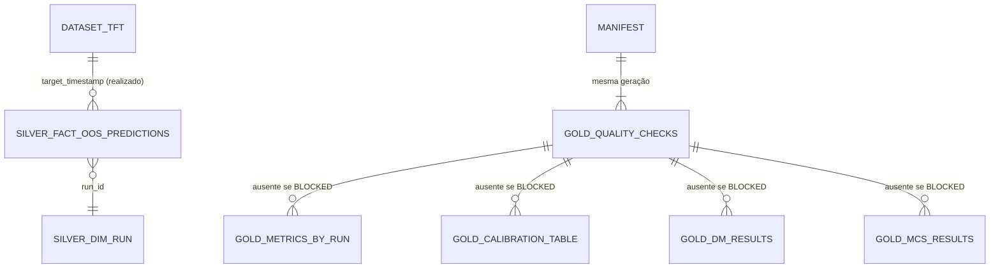

# Concept — Stage 6.4 — Gold builders modulares e quality gates

> **Escopo deste documento:** o que será feito nesta Stage, por quê, e
> decisões técnicas relevantes para entender o "porquê". O plano executável
> fica no [`technical.md`](./technical.md) correspondente.
>
> **Camada teórica.** A 6.4 não tem teoria própria (tabela de Stages do doc de
> domínio [`probabilistic-forecast-evaluation.md`](../../domain/evaluation/probabilistic-forecast-evaluation.md),
> `accepted`): consome os invariantes §2.1 (realizado persistido, 1 obs por
> ponto), §2.7 (por horizonte), §5.3 (taxa de degeneração sempre reportada),
> §6.5 (pré-condições do MCS), §6.7 (interseção exata e contígua), §6.8
> (folds concatenados), §6.9 (seeds) e §8.2 (pré-registro antes de métrica),
> e as convenções #1, #12, #16, #17, #19, #29 e #30 da §10. Este concept fixa
> só o contrato de montagem, orquestração e publicação.

## 1. Escopo

### Dentro do escopo

Contratos em §4; decisões em §7.

- **Montagem das séries** num serviço de domínio dono único
  (`SeriesAssembly`): recebe linhas silver já lidas, os runs do cohort e o
  realizado, verifica todas as regras de alinhamento (§5 I3–I10) e devolve as
  `CoverageSeries` por (modelo, seed, horizonte) nas duas amostras (série
  inteira e interseção comum) mais um `AlignmentReport` — D1, D2.
- **Leitura dos insumos**: port do consumidor `SilverTableReader` (satisfeito
  pelo `ParquetAnalyticsRepository` por duck typing) e o realizado lido uma
  vez pelo `MedallionStore` compartilhado no par read-only `("processed",
  "dataset_tft")`, com `DatasetFingerprint` — **sem** port novo de
  realizado — D3.
- **`QualityCheckRegistry`** com `alignment_check` e
  `statistical_preconditions` (ERROR, bloqueiam), `degeneracy_check` e
  `realized_provenance` (WARN, reportados), resultados publicados em
  `gold_quality_checks` — D4.
- **Relatórios por horizonte** (`HorizonReports`, domínio): 6.1 (pinball,
  CRPS_Q, IS, cobertura, degeneração), 6.3 (sequências de violação, Wilson por
  nível, Christoffersen/Kupiec, VaR descritivo, com/sem lacunas, partição
  DGT) e 6.2 (fábrica de L_t com média entre seeds, DM + Holm do candidato
  por estimador) — D5.
- **MCS em produção**: b̂_sb por par → `ModelConfidenceSet.block_length`
  (ADR 6.2.0005) → `McsBackend.bootstrap_indices` → `ModelConfidenceSet.evaluate`,
  por horizonte e esquema, com α/reps/seed explícitos — D6.
- **Port-out `GoldBuilder`** e cinco builders em
  `evaluation/adapters/out/duckdb/gold_builders/` (`quality_checks`,
  `metrics_by_run`, `calibration_table`, `dm_results`, `mcs_results`), cada um
  mapeando relatórios numa tabela, com dependências declaradas e ordem por
  `graphlib` (`gold_build_order`) — D7.
- **Port-out `GoldStore`** e o adapter `ParquetGoldStore`: publicação da
  geração inteira do cohort (staging → manifesto por último → troca de
  diretório) — D8.
- **Use case `RefreshGold`** com status determinístico (`COMPLETED` /
  `BLOCKED`) e log por etapa — D8.
- **E2E** sobre silver sintético gravado pelo `ParquetAnalyticsRepository`
  real, leitura via DuckDB, rerun comparado e cenário bloqueado — §11.
- **Redação do roadmap §Stage 6.4** (pedido declarado em D9) e wiring no
  `composition_root`.

### Fora do escopo (explicitamente)

- **Findings F-A/F-B** (regra única de "int não-bool ≥ mínimo", a
  `CoverageSeries` adotando `_horizon`/`_timestamps`) → **issue #118**
  (`refactor(evaluation)`), com todos os pontos de chamada, inclusive a forma
  `type(x) is not int`. Sai da 6.4 por decisão da orquestração: não mistura
  refactor transversal do slice com a entrega do gold, e o contrato público
  da `CoverageSeries` (6.1) não muda aqui.
- **Valores** do pré-registro (referência do pré-registro, α, reps, seed,
  esquemas, estimadores do DM, tolerância, níveis de banda, `min_violations`,
  candidato) e o scorecard/veredito → **6.5**. A 6.4 os recebe como parâmetros
  sem default ([ADR 6.4.0006](../../adr/6_4_0006-refresh-parameters-explicit-no-domain-defaults.md)).
- **Médias entre seeds** de cobertura, contagens e taxa de degeneração, e a
  escolha da amostra de cada relatório e da variante com/sem lacunas → **6.5**
  ([ADR 6.4.0007](../../adr/6_4_0007-gold-persists-both-samples-identified.md)).
  A média de L_t entre seeds **é** consumida aqui, pela fábrica existente da
  6.2 (sem reimplementação).
- **Perfis e sensibilidades além das variantes declaradas** — cada um vira
  `[finding]` candidato à 6.5 (ou 8.3) no §7 do technical:
  - DM por fold e por seed, fração de seeds que rejeita (doc §6.8, §6.9) →
    **6.5**, que monta essas séries reusando `SeriesAssembly` e os serviços
    da 6.2 (com `fold` levado às amostras), não só um builder;
  - DM por nível τ (doc §6.4) → **6.5** (precisa das perdas por nível);
  - sensibilidades de bloco do MCS l = h e l = √T (B-MCS, doc §6.5) → **6.5**;
  - diagnóstico de degeneração parcial por par (doc §5.1) → **6.5**;
  - distribuição das larguras (diagrama de sharpness, doc §4.3) → **8.3**;
  - p-valor Monte Carlo de Christoffersen e LR_uc de 3 estados sobre
    contagens médias → **6.5**.
- **Leitura do gold pela 6.5** (port de leitura) → **6.5**; ela lê só
  partições com `MANIFEST.json` (ADR 6.4.0005).
- **Execução do cohort real e gold AAPL** → **8.1** (a 5.5 não está em
  `develop`). **Plots** → **8.3**.
- **Check "domínio vs biblioteca" em runtime** — não adotado
  ([ADR 6.4.0008](../../adr/6_4_0008-no-runtime-library-cross-check-in-gold.md)).
- **Hash de conteúdo do silver** — não nesta Stage
  ([ADR 6.4.0005](../../adr/6_4_0005-gold-full-refresh-per-cohort-partition.md) item 8).
- **Hash do arquivo do dataset** no `DatasetFingerprint` → **issue #120**
  (o `MedallionStore` não o expõe; piso declarado em ADR 6.4.0004 item 4).
- **Leitura única do dataset nos escritores do modeling** → **issue #99**
  (piso declarado: a 6.4 lê o realizado por uma função única do lado da
  `evaluation`, sem quinta cópia do parsing do modeling).
- **Lote misto de `seed` None/int no `dim_run`** (falha no schema do
  `ParquetAnalyticsRepository`) → **issue #119**; o e2e grava `dim_run` por
  run até a correção.
- CLI/adapter-in para disparar o refresh: nenhum consumidor o pede antes da
  8.1; o use case sai montado do `composition_root`.
- Findings A12 da 6.1 (redação do DoD 6.1, é da 5.5) e A10/C8 da 6.3
  (resolvido no PR #115).

### Vínculo com o roadmap

Step 6 — "evidência confirmatória academicamente defensável e auditável"
([`roadmap.md`](../../roadmap.md)). A 6.4 é o **último quilômetro** que
6.1 D6, 6.2 D8 e 6.3 D8 empurraram para cá: sem ela os serviços de domínio não
viram dado lido do silver nem tabela gold, e o scorecard da 6.5 não tem
insumo. Entrega o medalhão gold do [`overview.md`](../../overview.md)
("decisão reconstruível sem re-treino") e o consumidor de produção do
`McsBackend` (ADR 6.2.0004 item 7).

## 2. Objetivo da Stage

Ao final desta Stage, dado um cohort (`asset`, `parent_sweep_id`) gravado no
silver, o dataset de onde sai o realizado e os parâmetros explícitos (com a
referência do pré-registro), o use case `RefreshGold` publica — sem re-treino,
como uma geração inteira que o leitor só usa quando o manifesto existe — as
tabelas `gold_quality_checks`, `gold_metrics_by_run`, `gold_calibration_table`,
`gold_dm_results` e `gold_mcs_results` do cohort, consultáveis por DuckDB,
montadas sobre séries alinhadas por interseção exata e contígua de
`target_timestamp` por horizonte com o realizado persistido; as mesmas
entradas (silver, dataset identificado pelo `DatasetFingerprint`, parâmetros)
dão as mesmas linhas; se a montagem ou uma pré-condição estatística falhar, a
geração publicada tem só a tabela de checks que diz por quê.

## 3. Contexto e premissas

### Contexto

6.1, 6.2 e 6.3 entregaram a estatística como serviços de domínio sobre VOs
alinhados (`CoverageSeries`, `PairedLossSeries`, `HitSequence`,
`BootstrapIndices`), todos **validando, nunca montando** (ADR 6.1.0002,
6.2.0001 item 4). Nenhuma lê dado real nem persiste. O levantamento da issue
#117, a leitura de código desta sessão e as sondas do Checkpoint A
estabelecem:

- `fact_oos_predictions` é longo (uma linha por nível), particionado por
  `(asset, feature_set_name, year)`, PK `(run_id, split, horizon,
  timestamp_utc, target_timestamp_utc, quantile_level)`, guarda
  `decision_idx` e **não** tem realizado; `guardrail_applied` é int 0/1.
  `dim_run` (partição `(asset, parent_sweep_id)`) dá `model_version`,
  `seed`, `fold`, `feature_set_name`, `config_signature` por `run_id`.
- O `read` real empurra só colunas de partição; outra chave de filtro é
  ignorada (sonda com `run_id` devolveu a partição inteira).
- O realizado é o `target_return` do dataset `("processed", "dataset_tft")`
  (doc §2.1; ADR 4.3.0001), que o `MedallionStore` compartilhado já lê
  (concept 5.2 D3) e que o `RunBaselines` já transforma em chave
  `timestamp.isoformat()` — a mesma string que vira `target_timestamp_utc`.
  O dataset não é versionado: pode ser reconstruído entre o treino e o
  refresh.
- Cada escritor do modeling aplica o dedup operationally-latest **na sua
  invocação** e afirma remoção zero; o rank (`decision_idx`) é função da chave
  (ADR 6.4.0003).

### Premissas

- **Sem dado materializado neste checkout** (medição `data-shape-evidence`,
  2026-09-29: `data/` ausente na worktree e vazio no checkout principal; a 5.5
  não está em `develop`). A forma do silver vem dos schemas
  (`fact_oos_predictions_schema.py`, `dim_run_schema.py`) e dos escritores
  (`run_baselines.py`, `train_gbm_quantile.py`, `train_tft.py`), lidos, não
  medidos — rótulo "derivado de schema/código". O e2e usa silver sintético
  gravado pelo repositório real; o cohort real é conferido pela 8.1 nos
  achados publicados.
- `split = "test"` é a única partição OOS confirmatória gravada pelos
  escritores (`_SPLIT = "test"` nos três) — derivado de código.
- Identidade de modelo = `dim_run.model_version` (`tft_quantile`,
  `gbm_quantile`, `baseline_<família>`); um cohort confirmatório tem um
  candidato por família e uma `config_signature` por modelo (doc §6.4; ADR
  5.2.0004: a assinatura exclui seed e fold). Seeds = `dim_run.seed` (nulo ⇒
  S = 1).
- Escala do piloto: T da ordem de centenas por série (o doc de domínio usa
  T = 500 nos exemplos, a confirmar na 6.5), grade de ~7–9 níveis (docstring
  do schema `fact_oos_predictions`, "grade densa ~7-9 decidida no Step 5"),
  poucos modelos e seeds — regeneração integral do cohort basta. O custo do
  MCS é **medido** no technical sobre série sintética com T ≈ 10³ e o `reps`
  mínimo do domínio (`MIN_MCS_REPS = 1000`), não presumido.

### Dependências

- `6.1-scoring-and-calibration-metrics` (`done`, PR #112): `CoverageSeries`,
  `PinballScore`, `CrpsScore`, `IntervalScore`, `CoverageMetrics`,
  `DegeneracyGate` e relatórios.
- `6.2-paired-inference-dm-mcs-holm` (`done`): `paired_pinball_losses`,
  `PairedLossSeries`, `HolmCorrection`/`DieboldMariano`,
  `ModelConfidenceSet`, `BootstrapIndices`, `McsBackend` (+ `ArchMcs`,
  `FakeMcsBackend`), `is_constant`, `validate_block_length_request`.
- `6.3-calibration-risk-backtests` (`done`, PR #115): `HitSequences`,
  `HitSequence.dgt_partition`, `WilsonBand`, `ChristoffersenTest`,
  `var_tail_for`.
- 4.2 (`ParquetAnalyticsRepository`), 4.3 (convenção de `target_timestamp`),
  5.2 D3 (par read-only do `MedallionStore`), 1.4 (`DatasetFingerprint`,
  `Hasher`), shared `Clock`.

## 4. Contratos

### Introduzidos

Domínio (`evaluation/domain/`):

- **`ForecastRecord`** (`value-object`) — uma linha longa do silver já
  juntada ao `dim_run`: `run_id`, `model: str` (= `model_version`),
  `seed: int | None`, `fold: str | None`, `horizon: int`,
  `decision_idx: int`, `decision_timestamp: str`, `target_timestamp: str`,
  `split: str`, `quantile_level: float`, `value_raw: float`,
  `value_guardrail: float`, `guardrail_applied: bool` (lido do int 0/1).
- **`CohortRun`** (`value-object`) — um `dim_run` do cohort: `run_id`,
  `model`, `seed`, `fold`, `feature_set_name`, `config_signature`.
- **`RealizedReturns`** (`value-object`) — sessões do dataset em ordem
  (`timestamps: tuple[str, ...]`, ISO, estritamente crescentes) e o
  `target_return` de cada uma (`returns: tuple[float, ...]`, finitos);
  `index_of(timestamp) -> int | None`, `realized_at(timestamp)`.
- **`SeriesAssembly`** (`domain-service`) —
  ```python
  class SeriesAssembly:
      @staticmethod
      def assemble(
          records: Sequence[ForecastRecord],
          runs: Sequence[CohortRun],
          realized: RealizedReturns,
          *,
          horizons: tuple[int, ...],
          window_deficits: Mapping[str, int],
          required_models: frozenset[str],
      ) -> AssembledCohort: ...
  ```
  `AssembledCohort` (VO): `alignment: AlignmentReport` e, **só quando
  `alignment.findings` é vazio**, `horizons: tuple[HorizonSamples, ...]`
  (ordem crescente). `HorizonSamples` (VO): `horizon`, `models` (ordenados),
  `seeds: Mapping[str, tuple[int | None, ...]]` (ordenadas),
  `full: Mapping[str, tuple[CoverageSeries, ...]]`,
  `common: Mapping[str, tuple[CoverageSeries, ...]]`, `n_common` (T),
  `common_first/last_target_timestamp`. `AlignmentReport` (VO):
  `findings: tuple[AlignmentFinding, ...]` (`kind`, `horizon`, `model`,
  `seed`, `detail`) e `common_points: tuple[tuple[int, int], ...]`
  (horizonte, T).
- **`QualityCheckResult`** (`value-object`, `domain/value_objects/`) + enums
  `CheckSeverity {ERROR, WARN}` e `CheckOutcome {PASS, FAIL, REPORTED,
  SKIPPED}` — campos `check`, `severity`, `outcome`, `kind`, `horizon?`,
  `model?`, `seed?`, `occurrences`, `value?`, `detail`
  ([ADR 6.4.0002](../../adr/6_4_0002-quality-checks-severity-and-persisted-results.md)).
- **`QualityCheckRegistry`** (`domain-service`) —
  `QualityCheckRegistry(checks).run(context) -> tuple[QualityCheckResult,
  ...]`, `is_blocking(results) -> bool`; `QualityCheckContext` (VO):
  `assembled`, os `PairedLossSeries` por horizonte (quando montados), as
  estimativas b̂_sb por par (`BlockEstimate`: valor ou indefinido com o
  motivo), a tolerância e o `DatasetFingerprint`. Checks:
  `alignment_check` (ERROR), `statistical_preconditions` (ERROR),
  `degeneracy_check` (WARN), `realized_provenance` (WARN).
- **`HorizonReports`** (`domain-service`) — por `HorizonSamples` e
  parâmetros: `SeriesReports` por (modelo, seed, amostra) — `PinballReport`,
  `CrpsReport`, `IntervalScoreReport`, `CoverageReport`,
  `guardrail_applied_rate`, `CalibrationRow`s (cada `ChristoffersenReport` +
  um `WilsonBandReport` por nível + `var_level` quando cauda) — e, na amostra
  comum, a `PairedLossSeries` (fábrica 6.2) e um `DmHolmFamilyReport` por
  estimador de variância.
- **`gold_build_order`** (`domain-service`, função) —
  `gold_build_order(builders: Sequence[tuple[str, frozenset[str]]]) ->
  tuple[str, ...]` ([ADR 6.4.0001](../../adr/6_4_0001-gold-builder-dag-graphlib-declared-dependencies.md)).

Application (`evaluation/application/`):

- **`SilverTableReader`** (`port-out`) —
  `read(*, layer: str, table: str, filters: Mapping[str, object] | None =
  None) -> Sequence[Mapping[str, object]]`; filtros só de partição, resultado
  pode ser superconjunto, o consumidor pós-filtra
  ([ADR 6.4.0004](../../adr/6_4_0004-evaluation-inputs-silver-reader-port-and-medallion-dataset.md)).
- **`GoldBuilder`** (`port-out`) —
  ```python
  class GoldBuilder(Protocol):
      @property
      def name(self) -> str: ...
      @property
      def depends_on(self) -> frozenset[str]: ...
      @property
      def runs_when_blocked(self) -> bool: ...
      def build(self, inputs: GoldInputs) -> GoldTable: ...  # mapeamento puro
  ```
- **`GoldStore`** (`port-out`) —
  `publish(*, partition: GoldPartition, tables: Sequence[GoldTable],
  manifest: GoldManifest) -> None`
  ([ADR 6.4.0005](../../adr/6_4_0005-gold-full-refresh-per-cohort-partition.md)).
- **DTOs** (`application/dtos/refresh_gold.py`): `RefreshParameters`
  (ADR 6.4.0006, sem default, com `preregistration_ref` e `band_levels`),
  `RefreshGoldCommand` (`asset`, `parent_sweep_id`, `horizons`,
  `window_deficits: Mapping[str, int]`, `parameters`), `GoldPartition`,
  `GoldTable` (`name`, `rows`), `GoldManifest`, `GoldInputs` (partição,
  `preregistration_ref`, resultados dos checks, relatórios por horizonte,
  `McsReport`s e estimativas b̂_sb), `FailedCheck` (DTO: `check`, `kind`,
  `horizon?`, `model?`, `seed?`, `occurrences`, `detail`) e
  `RefreshGoldResult` (`status: RefreshStatus {COMPLETED, BLOCKED}`,
  `rows_by_table`, `failed_checks: tuple[FailedCheck, ...]`).
- **`RefreshGold`** (`use case`) — `__call__(command) -> RefreshGoldResult`;
  construtor recebe `SilverTableReader`, `MedallionStore`, `Hasher`, `Clock`,
  `McsBackend`, `GoldStore` e `Sequence[GoldBuilder]`.

Adapters (`evaluation/adapters/out/duckdb/`):

- **`ParquetGoldStore`** (`GoldStore`) e os builders
  `QualityChecksGoldBuilder` (`runs_when_blocked = True`),
  `MetricsByRunGoldBuilder`, `CalibrationTableGoldBuilder`,
  `DmResultsGoldBuilder`, `McsResultsGoldBuilder` (tabelas em §9).

### Consumidos

- `CoverageSeries`, `PinballScore`, `CrpsScore`, `IntervalScore`,
  `CoverageMetrics`, `DegeneracyGate` — 6.1.
- `paired_pinball_losses`, `PairedLossSeries`, `HolmCorrection`,
  `DmVarianceEstimator`, `ModelConfidenceSet`, `BootstrapIndices`,
  `BootstrapScheme`, `McsBackend`, `MIN_BLOCK_LENGTH_OBS`, `MIN_MCS_REPS`,
  `check_points`, `is_constant`, `validate_block_length_request`,
  `validate_alpha`, `MIN_MODELS` (do VO `PairedLossSeries`),
  `validate_bootstrap_parameters` e `validate_mcs_reps` (os três últimos
  tornados públicos nesta Stage, D9) — 6.2.
- `validate_tolerance` (6.1/6.3, `_tolerance.py`) — 6.1.
- `HitSequences`, `HitSequence` (`dgt_partition`), `ChristoffersenTest`,
  `WilsonBand`, `var_tail_for`, `validate_min_violations`, `validate_rate`
  (validador dos níveis do `WilsonBand`) — 6.3.
- `QuantileForecast` (VO do 4.3; aresta de dados nova declarada, D3).
- `MedallionStore`, `Hasher`, `Clock`, `DatasetFingerprint` (shared);
  `ParquetAnalyticsRepository` (4.2) como real do `SilverTableReader`.

## 5. Invariantes e regras

- **I1 — Por horizonte.** Toda série, relatório, família de Holm e MCS é de
  um horizonte; nada agrega horizontes (doc §2.7). Os horizontes avaliados
  são os do comando, não a união do que o silver tiver.
- **I2 — Um dono por regra de alinhamento.** As regras I3–I10 vivem só em
  `SeriesAssembly`; `alignment_check` só traduz o `AlignmentReport`; os VOs
  continuam validando o que já validam (sem segunda escrita).
- **I3 — Split e identidade.** Só `split = "test"` entra; `model` =
  `dim_run.model_version`; um `feature_set_name` por cohort; uma
  `config_signature` por modelo; run do cohort sem predição `test` é achado
  (run órfão); `fact_oos_predictions.model_version` diferente do
  `dim_run.model_version` do mesmo `run_id` é achado.
- **I4 — Uma observação por ponto.** (modelo, seed, horizonte,
  `target_timestamp`, nível) é único; duplicata é achado, nunca resolvida por
  escolha (ADR 6.4.0003).
- **I5 — Índices de sessão.** `índice(decision_timestamp) == decision_idx` e
  `índice(target) − índice(decisão) == horizonte` no índice do
  `RealizedReturns` (ADR 4.3.0001); divergência é achado (o dataset lido não
  é o que o escritor indexou, ou o rótulo está errado).
- **I6 — Grade e guardrail.** Cada ponto tem a grade completa, igual para
  todos os modelos do horizonte (concept 5.2 I11); `guardrail_applied`
  (int 0/1 → bool) é o mesmo em todos os níveis do ponto; o
  `QuantileForecast` é construído diretamente com os valores persistidos
  (`value_raw`, `value_guardrail`, `guardrail_applied`), nunca recomputado por
  `from_raw`.
- **I7 — Realizado lido, nunca recomputado**, presente em todo `target`
  (doc §2.1, conv. #1).
- **I8 — Contiguidade.** Cada série (modelo, seed, horizonte) ocupa índices de
  sessão consecutivos; todas as séries do horizonte terminam no mesmo
  `target` (sufixo truncado é achado); o início pode atrasar em relação à
  série mais antiga do horizonte no máximo o déficit de janela declarado para
  o modelo (`window_deficits`, enumerado pelo treinador — ADR 5.4.0001; 0 se
  não declarado). A amostra comum é a interseção dos intervalos — contígua por
  construção — com T reportado (doc §6.7).
- **I9 — Cobertura.** O conjunto de `fold` de todo (modelo, seed) é o do
  cohort; todo (modelo, seed) tem série em todo horizonte pedido; horizonte
  pedido ausente é achado; os `required_models` (o candidato) estão no
  cohort.
- **I10 — T mínimo** da amostra comum: o das regras donas (T > h de
  `check_points`; `MIN_BLOCK_LENGTH_OBS` para o b̂_sb do MCS).
- **I11 — Pré-condições estatísticas** (doc §6.5), avaliadas **no domínio
  antes** de qualquer chamada que as validaria erguendo: (i) k ≥
  `MIN_MODELS` (constante pública do primeiro dono, o VO `PairedLossSeries`,
  que a fábrica `paired_pinball_losses` passa a importar) antes da fábrica; (ii) por par, `is_constant` do diferencial e
  `validate_block_length_request` (6.2, públicos) antes do backend — falha vira
  "estimativa indefinida" sem chamar o backend; (iii) do backend, só
  `ArithmeticError` do `optimal_block_length` vira estimativa indefinida; o
  resto propaga. Violação é FAIL de `statistical_preconditions` (o check é o
  dono desse passo), nunca exceção.
- **I12 — Seeds.** As S séries por modelo entram na fábrica da 6.2, que faz a
  média de L_t; a 6.4 não reimplementa nem faz outra média.
- **I13 — Degeneração** reportada por (modelo, seed, horizonte) sobre a
  amostra `model_full`, sem limiar e sem excluir linhas (doc §5.3), **sempre
  que a montagem passa**; se a montagem falhou, o `degeneracy_check` sai
  `SKIPPED` com o motivo.
- **I14 — Ordem.** A ordem dos builders sai de `gold_build_order` sobre as
  dependências declaradas; nenhum builder lê estado de outro; com
  `BLOCKED`, só os builders `runs_when_blocked` rodam.
- **I15 — Efeitos colaterais depois dos guardas.** Ordem validada →
  identificadores validados → leitura → montagem → pré-condições no domínio
  (k ≥ `MIN_MODELS`; fábrica de L_t só se k basta; por par `is_constant` e
  `validate_block_length_request`; backend só para os pares que passam) →
  checks → (se não bloqueado) todos os relatórios e o MCS → builders →
  `GoldStore.publish`. Nada é gravado antes do `publish`.
- **I16 — Reconstrução.** Gold = f(silver do cohort, dataset identificado
  pelo `DatasetFingerprint` + resumo descritivo do `target_return` consumido
  (contagem, `math.fsum`, primeira/última sessão), parâmetros com
  `preregistration_ref`): as mesmas
  entradas dão as mesmas linhas em todas as tabelas (ordem fixa de modelos,
  seeds, horizontes; linhas ordenadas pela chave; seed do MCS explícita); no
  manifesto, só os timestamps do refresh mudam.
- **I17 — Autodescrição.** Cada linha gold carrega `asset`,
  `parent_sweep_id`, a amostra, T/n e os parâmetros que a produziram
  (tolerância, `min_violations`, nível de banda, α, reps, seed, esquema, bloco,
  gerador); as quatro tabelas confirmatórias (`metrics_by_run`,
  `calibration_table`, `dm_results`, `mcs_results`) carregam também
  `preregistration_ref`, que `gold_quality_checks` não carrega; o manifesto
  carrega o resto (ADR 6.4.0005 item 7).

## 6. Casos de erro e exceções

- **C1 — Grafo de builders inválido** (nome duplicado, dependência de
  builder não registrado, auto-dependência, ciclo) → `ValueError` de
  `gold_build_order`, **antes** de qualquer leitura.
- **C2 — Parâmetro inválido** → `ValueError` na construção de
  `RefreshParameters`, por validadores públicos donos (`validate_tolerance`,
  `validate_bootstrap_parameters`, `validate_mcs_reps`, `validate_alpha`,
  `validate_rate`, `validate_min_violations`), antes de qualquer leitura; um manifesto
  `BLOCKED` nunca carrega parâmetro inválido.
- **C3 — Identificador inválido** (`asset`/`parent_sweep_id` fora de
  `^[A-Za-z0-9._-]+$`) → `ValueError` antes de montar qualquer caminho.
- **C4 — Cohort vazio** (nenhuma linha de `dim_run` para `(asset,
  parent_sweep_id)`) ou dataset vazio → `ValueError` nomeando a partição;
  nada é publicado.
- **C5 — Violação de alinhamento** (I3–I10) → **não é exceção**: achado no
  `AlignmentReport`, `alignment_check` FAIL, refresh `BLOCKED`: a geração
  publicada tem só `gold_quality_checks` e o manifesto `BLOCKED`.
- **C6 — Pré-condição estatística violada** (I11: k < 2, diferencial
  constante, série de diferencial que falha `validate_block_length_request`,
  `ArithmeticError` do `ArchMcs` ao estimar b̂_sb) → **não é exceção**:
  `statistical_preconditions` FAIL, refresh `BLOCKED` com a causa
  publicada. k < 2, diferencial constante e série inválida são detectados
  **no domínio antes** da fábrica e do backend (I11), que por isso nunca
  erguem esses `ValueError`; do backend, o use case só converte
  `ArithmeticError` do `optimal_block_length` em estimativa indefinida;
  qualquer outra exceção propaga.
- **C7 — Erro de programação** (qualquer exceção fora de C2–C6) → propaga;
  nada é publicado, a geração anterior segue viva.
- **C8 — Série 100 % degenerada** (baselines pontuais) → não é erro: os
  relatórios da 6.1/6.3 saem "não aplicável" (6.1 C7, 6.3 C7) e o
  `degeneracy_check` reporta 1.0.
- **C9 — Falha de publicação** (disco, permissão) no meio do `publish` →
  propaga; sem `current/MANIFEST.json` novo, o leitor não vê a geração
  parcial; o próximo refresh limpa `.staging/`/`.previous/` e regenera
  (resíduo declarado no ADR 6.4.0005).

## 7. Decisões técnicas relevantes

> Triagem `evidence-resolution`: nenhum fork **P**. Os forks antecipados na
> issue (C1–C8) foram fechados como E/C com ADR `accepted`; as citações
> externas foram conferidas por `evidence-verifier` (2026-09-29: dbt
> `severity`/`build`, Sandve et al., `graphlib`, Breck et al. 2019,
> `os.replace` e rename(2) — sustentam; dbt incremental — parcial, só o
> trecho de idempotência é usado; Docker — sem menção a atomicidade de rename
> em bind mount, resíduo declarado). Revisão de completude
> (`decision-reviewer`) e Checkpoint A rodadas 1 e 2 aplicados nesta versão.

### D1 — Montagem num serviço de domínio único, com achados em vez de exceção

- **O quê:** `SeriesAssembly` é o único dono das regras I3–I10; devolve um
  `AlignmentReport` com todos os achados e só monta as `CoverageSeries` quando
  não há achado, nas duas amostras (ADR 6.4.0007) por (modelo, seed). A
  contiguidade e os índices usam o índice de sessões do dataset (sem
  `TradingCalendar`): as sessões do dataset **são** a grade do
  `target_timestamp` (ADR 4.3.0001).
- **Por quê:** os cinco builders e os checks precisam da mesma série
  alinhada; montar uma vez evita escritas repetidas das regras (issue #117
  ponto de reflexão 1a). Achados em vez de exceção porque a violação precisa
  ser publicada (doc §6.7 "violação de invariante da 6.4").
- **Fonte:** doc §2.1, §6.7, §6.8; concept 6.1 ("garantia do builder"); ADR
  6.2.0001 item 4; ADR 5.4.0001; issue #117.
- **ADR:** [`6.4.0003`](../../adr/6_4_0003-single-observation-verified-not-rededuplicated.md)

### D2 — O dedup operationally-latest não é reaplicado na leitura (fork C3)

- **O quê:** 1 obs por ponto é verificada (duplicata = achado); `evaluation`
  não chama, não embrulha e não copia `deduplicate_operationally_latest`, e
  não escolhe entre duplicatas (nem por `created_at_utc`).
- **Por quê:** em cada invocação de escritor o rank é `decision_idx`, função
  da chave para horizonte fixo; entre invocações a chave também empata. O
  dedup na leitura só devolveria a entrada ou ergueria; um desempate novo
  seria escolha depois de ver as previsões. Cohort poluído se recupera com
  novo `cohort_id`.
- **Fonte:** código dos escritores (`_assert_zero_removal`); doc §5.3 item 5,
  §6.7; modeling doc §7 item 2; ADR 5.2.0004.
- **ADR:** [`6.4.0003`](../../adr/6_4_0003-single-observation-verified-not-rededuplicated.md)

### D3 — Insumos: port do consumidor para o silver, `MedallionStore` para o realizado, com fingerprint (fork C4)

- **O quê:** `SilverTableReader` (espelho do `read`, filtros só de
  partição, superconjunto pós-filtrado); cohort por `dim_run`
  `{asset, parent_sweep_id}` e fatos pela partição do seu `feature_set_name`
  único; realizado lido uma vez por uma função da `evaluation` via
  `MedallionStore` no par read-only, juntado por `timestamp.isoformat()`,
  com `DatasetFingerprint` (campos estruturais; `parquet_file_hash` com o
  literal declarado até a #120) e um resumo descritivo do `target_return`
  consumido (contagem, `math.fsum`, primeira/última sessão), porque o
  fingerprint cobre `close`/`volume`, não o alvo. Aresta de dados nova declarada no
  `bc-independence`: o módulo de montagem constrói `QuantileForecast`.
- **Por quê:** ADR 0.0.0053 (port do consumidor); concept 5.2 D3 já rejeitou
  um port dedicado para o dataset; o dataset não é versionado, então o gold
  registra qual usou (Sandve Rule 1).
- **Fonte:** ADR 0.0.0053; concept 5.2 D3; `run_baselines._load_dataset`;
  ADR 4.3.0001; issues #99, #120.
- **ADR:** [`6.4.0004`](../../adr/6_4_0004-evaluation-inputs-silver-reader-port-and-medallion-dataset.md)

### D4 — Registry de checks com severidade declarada e tabela própria (fork C2)

- **O quê:** `alignment_check` e `statistical_preconditions` ERROR (bloqueiam
  os dependentes); `degeneracy_check` WARN/REPORTED (sem limiar; `SKIPPED` com
  motivo se a montagem falhou) e `realized_provenance` WARN/REPORTED (o
  fingerprint e o resumo do `target_return`); resultados agregados por (check, kind, horizon, model, seed)
  com contagem e exemplo, publicados em `gold_quality_checks` em todo
  refresh.
- **Por quê:** doc §5.3, §6.5, §6.7; dbt (`error` default, `warn` não pula);
  Breck et al. 2019; uma pré-condição estatística violada é propriedade do
  cohort, não bug, e precisa de causa publicada.
- **Fonte:** doc §5.3, §6.5, §6.7, §10 #12, #16; issue #117 P2.
- **ADR:** [`6.4.0002`](../../adr/6_4_0002-quality-checks-severity-and-persisted-results.md)

### D5 — Relatórios compostos no domínio; duas amostras por seed; só variantes declaradas (fork C7)

- **O quê:** `HorizonReports` chama os serviços existentes, sem cálculo
  novo: por (modelo, seed, amostra ∈ {`model_full`, `common`}) os relatórios
  da 6.1 e as linhas de calibração da 6.3 — intervalo por par simétrico e
  cauda por τ ≠ 0.5 (rótulo `var_level` por `var_tail_for`), cada uma com e
  sem lacunas, com a partição DGT quando h > 1, e uma banda de Wilson por
  nível de `band_levels` com `nominal = violation_rate` da sequência; na
  amostra comum, a `PairedLossSeries` da fábrica e um `DmHolmFamilyReport`
  por estimador de variância. Perfis além disso estão em §Fora do escopo.
- **Por quê:** a 6.4 publica o que o gate e o veredito primário precisam, com
  as variantes que o doc declara, sem escolher (concept 6.1 §Fora do escopo;
  doc §6.9); compor no domínio mantém o orquestrador sem regra.
- **Fonte:** concept 6.3 D8, ADR 6.3.0004 item 4, ADR 6.3.0005; doc §4.4,
  §6.9, §10.
- **ADR:** [`6.4.0007`](../../adr/6_4_0007-gold-persists-both-samples-identified.md)

### D6 — MCS em produção com parâmetros explícitos (fork C6)

- **O quê:** antes dos checks, por horizonte, o passo de domínio do
  `statistical_preconditions` confere k ≥ `MIN_MODELS`; só então a fábrica
  monta a `PairedLossSeries`; por par (`series.model_pairs()`, diferencial do
  VO), `is_constant` e `validate_block_length_request` rodam no domínio e,
  se falham, o par fica com estimativa indefinida sem chamar o backend; os
  pares que passam vão ao `McsBackend.optimal_block_length`, com
  `ArithmeticError` registrado como estimativa indefinida. Se não bloqueado: bloco por
  `ModelConfidenceSet.block_length`; para cada esquema de
  `parameters.mcs_schemes`, `bootstrap_indices(n_obs=T, block_size, reps,
  seed, scheme)` e `ModelConfidenceSet.evaluate(alpha)`. Uma seed para todo
  horizonte e esquema, persistida em cada `McsReport`.
- **Por quê:** ADR 6.2.0004 item 7 (a 6.4 é o consumidor de produção) e
  6.2.0005 (regra do bloco); sem default no domínio (a 6.5 congela os
  valores); horizontes nunca se combinam (doc §2.7).
- **Fonte:** ADR 6.2.0004, 6.2.0005; concept 6.2 §1/§11; doc §6.5.
- **ADR:** [`6.4.0006`](../../adr/6_4_0006-refresh-parameters-explicit-no-domain-defaults.md)

### D7 — DAG de builders por `graphlib`, validação própria (fork C1)

- **O quê:** cada builder declara `name`, `depends_on` e `runs_when_blocked`
  e só mapeia `GoldInputs` numa tabela; hoje os quatro dependem de
  `quality_checks`. `gold_build_order` valida duplicata, dependência
  desconhecida e auto-dependência, insere por nome ordenado e devolve o
  `static_order()`; ciclo ergue com o ciclo na mensagem.
- **Por quê:** DoD do roadmap; `graphlib` não detecta dependência ausente e a
  ordem depende da inserção (verificado); framework seria dependência pesada
  para cinco nós.
- **Fonte:** roadmap 6.4; docs do `graphlib`; issue #117 P1.
- **ADR:** [`6.4.0001`](../../adr/6_4_0001-gold-builder-dag-graphlib-declared-dependencies.md)

### D8 — Geração inteira por cohort: staging, manifesto por último, troca de diretório (fork C5)

- **O quê:** `GoldStore.publish` grava todas as tabelas em
  `<data_root>/gold/asset=<a>/parent_sweep_id=<p>/.staging/`, o
  `MANIFEST.json` por último (status, linhas por tabela, parâmetros com
  `preregistration_ref`, horizontes, déficits, `DatasetFingerprint`, número de
  runs, ordem de build, timestamps do `Clock`, resumo do `target_return`),
  renomeia `current/` para `.previous/`, `.staging/` para `current/` e apaga
  `.previous/` (falha ao apagar só gera aviso: a geração já está viva). Um
  escritor por cohort é **pré-condição** documentada (sem arquivo de trava).
  O leitor só usa partição com `current/MANIFEST.json` e lê o manifesto antes
  das tabelas. `BLOCKED` publica uma geração só
  com os builders `runs_when_blocked`. `RefreshGold` loga cada etapa (nome,
  duração, contagens de entrada/saída) e o status final.
- **Por quê:** as cinco tabelas são um artefato de decisão e mudam juntas;
  "descartar antes" deixava ausência ou mistura; `os.replace` é atômico por
  requisito POSIX e a sonda no bind mount `9p` confirmou o comportamento;
  dbt: incremental é "the easiest place to accidentally break idempotence".
- **Fonte:** overview (gold reconstruível); doc §8.2 (B-ORDEM); issue #117 P3;
  LAYOUT §7; skill `orchestrator-design` (status determinístico,
  observabilidade).
- **ADR:** [`6.4.0005`](../../adr/6_4_0005-gold-full-refresh-per-cohort-partition.md)

### D9 — Pedido de mudança de roadmap (declarado)

- **O quê**, na linha da 6.4 (aplicado no PR desta Stage):
  - descrição humana e DoD sem o vocabulário órfão "aplicando as
    disposições" / "disposições aplicadas" (doc §9.3, conv. #30, ADR 0.0.0054);
    DoD reescrito com o §11 em uma frase;
  - `arquivos_a_criar`: os do roadmap (port `gold_builder.py`, use case,
    quatro builders, registry e dois checks, dois testes) **mais**
    `value_objects/{forecast_record.py, cohort_run.py, realized_returns.py,
    assembled_cohort.py, quality_check_result.py}`,
    `services/{series_assembly.py, horizon_reports.py, gold_build_order.py}`,
    `quality_checks/{statistical_preconditions_check.py,
    realized_provenance_check.py}`,
    `application/ports/out/{silver_table_reader.py, gold_store.py}`,
    `application/dtos/refresh_gold.py`,
    `adapters/out/duckdb/{parquet_gold_store.py, gold_builders/quality_checks.py}`
    e os fakes/contratos dos três ports (nomes finais na Fase 3B);
  - `contratos_introduzidos`: + `SeriesAssembly`, `HorizonReports`,
    `gold_build_order` (domain-services), `ForecastRecord`, `CohortRun`,
    `RealizedReturns`, `AssembledCohort`, `QualityCheckResult`
    (value-objects), `SilverTableReader`, `GoldStore` (ports-out);
  - `arquivos_a_modificar` (mudanças mínimas em arquivos da 6.2):
    `domain/value_objects/paired_loss_series.py` (`_MIN_MODELS` →
    `MIN_MODELS` público — o VO é o primeiro dono) e
    `domain/services/paired_pinball_losses.py` (apaga a sua cópia
    `_MIN_MODELS` e importa `MIN_MODELS` do VO, direção serviço → VO);
    `domain/value_objects/bootstrap_indices.py` (extrai
    `validate_bootstrap_parameters(*, reps, seed)` público de
    `validate_bootstrap_request`, que passa a chamá-lo; mesmas mensagens);
    `domain/services/model_confidence_set.py` (extrai
    `validate_mcs_reps(reps)` público para a regra `reps ≥ MIN_MCS_REPS`,
    hoje escrita duas vezes — `McsReport.__post_init__` e
    `ModelConfidenceSet.evaluate` —, e os dois pontos passam a consumi-lo);
  - `contratos_consumidos`: `AnalyticsRepository (4.2)` passa a ser
    "`ParquetAnalyticsRepository` como real do `SilverTableReader` (ADR
    0.0.0053)"; entram `MedallionStore` (par read-only dataset_tft),
    `DatasetFingerprint`/`Hasher`, `Clock`.
- **Fonte:** issue #117 item 9; PIPELINE (roadmap é editado pela Stage dona).

### Encaminhamentos para a 6.5 (viram `[finding]` no §7 do technical)

- O roadmap §Stage 6.5 lista em `contratos_consumidos` os serviços de 6.1–6.3
  (DM/Holm/MCS, `CoverageMetrics`, kernels da 6.3) como se o scorecard os
  recomputasse; com a 6.4, o scorecard **lê o gold** (tabelas + manifesto) e
  só recomputa o que é dele (médias entre seeds, gate H1, 3 estados sobre
  contagens médias). Candidata: 6.5, redação da sua linha no roadmap.
- A 6.5 fornece `preregistration_ref` e os valores de `RefreshParameters`, e
  decide quais perfis de §Fora do escopo entram (cada um é trabalho de séries
  + builder, não só builder).

## 8. Integrações

### Internas (com outras Stages/módulos)

- **analytics_store (4.2):** `ParquetAnalyticsRepository` satisfaz
  `SilverTableReader` por duck typing; `evaluation` não importa a
  application do `analytics_store` (`bc-independence`).
- **shared:** `MedallionStore` (`ParquetMedallionStore`, par read-only),
  `Hasher` (via `DatasetFingerprint`), `Clock`.
- **modeling:** nenhuma importação; a 6.4 consome o que os escritores
  gravaram (1 obs por ponto garantida por invocação).
- **6.5:** lê as tabelas gold só com manifesto (port de leitura é dela),
  aplica médias entre seeds, escolhe amostra/variante e o veredito.
- **composition_root:** monta `RefreshGold` com o repositório, o store, o
  `Hasher`, o `Clock`, o `ArchMcs`, o `ParquetGoldStore` e os cinco builders
  (raiz de dados do `Settings`).

### Externas

- **DuckDB** (ADR 0.0.0022): consulta das tabelas gold
  — o leitor lê primeiro `current/MANIFEST.json` da partição (status e
  tabelas presentes) e só então
  `read_parquet('<data_root>/gold/asset=<a>/parent_sweep_id=<p>/current/<tabela>.parquet')`;
  um glob `asset=*/parent_sweep_id=*` sem conferir manifestos pode ler
  geração `BLOCKED` ou partição em troca; `asset`/`parent_sweep_id` também
  vêm como colunas; **pyarrow/pandas** para
  gravar o Parquet — confinados a `adapters/out/duckdb/`
  (`store-no-storage-leak`).
- **arch** via `ArchMcs` (já existente).

## 9. Modelo de dados

Layout: `<data_root>/gold/asset=<a>/parent_sweep_id=<p>/current/{<tabela>.parquet,
MANIFEST.json}`. Toda linha carrega `asset` e `parent_sweep_id`; as quatro
tabelas confirmatórias carregam também `preregistration_ref` (não
`gold_quality_checks`), que o manifesto também registra. Grão = chave de linha; as colunas exatas saem da Fase
3B (o gold é regenerável, logo o formato é barato de mudar):

| Tabela | Grão | Conteúdo |
|---|---|---|
| `gold_quality_checks` | (check, kind, horizon?, model?, seed?) | severidade, desfecho (PASS/FAIL/REPORTED/SKIPPED), ocorrências, `value`, `detail` (primeira ocorrência; fingerprint em `realized_provenance`) |
| `gold_metrics_by_run` | (model, seed, horizon, sample, metric, level_low?, level_high?) | P̄_G e pinball por τ, CRPS_Q, IS por par, ĉ(τ), PICP/MPIW (rótulo descritivo), taxa de degeneração, `guardrail_applied_rate`, `n_points`, primeiro/último timestamp, tolerância |
| `gold_calibration_table` | (model, seed, horizon, sample, kind, levels, includes_degenerate, dgt_offset?, dgt_step?, band_level) | n_observed, n_violations, transições, `violation_rate`, Kupiec POF + p, LR_uc/LR_ind/LR_cc + p, status de independência, `independence_descriptive`, Wilson (limites, contém-o-nominal, aplicável, aviso serial), `var_level` e rótulo VaR descritivo nas caudas, tolerância, `degeneracy_rate`, `min_violations` |
| `gold_dm_results` | (horizon, variance_estimator, candidate, comparator) | T, d̄, variância de longo prazo, estatística, gl, p, `horizon_used`, fallback, p ajustado de Holm, rejeita, α |
| `gold_mcs_results` | (horizon, scheme, model) | ordem de eliminação, p do passo, p do MCS, incluído, α, reps, seed, bloco, gerador, T, máx. b̂_sb (as estimativas por par numa coluna de detalhe) |
| `MANIFEST.json` | (uma por geração) | status, linhas por tabela, `RefreshParameters` (com `preregistration_ref`), horizontes, déficits, `DatasetFingerprint`, resumo do `target_return` (contagem, `math.fsum`, primeira/última sessão), nº de runs, ordem de build, início/fim |



## 10. Riscos e mitigações

| Risco | Probabilidade | Impacto | Mitigação |
|---|---|---|---|
| Chave de junção do realizado diverge do `target_timestamp_utc` ou o dataset foi reconstruído | M | A | Mesma rota `MedallionStore` + `isoformat()` dos escritores; regras I5 (`decision_idx` e rótulo de horizonte) e I7 viram achados ERROR; `DatasetFingerprint` no manifesto e nos checks; e2e prova a junção com repositório e store reais |
| Silver real (8.1) diferente do lido no código (sem dado neste checkout) | M | M | Achados publicados em `gold_quality_checks`; premissas de §3 nomeadas para a 8.1 conferir |
| Custo do MCS (reps ≥ 1000 × esquemas × horizontes) em stdlib | M | M | Medido no technical com T ≈ 10³ sintético; reps e esquemas são parâmetros |
| Leitor vê mistura de gerações ou gold parcial | B | A | Staging + manifesto por último + troca de diretório; leitor exige manifesto (ADR 6.4.0005) |
| Atomicidade de rename não documentada no bind mount `9p` | B | M | Correção não depende dela (manifesto por último); resíduo e recuperação declarados |
| Fingerprint não detecta mudança que preserve as somas estruturais | B | M | Regra I5 detecta grade de sessões deslocada; issue #120 traz o hash do arquivo |
| Fórmula recalculada por engano num builder | B | A | Builders só mapeiam relatórios em linhas; import-linter/`check_layout` e revisão; unit dos builders compara com os VOs |
| Stage densa (12 Tasks) | M | M | Tasks inside-out (`task-ordering-hex`); F-A/F-B fora (#118); perfis fora; sem CLI, sem leitura de gold |

## 11. Critérios de aceitação

- [ ] `gold_build_order` devolve a mesma ordem para qualquer ordem de registro
      e ergue `ValueError` em nome duplicado, ciclo, dependência desconhecida e
      auto-dependência — testes unit
      (`tests/unit/features/evaluation/gold/test_builder_explicit_deps.py`);
      `RefreshGold` com grafo inválido não chama nenhum fake de leitura.
- [ ] `SeriesAssembly` produz um achado para cada violação de I3–I10 —
      split (linhas não-`test` ignoradas, testado), `feature_set_name`
      múltiplo, duas `config_signature` num modelo, run órfão,
      `model_version` do fato divergente do `dim_run`, duplicata,
      `decision_idx` divergente, rótulo de horizonte, grade incompleta ou
      divergente, `guardrail_applied` divergente entre níveis, realizado
      ausente, lacuna interior, sufixo truncado, prefixo acima do déficit
      declarado, cobertura de fold, cobertura de seed × horizonte, horizonte
      pedido ausente, candidato ausente, T abaixo do mínimo — um teste por
      regra; e aceita prefixo dentro do déficit, com T e primeiro/último
      timestamp da interseção corretos.
- [ ] Sem achado, as séries montadas reproduzem, ponto a ponto, os valores
      persistidos `value_guardrail`/`value_raw`/`guardrail_applied` (sem
      recomputar o guardrail) e o `target_return` do dataset.
- [ ] `QualityCheckRegistry` roda os checks na ordem registrada:
      `alignment_check` FAIL agregado por (kind, escopo) com ocorrências e
      PASS por horizonte com T; `statistical_preconditions` FAIL para k < 2,
      diferencial constante, série inválida para b̂_sb e b̂_sb indefinido, e
      SKIPPED com montagem falha; `degeneracy_check` REPORTED com a taxa do
      `DegeneracyGate` na amostra `model_full` para toda (modelo, seed,
      horizonte), inclusive 1.0 nos baselines pontuais, e SKIPPED com motivo
      quando a montagem falhou; `realized_provenance` REPORTED com o
      fingerprint e o resumo do `target_return`; fábrica e backend nunca
      recebem k < 2, diferencial constante ou série inválida (fakes que
      erguem se chamados).
- [ ] `HorizonReports` devolve exatamente os relatórios das chamadas diretas
      aos serviços da 6.1/6.2/6.3 sobre as mesmas séries (igualdade de VO),
      nas duas amostras, com e sem lacunas, uma banda por nível, um DM por
      estimador, partição DGT só em h > 1.
- [ ] `RefreshGold` com fakes: ordem validada antes da primeira leitura;
      identificador inválido ergue antes de qualquer caminho; MCS chamado com
      o bloco de `ModelConfidenceSet.block_length` e com `reps`/`seed`/esquemas
      dos parâmetros; `ArithmeticError` do backend vira FAIL de pré-condição
      (outra exceção propaga); refresh bloqueado chama `publish` só com as
      tabelas dos builders `runs_when_blocked` e manifesto `BLOCKED`, e
      devolve `BLOCKED` com os `FailedCheck`s; exceção antes do `publish` não
      chama o `GoldStore`; log por etapa com nome, duração e contagens.
- [ ] `RefreshParameters` sem default: construção sem algum campo falha;
      `preregistration_ref` vazio, tupla vazia ou repetida, tolerância, α,
      nível de banda, `min_violations`, reps ou seed inválidos erguem **na
      construção** pela mensagem do validador dono (reps inválido ergue pela
      mensagem de `validate_mcs_reps`; `validate_bootstrap_request` segue com
      as mesmas mensagens depois da extração de
      `validate_bootstrap_parameters`; `McsReport` e
      `ModelConfidenceSet.evaluate` passam a usar `validate_mcs_reps`, e os
      testes da 6.2 que casam as mensagens antigas são conferidos na Task;
      `MIN_MODELS` do VO é o único, com o mesmo valor, e a fábrica o
      importa);
      o `preregistration_ref` aparece no manifesto e nas linhas das tabelas
      confirmatórias.
- [ ] `SilverTableReader`, `GoldBuilder` e `GoldStore` têm fake e suíte de
      contrato `[fake, real]` (`ParquetAnalyticsRepository`, com filtro não-
      partição devolvendo superconjunto nas duas pernas; os cinco builders;
      `ParquetGoldStore`), e `check_port_coverage` passa sem entrada nova no
      baseline.
- [ ] `ParquetGoldStore`: com uma geração viva, um `publish` que falha antes
      da troca deixa `current/` intacto; sobras `.staging/`/`.previous/` de
      execução interrompida são removidas no próximo `publish`; o manifesto é
      o último arquivo escrito no staging; falha ao apagar `.previous/` depois
      da troca gera aviso e o `publish` termina com sucesso (teste de
      contrato).
- [ ] E2E (`tests/integration/features/evaluation/test_refresh_gold.py`), no
      **mesmo** `data_root`: silver sintético (≥ 2 horizontes, candidato com 2
      seeds, GBM e um baseline pontual, prefixo do candidato dentro do déficit
      declarado) gravado pelo `ParquetAnalyticsRepository` real (`dim_run` por
      run, #119) e dataset no layout do par read-only; `RefreshGold` real com
      `ArchMcs` → `COMPLETED`, cinco tabelas lidas por DuckDB com as
      contagens esperadas; rerun **sem apagar** → linhas idênticas (comparação
      que trata NaN como igual) e manifesto igual salvo timestamps; silver
      alterado (lacuna interior) → `BLOCKED`, tabelas vivas substituídas por
      só `gold_quality_checks`, manifesto `BLOCKED`; outro `parent_sweep_id`
      no mesmo `data_root` intocado.
- [ ] `lint-imports` verde com uma só aresta nova declarada no
      `bc-independence` (montagem → `QuantileForecast`); nenhum import de
      `modeling`, `feature_engineering` ou da application do
      `analytics_store` em `evaluation`; `duckdb`/`pyarrow`/`pandas` só em
      `adapters/out/duckdb/`.
- [ ] Custo do MCS medido no technical (T ≈ 10³ sintético, `MIN_MCS_REPS`) e
      registrado em `[decision]`.
- [ ] Roadmap §Stage 6.4 reescrito conforme D9 (sem "disposições").
- [ ] `make check` verde (gate de saída).

## 12. Checklist de validação interna

- [x] Todos os contratos introduzidos têm assinatura definida? — §4; colunas
      exatas das tabelas gold ficam para a Fase 3B por serem regeneráveis
      (ADR 6.4.0005).
- [x] Toda decisão em §7 tem fonte rastreável? — cada D cita doc/ADR/código.
- [x] Toda integração externa tem contrato definido (interface, formato, auth)?
      — DuckDB/pyarrow só no adapter, layout e manifesto (D8); `arch` pelo port
      existente.
- [x] Decisões com alternativa real descartada têm ADR escrito? — ADRs
      6.4.0001–6.4.0008 (`accepted`); D9 aplica pedido sem alternativa real.
- [x] Dependências de Stages anteriores estão satisfeitas (`done`)? — 6.1, 6.2
      e 6.3 mergeadas em `develop`.
- [x] Stage cabe em ~3–12 Tasks (ver [`CONVENTIONS.md`](../../CONVENTIONS.md) §6)? — estimativa 12, no teto da faixa (ROADMAP-1 nomeia a 6.4 Stage densa): VOs de entrada; montagem (regras); montagem (amostras); registry + 4 checks (com os três ajustes públicos da 6.2); relatórios; `gold_build_order` + ports (`SilverTableReader`, `GoldBuilder`, `GoldStore`) + DTOs; `ParquetGoldStore`; builders ×2; use case; wiring + e2e; roadmap.
- [x] Riscos críticos têm mitigação plausível? — §10.
- [x] Cada mecanismo novo passou pelo **teste da solução mais direta**: não é caso especial/tipo/métrica novo remendando, local, um sintoma que recorre em outros consumidores e teria tratamento mais simples/geral em outra camada (concern compartilhado). Captura assim → piso declarado + issue, não solução local. — A montagem, concern que recorre nos cinco builders e nos checks, tem um dono (D1) e os checks só traduzem o relatório dele; o realizado reusa o par read-only do `MedallionStore` em vez de um port novo (D3; concept 5.2 D3) e a leitura dele é uma função única, com a duplicação do modeling encaminhada à #99 como piso declarado; o dedup operationally-latest **não** é reaplicado nem embrulhado porque, na chave do silver, só devolveria a entrada ou ergueria (D2); a regra "int ≥ mínimo" com várias escritas vai para a #118 em vez de ganhar outra cópia no DTO (ADR 6.4.0006); o alinhamento temporal continua dono único da 4.3 (índice de sessões, sem `TradingCalendar` nem timedelta); a identidade do dataset usa o VO `DatasetFingerprint` existente (o hash do arquivo vai para a #120, sem hash feito à mão fora dos VOs de `shared`); a média entre seeds é a da fábrica da 6.2; os builders só mapeiam relatórios e a atomicidade da publicação mora num único adapter (`ParquetGoldStore`), não em cada builder; a DAG é `graphlib` da stdlib, não framework.
- [x] O canal de emissão das métricas novas está declarado (último
      quilômetro)? — não há métrica nova; os relatórios de 6.1–6.3 são
      emitidos nas tabelas gold (§9), lidas pela 6.5 com manifesto.
- [x] A Stage cria algum default de valor do pré-registro? — não (ADR
      6.4.0006); a referência do pré-registro é obrigatória.

## 13. Questões em aberto

- [ ] Colunas exatas e formato longo × largo de `gold_metrics_by_run` —
      Fase 3B (reversível: gold regenerável).
- [ ] Custo medido do MCS — technical (critério §11).
- [ ] Silver real do cohort AAPL (premissas de §3) — conferido pela 8.1 nos
      achados publicados.

## 14. Referências

- [`../../overview.md`](../../overview.md) — medalhão, gold reconstruível
- [`../../roadmap.md`](../../roadmap.md) — Stage `6.4-gold-builders-and-quality-gates` e vizinhas 6.3, 6.5
- Doc de domínio [`probabilistic-forecast-evaluation.md`](../../domain/evaluation/probabilistic-forecast-evaluation.md)
  §2.1, §2.7, §4.3, §4.4, §5.1, §5.3, §6.4, §6.5, §6.7–§6.9, §8.2, §10
- Concepts [6.1](../6.1-scoring-and-calibration-metrics/concept.md),
  [6.2](../6.2-paired-inference-dm-mcs-holm/concept.md),
  [6.3](../6.3-calibration-risk-backtests/concept.md); technical §7 de
  [6.2](../6.2-paired-inference-dm-mcs-holm/technical.md) e
  [6.3](../6.3-calibration-risk-backtests/technical.md)
- ADRs desta Stage: [`../../adr/`](../../adr/) (prefixo `6_4_`); consumidos:
  0.0.0011, 0.0.0020, 0.0.0021, 0.0.0022, 0.0.0053, 0.0.0054, 0.0.0056,
  1.4.0001, 4.2.0001, 4.3.0001, 5.2.0004, 5.4.0001, 6.1.0001–6.1.0004,
  6.2.0001, 6.2.0004, 6.2.0005, 6.3.0004, 6.3.0005, 6.3.0006
- Issues [#117](https://github.com/MarceloSanC/financial-forecasting/issues/117),
  [#99](https://github.com/MarceloSanC/financial-forecasting/issues/99),
  [#118](https://github.com/MarceloSanC/financial-forecasting/issues/118),
  [#119](https://github.com/MarceloSanC/financial-forecasting/issues/119),
  [#120](https://github.com/MarceloSanC/financial-forecasting/issues/120)
- Python `graphlib`, `os.replace`; Linux rename(2); dbt docs (`severity`,
  `dbt build`, incremental models); Breck et al. (2019), SysML; Sculley et al.
  (2015), NeurIPS 28; Sandve et al. (2013), DOI 10.1371/journal.pcbi.1003285
