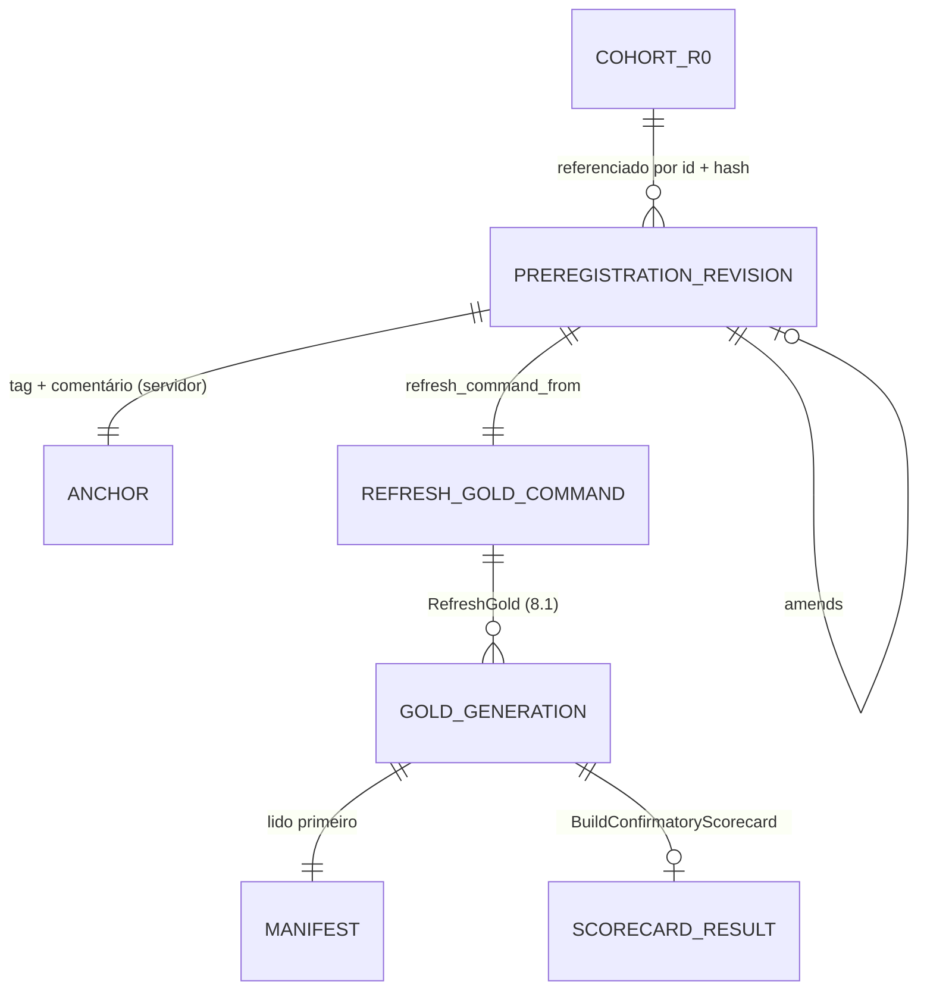

# Concept — Stage 6.5 — Pré-registro imutável e scorecard confirmatório

> **Escopo deste documento:** o que será feito nesta Stage, por quê, e
> decisões técnicas relevantes para entender o "porquê". O plano executável
> fica no [`technical.md`](./technical.md) correspondente.
>
> **Camada teórica.** A teoria é do doc de domínio
> [`probabilistic-forecast-evaluation.md`](../../domain/evaluation/probabilistic-forecast-evaluation.md)
> (`accepted`): §8 inteiro (o que o pré-registro congela, quando, a árvore do
> veredito, nunca agregar horizontes, critério de sucesso), mais os parâmetros
> pré-registráveis de §4.4, §5.1, §5.3, §6.1, §6.4, §6.5, §6.9, §7.4 e §7.6 e as
> convenções #2, #10, #12–#16b, #19, #22, #23 e #25–#30 da §10. Este concept não
> reabre nenhuma delas: fixa a forma do artefato, a leitura do gold, a
> composição do veredito e os valores que a teoria deixou para o pré-registro.
>
> **Estado deste rascunho.** Revisado após o Checkpoint A rodada 1
> (2026-09-30), com as decisões do humano registradas no
> [ADR 6.5.0010](../../adr/6_5_0010-human-decisions-blinding-threshold-deviation-winner.md).
> Uma única decisão segue aberta (§13): o conteúdo — ou a ausência — da
> declaração opcional de cegamento do arquivo r0. Ela não muda nenhuma regra;
> só a Task de congelamento espera por ela.

## 1. Escopo

### Dentro do escopo

Contratos em §4; decisões em §7.

- **Pré-registro como artefato canônico** (D1): arquivo
  `config/preregistration/<name>-r<rev>.toml` por revisão, lido por um port de
  saída (`PreregistrationSource`, adapter `tomllib`) e transformado no VO
  `Preregistration` (domínio da `evaluation`) — números coagidos ao tipo
  declarado, cada regra aplicada pelo scorecard nomeada por um identificador que
  o domínio só aceita se implementa —, com hash canônico pelo VO novo
  `PreregistrationHash` em `shared/domain/value_objects/`, que codifica os
  floats de forma exata antes do hasher (que arredonda a 10 casas), e
  `preregistration_ref = "<name>-r<rev>-<hash12>"`
  ([ADR 6.5.0001](../../adr/6_5_0001-preregistration-canonical-toml-hashed-value-object.md)).
- **Emenda** como revisão nova que aponta a anterior, justifica e declara se foi
  escrita cega; o original nunca é editado (D2,
  [ADR 6.5.0002](../../adr/6_5_0002-amendment-as-new-revision-file.md)).
- **Âncora** por tag publicada + comentário na issue (carimbo do servidor),
  registrada num arquivo separado fora do hash; o use case recusa plano sem
  âncora e marca como não pronto o gold gerado antes dela (D3,
  [ADR 6.5.0003](../../adr/6_5_0003-anchor-by-tag-and-issue-comment-and-order-check.md)).
- **Conteúdo e valores do pré-registro AAPL r0** (D4, D9): tudo o que julga —
  `asset`, referência ao cohort, fonte do realizado, horizontes avaliados e não
  avaliados, grade, candidato e comparadores por nível, seeds de cada modelo,
  déficits de janela, os identificadores das regras, DM/Holm, MCS, gate H1,
  perfis, declaração opcional de cegamento — com os valores de convenção no
  [ADR 6.5.0009](../../adr/6_5_0009-preregistered-conventional-values.md) e os do
  humano no ADR 6.5.0010.
- **Derivação única** `refresh_command_from(preregistration, reference)` →
  `RefreshGoldCommand` inteiro (partição = `cohort_id` referenciado) (D4,
  [ADR 6.5.0004](../../adr/6_5_0004-judging-values-in-preregistration-cohort-by-reference.md)).
- **Leitura do gold** pelo port do consumidor
  `GoldGenerationReader.read_generation`, com real no `ParquetGoldStore` (dono do
  layout) e fake `InMemoryGoldGenerationReader`; dono único do schema do gold
  (`application/dtos/gold_schema.py`) e da montagem de uma geração lida
  (`GoldGeneration.from_stored`); manifesto primeiro, sem inferência hive, tabela
  vazia pelo `rows_by_table`, `BLOCKED`/ausente recusado (D5,
  [ADR 6.5.0005](../../adr/6_5_0005-gold-generation-reader-port-manifest-first.md)).
- **Conferência do gold contra o plano** antes do veredito: manifesto, conjunto
  de modelos, seeds por modelo, grade, estatística e bloco do MCS (D4).
- **Gate H1 e sensibilidades no domínio** sobre contagens médias entre seeds
  (Wilson 97,5 % por cauda do par 80 %, taxa de degeneração média ≤ 1 %; LR_uc de
  3 estados; partição DGT em h > 1; gate na amostra comum) e **poder exato** do
  gate contra os cenários pré-registrados (D6,
  [ADR 6.5.0006](../../adr/6_5_0006-scorecard-inputs-gate-from-seed-mean-counts.md)).
- **`ConfirmatoryScorecard`** (domínio): árvore H1 → H2 por horizonte, desfecho
  ordenado de H2, vencedor primário, critério de sucesso do estudo; perfil
  separado; `academic_decision_ready` como conjunção de gates de validade (D7,
  [ADR 6.5.0007](../../adr/6_5_0007-verdict-logical-form-and-decision-readiness.md)).
- **Perfil** construído do que o gold tem (D8,
  [ADR 6.5.0008](../../adr/6_5_0008-profiles-declared-in-preregistration-built-where-inputs-exist.md)).
- **Use case `BuildConfirmatoryScorecard`** com erros nomeados e resultado DTO de
  serialização única.
- **Congelamento e âncora do pré-registro AAPL r0** (arquivo, espelho
  `docs/preregistration/aapl_confirmatory.md`, teste de consistência com o
  cohort e com o espelho, tag e comentário) — depois da decisão aberta em §13.
- **Wiring** no `composition_root`, **e2e** sintético e **redação do roadmap**
  §Stage 6.5, 8.1 e 8.2 (D10).

### Fora do escopo (explicitamente)

- **Execução do cohort confirmatório**, publicação do gold AAPL e do scorecard
  AAPL, e a gravação do scorecard como `gold_model_comparison_confirmatory_scorecard`
  → **8.1** (ADR 6.5.0008 item 5). A 6.5 **não** calcula nenhuma métrica sobre o
  `parent_sweep_id` do cohort: todo teste e o e2e usam silver sintético.
- **Perfis que exigem séries novas** — DM por fold, por seed e por τ;
  sensibilidades de bloco do MCS l = h e l = ⌈√T⌉; diagnóstico de
  estacionariedade de d_t; degeneração parcial por par; p-valor Monte Carlo de
  Christoffersen → **issue de seguimento** no BC `evaluation`, a abrir pela sessão
  mestra, **antes da 8.1** (ADR 6.5.0008 item 3). Os parâmetros deles são
  pré-registrados **aqui**.
- **Regras de H3 e do benchmark conformal (CQR):** também lidas pela 8.1, mas
  pré-registradas pelas Stages donas (variante do CQR na 7.2 — roadmap "Lacunas
  conhecidas", overview §11; leitura de H3 na 7.3). Este pré-registro cobre H1 e
  H2 (ADR 6.5.0008 item 6).
- **Diagrama de sharpness e plots** → **8.3**; tipo Parquet de coluna toda nula
  para consultas DuckDB ad hoc → encaminhado à **8.3** (ADR 6.5.0005 item 4).
- **Tolerância de equivalência** → **8.2**.
- **Reabrir hipóteses** ou o desenho do doc de domínio §8 (non_goal do roadmap);
  **reabrir o cohort** (ADR 6.5.0010, P1).
- **Recomputar** DM/Holm/MCS/cobertura a partir do silver: o gold é a fonte.
- **Otimização do refresh** (≈ 19 s no cohort real, technical 6.4 §7).
- **Unificação da regra "int ≥ 0"** → **#118**. **Loggers desligados pelo
  `import-linter`** → **#125**.
- **Adapter-in (CLI)** do scorecard: nenhum consumidor o pede antes da 8.1.
- **Registro no OSF** (ADR 6.5.0003, Alternativa B).

### Vínculo com o roadmap

Step 6 — "evidência confirmatória academicamente defensável e auditável"
([`roadmap.md`](../../roadmap.md)). A 6.5 fecha o Step: o gold da 6.4 existe,
mas nada congela **como se julga** nem aplica a regra (doc §8.2, B-ORDEM); sem
scorecard, os números não viram veredito. Entrega os objetivos H1/H2 do
[`overview.md`](../../overview.md) §4 como regra mecânica e o "scorecard
pré-registrado" do §7.

## 2. Objetivo da Stage

Ao final desta Stage existe, ancorado com carimbo do servidor, um pré-registro
AAPL imutável e hasheado do qual sai, por uma função única, o comando inteiro do
refresh do gold; e, dado um gold `COMPLETED` gerado depois da âncora a partir
desse comando, o use case `BuildConfirmatoryScorecard` confere o gold contra o
plano e devolve, sem recomputar o que o gold tem, o veredito mecânico por
horizonte — gate H1 sobre contagens médias entre seeds, desfecho de H2, vencedor
primário — separado do perfil, com `academic_decision_ready` verdadeiro só quando
todos os gates de validade passam; gold de outro plano ou cohort, sem âncora ou
bloqueado não vira scorecard.

## 3. Contexto e premissas

### Contexto

- **Gold da 6.4** (PR #126, em `develop`): por cohort, uma geração
  `gold/asset=<a>/parent_sweep_id=<p>/current/` com `MANIFEST.json` escrito por
  último (ADR 6.4.0005) e cinco tabelas — `gold_quality_checks`,
  `gold_metrics_by_run`, `gold_calibration_table`, `gold_dm_results`,
  `gold_mcs_results` —, as quatro confirmatórias com `preregistration_ref`. As
  chaves vivem como `_KEY` privados em cada builder
  (`adapters/out/duckdb/gold_builders/`): `metrics_by_run` (model, seed, horizon,
  sample, metric, level_low, level_high); `calibration_table` (model, seed,
  horizon, sample, kind, levels, includes_degenerate, dgt_offset, dgt_step,
  band_level) com `n_violations`, `n_observed`, `degeneracy_rate`, Wilson,
  Kupiec, LR's; `dm_results` (horizon, variance_estimator, candidate,
  comparator) com `adjusted_p_value`, `rejected`, `fallback_applied`;
  `mcs_results` (horizon, scheme, model) com `included`, `statistic`,
  `block_size`, `max_block_estimate`. Linhas por seed e por amostra
  (`model_full`, `common`); a média entre seeds e a escolha de amostra/variante
  são da 6.5 (ADR 6.4.0007).
- **`RefreshParameters`** (ADR 6.4.0006) não tem default nem lista de seeds,
  grade, estatística ou regra de bloco do MCS; `RefreshGoldCommand` pede também
  `asset`, `parent_sweep_id`, `horizons`, `window_deficits` e
  `dataset_fingerprint` (ADR 6.4.0009). Hoje só testes os preenchem.
- **Hash:** `check_layout` regra 6 só permite `hash_mapping` em
  `shared/domain/value_objects/`; o `CanonicalJsonHasher` arredonda floats a 10
  casas (`_FLOAT_PRECISION = 10`, ADR 1.4.0001).
- **Port-coverage:** o gate reconhece fake só por nome `Fake<Port>`/`InMemory<Port>`
  e real só se o módulo cita o port (`scripts/check_port_coverage.py`).
- **Leitura do gold** (technical 6.4 §7 `[finding]` Task 08; roadmap §Stage 6.5):
  o pyarrow infere partições hive do caminho e falha ao unir com as colunas
  `asset`/`parent_sweep_id`; tabela com zero linhas é gravada com schema vazio.
- **Cohort r0** (`config/cohorts/aapl_confirmatory.toml`, ADR 5.5.0001):
  `cohort_id = aapl_confirmatory-r0-665f45d9169a` (= `parent_sweep_id`),
  `asset_id = AAPL`, horizontes (1, 7), grade (0,02; 0,1; 0,25; 0,5; 0,75; 0,9;
  0,98), seeds do TFT 1..10, GBM com `seed = 0` (uma execução por fold),
  baselines sem seed (`run_baselines.py`), 6 folds × 252, `dataset_fingerprint =
  00e4406d…`; âncora = tag `cohort/aapl_confirmatory-r0-665f45d9169a` + comentário
  na #102. h+30 está fora do cohort por decisão do humano (concept 5.5 §1).
- **Medição da 6.4 sobre o cohort r0** (technical 6.4 §7): o refresh rodou até
  `COMPLETED` numa cópia do cohort, num container descartado, e computou as
  tabelas confirmatórias; foram impressos só status, durações, contagens,
  `grid_trimmed_prefix`, igualdade de fingerprint, resumo do realizado e checks
  agrupados por contagem — nenhum valor de métrica, p-valor ou taxa. O humano
  decidiu manter o registro como está e o r0 como cohort julgado (ADR 6.5.0010,
  P1); nenhum artefato desta Stage afirma que nenhuma métrica jamais foi
  computada sobre o r0.
- **Kernels de contagem da 6.3** aceitam contagens médias reais
  (`WilsonBand.evaluate`, `lr_uc_three_state`, `chi_square_sf`; ADR 6.3.0005).

### Premissas

- A árvore H1 → H2 e todas as convenções citadas no cabeçalho estão
  ratificadas (doc de domínio `accepted`, ADRs 0.0.0010/0.0.0011); o concept só as
  compõe.
- Os nomes de modelo no gold são `dim_run.model_version`: `tft_quantile`
  (candidato), `gbm_quantile` e `baseline_<família>` (constantes dos escritores).
- n efetivo por horizonte ≈ 6 × 252 = 1 512 pontos não-degenerados (pela
  geometria, não medido; pode ser menor em h+7 pela interseção); o valor exato é
  medido pelo scorecard.
- Nenhum valor de métrica do cohort foi visto por ninguém (registro da 6.4); por
  isso as convenções C desta Stage continuam do agente (skill
  `evidence-resolution` §1: C vira P só depois de haver dado confirmatório visto).

### Dependências

- `6.4-gold-builders-and-quality-gates` (`done`, PR #126): tabelas gold,
  `GoldManifest`/`RefreshParameters`/`RefreshGoldCommand`/`GoldTable`/
  `GoldPartition`/`check_generation`, `GoldStore`/`ParquetGoldStore`/
  `InMemoryGoldStore`, `RefreshGold`, os validadores públicos donos.
- `5.5-confirmatory-retrain` (`done`, PR #121): cohort congelado, `CohortHash`,
  âncora na #102, `DatasetContentFingerprint`.
- 6.1–6.3 (`done`): `WilsonBand`, `lr_uc_three_state`, `chi_square_sf`,
  `HitKind`, `DmVarianceEstimator`, `BootstrapScheme`, validadores.
- 1.4 (`Hasher`, ADR 1.4.0001).

## 4. Contratos

### Introduzidos

Shared (`shared/domain/value_objects/`):

- **`PreregistrationHash`** (`value-object`) — `value: str` (sha256 hex);
  `compute(*, hasher: Hasher, payload: Mapping[str, object]) -> PreregistrationHash`
  sobre o payload inteiro, depois de trocar todo `float` `x` por
  `f"float:{x!r}"` (ADR 6.5.0001 item 3).

Domínio (`evaluation/domain/`):

- **`Preregistration`** (`value-object`, `value_objects/preregistration.py`) —
  frozen, com VOs aninhados por bloco (nomes finais na Fase 3B; conteúdo em
  ADR 6.5.0004 item 1–2 e §9): `name`, `revision`, `asset`; `CohortReference`
  (`cohort_id`, `cohort_hash`); `RealizedSource` (`source`,
  `dataset_fingerprint`); `horizons`, `horizons_not_evaluated`;
  `quantile_levels`; `candidate`; `ComparatorTiers` (`naive`,
  `strong_statistical`, `ml`: disjuntos, sem o candidato);
  `seeds: Mapping[str, SeedSpec]` (lista ou "sem seed", um por modelo);
  `window_deficits: Mapping[str, int]` (um por modelo); `RuleIdentifiers`
  (`primary_metric`, `secondary_roles`, `dm.direction`, `dm.kernel_lag`,
  `dm.small_sample`, `dm.negative_variance_fallback`, `mcs.statistic`,
  `mcs.block_rule`, `exclusions`, `seed_aggregation`, `verdict.form`,
  `success_criterion`); `DmSpec` (`alpha`, `primary_estimator`,
  `sensitivity_estimators`); `McsSpec` (`alpha`, `reps`, `seed`,
  `primary_scheme`, `sensitivity_schemes`, `block_sensitivities`);
  `H1GateSpec` (`lower_level`, `upper_level`, `gate_band_level`,
  `profile_band_level`, `degeneracy_threshold`, `degeneracy_tolerance`,
  `sensitivity_alpha`, `power_scenarios: tuple[TailDeviation, ...]` com o papel
  primário/secundário); `min_violations`; `MonteCarloSpec` (`draws`, `seed`);
  `ProfileSpec`; `blinding_statement: str | None` (opcional, ADR 6.5.0010);
  `Amendment | None` (`amends`, `justification`, `blind_status`).
  ```python
  @classmethod
  def from_mapping(cls, mapping: Mapping[str, object]) -> Preregistration: ...
  def as_payload(self) -> dict[str, object]: ...   # serialização canônica única
  def reference(self, digest: PreregistrationHash) -> str: ...  # "<name>-r<rev>-<hash12>"
  ```
- **`TailDeviation`** (`value-object`) — `label`, `role` (primário/secundário),
  `lower_rate`, `upper_rate` (taxas verdadeiras de violação por cauda).
- **Evidência por horizonte** (`value-objects`, `value_objects/scorecard_evidence.py`):
  `SeedTailCounts` (`seed`, `n_violations`, `n_observed`, `degeneracy_rate`),
  `TailEvidence` (contagens por seed de uma cauda, com as sub-séries DGT quando
  h > 1), `DmEvidence` (`comparator`, `estimator`, `mean_differential`,
  `statistic`, `adjusted_p_value`, `rejected`, `fallback_applied`),
  `McsEvidence` (`scheme`, `model`, `included`), `HorizonEvidence` (horizonte, T
  comum, as duas caudas nas duas amostras, P̄_G por modelo, DM, MCS, calibração
  e degeneração dos comparadores).
- **`H1Gate`** (`domain-service`, `services/h1_gate.py`) —
  `evaluate(spec: H1GateSpec, evidence: HorizonEvidence) -> H1Result`.
- **`H1GatePower`** (`domain-service`, `services/h1_gate_power.py`) —
  `failure_probability(*, n: int, spec: H1GateSpec, deviation: TailDeviation) -> float`
  (decomposição binomial condicional da multinomial de 3 células).
- **`ConfirmatoryScorecard`** (`domain-service`,
  `services/confirmatory_scorecard.py`) —
  `decide(prereg: Preregistration, evidence: Sequence[HorizonEvidence]) -> ScorecardVerdict`.
  Result VOs: `H1Result` (bandas, n̄, T, aviso de dependência serial, degeneração
  média, poder por cenário, sensibilidades e divergências), `H2Outcome`
  (`NOT_APPLICABLE`, `NO_SKILL_OVER_NAIVE`, `BEATS_NAIVE_ONLY`,
  `BEATS_NAIVE_TIES_STRONG`, `BEATS_NAIVE_AND_STRONG`), `HorizonVerdict`
  (`horizon`, `h1`, `beats_naive`, `beats_or_ties_strong`, `in_mcs`, `h2`,
  `primary_winner: str | None`, `candidate_has_lowest_mean_pinball: bool`),
  `ScorecardVerdict` (`horizons`, `study_success_h1: bool`).

Application (`evaluation/application/`):

- **`PreregistrationSource`** (`port-out`,
  `ports/out/preregistration_source.py`) —
  ```python
  class PreregistrationSource(Protocol):
      def read(self, *, name: str, revision: int) -> PreregistrationRecord: ...
  ```
  `PreregistrationRecord` (DTO): `payload: Mapping[str, object]`,
  `anchor: PreregistrationAnchor | None` (`tag`, `commit`, `comment_url`,
  `anchored_at: datetime` com fuso). Revisão inexistente →
  `PreregistrationNotFoundError` (no módulo do port).
- **`GoldGenerationReader`** (`port-out`,
  `ports/out/gold_generation_reader.py`) —
  `read_generation(*, partition: GoldPartition) -> GoldGeneration`; no mesmo
  módulo, `GoldManifestNotFoundError` e `GoldGenerationCorruptError`.
- **Schema do gold** (`dtos/gold_schema.py`): nome, chave e colunas lidas de cada
  tabela — dono único, importado pelos cinco builders e pelo leitor.
- **DTOs** (`dtos/refresh_gold.py`, aditivos): `GoldManifest.from_mapping`,
  `RefreshParameters.from_mapping` (inversas de `as_mapping`; o manifesto com
  `preregistration_ref` de topo ≠ o dos parâmetros é recusado);
  `GoldGeneration` (`manifest`, `tables`) e `GoldGeneration.from_stored(manifest,
  rows_by_table)` — montagem única, com `check_generation`.
- **DTOs** (`dtos/confirmatory_scorecard.py`):
  `refresh_command_from(prereg, reference) -> RefreshGoldCommand`;
  `BuildConfirmatoryScorecardCommand` (`name`, `revision`, `preregistration_ref`
  esperado) — **sem** partição; `ScorecardProfile`; `ScorecardResult`
  (`preregistration_ref`, `revision_chain`, `anchor`, `blinding_statement`,
  `manifest_read`, `verdict`, `profile`, `academic_decision_ready`,
  `readiness_reasons`, `as_mapping()` — serialização única).
- **Mapeador linhas → evidência** (`use_cases/scorecard_evidence.py`, módulo
  auxiliar do use case): lê as linhas pelo schema, confere o gold contra o plano
  (ADR 6.5.0004 item 5) e monta os `HorizonEvidence`.
- **Erros** (`ApplicationError`, no módulo do use case):
  `PreregistrationHashMismatchError`, `PreregistrationChainError`,
  `PreregistrationNotAnchoredError`, `PreregistrationMismatchError`,
  `GoldNotReadyError`.
- **`BuildConfirmatoryScorecard`** (`use case`) —
  `__call__(command) -> ScorecardResult`; construtor recebe
  `PreregistrationSource`, `GoldGenerationReader` e `Hasher`.

Adapters (`evaluation/adapters/out/`):

- **`TomlPreregistrationSource`** (`toml/toml_preregistration_source.py`) —
  lê `<root>/<name>-r<rev>.toml` e `<root>/<name>-r<rev>.anchor.toml` com
  `tomllib`; raiz injetada (`settings.repo_root / "config/preregistration"` no
  `composition_root`).
- **`ParquetGoldStore.read_generation`** (`duckdb/parquet_gold_store.py`,
  aditivo; docstring cita `GoldGenerationReader`) — só I/O, chama
  `GoldGeneration.from_stored`.

Fakes (`tests/fakes/features/evaluation/`): `InMemoryPreregistrationSource`,
`InMemoryGoldGenerationReader`.

Artefatos versionados:

- `config/preregistration/aapl_confirmatory-r0.toml` e
  `config/preregistration/aapl_confirmatory-r0.anchor.toml`;
- `docs/preregistration/aapl_confirmatory.md` (espelho).

### Consumidos

- `GoldManifest`, `RefreshParameters`, `RefreshGoldCommand`, `GoldPartition`,
  `GoldTable`, `RefreshStatus`, `check_generation`, `ParquetGoldStore`,
  `InMemoryGoldStore`, `RefreshGold` (no e2e) — 6.4.
- `WilsonBand`, `lr_uc_three_state`, `chi_square_sf`, `HitKind`,
  `validate_min_violations`, `validate_rate` — 6.3; `DmVarianceEstimator`,
  `BootstrapScheme`, `validate_alpha`, `validate_mcs_reps`,
  `validate_bootstrap_parameters` — 6.2; `validate_tolerance` — 6.1.
- `Hasher` (1.4); `CohortHash`, o carregador do arquivo de cohort e as constantes
  de `model_version` dos escritores da `modeling` **só no teste de consistência**
  (ADR 6.5.0004 item 4).

## 5. Invariantes e regras

- **I1 — Um artefato canônico por revisão.** Os números e as regras que julgam
  vêm só do TOML da revisão; o espelho `.md` é narrativo e cita o hash completo de
  cada revisão; um teste recalcula o hash de todo arquivo de revisão e exige a
  citação.
- **I2 — Imutabilidade.** Qualquer campo folha alterado muda o hash (teste por
  folha); dois planos diferentes nunca têm o mesmo hash por arredondamento de
  float (1e-12 × 1e-11) nem por grafia int/float (0 × 0.0 é o mesmo plano);
  arquivo de revisão ancorada nunca é editado; emenda = revisão nova com
  `amends` = o `preregistration_ref` da anterior.
- **I3 — Identidade por VO de shared.** Só o `PreregistrationHash` chama
  `hash_mapping` (`check_layout` regra 6); `preregistration_ref` é formado por
  uma função só, no VO.
- **I4 — Regras nomeadas.** Toda regra que o scorecard aplica tem identificador
  no plano, aceito só se o domínio o implementa; mudar a regra exige identificador
  novo (novo hash).
- **I5 — Ordem.** O use case valida, nesta ordem, antes de ler o gold: cadeia de
  revisões (r0 sem campos de emenda; r ≥ 1 com `amends` igual à referência
  calculada da anterior), hash da revisão julgada igual ao `preregistration_ref`
  do comando, âncora de toda revisão da cadeia presente.
- **I6 — Uma derivação, gold conferido.** O `RefreshGoldCommand` inteiro sai só de
  `refresh_command_from`; o scorecard lê a partição derivada do plano e confere,
  nos dois sentidos, manifesto, modelos, seeds por modelo, grade, estatística e
  bloco do MCS antes de qualquer veredito.
- **I7 — Manifesto primeiro, um dono por regra de leitura.** Nenhuma tabela é
  lida antes do manifesto; o schema tem um dono (`gold_schema`), a montagem de
  uma geração lida tem um dono (`GoldGeneration.from_stored`); o adapter só faz
  I/O (`partitioning=None`); tabela com zero linhas vem do `rows_by_table`.
- **I8 — Nada recomputado do que o gold tem.** O scorecard só calcula: médias
  entre seeds das contagens e da degeneração, Wilson/LR_uc de 3 estados/DGT sobre
  essas médias, o poder, o efeito do DM com IC a partir das colunas persistidas, e
  a lógica do veredito.
- **I9 — Por horizonte.** Todo resultado é de um horizonte; nenhum campo agrega
  horizontes (doc §8.7); "≥ 1 horizonte" é uma contagem de gates (doc §8.8).
- **I10 — Só o candidato é filtrado.** O gate H1 decide só a elegibilidade do
  candidato; a família de Holm continua sendo os **seis comparadores** e o MCS os
  **sete modelos** (candidato + seis) mesmo que um comparador reprove a própria
  calibração ou passe do limiar de degeneração (doc §6.4).
- **I11 — n nunca é S·T.** O n da banda é a média entre seeds dos pontos
  não-degenerados de **um** conjunto alinhado (doc §4.4, §6.9).
- **I12 — O perfil nunca troca o veredito.** `ScorecardVerdict` é construído
  antes e sem o `ScorecardProfile`.
- **I13 — Prontidão ≠ vitória.** `academic_decision_ready` não depende do
  desfecho de H1/H2 nem da declaração de cegamento; cada conjunto falso gera uma
  razão nomeada.
- **I14 — Sem default.** Nenhum valor do pré-registro tem default em código; a
  única chave opcional é `blinding_statement`.
- **I15 — Nenhuma métrica sobre o cohort nesta Stage** e nenhuma afirmação
  sobre o passado do r0 além do que o technical 6.4 §7 registra.

## 6. Casos de erro e exceções

- **C1 — Pré-registro malformado** (chave desconhecida/ausente, tipo não
  coagível, identificador de regra não implementado, valor fora do validador
  dono, níveis de comparadores sobrepostos ou contendo o candidato, modelo sem
  seed ou sem déficit, seeds repetidas, déficit negativo, cenário de poder com
  taxas fora de (0, 1) ou soma ≥ 1, campos de emenda em r0 ou ausentes em r ≥ 1,
  `blinding_statement` vazio) → `ValueError` de `Preregistration.from_mapping`,
  com a mensagem do validador dono.
- **C2 — Revisão inexistente** → `PreregistrationNotFoundError` do source.
- **C3 — Hash divergente** (o `preregistration_ref` do comando ≠ o calculado) →
  `PreregistrationHashMismatchError`, antes de ler o gold.
- **C4 — Cadeia quebrada** → `PreregistrationChainError`.
- **C5 — Revisão sem âncora** → `PreregistrationNotAnchoredError`.
- **C6 — Partição sem manifesto** → `GoldManifestNotFoundError`; tabela do
  `rows_by_table` ausente, contagem divergente, geração incoerente, ou linhas
  esperadas faltando (seed pré-registrada sem cauda, comparador sem DM, esquema sem
  MCS) → `GoldGenerationCorruptError`.
- **C7 — Gold `BLOCKED`** → `GoldNotReadyError` com os checks que bloquearam.
- **C8 — Gold de outro plano ou de outro cohort** (partição,
  `preregistration_ref`, parâmetros, horizontes, déficits ou fingerprint do
  manifesto ≠ `refresh_command_from`; modelo a mais ou a menos em DM, MCS ou
  calibração; seed a mais ou a menos; nível da grade diferente; `statistic` do MCS
  ≠ o pré-registrado; `block_size` ≠ max(h, ⌈`max_block_estimate`⌉)) →
  `PreregistrationMismatchError` nomeando o campo.
- **C9 — Candidato 100 % degenerado** num horizonte → não é erro: banda "não
  aplicável", gate reprova, H2 `NOT_APPLICABLE`.
- **C10 — Gold anterior à âncora**, **emenda não-cega** ou **check exigido
  `SKIPPED`** → não é erro: scorecard produzido com `academic_decision_ready =
  false` e a razão.
- **C11 — Erro de programação** → propaga.

## 7. Decisões técnicas relevantes

> Triagem `evidence-resolution`: os forks antecipados na issue #127 (C1–C8)
> fecham como E/C com ADR `accepted`; esta sessão abriu mais sete registros E/C
> (6.5-PAIR, 6.5-POWER, 6.5-SIGMA, 6.5-VERDICT, 6.5-READY, 6.5-VALUES, 6.5-EMIT)
> e quatro decisões P, respondidas pelo humano no Checkpoint A rodada 1
> (ADR 6.5.0010). As fontes externas foram conferidas no texto bruto pelo
> subagente da issue (#127, "Teóricas"); o cálculo de poder foi conferido nesta
> sessão contra a tabela do doc §8.5 (T = 500: calibrado 0,959; locação 0,2σ
> 0,160; 0,3σ 0,004; cobertura 75 % 0,420; 85 % 0,464 — reproduzidos, pela soma
> dupla e pela decomposição condicional). Revisão de completude
> (`decision-reviewer`) e Checkpoint A rodada 1 aplicados nesta versão.

### D1 — Pré-registro: TOML canônico por revisão → VO tipado → hash exato de shared (fork C1)

- **O quê:** ADR 6.5.0001: VO em `value_objects/` (não em `services/`, como o
  roadmap escrevia); números coagidos ao tipo declarado; regras nomeadas por
  identificadores aceitos só se implementados; hash pelo `PreregistrationHash`,
  que codifica cada float por `repr` antes do hasher (que arredonda a 10 casas).
- **Por quê:** um dono para valores, regras e hash; nenhum plano diferente com o
  mesmo hash; o espelho não deriva em silêncio; padrão do cohort.
- **Fonte:** ADR 5.5.0001; `check_layout` regra 6; `canonical_json_hasher.py`
  (`_FLOAT_PRECISION`); doc §8.1.
- **ADR:** [`6.5.0001`](../../adr/6_5_0001-preregistration-canonical-toml-hashed-value-object.md)

### D2 — Emenda como revisão nova (fork C3)

- **O quê:** ADR 6.5.0002; emenda `unblinded` ⇒ veredito exploratório
  (`academic_decision_ready = false`); "primeiro refresh confirmatório" = o
  primeiro refresh do gold do cohort depois da âncora da r0, com o comando
  derivado do plano (o da 8.1).
- **Por quê:** ICH E9 §4.5/§5.1; OSF "Update" com justificativa; Wagenmakers et
  al. 2012 (só o pré-declarado é confirmatório).
- **Fonte:** issue #127 (fontes verificadas); doc §8.1, §8.3.
- **ADR:** [`6.5.0002`](../../adr/6_5_0002-amendment-as-new-revision-file.md)

### D3 — Âncora e o que a Stage prova sobre a ordem (fork C2)

- **O quê:** ADR 6.5.0003: tag `preregistration/<ref>` + comentário na issue da
  Stage (o `created_at` do servidor é a âncora), registro em
  `<name>-r<rev>.anchor.toml`; o use case recusa plano sem âncora e marca como não
  pronto gold com `started_at` anterior à âncora; a comparação é por conteúdo
  (hash do arquivo em HEAD), então o rebase do branch não quebra a âncora. A
  prova de ordem desta Stage cobre: âncora do **cohort referenciado** (r0: #102)
  < âncora do pré-registro (#127), a 6.5 não calcula nada sobre o cohort, e o
  gold lido pelo scorecard é posterior à âncora. **Não** afirma que nenhuma
  métrica foi computada sobre o r0 antes da âncora (ADR 6.5.0010, P1).
- **Por quê:** hash prova integridade, não anterioridade; carimbo do cliente é
  forjável (ADR 5.5.0001); o consumidor do plano existe, então as checagens
  baratas moram nele; a letra do DoD do roadmap não é provável e é reescrita
  (D10).
- **Fonte:** ADR 5.5.0001; Mertens & Krypotos 2019; Cramer et al. 2022 (issue #127).
- **ADR:** [`6.5.0003`](../../adr/6_5_0003-anchor-by-tag-and-issue-comment-and-order-check.md)

### D4 — O que o pré-registro contém; cohort por referência; gold conferido (fork C5)

- **O quê:** ADR 6.5.0004: o plano traz `asset`, referência ao cohort, fonte do
  realizado, horizontes (1, 7) e "30 não avaliado — fora do cohort", grade,
  candidato e comparadores por nível, seeds de cada modelo, déficits, os
  `RefreshParameters`, o gate e os identificadores das regras (primária e papel
  das secundárias, direção/kernel/lag/correção/fallback do DM, estatística e regra
  de bloco do MCS, exclusões, agregação de seeds, forma do veredito, critério de
  sucesso); `refresh_command_from` é a derivação única do comando; teste de
  consistência com o arquivo do cohort; o scorecard confere manifesto, modelos,
  seeds, grade e MCS antes do veredito.
- **Por quê:** doc §8.1 lista esse conteúdo; papel de cada hash (§8.2); o manifesto
  sozinho não tem seeds, grade, modelos nem regra de bloco — uma seed a mais no
  silver entraria em silêncio nas médias.
- **Fonte:** doc §8.1, §8.2; ADR 5.5.0001, 6.4.0006, 6.4.0009, 0.0.0053.
- **ADR:** [`6.5.0004`](../../adr/6_5_0004-judging-values-in-preregistration-cohort-by-reference.md)

### D5 — Leitor do gold: port do consumidor, schema e montagem com dono (fork C4)

- **O quê:** ADR 6.5.0005: `GoldGenerationReader.read_generation`, real no
  `ParquetGoldStore`, fake `InMemoryGoldGenerationReader`; `gold_schema.py` dono
  de nome, chave e colunas; `GoldGeneration.from_stored` (inversas `from_mapping` +
  `check_generation`) como montagem única, usada por fake e real; adapter só I/O
  com `partitioning=None`; `BLOCKED` devolvido e recusado pelo use case.
- **Por quê:** as regras de leitura valem para todo consumidor (6.5, 8.1, 8.3); o
  layout já tem dono; chaves privadas nos builders e parsing em cada store seriam
  segundas escritas; o gate de port-coverage exige os nomes.
- **Fonte:** ADR 6.4.0005; technical 6.4 §7 `[finding]` Task 08;
  `scripts/check_port_coverage.py`.
- **ADR:** [`6.5.0005`](../../adr/6_5_0005-gold-generation-reader-port-manifest-first.md)

### D6 — Gate H1 sobre contagens médias entre seeds; sensibilidades; poder exato (forks C6, C8)

- **O quê:** ADR 6.5.0006: gate nas linhas `lower_tail` τ = 0,10 e
  `upper_tail` τ = 0,90 do candidato, amostra `model_full`, variante mascarada
  (`includes_degenerate = false`), série inteira; médias de `n_violations`,
  `n_observed` e `degeneracy_rate` entre as seeds pré-registradas; Wilson 97,5 %
  por cauda; degeneração média ≤ 1 %; 95 %, a amostra comum e a calibração e o
  limiar dos comparadores no perfil; LR_uc de 3 estados (χ²(2), α 0,05) e DGT
  (mesma amostra e variante, nível 1 − 0,05/(2h)) sobre as mesmas médias; poder =
  probabilidade exata de reprovar sob cada cenário (taxas explícitas; locação em σ
  convertida pelo modelo normal do §8.5), em n = round(n̄), pela decomposição
  condicional. A estimativa da banda é c̄/n̄ (razão de médias, a entrada dos
  kernels — ADR 6.3.0005), não a média das taxas por seed que o doc §6.9 escreve;
  só diferem se a degeneração variar entre seeds, e a média das taxas vai ao
  perfil ao lado.
- **Por quê:** a regra é do doc (B-GATE-H1, B-BANDAS, B-SEEDS, B-H7); `model_full`
  é o lado conservador para um claim de não-rejeição (degrau 4); o poder exato é o
  que o doc usou.
- **Fonte:** doc §4.4, §5.3, §6.9, §7.4, §8.5; ADR 6.3.0004, 6.3.0005, 6.4.0007.
- **ADR:** [`6.5.0006`](../../adr/6_5_0006-scorecard-inputs-gate-from-seed-mean-counts.md)

### D7 — Forma do veredito, vencedor primário e prontidão

- **O quê:** ADR 6.5.0007: níveis naive = {`baseline_zero_return`,
  `baseline_historical_mean`}, estatístico forte = {`baseline_ar1`,
  `baseline_ewma_vol`, `baseline_historical_quantiles`}, ML = {`gbm_quantile`};
  o veredito lê naive × fortes (= estatístico forte ∪ ML); família de Holm = os
  seis, MCS = os sete; desfecho ordenado de H2; vencedor primário = candidato se
  H1 ∧ (i) ∧ (ii), com (ii) = no MCS primário ∨ supera todos os fortes — regra
  confirmada pelo humano (P4); "o candidato tem a menor P̄_G" é informação, não
  condição; perfil mostra o desfecho por nível; sucesso do estudo = H1 em ≥ 1
  horizonte; `academic_decision_ready` = gold `COMPLETED` sem check
  bloqueante/pulado ∧ gold depois da âncora ∧ nenhuma emenda não-cega — nunca o
  desfecho.
- **Por quê:** a árvore é a do doc §8.6; "superar ou empatar com os fortes" é o
  interesse científico do overview §4 e o ML é o degrau mais forte da hierarquia —
  pô-lo entre os fortes é a leitura mais exigente; refutação é resultado válido
  (overview §1).
- **Fonte:** doc §6.10, §8.6–§8.8; overview §1, §4; FDA 2022 (issue #127);
  ADR 6.5.0010 (P4).
- **ADR:** [`6.5.0007`](../../adr/6_5_0007-verdict-logical-form-and-decision-readiness.md)

### D8 — Perfis: declarados agora, construídos onde há insumo; scorecard emitido como DTO (fork C7)

- **O quê:** ADR 6.5.0008: o pré-registro declara todo perfil com parâmetros
  (inclusive o diagnóstico de estacionariedade de d_t de B-FOLDS); a 6.5 constrói
  o que o gold tem + sensibilidades do gate + poder + efeito do DM com IC (d̄ ±
  t_{T−1, 0,975}·(d̄/estatística), doc §6.8) + `fallback_applied` + calibração e
  limiar dos comparadores + desfecho por nível + menor P̄_G; perfis de séries
  novas → issue de seguimento antes da 8.1; sharpness → 8.3; o `ScorecardResult`
  tem `as_mapping()` único e a 8.1 o grava **fora** de `current/` (a geração é
  trocada inteira no próximo refresh).
- **Por quê:** o perfil não troca o veredito, então **quando** é calculado não
  afeta o claim desde que **o quê** tenha sido declarado antes (ICH E9 §5.1).
- **Fonte:** ADR 6.4.0005, 6.4.0007 item 5; concept 6.4 §Fora do escopo; roadmap
  §Stage 8.1.
- **ADR:** [`6.5.0008`](../../adr/6_5_0008-profiles-declared-in-preregistration-built-where-inputs-exist.md)

### D9 — Valores do pré-registro r0

- **O quê:** convenção/evidência (ADR 6.5.0009): `dm_alpha` 0,05; DM unilateral,
  retangular (registro) + Bartlett, fallback #14b; MCS `R`, α 0,10, 1 000 reps,
  estacionário + moving-block, bloco max(h, ⌈máx b̂_sb⌉) com sensibilidades l = h
  e l = ⌈√T⌉; `mcs_seed` 127; bandas 0,975/0,95; par (0,10; 0,90);
  `min_violations` 2; tolerância 1e-12; Monte Carlo 999 sorteios, seed 128; seeds
  TFT 1..10, GBM 0, baselines sem seed; déficits 0; horizontes (1, 7), 30 não
  avaliado; sem exclusões; sem T mínimo extra. Do humano (ADR 6.5.0010): limiar de
  degeneração 1 %; cenários de poder primário ±5 p.p. + 0,2σ e secundário ±3 p.p.
  + 0,1σ; `blinding_statement` opcional com conteúdo em aberto (§13).
- **Fonte:** doc §10; ADRs 0.0.0010, 0.0.0011, 6.2.0005; Christoffersen &
  Pelletier 2004 §5; HLN 2011 §5.1.
- **ADR:** [`6.5.0009`](../../adr/6_5_0009-preregistered-conventional-values.md),
  [`6.5.0010`](../../adr/6_5_0010-human-decisions-blinding-threshold-deviation-winner.md)

### D10 — Pedido de mudança de roadmap (aplicado no PR desta Stage)

- **O quê**, na linha da 6.5:
  - **DoD reescrito** para o que a Stage prova: "pré-registro hasheado e imutável
    (qualquer campo alterado, inclusive regra nomeada, muda o hash); ancorado
    com carimbo do servidor depois da âncora do cohort referenciado; nenhuma
    métrica calculada pela 6.5 sobre o cohort; o scorecard recusa plano sem âncora,
    gold de outro plano/cohort e gold bloqueado, e marca como não pronto o gold
    gerado antes da âncora; aplica a regra pré-registrada mecanicamente por
    horizonte (primária = pinball + gate de calibração + DM/Holm + MCS); separa
    vencedor de perfil; `academic_decision_ready` exige todos os **gates de
    validade** (gold completo sem check bloqueante ou pulado, gold posterior à
    âncora, nenhuma emenda não-cega) e não depende do desfecho";
  - descrição humana: "`academic_decision_ready` só verdadeiro com todos os gates
    de validade satisfeitos"; o scorecard é emitido como resultado e gravado pela
    8.1;
  - `camada_alvo`: `multi (domain + application + adapters/out)`;
  - `arquivos_a_criar`: troca `domain/services/preregistration.py` por
    `domain/value_objects/{preregistration.py, scorecard_evidence.py}`; soma
    `shared/domain/value_objects/preregistration_hash.py`,
    `domain/services/{h1_gate.py, h1_gate_power.py}` (o
    `confirmatory_scorecard.py` segue),
    `application/ports/out/{preregistration_source.py, gold_generation_reader.py}`,
    `application/dtos/{gold_schema.py, confirmatory_scorecard.py}`,
    `application/use_cases/scorecard_evidence.py`,
    `adapters/out/toml/toml_preregistration_source.py`,
    `config/preregistration/aapl_confirmatory-r0{.toml,.anchor.toml}`, os dois
    fakes, os dois contratos e o e2e (nomes finais na Fase 3B);
  - `arquivos_a_modificar`: `application/dtos/refresh_gold.py` (inversas,
    `GoldGeneration`), `adapters/out/duckdb/parquet_gold_store.py`
    (`read_generation`), os cinco builders (chave do `gold_schema`),
    `composition_root.py`, `docs/LAYOUT.md` (§7 lista `PreregistrationHash` entre
    os VOs de identidade), arquivos de arquitetura (pureza);
  - `contratos_introduzidos`: `Preregistration`, `PreregistrationHash`,
    `TailDeviation`, VOs de evidência (value-objects), `H1Gate`, `H1GatePower`,
    `ConfirmatoryScorecard` (domain-services), `PreregistrationSource`,
    `GoldGenerationReader` (ports-out), `BuildConfirmatoryScorecard` (use case);
  - `contratos_consumidos`: sai a lista de 6.1–6.3 como recomputação; entram
    "tabelas gold + manifesto (6.4) via `GoldGenerationReader`",
    `RefreshParameters`/`GoldManifest`/`check_generation` (6.4), `WilsonBand`,
    `lr_uc_three_state`, `chi_square_sf` (6.3, sobre contagens médias), `Hasher`
    (1.4), cohort r0 por referência (5.5);
- na §Stage 8.1: depende também da issue de seguimento dos perfis e dos
  pré-registros de H3 (7.3) e do CQR (7.2); grava o scorecard fora de `current/`
  (`scorecard/<preregistration_ref>/`); o primeiro refresh confirmatório posta um
  comentário (fecho da ordem);
- na §Stage 8.2: `docs/preregistration/aapl_confirmatory.md` deixa de ser
  "arquivo a modificar" livre — o espelho só recebe seções acrescentadas por
  revisão (ADR 6.5.0001 item 6).
- **Fonte:** issue #127 item 7; technical 6.4 §7 `[finding]` Encaminhamentos
  (a); Checkpoint A rodada 1 (C-A2, C-M2); PIPELINE (roadmap editado pela Stage
  dona).

## 8. Integrações

### Internas (com outras Stages/módulos)

- **6.4 (mesmo BC):** o leitor é método novo do `ParquetGoldStore`; as chaves dos
  builders passam a vir do `gold_schema`; as inversas `from_mapping` e
  `GoldGeneration.from_stored` moram ao lado de `as_mapping` e de
  `check_generation`. Nenhuma regra de montagem ou de relatório muda.
- **8.1:** chama `refresh_command_from`, roda o refresh, posta o comentário do
  primeiro refresh confirmatório, chama `BuildConfirmatoryScorecard` e grava o
  `ScorecardResult` fora de `current/`.
- **modeling (5.5):** só por referência (id + hash no pré-registro); o teste de
  consistência lê o arquivo do cohort pelo carregador da `modeling` e as
  constantes de `model_version` dos escritores — em teste, nunca em
  `src/evaluation`.
- **shared:** `PreregistrationHash` (novo) e `Hasher`.
- **composition_root:** monta `TomlPreregistrationSource(root=settings.repo_root
  / "config/preregistration")`, o `ParquetGoldStore` já existente (como leitor) e
  o `Hasher`.

### Externas

- **`tomllib`** (stdlib) só no adapter `toml/`; **pyarrow** só em
  `adapters/out/duckdb/` (`store-no-storage-leak`) — o bloco de verificação da
  Fase 3B faz grep dos dois.
- **GitHub** (tag + comentário): passo manual do runbook da Task de
  congelamento; o carimbo do comentário é a âncora. Nenhuma chamada de rede no
  código.

## 9. Modelo de dados

Pré-registro (TOML, uma revisão por arquivo; blocos = VOs aninhados):

| Bloco | Conteúdo | Origem do valor |
|---|---|---|
| identidade | `name`, `revision`, `asset`; em r ≥ 1: `amends`, `justification`, `blind_status` | ADR 6.5.0001/0002/0004 |
| `cohort` | `cohort_id`, `cohort_hash` | cohort r0 |
| `realized` | `source`, `dataset_fingerprint` | cohort; ADR 6.4.0009 |
| julgamento | `horizons`, `horizons_not_evaluated`, `quantile_levels`, `candidate`, `comparators.{naive, strong_statistical, ml}`, `seeds.<modelo>`, `window_deficits.<modelo>` | cohort; ADR 6.5.0004, 6.5.0007, 6.5.0009 |
| `rules` | identificadores (primária, papéis, DM, MCS, exclusões, agregação de seeds, veredito, sucesso) | ADR 6.5.0004 item 2 |
| `dm` | `alpha`, `primary_estimator`, `sensitivity_estimators` | ADR 6.5.0009 |
| `mcs` | `alpha`, `reps`, `seed`, `primary_scheme`, `sensitivity_schemes`, `block_sensitivities` | ADR 6.5.0009 |
| `h1_gate` | par, níveis de banda, `degeneracy_threshold` (0,01), `degeneracy_tolerance`, `sensitivity_alpha`, `power_scenarios` (primário/secundário, taxas explícitas) | ADR 6.5.0006/0009/0010 |
| `backtests` | `min_violations`, `monte_carlo.draws`, `monte_carlo.seed` | ADR 6.5.0009 |
| `profiles` | perfis declarados e parâmetros | ADR 6.5.0008 |
| `blinding_statement` | texto opcional | ADR 6.5.0010 (conteúdo em aberto) |

Âncora (`<name>-r<rev>.anchor.toml`, fora do hash): `tag`, `commit`,
`comment_url`, `anchored_at`.



## 10. Riscos e mitigações

| Risco | Probabilidade | Impacto | Mitigação |
|---|---|---|---|
| Valor do pré-registro escolhido depois de ver resultado | B | A | Nenhum valor foi visto (registro da 6.4); âncora antes de qualquer refresh confirmatório; o scorecard recusa plano sem âncora e marca gold anterior a ela |
| Dois planos diferentes com o mesmo hash | B | A | Floats codificados por `repr` no `PreregistrationHash`; coerção de tipo; teste por folha e casos 1e-12 × 1e-11 e 0 × 0.0 |
| Regra muda no código sem mudar o hash | B | A | Identificadores de regra no plano, aceitos só se implementados (I4) |
| Espelho `.md` diverge do TOML | M | M | Teste recalcula o hash de toda revisão e exige a citação no espelho (I1) |
| Pré-registro diverge do cohort (fingerprint, horizontes, grade, seeds, modelos) | B | A | Teste de consistência com o arquivo e o hash do cohort (ADR 6.5.0004 item 4) |
| Gold de outro plano, cohort, seed ou modelo lido como confirmatório | B | A | Conferência manifesto + modelos + seeds + grade + MCS antes do veredito (C8) |
| Leitor de gold lê geração parcial, bloqueada ou com schema vazio | B | A | Manifesto primeiro; `BLOCKED` recusado; zero linhas pelo manifesto; `partitioning=None`; montagem única; contrato `[fake, real]` |
| Média entre seeds feita com n = S·T | B | A | I11; teste com S = 2 compara com a banda calculada à mão |
| Poder com n inteiro × gate com n̄ real; poder otimista em h+7 | M | B | Arredondamento e aviso de dependência serial declarados no resultado |
| Gate por não-rejeição sem garantia de tamanho condicional | — | M | Declarado no espelho (ADR 6.5.0007, Negative); o poder é reportado |
| Âncora é passo manual; rebase do branch | M | M | Runbook na Task de congelamento; tag preserva o commit; conferência por conteúdo |
| Declaração de cegamento sem decisão bloqueia o congelamento | M | M | Todo o resto é construível e testável com um pré-registro de teste; só a Task de congelamento espera |
| Stage densa | M | M | 12 Tasks (§12), port + fake + adapter + contrato numa Task por port; perfis de séries novas fora (ADR 6.5.0008) |

## 11. Critérios de aceitação

- [ ] `Preregistration.from_mapping` recusa chave desconhecida, chave ausente,
      identificador de regra não implementado e cada valor inválido pela mensagem
      do validador dono (um teste por bloco); aceita a ausência de
      `blinding_statement` e recusa-o vazio; `from_mapping(as_payload(p)) == p`;
      alterar **qualquer** campo folha muda o `PreregistrationHash` (teste
      paramétrico sobre todas as folhas —
      `tests/unit/features/evaluation/test_preregistration_immutable_hash.py`);
      tolerância 1e-12 × 1e-11 dão hashes diferentes; `0` × `0.0` num campo float
      dão o mesmo hash; `preregistration_ref` = `"<name>-r<rev>-<hash[:12]>"`;
      revisão 0 com campos de emenda e revisão ≥ 1 sem eles erguem.
- [ ] `check_layout` verde: `hash_mapping` só no `PreregistrationHash` (e nos VOs
      já existentes).
- [ ] `refresh_command_from(prereg, ref)` devolve um `RefreshGoldCommand` cujos
      campos (partição = `asset` + `cohort_id`, horizontes, déficits,
      fingerprint, parâmetros) são exatamente os do plano (teste por campo).
- [ ] `H1GatePower` reproduz a tabela do doc §8.5 em n = 500 com três casas
      (calibrado → reprova 0,041; locação 0,2σ → 0,840; 0,3σ → 0,996; cobertura
      75 % → 0,580; 85 % → 0,536); as taxas dos cenários de locação do r0
      recalculadas com `NormalDist` batem com as do arquivo.
- [ ] `H1Gate`: com S = 2 seeds, as bandas usam as contagens médias e o n médio
      (nunca S·T) e batem com `WilsonBand` chamado à mão; degeneração média acima
      de 1 % reprova com bandas contendo o nominal; banda não aplicável reprova;
      LR_uc de 3 estados e DGT (h > 1, nível 1 − 0,05/(2h), linhas `model_full`
      mascaradas) calculados das mesmas médias; divergência gate × sensibilidade
      listada nos dois sentidos; h = 1 sem DGT; o resultado carrega n̄, T e o aviso
      de dependência serial.
- [ ] `ConfirmatoryScorecard.decide` (`tests/unit/features/evaluation/test_scorecard_mechanical_rule.py`):
      um teste por desfecho (`NOT_APPLICABLE`, `NO_SKILL_OVER_NAIVE`,
      `BEATS_NAIVE_ONLY`, `BEATS_NAIVE_TIES_STRONG`, `BEATS_NAIVE_AND_STRONG`) e
      pelo vencedor primário; H1 reprovado com DM todo rejeitado dá
      `NOT_APPLICABLE` e sem vencedor; candidato fora do MCS que supera todos os
      fortes vence; candidato sem a menor P̄_G pode vencer (a flag é só
      informação); comparador que reprova a própria calibração ou passa do limiar
      continua na leitura de H2; horizontes independentes; `study_success_h1` =
      "≥ 1 horizonte com H1"; o veredito é idêntico com e sem perfil construído.
- [ ] Perfil: desfecho por nível (naive, estatístico forte, ML), efeito do DM
      com IC igual a d̄ ± t·(d̄/estatística), `fallback_applied`, calibração e
      limiar dos comparadores, 95 %, amostra comum, "sem lacunas", Bartlett e
      moving-block com divergências.
- [ ] `BuildConfirmatoryScorecard` com fakes: ordem I5 (hash divergente, cadeia
      quebrada e revisão sem âncora erguem **sem** chamar o leitor do gold);
      `GoldNotReadyError` para `BLOCKED`; `PreregistrationMismatchError` para cada
      campo do manifesto alterado (partição inclusive), para modelo a mais e a
      menos em DM, MCS e calibração, seed a mais e a menos, nível de grade
      diferente, `statistic` do MCS diferente e `block_size` fora da regra;
      `GoldGenerationCorruptError` para seed pré-registrada sem cauda, comparador
      sem DM e esquema sem MCS; `academic_decision_ready` falso, com a razão, para
      gold anterior à âncora, emenda `unblinded` e check `SKIPPED`; verdadeiro com
      H1 reprovado em todos os horizontes (refutação pronta); a declaração de
      cegamento, quando existe, é ecoada e não muda a prontidão.
- [ ] `PreregistrationSource` e `GoldGenerationReader` têm fake
      (`InMemoryPreregistrationSource`, `InMemoryGoldGenerationReader`) e suíte de
      contrato `[fake, real]` (`TomlPreregistrationSource` com revisão
      inexistente, âncora ausente e presente; `ParquetGoldStore.read_generation`
      com tabela de zero linhas, coluna toda `None`, geração `BLOCKED`, manifesto
      ausente e ida-e-volta `publish` → `read_generation` com igualdade de
      manifesto e de linhas); `GoldManifest.from_mapping(as_mapping(m)) == m` e
      manifesto com `preregistration_ref` divergente recusado; os cinco builders
      usam as chaves do `gold_schema` e seus testes seguem verdes;
      `check_port_coverage` verde sem entrada nova no baseline.
- [ ] E2E (`tests/integration/features/evaluation/test_build_confirmatory_scorecard.py`),
      silver sintético (≥ 2 horizontes, candidato com 2 seeds, os seis
      comparadores): pré-registro de teste → `refresh_command_from` →
      `RefreshGold` real → `BuildConfirmatoryScorecard` real lendo o Parquet →
      veredito esperado por construção do silver; o mesmo gold com um parâmetro
      alterado no plano, ou com uma seed a mais no plano →
      `PreregistrationMismatchError`.
- [ ] Pré-registro AAPL r0 congelado (depois da decisão de §13): arquivo válido
      com os valores dos ADRs 6.5.0009/0010; teste de consistência com o cohort r0
      (asset, id, hash, fingerprint, horizontes, grade, seeds, modelos) e com o
      espelho (hash completo citado) verde; nenhum texto do arquivo, do espelho ou
      do comentário afirma que nenhuma métrica foi computada sobre o r0; tag
      `preregistration/<ref>` publicada e comentário na #127 com ref, hash, tag,
      commit e cohort; `anchor.toml` gravado; o §7 do technical registra os
      carimbos do servidor da âncora do cohort (#102) e do pré-registro (#127), na
      ordem, e que a 6.5 não calculou nada sobre o cohort.
- [ ] `lint-imports` verde; nenhum import de runtime de `modeling` em `src/`
      da `evaluation`; `tomllib` só em `adapters/out/toml/`, `pyarrow` só em
      `adapters/out/duckdb/` (grep no bloco de verificação).
- [ ] Roadmap §Stage 6.5 (DoD e descrição reescritos), 8.1 e 8.2 conforme D10;
      `docs/LAYOUT.md` §7 lista o `PreregistrationHash`.
- [ ] `make check` verde (gate de saída).

## 12. Checklist de validação interna

- [x] Todos os contratos introduzidos têm assinatura definida? — §4; os nomes
      finais dos VOs aninhados e das colunas do `ScorecardResult` ficam para a
      Fase 3B (não persistidos por esta Stage).
- [x] Toda decisão em §7 tem fonte rastreável? — cada D cita doc/ADR/código.
- [x] Toda integração externa tem contrato definido (interface, formato, auth)?
      — `tomllib` e pyarrow só nos adapters; GitHub é passo manual (sem auth em
      código).
- [x] Decisões com alternativa real descartada têm ADR escrito? — ADRs
      6.5.0001–6.5.0010 (`accepted`; o 6.5.0010 registra as decisões do humano);
      D10 aplica pedido sem alternativa real.
- [x] Dependências de Stages anteriores estão satisfeitas (`done`)? — 6.4 (PR
      #126) e 5.5 (PR #121) em `develop`.
- [x] Stage cabe em ~3–12 Tasks (ver [`CONVENTIONS.md`](../../CONVENTIONS.md) §6)? — estimativa 12 (teto 15 da ROADMAP-1): (1) `PreregistrationHash` + `Preregistration` e VOs (tipos, identificadores); (2) `TailDeviation` + `H1Gate` + `H1GatePower`; (3) VOs de evidência + `ConfirmatoryScorecard`; (4) `gold_schema` + builders + inversas `from_mapping` + `GoldGeneration.from_stored`; (5) `PreregistrationSource` — port + fake + adapter TOML + contrato; (6) `GoldGenerationReader` — port + fake + `read_generation` + contrato; (7) `refresh_command_from` + mapeador linhas → evidência com a conferência do gold; (8) perfil; (9) use case + erros; (10) wiring + e2e; (11) congelamento e âncora do r0 + espelho + testes de consistência (depois de §13); (12) roadmap + LAYOUT.
- [x] Riscos críticos têm mitigação plausível? — §10.
- [x] Cada mecanismo novo passou pelo **teste da solução mais direta**: não é caso especial/tipo/métrica novo remendando, local, um sintoma que recorre em outros consumidores e teria tratamento mais simples/geral em outra camada (concern compartilhado). Captura assim → piso declarado + issue, não solução local. — A identidade do pré-registro usa o padrão existente de hash por VO de shared (`CohortHash`), sem esquema novo de imutabilidade; a codificação exata de floats fica no único VO que precisa dela em vez de mudar a precisão do hasher, o que quebraria todo fingerprint e o hash ancorado do cohort; a âncora é a da 5.5; a leitura do gold, concern de todo consumidor (6.5, 8.1, 8.3), fica no adapter que já é dono do layout, com o schema das tabelas num dono único na application (os builders passam a importá-lo) e a montagem de uma geração lida numa função única usada por fake e real, reusando o `check_generation`; o scorecard não recomputa DM/Holm/MCS nem cobertura (o gold é a fonte) e o gate usa os kernels de contagem da 6.3, que já aceitam contagens médias; o comando do refresh sai de uma única função a partir do plano, e o gold é conferido contra ela em vez de reespecificado; a consistência com o cohort é um teste, não uma leitura cruzada de BC em produção; os perfis que pediriam séries novas não ganham atalho local — vão para uma issue que reusa `SeriesAssembly` e os serviços da 6.2/6.3; o poder é o único cálculo novo e é o que o doc já fez à mão.
- [x] O canal de emissão das métricas novas está declarado (último quilômetro)?
      — o `ScorecardResult` tem serialização única e é gravado pela 8.1 como
      `gold_model_comparison_confirmatory_scorecard`, fora de `current/`
      (ADR 6.5.0008); poder, sensibilidades e efeito do DM com IC são campos dele.
- [x] A Stage calcula alguma métrica sobre o cohort confirmatório? — não (I15);
      nenhum artefato afirma algo sobre o passado do r0 além do registro da 6.4.
- [x] As decisões P estão respondidas? — P1 (tratamento), P2, P3 e P4 sim
      (ADR 6.5.0010); falta só o **conteúdo** da declaração opcional de cegamento
      (§13), que não muda nenhuma regra nem contrato.

## 13. Questões em aberto

- [ ] **Declaração de cegamento do r0 (classe P, humano).** O schema aceita
      `blinding_statement` opcional (ADR 6.5.0010). Falta o humano decidir se o
      arquivo r0 a terá e com que texto. Restrição já decidida: nenhum texto pode
      afirmar que nenhuma métrica jamais foi computada sobre o r0. Até a resposta,
      só a Task de congelamento e âncora (11) espera; o resto da Stage não muda.

## 14. Referências

- [`../../overview.md`](../../overview.md) — §1, §4 (H1/H2), §7
- [`../../roadmap.md`](../../roadmap.md) — Stage `6.5-preregistration-and-scorecard` e vizinhas 6.4, 8.1, 8.2, 8.3
- Doc de domínio [`probabilistic-forecast-evaluation.md`](../../domain/evaluation/probabilistic-forecast-evaluation.md)
  §3.1, §4.4, §5.1–§5.3, §6.1, §6.4, §6.5, §6.7–§6.10, §7.4, §7.6, §8, §10
- Concepts [6.4](../6.4-gold-builders-and-quality-gates/concept.md) (§Fora do
  escopo, §7 "Encaminhamentos para a 6.5", §8),
  [5.5](../5.5-confirmatory-retrain/concept.md); technical §7 de
  [6.4](../6.4-gold-builders-and-quality-gates/technical.md) (`[finding]` Task 08,
  Encaminhamentos, Medição no cohort real, Exposição de cegamento) e
  [5.5](../5.5-confirmatory-retrain/technical.md) (custo medido)
- ADRs desta Stage: [`../../adr/`](../../adr/) (prefixo `6_5_`); consumidos:
  0.0.0010, 0.0.0011, 0.0.0052, 0.0.0053, 1.4.0001, 5.4.0001, 5.5.0001, 5.5.0004,
  6.1.0003, 6.2.0005, 6.3.0004, 6.3.0005, 6.3.0006, 6.4.0005, 6.4.0006, 6.4.0007,
  6.4.0009
- Issues [#127](https://github.com/MarceloSanC/financial-forecasting/issues/127),
  [#102](https://github.com/MarceloSanC/financial-forecasting/issues/102),
  [#118](https://github.com/MarceloSanC/financial-forecasting/issues/118),
  [#125](https://github.com/MarceloSanC/financial-forecasting/issues/125)
- ICH E9 (1998) §4.5, §5.1, §5.5; Nosek et al. (2018), PNAS, doi:10.1073/pnas.1708274114;
  Mertens & Krypotos (2019), doi:10.5334/pb.493; Bracher et al. (2021),
  doi:10.1038/s41467-021-25207-0; Cramer et al. (2022),
  doi:10.1038/s41597-022-01517-w; FDA (2022), *Multiple Endpoints in Clinical
  Trials*; Diebold, Gunther & Tay (1998) §6
