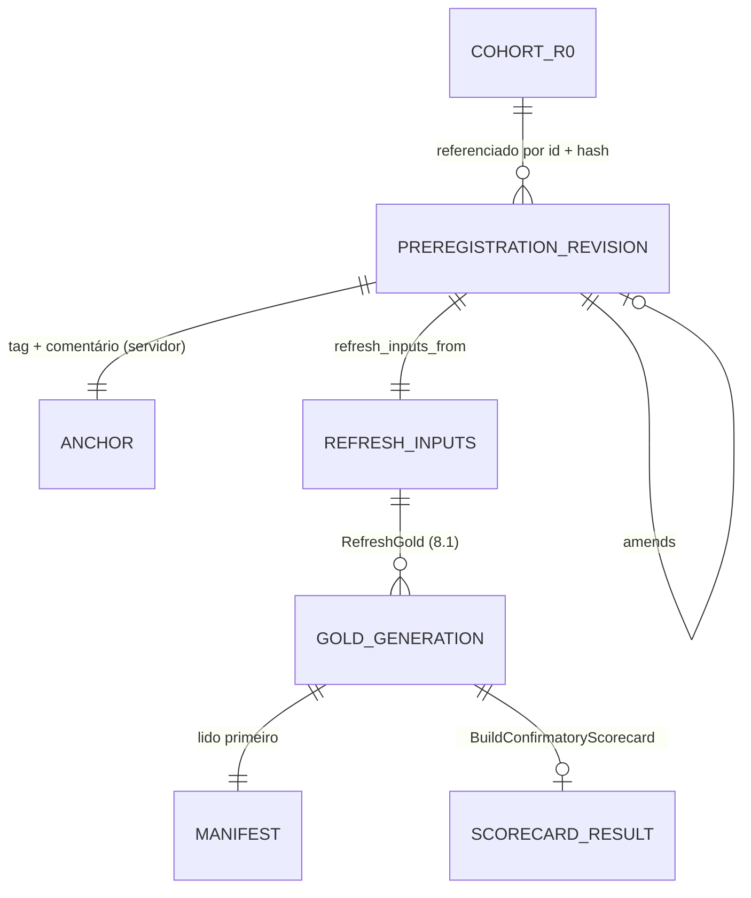

# Concept — Stage 6.5 — Pré-registro imutável e scorecard confirmatório

> **Escopo deste documento:** o que será feito nesta Stage, por quê, e
> decisões técnicas relevantes para entender o "porquê". O plano executável
> fica no [`technical.md`](./technical.md) correspondente.
>
> **Camada teórica.** A teoria é do doc de domínio
> [`probabilistic-forecast-evaluation.md`](../../domain/evaluation/probabilistic-forecast-evaluation.md)
> (`accepted`): §8 inteiro (o que o pré-registro congela, quando, a árvore do
> veredito, nunca agregar horizontes, critério de sucesso), mais os parâmetros
> pré-registráveis de §4.4, §5.1, §5.3, §6.1, §6.4, §6.5, §6.9, §7.4 e §7.6 e as
> convenções #2, #10, #12–#16b, #19, #22, #23 e #25–#30 da §10. Este concept não
> reabre nenhuma delas: fixa a forma do artefato, a leitura do gold, a
> composição do veredito e os valores que a teoria deixou para o pré-registro.
>
> **Estado deste rascunho.** Três decisões são **classe P** (do pesquisador) e
> ficam abertas em §13: o tratamento da exposição de cegamento da 6.4 (P1), o
> limiar de degeneração do gate (P2) e o desvio mínimo relevante do poder
> declarado (P3). O resto do concept funciona sob qualquer resposta; só o
> **conteúdo** do arquivo de pré-registro r0 (e, sob P1-B, o cohort que ele
> referencia) depende delas.

## 1. Escopo

### Dentro do escopo

Contratos em §4; decisões em §7.

- **Pré-registro como artefato canônico** (D1): arquivo
  `config/preregistration/<name>-r<rev>.toml` por revisão, lido por um port de
  saída (`PreregistrationSource`, adapter `tomllib`) e transformado no VO
  `Preregistration` (domínio da `evaluation`), com hash canônico pelo VO novo
  `PreregistrationHash` em `shared/domain/value_objects/` e
  `preregistration_ref = "<name>-r<rev>-<hash12>"`
  ([ADR 6.5.0001](../../adr/6_5_0001-preregistration-canonical-toml-hashed-value-object.md)).
- **Emenda** como revisão nova que aponta a anterior, justifica e declara se foi
  escrita cega; o original nunca é editado (D2,
  [ADR 6.5.0002](../../adr/6_5_0002-amendment-as-new-revision-file.md)).
- **Âncora** por tag publicada + comentário na issue (carimbo do servidor),
  registrada num arquivo separado fora do hash; o use case recusa plano sem
  âncora e marca como não pronto o gold gerado antes dela (D3,
  [ADR 6.5.0003](../../adr/6_5_0003-anchor-by-tag-and-issue-comment-and-order-check.md)).
- **Valores do pré-registro AAPL r0** (D4, D9): tudo o que julga — referência ao
  cohort, fonte do realizado, horizontes, grade, candidato e classes de
  comparadores, DM/Holm, MCS, gate H1, seeds, exclusões, forma do veredito,
  perfis, exposições de cegamento — com os valores de convenção fechados no
  [ADR 6.5.0009](../../adr/6_5_0009-preregistered-conventional-values.md) e três
  valores P abertos (§13).
- **Derivação única** `refresh_inputs_from(preregistration)` →
  `RefreshParameters` + todos os demais campos do `RefreshGoldCommand` (`asset`,
  `parent_sweep_id` = `cohort_id` referenciado, `horizons`, `window_deficits`,
  `dataset_fingerprint`) (D4,
  [ADR 6.5.0004](../../adr/6_5_0004-judging-values-in-preregistration-cohort-by-reference.md)).
- **Leitura do gold** pelo port do consumidor `GoldGenerationReader`,
  satisfeito pelo `ParquetGoldStore` (dono do layout): manifesto primeiro,
  inversa única da serialização do manifesto, sem inferência hive, tabela vazia
  pelo `rows_by_table`, `BLOCKED`/ausente recusado (D5,
  [ADR 6.5.0005](../../adr/6_5_0005-gold-generation-reader-port-manifest-first.md)).
- **Gate H1 e sensibilidades no domínio** sobre contagens médias entre seeds
  (Wilson 97,5 % por cauda do par 80 %, taxa de degeneração média ≤ limiar;
  LR_uc de 3 estados; partição DGT em h > 1; gate na amostra comum) e **poder
  exato** do gate contra os desvios pré-registrados (D6,
  [ADR 6.5.0006](../../adr/6_5_0006-scorecard-inputs-gate-from-seed-mean-counts.md)).
- **`ConfirmatoryScorecard`** (domínio): árvore H1 → H2 por horizonte, desfecho
  ordenado de H2, vencedor primário, critério de sucesso do estudo; perfil
  separado; `academic_decision_ready` como conjunção de gates de validade (D7,
  [ADR 6.5.0007](../../adr/6_5_0007-verdict-logical-form-and-decision-readiness.md)).
- **Use case `BuildConfirmatoryScorecard`** com erros nomeados e resultado DTO de
  serialização única (D8,
  [ADR 6.5.0008](../../adr/6_5_0008-profiles-declared-in-preregistration-built-where-inputs-exist.md)).
- **Congelamento e âncora do pré-registro AAPL r0** (arquivo, espelho
  `docs/preregistration/aapl_confirmatory.md`, teste de consistência com o
  cohort e com o espelho, tag e comentário) — depois de P1–P3 respondidas.
- **Wiring** no `composition_root`, **e2e** sintético e **redação do roadmap
  §Stage 6.5** (D10).

### Fora do escopo (explicitamente)

- **Execução do cohort confirmatório**, publicação do gold AAPL e do scorecard
  AAPL, e a gravação do scorecard como `gold_model_comparison_confirmatory_scorecard`
  → **8.1** (ADR 6.5.0008 item 5). A 6.5 **não** calcula nenhuma métrica sobre o
  `parent_sweep_id` do cohort: todo teste e o e2e usam silver sintético.
- **Perfis que exigem séries novas** — DM por fold, por seed e por τ; sensibilidades
  de bloco do MCS l = h e l = √T; degeneração parcial por par; p-valor Monte Carlo
  de Christoffersen → **issue de seguimento** no BC `evaluation`, a abrir pela
  sessão mestra, **antes da 8.1** (ADR 6.5.0008 item 3). Os parâmetros deles são
  pré-registrados **aqui**.
- **Diagrama de sharpness e plots** → **8.3**.
- **Tolerância de equivalência** → **8.2**.
- **Regras de H3 e do benchmark conformal (CQR):** também lidas pela 8.1, mas
  pré-registradas pelas Stages donas (variante do CQR na 7.2 — roadmap
  "Lacunas conhecidas", overview §11; leitura de H3 na 7.3). Este pré-registro
  cobre H1 e H2 (ADR 6.5.0008 item 6).
- **Reabrir hipóteses** ou o desenho do doc de domínio §8 (non_goal do roadmap).
- **Recomputar** DM/Holm/MCS/cobertura a partir do silver: o gold é a fonte.
- **Otimização do refresh** (≈ 19 s no cohort real, technical 6.4 §7).
- **Unificação da regra "int ≥ 0"** (inclui os pontos de chamada novos desta
  Stage, se houver) → **#118**. **Loggers desligados pelo `import-linter`** →
  **#125**.
- **Adapter-in (CLI)** do scorecard: nenhum consumidor o pede antes da 8.1.
- **Registro no OSF**: a âncora do projeto já dá carimbo de terceiro
  (ADR 6.5.0003, Alternativa B); pode ser somado depois sem mudança.

### Vínculo com o roadmap

Step 6 — "evidência confirmatória academicamente defensável e auditável"
([`roadmap.md`](../../roadmap.md)). A 6.5 fecha o Step: o gold da 6.4 existe,
mas nada congela **como se julga** nem aplica a regra. Sem pré-registro,
qualquer número do cohort violaria o cegamento (doc §8.2, B-ORDEM); sem
scorecard, os números não viram veredito. Entrega os objetivos H1/H2 do
[`overview.md`](../../overview.md) §4 como regra mecânica e o "scorecard
pré-registrado" do §7.

## 2. Objetivo da Stage

Ao final desta Stage existe, ancorado com carimbo do servidor antes de qualquer
métrica confirmatória, um pré-registro AAPL imutável e hasheado do qual sai, por
uma função única, tudo o que o refresh do gold precisa; e, dado um gold
`COMPLETED` produzido com esses valores, o use case `BuildConfirmatoryScorecard`
devolve, sem recomputar o que o gold tem, o veredito mecânico por horizonte —
gate H1 sobre contagens médias entre seeds, desfecho de H2, vencedor primário —
separado do perfil, com `academic_decision_ready` verdadeiro só quando todos os
gates de validade passam; gold de outro plano, sem âncora ou bloqueado não vira
scorecard.

## 3. Contexto e premissas

### Contexto

- **Gold da 6.4** (PR #126, em `develop`): por cohort, uma geração
  `gold/asset=<a>/parent_sweep_id=<p>/current/` com `MANIFEST.json` escrito por
  último (ADR 6.4.0005) e cinco tabelas — `gold_quality_checks`,
  `gold_metrics_by_run`, `gold_calibration_table`, `gold_dm_results`,
  `gold_mcs_results` —, as quatro confirmatórias com `preregistration_ref`. As
  chaves: `metrics_by_run` (model, seed, horizon, sample, metric, level_low,
  level_high); `calibration_table` (model, seed, horizon, sample, kind, levels,
  includes_degenerate, dgt_offset, dgt_step, band_level) com `n_violations`,
  `n_observed`, `degeneracy_rate`, Wilson, Kupiec, LR's; `dm_results`
  (horizon, variance_estimator, candidate, comparator) com `adjusted_p_value` e
  `rejected`; `mcs_results` (horizon, scheme, model) com `included` (código lido,
  `adapters/out/duckdb/gold_builders/`). Linhas por seed e por amostra
  (`model_full`, `common`); a média entre seeds e a escolha de amostra/variante
  são da 6.5 (ADR 6.4.0007).
- **`RefreshParameters`** (ADR 6.4.0006) não tem default; `RefreshGoldCommand`
  pede também `horizons`, `window_deficits` e `dataset_fingerprint`
  (ADR 6.4.0009). Hoje só testes os preenchem, com literais.
- **Leitura do gold** (technical 6.4 §7 `[finding]` Task 08; roadmap §Stage 6.5):
  o pyarrow infere partições hive do caminho e falha ao unir com as colunas
  `asset`/`parent_sweep_id`; tabela com zero linhas é gravada com schema vazio.
- **Cohort r0** (`config/cohorts/aapl_confirmatory.toml`, ADR 5.5.0001):
  `cohort_id = aapl_confirmatory-r0-665f45d9169a`, horizontes (1, 7), grade
  (0,02; 0,1; 0,25; 0,5; 0,75; 0,9; 0,98), seeds do TFT 1..10, 6 folds × 252,
  `dataset_fingerprint = 00e4406d…`; âncora = tag `cohort/aapl_confirmatory-r0-665f45d9169a`
  + comentário na #102. h+30 está fora do cohort por decisão do humano (concept
  5.5 §1). Corrida medida: ~19 h de CPU (technical 5.5 §7).
- **Medição da 6.4 sobre o cohort real** (technical 6.4 §7): `COMPLETED`, zero
  achados de alinhamento com `window_deficits = {}`, `degeneracy_rate`
  REPORTED em 32 séries (valores não lidos).
- **Exposição de cegamento** (technical 6.4 §7 `[finding]`; comentário na #127):
  a medição A15 da 6.4 **computou** as quatro tabelas confirmatórias sobre uma
  cópia do cohort r0 antes deste pré-registro, num container efêmero descartado;
  foram impressos só status, durações, contagens, `grid_trimmed_prefix`,
  igualdade de fingerprint, resumo do realizado e os checks agrupados por
  contagem — **nenhum** valor de métrica, p-valor ou taxa. Pela letra do doc
  §8.2 ("computar métricas confirmatórias é" violação) é uma exposição →
  fork P1.
- **Kernels de contagem da 6.3** aceitam contagens médias reais
  (`WilsonBand.evaluate`, `lr_uc_three_state`, `chi_square_sf`; ADR 6.3.0005).
- **Hash:** `check_layout` regra 6 só permite `hash_mapping` em
  `shared/domain/value_objects/` (precedentes `CohortHash`, `DatasetContentFingerprint`).

### Premissas

- A árvore H1 → H2 e todas as convenções citadas no cabeçalho estão
  ratificadas (doc de domínio `accepted`, ADRs 0.0.0010/0.0.0011); o concept só as
  compõe.
- Os nomes de modelo no gold são `dim_run.model_version`: `tft_quantile`
  (candidato), `gbm_quantile` e `baseline_<família>` (código dos escritores,
  concept 6.4 §3).
- n efetivo por horizonte ≈ 6 × 252 = 1 512 pontos não-degenerados (pode ser
  menor em h+7 pela interseção); a ordem de grandeza orienta o poder, o valor
  exato é medido pelo scorecard.
- Nenhum valor de métrica do cohort foi observado por ninguém (registro da 6.4);
  por isso as convenções C desta Stage continuam do agente (skill
  `evidence-resolution` §1: C vira P só depois de haver dado confirmatório
  **visto**). Se P1 concluir outra coisa, a regra vale para as decisões abertas.

### Dependências

- `6.4-gold-builders-and-quality-gates` (`done`, PR #126): tabelas gold,
  `GoldManifest`/`RefreshParameters`/`RefreshGoldCommand`/`GoldTable`/
  `GoldPartition`, `GoldStore`/`ParquetGoldStore`/`InMemoryGoldStore`,
  `RefreshGold`, os validadores públicos donos.
- `5.5-confirmatory-retrain` (`done`, PR #121): cohort congelado, `CohortHash`,
  âncora na #102, `DatasetContentFingerprint`.
- 6.1–6.3 (`done`): `WilsonBand`, `lr_uc_three_state`, `chi_square_sf`,
  `HitKind`, `DmVarianceEstimator`, `BootstrapScheme`, validadores.
- 1.4 (`Hasher`, ADR 1.4.0001), shared `Clock` (não usado pelo scorecard).

## 4. Contratos

### Introduzidos

Shared (`shared/domain/value_objects/`):

- **`PreregistrationHash`** (`value-object`) — espelho do `CohortHash`:
  `value: str` (sha256 hex);
  `compute(*, hasher: Hasher, payload: Mapping[str, object]) -> PreregistrationHash`
  sobre o payload inteiro.

Domínio (`evaluation/domain/`):

- **`Preregistration`** (`value-object`, `value_objects/preregistration.py`) —
  frozen, com VOs aninhados por bloco do doc §8.1 (nomes finais na Fase 3B):
  `name`, `revision`; `CohortReference` (`cohort_id`, `cohort_hash`);
  `RealizedSource` (`dataset_fingerprint`); `horizons: tuple[int, ...]`;
  `quantile_levels: tuple[float, ...]`; `candidate: str`;
  `ComparatorClasses` (`naive`, `strong`: tuplas de modelos, disjuntas, união =
  a família); `DmSpec` (`alpha`, `primary_estimator`, `sensitivity_estimators`);
  `McsSpec` (`alpha`, `statistic`, `reps`, `seed`, `primary_scheme`,
  `sensitivity_schemes`, `block_sensitivities`); `H1GateSpec` (`lower_level`,
  `upper_level`, `gate_band_level`, `profile_band_level`,
  `degeneracy_threshold` **[P2]**, `degeneracy_tolerance`,
  `power_scenarios: tuple[TailDeviation, ...]` **[P3]**, `sensitivity_alpha`);
  `SeedAggregation` (`seeds`); `window_deficits: Mapping[str, int]`;
  `min_violations`; `MonteCarloSpec` (`draws`, `seed`); `ProfileSpec` (os
  perfis declarados, ADR 6.5.0008 item 1); `blinding_exposures:
  tuple[BlindingExposure, ...]` **[P1]** (`date`, `stage`, `computed`,
  `observed`, `disposal`, `impact`; pode ser vazia);
  `Amendment | None` (`amends`, `justification`, `blind_status`).
  ```python
  @classmethod
  def from_mapping(cls, mapping: Mapping[str, object]) -> Preregistration: ...
  def as_payload(self) -> dict[str, object]: ...   # serialização canônica única
  def reference(self, digest: PreregistrationHash) -> str: ...  # "<name>-r<rev>-<hash12>"
  ```
  `from_mapping` recusa chave desconhecida ou ausente e valida pelos
  validadores públicos donos; `from_mapping(as_payload()) == self`.
- **`TailDeviation`** (`value-object`) — cenário de desvio do poder: `label`,
  `lower_rate`, `upper_rate` (taxas verdadeiras de violação por cauda).
- **Evidência por horizonte** (`value-objects`, `value_objects/scorecard_evidence.py`):
  `SeedTailCounts` (`seed`, `n_violations`, `n_observed`, `degeneracy_rate`),
  `TailEvidence` (as contagens por seed de uma cauda, com as sub-séries DGT
  quando h > 1), `DmEvidence` (`comparator`, `estimator`, `adjusted_p_value`,
  `rejected`), `McsEvidence` (`scheme`, `model`, `included`),
  `HorizonEvidence` (horizonte, as duas caudas nas duas amostras, DM, MCS).
- **`H1Gate`** (`domain-service`, `services/h1_gate.py`) —
  `evaluate(spec: H1GateSpec, evidence: HorizonEvidence) -> H1Result`: médias
  entre seeds, `WilsonBand` a 97,5 % por cauda, degeneração média ≤ limiar;
  sensibilidades LR_uc de 3 estados, DGT (h > 1) e amostra comum; divergências
  listadas; o `H1Result` carrega n̄, o T comum do horizonte e o aviso de
  dependência serial (h > 1).
- **`H1GatePower`** (`domain-service`, `services/h1_gate_power.py`) —
  `failure_probability(*, n: int, spec: H1GateSpec, deviation: TailDeviation) -> float`
  (multinomial exata de 3 células; aceitação = as duas bandas contêm o nominal).
- **`ConfirmatoryScorecard`** (`domain-service`,
  `services/confirmatory_scorecard.py`) —
  `decide(prereg: Preregistration, evidence: Sequence[HorizonEvidence]) -> ScorecardVerdict`.
  Result VOs: `H1Result`, `H2Outcome` (`NOT_APPLICABLE`,
  `NO_SKILL_OVER_NAIVE`, `BEATS_NAIVE_ONLY`, `BEATS_NAIVE_TIES_STRONG`,
  `BEATS_NAIVE_AND_STRONG`), `HorizonVerdict` (`horizon`, `h1`, `beats_naive`,
  `beats_or_ties_strong`, `in_mcs`, `h2`, `primary_winner: str | None`),
  `ScorecardVerdict` (`horizons`, `study_success_h1: bool`).

Application (`evaluation/application/`):

- **`PreregistrationSource`** (`port-out`,
  `ports/out/preregistration_source.py`) —
  ```python
  class PreregistrationSource(Protocol):
      def read(self, *, name: str, revision: int) -> PreregistrationRecord: ...
  ```
  `PreregistrationRecord` (DTO): `payload: Mapping[str, object]`,
  `anchor: PreregistrationAnchor | None` (`tag`, `commit`, `comment_url`,
  `anchored_at: datetime` com fuso). Revisão inexistente →
  `PreregistrationNotFoundError`.
- **`GoldGenerationReader`** (`port-out`,
  `ports/out/gold_generation_reader.py`) —
  `read(*, partition: GoldPartition) -> GoldGeneration`; `GoldGeneration` (DTO):
  `manifest: GoldManifest`, `tables: Mapping[str, GoldTable]`.
- **DTOs** (`dtos/refresh_gold.py`, aditivos): `GoldManifest.from_mapping`,
  `RefreshParameters.from_mapping` (inversas únicas de `as_mapping`); as chaves de
  cada tabela gold como constante pública única, consumida pelo builder e pelo
  leitor.
- **DTOs** (`dtos/confirmatory_scorecard.py`): `RefreshInputs`
  (`asset`, `parent_sweep_id` — o `cohort_id` referenciado, que **é** o
  `parent_sweep_id` do cohort (ADR 5.5.0001) —, `parameters`, `horizons`,
  `window_deficits`, `dataset_fingerprint`; `to_command()` monta o
  `RefreshGoldCommand`) e
  `refresh_inputs_from(prereg, reference) -> RefreshInputs`;
  `BuildConfirmatoryScorecardCommand` (`name`, `revision`,
  `preregistration_ref` esperado) — **sem** partição: a partição lida é a
  derivada do plano;
  `ScorecardProfile`; `ScorecardResult` (`preregistration_ref`,
  `revision_chain`, `anchor`, `blinding_exposures`, `verdict: ScorecardVerdict`,
  `profile`, `academic_decision_ready: bool`, `readiness_reasons: tuple[str, ...]`,
  `as_mapping()` — serialização única).
- **Erros** (`ApplicationError`, no módulo do use case):
  `PreregistrationHashMismatchError`, `PreregistrationChainError`,
  `PreregistrationNotAnchoredError`, `PreregistrationMismatchError`,
  `GoldNotReadyError`; e, do leitor, `GoldManifestNotFoundError`,
  `GoldGenerationCorruptError`.
- **`BuildConfirmatoryScorecard`** (`use case`) —
  `__call__(command) -> ScorecardResult`; construtor recebe
  `PreregistrationSource`, `GoldGenerationReader` e `Hasher`.

Adapters (`evaluation/adapters/out/`):

- **`TomlPreregistrationSource`** (`toml/toml_preregistration_source.py`) —
  lê `<root>/<name>-r<rev>.toml` e `<root>/<name>-r<rev>.anchor.toml` com
  `tomllib`; raiz injetada.
- **`ParquetGoldStore.read_generation`** (`duckdb/parquet_gold_store.py`,
  aditivo) — satisfaz `GoldGenerationReader`; `InMemoryGoldStore` idem.

Artefatos versionados:

- `config/preregistration/aapl_confirmatory-r0.toml` e
  `config/preregistration/aapl_confirmatory-r0.anchor.toml`;
- `docs/preregistration/aapl_confirmatory.md` (espelho).

### Consumidos

- `GoldManifest`, `RefreshParameters`, `RefreshGoldCommand`, `GoldPartition`,
  `GoldTable`, `RefreshStatus`, `ParquetGoldStore`, `InMemoryGoldStore`,
  `RefreshGold` (no e2e) — 6.4.
- `WilsonBand`, `lr_uc_three_state`, `chi_square_sf`, `HitKind`,
  `validate_min_violations`, `validate_rate` — 6.3; `DmVarianceEstimator`,
  `BootstrapScheme`, `validate_alpha`, `validate_mcs_reps`,
  `validate_bootstrap_parameters` — 6.2; `validate_tolerance` — 6.1.
- `Hasher` (1.4); `CohortHash` e o carregador do arquivo de cohort da
  `modeling` **só no teste de consistência** (ADR 6.5.0004 item 3).

## 5. Invariantes e regras

- **I1 — Um artefato canônico por revisão.** Os números que julgam vêm só do
  TOML da revisão; o espelho `.md` é narrativo e cita o hash completo de cada
  revisão; um teste recalcula o hash de todo arquivo de revisão e exige a
  citação.
- **I2 — Imutabilidade.** Qualquer campo alterado muda o hash (propriedade
  testada campo a campo); arquivo de revisão ancorada nunca é editado; emenda =
  revisão nova com `amends` = o `preregistration_ref` da anterior.
- **I3 — Identidade por VO de shared.** Só o `PreregistrationHash` chama
  `hash_mapping` (`check_layout` regra 6); `preregistration_ref` é formado por
  uma função só, no VO.
- **I4 — Ordem.** O use case valida, nesta ordem, antes de ler o gold: cadeia de
  revisões (r0 sem campos de emenda; r ≥ 1 com `amends` igual à referência
  calculada da anterior), hash da revisão julgada igual ao `preregistration_ref`
  do comando, âncora de toda revisão da cadeia presente.
- **I5 — Uma derivação.** `RefreshParameters` e todos os demais campos do
  `RefreshGoldCommand` (inclusive a partição `asset`/`parent_sweep_id` =
  `cohort_id` referenciado) saem só de `refresh_inputs_from`; o scorecard lê a
  partição derivada do plano e compara o manifesto lido com essa derivação campo
  a campo, e as seeds e os níveis presentes nas linhas gold com os
  pré-registrados (nenhum dos dois está no manifesto), antes de qualquer
  veredito.
- **I6 — Manifesto primeiro.** Nenhuma tabela é lida antes do manifesto;
  partição sem manifesto não existe para o leitor; tabela com zero linhas vem do
  `rows_by_table`; leitura sem inferência hive.
- **I7 — Nada recomputado do que o gold tem.** O scorecard só calcula: médias
  entre seeds das contagens e da degeneração, Wilson/LR_uc de 3 estados/DGT
  sobre essas médias, o poder, e a lógica do veredito. DM, Holm, MCS e as
  métricas vêm das tabelas.
- **I8 — Por horizonte.** Todo resultado é de um horizonte; nenhum campo
  agrega horizontes (doc §8.7); o critério de sucesso "≥ 1 horizonte" é uma
  contagem de gates, não uma agregação de métricas (doc §8.8).
- **I9 — Só o candidato é filtrado.** O gate H1 decide só a elegibilidade do
  candidato; a família de Holm e o MCS são os seis comparadores + candidato
  mesmo que um comparador reprove a própria calibração (doc §6.4).
- **I10 — n nunca é S·T.** O n da banda é a média entre seeds dos pontos
  não-degenerados de **um** conjunto alinhado (doc §4.4, §6.9).
- **I11 — O perfil nunca troca o veredito.** `ScorecardVerdict` é construído
  antes e sem o `ScorecardProfile`; nenhum campo do veredito lê o perfil.
- **I12 — Prontidão ≠ vitória.** `academic_decision_ready` não depende do
  desfecho de H1/H2; cada conjunto falso gera uma razão nomeada.
- **I13 — Sem default.** Nenhum valor do pré-registro tem default em código; o
  que o TOML não declara é erro.
- **I14 — Nenhuma métrica sobre o cohort nesta Stage.** Testes e e2e usam silver
  sintético; a Stage não chama `RefreshGold` sobre o `parent_sweep_id` do cohort.

## 6. Casos de erro e exceções

- **C1 — Pré-registro malformado** (chave desconhecida/ausente, valor fora do
  validador dono, classes de comparadores sobrepostas ou que não cobrem a
  família, candidato numa classe, seeds repetidas, `window_deficits` sem um
  modelo ou negativo, campos de emenda em r0 ou ausentes em r ≥ 1) →
  `ValueError` de `Preregistration.from_mapping`, com a mensagem do validador
  dono.
- **C2 — Revisão inexistente** → `PreregistrationNotFoundError` do source.
- **C3 — Hash divergente** (o `preregistration_ref` do comando ≠ o calculado) →
  `PreregistrationHashMismatchError`, antes de ler o gold.
- **C4 — Cadeia quebrada** (`amends` ≠ referência da anterior; revisão
  intermediária ausente) → `PreregistrationChainError`.
- **C5 — Revisão sem âncora** → `PreregistrationNotAnchoredError`.
- **C6 — Partição sem manifesto** → `GoldManifestNotFoundError`; tabela do
  `rows_by_table` ausente, contagem divergente, ou linhas esperadas faltando
  (seed sem cauda, comparador sem DM, esquema sem MCS) →
  `GoldGenerationCorruptError`.
- **C7 — Gold `BLOCKED`** → `GoldNotReadyError` com os checks que bloquearam.
- **C8 — Gold de outro plano ou de outro cohort** (partição,
  `preregistration_ref`, parâmetros, horizontes, déficits ou fingerprint do
  manifesto ≠ derivação do plano; seed a mais ou a menos, ou nível da grade
  diferente, nas linhas gold) →
  `PreregistrationMismatchError` nomeando o campo.
- **C9 — Candidato 100 % degenerado** num horizonte → não é erro: banda "não
  aplicável", gate reprova, H2 `NOT_APPLICABLE`.
- **C10 — Gold anterior à âncora** ou **emenda cega = não** → não é erro:
  scorecard produzido com `academic_decision_ready = false` e a razão.
- **C11 — Erro de programação** → propaga.

## 7. Decisões técnicas relevantes

> Triagem `evidence-resolution` (2026-09-29): os forks antecipados na issue
> #127 (C1–C8) fecham como E/C com ADR `accepted`, mais três forks que emergiram
> desta sessão (6.5-PAIR, 6.5-POWER, 6.5-VERDICT/READY, 6.5-VALUES, 6.5-EMIT).
> As fontes externas citadas já foram conferidas no texto bruto pelo subagente
> da issue (#127, "Teóricas"); o cálculo de poder foi conferido nesta sessão
> contra a tabela do doc §8.5 (T = 500: calibrado 0,959; locação 0,2σ 0,160;
> 0,3σ 0,004; cobertura 75 % 0,420; 85 % 0,464 — reproduzidos). Três forks são
> **P** e ficam em §13: P1, P2, P3.

### D1 — Pré-registro: TOML canônico por revisão → VO → hash de shared (fork C1)

- **O quê:** ADR 6.5.0001 inteiro; o VO fica em `value_objects/` (não em
  `services/`, como o roadmap escrevia): não tem comportamento além de validar e
  serializar.
- **Por quê:** um dono para os valores e para a regra de hash; o espelho não
  deriva em silêncio; mesmo padrão do cohort.
- **Fonte:** ADR 5.5.0001; `check_layout` regra 6; ADR 1.4.0001; doc §8.1.
- **ADR:** [`6.5.0001`](../../adr/6_5_0001-preregistration-canonical-toml-hashed-value-object.md)

### D2 — Emenda como revisão nova (fork C3)

- **O quê:** ADR 6.5.0002; emenda `unblinded` ⇒ veredito exploratório
  (`academic_decision_ready = false`).
- **Por quê:** ICH E9 §4.5/§5.1; OSF "Update" com justificativa; Wagenmakers et al.
  2012 (só o pré-declarado é confirmatório).
- **Fonte:** issue #127 (fontes verificadas); doc §8.1, §8.3.
- **ADR:** [`6.5.0002`](../../adr/6_5_0002-amendment-as-new-revision-file.md)

### D3 — Âncora e prova de ordem (fork C2)

- **O quê:** ADR 6.5.0003: tag `preregistration/<ref>` + comentário na issue da
  Stage (o `created_at` do servidor é a âncora), registro em
  `<name>-r<rev>.anchor.toml`; o use case recusa plano sem âncora e marca como
  não pronto gold com `started_at` anterior à âncora. A prova de ordem desta Stage
  é a sequência de carimbos do servidor (âncora do cohort na #102 < âncora do
  pré-registro na #127) mais a declaração de que a 6.5 não calcula métrica sobre o
  cohort; a exposição da 6.4 é declarada conforme P1.
- **Por quê:** hash prova integridade, não anterioridade; o carimbo do cliente é
  forjável (ADR 5.5.0001); o consumidor do plano existe, então as checagens
  baratas moram nele.
- **Fonte:** ADR 5.5.0001; Mertens & Krypotos 2019; Cramer et al. 2022 (issue #127).
- **ADR:** [`6.5.0003`](../../adr/6_5_0003-anchor-by-tag-and-issue-comment-and-order-check.md)

### D4 — Valores que julgam no pré-registro; cohort por referência (fork C5)

- **O quê:** ADR 6.5.0004: o pré-registro traz a referência ao cohort
  (`cohort_id` + hash), a fonte do realizado (`dataset_fingerprint`), horizontes,
  grade, candidato e classes, `window_deficits` explícitos por modelo e todos os
  `RefreshParameters`; `refresh_inputs_from` é a derivação única; teste de
  consistência com o arquivo do cohort; o scorecard confere o manifesto.
- **Por quê:** papel de cada hash (doc §8.2); o déficit de janela muda T —
  tolerância de julgamento, logo "como".
- **Fonte:** doc §8.1, §8.2; ADR 6.4.0006, 6.4.0009, 0.0.0053.
- **ADR:** [`6.5.0004`](../../adr/6_5_0004-judging-values-in-preregistration-cohort-by-reference.md)

### D5 — Leitor do gold: port do consumidor, real no dono do layout (fork C4)

- **O quê:** ADR 6.5.0005: `GoldGenerationReader` satisfeito por
  `ParquetGoldStore.read_generation`; `GoldManifest.from_mapping` como inversa
  única; `partitioning=None`; zero linhas pelo manifesto; chaves das tabelas
  numa constante pública compartilhada por builder e leitor; `BLOCKED` devolvido
  e recusado pelo use case.
- **Por quê:** as regras de leitura valem para todo consumidor (6.5, 8.1, 8.3);
  o layout já tem dono; uma classe de leitura à parte repetiria o layout.
- **Fonte:** ADR 6.4.0005; technical 6.4 §7 `[finding]` Task 08; roadmap §Stage 6.5.
- **ADR:** [`6.5.0005`](../../adr/6_5_0005-gold-generation-reader-port-manifest-first.md)

### D6 — Gate H1 sobre contagens médias entre seeds; sensibilidades; poder exato (forks C6, C8)

- **O quê:** ADR 6.5.0006: gate nas linhas `lower_tail` τ = 0,10 e
  `upper_tail` τ = 0,90 do candidato, amostra `model_full`, variante mascarada
  (`includes_degenerate = false`), série inteira; médias de `n_violations`,
  `n_observed` e `degeneracy_rate` entre seeds; Wilson 97,5 % por cauda; 95 % e a
  amostra comum no perfil; LR_uc de 3 estados (χ²(2), α 0,05) e partição DGT
  (nível 1 − 0,05/(2h)) sobre as mesmas médias; poder = probabilidade exata de
  reprovar sob cada `TailDeviation` pré-registrado, em n = round(n̄).
  A estimativa da banda é c̄/n̄ (razão de médias, a entrada dos kernels —
  ADR 6.3.0005), não a média das taxas por seed que o doc §6.9 escreve; as duas
  só diferem se a degeneração variar entre seeds, e a média das taxas vai ao
  perfil ao lado.
- **Por quê:** a regra é do doc (B-GATE-H1, B-BANDAS, B-SEEDS, B-H7); a amostra
  `model_full` é a mais conservadora para um claim de não-rejeição (degrau 4); o
  poder exato é o que o doc usou.
- **Fonte:** doc §4.4, §5.3, §6.9, §7.4, §8.5; ADR 6.3.0004, 6.3.0005, 6.4.0007.
- **ADR:** [`6.5.0006`](../../adr/6_5_0006-scorecard-inputs-gate-from-seed-mean-counts.md)

### D7 — Forma do veredito, vencedor primário e prontidão

- **O quê:** ADR 6.5.0007: classes naive = {`baseline_zero_return`,
  `baseline_historical_mean`}, fortes = {`baseline_ar1`, `baseline_ewma_vol`,
  `baseline_historical_quantiles`, `gbm_quantile`} (o nível ML do overview entra
  na classe forte, como no doc §6.4 alternativa d); família de
  Holm = os seis; desfecho ordenado de H2; vencedor primário = candidato se H1 ∧
  (i) ∧ (ii), com (ii) = no MCS primário ∨ supera todos os fortes; sucesso do
  estudo = H1 em ≥ 1 horizonte; `academic_decision_ready` = gold `COMPLETED` sem
  check bloqueante/pulado ∧ gold depois da âncora ∧ nenhuma emenda não-cega —
  nunca o desfecho.
- **Por quê:** é a forma que o doc §8.6 dá como exemplo e a leitura do overview
  §4 ("superar ou empatar com os fortes"; "empatar" = MCS, doc §6.10);
  refutação é resultado válido (overview §1).
- **Nota para o Checkpoint A:** é a decisão mais próxima de um claim. Foi
  fechada como **C** (degrau 1) porque só operacionaliza o que o overview e o
  doc já ratificaram; o revisor pode promovê-la a P se discordar.
- **Fonte:** doc §6.4, §6.10, §8.6–§8.8; overview §1, §4; FDA 2022 (issue #127).
- **ADR:** [`6.5.0007`](../../adr/6_5_0007-verdict-logical-form-and-decision-readiness.md)

### D8 — Perfis: declarados agora, construídos onde há insumo; scorecard emitido como DTO (fork C7)

- **O quê:** ADR 6.5.0008: o pré-registro declara todo perfil com parâmetros;
  a 6.5 constrói o que o gold tem + sensibilidades do gate + poder + efeito do DM
  com IC (doc §6.8); perfis de séries novas (inclusive o diagnóstico de
  estacionariedade de d_t de B-FOLDS) → issue de seguimento antes da 8.1; sharpness → 8.3; o
  `ScorecardResult` tem `as_mapping()` único e a 8.1 o grava como
  `gold_model_comparison_confirmatory_scorecard`.
- **Por quê:** o perfil não troca o veredito, então **quando** é calculado não
  afeta o claim desde que **o quê** tenha sido declarado antes (ICH E9 §5.1); a
  Stage já está no teto de Tasks.
- **Fonte:** ADR 6.4.0007 item 5; concept 6.4 §Fora do escopo; roadmap §Stage 8.1.
- **ADR:** [`6.5.0008`](../../adr/6_5_0008-profiles-declared-in-preregistration-built-where-inputs-exist.md)

### D9 — Valores de convenção do pré-registro r0

- **O quê:** ADR 6.5.0009 (tabela): `dm_alpha` 0,05; DM unilateral, retangular
  (registro) + Bartlett; MCS `R`, α 0,10, 1 000 reps, estacionário + moving-block,
  bloco max(h, ⌈máx b̂_sb⌉) com l = h e √T; `mcs_seed` 127; bandas 0,975/0,95; par
  (0,10; 0,90); `min_violations` 2; tolerância 1e-12; Monte Carlo 999 sorteios,
  seed 128; seeds 1..10; déficits 0; sem exclusões; sem T mínimo extra.
- **Por quê:** cada valor tem degrau ou fonte na tabela do ADR; os três sem
  convenção ficam para o humano (§13).
- **Fonte:** doc §10; ADRs 0.0.0010, 0.0.0011, 6.2.0005; Christoffersen &
  Pelletier 2004 §5; HLN 2011 §5.1.
- **ADR:** [`6.5.0009`](../../adr/6_5_0009-preregistered-conventional-values.md)

### D10 — Pedido de mudança de roadmap (aplicado no PR desta Stage)

- **O quê**, na linha da 6.5:
  - `camada_alvo`: `multi (domain + application + adapters/out)`;
  - `arquivos_a_criar`: troca `domain/services/preregistration.py` por
    `domain/value_objects/{preregistration.py, scorecard_evidence.py}`; soma
    `shared/domain/value_objects/preregistration_hash.py`,
    `domain/services/{h1_gate.py, h1_gate_power.py}` (o
    `confirmatory_scorecard.py` segue), `application/ports/out/{preregistration_source.py,
    gold_generation_reader.py}`, `application/dtos/confirmatory_scorecard.py`,
    `adapters/out/toml/toml_preregistration_source.py`,
    `config/preregistration/aapl_confirmatory-r0{.toml,.anchor.toml}`, fakes,
    contratos e o e2e (nomes finais na Fase 3B);
  - `arquivos_a_modificar`: `application/dtos/refresh_gold.py` (inversas
    `from_mapping`), `adapters/out/duckdb/parquet_gold_store.py` e o fake
    (`read_generation`), os cinco builders (chave como constante pública),
    `composition_root.py`, arquivos de arquitetura (port-coverage, pureza);
  - `contratos_introduzidos`: `Preregistration`, `PreregistrationHash`,
    `TailDeviation`, VOs de evidência (value-objects), `H1Gate`, `H1GatePower`,
    `ConfirmatoryScorecard` (domain-services), `PreregistrationSource`,
    `GoldGenerationReader` (ports-out), `BuildConfirmatoryScorecard` (use case);
  - `contratos_consumidos`: sai a lista de 6.1–6.3 como recomputação; entram
    "tabelas gold + manifesto (6.4) via `GoldGenerationReader`",
    `RefreshParameters`/`GoldManifest` (6.4), `WilsonBand`,
    `lr_uc_three_state`, `chi_square_sf` (6.3, sobre contagens médias), `Hasher`
    (1.4), cohort r0 por referência (5.5);
  - descrição humana: o scorecard é emitido como resultado e gravado pela 8.1;
  - §Stage 8.1: depende também da issue de seguimento dos perfis (ADR 6.5.0008)
    e dos pré-registros de H3 (7.3) e do CQR (7.2);
  - §Stage 8.2: `docs/preregistration/aapl_confirmatory.md` sai de
    `arquivos_a_modificar` como edição livre — o espelho só recebe seções
    acrescentadas por revisão (ADR 6.5.0001 item 6).
- **Fonte:** issue #127 item 7; technical 6.4 §7 `[finding]` Encaminhamentos
  (a); PIPELINE (roadmap editado pela Stage dona).

## 8. Integrações

### Internas (com outras Stages/módulos)

- **6.4 (mesmo BC):** o leitor é método novo do `ParquetGoldStore` (e do
  `InMemoryGoldStore`); as inversas `from_mapping` moram ao lado de
  `as_mapping`; as chaves dos builders viram constantes públicas lidas por
  builder e leitor. Nenhuma regra de montagem ou de relatório muda.
- **8.1:** chama `refresh_inputs_from` para montar o `RefreshGoldCommand`, roda o
  refresh, chama `BuildConfirmatoryScorecard` e grava o `ScorecardResult`;
  posta o comentário do primeiro refresh confirmatório (fecho da prova de ordem).
- **modeling (5.5):** só por referência (id + hash no pré-registro); o teste de
  consistência lê o arquivo do cohort pelo carregador da `modeling` — em teste,
  nunca em `src/evaluation`.
- **shared:** `PreregistrationHash` (novo) e `Hasher`.
- **composition_root:** monta `TomlPreregistrationSource(root=<raiz>/config/preregistration)`,
  o `ParquetGoldStore` já existente (como leitor) e o `Hasher`.

### Externas

- **`tomllib`** (stdlib) só no adapter `toml/`; **pyarrow** só em
  `adapters/out/duckdb/` (`store-no-storage-leak`).
- **GitHub** (tag + comentário): passo manual do runbook da Task de
  congelamento; o carimbo do comentário é a âncora. Nenhuma chamada de rede no
  código.

## 9. Modelo de dados

Pré-registro (TOML, uma revisão por arquivo; blocos = VOs aninhados):

| Bloco | Conteúdo | Origem do valor |
|---|---|---|
| identidade | `name`, `revision`; em r ≥ 1: `amends`, `justification`, `blind_status` | ADR 6.5.0001/0002 |
| `cohort` | `cohort_id`, `cohort_hash` | cohort r0 (ou r1 sob P1-B) |
| `realized` | `dataset_fingerprint` | cohort; ADR 6.4.0009 |
| julgamento | `horizons`, `quantile_levels`, `candidate`, `comparators.naive`, `comparators.strong`, `window_deficits` | cohort; ADR 6.5.0007, 6.5.0009 |
| `dm` | `alpha`, `primary_estimator`, `sensitivity_estimators` | ADR 6.5.0009 |
| `mcs` | `statistic`, `alpha`, `reps`, `seed`, `primary_scheme`, `sensitivity_schemes`, `block_sensitivities` | ADR 6.5.0009 |
| `h1_gate` | par, níveis de banda, `degeneracy_threshold`, `degeneracy_tolerance`, `power_scenarios`, `sensitivity_alpha` | ADR 6.5.0006/0009; **P2, P3** |
| `seeds` | lista | cohort |
| `backtests` | `min_violations`, `monte_carlo.draws`, `monte_carlo.seed` | ADR 6.5.0009 |
| `profiles` | perfis declarados e parâmetros | ADR 6.5.0008 |
| `blinding_exposures` | lista de {data, Stage, o que foi computado, o que foi observado, descarte, impacto} | **P1** |

Âncora (`<name>-r<rev>.anchor.toml`, fora do hash): `tag`, `commit`,
`comment_url`, `anchored_at`.



## 10. Riscos e mitigações

| Risco | Probabilidade | Impacto | Mitigação |
|---|---|---|---|
| Valor do pré-registro escolhido depois de ver resultado | B | A | Nenhum valor foi observado (registro da 6.4); âncora antes de qualquer refresh confirmatório; o scorecard recusa plano sem âncora e marca gold anterior a ela; P1 decide a exposição |
| Espelho `.md` diverge do TOML | M | M | Teste recalcula o hash de toda revisão e exige a citação no espelho (I1) |
| Pré-registro diverge do cohort (fingerprint, horizontes, grade) | B | A | Teste de consistência com o arquivo e o hash do cohort (ADR 6.5.0004 item 3) |
| Gold feito com outros parâmetros lido como confirmatório | B | A | Comparação manifesto × `refresh_inputs_from` antes do veredito (C8) |
| Leitor de gold lê geração parcial, bloqueada ou com schema vazio | B | A | Manifesto primeiro; `BLOCKED` recusado; zero linhas pelo manifesto; `partitioning=None`; contrato `[fake, real]` |
| Média entre seeds feita com n = S·T | B | A | I10; teste com S = 2 compara com a banda calculada à mão |
| Poder com n inteiro × gate com n̄ real | M | B | Arredondamento declarado no relatório (ADR 6.5.0006) |
| Gate por não-rejeição sem garantia de tamanho condicional | — | M | Declarado no espelho (ADR 6.5.0007, Negative); o poder é reportado |
| Âncora é passo manual (tag, comentário) | M | M | Runbook na Task de congelamento; o use case exige o registro da âncora |
| P1–P3 sem resposta bloqueiam o congelamento | M | M | Todo o resto é construível e testável com um pré-registro de teste; só a Task de congelamento espera |
| Stage densa | M | M | 12 Tasks (§12); perfis de séries novas fora (ADR 6.5.0008) |

## 11. Critérios de aceitação

- [ ] `Preregistration.from_mapping` recusa chave desconhecida, chave ausente e
      cada valor inválido pela mensagem do validador dono (um teste por bloco);
      `from_mapping(as_payload(p)) == p`; alterar **qualquer** campo folha do
      payload muda o `PreregistrationHash` (teste paramétrico sobre todas as
      folhas — `tests/unit/features/evaluation/test_preregistration_immutable_hash.py`);
      `preregistration_ref` = `"<name>-r<rev>-<hash[:12]>"`; revisão 0 com campos
      de emenda e revisão ≥ 1 sem eles erguem.
- [ ] `check_layout` verde: `hash_mapping` só no `PreregistrationHash` (e nos VOs
      já existentes).
- [ ] `refresh_inputs_from(prereg)` devolve `RefreshParameters` que constrói sem
      erro e cujos campos são exatamente os do pré-registro (teste por campo),
      mais `horizons`, `window_deficits` e `dataset_fingerprint`.
- [ ] `H1GatePower` reproduz a tabela do doc §8.5 em n = 500 com três casas
      (calibrado → reprova 0,041; locação 0,2σ → 0,840; 0,3σ → 0,996; cobertura
      75 % → 0,580; 85 % → 0,536).
- [ ] `H1Gate`: com S = 2 seeds, as bandas usam as contagens médias e o n médio
      (nunca S·T) e batem com `WilsonBand` chamado à mão; degeneração média acima
      do limiar reprova com bandas contendo o nominal; banda não aplicável
      reprova; LR_uc de 3 estados e DGT (h > 1, nível 1 − 0,05/(2h)) calculados
      das mesmas médias; divergência gate × sensibilidade listada nos dois
      sentidos; h = 1 sem DGT.
- [ ] `ConfirmatoryScorecard.decide` (`tests/unit/features/evaluation/test_scorecard_mechanical_rule.py`):
      um teste por desfecho (`NOT_APPLICABLE`, `NO_SKILL_OVER_NAIVE`,
      `BEATS_NAIVE_ONLY`, `BEATS_NAIVE_TIES_STRONG`, `BEATS_NAIVE_AND_STRONG`) e
      pelo vencedor primário; H1 reprovado com DM todo rejeitado dá
      `NOT_APPLICABLE` e sem vencedor; comparador que reprova a própria
      calibração continua na leitura de H2; horizontes independentes (mudar a
      evidência de h = 7 não muda o veredito de h = 1); `study_success_h1` =
      "≥ 1 horizonte com H1"; o veredito é idêntico com e sem perfil construído.
- [ ] `BuildConfirmatoryScorecard` com fakes: ordem I4 (hash divergente, cadeia
      quebrada e revisão sem âncora erguem **sem** chamar o leitor do gold);
      `GoldNotReadyError` para `BLOCKED`; `PreregistrationMismatchError` para cada
      campo do manifesto alterado (partição inclusive) e para seed extra ou nível
      de grade diferente nas linhas; `GoldGenerationCorruptError` para seed sem
      cauda, comparador sem DM e esquema sem MCS; `academic_decision_ready`
      falso, com a razão, para gold anterior à âncora, emenda `unblinded` e check
      `SKIPPED`; verdadeiro com H1 reprovado em todos os horizontes (refutação
      pronta).
- [ ] `PreregistrationSource` e `GoldGenerationReader` têm fake e suíte de
      contrato `[fake, real]` (`TomlPreregistrationSource` com revisão
      inexistente, anchor ausente e presente; `ParquetGoldStore` com tabela de
      zero linhas, geração `BLOCKED`, manifesto ausente e ida-e-volta
      `publish` → `read_generation` com igualdade de manifesto e de linhas);
      `GoldManifest.from_mapping(as_mapping(m)) == m`; `check_port_coverage`
      verde sem entrada nova no baseline.
- [ ] E2E (`tests/integration/features/evaluation/test_build_confirmatory_scorecard.py`),
      silver sintético (≥ 2 horizontes, candidato com 2 seeds, os seis
      comparadores): pré-registro de teste → `refresh_inputs_from` →
      `RefreshGold` real → `BuildConfirmatoryScorecard` real lendo o Parquet →
      veredito esperado por construção do silver; o mesmo gold com um parâmetro
      alterado no pré-registro, ou com uma seed a mais no plano →
      `PreregistrationMismatchError`; o comando do refresh sai inteiro de
      `refresh_inputs_from` (partição = `cohort_id` do plano).
- [ ] Pré-registro AAPL r0 congelado (P1–P3 respondidas): arquivo válido; teste
      de consistência com o cohort r0 (hash, fingerprint, horizontes, grade) e com
      o espelho (hash completo citado) verde; tag
      `preregistration/<ref>` publicada e comentário na #127 com ref, hash, tag,
      commit e cohort; `anchor.toml` gravado; o §7 do technical registra os
      carimbos do servidor da âncora do cohort (#102) e do pré-registro (#127) na
      ordem e que nenhuma métrica sobre o cohort foi calculada pela 6.5.
- [ ] `lint-imports` verde; nenhum import de runtime de `modeling` em `src/`
      da `evaluation`; `tomllib` só em `adapters/out/toml/`, `pyarrow` só em
      `adapters/out/duckdb/`.
- [ ] Roadmap §Stage 6.5 (e a dependência da 8.1) reescritos conforme D10.
- [ ] `make check` verde (gate de saída).

## 12. Checklist de validação interna

- [x] Todos os contratos introduzidos têm assinatura definida? — §4; os nomes
      finais dos VOs aninhados e das colunas do `ScorecardResult` ficam para a
      Fase 3B (não persistidos por esta Stage).
- [x] Toda decisão em §7 tem fonte rastreável? — cada D cita doc/ADR/código.
- [x] Toda integração externa tem contrato definido (interface, formato, auth)?
      — `tomllib` e pyarrow só nos adapters; GitHub é passo manual (sem auth em
      código).
- [x] Decisões com alternativa real descartada têm ADR escrito? — ADRs
      6.5.0001–6.5.0009 (`accepted`); D10 aplica pedido sem alternativa real.
- [x] Dependências de Stages anteriores estão satisfeitas (`done`)? — 6.4 (PR
      #126) e 5.5 (PR #121) em `develop`.
- [x] Stage cabe em ~3–12 Tasks (ver [`CONVENTIONS.md`](../../CONVENTIONS.md) §6)? — estimativa 12: (1) `PreregistrationHash` + `Preregistration` e VOs; (2) `H1Gate` + `H1GatePower`; (3) VOs de evidência + `ConfirmatoryScorecard`; (4) inversas `from_mapping` + chaves públicas + `refresh_inputs_from` + DTOs do scorecard; (5) port `PreregistrationSource` + fake; (6) `TomlPreregistrationSource` + contrato; (7) port `GoldGenerationReader` + fake; (8) `ParquetGoldStore.read_generation` + contrato; (9) use case + erros; (10) wiring + e2e; (11) congelamento e âncora do r0 (depois de P1–P3); (12) roadmap.
- [x] Riscos críticos têm mitigação plausível? — §10.
- [x] Cada mecanismo novo passou pelo **teste da solução mais direta**: não é caso especial/tipo/métrica novo remendando, local, um sintoma que recorre em outros consumidores e teria tratamento mais simples/geral em outra camada (concern compartilhado). Captura assim → piso declarado + issue, não solução local. — A identidade do pré-registro usa o padrão existente de hash por VO de shared (`CohortHash`), sem esquema novo de imutabilidade nem hash feito à mão; a âncora é a da 5.5; a leitura do gold, concern de todo consumidor (6.5, 8.1, 8.3), fica no adapter que já é dono do layout, com a inversa do manifesto ao lado da sua serialização única e as chaves das tabelas numa constante compartilhada por escritor e leitor; o scorecard não recomputa DM/Holm/MCS nem cobertura (o gold é a fonte) e o gate usa os kernels de contagem da 6.3, que já aceitam contagens médias; os parâmetros do refresh saem de uma única função a partir do plano, e o manifesto é conferido contra ela em vez de reespecificado; a consistência com o cohort é um teste, não uma leitura cruzada de BC em produção; os perfis que pediriam séries novas não ganham atalho local — vão para uma issue que reusa `SeriesAssembly` e os serviços da 6.2/6.3; o poder é o único cálculo novo e é o que o doc já fez à mão.
- [x] O canal de emissão das métricas novas está declarado (último quilômetro)?
      — o `ScorecardResult` tem serialização única e é gravado pela 8.1 como
      `gold_model_comparison_confirmatory_scorecard` (ADR 6.5.0008); poder e
      sensibilidades são campos dele.
- [x] A Stage calcula alguma métrica sobre o cohort confirmatório? — não (I14);
      a exposição da 6.4 é tratada por P1.
- [ ] As três decisões P (§13) estão respondidas? — **não**: abertas até o
      Checkpoint A; o concept não passa a `done` sem elas.

## 13. Questões em aberto

Decisões **classe P** (do pesquisador). O formato completo (contexto,
abordagens, exemplos, trade-offs) vai ao humano no Checkpoint A. Até a
resposta, o bloco correspondente do pré-registro r0 fica sem valor e a Task de
congelamento não roda; nada mais do concept muda.

- [ ] **P1 — Tratamento da exposição de cegamento da 6.4** (medição A15:
      tabelas confirmatórias do cohort r0 computadas e descartadas sem nenhum
      valor lido). Abordagens: **(A) aceitar como exposição nula e declará-la no
      pré-registro** (bloco `blinding_exposures`, com data, Stage, o que foi
      computado, o que foi e não foi observado, descarte e impacto) —
      **(Recomendada)**: custo zero, e a transparência pedida por Nosek et al.
      2018 ("Challenge 3") e ICH E9 §5.1 é exatamente declarar; (B) novo cohort
      r1 com **seeds novas** do TFT, re-treino (~19 h de CPU) depois do
      pré-registro, e r0 declarado como histórico exposto — GBM e baselines são
      determinísticos e dariam os mesmos números; (C) nova revisão com as mesmas
      seeds — formalidade de ganho quase nulo (GBM e baselines reproduzem os
      números já computados; o TFT com as mesmas seeds em CPU provavelmente
      também — não medido). Sob qualquer opção o concept é o mesmo; muda o `cohort`
      referenciado (B) e o conteúdo de `blinding_exposures`.
- [ ] **P2 — Limiar de degeneração do gate H1** (doc §5.3 item 4: taxa média de
      linhas com a grade colapsada acima da qual o candidato reprova H1; sem
      convenção na área). Abordagens: 0 %; **1 % (Recomendada)**; 5 %; 10 %.
- [ ] **P3 — Desvio mínimo relevante do poder declarado** (B1, doc §8.5: contra
      o quê o gate diz "não rejeitado"; só muda o que se reporta, não o
      veredito). Abordagens: **±5 p.p. na cobertura do par de 80 % (largura) +
      deslocamento de locação de 0,2σ — o exemplo do doc (Recomendada)**; ±3 p.p.
      + 0,1σ; ±10 p.p. + 0,3σ. Em n ≈ 1 512 o poder calculado nesta sessão é:
      largura ±5 p.p. → 0,975/0,989; ±3 p.p. → 0,637/0,647; locação 0,2σ → 1,000;
      0,1σ → 0,750.

## 14. Referências

- [`../../overview.md`](../../overview.md) — §1, §4 (H1/H2), §7
- [`../../roadmap.md`](../../roadmap.md) — Stage `6.5-preregistration-and-scorecard` e vizinhas 6.4, 8.1, 8.3
- Doc de domínio [`probabilistic-forecast-evaluation.md`](../../domain/evaluation/probabilistic-forecast-evaluation.md)
  §4.4, §5.1, §5.3, §6.1, §6.4, §6.5, §6.7–§6.10, §7.4, §7.6, §8, §10
- Concepts [6.4](../6.4-gold-builders-and-quality-gates/concept.md) (§Fora do
  escopo, §7 "Encaminhamentos para a 6.5", §8),
  [5.5](../5.5-confirmatory-retrain/concept.md); technical §7 de
  [6.4](../6.4-gold-builders-and-quality-gates/technical.md) (`[finding]` Task 08,
  Encaminhamentos, Medição no cohort real, Exposição de cegamento) e
  [5.5](../5.5-confirmatory-retrain/technical.md) (custo medido)
- ADRs desta Stage: [`../../adr/`](../../adr/) (prefixo `6_5_`); consumidos:
  0.0.0010, 0.0.0011, 0.0.0052, 0.0.0053, 1.4.0001, 5.4.0001, 5.5.0001, 5.5.0004,
  6.1.0003, 6.2.0005, 6.3.0004, 6.3.0005, 6.3.0006, 6.4.0005, 6.4.0006, 6.4.0007,
  6.4.0009
- Issues [#127](https://github.com/MarceloSanC/financial-forecasting/issues/127),
  [#102](https://github.com/MarceloSanC/financial-forecasting/issues/102),
  [#118](https://github.com/MarceloSanC/financial-forecasting/issues/118),
  [#125](https://github.com/MarceloSanC/financial-forecasting/issues/125)
- ICH E9 (1998) §4.5, §5.1, §5.5; Nosek et al. (2018), PNAS, doi:10.1073/pnas.1708274114;
  Mertens & Krypotos (2019), doi:10.5334/pb.493; Van den Akker et al. (2021),
  doi:10.15626/MP.2020.2625; Bracher et al. (2021), doi:10.1038/s41467-021-25207-0;
  Cramer et al. (2022), doi:10.1038/s41597-022-01517-w; FDA (2022), *Multiple
  Endpoints in Clinical Trials*; Diebold, Gunther & Tay (1998) §6
